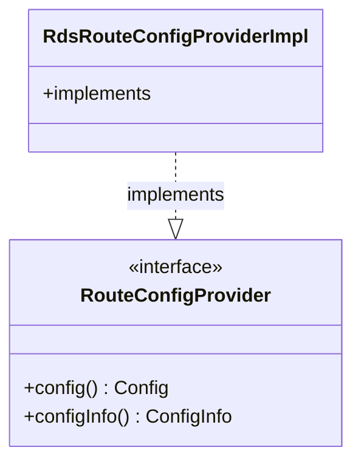

# Part 90: RouteConfigProvider

**File:** `envoy/rds/route_config_provider.h`  
**Namespace:** `Envoy::Rds`

## Summary

`RouteConfigProvider` is the interface for route configuration providers. It returns `Config` and `ConfigInfo`. Implemented by static and RDS providers.

## UML Diagram

## Important Functions

| Function | One-line description |
|----------|----------------------|
| `config()` | Returns route config. |
| `configInfo()` | Returns config metadata. |
