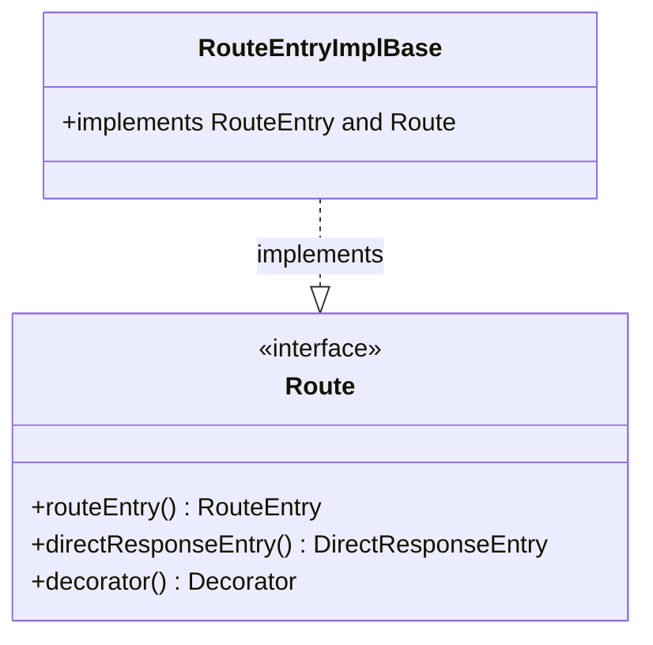

# Part 91: Route

**File:** `envoy/router/router.h`  
**Namespace:** `Envoy::Router`

## Summary

`Route` is the interface for a matched route. It provides route entry, direct response, decorator, and per-route config. Returned by `Config::route()`.

## UML Diagram

## Important Functions

| Function | One-line description |
|----------|----------------------|
| `routeEntry()` | Returns route entry. |
| `directResponseEntry()` | Returns direct response. |
| `decorator()` | Returns tracing decorator. |
