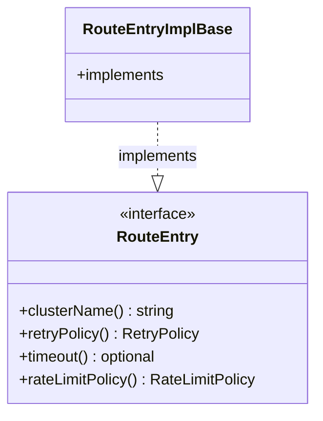

# Part 92: RouteEntry

**File:** `envoy/router/router.h`  
**Namespace:** `Envoy::Router`

## Summary

`RouteEntry` is the interface for route action details: cluster name, retry policy, timeout, rate limit, hash policy. Implemented by `RouteEntryImplBase`.

## UML Diagram

## Important Functions

| Function | One-line description |
|----------|----------------------|
| `clusterName()` | Returns upstream cluster. |
| `retryPolicy()` | Returns retry policy. |
| `timeout()` | Returns route timeout. |
| `rateLimitPolicy()` | Returns rate limit config. |
