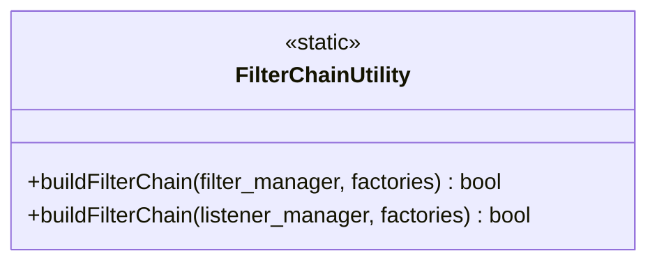

# Part 93: FilterChainUtility

**File:** `source/server/configuration_impl.h`, `source/common/http/filter_chain_helper.h`  
**Namespace:** `Envoy::Server`, `Envoy::Http`

## Summary

`FilterChainUtility` provides static helpers to build filter chains. `buildFilterChain` creates listener, network, or HTTP filter chains from factories. Used during connection setup.

## UML Diagram

## Important Functions

| Function | One-line description |
|----------|----------------------|
| `buildFilterChain(filter_manager, factories)` | Builds network filter chain. |
| `buildFilterChain(listener_manager, factories)` | Builds listener filter chain. |
| `buildUdpFilterChain(...)` | Builds UDP filter chain. |
