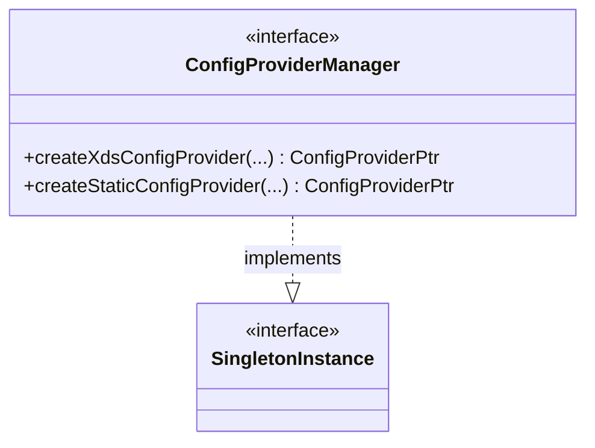

# Part 94: ConfigProviderManager

**File:** `envoy/config/config_provider_manager.h`  
**Namespace:** `Envoy::Config`

## Summary

`ConfigProviderManager` creates static and dynamic (xDS) config providers. It implements `Singleton::Instance` and manages shared subscriptions. Used for RDS, CDS, etc.

## UML Diagram

## Important Functions

| Function | One-line description |
|----------|----------------------|
| `createXdsConfigProvider(...)` | Creates xDS config provider. |
| `createStaticConfigProvider(...)` | Creates static config provider. |
