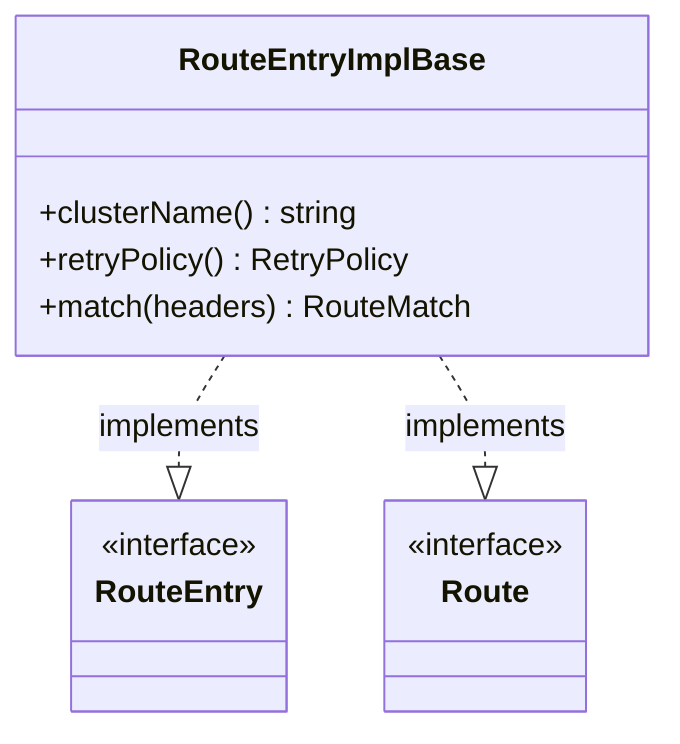

# Part 95: RouteEntryImplBase

**File:** `source/common/router/config_impl.h`  
**Namespace:** `Envoy::Router`

## Summary

`RouteEntryImplBase` implements both `RouteEntry` and `Route`. It holds cluster name, retry policy, timeout, rate limit, and path matching. Base for route implementations.

## UML Diagram

## Important Functions

| Function | One-line description |
|----------|----------------------|
| `clusterName()` | Returns cluster name. |
| `retryPolicy()` | Returns retry policy. |
| `match(headers)` | Matches request to route. |
