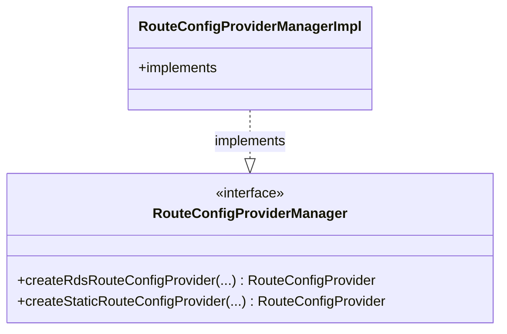

# Part 96: RouteConfigProviderManager

**File:** `envoy/router/route_config_provider_manager.h`  
**Namespace:** `Envoy::Router`

## Summary

`RouteConfigProviderManager` manages route config providers. It creates and caches RDS/static providers, sharing subscriptions when config sources match.

## UML Diagram

## Important Functions

| Function | One-line description |
|----------|----------------------|
| `createRdsRouteConfigProvider(...)` | Creates RDS provider. |
| `createStaticRouteConfigProvider(...)` | Creates static provider. |
