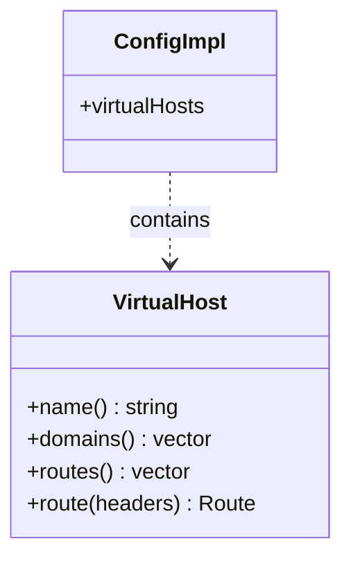

# Part 97: VirtualHost

**File:** `envoy/router/router.h`, `source/common/router/config_impl.h`  
**Namespace:** `Envoy::Router`

## Summary

`VirtualHost` represents a virtual host in route config. It holds routes, domains, and per-vhost config. Used by `ConfigImpl` for route matching.

## UML Diagram

## Important Functions

| Function | One-line description |
|----------|----------------------|
| `name()` | Returns virtual host name. |
| `domains()` | Returns domain list. |
| `route(headers)` | Finds route in vhost. |
