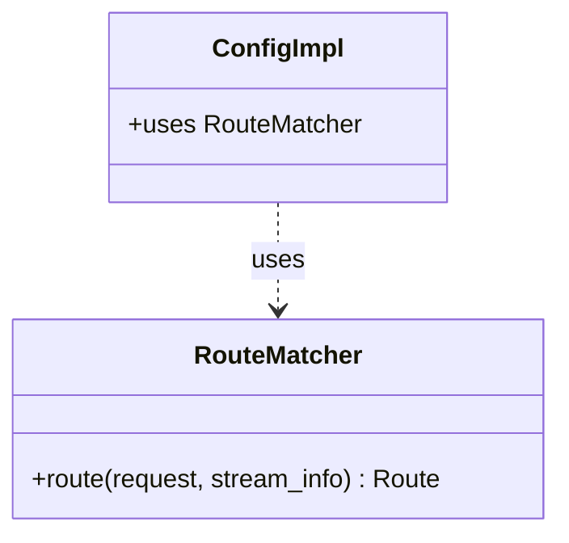

# Part 98: RouteMatcher

**File:** `source/common/router/config_impl.h`  
**Namespace:** `Envoy::Router`

## Summary

`RouteMatcher` matches requests to routes. It selects virtual host by authority, then finds route by path/headers. Used internally by `ConfigImpl`.

## UML Diagram

## Important Functions

| Function | One-line description |
|----------|----------------------|
| `route(request, stream_info)` | Finds matching route. |
