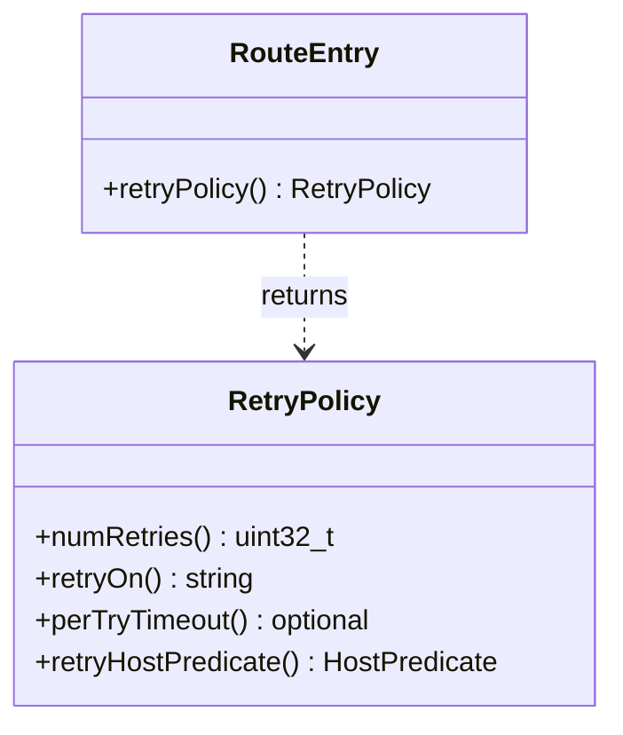

# Part 99: RetryPolicy

**File:** `envoy/router/router.h`  
**Namespace:** `Envoy::Router`

## Summary

`RetryPolicy` defines retry behavior: retry-on conditions, num retries, per-try timeout, retry host predicate. Used by `RouteEntry` for upstream retries.

## UML Diagram

## Important Functions

| Function | One-line description |
|----------|----------------------|
| `numRetries()` | Returns max retries. |
| `retryOn()` | Returns retry conditions. |
| `perTryTimeout()` | Returns per-try timeout. |
