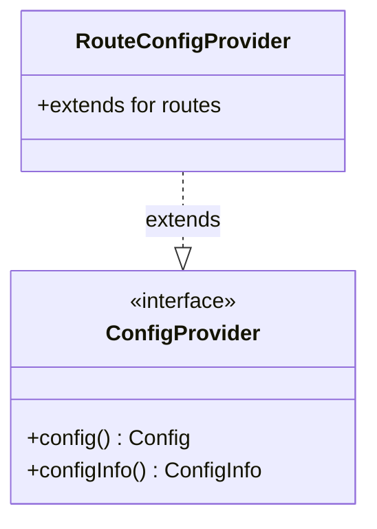

# Part 100: ConfigProvider

**File:** `envoy/config/config_provider.h`  
**Namespace:** `Envoy::Config`

## Summary

`ConfigProvider` is the interface for configuration providers. It returns immutable config and config info. Used by RDS, CDS, and other xDS/static config consumers.

## UML Diagram

## Important Functions

| Function | One-line description |
|----------|----------------------|
| `config()` | Returns current config. |
| `configInfo()` | Returns config metadata. |
