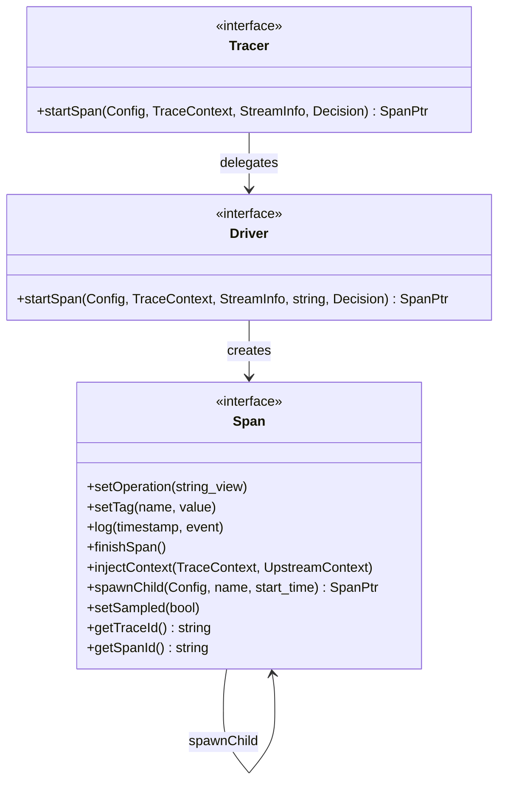

# Tracing: Tracer, Span, Driver

**Files:** `envoy/tracing/tracer.h`, `envoy/tracing/trace_driver.h`  
**Implementation:** `source/common/tracing/`, `source/extensions/tracers/`

## Summary

Envoy's tracing system provides distributed tracing for request correlation. `Tracer` delegates to `Driver` implementations (Zipkin, Jaeger, OpenTelemetry, etc.). Each `Span` represents a unit of work; spans form a tree via `spawnChild`. Tracing integrates with the HTTP connection manager and router filter.

## UML Diagram



## Key Classes (from source)

### Tracer (`envoy/tracing/tracer.h`)

```cpp
class Tracer {
  virtual SpanPtr startSpan(const Config& config, TraceContext& trace_context,
      const StreamInfo::StreamInfo& stream_info,
      Tracing::Decision tracing_decision) PURE;
};
```

### Span (`envoy/tracing/trace_driver.h`)

| Method | Purpose |
|--------|---------|
| `setOperation(name)` | Set span operation name |
| `setTag(name, value)` | Attach metadata |
| `log(timestamp, event)` | Record event |
| `finishSpan()` | Complete span, export if sampled |
| `injectContext(trace_context, upstream)` | Inject trace headers for propagation |
| `spawnChild(config, name, start_time)` | Create child span |
| `setSampled(bool)` | Override sampling decision |
| `getTraceId()` / `getSpanId()` | IDs for correlation |

### Driver (`envoy/tracing/trace_driver.h`)

| Method | Purpose |
|--------|---------|
| `startSpan(...)` | Create driver-specific span |

## Integration Points

- **HTTP Connection Manager:** Calls `tracer->startSpan()` in `ActiveStream`; tags span with response code, duration.
- **Router Filter:** Creates child span for upstream; calls `injectContext` on request headers.
- **StreamInfo:** `StreamInfo` passed to `startSpan` for timing, route, upstream metadata.

## Source References

- `source/common/tracing/http_tracer_impl.cc` — HTTP integration
- `source/extensions/tracers/zipkin/` — Zipkin driver
- `source/extensions/tracers/opentelemetry/` — OpenTelemetry driver
