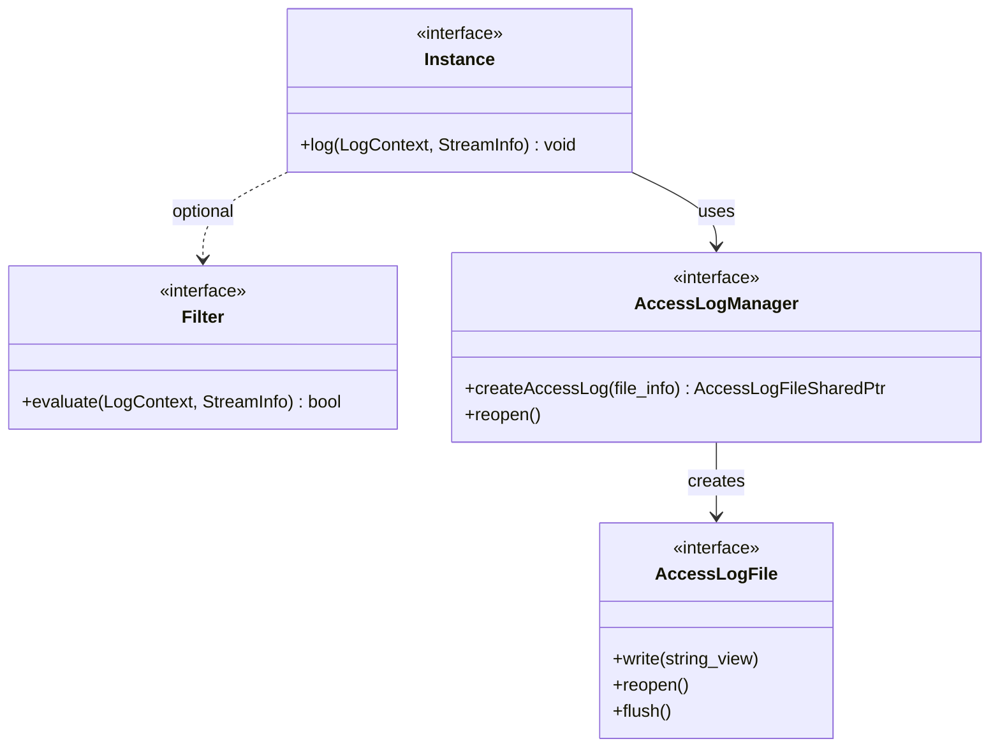

# Access Logs: Instance, Filter, AccessLogManager

**Files:** `envoy/access_log/access_log.h`  
**Implementation:** `source/common/access_log/`, `source/extensions/access_loggers/`

## Summary

Access logs record request/connection information. `AccessLog::Instance` is the interface for log writers (file, gRPC, stdout, OpenTelemetry). `AccessLog::Filter` optionally filters which requests get logged. `AccessLogManager` manages file handles and reopening. `AccessLogType` controls when logs are emitted (DownstreamEnd, DownstreamPeriodic, etc.).

## UML Diagram



## Key Classes (from source)

### AccessLog::Instance (`envoy/access_log/access_log.h`)

```cpp
class Instance {
  virtual void log(const LogContext& context,
      const StreamInfo::StreamInfo& stream_info) PURE;
};
```

### AccessLog::Filter (`envoy/access_log/access_log.h`)

```cpp
class Filter {
  virtual bool evaluate(const LogContext& context,
      const StreamInfo::StreamInfo& info) const PURE;
};
```

### AccessLogManager (`envoy/access_log/access_log.h`)

```cpp
class AccessLogManager {
  virtual void reopen() PURE;
  virtual absl::StatusOr<AccessLogFileSharedPtr> createAccessLog(
      const Envoy::Filesystem::FilePathAndType& file_info) PURE;
};
```

## AccessLogType (from `envoy/data/accesslog/v3/accesslog.proto`)

| Value | When emitted |
|-------|--------------|
| `DownstreamEnd` | Request complete |
| `DownstreamStart` | Request started |
| `DownstreamPeriodic` | Periodic flush |
| `TcpConnectionEnd` | TCP connection closed |
| `UpstreamEnd` | Upstream response complete |
| etc. | See proto for full list |

## Flow

1. **ConnectionManagerImpl / ActiveStream** calls `log(AccessLogType)` on registered instances.
2. **Instance** evaluates `Filter::evaluate()`; if true, formats and writes.
3. **Formatter** uses `StreamInfo` and `LogContext` for format strings (e.g. `%REQ(:path)%`).

## Source References

- `source/common/access_log/access_log_manager_impl.cc`
- `source/extensions/access_loggers/file/` — File access log
- `source/extensions/access_loggers/open_telemetry/` — OTLP access log
