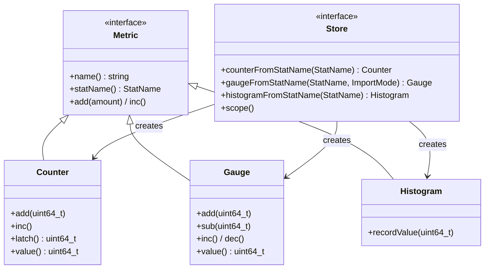

# Stats: Store, Counter, Gauge, Histogram, SymbolTable

**Files:** `envoy/stats/stats.h`, `envoy/stats/store.h`  
**Implementation:** `source/common/stats/`

## Summary

Envoy's stats subsystem provides low-overhead metrics. Uses thread-local storage and lock-free recording. `Stats::Store` is the interface; `ThreadLocalStoreImpl` is the implementation. `Counter` (monotonic), `Gauge` (up/down), `Histogram` (latency). `SymbolTable` encodes stat names for memory efficiency.

## UML Diagram



## Key Classes (from source)

### Counter (`envoy/stats/stats.h`)

```cpp
class Counter : public Metric {
  virtual void add(uint64_t amount) PURE;
  virtual void inc() PURE;
  virtual uint64_t latch() PURE;  // Get & reset period counter
  virtual uint64_t value() const PURE;
};
```

### Gauge (`envoy/stats/stats.h`)

```cpp
class Gauge : public Metric {
  enum class ImportMode { NeverImport, Accumulate, ... };
  virtual void add(uint64_t amount) PURE;
  virtual void sub(uint64_t amount) PURE;
  virtual uint64_t value() const PURE;
};
```

### Thread-Local Design

- Each worker thread has its own allocator; stats are recorded lock-free.
- Periodic merge aggregates into parent store for admin `/stats` and sinks.
- `latch()` on Counter returns periodic delta for export (e.g. Prometheus).

## Source References

- `source/common/stats/thread_local_store.cc` — ThreadLocalStoreImpl
- `source/common/stats/allocator_impl.cc` — AllocatorImpl
- `source/common/stats/symbol_table.cc` — SymbolTable
