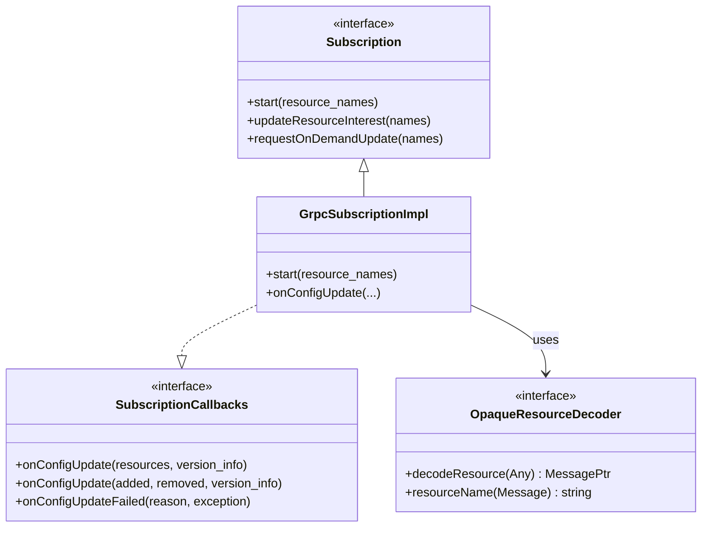

# Subscription and SubscriptionCallbacks

**Files:** `envoy/config/subscription.h`  
**Implementation:** `source/extensions/config_subscription/grpc/grpc_subscription_impl.h`

## Summary

`Subscription` is the interface for fetching xDS resources (LDS, RDS, CDS, EDS, etc.). `SubscriptionCallbacks` receives `onConfigUpdate` and `onConfigUpdateFailed`. `GrpcSubscriptionImpl` adapts typed subscriptions to the untyped `GrpcMux`. Resources are decoded via `OpaqueResourceDecoder`.

## UML Diagram



## Key Classes (from source)

### Subscription (`envoy/config/subscription.h`)

```cpp
class Subscription {
  virtual void start(const absl::flat_hash_set<std::string>& resource_names) PURE;
  virtual void updateResourceInterest(const absl::flat_hash_set<std::string>&) PURE;
  virtual void requestOnDemandUpdate(const absl::flat_hash_set<std::string>&) PURE;
};
```

### SubscriptionCallbacks (`envoy/config/subscription.h`)

```cpp
class SubscriptionCallbacks {
  virtual absl::Status onConfigUpdate(
      const std::vector<DecodedResourceRef>& resources,
      const std::string& version_info) PURE;
  virtual absl::Status onConfigUpdate(
      const std::vector<DecodedResourceRef>& added,
      const Protobuf::RepeatedPtrField<std::string>& removed,
      const std::string& system_version_info) PURE;
  virtual void onConfigUpdateFailed(
      ConfigUpdateFailureReason reason,
      const EnvoyException* e) PURE;
};
```

### ConfigUpdateFailureReason

| Value | Meaning |
|-------|---------|
| `ConnectionFailure` | Could not connect to xDS server |
| `FetchTimedout` | Fetch timed out |
| `UpdateRejected` | Update rejected (validation failed) |

## Source References

- `source/extensions/config_subscription/grpc/grpc_subscription_impl.cc`
- `source/common/rds/rds_route_config_subscription.cc` — RDS example
