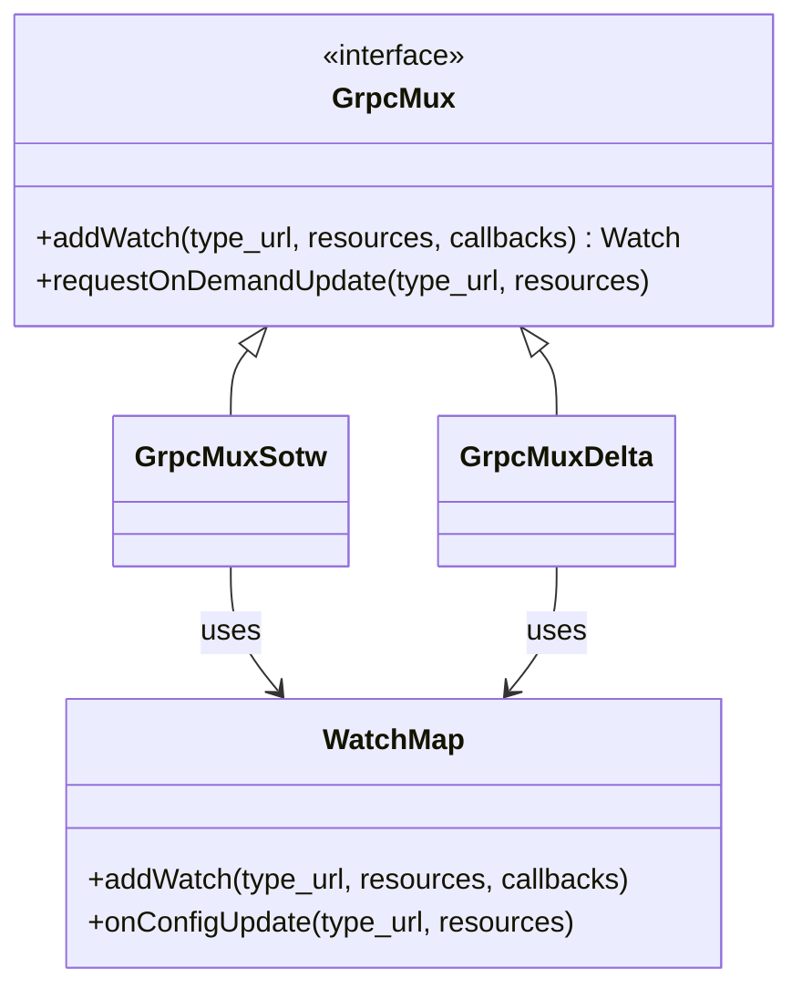

# GrpcMux and xDS Transport

**Files:** `envoy/config/grpc_mux.h`  
**Implementation:** `source/extensions/config_subscription/grpc/xds_mux/`

## Summary

`GrpcMux` manages the gRPC stream to the xDS server. `GrpcMuxSotw` (State-of-the-World) and `GrpcMuxDelta` handle SotW vs Delta xDS protocols. `WatchMap` routes incoming resources to interested watches. Multiple type_urls can be multiplexed over a single stream (ADS).

## UML Diagram

## Key Concepts (from source)

### GrpcMux (`envoy/config/grpc_mux.h`)

- `addWatch(type_url, resource_names, callbacks)` — Subscribe to resources.
- `requestOnDemandUpdate(type_url, resource_names)` — Request delta update.

### Protocol Variants

| Class | Protocol | Use case |
|-------|----------|----------|
| GrpcMuxSotw | State-of-the-World | Full snapshot per response |
| GrpcMuxDelta | Delta | Incremental adds/removes |

### ADS (Aggregated Discovery Service)

- Single bidirectional gRPC stream for all type_urls.
- `XdsManagerImpl` creates ADS mux; LDS, RDS, CDS, EDS share it.

## Source References

- `source/extensions/config_subscription/grpc/xds_mux/grpc_mux_impl.h`
- `source/extensions/config_subscription/grpc/watch_map.h`
- `source/common/config/xds_manager_impl.cc`
