# Part 1: Core Runtime & Bootstrapping

## Series Navigation

| Part | Topic |
|------|-------|
| **Part 1** | **Core Runtime & Bootstrapping** (this document) |
| Part 2 | [xDS & Dynamic Configuration](./02-xDS-and-Dynamic-Configuration.md) |
| Part 3 | [Istio-to-Envoy Mapping](./03-Istio-to-Envoy-Mapping.md) |
| Part 4 | [EnvoyFilter, Sidecar vs Gateway](./04-EnvoyFilter-Sidecar-vs-Gateway.md) |

---

## Overview

This document covers how Envoy starts up — from the `main()` entry point through bootstrap configuration loading, multi-phase initialization, and reaching a state where the proxy is ready to serve traffic.

---

## 1. Entry Point and Startup Sequence

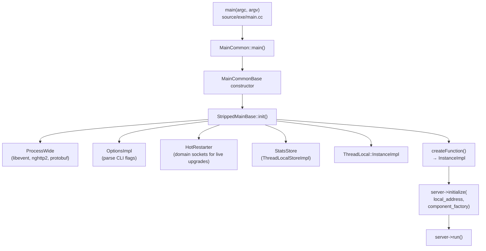

### Key Files

| File | Role |
|------|------|
| `source/exe/main.cc` | Process entry point |
| `source/exe/main_common.h/.cc` | `MainCommon`, `MainCommonBase` — glue between CLI and server |
| `source/exe/stripped_main_base.h/.cc` | Process-wide singletons, hot restart, stats store |
| `source/server/server.h/.cc` | `InstanceBase` — the actual Envoy server |
| `source/server/instance_impl.h/.cc` | `InstanceImpl` — production server with overload manager, guard dog, HDS |

---

## 2. Bootstrap Configuration Loading

### Configuration Sources

Envoy accepts configuration from three sources (merged in priority order):

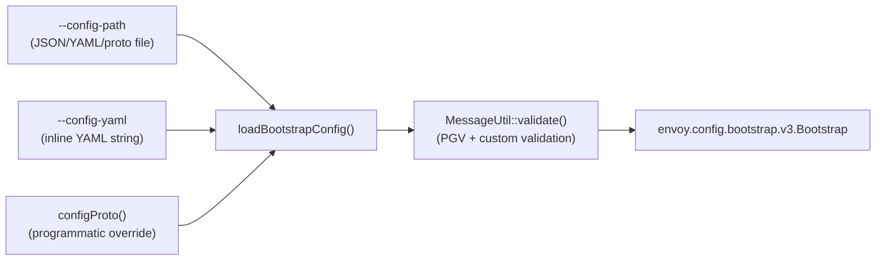

### Bootstrap Proto Structure

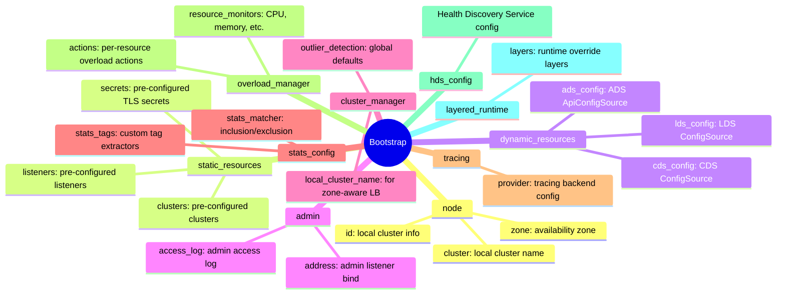

### `loadBootstrapConfig` Implementation

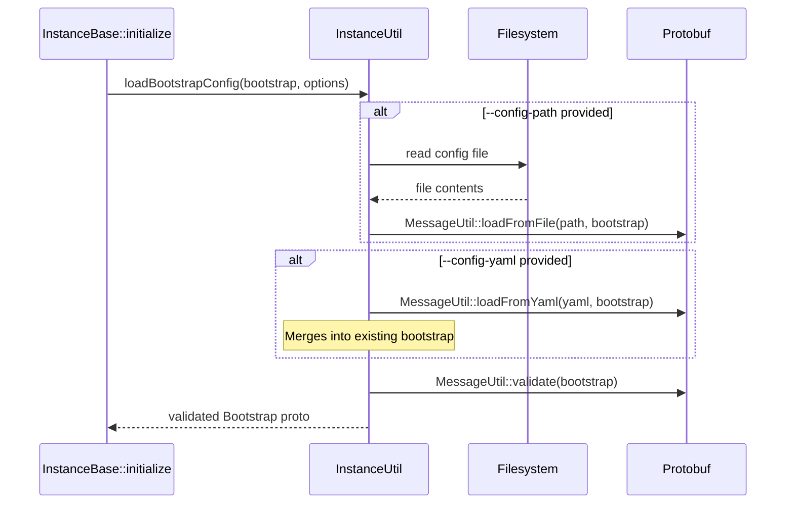

---

## 3. Server Initialization Order

This is the most critical sequence — it determines what is available at each phase:

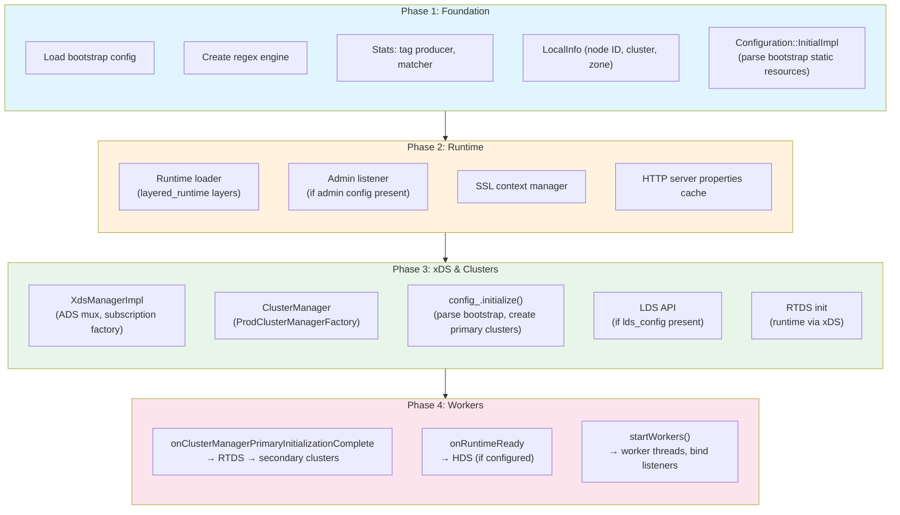

### Detailed Initialization Sequence

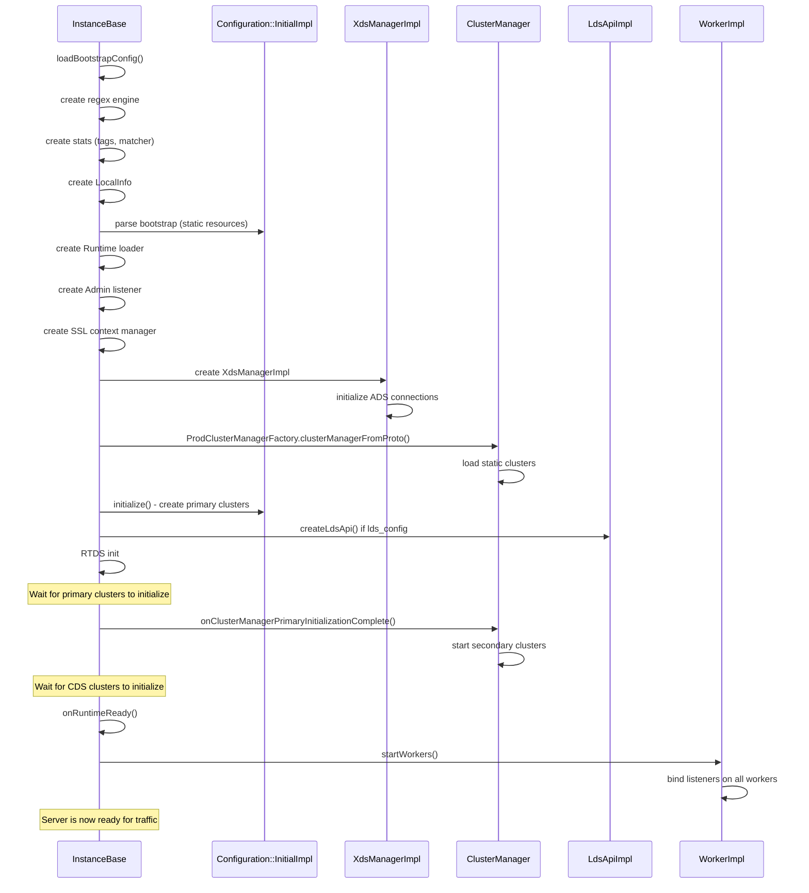

---

## 4. InstanceBase — The Server Object

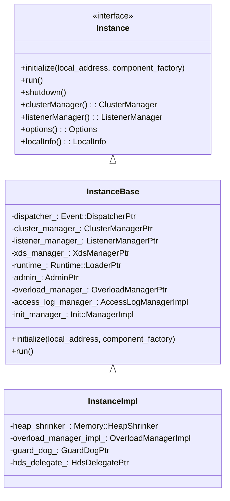

### What `InstanceImpl` Adds Over `InstanceBase`

| Feature | Purpose |
|---------|---------|
| `OverloadManagerImpl` | Resource monitors (memory, CPU), overload actions |
| `GuardDog` | Watchdog threads, detects event loop stalls |
| `HeapShrinker` | Releases memory when overloaded |
| `HdsDelegate` | Health Discovery Service client |

---

## 5. Configuration::InitialImpl

Parses the bootstrap into runtime structures:

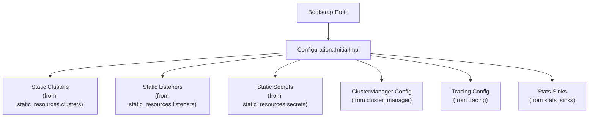

---

## 6. Process-Wide Singletons

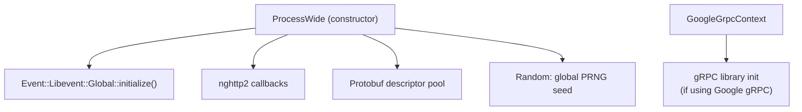

---

## 7. Hot Restart

Hot restart allows zero-downtime upgrades by transferring state between old and new Envoy processes:

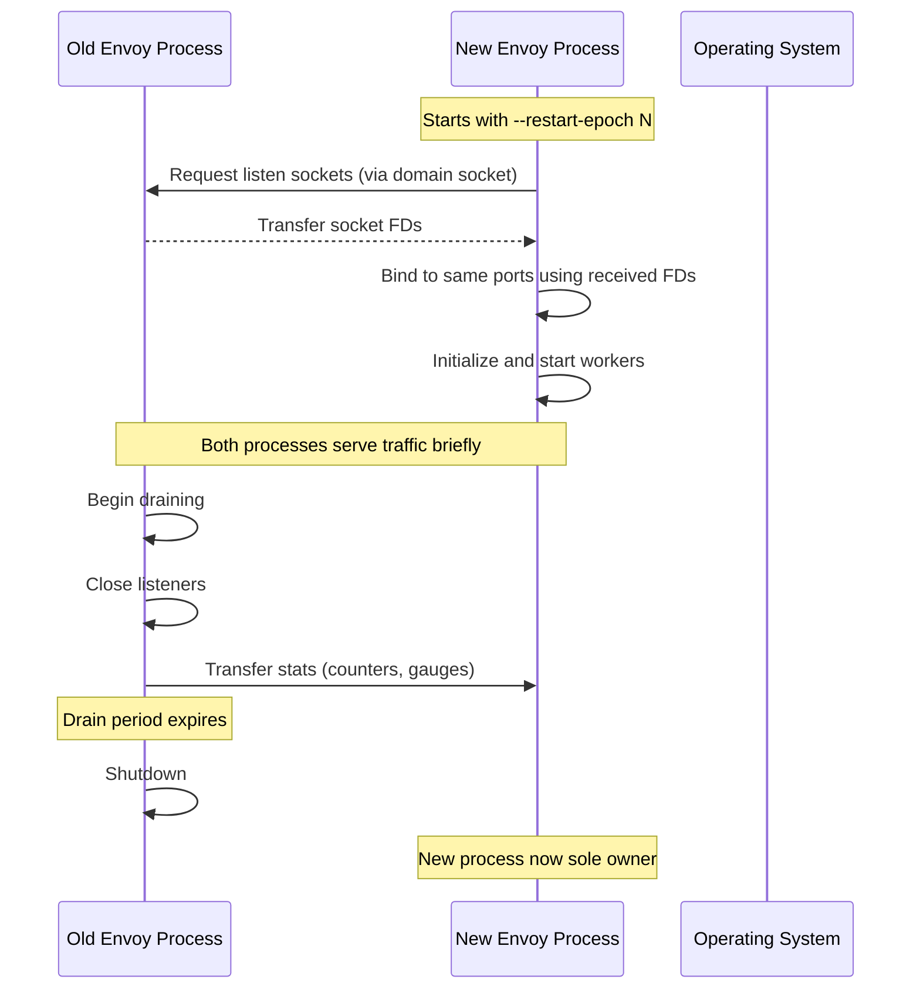

### Hot Restart Socket Inheritance

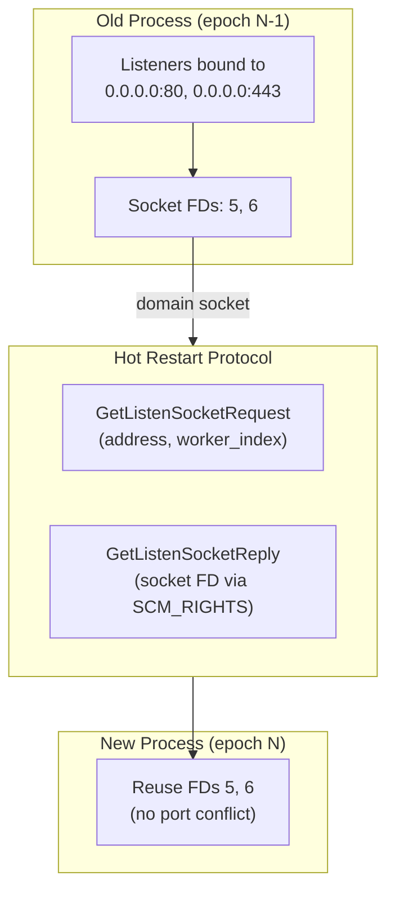

---

## 8. Config Validation Mode

When Envoy runs with `--mode validate`, it performs full config parsing without binding ports:

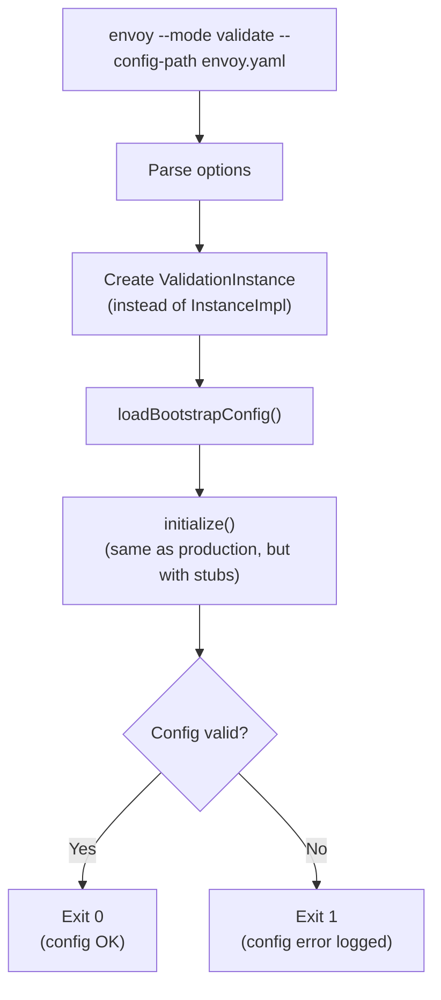

### ValidationInstance Stubs

| Component | Production | Validation |
|-----------|-----------|------------|
| ClusterManager | `ClusterManagerImpl` | `ValidationClusterManager` |
| Admin | Full admin server | `ValidationAdmin` (no-op) |
| ListenerManager | Binds ports | `ValidationListenerManager` (no-op) |
| Health Checks | Active probing | Skipped |
| Hot Restart | Socket transfer | Skipped |

---

## 9. Runtime Layers

Envoy's runtime system provides dynamic feature flags and configuration overrides:

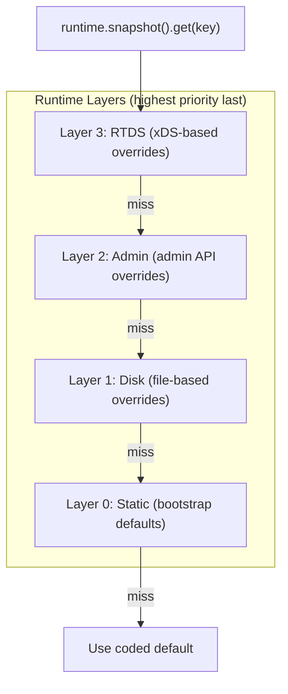

---

## 10. Init::Manager — Initialization Coordination

The `Init::Manager` coordinates initialization across components that need asynchronous setup:

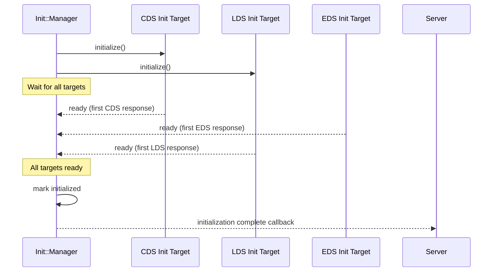

---

## 11. Full Bootstrap-to-Ready Timeline

```mermaid
gantt
    title Envoy Startup Timeline
    dateFormat X
    axisFormat %s

    section Process Init
    ProcessWide singletons       :0, 1
    Parse CLI options            :1, 2
    Hot restarter setup          :2, 3
    Stats store creation         :3, 4

    section Server Init
    Load bootstrap config        :4, 5
    Create runtime               :5, 6
    Create admin                 :6, 7
    Create XdsManager            :7, 8

    section Cluster Init
    Create ClusterManager        :8, 10
    Static clusters init         :10, 12
    CDS subscription start       :12, 13
    Wait for CDS response        :13, 16
    CDS clusters warming         :16, 19

    section Listener Init
    LDS subscription start       :13, 14
    Wait for LDS response        :14, 17
    RDS subscriptions start      :17, 18
    Wait for RDS responses       :18, 20

    section Workers
    Start worker threads         :20, 21
    Bind listeners               :21, 22
    Server ready                 :22, 23
```
