# Part 2: xDS & Dynamic Configuration

## Series Navigation

| Part | Topic |
|------|-------|
| Part 1 | [Core Runtime & Bootstrapping](./01-Core-Runtime-and-Bootstrapping.md) |
| **Part 2** | **xDS & Dynamic Configuration** (this document) |
| Part 3 | [Istio-to-Envoy Mapping](./03-Istio-to-Envoy-Mapping.md) |
| Part 4 | [EnvoyFilter, Sidecar vs Gateway](./04-EnvoyFilter-Sidecar-vs-Gateway.md) |

---

## Overview

xDS (x Discovery Service) is the protocol Envoy uses to receive dynamic configuration from a control plane. This document covers the xDS protocol variants, subscription system, and how each discovery service (LDS, RDS, CDS, EDS, SDS) applies configuration to the running proxy.

---

## 1. xDS Protocol Family

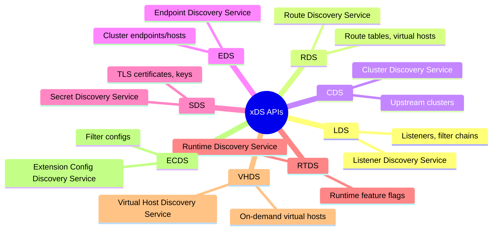
```mermaid
mindmap
  root((xDS APIs))
    LDS
      Listener Discovery Service
      Listeners, filter chains
    RDS
      Route Discovery Service
      Route tables, virtual hosts
    CDS
      Cluster Discovery Service
      Upstream clusters
    EDS
      Endpoint Discovery Service
      Cluster endpoints/hosts
    SDS
      Secret Discovery Service
      TLS certificates, keys
    RTDS
      Runtime Discovery Service
      Runtime feature flags
    VHDS
      Virtual Host Discovery Service
      On-demand virtual hosts
    ECDS
      Extension Config Discovery Service
      Filter configs
```

### Discovery Service Ordering

Resources have dependencies — a listener references route configs, routes reference clusters, clusters reference endpoints:

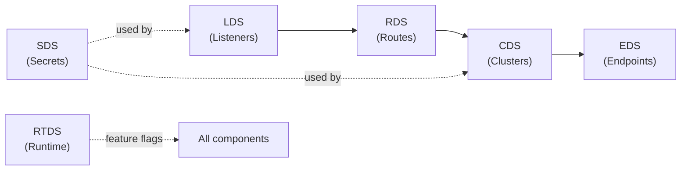
```mermaid
flowchart LR
    LDS["LDS\n(Listeners)"] --> RDS["RDS\n(Routes)"]
    RDS --> CDS["CDS\n(Clusters)"]
    CDS --> EDS["EDS\n(Endpoints)"]
    
    SDS["SDS\n(Secrets)"] -.->|"used by"| LDS & CDS
    RTDS["RTDS\n(Runtime)"] -.->|"feature flags"| All["All components"]
```

---

## 2. Protocol Variants: SotW vs Delta

### State of the World (SotW)

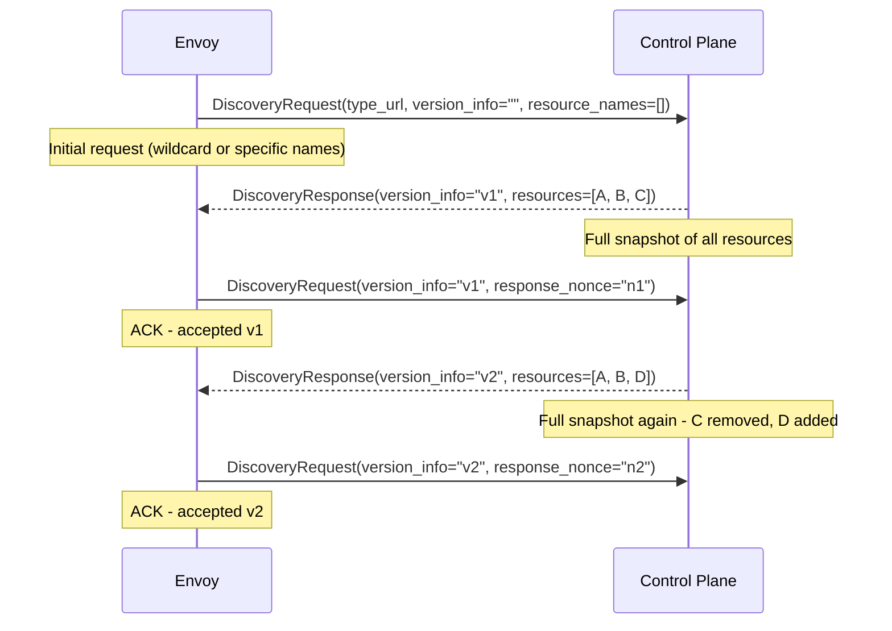
```mermaid
sequenceDiagram
    participant Envoy
    participant CP as Control Plane

    Envoy->>CP: DiscoveryRequest(type_url, version_info="", resource_names=[])
    Note over Envoy: Initial request (wildcard or specific names)

    CP-->>Envoy: DiscoveryResponse(version_info="v1", resources=[A, B, C])
    Note over CP: Full snapshot of all resources

    Envoy->>CP: DiscoveryRequest(version_info="v1", response_nonce="n1")
    Note over Envoy: ACK - accepted v1

    CP-->>Envoy: DiscoveryResponse(version_info="v2", resources=[A, B, D])
    Note over CP: Full snapshot again - C removed, D added

    Envoy->>CP: DiscoveryRequest(version_info="v2", response_nonce="n2")
    Note over Envoy: ACK - accepted v2
```

### Delta (Incremental)

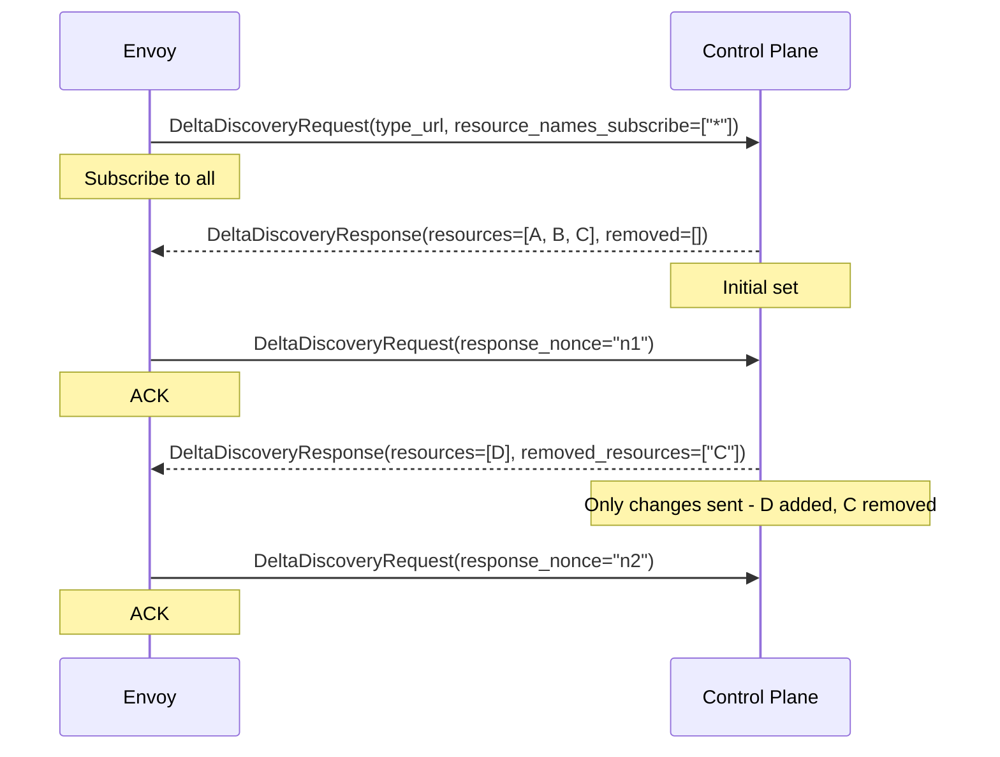
```mermaid
sequenceDiagram
    participant Envoy
    participant CP as Control Plane

    Envoy->>CP: DeltaDiscoveryRequest(type_url, resource_names_subscribe=["*"])
    Note over Envoy: Subscribe to all

    CP-->>Envoy: DeltaDiscoveryResponse(resources=[A, B, C], removed=[])
    Note over CP: Initial set

    Envoy->>CP: DeltaDiscoveryRequest(response_nonce="n1")
    Note over Envoy: ACK

    CP-->>Envoy: DeltaDiscoveryResponse(resources=[D], removed_resources=["C"])
    Note over CP: Only changes sent - D added, C removed

    Envoy->>CP: DeltaDiscoveryRequest(response_nonce="n2")
    Note over Envoy: ACK
```

### SotW vs Delta Comparison

| Aspect | SotW | Delta |
|--------|------|-------|
| Response size | Full resource set every time | Only changes |
| Version tracking | Single `version_info` for all | Per-resource versions |
| NACK | Resend request with old `version_info` + error_detail | Same nonce + error_detail |
| On-demand | Not supported | `resource_names_subscribe/unsubscribe` |
| Best for | Small resource sets | Large/dynamic resource sets (EDS) |
| gRPC method | `StreamAggregatedResources` | `DeltaAggregatedResources` |

---

## 3. ADS — Aggregated Discovery Service

ADS multiplexes all xDS types over a single gRPC stream, enabling ordered delivery:

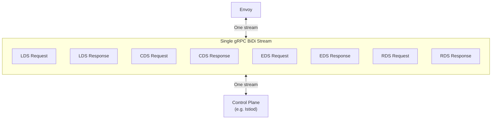
```mermaid
flowchart TD
    subgraph SingleStream["Single gRPC BiDi Stream"]
        direction TB
        LDS_Req["LDS Request"]
        LDS_Resp["LDS Response"]
        CDS_Req["CDS Request"]
        CDS_Resp["CDS Response"]
        EDS_Req["EDS Request"]
        EDS_Resp["EDS Response"]
        RDS_Req["RDS Request"]
        RDS_Resp["RDS Response"]
    end

    Envoy["Envoy"] <-->|"One stream"| SingleStream
    SingleStream <-->|"One stream"| CP["Control Plane\n(e.g. Istiod)"]
```

### ADS vs Separate Streams

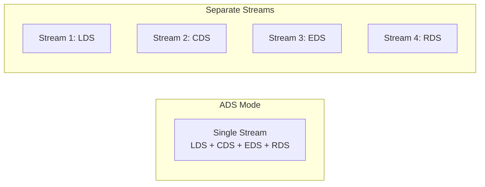
```mermaid
flowchart LR
    subgraph ADS["ADS Mode"]
        Stream1["Single Stream\nLDS + CDS + EDS + RDS"]
    end

    subgraph Separate["Separate Streams"]
        S1["Stream 1: LDS"]
        S2["Stream 2: CDS"]
        S3["Stream 3: EDS"]
        S4["Stream 4: RDS"]
    end
```

**Why ADS matters for Istio:** Istiod serves all xDS types over a single ADS stream, ensuring consistent configuration delivery. Without ADS, a listener could reference a route config that hasn't been delivered yet.

---

## 4. Subscription System Architecture

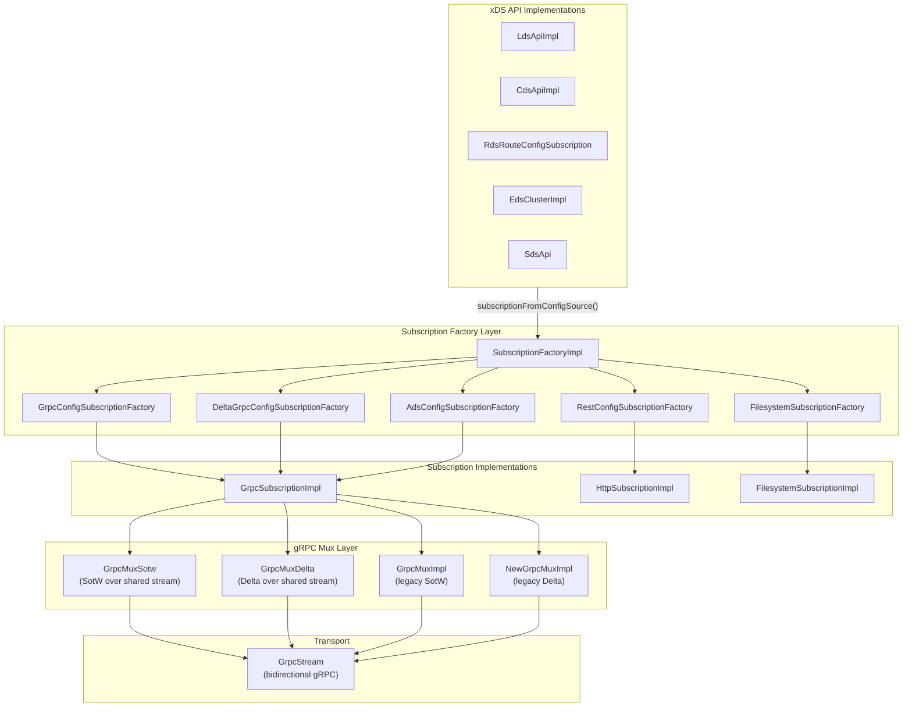
```mermaid
flowchart TD
    subgraph Callers["xDS API Implementations"]
        LDS["LdsApiImpl"]
        CDS["CdsApiImpl"]
        RDS["RdsRouteConfigSubscription"]
        EDS["EdsClusterImpl"]
        SDS["SdsApi"]
    end

    subgraph Factory["Subscription Factory Layer"]
        SF["SubscriptionFactoryImpl"]
        CSF_GRPC["GrpcConfigSubscriptionFactory"]
        CSF_Delta["DeltaGrpcConfigSubscriptionFactory"]
        CSF_ADS["AdsConfigSubscriptionFactory"]
        CSF_REST["RestConfigSubscriptionFactory"]
        CSF_FS["FilesystemSubscriptionFactory"]
    end

    subgraph Subscriptions["Subscription Implementations"]
        GS["GrpcSubscriptionImpl"]
        HS["HttpSubscriptionImpl"]
        FS["FilesystemSubscriptionImpl"]
    end

    subgraph Muxes["gRPC Mux Layer"]
        SotW["GrpcMuxSotw\n(SotW over shared stream)"]
        Delta["GrpcMuxDelta\n(Delta over shared stream)"]
        Legacy["GrpcMuxImpl\n(legacy SotW)"]
        LegacyDelta["NewGrpcMuxImpl\n(legacy Delta)"]
    end

    subgraph Transport["Transport"]
        Stream["GrpcStream\n(bidirectional gRPC)"]
    end

    Callers -->|"subscriptionFromConfigSource()"| SF
    SF --> CSF_GRPC & CSF_Delta & CSF_ADS & CSF_REST & CSF_FS
    CSF_GRPC & CSF_Delta & CSF_ADS --> GS
    CSF_REST --> HS
    CSF_FS --> FS
    GS --> SotW & Delta & Legacy & LegacyDelta
    SotW & Delta & Legacy & LegacyDelta --> Stream
```

### Key Classes

| Class | File | Role |
|-------|------|------|
| `SubscriptionFactoryImpl` | `source/common/config/subscription_factory_impl.h` | Creates subscriptions from `ConfigSource` proto |
| `GrpcSubscriptionImpl` | `source/extensions/config_subscription/grpc/grpc_subscription_impl.h` | Typed adapter over untyped `GrpcMux` |
| `GrpcMuxSotw` | `source/extensions/config_subscription/grpc/xds_mux/grpc_mux_impl.h` | Unified SotW mux |
| `GrpcMuxDelta` | `source/extensions/config_subscription/grpc/xds_mux/grpc_mux_impl.h` | Unified Delta mux |
| `WatchMap` | `source/extensions/config_subscription/grpc/watch_map.h` | Routes resources to interested watches |
| `XdsManagerImpl` | `source/common/config/xds_manager_impl.h` | Manages ADS mux and subscription lifecycle |

---

## 5. xDS Response Processing Pipeline

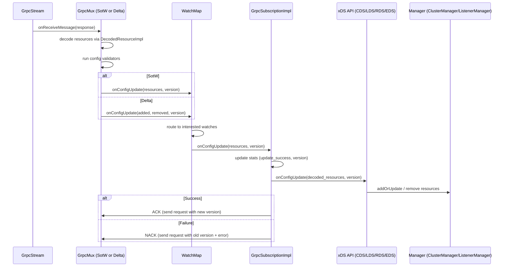
```mermaid
sequenceDiagram
    participant Stream as GrpcStream
    participant Mux as GrpcMux (SotW or Delta)
    participant WM as WatchMap
    participant Sub as GrpcSubscriptionImpl
    participant API as xDS API (CDS/LDS/RDS/EDS)
    participant Manager as Manager (ClusterManager/ListenerManager)

    Stream->>Mux: onReceiveMessage(response)
    Mux->>Mux: decode resources via DecodedResourceImpl
    Mux->>Mux: run config validators

    alt SotW
        Mux->>WM: onConfigUpdate(resources, version)
    else Delta
        Mux->>WM: onConfigUpdate(added, removed, version)
    end

    WM->>WM: route to interested watches
    WM->>Sub: onConfigUpdate(resources, version)
    Sub->>Sub: update stats (update_success, version)
    Sub->>API: onConfigUpdate(decoded_resources, version)
    API->>Manager: addOrUpdate / remove resources

    alt Success
        Sub->>Mux: ACK (send request with new version)
    else Failure
        Sub->>Mux: NACK (send request with old version + error)
    end
```

---

## 6. Per-API Deep Dive

### LDS — Listener Discovery Service

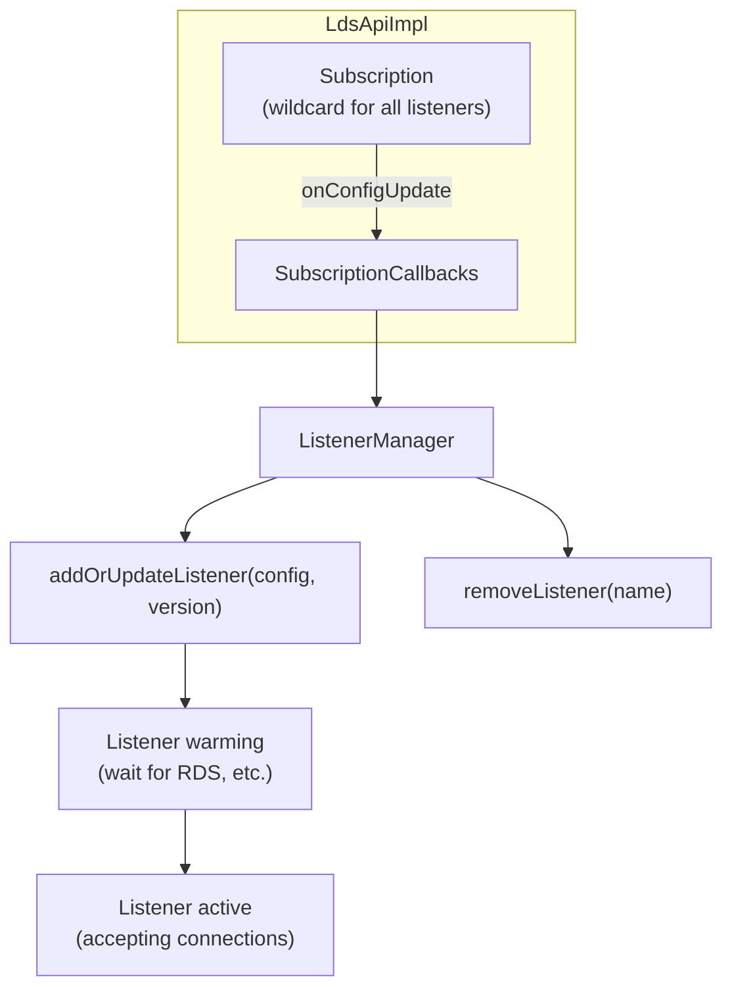
```mermaid
flowchart TD
    subgraph LDS["LdsApiImpl"]
        Sub["Subscription\n(wildcard for all listeners)"]
        CB["SubscriptionCallbacks"]
    end

    Sub -->|"onConfigUpdate"| CB
    CB --> LM["ListenerManager"]
    LM --> Add["addOrUpdateListener(config, version)"]
    LM --> Remove["removeListener(name)"]

    Add --> Warming["Listener warming\n(wait for RDS, etc.)"]
    Warming --> Active["Listener active\n(accepting connections)"]
```

**Key behaviors:**
- Wildcard subscription (no specific resource names)
- SotW: diff against current listeners to detect removals
- Delta: explicit `removed_resources` list
- Listener warming: new listeners must resolve RDS before becoming active

### RDS — Route Discovery Service

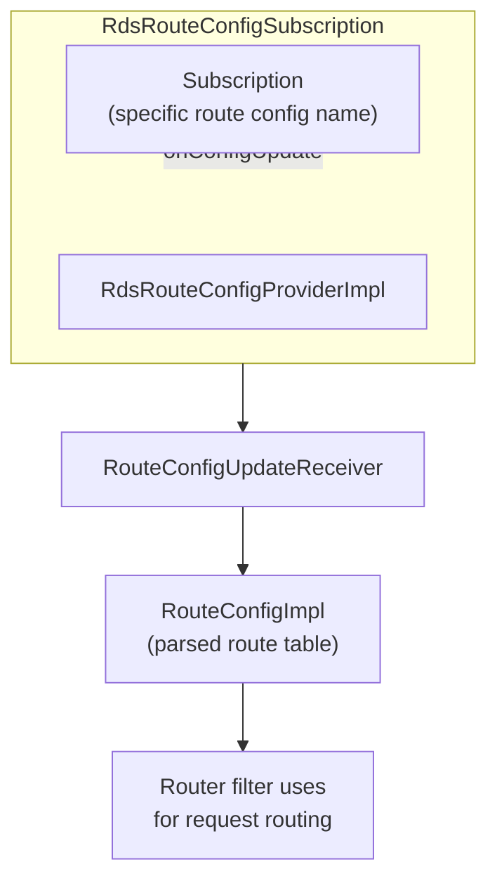
```mermaid
flowchart TD
    subgraph RDS["RdsRouteConfigSubscription"]
        Sub["Subscription\n(specific route config name)"]
        Provider["RdsRouteConfigProviderImpl"]
    end

    Sub -->|"onConfigUpdate"| RDS
    RDS --> RCUR["RouteConfigUpdateReceiver"]
    RCUR --> RC["RouteConfigImpl\n(parsed route table)"]
    RC --> Router["Router filter uses\nfor request routing"]
```

**Key behaviors:**
- Per-listener (each HCM can have its own route config name)
- Subscription triggered by LDS delivering a listener with `rds` config
- Can use VHDS for on-demand virtual host loading

### CDS — Cluster Discovery Service

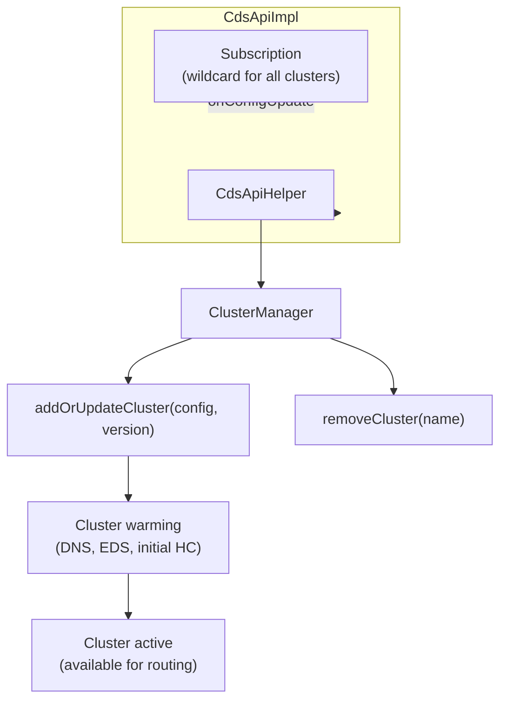
```mermaid
flowchart TD
    subgraph CDS["CdsApiImpl"]
        Sub["Subscription\n(wildcard for all clusters)"]
        Helper["CdsApiHelper"]
    end

    Sub -->|"onConfigUpdate"| CDS
    CDS --> Helper
    Helper --> CM["ClusterManager"]
    CM --> Add["addOrUpdateCluster(config, version)"]
    CM --> Remove["removeCluster(name)"]

    Add --> Warming["Cluster warming\n(DNS, EDS, initial HC)"]
    Warming --> Active["Cluster active\n(available for routing)"]
```

### EDS — Endpoint Discovery Service

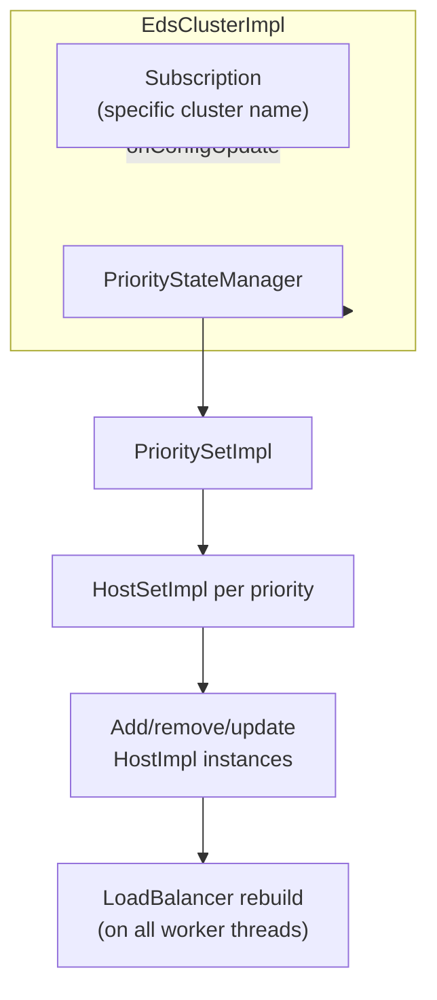
```mermaid
flowchart TD
    subgraph EDS["EdsClusterImpl"]
        Sub["Subscription\n(specific cluster name)"]
        PSM["PriorityStateManager"]
    end

    Sub -->|"onConfigUpdate"| EDS
    EDS --> PSM
    PSM --> PS["PrioritySetImpl"]
    PS --> HS["HostSetImpl per priority"]
    HS --> Hosts["Add/remove/update\nHostImpl instances"]
    Hosts --> LB["LoadBalancer rebuild\n(on all worker threads)"]
```

**Key behaviors:**
- Per-cluster subscription (one EDS sub per EDS-type cluster)
- Supports locality-aware endpoints with weights
- Can use EDS resource cache to avoid redundant updates

### SDS — Secret Discovery Service

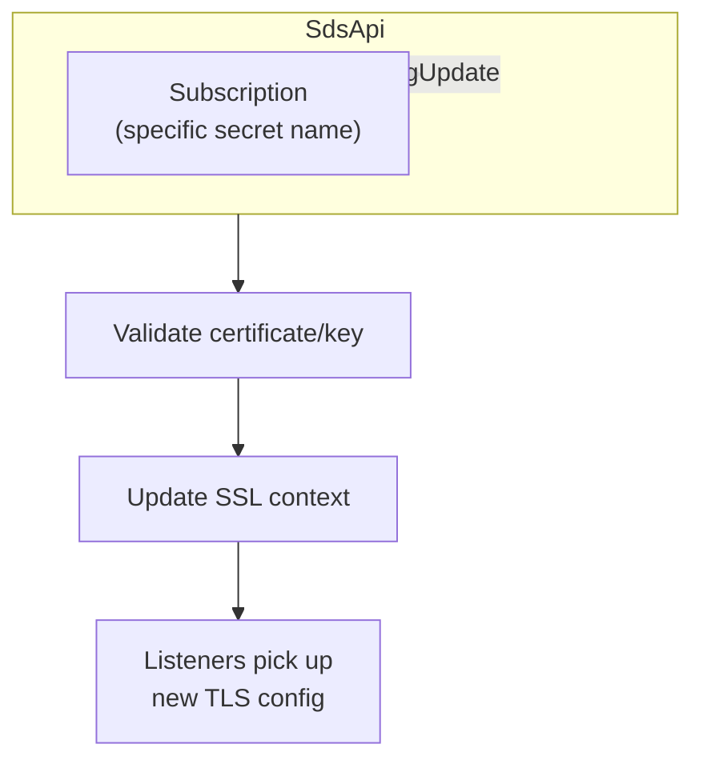
```mermaid
flowchart TD
    subgraph SDS["SdsApi"]
        Sub["Subscription\n(specific secret name)"]
    end

    Sub -->|"onConfigUpdate"| SDS
    SDS --> Validate["Validate certificate/key"]
    Validate --> Update["Update SSL context"]
    Update --> Listeners["Listeners pick up\nnew TLS config"]
```

**Key behaviors:**
- Per-secret subscription
- Supports: TLS certificates, validation contexts, session ticket keys, generic secrets
- Hot-reload: new connections use updated certs immediately

---

## 7. Config Source Types

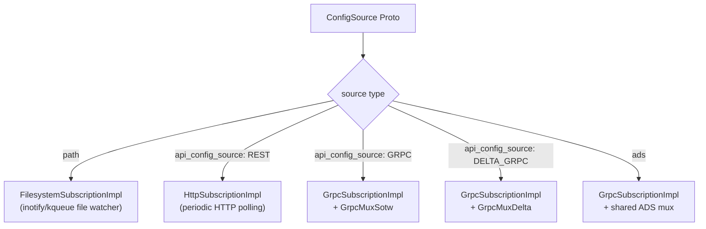
```mermaid
flowchart TD
    ConfigSource["ConfigSource Proto"] --> Decision{source type}

    Decision -->|path| FS["FilesystemSubscriptionImpl\n(inotify/kqueue file watcher)"]
    Decision -->|api_config_source: REST| REST["HttpSubscriptionImpl\n(periodic HTTP polling)"]
    Decision -->|api_config_source: GRPC| GRPC["GrpcSubscriptionImpl\n+ GrpcMuxSotw"]
    Decision -->|api_config_source: DELTA_GRPC| DeltaGRPC["GrpcSubscriptionImpl\n+ GrpcMuxDelta"]
    Decision -->|ads| ADS["GrpcSubscriptionImpl\n+ shared ADS mux"]
```

### Filesystem Subscription

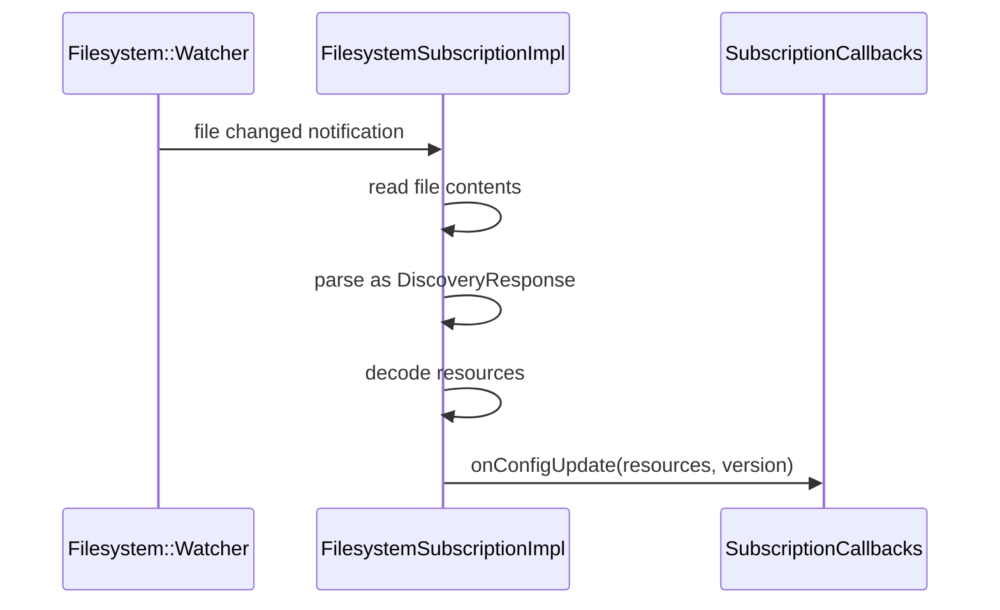
```mermaid
sequenceDiagram
    participant Watcher as Filesystem::Watcher
    participant FSub as FilesystemSubscriptionImpl
    participant CB as SubscriptionCallbacks

    Watcher->>FSub: file changed notification
    FSub->>FSub: read file contents
    FSub->>FSub: parse as DiscoveryResponse
    FSub->>FSub: decode resources
    FSub->>CB: onConfigUpdate(resources, version)
```

### REST Subscription

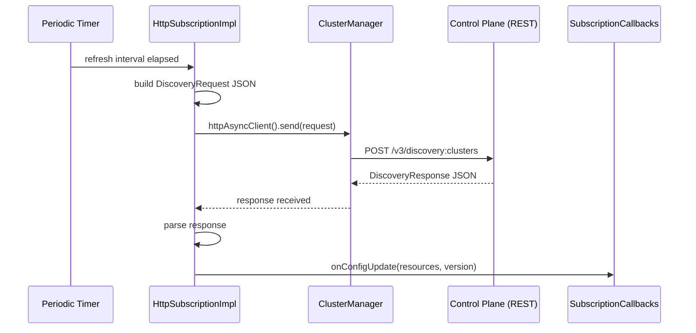
```mermaid
sequenceDiagram
    participant Timer as Periodic Timer
    participant HSub as HttpSubscriptionImpl
    participant CM as ClusterManager
    participant CP as Control Plane (REST)
    participant CB as SubscriptionCallbacks

    Timer->>HSub: refresh interval elapsed
    HSub->>HSub: build DiscoveryRequest JSON
    HSub->>CM: httpAsyncClient().send(request)
    CM->>CP: POST /v3/discovery:clusters
    CP-->>CM: DiscoveryResponse JSON
    CM-->>HSub: response received
    HSub->>HSub: parse response
    HSub->>CB: onConfigUpdate(resources, version)
```

---

## 8. GrpcMux Internals

### Watch Management

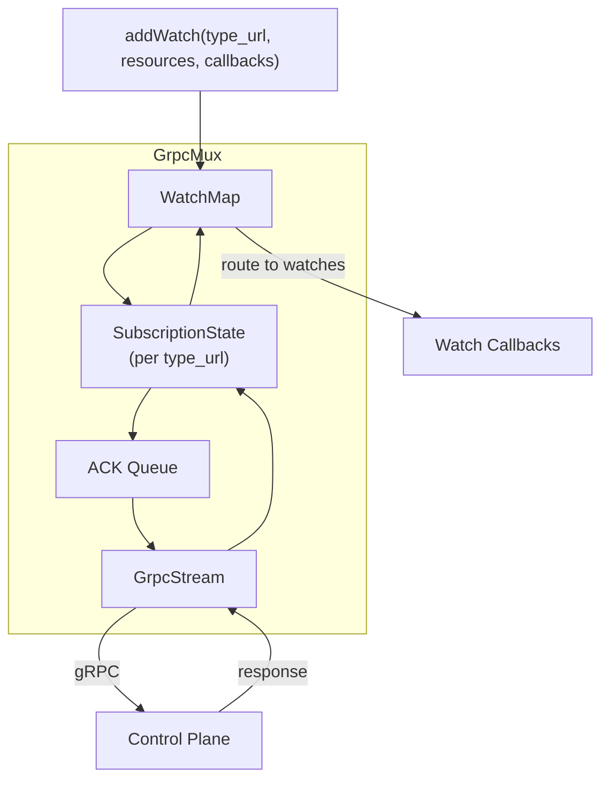
```mermaid
flowchart TD
    subgraph GrpcMux["GrpcMux"]
        WM["WatchMap"]
        SS["SubscriptionState\n(per type_url)"]
        AQ["ACK Queue"]
        GS["GrpcStream"]
    end

    AddWatch["addWatch(type_url, resources, callbacks)"] --> WM
    WM --> SS
    SS --> AQ
    AQ --> GS
    GS -->|"gRPC"| CP["Control Plane"]

    CP -->|"response"| GS
    GS --> SS
    SS --> WM
    WM -->|"route to watches"| Callbacks["Watch Callbacks"]
```

### Pausing and Resuming

ADS requires pausing certain resource types while others are being updated (to maintain consistency):

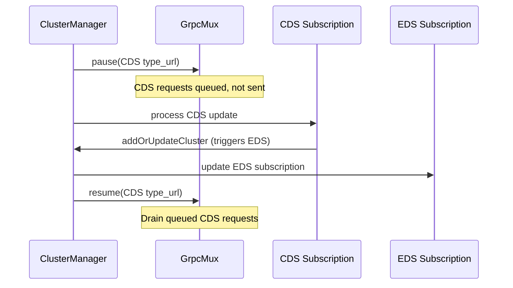
```mermaid
sequenceDiagram
    participant CM as ClusterManager
    participant Mux as GrpcMux
    participant CDS as CDS Subscription
    participant EDS as EDS Subscription

    CM->>Mux: pause(CDS type_url)
    Note over Mux: CDS requests queued, not sent

    CM->>CDS: process CDS update
    CDS->>CM: addOrUpdateCluster (triggers EDS)
    CM->>EDS: update EDS subscription

    CM->>Mux: resume(CDS type_url)
    Note over Mux: Drain queued CDS requests
```

---

## 9. NACK and Error Handling

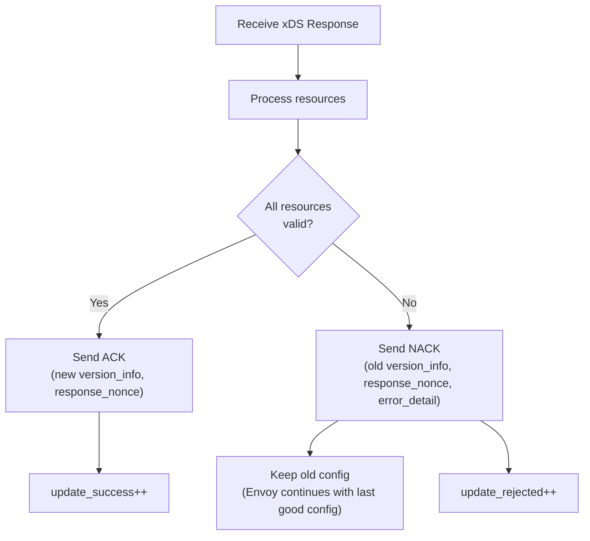
```mermaid
flowchart TD
    Response["Receive xDS Response"] --> Process["Process resources"]
    Process --> Valid{"All resources\nvalid?"}
    Valid -->|Yes| ACK["Send ACK\n(new version_info, response_nonce)"]
    Valid -->|No| NACK["Send NACK\n(old version_info, response_nonce, error_detail)"]
    NACK --> Keep["Keep old config\n(Envoy continues with last good config)"]

    ACK --> Stats1["update_success++"]
    NACK --> Stats2["update_rejected++"]
```

### Error Detail in NACK

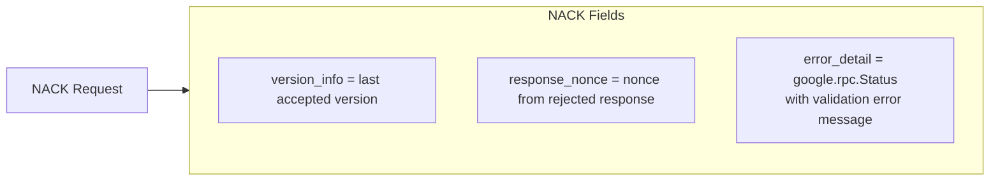
```mermaid
flowchart LR
    NACK["NACK Request"] --> Fields
    subgraph Fields["NACK Fields"]
        V["version_info = last accepted version"]
        N["response_nonce = nonce from rejected response"]
        E["error_detail = google.rpc.Status\nwith validation error message"]
    end
```

---

## 10. XdsManagerImpl — The Orchestrator

```mermaid
classDiagram
    class XdsManagerImpl {
        +initialize(bootstrap)
        +initializeAdsConnections(bootstrap)
        +adsMux(): GrpcMux
        +subscribeToSingletonResource(locator, type, callbacks): Watch
        +pause(type_urls): PausablePauseState
        +setAdsConfigSource(config)
        -subscription_factory_: SubscriptionFactoryImpl
        -ads_mux_: GrpcMuxSharedPtr
        -authority_data_: map of AuthorityData
    }

    class AuthorityData {
        +config: ConfigSource
        +authority_names: vector of string
        +grpc_mux: GrpcMuxPtr
    }

    XdsManagerImpl *-- AuthorityData
```

### XdsManager Initialization

```mermaid
sequenceDiagram
    participant Server as InstanceBase
    participant XM as XdsManagerImpl
    participant SF as SubscriptionFactoryImpl
    participant Mux as GrpcMux

    Server->>XM: initialize(bootstrap)
    XM->>SF: create SubscriptionFactoryImpl
    XM->>XM: initializeAdsConnections(bootstrap)

    alt ads_config present in bootstrap
        XM->>Mux: create ADS mux (SotW or Delta)
        XM->>XM: store as ads_mux_
    end

    alt config_sources present
        loop for each config source
            XM->>XM: create AuthorityData
            XM->>Mux: create per-authority mux
        end
    end
```

---

## 11. xDS Resource Flow — End to End

```mermaid
flowchart TD
    subgraph ControlPlane["Control Plane (e.g. Istiod)"]
        Translate["Translate K8s/Istio resources\nto Envoy config"]
    end

    subgraph Transport["xDS Transport"]
        GRPC["gRPC BiDi Stream\n(ADS or per-type)"]
    end

    subgraph EnvoyReceive["Envoy: Receive"]
        Stream["GrpcStream\nonReceiveMessage()"]
        Mux["GrpcMux\nonDiscoveryResponse()"]
        Decode["DecodedResourceImpl\nparse Any → typed proto"]
        Watch["WatchMap\nroute to subscribers"]
    end

    subgraph EnvoyApply["Envoy: Apply"]
        API["xDS API\n(LDS/CDS/RDS/EDS/SDS)"]
        Manager["Manager\n(ListenerManager/ClusterManager)"]
        Runtime["Runtime objects\n(Listeners, Routes, Clusters, Hosts, Certs)"]
    end

    ControlPlane -->|"DiscoveryResponse"| GRPC
    GRPC --> Stream --> Mux --> Decode --> Watch
    Watch --> API --> Manager --> Runtime
```

---

## 12. Initial Fetch and Timeout

```mermaid
sequenceDiagram
    participant Sub as GrpcSubscriptionImpl
    participant Timer as Init Fetch Timer
    participant Mux as GrpcMux
    participant CP as Control Plane

    Sub->>Timer: start(initial_fetch_timeout)
    Sub->>Mux: addWatch(type_url, resources)
    Mux->>CP: DiscoveryRequest

    alt Response arrives in time
        CP-->>Mux: DiscoveryResponse
        Mux-->>Sub: onConfigUpdate(resources)
        Sub->>Timer: cancel
        Sub->>Sub: init_fetch_timeout_fired = false
    else Timeout
        Timer->>Sub: onConfigUpdateFailed(FetchTimedout)
        Sub->>Sub: init_fetch_timeout_fired = true
        Note over Sub: Envoy continues with empty config for this type
    end
```
