# Part 3: Istio-to-Envoy Mapping

## Series Navigation

| Part | Topic |
|------|-------|
| Part 1 | [Core Runtime & Bootstrapping](./01-Core-Runtime-and-Bootstrapping.md) |
| Part 2 | [xDS & Dynamic Configuration](./02-xDS-and-Dynamic-Configuration.md) |
| **Part 3** | **Istio-to-Envoy Mapping** (this document) |
| Part 4 | [EnvoyFilter, Sidecar vs Gateway](./04-EnvoyFilter-Sidecar-vs-Gateway.md) |

---

## Overview

Istiod translates Kubernetes and Istio custom resources into Envoy xDS configuration. This document maps each major Istio resource to its Envoy equivalent, showing exactly how Istio CRDs become listeners, routes, clusters, and endpoints in the sidecar/gateway proxy.

---

## 1. The Translation Pipeline

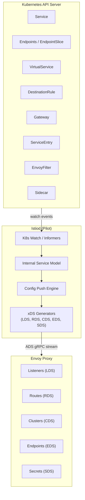

---

## 2. VirtualService → RDS (Route Configuration)

A VirtualService defines traffic routing rules. Istiod translates it into Envoy `RouteConfiguration` delivered via RDS.

### Mapping Table

| VirtualService Field | Envoy RDS Equivalent |
|---------------------|---------------------|
| `hosts` | `VirtualHost.domains` |
| `http[].match` | `Route.match` (prefix, exact, regex, headers, query params) |
| `http[].route` | `Route.route` (weighted clusters) |
| `http[].route[].destination.host` | `Route.route.cluster` (or `weighted_clusters`) |
| `http[].route[].destination.subset` | Appended to cluster name: `outbound|port|subset|host` |
| `http[].route[].destination.port` | Part of cluster name |
| `http[].timeout` | `Route.route.timeout` |
| `http[].retries` | `Route.route.retry_policy` |
| `http[].fault` | `Route.typed_per_filter_config` (fault filter) |
| `http[].mirror` | `Route.route.request_mirror_policies` |
| `http[].rewrite` | `Route.route.prefix_rewrite` or `regex_rewrite` |
| `http[].headers` | `Route.request_headers_to_add/remove`, `response_headers_to_add/remove` |
| `http[].corsPolicy` | `Route.typed_per_filter_config` (CORS filter) |
| `tcp[].match` | Listener filter chain match |
| `tcp[].route` | TCP proxy cluster |
| `tls[].match` | SNI-based filter chain match |

### Translation Flow

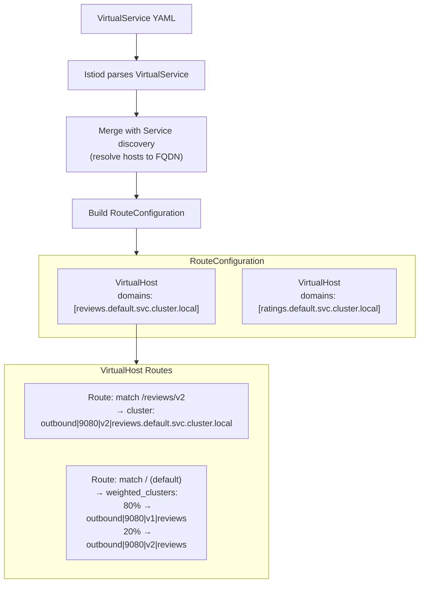

### VirtualService Example

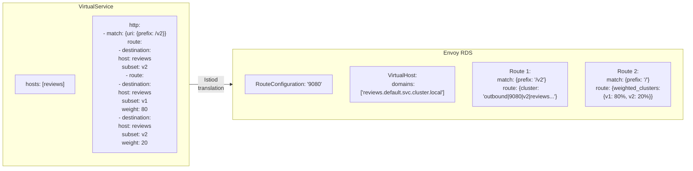

### Cluster Naming Convention

Istio uses a structured cluster name format:

```
{direction}|{port}|{subset}|{FQDN}
```

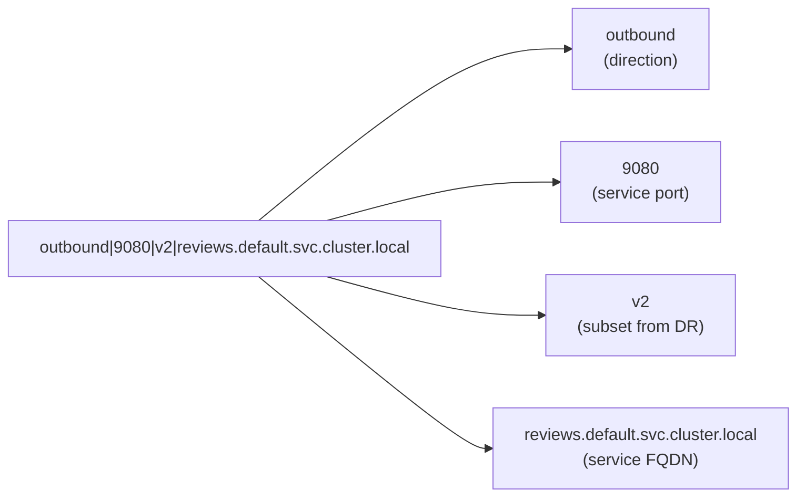

---

## 3. Gateway → LDS (Listener Configuration)

An Istio Gateway resource defines what ports and protocols the gateway proxy should listen on. Istiod translates it into Envoy `Listener` resources delivered via LDS.

### Mapping Table

| Gateway Field | Envoy LDS Equivalent |
|--------------|---------------------|
| `servers[].port.number` | `Listener.address.socket_address.port_value` |
| `servers[].port.protocol` | Determines filter chain (HTTP or TCP) |
| `servers[].hosts` | `FilterChainMatch.server_names` (SNI) |
| `servers[].tls.mode` | `TransportSocket` (TLS config) |
| `servers[].tls.credentialName` | SDS secret reference |
| `servers[].tls.minProtocolVersion` | `TlsParameters.tls_minimum_protocol_version` |
| `servers[].tls.cipherSuites` | `TlsParameters.cipher_suites` |
| Attached VirtualServices | `HttpConnectionManager.rds` (route config ref) |

### Gateway Translation Flow

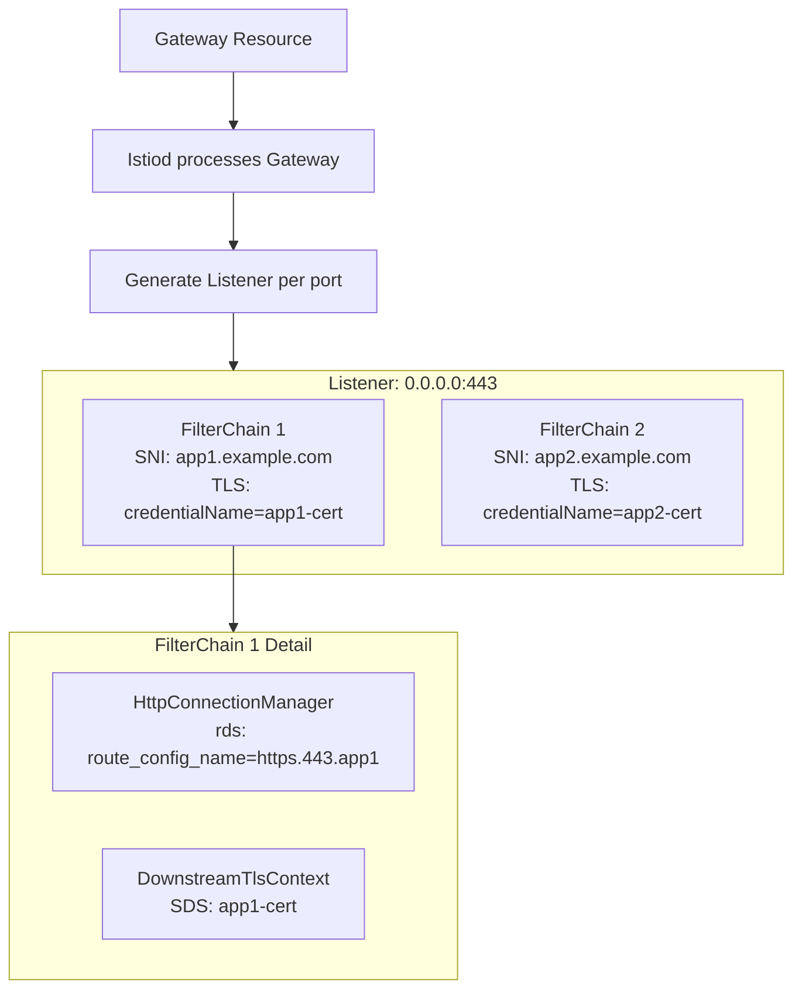

### Gateway Example: Multi-Host TLS

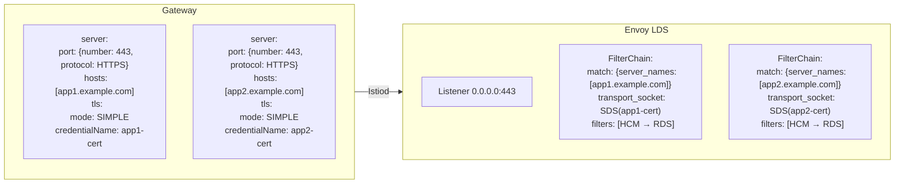

### Sidecar Listener Generation (No Gateway Resource)

For sidecars, Istiod generates listeners automatically based on service discovery:

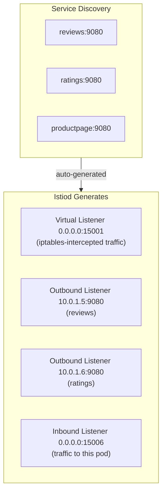

---

## 4. DestinationRule → CDS (Cluster Configuration)

A DestinationRule defines traffic policies and subsets for a destination. Istiod translates it into Envoy `Cluster` resources delivered via CDS.

### Mapping Table

| DestinationRule Field | Envoy CDS Equivalent |
|----------------------|---------------------|
| `host` | Base cluster: `outbound|port||host.namespace.svc.cluster.local` |
| `subsets[].name` | Subset cluster: `outbound|port|subset_name|host...` |
| `subsets[].labels` | EDS endpoint metadata filter |
| `trafficPolicy.connectionPool.tcp` | `Cluster.circuit_breakers`, `max_connections` |
| `trafficPolicy.connectionPool.http` | `Cluster.circuit_breakers`, `max_requests`, `max_pending_requests` |
| `trafficPolicy.loadBalancer` | `Cluster.lb_policy` (ROUND_ROBIN, LEAST_REQUEST, RANDOM) |
| `trafficPolicy.loadBalancer.consistentHash` | `Cluster.lb_policy = RING_HASH` + `ring_hash_lb_config` |
| `trafficPolicy.outlierDetection` | `Cluster.outlier_detection` |
| `trafficPolicy.tls.mode` | `Cluster.transport_socket` (upstream TLS) |
| `trafficPolicy.portLevelSettings` | Per-port cluster overrides |

### Translation Flow

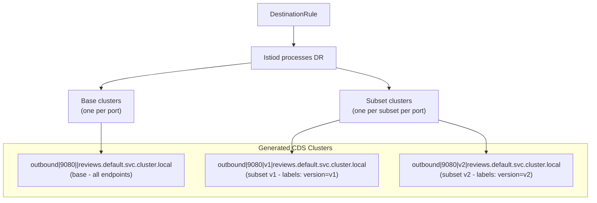

### DestinationRule Example

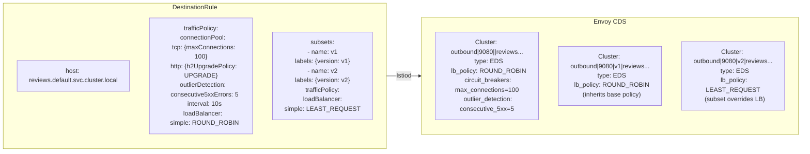

### Subset-to-Endpoint Filtering

Subsets filter EDS endpoints by label matching:

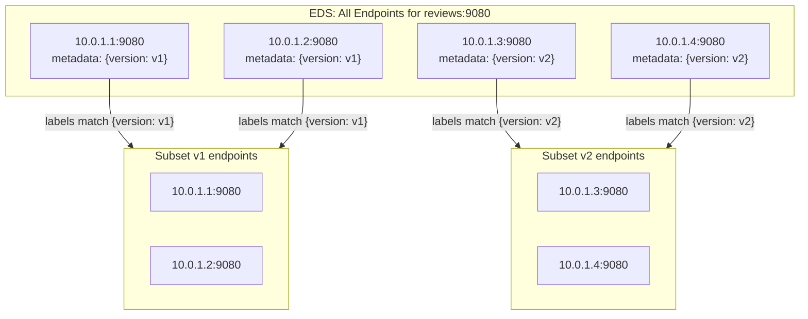

---

## 5. ServiceEntry → CDS + EDS

ServiceEntry registers external services into the mesh:

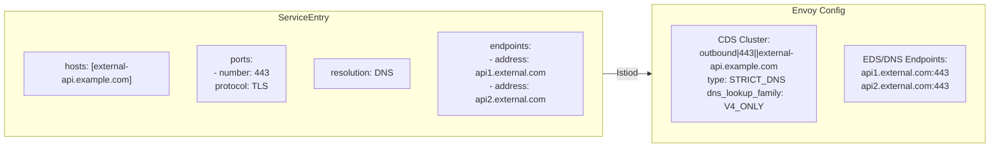

### ServiceEntry Resolution Types

| Resolution | Envoy Cluster Type | Endpoint Source |
|-----------|-------------------|-----------------|
| `NONE` | `ORIGINAL_DST` | Original destination from connection |
| `STATIC` | `STATIC` or `EDS` | Fixed addresses from SE endpoints |
| `DNS` | `STRICT_DNS` | DNS resolution of SE endpoint addresses |
| `DNS_ROUND_ROBIN` | `LOGICAL_DNS` | DNS with round-robin |

---

## 6. Kubernetes Service/Endpoints → CDS + EDS

Without any Istio CRDs, basic Kubernetes services still get translated:

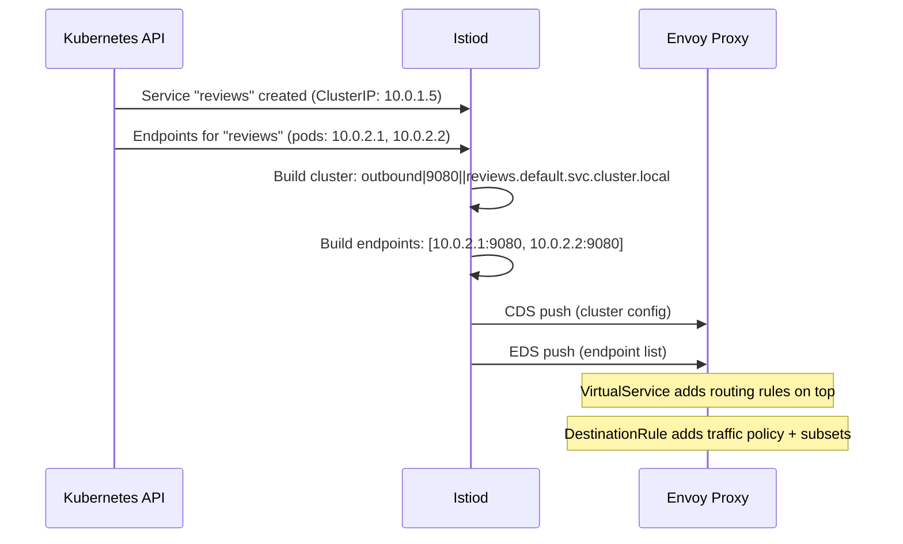

---

## 7. Complete Mapping: Bookinfo Example

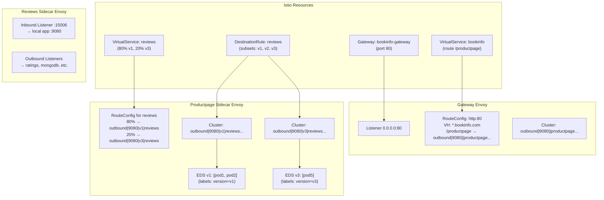

---

## 8. mTLS Translation

### PeerAuthentication + DestinationRule TLS

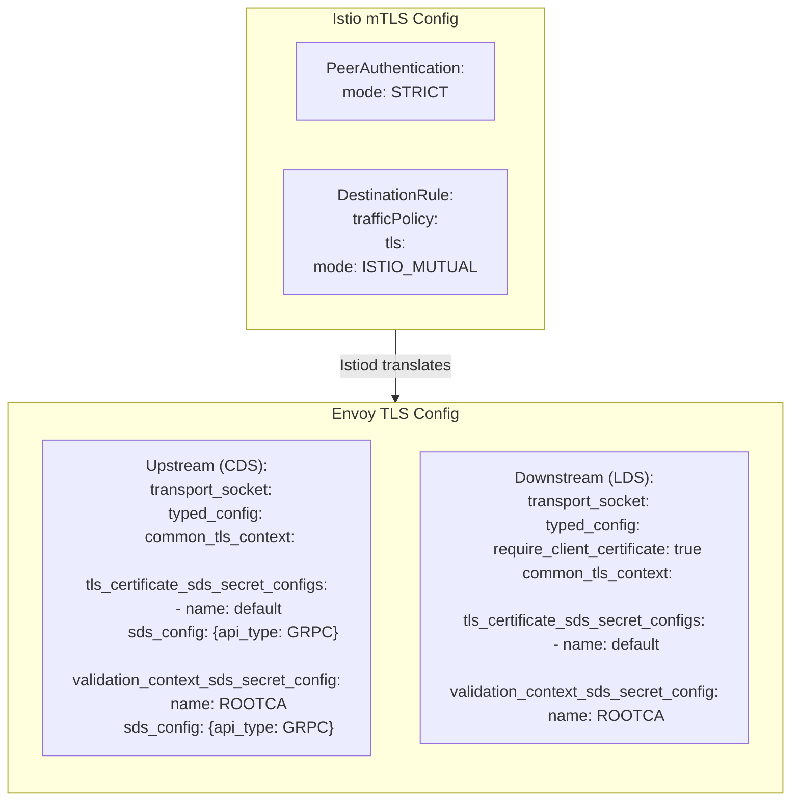

### SDS for Certificate Delivery

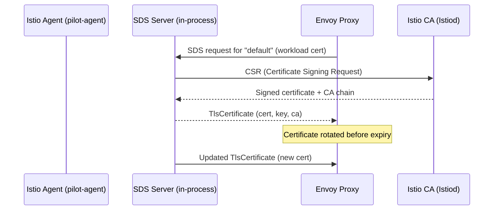

---

## 9. Resource Dependency Chain

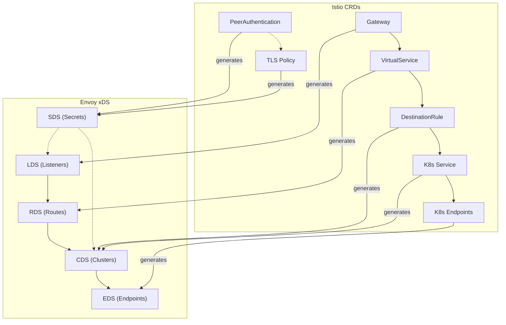
