# Part 4: EnvoyFilter CRD, Sidecar vs Gateway Mode

## Series Navigation

| Part | Topic |
|------|-------|
| Part 1 | [Core Runtime & Bootstrapping](./01-Core-Runtime-and-Bootstrapping.md) |
| Part 2 | [xDS & Dynamic Configuration](./02-xDS-and-Dynamic-Configuration.md) |
| Part 3 | [Istio-to-Envoy Mapping](./03-Istio-to-Envoy-Mapping.md) |
| **Part 4** | **EnvoyFilter CRD, Sidecar vs Gateway Mode** (this document) |

---

## Section A: EnvoyFilter CRD

### Overview

The `EnvoyFilter` CRD provides escape-hatch access to the raw Envoy configuration. It allows operators to patch generated xDS resources at specific points in the config generation pipeline before they are pushed to proxies.

---

### 1. EnvoyFilter Processing Pipeline

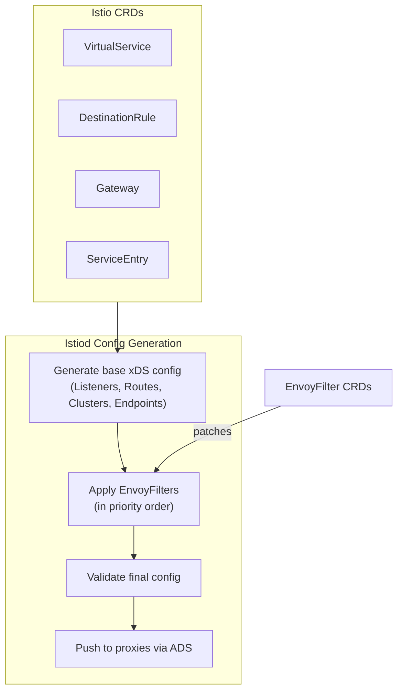

### 2. EnvoyFilter Structure

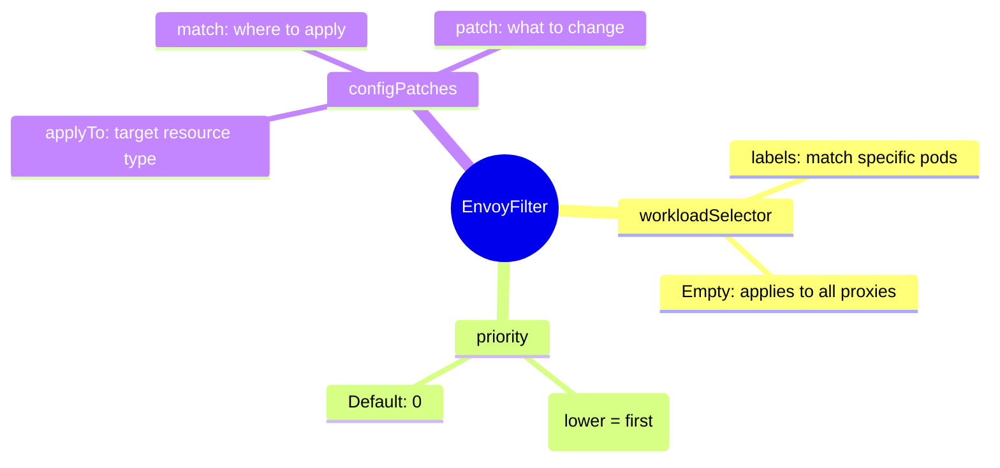

### 3. `applyTo` — What Can Be Patched

| applyTo Value | Target | xDS Type |
|--------------|--------|----------|
| `LISTENER` | Entire listener | LDS |
| `FILTER_CHAIN` | Filter chain within a listener | LDS |
| `NETWORK_FILTER` | Network-level filter | LDS |
| `HTTP_FILTER` | HTTP-level filter in HCM | LDS |
| `ROUTE_CONFIGURATION` | Route config | RDS |
| `VIRTUAL_HOST` | Virtual host within route config | RDS |
| `HTTP_ROUTE` | Route within virtual host | RDS |
| `CLUSTER` | Cluster | CDS |
| `EXTENSION_CONFIG` | ECDS extension | ECDS |

### 4. Patch Operations

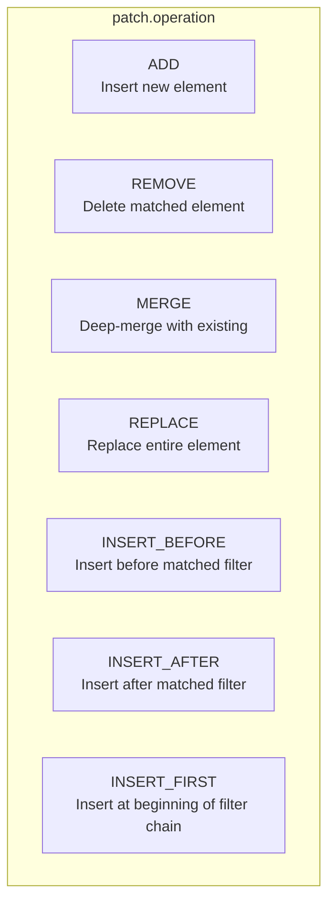

### 5. Match Criteria

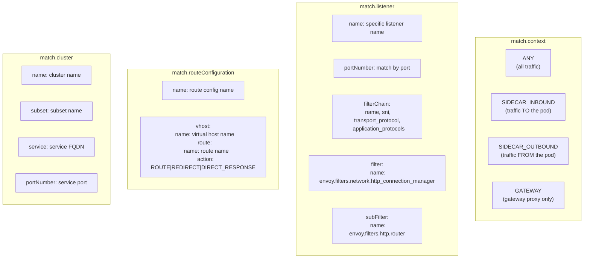

### 6. EnvoyFilter Examples

#### Example 1: Add Custom HTTP Filter

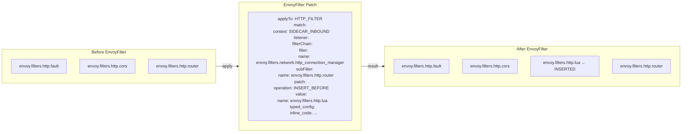

#### Example 2: Modify Cluster Settings

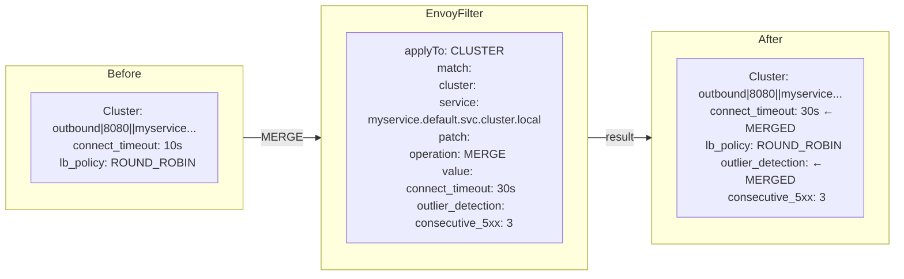

#### Example 3: Add Listener-Level Filter

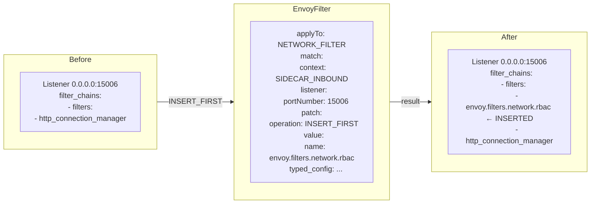

### 7. EnvoyFilter Priority and Ordering

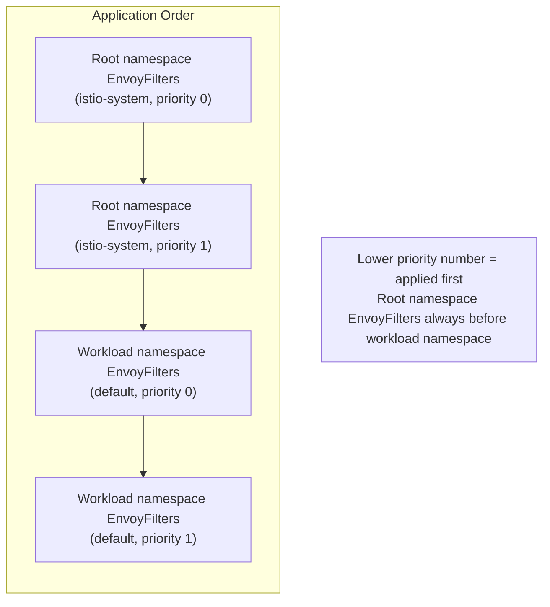

### 8. Common Pitfalls

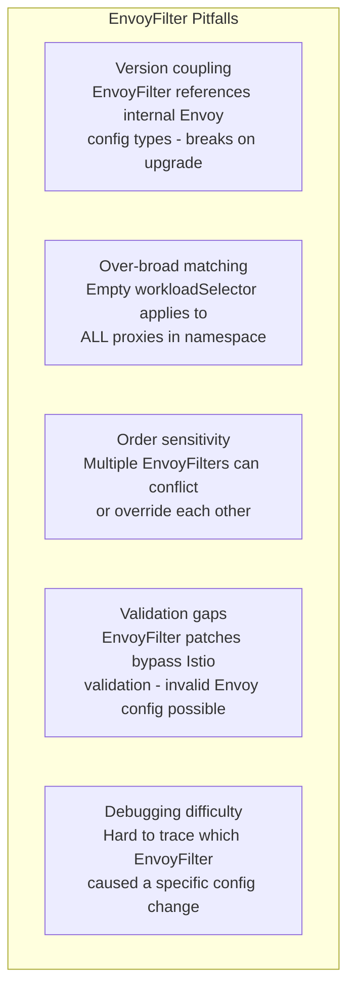

---

## Section B: Sidecar vs Gateway Mode

### 1. Deployment Topologies

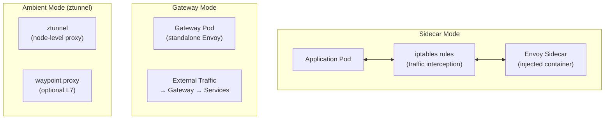

### 2. Listener Topology: Sidecar

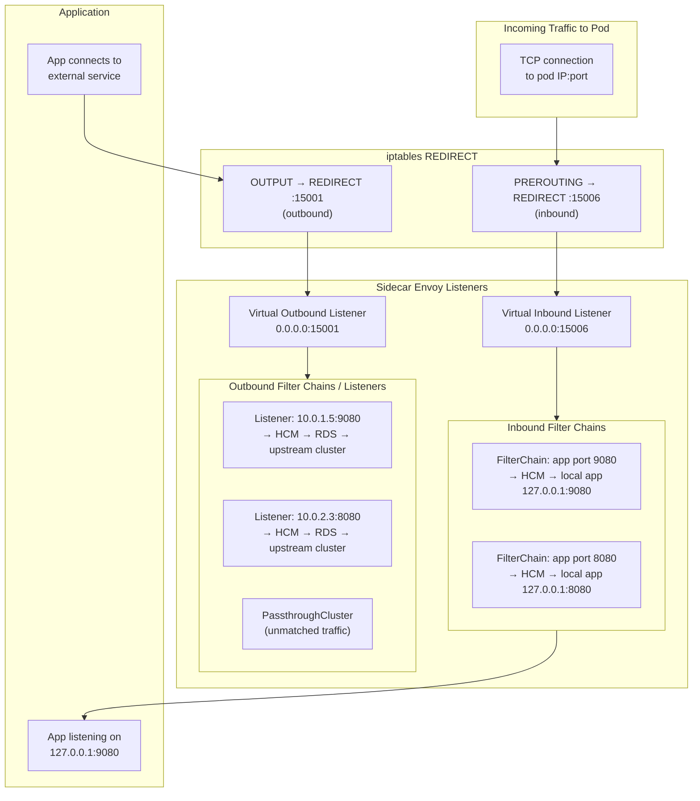

### 3. Listener Topology: Gateway

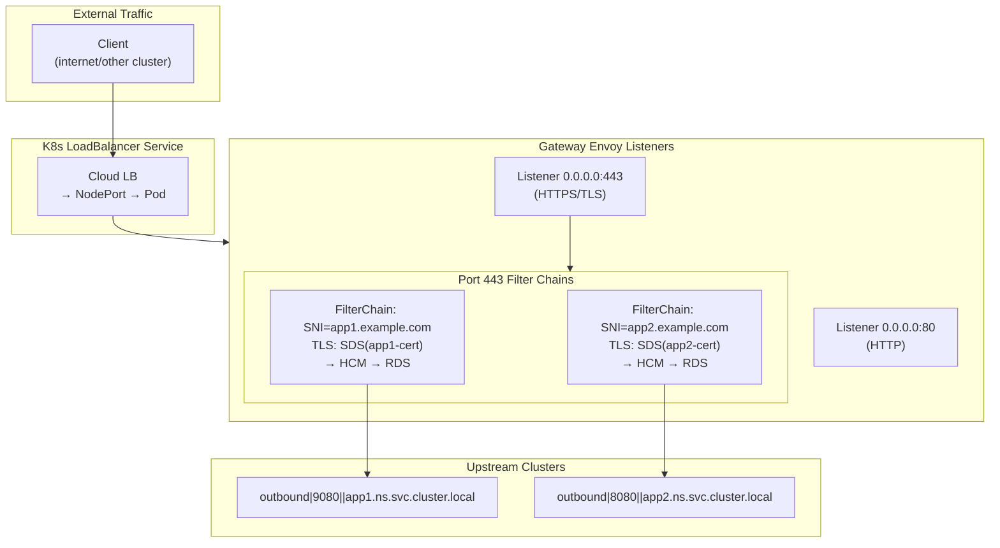

### 4. Side-by-Side Comparison

| Aspect | Sidecar | Gateway |
|--------|---------|---------|
| **Deployment** | Injected into every app pod | Standalone pod(s) |
| **Traffic interception** | iptables REDIRECT | Direct port binding |
| **Inbound listener** | `0.0.0.0:15006` (virtual) | N/A (all traffic is "inbound") |
| **Outbound listener** | `0.0.0.0:15001` (virtual) + per-service | N/A |
| **Listener source** | Auto-generated from service discovery | Gateway CRD |
| **Filter chains** | Per-service port | Per-server (SNI-based) |
| **Route configs** | Per-service port | Per-Gateway server |
| **Clusters** | All services visible to sidecar | Only referenced services |
| **mTLS** | Both sides (upstream + downstream) | Usually downstream only |
| **Scale** | One proxy per pod | Shared proxy for many services |

### 5. Bootstrap Differences

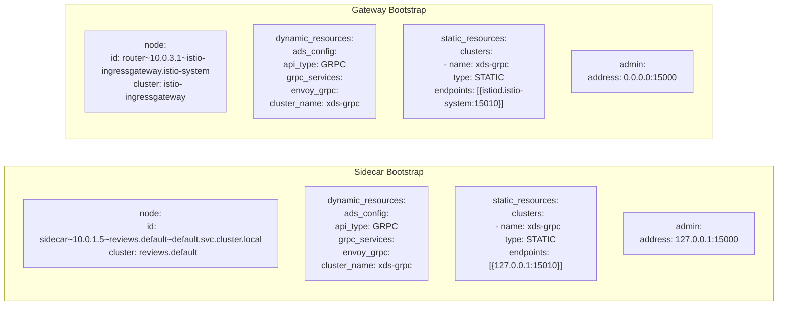

### Key Bootstrap Differences

| Field | Sidecar | Gateway |
|-------|---------|---------|
| `node.id` prefix | `sidecar~` | `router~` |
| `node.id` format | `sidecar~{IP}~{pod}.{ns}~{ns}.svc.cluster.local` | `router~{IP}~{pod}.{ns}~{ns}.svc.cluster.local` |
| xDS server address | `127.0.0.1:15010` (local pilot-agent) | `istiod.istio-system:15010` (remote) |
| Admin bind | `127.0.0.1:15000` (localhost only) | `0.0.0.0:15000` (accessible) |
| Proxy type in metadata | `sidecar` | `router` |

### 6. How Istiod Uses Proxy Type

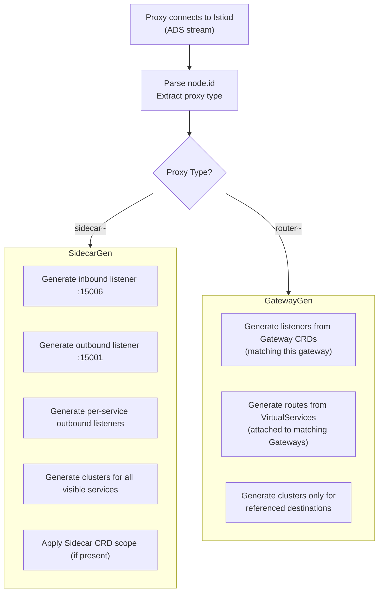

### 7. Sidecar CRD — Scoping Sidecar Config

The `Sidecar` CRD controls what services a sidecar can see:

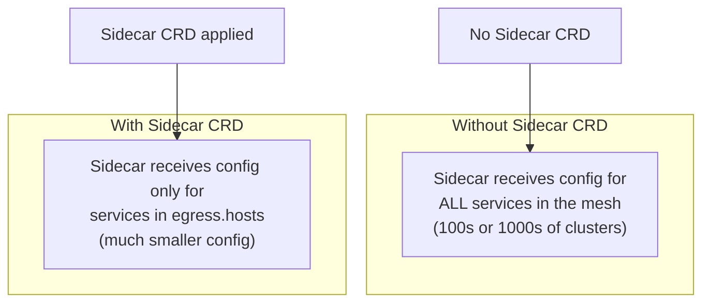

### Sidecar CRD Structure

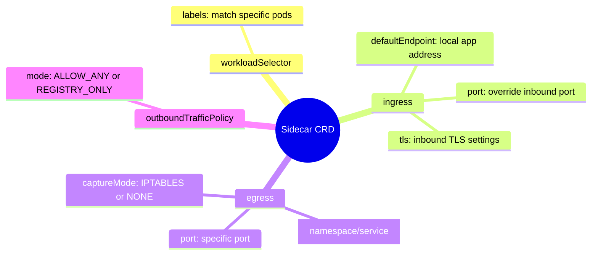

### Sidecar CRD Example

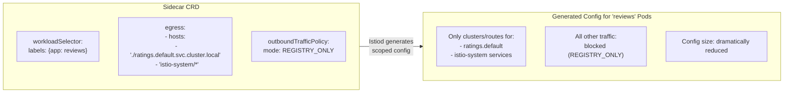

### 8. Sidecar CRD Impact on Listeners

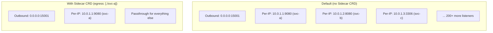

### 9. Traffic Flow Comparison

#### Sidecar Inbound Traffic

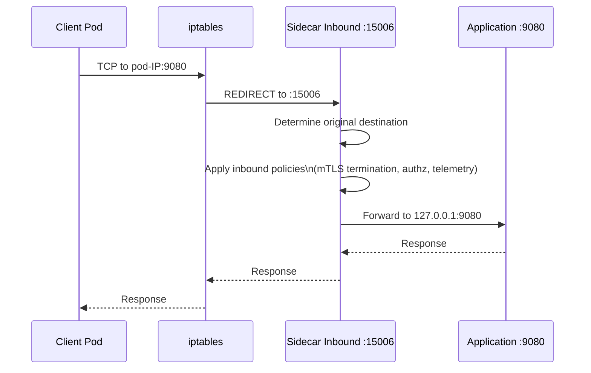

#### Sidecar Outbound Traffic

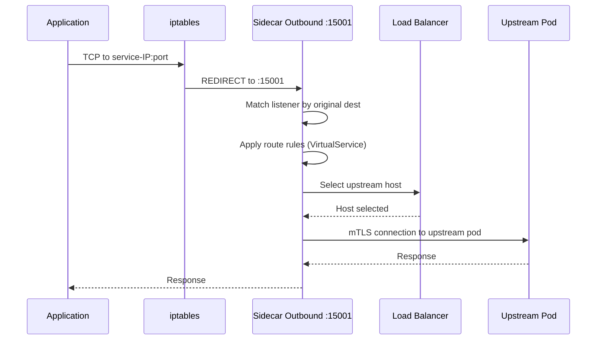

#### Gateway Traffic

```mermaid
sequenceDiagram
    participant Client as External Client
    participant GW as Gateway Envoy :443
    participant SNI as SNI-based Filter Chain
    participant LB as Load Balancer
    participant Upstream as Upstream Pod

    Client->>GW: TLS ClientHello (SNI=app.example.com)
    GW->>SNI: Match filter chain by SNI
    SNI->>SNI: TLS termination
    SNI->>SNI: Apply route rules (VirtualService)
    SNI->>LB: Select upstream host
    LB-->>SNI: Host selected
    SNI->>Upstream: Forward (with or without mTLS)
    Upstream-->>GW: Response
    GW-->>Client: Response
```

### 10. Istio-Specific Envoy Extensions

These extensions in `contrib/istio/` are loaded into the Envoy binary for Istio-specific functionality:

```mermaid
flowchart TD
    subgraph IstioExtensions["Istio-Specific Envoy Extensions"]
        subgraph NetworkFilters["Network Filters"]
            MX["metadata_exchange\n(exchange workload identity\nbetween proxies)"]
        end

        subgraph HTTPFilters["HTTP Filters"]
            PM["peer_metadata\n(propagate peer info\nvia HTTP headers)"]
            IS["istio_stats\n(Istio-specific metrics:\nrequest count, duration, size\nby source/dest workload)"]
            ALPN["alpn\n(protocol negotiation\nfor Istio mTLS)"]
        end

        subgraph Common["Common Libraries"]
            WMO["WorkloadMetadataObject\n(workload identity:\nnamespace, name, labels)"]
            WDS["WorkloadDiscoveryService\n(resolve peer identity)"]
        end
    end

    MX --> WMO
    PM --> WMO
    IS --> WMO
    WMO --> WDS
```

### 11. Decision Matrix: When to Use What

```mermaid
flowchart TD
    Start["Need to configure Envoy behavior?"] --> Q1{"Standard Istio\nCRD covers it?"}
    Q1 -->|Yes| UseCRD["Use VirtualService/\nDestinationRule/\nGateway/PeerAuthentication"]
    Q1 -->|No| Q2{"Need raw Envoy\nconfig access?"}
    Q2 -->|Yes| UseEF["Use EnvoyFilter"]
    Q2 -->|No| Q3{"Need to scope\nsidecar config?"}
    Q3 -->|Yes| UseSC["Use Sidecar CRD"]
    Q3 -->|No| UseWASM["Consider WASM\nor Lua extension"]

    UseCRD --> Best["Best: type-safe,\nupgrade-resilient"]
    UseEF --> Caution["Caution: version-coupled,\nhard to debug"]
    UseSC --> Good["Good: reduces config size,\nimproves performance"]
    UseWASM --> Advanced["Advanced: custom logic\nwithout config coupling"]
```
