# Envoy Flows and Request Flow — Combined Documentation

This document combines all content from `docs/flows/` and `docs/request-flow/` into a single reference.

---

## Source Files
- Request Flow: docs/request-flow/01-overview.md through 12-response-flow.md
- Flows: docs/flows/README.md, 01_connection_lifecycle.md through 05_retry_circuit_breaking.md

---


---

# Part 1: Envoy Request Receive Flow — End-to-End Overview

## Introduction

This document series explains how Envoy receives and processes an HTTP request from a downstream client. The request path touches three major layers — **Listener**, **Network (L4)**, and **HTTP (L7)** — each with its own filter chain. Understanding this architecture is key to debugging, extending, and operating Envoy.

## High-Level Architecture

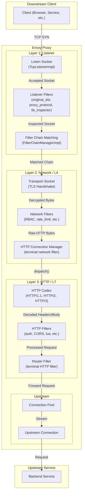

## The Three Filter Layers

Envoy's filter architecture is layered. Each layer has its own filter chain with distinct responsibilities:

| Layer | Filter Type | When It Runs | Key Responsibility |
|-------|------------|--------------|-------------------|
| **Listener** | `ListenerFilter` | After socket accept, before connection creation | Inspect raw bytes to determine protocol, original destination |
| **Network (L4)** | `ReadFilter` / `WriteFilter` | After connection creation, on every read/write | L4 access control, rate limiting, protocol bridging |
| **HTTP (L7)** | `StreamDecoderFilter` / `StreamEncoderFilter` | After HTTP parsing, per-request | Authentication, routing, header manipulation |

## Key Classes (Overview)

```mermaid
classDiagram
    class TcpListenerImpl {
        +onSocketEvent()
        -socket_.ioHandle().accept()
    }
    class ActiveTcpListener {
        +onAccept(ConnectionSocketPtr)
        +onAcceptWorker(ActiveTcpSocket)
        +newConnection()
    }
    class ActiveTcpSocket {
        +continueFilterChain()
        +newConnection()
        -accept_filters_
    }
    class ConnectionImpl {
        +onReadReady()
        +write()
        -filter_manager_
        -transport_socket_
    }
    class FilterManagerImpl {
        +onRead()
        +onWrite()
        +addReadFilter()
        -upstream_filters_
        -downstream_filters_
    }
    class ConnectionManagerImpl {
        +onData()
        +newStream()
        -codec_
        -streams_
    }
    class ActiveStream {
        +decodeHeaders()
        +decodeData()
        -filter_manager_
        -response_encoder_
    }
    class HttpFilterManager["FilterManager (HTTP)"] {
        +decodeHeaders()
        +encodeHeaders()
        -decoder_filters_
        -encoder_filters_
    }
    class RouterFilter["Router (Filter)"] {
        +decodeHeaders()
        -upstream_requests_
    }

    TcpListenerImpl --> ActiveTcpListener : "onAccept callback"
    ActiveTcpListener --> ActiveTcpSocket : "creates"
    ActiveTcpSocket --> ConnectionImpl : "newConnection()"
    ConnectionImpl --> FilterManagerImpl : "owns"
    FilterManagerImpl --> ConnectionManagerImpl : "HCM is a ReadFilter"
    ConnectionManagerImpl --> ActiveStream : "creates per request"
    ActiveStream --> HttpFilterManager : "owns"
    HttpFilterManager --> RouterFilter : "terminal decoder filter"
```

## End-to-End Request Flow Summary

The following sequence shows the complete journey of a single HTTP request:

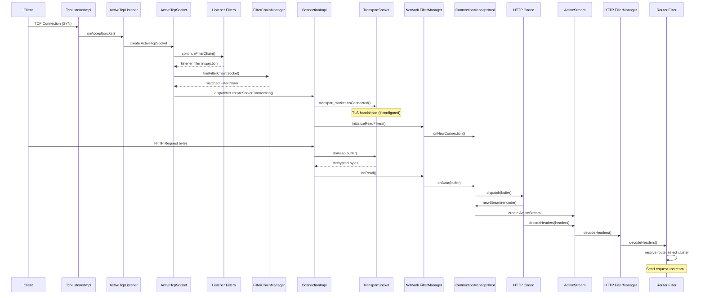

## Document Series Index

| Part | Topic | Key Classes |
|------|-------|-------------|
| [Part 1](01-overview.md) | End-to-End Overview | All |
| [Part 2](02-listener-socket-accept.md) | Listener Layer: Socket Accept | `TcpListenerImpl`, `ActiveTcpListener`, `ActiveTcpSocket` |
| [Part 3](03-listener-filters.md) | Listener Filters | `ListenerFilter`, `ListenerFilterManager`, `ActiveTcpSocket` |
| [Part 4](04-filter-chain-matching.md) | Filter Chain Matching | `FilterChainManagerImpl`, `FilterChainImpl` |
| [Part 5](05-network-filters.md) | Network (L4) Filters | `FilterManagerImpl`, `ReadFilter`, `WriteFilter` |
| [Part 6](06-transport-sockets.md) | Transport Sockets and TLS | `TransportSocket`, `SslSocket` |
| [Part 7](07-http-connection-manager.md) | HTTP Connection Manager | `ConnectionManagerImpl`, `ActiveStream` |
| [Part 8](08-http-codec.md) | HTTP Codec Layer | `ServerConnectionImpl` (HTTP/1, HTTP/2) |
| [Part 9](09-http-filter-manager.md) | HTTP Filter Manager | `FilterManager`, `ActiveStreamDecoderFilter` |
| [Part 10](10-router-filter.md) | Router Filter | `Router::Filter`, `UpstreamRequest` |
| [Part 11](11-connection-pools.md) | Connection Pools | `HttpConnPoolImplBase`, `ActiveClient` |
| [Part 12](12-response-flow.md) | Response Flow | Encoder path, `UpstreamCodecFilter` |

## Source File Map

For reference, the most important source files in the request path:

```
envoy/
├── envoy/                              # Public interfaces
│   ├── network/
│   │   ├── filter.h                    # Network filter interfaces
│   │   ├── listener.h                  # Listener interfaces
│   │   └── transport_socket.h          # Transport socket interface
│   ├── http/
│   │   ├── codec.h                     # HTTP codec interfaces
│   │   ├── filter.h                    # HTTP filter interfaces
│   │   └── filter_factory.h            # HTTP filter factory
│   ├── server/
│   │   └── filter_config.h             # Filter config factories
│   └── router/
│       └── router.h                    # Route interfaces
├── source/
│   ├── common/
│   │   ├── listener_manager/
│   │   │   ├── listener_impl.h/cc      # Listener configuration
│   │   │   ├── active_tcp_listener.h   # Active listener on worker
│   │   │   ├── active_tcp_socket.h     # Socket during listener filters
│   │   │   ├── active_stream_listener_base.h  # Connection creation
│   │   │   └── filter_chain_manager_impl.h    # Filter chain matching
│   │   ├── network/
│   │   │   ├── connection_impl.h/cc    # TCP connection
│   │   │   ├── filter_manager_impl.h   # Network filter manager
│   │   │   └── tcp_listener_impl.h     # Raw TCP listener
│   │   ├── http/
│   │   │   ├── conn_manager_impl.h/cc  # HTTP Connection Manager
│   │   │   ├── filter_manager.h/cc     # HTTP filter manager
│   │   │   ├── http1/codec_impl.h      # HTTP/1 codec
│   │   │   └── http2/codec_impl.h      # HTTP/2 codec
│   │   └── router/
│   │       ├── router.h/cc             # Router filter
│   │       └── upstream_request.h      # Upstream request
│   └── extensions/
│       └── filters/
│           ├── listener/               # Listener filter extensions
│           ├── network/                # Network filter extensions
│           │   └── http_connection_manager/  # HCM config
│           └── http/                   # HTTP filter extensions
│               └── router/             # Router config
```

---

# Part 2: Listener Layer — Socket Accept and Connection Acceptance

## Overview

The listener layer is the very first point of contact between a downstream client and Envoy. When a TCP connection arrives, Envoy must accept the socket, run listener filters, match a filter chain, and create a `Connection` object. This document covers the socket accept path in detail.

## Key Classes (Listener Layer)

```mermaid
classDiagram
    class ListenerManagerImpl {
        +addOrUpdateListener()
        +addListenerToWorker()
        -active_listeners_
        -warming_listeners_
    }
    class ListenerImpl {
        +createListenerFilterChain()
        +createNetworkFilterChain()
        +filterChainManager()
        -listener_filter_factories_
        -filter_chain_manager_
    }
    class TcpListenerImpl {
        +onSocketEvent()
        -socket_ : SocketSharedPtr
        -cb_ : TcpListenerCallbacks
    }
    class ActiveTcpListener {
        +onAccept(socket)
        +onAcceptWorker(socket)
        +newActiveConnection()
        -connection_balancer_
    }
    class ActiveTcpSocket {
        +continueFilterChain()
        +newConnection()
        -accept_filters_
        -socket_
    }
    class ConnectionHandlerImpl {
        +addListener()
        -listeners_
    }

    ListenerManagerImpl --> ListenerImpl : "creates"
    ListenerManagerImpl --> ConnectionHandlerImpl : "distributes to workers"
    ConnectionHandlerImpl --> ActiveTcpListener : "creates per address"
    ActiveTcpListener --> TcpListenerImpl : "owns (Network::Listener)"
    TcpListenerImpl --> ActiveTcpListener : "onAccept callback"
    ActiveTcpListener --> ActiveTcpSocket : "creates per accepted socket"
```

## Listener Lifecycle

### 1. ListenerManagerImpl — Configuration to Runtime

`ListenerManagerImpl` (`source/common/listener_manager/listener_manager_impl.h`) is the brain of listener management. It:

- Receives listener configs from LDS or static config
- Creates `ListenerImpl` objects (warming → active lifecycle)
- Distributes active listeners to worker threads via `ConnectionHandlerImpl`

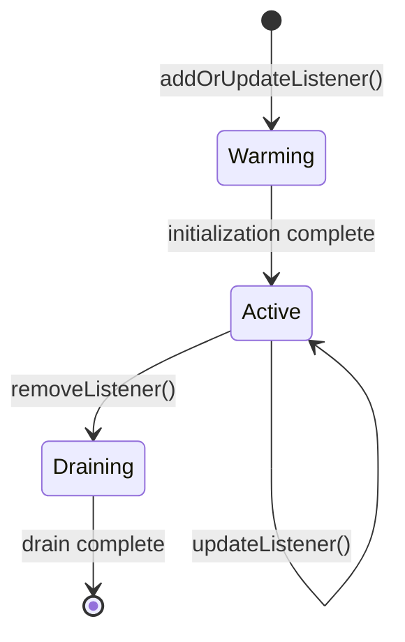

### 2. ListenerImpl — The Configuration Object

`ListenerImpl` (`source/common/listener_manager/listener_impl.h:165-401`) is **not** an active listener — it is the configuration holder. It implements two key interfaces:

- **`Network::ListenerConfig`** — provides socket factories, filter chain manager, stats
- **`Network::FilterChainFactory`** — creates listener and network filter chains

Key fields:

| Field | Type | Purpose |
|-------|------|---------|
| `listener_filter_factories_` | `ListenerFilterFactoriesList` | Factories for listener filters |
| `filter_chain_manager_` | `FilterChainManagerImpl` | Matches connections to filter chains |
| `listen_socket_factories_` | `ListenSocketFactoryImpl` | Creates/manages listen sockets |
| `connection_balancer_` | `ConnectionBalancer` | Distributes connections across workers |

### 3. ListenSocketFactoryImpl — Socket Creation

`ListenSocketFactoryImpl` (`source/common/listener_manager/listener_impl.h:60-105`) manages the actual listen sockets:

- With `reuse_port`: each worker gets its own listen socket (kernel-level load balancing)
- Without `reuse_port`: sockets are duplicated from a single listen socket

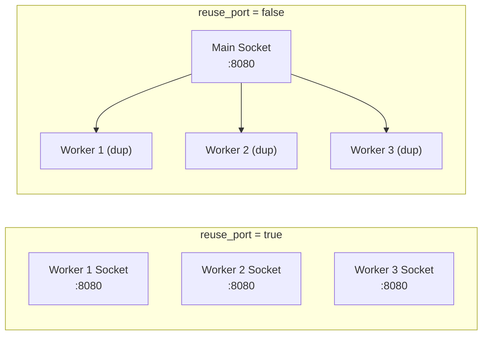

## Socket Accept Flow

### 4. TcpListenerImpl — The Event Loop Listener

`TcpListenerImpl` (`source/common/network/tcp_listener_impl.cc:57-132`) is registered with the event loop (libevent). When a socket becomes readable:

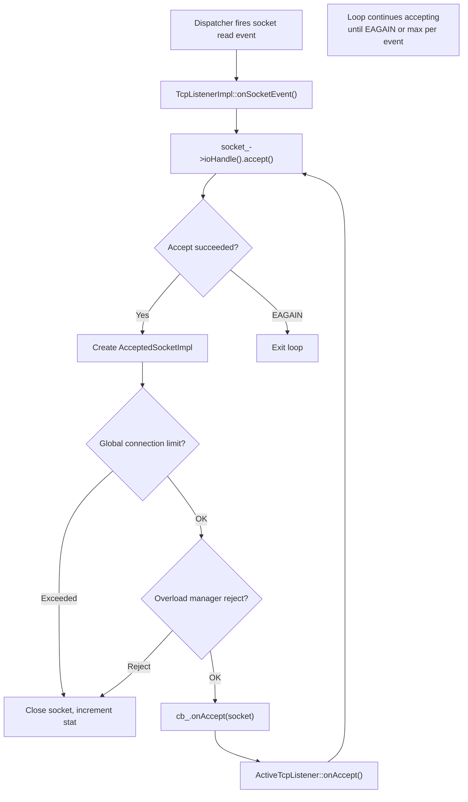

The accept loop handles multiple connections per event to avoid starvation:

```
File: source/common/network/tcp_listener_impl.cc (lines 57-132)

1. Event fires → onSocketEvent()
2. Loop:
   a. socket_->ioHandle().accept() → new ConnectionSocket
   b. Check global connection limit
   c. Check overload manager (reject fraction)
   d. Call cb_.onAccept(std::make_unique<AcceptedSocketImpl>(...))
   e. Repeat until EAGAIN
```

### 5. ActiveTcpListener — Worker-Level Connection Handler

`ActiveTcpListener` (`source/common/listener_manager/active_tcp_listener.h:27-86`) sits on each worker thread and implements `Network::TcpListenerCallbacks`:

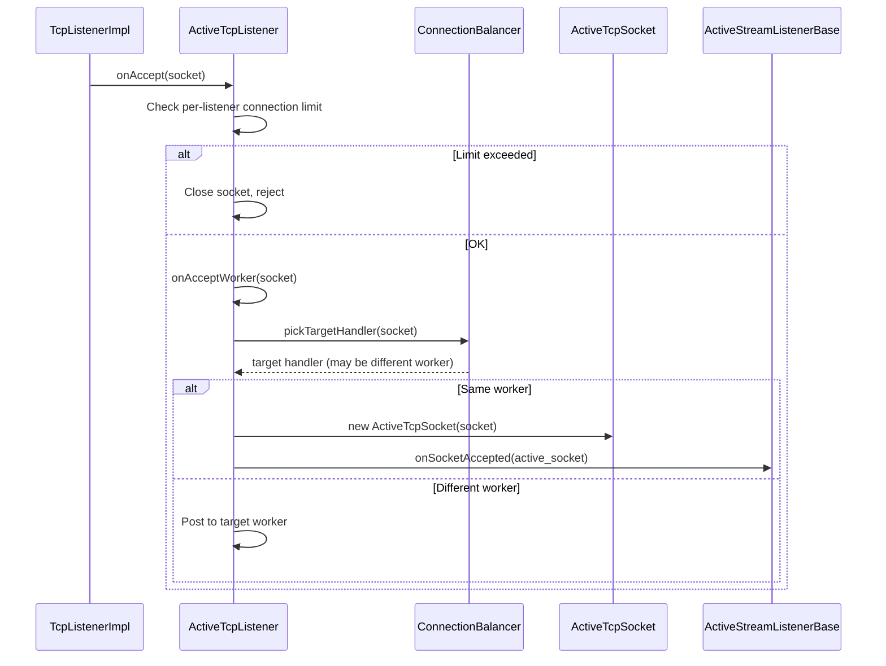

The `ConnectionBalancer` can redirect a socket to a different worker — this is used by the DLB (Dynamic Load Balancer) extension for hardware-accelerated connection distribution.

### 6. ActiveTcpSocket — Socket During Listener Filter Processing

`ActiveTcpSocket` (`source/common/listener_manager/active_tcp_socket.h:28-92`) wraps the accepted socket while listener filters are running. It implements:

- **`Network::ListenerFilterManager`** — filters register themselves here
- **`Network::ListenerFilterCallbacks`** — filters call back into this

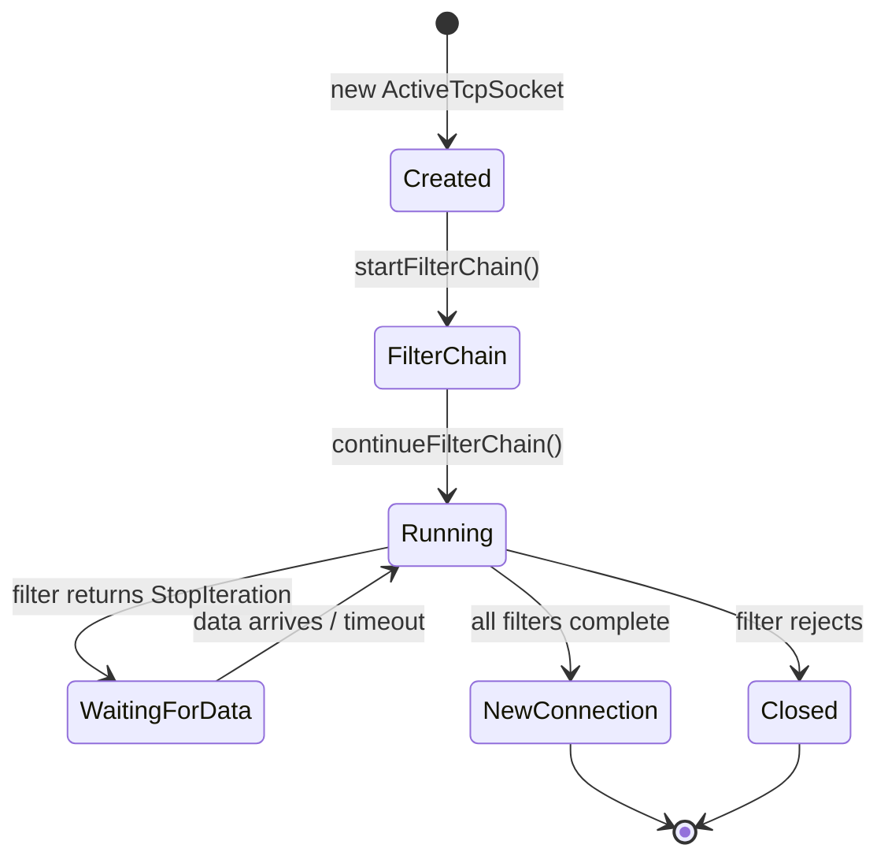

## Connection Creation

### 7. From Socket to Connection

After all listener filters complete, `ActiveTcpSocket::newConnection()` is called, which leads to `ActiveStreamListenerBase::newConnection()`:

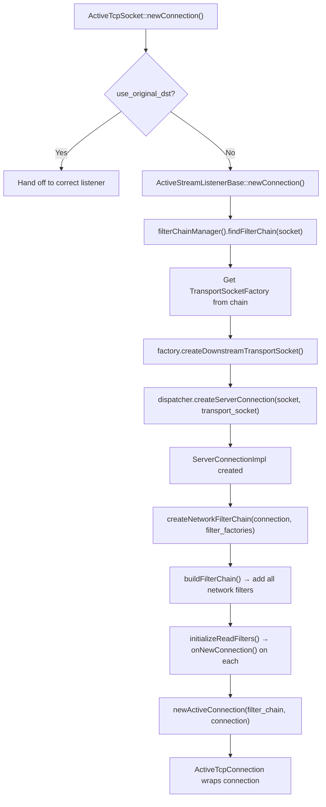

```
File: source/common/listener_manager/active_stream_listener_base.cc (lines 20-49)

1. findFilterChain(socket, stream_info) → matched FilterChainImpl
2. Create transport socket (e.g., TLS) from the chain
3. dispatcher.createServerConnection(socket, transport_socket)
4. createNetworkFilterChain(connection, network_filter_factories)
5. newActiveConnection() → ActiveTcpConnection tracks the connection
```

## Class Relationship Summary

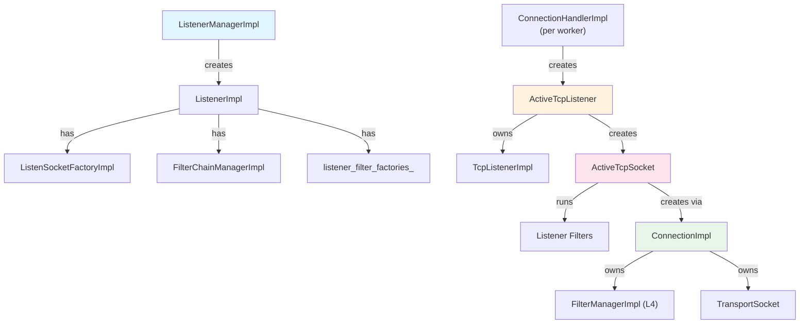

## Key Source Files

| File | Lines | What It Does |
|------|-------|-------------|
| `source/common/listener_manager/listener_manager_impl.h` | 174-314 | Listener lifecycle management |
| `source/common/listener_manager/listener_impl.h` | 165-401 | Listener config and filter chain factory |
| `source/common/network/tcp_listener_impl.cc` | 57-132 | Raw socket accept loop |
| `source/common/listener_manager/active_tcp_listener.h` | 27-86 | Per-worker active listener |
| `source/common/listener_manager/active_tcp_socket.h` | 28-92 | Socket during listener filter processing |
| `source/common/listener_manager/active_stream_listener_base.cc` | 20-49 | Connection creation after filter chain match |

---

**Next:** [Part 3 — Listener Filters: Creation and Chain Execution](03-listener-filters.md)

---

# Part 3: Listener Filters — Creation and Chain Execution

## Overview

Listener filters run immediately after a socket is accepted, **before** a connection object is created. They inspect raw bytes on the socket to determine protocol information (TLS vs plaintext, HTTP version, original destination) that is needed to select the correct filter chain.

## Why Listener Filters Exist

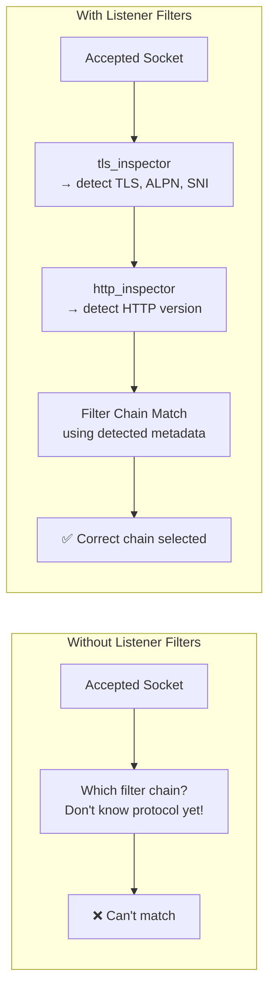

The key insight: filter chain matching needs information (SNI, ALPN, transport protocol) that can only be determined by peeking at the raw bytes on the socket.

## Common Listener Filters

| Filter | Purpose | What It Sets |
|--------|---------|-------------|
| `tls_inspector` | Peeks at ClientHello to detect TLS | SNI, ALPN, transport_protocol="tls" |
| `http_inspector` | Detects HTTP version from first bytes | application_protocol="h2c" or "http/1.1" |
| `original_dst` | Gets original destination from SO_ORIGINAL_DST | Restored destination address |
| `proxy_protocol` | Parses PROXY protocol header | Source/dest addresses from proxy header |

## Listener Filter Interface

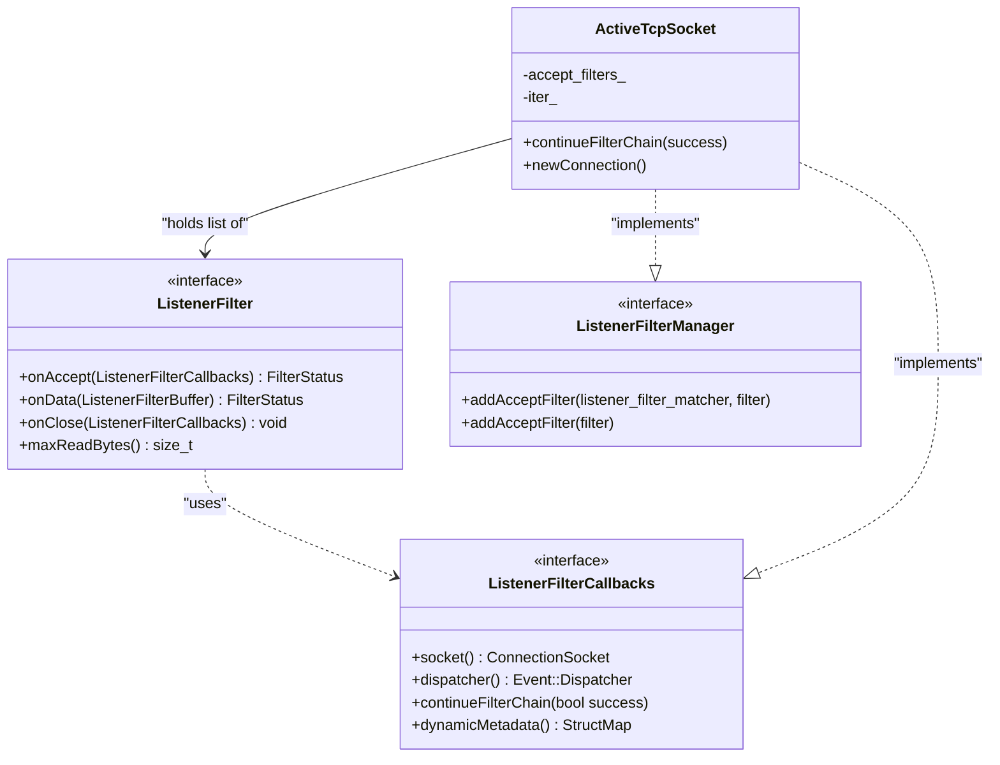

**Interface location:** `envoy/network/filter.h` (lines 334-365)

Key methods:
- `onAccept(callbacks)` — called when the socket is accepted, can inspect/modify socket metadata
- `onData(buffer)` — called when data is available on the socket (for filters that need to read bytes)
- `maxReadBytes()` — how many bytes this filter needs to peek at
- `onClose()` — cleanup when the socket is closed during filter processing

## Listener Filter Factory Pattern

### Factory Registration

Each listener filter type has a factory that implements `NamedListenerFilterConfigFactory`:

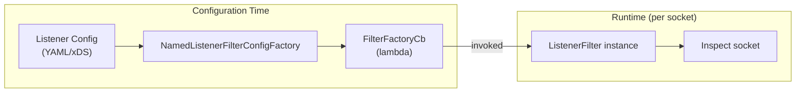

### Factory Creation in ListenerImpl

```
File: source/common/listener_manager/listener_impl.cc (lines 434-459)

createListenerFilterFactories():
  1. For each listener_filter in config:
     a. Look up factory by name in registry
     b. Call factory.createListenerFilterFactoryFromProto(config, context)
     c. Store returned FilterFactoryCb in listener_filter_factories_
  2. Add built-in filters:
     a. buildOriginalDstListenerFilter() — if use_original_dst is set
     b. buildProxyProtocolListenerFilter() — if proxy_protocol is configured
```

### Built-in Listener Filters

Some listener filters are added implicitly based on listener configuration:

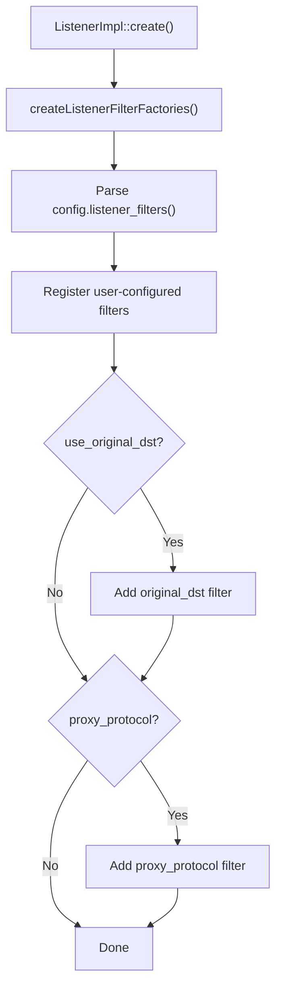

## Filter Chain Execution

### Creating the Chain

When a socket is accepted, `ActiveStreamListenerBase::onSocketAccepted()` creates the listener filter chain:

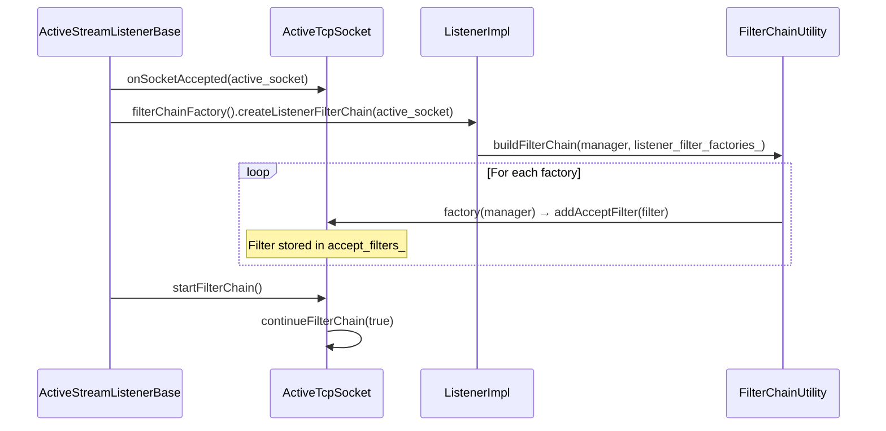

```
File: source/common/listener_manager/listener_impl.cc (lines 706-714)

ListenerImpl::createListenerFilterChain(manager):
  FilterChainUtility::buildFilterChain(manager, listener_filter_factories_)
  → For each factory: factory(manager) calls addAcceptFilter()
```

### Iterating Filters

`ActiveTcpSocket::continueFilterChain()` drives the iteration:

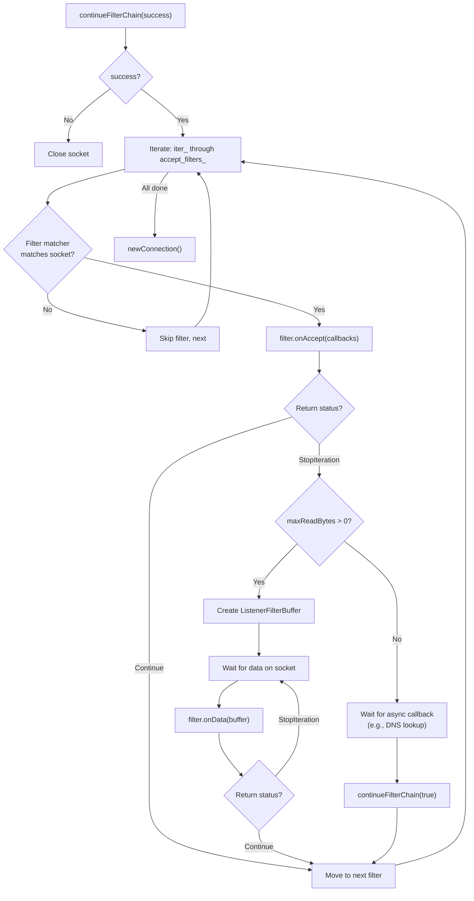

```
File: source/common/listener_manager/active_tcp_socket.cc (lines 109-173)

continueFilterChain(success):
  1. If !success → close socket, return
  2. For each filter in accept_filters_ (starting from iter_):
     a. If filter matcher doesn't match → skip
     b. Call filter->onAccept(*this)
     c. If StopIteration:
        - If filter needs data (maxReadBytes > 0):
          Create ListenerFilterBuffer, wait for bytes
        - Else: wait for async continueFilterChain() callback
        - Return (will resume later)
     d. If Continue → advance to next filter
  3. All filters done → newConnection()
```

### Example: TLS Inspector Filter Flow

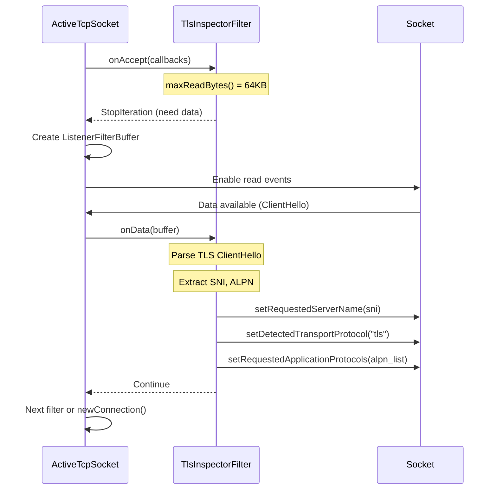

## Timeout Handling

Listener filters have a configurable timeout. If filters don't complete within this time:

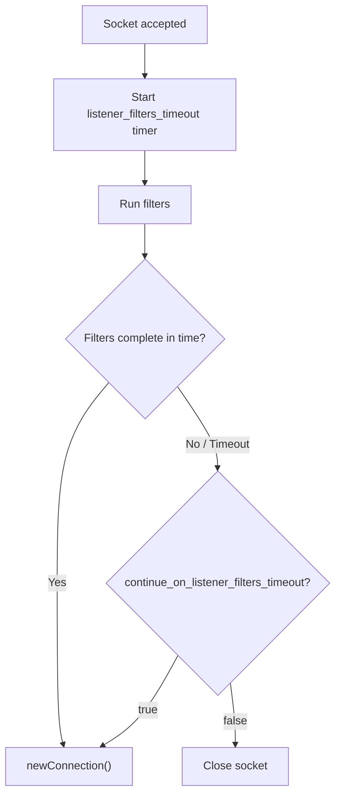

The timeout prevents listener filters from holding a socket indefinitely (e.g., waiting for bytes that never arrive from a non-TLS client on a TLS-expected listener).

## Filter Order Matters

Listener filter ordering is critical because each filter may set metadata that subsequent filters or the filter chain matcher depends on:

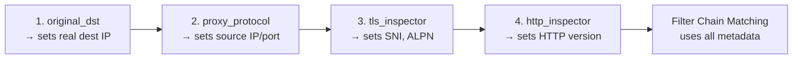

## Key Source Files

| File | Lines | What It Does |
|------|-------|-------------|
| `envoy/network/filter.h` | 334-365 | `ListenerFilter` interface |
| `source/common/listener_manager/listener_impl.cc` | 434-459 | Creates listener filter factories |
| `source/common/listener_manager/listener_impl.cc` | 706-714 | `createListenerFilterChain()` |
| `source/common/listener_manager/active_tcp_socket.cc` | 109-173 | `continueFilterChain()` iteration |
| `source/common/listener_manager/active_tcp_socket.h` | 28-92 | `ActiveTcpSocket` class |
| `source/server/configuration_impl.cc` | 46-57 | `buildFilterChain()` for listener filters |

---

**Previous:** [Part 2 — Listener Layer: Socket Accept](02-listener-socket-accept.md)  
**Next:** [Part 4 — Filter Chain Matching and Selection](04-filter-chain-matching.md)

---

# Part 4: Filter Chain Matching and Selection

## Overview

After listener filters finish inspecting the socket, Envoy must select which **filter chain** to use for the new connection. A single listener can have multiple filter chains, each with different TLS contexts, network filters, and configurations. The `FilterChainManagerImpl` performs a hierarchical match against socket properties to find the best chain.

## Why Multiple Filter Chains?

A single listener on port 443 might serve multiple domains with different TLS certificates and different backend configurations:

```mermaid
graph TD
    subgraph "Listener :443"
        L["Listen Socket"]
        
        FC1["Filter Chain 1<br/>SNI: api.example.com<br/>TLS: cert-api<br/>→ API network filters"]
        FC2["Filter Chain 2<br/>SNI: web.example.com<br/>TLS: cert-web<br/>→ Web network filters"]
        FC3["Filter Chain 3<br/>SNI: *.internal.com<br/>TLS: cert-internal<br/>→ Internal filters"]
        FCD["Default Filter Chain<br/>→ Catch-all"]
    end
    
    L --> FC1
    L --> FC2
    L --> FC3
    L --> FCD
```

## Key Classes (Filter Chain Matching)

```mermaid
classDiagram
    class FilterChainManager {
        <<interface>>
        +findFilterChain(socket, stream_info) FilterChain*
    }
    class FilterChainManagerImpl {
        +addFilterChains(filter_chains, builder, manager)
        +findFilterChain(socket, stream_info) FilterChain*
        -filter_chains_ : map
        -default_filter_chain_
        -fc_contexts_ : map of destination port → match tree
    }
    class FilterChain {
        <<interface>>
        +transportSocketFactory() TransportSocketFactory
        +networkFilterFactories() NetworkFilterFactoriesList
    }
    class FilterChainImpl {
        -transport_socket_factory_
        -filters_factory_ : list of FilterConfigProviderPtr
        -name_
    }
    class FilterChainFactoryBuilder {
        <<interface>>
        +buildFilterChain(chain_config, context) FilterChainAndStatus
    }

    FilterChainManagerImpl ..|> FilterChainManager
    FilterChainImpl ..|> FilterChain
    FilterChainManagerImpl --> FilterChainImpl : "holds many"
    FilterChainManagerImpl --> FilterChainFactoryBuilder : "uses to build"
```

## FilterChainImpl — What a Filter Chain Contains

`FilterChainImpl` (`source/common/listener_manager/filter_chain_manager_impl.h:105-135`) holds everything needed to set up a connection:

```mermaid
graph TD
    FC["FilterChainImpl"]
    FC --> TSF["TransportSocketFactory<br/>(e.g., TLS context with certs)"]
    FC --> NFF["NetworkFilterFactories<br/>(list of FilterConfigProviderPtr)"]
    FC --> Meta["Metadata<br/>(labels, identity)"]
    FC --> Name["Name<br/>(for debugging/stats)"]
    
    NFF --> F1["RBAC Filter Factory"]
    NFF --> F2["Rate Limit Factory"]
    NFF --> F3["HCM Factory<br/>(HTTP Connection Manager)"]
```

Each `FilterConfigProviderPtr<FilterFactoryCb>` can be:
- **Static:** factory created at config time, never changes
- **Dynamic (ECDS):** factory updated via xDS, can be missing during warm-up

## The Matching Algorithm

### Hierarchical Match Tree

`FilterChainManagerImpl` builds a multi-level trie/map structure for efficient matching:

```mermaid
flowchart TD
    Socket["Incoming Socket"] --> DP["1. Destination Port"]
    DP --> DIP["2. Destination IP<br/>(LcTrie prefix match)"]
    DIP --> SN["3. Server Name (SNI)<br/>(exact or wildcard)"]
    SN --> TP["4. Transport Protocol<br/>('tls' or 'raw_buffer')"]
    TP --> AP["5. Application Protocol<br/>(ALPN: 'h2', 'http/1.1')"]
    AP --> DSIP["6. Direct Source IP"]
    DSIP --> ST["7. Source Type<br/>(local, external, any)"]
    ST --> SIP["8. Source IP"]
    SIP --> SP["9. Source Port"]
    SP --> Result{Match found?}
    Result -->|Yes| Chain["Use matched FilterChain"]
    Result -->|No| Default{Default chain?}
    Default -->|Yes| DefChain["Use default FilterChain"]
    Default -->|No| Reject["Reject connection"]
```

### Match Priority

Each level performs matching in the following priority:

| Level | Socket Property | Match Method |
|-------|----------------|-------------|
| 1 | Destination port | Exact match |
| 2 | Destination IP | Longest prefix match (CIDR) via LcTrie |
| 3 | Server name (SNI) | Exact → suffix wildcard (*.example.com) |
| 4 | Transport protocol | Exact ("tls", "raw_buffer") |
| 5 | Application protocol | Exact ("h2", "http/1.1") |
| 6 | Direct source IP | Longest prefix match |
| 7 | Source type | Local → External → Any |
| 8 | Source IP | Longest prefix match |
| 9 | Source port | Exact match |

### Matcher-Based Matching (Alternative)

Envoy also supports a newer unified matcher framework. When configured:

```mermaid
flowchart TD
    Socket["Incoming Socket"] --> MD["Build Network::MatchingData<br/>(from socket properties)"]
    MD --> ME["Matcher::evaluateMatch(matching_data)"]
    ME --> Action["MatchAction → FilterChain"]
```

```
File: source/common/listener_manager/filter_chain_manager_impl.cc (lines 366-393)

findFilterChain(socket, stream_info):
  if matcher configured:
    → Build MatchingData from socket
    → evaluateMatch() using xDS matcher
    → Return matched FilterChain from action
  else:
    → Hierarchical multi-level lookup through fc_contexts_
```

## How Filter Chains Are Built

### At Configuration Time

When a listener is created or updated, `FilterChainManagerImpl::addFilterChains()` processes the config:

```mermaid
sequenceDiagram
    participant LI as ListenerImpl
    participant FCMI as FilterChainManagerImpl
    participant Builder as FilterChainFactoryBuilder
    participant FC as FilterChainImpl

    LI->>FCMI: addFilterChains(configs, builder, manager)
    loop For each filter_chain_config
        FCMI->>Builder: buildFilterChain(config, context)
        Builder-->>FCMI: FilterChainImpl + warm status
        FCMI->>FCMI: Insert into match tree
        Note over FCMI: Index by dest_port → dest_ip<br/>→ server_name → transport_protocol<br/>→ app_protocol → source
    end
    FCMI->>FCMI: Build default_filter_chain_ (if configured)
```

### FilterChainFactoryBuilder

The builder creates the `FilterChainImpl` by:

1. Creating `DownstreamTransportSocketFactory` (TLS context) from `transport_socket` config
2. Creating network filter factories from `filters` config
3. Wrapping everything in a `FilterChainImpl`

```mermaid
flowchart TD
    Config["filter_chain config"] --> TSConfig["transport_socket config"]
    Config --> FiltersConfig["filters config"]
    
    TSConfig --> TSFactory["TransportSocketFactory<br/>(e.g., DownstreamTlsContext)"]
    
    FiltersConfig --> F1["Filter 1 Factory"]
    FiltersConfig --> F2["Filter 2 Factory"]
    FiltersConfig --> F3["Filter N Factory"]
    
    TSFactory --> FCI["FilterChainImpl"]
    F1 --> FCI
    F2 --> FCI
    F3 --> FCI
```

## Connection Creation with Matched Chain

After `findFilterChain()` returns a chain, `ActiveStreamListenerBase::newConnection()` uses it:

```mermaid
sequenceDiagram
    participant ATS as ActiveTcpSocket
    participant ASL as ActiveStreamListenerBase
    participant FCMI as FilterChainManagerImpl
    participant FC as FilterChainImpl
    participant Disp as Dispatcher

    ATS->>ASL: newConnection(socket, stream_info)
    ASL->>FCMI: findFilterChain(socket, stream_info)
    FCMI-->>ASL: FilterChainImpl* (or nullptr)
    
    alt No matching chain
        ASL->>ASL: Close socket (no matching SNI, etc.)
    else Chain found
        ASL->>FC: transportSocketFactory()
        FC-->>ASL: TransportSocketFactory
        ASL->>ASL: factory.createDownstreamTransportSocket()
        ASL->>Disp: createServerConnection(socket, transport_socket)
        Disp-->>ASL: ServerConnectionImpl*
        ASL->>ASL: createNetworkFilterChain(conn, fc.networkFilterFactories())
    end
```

## Example: Multi-Domain TLS Listener

```mermaid
graph TD
    subgraph "Listener :443 Match Tree"
        Root["Port 443"]
        Root --> AnyIP["0.0.0.0/0 (any dest IP)"]
        
        AnyIP --> SNI1["SNI: api.example.com"]
        AnyIP --> SNI2["SNI: web.example.com"]  
        AnyIP --> SNIWild["SNI: *.internal.com"]
        
        SNI1 --> TLS1["transport: tls"]
        SNI2 --> TLS2["transport: tls"]
        SNIWild --> TLS3["transport: tls"]
        
        TLS1 --> FC1["FilterChain: api-chain<br/>Cert: api-cert<br/>Filters: [rbac, hcm-api]"]
        TLS2 --> FC2["FilterChain: web-chain<br/>Cert: web-cert<br/>Filters: [hcm-web]"]
        TLS3 --> FC3["FilterChain: internal-chain<br/>Cert: internal-cert<br/>Filters: [rbac-strict, hcm-internal]"]
    end
    
    subgraph "Request Flow"
        Client["Client → SNI: api.example.com"]
        Client --> |"tls_inspector detects SNI"| Root
        Root --> |"match"| FC1
    end
```

## Key Source Files

| File | Lines | What It Does |
|------|-------|-------------|
| `source/common/listener_manager/filter_chain_manager_impl.h` | 105-135 | `FilterChainImpl` class |
| `source/common/listener_manager/filter_chain_manager_impl.h` | 139-276 | `FilterChainManagerImpl` class |
| `source/common/listener_manager/filter_chain_manager_impl.cc` | 366-393 | `findFilterChain()` entry point |
| `envoy/network/filter.h` | ~380-410 | `FilterChain` and `FilterChainManager` interfaces |
| `source/common/listener_manager/active_stream_listener_base.cc` | 20-49 | Uses matched chain to create connection |

---

**Previous:** [Part 3 — Listener Filters](03-listener-filters.md)  
**Next:** [Part 5 — Network (L4) Filters: Creation and Data Flow](05-network-filters.md)

---

# Part 5: Network (L4) Filters — Creation and Data Flow

## Overview

Network filters operate at Layer 4, processing raw bytes flowing through a TCP connection. They sit between the transport socket (which handles TLS) and the application layer. The most important network filter is the HTTP Connection Manager (HCM), which bridges L4 and L7.

## Network Filter Interfaces

```mermaid
classDiagram
    class ReadFilter {
        <<interface>>
        +onData(Buffer data, bool end_stream) FilterStatus
        +onNewConnection() FilterStatus
        +initializeReadFilterCallbacks(ReadFilterCallbacks)
    }
    class WriteFilter {
        <<interface>>
        +onWrite(Buffer data, bool end_stream) FilterStatus
        +initializeWriteFilterCallbacks(WriteFilterCallbacks)
    }
    class Filter {
        <<interface>>
    }
    class ReadFilterCallbacks {
        <<interface>>
        +continueReading()
        +injectReadDataToFilterChain(buffer, end_stream)
        +connection() Connection
        +upstreamHost() HostDescription
    }
    class WriteFilterCallbacks {
        <<interface>>
        +injectWriteDataToFilterChain(buffer, end_stream)
        +connection() Connection
    }
    class FilterManager {
        <<interface>>
        +addReadFilter(filter)
        +addWriteFilter(filter)
        +addFilter(filter)
        +initializeReadFilters()
    }

    Filter --|> ReadFilter
    Filter --|> WriteFilter
    ReadFilter ..> ReadFilterCallbacks : "initialized with"
    WriteFilter ..> WriteFilterCallbacks : "initialized with"
    FilterManager --> ReadFilter : "manages"
    FilterManager --> WriteFilter : "manages"
```

**Interface location:** `envoy/network/filter.h`

- `ReadFilter` (lines 243-286) — processes incoming data (downstream → upstream direction)
- `WriteFilter` (lines 123-149) — processes outgoing data (upstream → downstream direction)
- `Filter` (lines 291-294) — combines both read and write

## Network Filter Factory Pattern

### NamedNetworkFilterConfigFactory

Each network filter extension provides a factory:

```mermaid
flowchart TD
    subgraph "Configuration Time"
        Proto["Protobuf Config"] --> Factory["NamedNetworkFilterConfigFactory<br/>::createFilterFactoryFromProto()"]
        Factory --> Lambda["FilterFactoryCb (lambda)<br/>captures shared config"]
    end
    
    subgraph "Runtime (per connection)"
        Lambda --> |"invoked with FilterManager"| Create["Create filter instance"]
        Create --> Add["filter_manager.addReadFilter(filter)<br/>or addWriteFilter(filter)"]
    end
```

```
File: envoy/server/filter_config.h (lines 156-191)

class NamedNetworkFilterConfigFactory : public ProtocolOptionsFactory {
    virtual absl::StatusOr<Network::FilterFactoryCb>
        createFilterFactoryFromProto(config, context) = 0;
};
```

### Example: TCP Proxy Filter Factory

```
File: source/extensions/filters/network/tcp_proxy/config.cc (lines 14-18)

Network::FilterFactoryCb createFilterFactoryFromProtoTyped(...) {
    auto filter_config = std::make_shared<TcpProxy::Config>(proto_config, context);
    return [filter_config, &context](Network::FilterManager& filter_manager) {
        filter_manager.addReadFilter(
            std::make_shared<TcpProxy::Filter>(filter_config, context.clusterManager()));
    };
}
```

Key pattern: the **config** object is shared (created once), but a new **filter** instance is created per connection.

## Building the Network Filter Chain

### buildFilterChain

When a new connection is created, `createNetworkFilterChain()` triggers filter chain construction:

```mermaid
sequenceDiagram
    participant ASL as ActiveStreamListenerBase
    participant LI as ListenerImpl
    participant FCU as FilterChainUtility
    participant FM as FilterManager (Connection)
    participant F1 as RBAC Factory
    participant F2 as HCM Factory

    ASL->>LI: createNetworkFilterChain(connection, filter_factories)
    LI->>FCU: buildFilterChain(connection, filter_factories)
    
    loop For each FilterConfigProvider
        FCU->>FCU: provider.config() → FilterFactoryCb
        alt Config missing (ECDS not ready)
            FCU-->>LI: return false (reject connection)
        else Config available
            FCU->>FM: factory(filter_manager)
            Note over FM: Factory calls addReadFilter() or addWriteFilter()
        end
    end
    
    FCU->>FM: initializeReadFilters()
    Note over FM: Calls onNewConnection() on each ReadFilter
    FM->>F1: filter.onNewConnection()
    FM->>F2: filter.onNewConnection()
```

```
File: source/server/configuration_impl.cc (lines 32-44)

bool FilterChainUtility::buildFilterChain(FilterManager& filter_manager,
                                          const NetworkFilterFactoriesList& factories) {
    for (const auto& filter_config_provider : factories) {
        auto config = filter_config_provider->config();
        if (!config.has_value()) return false;   // ECDS not ready
        Network::FilterFactoryCb& factory = config.value();
        factory(filter_manager);                  // adds filters to manager
    }
    return filter_manager.initializeReadFilters(); // calls onNewConnection()
}
```

## FilterManagerImpl — The Engine

`FilterManagerImpl` (`source/common/network/filter_manager_impl.h:107-196`) stores and iterates network filters:

### Internal Structure

```mermaid
graph LR
    subgraph "FilterManagerImpl"
        subgraph "upstream_filters_ (Read Path)"
            direction LR
            RF1["ActiveReadFilter<br/>RBAC"] --> RF2["ActiveReadFilter<br/>Rate Limit"] --> RF3["ActiveReadFilter<br/>HCM"]
        end
        subgraph "downstream_filters_ (Write Path)"
            direction RL
            WF1["ActiveWriteFilter<br/>Stats"] --> WF2["ActiveWriteFilter<br/>Access Log"]
        end
    end
    
    style RF1 fill:#e3f2fd
    style RF2 fill:#e3f2fd
    style RF3 fill:#e3f2fd
    style WF1 fill:#fff3e0
    style WF2 fill:#fff3e0
```

- **`upstream_filters_`** — read filters in FIFO order (first added = first called)
- **`downstream_filters_`** — write filters in LIFO order (first added = first called, reverse insertion)

### ActiveReadFilter and ActiveWriteFilter

Each filter is wrapped in an `ActiveReadFilter` or `ActiveWriteFilter` that implements the callback interfaces:

```mermaid
classDiagram
    class ActiveReadFilter {
        -filter_ : ReadFilterSharedPtr
        -parent_ : FilterManagerImpl
        -initialized_ : bool
        +continueReading()
        +injectReadDataToFilterChain()
        +connection()
    }
    class ActiveWriteFilter {
        -filter_ : WriteFilterSharedPtr
        -parent_ : FilterManagerImpl
        +injectWriteDataToFilterChain()
        +connection()
    }

    ActiveReadFilter ..|> ReadFilterCallbacks
    ActiveWriteFilter ..|> WriteFilterCallbacks
```

### Adding Filters

```
File: source/common/network/filter_manager_impl.cc (lines 14-30)

addReadFilter(filter):
    1. Create ActiveReadFilter wrapping the filter
    2. filter->initializeReadFilterCallbacks(*active_filter)
    3. LinkedList::moveIntoListBack(active_filter, upstream_filters_)  // FIFO

addWriteFilter(filter):
    1. Create ActiveWriteFilter wrapping the filter
    2. filter->initializeWriteFilterCallbacks(*active_filter)
    3. LinkedList::moveIntoList(active_filter, downstream_filters_)  // LIFO (prepend)

addFilter(filter):  // dual read+write filter
    addReadFilter(filter)
    addWriteFilter(filter)
```

## Data Flow - Read Path

### How Data Reaches Filters

```mermaid
flowchart TD
    A["Socket read event"] --> B["ConnectionImpl::onFileEvent(Read)"]
    B --> C["ConnectionImpl::onReadReady()"]
    C --> D["transport_socket_->doRead(read_buffer_)"]
    D --> E["read_buffer_ filled with decrypted bytes"]
    E --> F["ConnectionImpl::onRead(bytes_read)"]
    F --> G["filter_manager_.onRead()"]
    G --> H["onContinueReading(nullptr, connection)"]
    H --> I["Iterate through upstream_filters_"]
```

### Filter Iteration (Read)

```mermaid
sequenceDiagram
    participant FMI as FilterManagerImpl
    participant RF1 as RBAC Filter
    participant RF2 as Rate Limit Filter
    participant RF3 as HCM Filter

    FMI->>FMI: onContinueReading()
    
    alt First time (not initialized)
        FMI->>RF1: onNewConnection()
        RF1-->>FMI: Continue
    end
    FMI->>RF1: onData(buffer, end_stream)
    RF1-->>FMI: Continue
    
    alt First time
        FMI->>RF2: onNewConnection()
        RF2-->>FMI: Continue
    end
    FMI->>RF2: onData(buffer, end_stream)
    RF2-->>FMI: Continue
    
    alt First time
        FMI->>RF3: onNewConnection()
        RF3-->>FMI: Continue
    end
    FMI->>RF3: onData(buffer, end_stream)
    Note over RF3: HCM processes HTTP bytes
    RF3-->>FMI: StopIteration (consumed all data)
```

```
File: source/common/network/filter_manager_impl.cc (lines 62-97)

onContinueReading(filter, connection):
    For each ActiveReadFilter (starting from 'filter' or first):
        1. If not initialized:
           status = filter->onNewConnection()
           If StopIteration → stop, resume later
        2. If initialized and buffer has data:
           status = filter->onData(buffer, end_stream)
           If StopIteration → stop, resume later
        3. If Continue → advance to next filter
```

### Filter Return Values

| Return Value | Meaning |
|-------------|---------|
| `FilterStatus::Continue` | Data passes to the next filter |
| `FilterStatus::StopIteration` | Stop iteration; filter will call `continueReading()` when ready |

### Resuming Iteration

When a filter calls `continueReading()`, iteration resumes from the **next** filter:

```mermaid
flowchart LR
    F1["Filter 1<br/>Continue ✓"] --> F2["Filter 2<br/>StopIteration ⏸"]
    F2 -.->|"later: continueReading()"| F3["Filter 3<br/>Continue ✓"]
    F3 --> F4["Filter 4<br/>Continue ✓"]
```

## Data Flow - Write Path

### How Data Is Written

```mermaid
flowchart TD
    A["Application calls connection.write(data)"] --> B["ConnectionImpl::write()"]
    B --> C{"through_filter_chain?"}
    C -->|Yes| D["filter_manager_.onWrite()"]
    D --> E["Iterate downstream_filters_"]
    E --> F{All Continue?}
    F -->|Yes| G["Move data to write_buffer_"]
    F -->|No (StopIteration)| H["Buffer data, wait for resume"]
    G --> I["Schedule write event"]
    I --> J["ConnectionImpl::onWriteReady()"]
    J --> K["transport_socket_->doWrite(write_buffer_)"]
    K --> L["Encrypted bytes sent to socket"]
    C -->|No| G
```

```text
File: source/common/network/filter_manager_impl.cc (lines 174-206)

onWrite():
    For each ActiveWriteFilter:
        status = filter->onWrite(buffer, end_stream)
        If StopIteration → stop, wait for injectWriteDataToFilterChain()
    If all Continue → return Continue (data ready to send)
```

## Common Network Filters

```mermaid
graph TD
    subgraph "Typical Network Filter Stack"
        direction TB
        NF1["RBAC Filter<br/>(L4 access control)"]
        NF2["Rate Limit Filter<br/>(connection rate limiting)"]
        NF3["TCP Proxy Filter<br/>(L4 proxying)"]
    end
    
    subgraph "HTTP-Aware Stack"
        direction TB
        HF1["RBAC Filter"]
        HF2["HTTP Connection Manager<br/>(terminal, bridges to L7)"]
    end
    
    style NF3 fill:#ffcdd2
    style HF2 fill:#c8e6c9
```

The **terminal** network filter is either:
- `tcp_proxy` — for L4 TCP proxying
- `http_connection_manager` — for HTTP proxying (most common)

## Key Source Files

| File | Lines | What It Does |
|------|-------|-------------|
| `envoy/network/filter.h` | 123-341 | All network filter interfaces |
| `source/common/network/filter_manager_impl.h` | 107-196 | `FilterManagerImpl` class |
| `source/common/network/filter_manager_impl.cc` | 14-30 | Adding filters |
| `source/common/network/filter_manager_impl.cc` | 62-97 | Read path iteration |
| `source/common/network/filter_manager_impl.cc` | 174-206 | Write path iteration |
| `source/server/configuration_impl.cc` | 32-44 | `buildFilterChain()` |
| `envoy/server/filter_config.h` | 156-191 | `NamedNetworkFilterConfigFactory` |
| `source/common/network/connection_impl.cc` | 367-396 | `onRead()` dispatches to filters |
| `source/common/network/connection_impl.cc` | 504-551 | `write()` dispatches to filters |

---

**Previous:** [Part 4 — Filter Chain Matching](04-filter-chain-matching.md)  
**Next:** [Part 6 — Transport Sockets and TLS](06-transport-sockets.md)

---

# Part 6: Transport Sockets and TLS Handshake

## Overview

Transport sockets are an abstraction layer between the raw TCP connection and the network filter chain. They handle encryption/decryption (TLS), protocol wrapping (STARTTLS, ALTS), and transparent passthrough (raw buffer). The transport socket is selected based on the matched filter chain and wraps all I/O operations.

## Where Transport Sockets Fit

```mermaid
graph TB
    subgraph "Connection Stack"
        direction TB
        Socket["Raw TCP Socket<br/>(IoHandle)"]
        TS["Transport Socket<br/>(TLS/raw_buffer/ALTS)"]
        Conn["ConnectionImpl<br/>(read_buffer_, write_buffer_)"]
        FM["FilterManagerImpl<br/>(Network Filters)"]
    end
    
    Socket <-->|"encrypted bytes"| TS
    TS <-->|"decrypted bytes"| Conn
    Conn <-->|"application data"| FM
    
    style TS fill:#fff9c4
```

## Transport Socket Interface

```mermaid
classDiagram
    class TransportSocket {
        <<interface>>
        +doRead(Buffer) IoResult
        +doWrite(Buffer, bool end_stream) IoResult
        +onConnected()
        +closeSocket(CloseType)
        +protocol() string
        +failureReason() string
        +ssl() Ssl::ConnectionInfo
        +setTransportSocketCallbacks(TransportSocketCallbacks)
    }
    class TransportSocketCallbacks {
        <<interface>>
        +ioHandle() IoHandle
        +connection() Connection
        +shouldDrainReadBuffer() bool
        +setTransportSocketIsReadable()
        +raiseEvent(ConnectionEvent)
        +flushWriteBuffer()
    }
    class TransportSocketFactory {
        <<interface>>
    }
    class DownstreamTransportSocketFactory {
        <<interface>>
        +createDownstreamTransportSocket() TransportSocketPtr
    }
    class UpstreamTransportSocketFactory {
        <<interface>>
        +createTransportSocket(options, host) TransportSocketPtr
        +implementsSecureTransport() bool
    }

    TransportSocket ..> TransportSocketCallbacks : "uses"
    DownstreamTransportSocketFactory --> TransportSocket : "creates"
    UpstreamTransportSocketFactory --> TransportSocket : "creates"
```

**Interface location:** `envoy/network/transport_socket.h`

- `TransportSocket` (lines 116-203) — the per-connection socket wrapper
- `TransportSocketCallbacks` (lines 40-100) — connection provides these to the transport socket
- `DownstreamTransportSocketFactory` (lines 250-288) — creates sockets for incoming connections
- `UpstreamTransportSocketFactory` (lines 293-339) — creates sockets for outgoing connections

## Transport Socket Types

```mermaid
graph TD
    TSI["TransportSocket interface"]
    
    TSI --> Raw["RawBufferSocket<br/>(passthrough, no encryption)"]
    TSI --> TLS["SslSocket<br/>(TLS via BoringSSL)"]
    TSI --> ALTS["AltsTransportSocket<br/>(Google ALTS)"]
    TSI --> STARTTLS["StartTlsSocket<br/>(upgrade from raw to TLS)"]
    TSI --> ProxyProto["UpstreamProxyProtocol<br/>(prepends PROXY header)"]
    TSI --> Internal["InternalTransportSocket<br/>(in-process connections)"]
    
    style TLS fill:#c8e6c9
    style Raw fill:#e3f2fd
```

### Raw Buffer Socket

The simplest transport socket — direct passthrough with no transformation:

```
doRead(buffer)  → buffer.read(io_handle, ...)    // straight read
doWrite(buffer) → buffer.write(io_handle, ...)   // straight write
onConnected()   → raiseEvent(Connected)          // immediate
```

### TLS (SSL) Socket

The most common transport socket — handles the TLS handshake and encryption:

```mermaid
stateDiagram-v2
    [*] --> Handshaking : onConnected()
    Handshaking --> Handshaking : doRead()/doWrite() drive handshake
    Handshaking --> Connected : handshake complete
    Handshaking --> Failed : handshake error
    Connected --> Connected : doRead()/doWrite() encrypt/decrypt
    Connected --> Closing : closeSocket()
    Failed --> [*]
    Closing --> [*]
```

## TLS Handshake Flow (Downstream)

```mermaid
sequenceDiagram
    participant Client
    participant IoHandle as IoHandle (raw socket)
    participant SSL as SslSocket (BoringSSL)
    participant Conn as ConnectionImpl
    participant FM as FilterManagerImpl

    Note over Conn: Connection created, transport socket attached
    Conn->>SSL: setTransportSocketCallbacks(this)
    Conn->>SSL: onConnected()
    Note over SSL: Initialize SSL context

    Client->>IoHandle: ClientHello
    IoHandle->>Conn: Socket readable event
    Conn->>SSL: doRead(buffer)
    Note over SSL: SSL_do_handshake()
    Note over SSL: Needs to write ServerHello
    SSL->>IoHandle: ServerHello (via SSL_write internally)
    SSL-->>Conn: IoResult{0 bytes, Action::KeepOpen}

    Client->>IoHandle: Client key exchange, Finished
    IoHandle->>Conn: Socket readable event  
    Conn->>SSL: doRead(buffer)
    Note over SSL: SSL_do_handshake() completes
    SSL->>Conn: raiseEvent(Connected)
    Note over Conn: Now initializeReadFilters()
    Conn->>FM: onNewConnection() on all read filters

    Client->>IoHandle: Encrypted HTTP request
    IoHandle->>Conn: Socket readable event
    Conn->>SSL: doRead(buffer)
    Note over SSL: SSL_read() → decrypted bytes
    SSL-->>Conn: IoResult{N bytes decrypted}
    Conn->>FM: onRead() → filters see plaintext
```

## Transport Socket in Connection Lifecycle

### ConnectionImpl and Transport Socket Integration

`ConnectionImpl` (`source/common/network/connection_impl.h:49-257`) owns the transport socket and implements `TransportSocketCallbacks`:

```mermaid
graph TD
    subgraph "ConnectionImpl"
        RB["read_buffer_<br/>(WatermarkBuffer)"]
        WB["write_buffer_<br/>(WatermarkBuffer)"]
        TS_["transport_socket_<br/>(TransportSocketPtr)"]
        FMI["filter_manager_<br/>(FilterManagerImpl)"]
        IO["file_event_<br/>(IoHandle watcher)"]
    end
    
    IO -->|"read event"| OnRead["onReadReady()"]
    OnRead -->|"doRead()"| TS_
    TS_ -->|"decrypted data"| RB
    RB -->|"onRead()"| FMI
    
    FMI -->|"write(data)"| WB
    WB -->|"write event"| OnWrite["onWriteReady()"]
    OnWrite -->|"doWrite()"| TS_
    TS_ -->|"encrypted data"| IO
```

### Read Path Through Transport Socket

```
File: source/common/network/connection_impl.cc (lines 618-660)

onReadReady():
    1. result = transport_socket_->doRead(*read_buffer_)
    2. if (result.bytes_read > 0 || result.end_stream):
         onRead(result.bytes_read)
           → filter_manager_.onRead()
    3. if (result.action == Action::Close):
         closeSocket(FlushWrite)
```

### Write Path Through Transport Socket

```
File: source/common/network/connection_impl.cc (lines 504-551, then onWriteReady)

write(data, end_stream):
    1. filter_manager_.onWrite()  → write filters process data
    2. Move data to write_buffer_
    3. Schedule write event

onWriteReady():
    1. result = transport_socket_->doWrite(*write_buffer_, end_stream)
    2. Handle partial writes, high watermarks
    3. If write_buffer_ empty and end_stream → close
```

## Transport Socket Factory Selection

### Downstream (Server Side)

The transport socket factory comes from the matched `FilterChainImpl`:

```mermaid
flowchart TD
    FC["FilterChainImpl"] --> TSF["DownstreamTransportSocketFactory"]
    TSF --> |"filter chain config has<br/>transport_socket: tls"| TLS["DownstreamTlsSocketFactory<br/>(creates SslSocket)"]
    TSF --> |"no transport_socket<br/>configured"| Raw["RawBufferSocketFactory<br/>(creates RawBufferSocket)"]
    
    TLS --> |"createDownstreamTransportSocket()"| SSLSock["SslSocket<br/>(with TLS context, certs)"]
    Raw --> |"createDownstreamTransportSocket()"| RawSock["RawBufferSocket"]
```

### Upstream (Client Side)

For upstream connections, the transport socket comes from the cluster config:

```mermaid
flowchart TD
    Cluster["Cluster Config"] --> TSF["UpstreamTransportSocketFactory"]
    TSF --> TLS["UpstreamTlsSocketFactory"]
    TSF --> Raw["RawBufferSocketFactory"]
    
    TLS --> |"createTransportSocket(options, host)"| SSLSock["SslSocket<br/>(with upstream TLS context)"]
    
    subgraph "TransportSocketOptions"
        SNI["Server Name (SNI)"]
        ALPN["ALPN Protocols"]
        SAN["Subject Alt Names to verify"]
    end
    
    SNI --> TLS
    ALPN --> TLS
    SAN --> TLS
```

```
File: source/common/upstream/upstream_impl.cc (lines 477-503)

HostImplBase::createConnection():
    1. Resolve transport socket factory (via transport socket matcher)
    2. socket_factory.createTransportSocket(transport_socket_options, host)
    3. dispatcher.createClientConnection(address, source, transport_socket, ...)
```

## Transport Socket Options

`TransportSocketOptions` (`envoy/network/transport_socket.h:207-274`) carries metadata for transport socket creation:

```mermaid
graph TD
    TSO["TransportSocketOptions"]
    TSO --> SNI["serverNameOverride()<br/>TLS SNI to use"]
    TSO --> SAN["verifySubjectAltNameListOverride()<br/>SAN verification list"]
    TSO --> ALPN["applicationProtocolListOverride()<br/>ALPN protocol list"]
    TSO --> AF["applicationProtocolFallback()<br/>fallback ALPN"]
    TSO --> PP["proxyProtocolOptions()<br/>PROXY protocol header"]
    TSO --> HA["hashAlpn(alpn_list)<br/>hash for consistent hashing"]
```

## Key Source Files

| File | Lines | What It Does |
|------|-------|-------------|
| `envoy/network/transport_socket.h` | 116-203 | `TransportSocket` interface |
| `envoy/network/transport_socket.h` | 40-100 | `TransportSocketCallbacks` |
| `envoy/network/transport_socket.h` | 250-339 | Transport socket factory interfaces |
| `envoy/network/transport_socket.h` | 207-274 | `TransportSocketOptions` |
| `source/common/network/connection_impl.h` | 49-257 | `ConnectionImpl` owns transport socket |
| `source/common/network/connection_impl.cc` | 68-99 | Connection setup with transport socket |
| `source/common/network/connection_impl.cc` | 618-660 | `onReadReady()` reads via transport socket |
| `source/common/network/raw_buffer_socket.h` | — | Raw passthrough transport socket |
| `source/common/tls/client_ssl_socket.h` | — | Upstream TLS transport socket |
| `source/common/tls/server_ssl_socket.h` | — | Downstream TLS transport socket |
| `source/common/upstream/upstream_impl.cc` | 477-503 | Upstream connection creation |

---

**Previous:** [Part 5 — Network (L4) Filters](05-network-filters.md)  
**Next:** [Part 7 — HTTP Connection Manager](07-http-connection-manager.md)

---

# Part 7: HTTP Connection Manager (HCM) as a Network Filter

## Overview

The HTTP Connection Manager (`ConnectionManagerImpl`) is the most important class in Envoy's HTTP processing. It acts as a **terminal network read filter**, bridging Layer 4 (raw bytes on a connection) to Layer 7 (HTTP requests and responses). Every HTTP request Envoy handles passes through this class.

## HCM in the Filter Stack

```mermaid
graph TB
    subgraph "Network Filter Chain"
        NF1["RBAC Filter<br/>(ReadFilter)"]
        NF2["Rate Limit Filter<br/>(ReadFilter)"]
        HCM["HTTP Connection Manager<br/>(ReadFilter — TERMINAL)"]
    end
    
    subgraph "HTTP Layer (inside HCM)"
        Codec["HTTP Codec<br/>(HTTP/1, HTTP/2, HTTP/3)"]
        S1["ActiveStream (Request 1)"]
        S2["ActiveStream (Request 2)"]
        S3["ActiveStream (Request N)"]
    end
    
    NF1 -->|"onData()"| NF2
    NF2 -->|"onData()"| HCM
    HCM --> Codec
    Codec --> S1
    Codec --> S2
    Codec --> S3
    
    style HCM fill:#c8e6c9,stroke:#2e7d32,stroke-width:3px
```

## HCM Class Hierarchy

```mermaid
classDiagram
    class ConnectionManagerImpl {
        +onData(buffer, end_stream) FilterStatus
        +onNewConnection() FilterStatus
        +newStream(encoder) RequestDecoder
        -codec_ : ServerConnectionPtr
        -streams_ : LinkedList~ActiveStream~
        -config_ : ConnectionManagerConfig
        -read_callbacks_ : ReadFilterCallbacks
    }
    class NetworkReadFilter {
        <<interface>>
        +onData(buffer, end_stream) FilterStatus
        +onNewConnection() FilterStatus
    }
    class ServerConnectionCallbacks {
        <<interface>>
        +newStream(encoder) RequestDecoder
    }
    class ConnectionCallbacks {
        <<interface>>
        +onEvent(ConnectionEvent)
        +onAboveWriteBufferHighWatermark()
        +onBelowWriteBufferLowWatermark()
    }

    ConnectionManagerImpl ..|> NetworkReadFilter
    ConnectionManagerImpl ..|> ServerConnectionCallbacks
    ConnectionManagerImpl ..|> ConnectionCallbacks
```

**Location:** `source/common/http/conn_manager_impl.h` (line 59)

HCM implements three interfaces simultaneously:
- **`Network::ReadFilter`** — receives raw bytes from the connection
- **`ServerConnectionCallbacks`** — receives stream events from the HTTP codec
- **`Network::ConnectionCallbacks`** — handles connection-level events

## HCM Creation

HCM is created as a network filter by the `HttpConnectionManagerFilterConfigFactory`:

```mermaid
sequenceDiagram
    participant Config as HCM Config Factory
    participant FM as Network FilterManager
    participant HCM as ConnectionManagerImpl

    Note over Config: source/extensions/filters/network/<br/>http_connection_manager/config.cc

    Config->>Config: createFilterFactoryFromProto()
    Config->>Config: Create HttpConnectionManagerConfig (shared)
    Config->>FM: addReadFilter(new ConnectionManagerImpl(config, ...))
    FM->>HCM: initializeReadFilterCallbacks(callbacks)
    Note over HCM: Stores read_callbacks_ (connection ref)
```

```
File: source/extensions/filters/network/http_connection_manager/config.cc

The factory creates HttpConnectionManagerConfig at config time (shared across connections),
then for each new connection, creates a ConnectionManagerImpl instance.
```

## HCM Initialization

### initializeReadFilterCallbacks

When the HCM filter is added to a connection, it receives callbacks:

```
File: source/common/http/conn_manager_impl.cc (lines 122-156)

initializeReadFilterCallbacks(callbacks):
    1. Store read_callbacks_ (connection + dispatcher reference)
    2. Register as connection callback (onEvent, watermarks)
    3. Set up overload actions
    4. Initialize drain timer, idle timer
    5. Set up stats (e.g., downstream_cx_active)
```

### onNewConnection

Called after `initializeReadFilters()`. For HTTP/1 and HTTP/2, this is a no-op. For HTTP/3 (QUIC), the protocol is known at connection time, so the codec is created here:

```mermaid
flowchart TD
    A["onNewConnection()"] --> B{Protocol known?}
    B -->|"HTTP/3 (QUIC)"| C["createCodec(empty_buffer)"]
    B -->|"HTTP/1, HTTP/2"| D["Return Continue<br/>(wait for onData)"]
    C --> E["Return Continue"]
```

## The Core Loop: onData()

`onData()` is where raw HTTP bytes enter the HTTP layer:

```mermaid
flowchart TD
    A["onData(buffer, end_stream)"] --> B{codec_ exists?}
    B -->|No| C["createCodec(buffer)"]
    B -->|Yes| D["codec_->dispatch(buffer)"]
    C --> D
    D --> E{Dispatch result?}
    E -->|OK| F{Buffer drained?}
    E -->|Error| G["Send error response<br/>(400, 431, etc.)"]
    F -->|Yes| H["Return StopIteration"]
    F -->|No| I["Error: codec didn't consume all bytes"]
    H --> J["Wait for next onData() call"]
    
    style D fill:#fff9c4
```

```
File: source/common/http/conn_manager_impl.cc (lines 415-467)

onData(data, end_stream):
    1. If no codec → createCodec(data)
    2. Try: codec_->dispatch(data)
       - Codec parses HTTP frames
       - Calls back into HCM via ServerConnectionCallbacks
    3. Catch codec errors → sendLocalReply(400/431/etc.)
    4. Return StopIteration (HCM consumes all data)
```

### Why StopIteration?

HCM always returns `FilterStatus::StopIteration` because it **consumes** all data from the buffer. The HTTP codec parses the bytes into structured HTTP messages — there's nothing left for any subsequent network filter.

## Codec Creation

```mermaid
flowchart TD
    A["createCodec(data)"] --> B["config_->createCodec(connection, data, *this, overload)"]
    B --> C{codec_type_}
    C -->|HTTP1| D["new Http1::ServerConnectionImpl"]
    C -->|HTTP2| E["new Http2::ServerConnectionImpl"]
    C -->|HTTP3| F["createQuicHttpServerConnectionImpl"]
    C -->|AUTO| G["ConnectionManagerUtility::autoCreateCodec()"]
    G --> H{Peek at first byte}
    H -->|"PRI * HTTP/2"| E
    H -->|"GET / HTTP/1"| D
```

```
File: source/extensions/filters/network/http_connection_manager/config.cc (lines 537-556)

createCodec(connection, data, callbacks, overload):
    switch(codec_type_):
        HTTP1 → Http1::ServerConnectionImpl
        HTTP2 → Http2::ServerConnectionImpl  
        HTTP3 → QUIC server connection
        AUTO  → autoCreateCodec() (peek at bytes to decide)
```

## ActiveStream — Per-Request Object

When the codec encounters a new HTTP request, it calls `newStream()` on HCM:

```mermaid
sequenceDiagram
    participant Codec as HTTP Codec
    participant HCM as ConnectionManagerImpl
    participant AS as ActiveStream

    Codec->>HCM: newStream(response_encoder)
    HCM->>AS: new ActiveStream(*this, response_encoder)
    HCM->>HCM: streams_.pushFront(active_stream)
    AS->>AS: Set up timers (idle, request, max duration)
    AS->>AS: Set up access log flush
    HCM-->>Codec: return *active_stream (as RequestDecoder)
    
    Note over Codec: Codec now calls active_stream->decodeHeaders()
    Note over Codec: active_stream->decodeData()
    Note over Codec: active_stream->decodeTrailers()
```

```
File: source/common/http/conn_manager_impl.cc (lines 324-379)

newStream(response_encoder, is_internally_created):
    1. Create ActiveStream with response_encoder reference
    2. Wire up stream callbacks (reset, watermarks)
    3. Add to streams_ linked list
    4. Return ActiveStream as RequestDecoder
```

### What ActiveStream Implements

```mermaid
classDiagram
    class ActiveStream {
        +decodeHeaders(headers, end_stream)
        +decodeData(data, end_stream)
        +decodeTrailers(trailers)
        -request_headers_
        -response_encoder_
        -filter_manager_ : DownstreamFilterManager
        -state_ : State
    }
    class RequestDecoder {
        <<interface>>
        +decodeHeaders()
        +decodeData()
        +decodeTrailers()
    }
    class StreamCallbacks {
        <<interface>>
        +onResetStream()
        +onAboveWriteBufferHighWatermark()
    }
    class FilterManagerCallbacks {
        <<interface>>
        +encodeHeaders()
        +encodeData()
        +encodeTrailers()
    }
    class DownstreamStreamFilterCallbacks {
        <<interface>>
        +route()
        +clusterInfo()
        +streamInfo()
    }

    ActiveStream ..|> RequestDecoder
    ActiveStream ..|> StreamCallbacks
    ActiveStream ..|> FilterManagerCallbacks
    ActiveStream ..|> DownstreamStreamFilterCallbacks
```

`ActiveStream` is a junction point connecting:
1. **Codec** (upstream from it) — via `RequestDecoder` interface
2. **HTTP Filter Chain** (downstream from it) — via `DownstreamFilterManager`
3. **Connection** (for encoding responses) — via `response_encoder_`

## Multiple Streams on One Connection

HTTP/2 supports multiplexing. A single HCM manages multiple concurrent `ActiveStream` objects:

```mermaid
graph TD
    subgraph "ConnectionManagerImpl"
        Codec["HTTP/2 Codec"]
        SL["streams_ (LinkedList)"]
        
        AS1["ActiveStream 1<br/>GET /api/users"]
        AS2["ActiveStream 2<br/>POST /api/orders"]
        AS3["ActiveStream 3<br/>GET /static/logo.png"]
        
        SL --> AS1
        SL --> AS2
        SL --> AS3
    end
    
    Codec -->|"stream 1"| AS1
    Codec -->|"stream 3"| AS2
    Codec -->|"stream 5"| AS3
```

For HTTP/1, there is at most one active stream at a time (request-response, then the next).

## Connection vs Stream Lifecycle

```mermaid
stateDiagram-v2
    state "Connection Level (HCM)" as ConnLevel {
        [*] --> Active : connection created
        Active --> Draining : drain timeout / GOAWAY
        Active --> Closing : connection error
        Draining --> Closing : all streams done
        Closing --> [*]
    }
    
    state "Stream Level (ActiveStream)" as StreamLevel {
        [*] --> DecodingHeaders : newStream()
        DecodingHeaders --> DecodingBody : decodeHeaders() if !end_stream
        DecodingHeaders --> EncodingHeaders : decodeHeaders() if end_stream
        DecodingBody --> DecodingTrailers : decodeData()
        DecodingBody --> EncodingHeaders : decodeData() if end_stream
        DecodingTrailers --> EncodingHeaders : decodeTrailers()
        EncodingHeaders --> EncodingBody : encodeHeaders()
        EncodingBody --> Complete : encodeData() if end_stream
        EncodingHeaders --> Complete : encodeHeaders() if end_stream
        Complete --> [*] : stream destroyed
    }
```

## HCM Configuration

`ConnectionManagerConfig` (`source/common/http/conn_manager_config.h`) provides all HCM settings:

```mermaid
graph TD
    CMC["ConnectionManagerConfig"]
    CMC --> CC["createCodec() — codec factory"]
    CMC --> CFC["createFilterChain() — HTTP filter chain"]
    CMC --> RC["routeConfig() — route table"]
    CMC --> Timeouts["requestTimeout()<br/>idleTimeout()<br/>maxStreamDuration()"]
    CMC --> Limits["maxRequestHeadersKb()<br/>maxRequestHeadersCount()"]
    CMC --> Features["serverName()<br/>proxy100Continue()<br/>streamErrorOnInvalidHttpMessage()"]
```

## Key Source Files

| File | Lines | What It Does |
|------|-------|-------------|
| `source/common/http/conn_manager_impl.h` | 59-130 | `ConnectionManagerImpl` class |
| `source/common/http/conn_manager_impl.h` | 123-220 | `ActiveStream` class |
| `source/common/http/conn_manager_impl.cc` | 122-156 | HCM initialization |
| `source/common/http/conn_manager_impl.cc` | 324-379 | `newStream()` creates ActiveStream |
| `source/common/http/conn_manager_impl.cc` | 394-414 | `createCodec()` |
| `source/common/http/conn_manager_impl.cc` | 415-467 | `onData()` main entry point |
| `source/common/http/conn_manager_config.h` | 222-231 | `createCodec()` interface |
| `source/extensions/filters/network/http_connection_manager/config.cc` | 537-556 | Codec creation by protocol |
| `source/extensions/filters/network/http_connection_manager/config.h` | — | `HttpConnectionManagerConfig` |

---

**Previous:** [Part 6 — Transport Sockets and TLS](06-transport-sockets.md)  
**Next:** [Part 8 — HTTP Codec Layer: Protocol Parsing](08-http-codec.md)

---

# Part 8: HTTP Codec Layer — Protocol Parsing

## Overview

The HTTP codec sits between raw bytes and structured HTTP messages. It parses incoming bytes into headers, body, and trailers, and serializes outgoing responses. Envoy supports HTTP/1.1, HTTP/2, and HTTP/3, each with a different codec implementation but the same interface.

## Codec Architecture

```mermaid
graph TB
    subgraph "Codec Interface Layer"
        SC["ServerConnection<br/>(interface)"]
        RE["ResponseEncoder<br/>(interface)"]
        RD["RequestDecoder<br/>(interface)"]
    end
    
    subgraph "HTTP/1.1"
        H1SC["Http1::ServerConnectionImpl"]
        H1RE["Http1::ResponseEncoderImpl"]
    end
    
    subgraph "HTTP/2"
        H2SC["Http2::ServerConnectionImpl"]
        H2RE["Http2::ResponseEncoderImpl"]
    end
    
    subgraph "HTTP/3"
        H3SC["QuicHttpServerConnectionImpl"]
        H3RE["QuicResponseEncoder"]
    end
    
    SC --> H1SC
    SC --> H2SC
    SC --> H3SC
    
    RE --> H1RE
    RE --> H2RE
    RE --> H3RE
    
    style SC fill:#e1f5fe
    style RE fill:#e1f5fe
    style RD fill:#e1f5fe
```

## Key Codec Interfaces

```mermaid
classDiagram
    class Connection {
        <<interface>>
        +dispatch(Buffer data) Status
        +goAway()
        +protocol() Protocol
        +wantWrite() bool
    }
    class ServerConnection {
        <<interface>>
    }
    class ServerConnectionCallbacks {
        <<interface>>
        +newStream(ResponseEncoder encoder) RequestDecoder
    }
    class RequestDecoder {
        <<interface>>
        +decodeHeaders(headers, end_stream)
        +decodeData(data, end_stream)
        +decodeTrailers(trailers)
        +decodeMetadata(metadata)
    }
    class ResponseEncoder {
        <<interface>>
        +encodeHeaders(headers, end_stream)
        +encodeData(data, end_stream)
        +encodeTrailers(trailers)
        +getStream() Stream
    }
    class Stream {
        <<interface>>
        +addCallbacks(StreamCallbacks)
        +removeCallbacks(StreamCallbacks)
        +resetStream(reason)
        +readDisable(disable)
    }
    class StreamCallbacks {
        <<interface>>
        +onResetStream(reason)
        +onAboveWriteBufferHighWatermark()
        +onBelowWriteBufferLowWatermark()
    }

    ServerConnection --|> Connection
    Connection ..> ServerConnectionCallbacks : "uses"
    ServerConnectionCallbacks ..> RequestDecoder : "returns"
    ServerConnectionCallbacks ..> ResponseEncoder : "provides"
    ResponseEncoder --> Stream : "getStream()"
    Stream --> StreamCallbacks : "notifies"
```

**Interface location:** `envoy/http/codec.h`

- `Connection` (lines 428-450) — `dispatch()` is the main entry
- `ServerConnectionCallbacks` (lines 416-428) — HCM implements this
- `RequestDecoder` (lines 241-280) — `ActiveStream` implements this
- `ResponseEncoder` (lines 145-210) — codec provides this for each stream

## The dispatch() Call

The central method that drives HTTP parsing:

```mermaid
flowchart TD
    A["HCM: codec_->dispatch(buffer)"] --> B["Codec parses bytes"]
    B --> C{New request detected?}
    C -->|Yes| D["callbacks_.newStream(encoder)"]
    D --> E["HCM creates ActiveStream"]
    E --> F["Returns ActiveStream as RequestDecoder"]
    F --> G["Codec stores request_decoder_"]
    C -->|No| H["Continue parsing current request"]
    
    G --> I["Parse headers complete?"]
    H --> I
    I -->|Yes| J["request_decoder_->decodeHeaders(headers, end_stream)"]
    J --> K["Parse body chunks"]
    K --> L["request_decoder_->decodeData(data, end_stream)"]
    L --> M{Trailers?}
    M -->|Yes| N["request_decoder_->decodeTrailers(trailers)"]
    M -->|No| O["Done with this request"]
    N --> O
```

## HTTP/1.1 Codec Flow

### Parsing Architecture

HTTP/1.1 uses a streaming parser (based on llhttp/http-parser):

```mermaid
sequenceDiagram
    participant HCM as ConnectionManagerImpl
    participant Codec as Http1::ServerConnectionImpl
    participant Parser as HTTP Parser (llhttp)
    participant AS as ActiveStream

    HCM->>Codec: dispatch(buffer)
    Codec->>Parser: execute(buffer.data(), buffer.length())
    
    Note over Parser: Parser callbacks fire:
    Parser->>Codec: onMessageBegin()
    Codec->>HCM: newStream(response_encoder)
    HCM->>AS: new ActiveStream
    HCM-->>Codec: request_decoder (ActiveStream)
    
    Parser->>Codec: onHeaderField("Host")
    Parser->>Codec: onHeaderValue("example.com")
    Parser->>Codec: onHeadersComplete()
    Codec->>AS: decodeHeaders(headers, end_stream=false)
    
    Parser->>Codec: onBody(data, length)
    Codec->>AS: decodeData(data, end_stream=false)
    
    Parser->>Codec: onMessageComplete()
    Codec->>AS: decodeData(empty, end_stream=true)
```

```
File: source/common/http/http1/codec_impl.cc

Key flow:
- onMessageBeginBase() → creates ResponseEncoder, calls callbacks_.newStream()
- onHeadersCompleteBase() → builds HeaderMap, calls decodeHeaders()
- onBody() → wraps data in Buffer, calls decodeData()  
- onMessageComplete() → sets end_stream=true
```

### HTTP/1.1 One Request at a Time

```mermaid
graph LR
    subgraph "HTTP/1.1 Connection"
        R1["Request 1<br/>GET /api"] --> Resp1["Response 1<br/>200 OK"]
        Resp1 --> R2["Request 2<br/>POST /data"]
        R2 --> Resp2["Response 2<br/>201 Created"]
    end
    
    Note["Only one active_request_<br/>at a time"]
```

HTTP/1.1 codec tracks `active_request_` — a single request/response pair. The next request is only parsed after the current response is sent (unless pipelining, which is limited).

## HTTP/2 Codec Flow

### Multiplexed Streams

HTTP/2 uses nghttp2 (or oghttp2) to handle frame parsing:

```mermaid
sequenceDiagram
    participant HCM as ConnectionManagerImpl
    participant Codec as Http2::ServerConnectionImpl
    participant nghttp2 as nghttp2 Library
    participant S1 as Stream 1 (ActiveStream)
    participant S3 as Stream 3 (ActiveStream)

    HCM->>Codec: dispatch(buffer)
    Codec->>nghttp2: nghttp2_session_mem_recv(data)
    
    Note over nghttp2: Frame parsing callbacks:
    
    nghttp2->>Codec: on_begin_headers(stream_id=1)
    Codec->>HCM: newStream(encoder_1)
    HCM-->>Codec: request_decoder_1
    
    nghttp2->>Codec: on_header(stream_id=1, ":method", "GET")
    nghttp2->>Codec: on_header(stream_id=1, ":path", "/api")
    nghttp2->>Codec: on_frame_recv(HEADERS, stream_id=1, END_HEADERS)
    Codec->>S1: decodeHeaders(headers, end_stream=false)
    
    nghttp2->>Codec: on_begin_headers(stream_id=3)
    Codec->>HCM: newStream(encoder_3)
    HCM-->>Codec: request_decoder_3
    
    nghttp2->>Codec: on_data_chunk(stream_id=1, data)
    Codec->>S1: decodeData(data, end_stream=false)
    
    nghttp2->>Codec: on_header(stream_id=3, ":method", "POST")
    nghttp2->>Codec: on_frame_recv(HEADERS, stream_id=3, END_STREAM)
    Codec->>S3: decodeHeaders(headers, end_stream=true)
```

```mermaid
graph TD
    subgraph "HTTP/2 Connection"
        Codec["Http2::ServerConnectionImpl"]
        SM["Stream Map<br/>(stream_id → ServerStreamImpl)"]
        
        S1["Stream 1<br/>GET /api/users"]
        S3["Stream 3<br/>POST /api/orders"]
        S5["Stream 5<br/>GET /health"]
        
        SM --> S1
        SM --> S3
        SM --> S5
    end
    
    Codec --> SM
```

## From Codec to ActiveStream

### The Handoff Pattern

The codec-to-HCM interaction follows a producer-consumer pattern:

```mermaid
flowchart LR
    subgraph "Codec (Producer)"
        Parse["Parse bytes"]
        Enc["Provide ResponseEncoder"]
    end
    
    subgraph "HCM (Bridge)"
        NS["newStream()"]
        AS["Create ActiveStream"]
    end
    
    subgraph "ActiveStream (Consumer)"
        DH["decodeHeaders()"]
        DD["decodeData()"]
        DT["decodeTrailers()"]
    end
    
    Parse --> NS
    NS --> AS
    Enc --> AS
    AS --> DH
    DH --> DD
    DD --> DT
```

The key contract:
1. Codec calls `ServerConnectionCallbacks::newStream(encoder)` to get a `RequestDecoder`
2. Codec then calls `decodeHeaders()`, `decodeData()`, `decodeTrailers()` on that decoder
3. The decoder (ActiveStream) owns the `ResponseEncoder` for sending the response back

## ActiveStream::decodeHeaders() — The Big One

`decodeHeaders()` on `ActiveStream` is where HTTP processing truly begins:

```mermaid
flowchart TD
    A["ActiveStream::decodeHeaders(headers, end_stream)"] --> B["Validate headers<br/>(method, path, host)"]
    B --> C["ConnectionManagerUtility::mutateRequestHeaders()"]
    C --> D["Add x-forwarded-for, x-request-id, etc."]
    D --> E["Snap route configuration"]
    E --> F["refreshCachedRoute()<br/>→ find matching route"]
    F --> G["createFilterChain()<br/>→ build HTTP filter chain"]
    G --> H{Defer to next IO cycle?}
    H -->|No| I["filter_manager_.decodeHeaders(headers, end_stream)"]
    H -->|Yes| J["Schedule for next dispatcher iteration"]
    I --> K["HTTP filters process headers"]
    
    style G fill:#fff9c4
    style I fill:#c8e6c9
```

```
File: source/common/http/conn_manager_impl.cc (lines ~1260-1340)

decodeHeaders(headers, end_stream):
    1. Request validation (method, path, content-length)
    2. mutateRequestHeaders() → add proxy headers
    3. Snap route config (RDS/scoped routes)
    4. refreshCachedRoute() → route resolution
    5. createFilterChain() → build HTTP filter chain
    6. filter_manager_.decodeHeaders() → start filter iteration
```

## Response Encoding

When a response is ready (from upstream or local reply), the encode path goes through the codec:

```mermaid
sequenceDiagram
    participant HFM as HTTP FilterManager
    participant AS as ActiveStream
    participant RE as ResponseEncoder
    participant Codec as HTTP Codec
    participant Conn as Connection

    HFM->>AS: encodeHeaders(response_headers, end_stream)
    AS->>RE: encodeHeaders(headers, end_stream)
    RE->>Codec: Serialize headers
    Codec->>Conn: Write serialized bytes
    
    alt Has body
        HFM->>AS: encodeData(data, end_stream)
        AS->>RE: encodeData(data, end_stream)
        RE->>Codec: Serialize body
        Codec->>Conn: Write serialized bytes
    end
    
    alt Has trailers
        HFM->>AS: encodeTrailers(trailers)
        AS->>RE: encodeTrailers(trailers)
        RE->>Codec: Serialize trailers
        Codec->>Conn: Write serialized bytes
    end
```

## Protocol Detection (AUTO Codec)

When `codec_type: AUTO`, Envoy peeks at the first bytes to determine the protocol:

```mermaid
flowchart TD
    A["First bytes arrive"] --> B["Peek at buffer"]
    B --> C{Starts with<br/>'PRI * HTTP/2.0'}
    C -->|Yes| D["Create HTTP/2 codec"]
    C -->|No| E{Valid HTTP/1 method?}
    E -->|Yes| F["Create HTTP/1 codec"]
    E -->|No| G["Error: unknown protocol"]
    
    Note1["ALPN from TLS can also<br/>determine protocol before<br/>any data is read"]
```

## Key Source Files

| File | Lines | What It Does |
|------|-------|-------------|
| `envoy/http/codec.h` | 145-450 | All codec interfaces |
| `source/common/http/http1/codec_impl.h` | — | HTTP/1.1 server codec |
| `source/common/http/http1/codec_impl.cc` | 1144-1164 | HTTP/1 newStream and decodeHeaders |
| `source/common/http/http2/codec_impl.h` | — | HTTP/2 server codec |
| `source/common/http/http2/codec_impl.cc` | 675, 2200 | HTTP/2 stream creation |
| `source/common/http/conn_manager_impl.cc` | 324-379 | `newStream()` |
| `source/common/http/conn_manager_impl.cc` | 394-414 | `createCodec()` |
| `source/common/http/conn_manager_impl.cc` | 415-467 | `onData()` dispatches to codec |
| `source/common/http/conn_manager_impl.cc` | ~1260-1340 | `ActiveStream::decodeHeaders()` |

---

**Previous:** [Part 7 — HTTP Connection Manager](07-http-connection-manager.md)  
**Next:** [Part 9 — HTTP Filter Manager: Decode and Encode Paths](09-http-filter-manager.md)

---

# Part 9: HTTP Filter Manager — Decode and Encode Paths

## Overview

The HTTP `FilterManager` is the heart of Envoy's L7 processing. It manages two ordered chains of filters — **decoder filters** for request processing and **encoder filters** for response processing — and drives iteration through them with careful state management for buffering, watermarks, and local replies.

## FilterManager Architecture

```mermaid
graph TD
    subgraph "FilterManager"
        subgraph "Decoder Chain (Request Path)"
            direction LR
            DF1["CORS Filter"] --> DF2["Auth Filter"] --> DF3["Rate Limit"] --> DF4["Router Filter<br/>(terminal)"]
        end
        subgraph "Encoder Chain (Response Path)"
            direction RL
            EF4["Router Filter"] --> EF3["Rate Limit"] --> EF2["Auth Filter"] --> EF1["CORS Filter"]
        end
    end
    
    Request["Request from Codec"] --> DF1
    DF4 --> Upstream["To Upstream"]
    Upstream --> EF4
    EF1 --> Response["Response to Codec"]
    
    style DF4 fill:#ffcdd2
    style EF4 fill:#ffcdd2
```

**Key insight:** Decoder filters run in configuration order (A to B to C to Router). Encoder filters run in **reverse** order (Router to C to B to A).

## Key Classes (HTTP Filter Manager)

```mermaid
classDiagram
    class FilterManager {
        +decodeHeaders(headers, end_stream)
        +decodeData(data, end_stream)
        +decodeTrailers(trailers)
        +encodeHeaders(headers, end_stream)
        +encodeData(data, end_stream)
        +encodeTrailers(trailers)
        +createFilterChain()
        -decoder_filters_ : StreamDecoderFilters
        -encoder_filters_ : StreamEncoderFilters
        -filters_ : vector~StreamFilterBase~
    }
    class DownstreamFilterManager {
        +sendLocalReply()
        +log()
        +onDestroy()
    }
    class ActiveStreamDecoderFilter {
        -handle_ : StreamDecoderFilterSharedPtr
        +decodeHeaders()
        +continueDecoding()
        +addDecodedData()
        +sendLocalReply()
    }
    class ActiveStreamEncoderFilter {
        -handle_ : StreamEncoderFilterSharedPtr
        +encodeHeaders()
        +continueEncoding()
        +addEncodedData()
    }
    class ActiveStreamFilterBase {
        -iteration_state_ : IterationState
        +commonContinue()
        +commonHandleAfterHeadersCallback()
    }

    DownstreamFilterManager --|> FilterManager
    ActiveStreamDecoderFilter --|> ActiveStreamFilterBase
    ActiveStreamEncoderFilter --|> ActiveStreamFilterBase
    FilterManager --> ActiveStreamDecoderFilter : "decoder_filters_"
    FilterManager --> ActiveStreamEncoderFilter : "encoder_filters_"
```

**Location:** `source/common/http/filter_manager.h` (lines 434-768)

## HTTP Filter Interfaces

```mermaid
classDiagram
    class StreamDecoderFilter {
        <<interface>>
        +decodeHeaders(headers, end_stream) FilterHeadersStatus
        +decodeData(data, end_stream) FilterDataStatus
        +decodeTrailers(trailers) FilterTrailersStatus
        +decodeMetadata(metadata) FilterMetadataStatus
        +setDecoderFilterCallbacks(callbacks)
    }
    class StreamEncoderFilter {
        <<interface>>
        +encodeHeaders(headers, end_stream) FilterHeadersStatus
        +encodeData(data, end_stream) FilterDataStatus
        +encodeTrailers(trailers) FilterTrailersStatus
        +setEncoderFilterCallbacks(callbacks)
    }
    class StreamFilter {
        <<interface>>
    }
    class StreamFilterBase {
        <<interface>>
        +onStreamComplete()
        +onMatchCallback(data)
        +onDestroy()
    }

    StreamFilter --|> StreamDecoderFilter
    StreamFilter --|> StreamEncoderFilter
    StreamDecoderFilter --|> StreamFilterBase
    StreamEncoderFilter --|> StreamFilterBase
```

**Location:** `envoy/http/filter.h` (lines 619-836)

## Filter Chain Creation

### How HTTP Filter Factories Work

```mermaid
sequenceDiagram
    participant AS as ActiveStream
    participant FM as FilterManager
    participant FCCBI as FilterChainFactoryCallbacksImpl
    participant HCMConfig as HttpConnectionManagerConfig
    participant FCU as FilterChainUtility
    participant Factory1 as CORS Factory
    participant Factory2 as Router Factory

    AS->>FM: createFilterChain()
    FM->>FCCBI: new FilterChainFactoryCallbacksImpl(filter_manager)
    FM->>HCMConfig: createFilterChain(callbacks)
    HCMConfig->>FCU: createFilterChainForFactories(callbacks, filter_factories_)
    
    loop For each factory
        FCU->>Factory1: factory(callbacks)
        Factory1->>FCCBI: addStreamDecoderFilter(cors_filter)
        Note over FCCBI: Creates ActiveStreamDecoderFilter<br/>adds to decoder_filters_
        
        FCU->>Factory2: factory(callbacks)
        Factory2->>FCCBI: addStreamDecoderFilter(router_filter)
        Note over FCCBI: Creates ActiveStreamDecoderFilter<br/>adds to decoder_filters_
    end
```

### FilterChainFactoryCallbacksImpl

This wrapper receives filter instances and creates the appropriate active filter wrappers:

```mermaid
flowchart TD
    CB["FilterChainFactoryCallbacksImpl"]
    
    CB -->|"addStreamDecoderFilter(filter)"| ADF["new ActiveStreamDecoderFilter<br/>→ decoder_filters_"]
    CB -->|"addStreamEncoderFilter(filter)"| AEF["new ActiveStreamEncoderFilter<br/>→ encoder_filters_"]
    CB -->|"addStreamFilter(filter)"| Both["new ActiveStreamDecoderFilter<br/>+ new ActiveStreamEncoderFilter"]
    CB -->|"addAccessLogHandler(handler)"| AL["access_log_handlers_"]
```

```
File: source/common/http/filter_manager.h (lines 648-676)

FilterChainFactoryCallbacksImpl:
    addStreamDecoderFilter(filter) → wraps in ActiveStreamDecoderFilter
    addStreamEncoderFilter(filter) → wraps in ActiveStreamEncoderFilter
    addStreamFilter(filter) → adds to BOTH chains
    addAccessLogHandler(handler) → stores for access logging
```

```
File: source/common/http/filter_chain_helper.cc (lines 18-45)

createFilterChainForFactories(callbacks, filter_factories):
    For each factory in filter_factories:
        config = provider.config()
        if missing → return false (ECDS not ready)
        config.value()(callbacks)  // invoke the factory lambda
```

## Decoder Path (Request Processing)

### Iteration Order

Decoder filters are iterated in **forward order** (first added = first called):

```mermaid
graph LR
    Entry["decodeHeaders()"] --> F1["Filter A<br/>decodeHeaders()"]
    F1 -->|Continue| F2["Filter B<br/>decodeHeaders()"]
    F2 -->|Continue| F3["Filter C<br/>decodeHeaders()"]
    F3 -->|Continue| FR["Router<br/>decodeHeaders()"]
    FR -->|StopIteration| Done["Iteration stops"]
```

### decodeHeaders() Flow

```mermaid
flowchart TD
    A["FilterManager::decodeHeaders(headers, end_stream)"] --> B["commonDecodePrefix() → find starting filter"]
    B --> C["iterate_action = FilterManager::decodeHeaders()"]
    
    C --> Loop["For each ActiveStreamDecoderFilter"]
    Loop --> Call["status = filter->decodeHeaders(headers, end_stream)"]
    Call --> After["commonHandleAfterHeadersCallback(status)"]
    
    After --> S1{Status?}
    S1 -->|Continue| Next["Next filter"]
    S1 -->|StopIteration| Stop1["Stop: resume via continueDecoding()"]
    S1 -->|StopAllIterationAndBuffer| Stop2["Stop: buffer all subsequent data"]
    S1 -->|StopAllIterationAndWatermark| Stop3["Stop: buffer with watermarks"]
    
    Next --> Loop
    
    style Stop1 fill:#fff9c4
    style Stop2 fill:#ffcdd2
    style Stop3 fill:#ffcdd2
```

```
File: source/common/http/filter_manager.cc (lines 361-434)

decodeHeaders(headers, end_stream):
    For each decoder filter (forward order):
        1. Set filter's end_stream flag
        2. status = filter->handle_->decodeHeaders(headers, end_stream)
        3. commonHandleAfterHeadersCallback(status, end_stream)
           - Continue → advance
           - StopIteration → stop, filter will call continueDecoding()
           - StopAllBuffer → stop, buffer all following data
           - StopAllWatermark → stop, buffer with watermark control
```

### decodeData() and decodeTrailers()

Same pattern — iterate forward, call each filter, handle stop/continue:

```mermaid
flowchart LR
    subgraph "Request Lifecycle"
        direction TB
        H["decodeHeaders()"] --> D["decodeData() (N times)"]
        D --> T["decodeTrailers()"]
    end
    
    subgraph "Each Step"
        direction TB
        I["Iterate filters forward"]
        I --> Check["Handle status"]
        Check --> Resume["Continue or buffer"]
    end
```

## Encoder Path (Response Processing)

### Iteration Order

Encoder filters are iterated in **reverse order** (last added = first called):

```mermaid
graph RL
    FR["Router<br/>encodeHeaders()"] --> F3["Filter C<br/>encodeHeaders()"]
    F3 -->|Continue| F2["Filter B<br/>encodeHeaders()"]
    F2 -->|Continue| F1["Filter A<br/>encodeHeaders()"]
    F1 -->|Continue| Done["Send to codec"]
    Entry["Response arrives"] --> FR
```

### encodeHeaders() Flow

```mermaid
flowchart TD
    A["FilterManager::encodeHeaders(headers, end_stream)"] --> B["commonEncodePrefix() → find starting filter"]
    B --> C["Iterate (reverse order)"]
    C --> Loop["For each ActiveStreamEncoderFilter"]
    Loop --> Call["status = filter->handle_->encodeHeaders(headers, end_stream)"]
    Call --> After["commonHandleAfterHeadersCallback(status)"]
    After --> S1{Status?}
    S1 -->|Continue| Next["Next filter (reverse)"]
    S1 -->|StopIteration| Stop["Stop: resume via continueEncoding()"]
    Next --> Loop
    Loop -->|"All done"| Codec["filter_manager_callbacks_.encodeHeaders()<br/>→ send to codec"]
    
    style Codec fill:#c8e6c9
```

## Iteration States

```mermaid
stateDiagram-v2
    [*] --> Continue : filter returns Continue
    [*] --> StopSingle : filter returns StopIteration
    [*] --> StopAllBuffer : filter returns StopAllIterationAndBuffer
    [*] --> StopAllWatermark : filter returns StopAllIterationAndWatermark
    
    StopSingle --> Continue : continueDecoding/Encoding()
    StopAllBuffer --> Continue : continueDecoding/Encoding()
    StopAllWatermark --> Continue : continueDecoding/Encoding()
    
    state "Buffering Behavior" as Buffering {
        StopSingle : Next callback (data/trailers)\nskips this filter
        StopAllBuffer : Buffer ALL data until\ncontinue is called
        StopAllWatermark : Buffer with high/low\nwatermark flow control
    }
```

### What Each Status Means

| Status | Effect on Headers | Effect on Data | Effect on Trailers |
|--------|------------------|----------------|-------------------|
| `Continue` | Pass to next filter | Pass to next filter | Pass to next filter |
| `StopIteration` | Stop at this filter | Data skips this filter until `continue` | Trailers skip until `continue` |
| `StopAllIterationAndBuffer` | Stop at this filter | Buffer all data | Buffer trailers |
| `StopAllIterationAndWatermark` | Stop at this filter | Buffer with watermarks | Buffer trailers |

## Resuming Iteration with continueDecoding()

```mermaid
sequenceDiagram
    participant FA as Filter A
    participant FB as Filter B (async)
    participant FC as Filter C
    participant FM as FilterManager

    FM->>FA: decodeHeaders(headers)
    FA-->>FM: Continue
    FM->>FB: decodeHeaders(headers)
    FB-->>FM: StopAllIterationAndBuffer
    Note over FM: Iteration paused at Filter B
    
    Note over FB: Async work (e.g., ext_authz call)
    
    FB->>FM: continueDecoding()
    Note over FM: commonContinue() resumes
    FM->>FM: doHeaders() → FC sees headers
    FM->>FC: decodeHeaders(headers)
    FC-->>FM: Continue
    FM->>FM: doData() → FC sees buffered data
    FM->>FC: decodeData(buffered_data)
    FC-->>FM: Continue
```

```
File: source/common/http/filter_manager.h (lines ~160-180)

commonContinue():
    1. doHeaders(headers) → resume headers iteration from next filter
    2. doData(data) → resume data iteration if data was buffered
    3. doTrailers(trailers) → resume trailers if buffered
    4. doMetadata() → resume metadata if buffered
```

## Filter Sending a Local Reply

Any filter can short-circuit the request by sending a local reply:

```mermaid
flowchart TD
    A["Filter B: sendLocalReply(403, 'Forbidden')"] --> B["FilterManager::sendLocalReply()"]
    B --> C["Build response headers (403)"]
    C --> D["encodeHeaders() — starts encode path"]
    D --> E["Encode filters run (from B backward to A)"]
    E --> F["Response sent to codec"]
    F --> G["decodeHeaders() iteration stops"]
    
    Note1["Filter C and Router never see<br/>this request"]
    
    style A fill:#ffcdd2
```

## Dual Filters (StreamFilter)

Many filters implement both decode and encode interfaces:

```mermaid
graph TD
    subgraph "Lua Filter (StreamFilter)"
        DF["Decoder side<br/>decodeHeaders()<br/>decodeData()"]
        EF["Encoder side<br/>encodeHeaders()<br/>encodeData()"]
    end
    
    subgraph "Filter Chain"
        D1["... → Lua (decode) → ..."] 
        E1["... → Lua (encode) → ..."]
    end
    
    DF -.-> D1
    EF -.-> E1
```

When added via `addStreamFilter()`, the same filter object gets **two** wrappers — an `ActiveStreamDecoderFilter` and an `ActiveStreamEncoderFilter`. The filter sees both the request and response.

## Typical HTTP Filter Chain

```mermaid
graph TB
    subgraph "Common Filter Chain (decode order)"
        direction TB
        F1["CORS<br/>(StreamFilter)"]
        F2["CSRF<br/>(StreamDecoderFilter)"]
        F3["External Authorization<br/>(StreamDecoderFilter)"]
        F4["Rate Limit<br/>(StreamDecoderFilter)"]
        F5["Header Manipulation<br/>(StreamDecoderFilter)"]
        F6["Lua<br/>(StreamFilter)"]
        F7["Router<br/>(StreamDecoderFilter — TERMINAL)"]
    end
    
    F1 --> F2 --> F3 --> F4 --> F5 --> F6 --> F7
    
    style F7 fill:#ffcdd2,stroke:#c62828,stroke-width:2px
```

## Key Source Files

| File | Lines | What It Does |
|------|-------|-------------|
| `source/common/http/filter_manager.h` | 434-768 | `FilterManager` class |
| `source/common/http/filter_manager.h` | 771-1084 | `DownstreamFilterManager` |
| `source/common/http/filter_manager.h` | 225-299 | `ActiveStreamDecoderFilter` |
| `source/common/http/filter_manager.h` | 304-343 | `ActiveStreamEncoderFilter` |
| `source/common/http/filter_manager.h` | 106-221 | `ActiveStreamFilterBase` |
| `source/common/http/filter_manager.h` | 648-676 | `FilterChainFactoryCallbacksImpl` |
| `source/common/http/filter_manager.cc` | 361-434 | `decodeHeaders()` iteration |
| `source/common/http/filter_manager.cc` | 436-516 | `decodeData()` iteration |
| `source/common/http/filter_manager.cc` | 754-831 | `encodeHeaders()` iteration |
| `source/common/http/filter_chain_helper.cc` | 18-45 | `createFilterChainForFactories()` |
| `envoy/http/filter.h` | 619-836 | HTTP filter interfaces |

---

**Previous:** [Part 8 — HTTP Codec Layer](08-http-codec.md)  
**Next:** [Part 10 — Router Filter and Upstream Request Flow](10-router-filter.md)

---

# Part 10: Router Filter and Upstream Request Flow

## Overview

The Router filter is the **terminal decoder filter** in the HTTP filter chain. It is responsible for resolving routes, selecting upstream clusters and hosts, creating connection pools, and forwarding the request upstream. It is the bridge between the downstream HTTP filter chain and the upstream network.

## Router's Role in the Architecture

```mermaid
graph LR
    subgraph "Downstream"
        HF["HTTP Filters<br/>(decode path)"]
    end
    
    subgraph "Router Filter"
        RR["Route Resolution"]
        CS["Cluster Selection"]
        HS["Host Selection<br/>(Load Balancer)"]
        CP["Connection Pool"]
        UR["UpstreamRequest"]
    end
    
    subgraph "Upstream"
        UC["Upstream Connection"]
        UCodec["Upstream Codec"]
        Backend["Backend Service"]
    end
    
    HF --> RR --> CS --> HS --> CP --> UR --> UC --> UCodec --> Backend
    
    style RR fill:#fff9c4
    style UR fill:#c8e6c9
```

## Router Filter Class

```mermaid
classDiagram
    class Filter {
        +decodeHeaders(headers, end_stream) FilterHeadersStatus
        +decodeData(data, end_stream) FilterDataStatus
        +decodeTrailers(trailers) FilterTrailersStatus
        +onUpstreamHeaders(headers, end_stream)
        +onUpstreamData(data, end_stream)
        +onUpstreamTrailers(trailers)
        -route_ : RouteConstSharedPtr
        -route_entry_ : RouteEntry*
        -upstream_requests_ : list~UpstreamRequestPtr~
        -callbacks_ : StreamDecoderFilterCallbacks*
        -config_ : FilterConfig
    }
    class UpstreamRequest {
        -parent_ : Filter
        -conn_pool_ : GenericConnPool
        -upstream_filter_manager_
        +acceptHeadersFromRouter(end_stream)
        +acceptDataFromRouter(data, end_stream)
        +acceptTrailersFromRouter(trailers)
        +onPoolReady(encoder, host)
        +onPoolFailure(reason)
    }
    class GenericConnPool {
        <<interface>>
        +newStream(GenericConnectionPoolCallbacks) void
        +cancelAnyPendingStream()
    }

    Filter --> UpstreamRequest : "upstream_requests_"
    UpstreamRequest --> GenericConnPool : "conn_pool_"
    Filter ..|> StreamDecoderFilter
```

**Location:** `source/common/router/router.h` (lines 262-434)

## Route Resolution

### How Routes Are Found

```mermaid
flowchart TD
    A["Router::decodeHeaders()"] --> B["callbacks_->route()"]
    B --> C{Route found?}
    C -->|No| D["sendLocalReply(404)<br/>No route found"]
    C -->|Yes| E{Direct response?}
    E -->|Yes| F["Send redirect/direct response"]
    E -->|No| G["route_entry_ = route->routeEntry()"]
    G --> H["cluster_name = route_entry_->clusterName()"]
    H --> I["cluster = cm_.getThreadLocalCluster(name)"]
    I --> J{Cluster exists?}
    J -->|No| K["sendLocalReply(503)<br/>No cluster"]
    J -->|Yes| L["Continue to host selection"]
```

Route resolution happens earlier in `ActiveStream::decodeHeaders()` via `refreshCachedRoute()`, but the Router filter accesses the cached route via `callbacks_->route()`.

```
File: source/common/router/router.cc (lines 364-448)

decodeHeaders():
    1. route_ = callbacks_->route()
    2. if (!route_) → 404
    3. Check for direct response → handle redirect
    4. route_entry_ = route_->routeEntry()
    5. cluster = cm_.getThreadLocalCluster(route_entry_->clusterName())
    6. if (!cluster) → 503
```

### Route Interfaces

```mermaid
classDiagram
    class Route {
        <<interface>>
        +routeEntry() RouteEntry*
        +directResponseEntry() DirectResponseEntry*
        +decorator() Decorator*
        +typedMetadata() TypedMetadata
    }
    class RouteEntry {
        <<interface>>
        +clusterName() string
        +timeout() Duration
        +retryPolicy() RetryPolicy
        +rateLimitPolicy() RateLimitPolicy
        +hashPolicy() HashPolicy
        +priority() RoutePriority
        +virtualHost() VirtualHost
    }
    class DirectResponseEntry {
        <<interface>>
        +responseCode() Code
        +responseBody() string
    }

    Route --> RouteEntry
    Route --> DirectResponseEntry
```

## Host Selection and Load Balancing

```mermaid
sequenceDiagram
    participant Router as Router Filter
    participant Cluster as ThreadLocalCluster
    participant LB as LoadBalancer
    participant Host as Selected Host

    Router->>Cluster: chooseHost(load_balancer_context)
    Cluster->>LB: chooseHost(context)
    Note over LB: Algorithm: round_robin,<br/>least_request, ring_hash, etc.
    LB->>LB: Apply zone-aware routing
    LB->>LB: Check host health
    LB-->>Cluster: selected host
    Cluster-->>Router: host (or nullptr)
    
    alt No healthy host
        Router->>Router: sendLocalReply(503, "no healthy upstream")
    else Host selected
        Router->>Router: createConnPool(cluster, host)
    end
```

## Creating the Upstream Request

### Connection Pool and UpstreamRequest Creation

```mermaid
flowchart TD
    A["Router::decodeHeaders()"] --> B["createConnPool(cluster, host)"]
    B --> C["GenericConnPoolFactory::createGenericConnPool()"]
    C --> D["Returns GenericConnPool (HTTP/TCP/UDP)"]
    D --> E["new UpstreamRequest(router, conn_pool, ...)"]
    E --> F["upstream_requests_.push_front(upstream_request)"]
    F --> G["upstream_request->acceptHeadersFromRouter(end_stream)"]
    G --> H["conn_pool_->newStream(this)"]
    
    H --> I{Connection ready?}
    I -->|"Immediately"| J["onPoolReady(encoder, host)"]
    I -->|"Queued"| K["Wait for connection"]
    K --> J
    I -->|"Failed"| L["onPoolFailure(reason)"]
```

```
File: source/common/router/router.cc (lines 624-749)

continueDecodeHeaders():
    1. createConnPool(cluster, host) → GenericConnPool
    2. new UpstreamRequest(this, conn_pool, ...)
    3. upstream_requests_.push_front(request)
    4. request->acceptHeadersFromRouter(end_stream)
       → conn_pool_->newStream(this)  // starts connection pooling
```

### UpstreamRequest and Upstream Filter Chain

`UpstreamRequest` has its own filter chain for upstream processing:

```mermaid
graph TD
    subgraph "UpstreamRequest"
        UFM["UpstreamFilterManager"]
        UF1["Upstream Filter 1"]
        UF2["Upstream Filter 2"]
        UCF["UpstreamCodecFilter<br/>(terminal)"]
    end
    
    Router["Router Filter"] -->|"acceptHeadersFromRouter()"| UFM
    UFM --> UF1 --> UF2 --> UCF
    UCF -->|"encode to upstream"| Codec["Upstream HTTP Codec"]
    
    style UCF fill:#ffcdd2
```

```
File: source/common/router/upstream_request.h (lines 42-66)

Payload arrives via accept[X]fromRouter functions:
    → Passed to UpstreamFilterManager
    → Filters process (if any upstream HTTP filters configured)
    → UpstreamCodecFilter (terminal) encodes to upstream codec
```

## onPoolReady — Connection Available

When a connection is available from the pool:

```mermaid
sequenceDiagram
    participant CP as Connection Pool
    participant UR as UpstreamRequest
    participant UCF as UpstreamCodecFilter
    participant Enc as RequestEncoder (upstream)

    CP->>UR: onPoolReady(encoder, host, stream_info, protocol)
    UR->>UR: Store encoder reference
    UR->>UCF: Create and wire up codec filter
    UR->>UCF: encodeHeaders(request_headers, end_stream)
    UCF->>Enc: encodeHeaders(headers, end_stream)
    Note over Enc: Serializes to upstream wire format
    
    alt Has body
        UR->>UCF: encodeData(buffered_data, end_stream)
        UCF->>Enc: encodeData(data, end_stream)
    end
    
    alt Has trailers
        UR->>UCF: encodeTrailers(trailers)
        UCF->>Enc: encodeTrailers(trailers)
    end
```

## Retry Handling

The Router filter implements retry logic:

```mermaid
flowchart TD
    A["Upstream response received"] --> B{Retry condition met?}
    B -->|"5xx, reset, timeout,<br/>retriable headers"| C{Retries remaining?}
    B -->|No| D["Forward response downstream"]
    C -->|Yes| E["Reset current UpstreamRequest"]
    C -->|No| D
    E --> F["Create new UpstreamRequest"]
    F --> G["Select host (may exclude previous)"]
    G --> H["Create new connection pool"]
    H --> I["Send request again"]
    I --> A
```

```mermaid
graph TD
    subgraph "Router with Retries"
        UR1["UpstreamRequest #1<br/>→ 503 (retryable)"]
        UR2["UpstreamRequest #2<br/>→ 200 OK ✓"]
    end
    
    UR1 -->|"retry"| UR2
    UR2 -->|"forward"| Downstream["Downstream"]
```

## Shadowing (Traffic Mirroring)

The Router can also shadow requests to additional clusters:

```mermaid
graph LR
    Router["Router Filter"]
    
    Router -->|"Primary"| Main["Production Cluster"]
    Router -->|"Shadow"| Shadow["Shadow Cluster<br/>(response discarded)"]
    
    Main --> Response["Response to client"]
```

## Router decodeHeaders() — Complete Flow

```mermaid
flowchart TD
    Start["decodeHeaders(headers, end_stream)"] --> ValidateRoute["Get and validate route"]
    ValidateRoute --> ConfigTimeout["Configure timeouts<br/>(route, cluster)"]
    ConfigTimeout --> SetupRetry["Setup retry state"]
    SetupRetry --> Hedge{Hedging enabled?}
    
    Hedge -->|Yes| CreateMultiple["Create multiple UpstreamRequests"]
    Hedge -->|No| CreateOne["Create single UpstreamRequest"]
    
    CreateOne --> ConnPool["createConnPool()"]
    ConnPool --> URCreate["new UpstreamRequest"]
    URCreate --> Accept["acceptHeadersFromRouter()"]
    Accept --> NewStream["conn_pool->newStream()"]
    
    NewStream --> Result{Result?}
    Result -->|"Pool ready"| SendHeaders["Send headers upstream"]
    Result -->|"Pool queued"| Wait["Wait for connection"]
    Result -->|"Pool overflow"| Retry{Can retry?}
    Retry -->|Yes| CreateOne
    Retry -->|No| Error503["sendLocalReply(503)"]
    
    SendHeaders --> Return["Return StopIteration<br/>(or Continue if more data)"]
```

## Data and Trailers Forwarding

After headers, the Router forwards body and trailers:

```mermaid
sequenceDiagram
    participant FM as HTTP FilterManager
    participant Router as Router Filter
    participant UR as UpstreamRequest

    FM->>Router: decodeData(body_chunk, false)
    alt Upstream ready
        Router->>UR: acceptDataFromRouter(body_chunk, false)
    else Upstream not ready (buffering)
        Router->>Router: Buffer data locally
    end
    
    FM->>Router: decodeData(last_chunk, true)
    Router->>UR: acceptDataFromRouter(last_chunk, true)
    Note over UR: end_stream=true signals end of request
```

## Key Source Files

| File | Lines | What It Does |
|------|-------|-------------|
| `source/common/router/router.h` | 262-434 | Router `Filter` class |
| `source/common/router/router.cc` | 364-432 | `decodeHeaders()` — route resolution |
| `source/common/router/router.cc` | 585 | Host selection |
| `source/common/router/router.cc` | 624-749 | `continueDecodeHeaders()` — conn pool + upstream request |
| `source/common/router/router.cc` | 752-786 | `createConnPool()` |
| `source/common/router/upstream_request.h` | 42-66 | `UpstreamRequest` class |
| `source/common/router/upstream_request.cc` | ~376 | `acceptHeadersFromRouter()` → `newStream()` |
| `source/extensions/filters/http/router/config.h` | 23 | Router is terminal filter |
| `source/extensions/filters/http/router/config.cc` | 15-21 | Router factory |
| `envoy/router/router.h` | 636-848 | Route interfaces |

---

**Previous:** [Part 9 — HTTP Filter Manager](09-http-filter-manager.md)  
**Next:** [Part 11 — Connection Pools and Upstream Connections](11-connection-pools.md)

---

# Part 11: Connection Pools and Upstream Connections

## Overview

Connection pools manage the lifecycle of upstream connections. They maintain pools of ready, busy, and connecting connections to upstream hosts, multiplex streams over HTTP/2 connections, handle connection draining, and implement preconnect logic. The pool is the interface between the Router filter and the actual upstream network.

## Connection Pool Architecture

```mermaid
graph TD
    subgraph "Per-Cluster, Per-Host Connection Pool"
        Pool["HttpConnPoolImplBase"]
        
        subgraph "Client Lists"
            Ready["ready_clients_<br/>(idle, ready for streams)"]
            Busy["busy_clients_<br/>(active streams)"]
            Connecting["connecting_clients_<br/>(TCP/TLS handshake in progress)"]
        end
        
        Pending["pending_streams_<br/>(waiting for a connection)"]
        
        Pool --> Ready
        Pool --> Busy
        Pool --> Connecting
        Pool --> Pending
    end
    
    Router["Router Filter"] -->|"newStream()"| Pool
    Ready -->|"attach stream"| ActiveClient["ActiveClient<br/>(CodecClient wrapper)"]
    Connecting -->|"when ready"| Ready
```

## Class Hierarchy

```mermaid
classDiagram
    class ConnPoolImplBase {
        +newStreamImpl(context, can_send_early) Cancellable
        +tryCreateNewConnection() ConnectionResult
        +onPoolReady(client, context)
        +onPoolFailure(reason)
        -ready_clients_ : list~ActiveClientPtr~
        -busy_clients_ : list~ActiveClientPtr~
        -connecting_clients_ : list~ActiveClientPtr~
        -pending_streams_ : list~PendingStreamPtr~
    }
    class HttpConnPoolImplBase {
        +newStream(ResponseDecoder, Callbacks) Cancellable
        +onPoolReady(client, context)
        -host_ : HostConstSharedPtr
    }
    class ActiveClient {
        +newStreamEncoder(ResponseDecoder) RequestEncoder
        +remainingStreams() uint64_t
        +codec_client_ : CodecClientPtr
        -stream_count_ : uint64_t
        -state_ : State
    }
    class CodecClient {
        +newStream(ResponseDecoder) RequestEncoder
        +close()
        -connection_ : Network::ClientConnection
        -codec_ : ClientConnection (HTTP codec)
    }

    HttpConnPoolImplBase --|> ConnPoolImplBase
    ConnPoolImplBase --> ActiveClient : "manages"
    ActiveClient --> CodecClient : "owns"
```

**Location:** `source/common/conn_pool/conn_pool_base.h`, `source/common/http/conn_pool_base.h`

## Connection Pool Flow

### newStream() — Requesting a Connection

```mermaid
flowchart TD
    A["Router: conn_pool->newStream(decoder, callbacks)"] --> B["HttpConnPoolImplBase::newStream()"]
    B --> C["Create HttpPendingStream"]
    C --> D["newStreamImpl(context)"]
    D --> E{Ready client available?}
    
    E -->|Yes| F["attachToClient(ready_client)"]
    F --> G["onPoolReady(client, context)"]
    G --> H["encoder = client.newStreamEncoder(decoder)"]
    H --> I["callbacks.onPoolReady(encoder, host)"]
    
    E -->|No| J{Can create new connection?}
    J -->|Yes| K["tryCreateNewConnection()"]
    K --> L["createCodecClient(host)"]
    L --> M["host->createConnection(dispatcher)"]
    M --> N["Add to connecting_clients_"]
    N --> O["Queue pending_stream"]
    
    J -->|No (at limit)| P{Overflow?}
    P -->|No| O
    P -->|Yes| Q["onPoolFailure(Overflow)"]
```

### Connection Lifecycle

```mermaid
stateDiagram-v2
    [*] --> Connecting : tryCreateNewConnection()
    Connecting --> Ready : TCP+TLS handshake complete
    Ready --> Busy : stream attached
    Busy --> Ready : stream complete, capacity left
    Busy --> Draining : stream complete, max streams reached
    Ready --> Draining : idle timeout or drain
    Draining --> [*] : all streams done
    Connecting --> [*] : connection failure
    
    state "Ready" as Ready
    state "Busy" as Busy
    state "Connecting" as Connecting
    state "Draining" as Draining
```

### Connection Ready — onPoolReady()

```mermaid
sequenceDiagram
    participant Pool as HttpConnPoolImplBase
    participant AC as ActiveClient
    participant CC as CodecClient
    participant UR as UpstreamRequest

    Note over Pool: Connection handshake complete
    Pool->>Pool: onUpstreamReady()
    Pool->>Pool: Move client: connecting → ready
    Pool->>Pool: processIdleClient(client)
    
    alt Pending stream exists
        Pool->>Pool: Dequeue pending_stream
        Pool->>AC: attachStream(context)
        Pool->>Pool: Move client: ready → busy
        Pool->>Pool: onPoolReady(client, context)
        Pool->>CC: newStreamEncoder(response_decoder)
        CC-->>Pool: RequestEncoder&
        Pool->>UR: callbacks.onPoolReady(encoder, host, stream_info, protocol)
    else No pending streams
        Note over Pool: Client stays in ready_clients_
    end
```

```
File: source/common/http/conn_pool_base.h (lines 62-80)

onPoolReady(client, context):
    1. Cast to HTTP ActiveClient
    2. encoder = http_client->newStreamEncoder(response_decoder)
    3. callbacks.onPoolReady(encoder, host, stream_info, protocol)
```

## ActiveClient — Connection Wrapper

```mermaid
graph TD
    subgraph "ActiveClient"
        CC["CodecClient"]
        
        subgraph "CodecClient internals"
            NetConn["Network::ClientConnection"]
            HTTPCodec["HTTP ClientConnection (codec)"]
            TS["TransportSocket (TLS)"]
        end
        
        CC --> NetConn
        CC --> HTTPCodec
        NetConn --> TS
        
        StreamCount["stream_count_"]
        MaxStreams["remaining_streams_"]
        State["state_<br/>(Connecting, Ready, Busy, Draining)"]
    end
    
    ActiveClient --> CC
    ActiveClient --> StreamCount
    ActiveClient --> MaxStreams
    ActiveClient --> State
```

### ActiveClient Initialization

```
File: source/common/http/conn_pool_base.h (lines 98-137)

ActiveClient::initialize():
    1. host()->createConnection(dispatcher, socketOptions, transportSocketOptions)
       → Creates Network::ClientConnection with TransportSocket
    2. createCodecClient(data)
       → Creates CodecClient wrapping the connection
    3. codec_client_->addConnectionCallbacks(this)
    4. codec_client_->setConnectionCloseListener(...)
```

### CodecClient

`CodecClient` wraps a network connection + HTTP codec as a unified client:

```mermaid
classDiagram
    class CodecClient {
        +newStream(ResponseDecoder) RequestEncoder
        +close()
        +protocol() Protocol
        +streamInfo() StreamInfo
        -connection_ : ClientConnectionPtr
        -codec_ : ClientConnectionPtr (HTTP)
    }
    class CodecClientHttp1 {
        +createCodec()
    }
    class CodecClientHttp2 {
        +createCodec()
    }
    
    CodecClientHttp1 --|> CodecClient
    CodecClientHttp2 --|> CodecClient
```

## HTTP/1 vs HTTP/2 Connection Pools

### HTTP/1.1 — One Stream per Connection

```mermaid
graph TD
    subgraph "HTTP/1.1 Pool"
        C1["Connection 1<br/>🔵 1 active stream"]
        C2["Connection 2<br/>🟢 idle (ready)"]
        C3["Connection 3<br/>🔵 1 active stream"]
    end
    
    R1["Request A"] --> C1
    R2["Request B"] --> C3
    R3["Request C"] -.->|"queued"| Pending["Pending Queue"]
    Pending -.->|"when C2 available"| C2
```

### HTTP/2 — Multiple Streams per Connection

```mermaid
graph TD
    subgraph "HTTP/2 Pool"
        C1["Connection 1<br/>🔵 3 active streams<br/>(max: 100)"]
        C2["Connection 2<br/>🔵 1 active stream<br/>(max: 100)"]
    end
    
    R1["Request A"] --> C1
    R2["Request B"] --> C1
    R3["Request C"] --> C1
    R4["Request D"] --> C2
```

HTTP/2 pool can multiplex many streams over a single connection. The `max_concurrent_streams` setting (from SETTINGS frame or config) controls how many streams a single connection can handle.

## Upstream Connection Creation

### Host::createConnection()

```mermaid
sequenceDiagram
    participant AC as ActiveClient
    participant Host as HostImpl
    participant TSF as TransportSocketFactory
    participant Disp as Dispatcher

    AC->>Host: createConnection(dispatcher, options, transport_options)
    Host->>Host: Resolve address
    Host->>TSF: createTransportSocket(options, host)
    TSF-->>Host: TransportSocket (e.g., TLS)
    Host->>Disp: createClientConnection(address, source, transport_socket, options)
    Disp-->>Host: ClientConnectionPtr
    Host-->>AC: CreateConnectionData{connection, host_description}
```

```
File: source/common/upstream/upstream_impl.cc (lines 477-503)

createConnection():
    1. Resolve transport socket factory (may use transport socket match criteria)
    2. factory.createTransportSocket(options, host)
    3. dispatcher.createClientConnection(address, source_addr, transport_socket, ...)
    4. Return {connection, host_description}
```

## Connection Pool Limits and Flow Control

### Key Limits

```mermaid
graph TD
    subgraph "Circuit Breakers"
        MaxConn["max_connections<br/>(per cluster, per priority)"]
        MaxPending["max_pending_requests<br/>(pending queue size)"]
        MaxRequests["max_requests<br/>(active streams)"]
        MaxRetries["max_retries<br/>(concurrent retries)"]
    end
    
    subgraph "Per-Connection Limits"
        MaxStreams["max_streams_per_connection<br/>(HTTP/2)"]
        IdleTimeout["idle_timeout<br/>(close idle connections)"]
        MaxLifetime["max_connection_duration"]
    end
    
    subgraph "Preconnect"
        Ratio["preconnect_ratio<br/>(anticipate future streams)"]
    end
```

### Preconnect Logic

```mermaid
flowchart TD
    A["New stream request"] --> B["Attach to existing ready client"]
    B --> C{Preconnect ratio check}
    C -->|"pending / connecting > ratio"| D["Don't preconnect"]
    C -->|"Need more"| E["tryCreateNewConnection()"]
    E --> F["New connection starts handshake"]
    F --> G["Will be ready for future requests"]
```

## Connection Pool Failure Handling

```mermaid
flowchart TD
    A["Pool request"] --> B{Connection result}
    B -->|ConnectionFailure| C["onPoolFailure(ConnectionFailure)"]
    B -->|Timeout| D["onPoolFailure(Timeout)"]
    B -->|Overflow| E["onPoolFailure(Overflow)"]
    B -->|LocalConnectionFailure| F["onPoolFailure(LocalConnectionFailure)"]
    
    C --> G["Router handles failure"]
    D --> G
    E --> G
    F --> G
    
    G --> H{Retryable?}
    H -->|Yes| I["Router retries with new pool"]
    H -->|No| J["sendLocalReply(503)"]
```

## Key Source Files

| File | Lines | What It Does |
|------|-------|-------------|
| `source/common/conn_pool/conn_pool_base.h` | 173-391 | `ConnPoolImplBase` — base pool logic |
| `source/common/http/conn_pool_base.h` | 52-95 | `HttpConnPoolImplBase` — HTTP pool |
| `source/common/http/conn_pool_base.h` | 62-80 | `onPoolReady()` — stream attachment |
| `source/common/http/conn_pool_base.h` | 98-137 | `ActiveClient` — connection wrapper |
| `source/common/http/codec_client.h` | — | `CodecClient` — codec + connection |
| `source/common/upstream/upstream_impl.cc` | 477-503 | `Host::createConnection()` |
| `source/common/router/router.cc` | 752-786 | `createConnPool()` in Router |
| `envoy/upstream/upstream.h` | — | `ThreadLocalCluster`, `Host` interfaces |

---

**Previous:** [Part 10 — Router Filter](10-router-filter.md)  
**Next:** [Part 12 — Response Flow: Upstream to Downstream](12-response-flow.md)

---

# Part 12: Response Flow — Upstream to Downstream

## Overview

The response flow is the reverse of the request flow. When an upstream service sends a response, the data travels through the upstream codec, the upstream filter chain, the Router filter, the downstream HTTP filter chain (encoder path), and finally the downstream codec to the client. This document traces this complete return journey.

## End-to-End Response Path

```mermaid
graph RL
    subgraph "Upstream"
        Backend["Backend Service"]
        UConn["Upstream Connection"]
        UCodec["Upstream Codec<br/>(decode response)"]
    end
    
    subgraph "Upstream Filter Chain"
        UCF["UpstreamCodecFilter"]
        UBridge["CodecBridge"]
        UFM["UpstreamFilterManager<br/>(encode direction)"]
        URFMC["UpstreamRequest<br/>FilterManagerCallbacks"]
    end
    
    subgraph "Router"
        URDecode["UpstreamRequest::decode[X]()"]
        RouterCB["Router::onUpstream[X]()"]
    end
    
    subgraph "Downstream Filter Chain"
        HFM["HTTP FilterManager<br/>(encode path, reverse order)"]
        FC["Filter C"]
        FB["Filter B"]
        FA["Filter A"]
    end
    
    subgraph "Downstream"
        DCodec["Downstream Codec<br/>(encode response)"]
        DConn["Downstream Connection"]
        Client["Client"]
    end
    
    Backend --> UConn --> UCodec --> UCF
    UCF --> UBridge --> UFM --> URFMC
    URFMC --> URDecode --> RouterCB
    RouterCB --> HFM --> FC --> FB --> FA
    FA --> DCodec --> DConn --> Client
```

## Step 1: Upstream Bytes → Upstream Codec

When the upstream service sends response bytes:

```mermaid
sequenceDiagram
    participant Backend as Backend Service
    participant UConn as Upstream Connection
    participant UTS as Transport Socket
    participant UCC as CodecClient
    participant UCodec as Upstream HTTP Codec

    Backend->>UConn: Response bytes (encrypted)
    UConn->>UTS: doRead(buffer)
    UTS-->>UConn: Decrypted bytes
    UConn->>UCC: onData(buffer)
    UCC->>UCodec: dispatch(buffer)
    Note over UCodec: Parse response headers/body/trailers
```

The upstream `CodecClient` acts as the network read filter for the upstream connection. When bytes arrive, the HTTP codec parses them into structured response data.

## Step 2: Codec → UpstreamCodecFilter → CodecBridge

```mermaid
sequenceDiagram
    participant UCodec as Upstream Codec
    participant RD as ResponseDecoder (CodecBridge)
    participant UCF as UpstreamCodecFilter
    participant UFM as UpstreamFilterManager

    Note over UCodec: Response headers parsed
    UCodec->>RD: decodeHeaders(response_headers, end_stream)
    RD->>UCF: onUpstreamHeaders(headers, end_stream)
    UCF->>UFM: decoder_callbacks_->encodeHeaders(headers, end_stream)
    Note over UFM: Runs upstream HTTP filters (encode direction)
    
    UCodec->>RD: decodeData(body, end_stream)
    RD->>UCF: onUpstreamData(data, end_stream)
    UCF->>UFM: decoder_callbacks_->encodeData(data, end_stream)
    
    UCodec->>RD: decodeTrailers(trailers)
    RD->>UCF: onUpstreamTrailers(trailers)
    UCF->>UFM: decoder_callbacks_->encodeTrailers(trailers)
```

### CodecBridge

The `CodecBridge` (`source/common/router/upstream_codec_filter.h`) implements `ResponseDecoder` and bridges between the upstream codec and the upstream filter chain:

```mermaid
classDiagram
    class CodecBridge {
        +decodeHeaders(headers, end_stream)
        +decodeData(data, end_stream)
        +decodeTrailers(trailers)
        -filter_ : UpstreamCodecFilter
    }
    class UpstreamCodecFilter {
        +onUpstreamHeaders()
        +onUpstreamData()
        +onUpstreamTrailers()
        -decoder_callbacks_
    }
    class ResponseDecoder {
        <<interface>>
        +decodeHeaders()
        +decodeData()
        +decodeTrailers()
    }

    CodecBridge ..|> ResponseDecoder
    CodecBridge --> UpstreamCodecFilter
```

## Step 3: Upstream Filter Manager → UpstreamRequest

After upstream filters process the response, `UpstreamRequestFilterManagerCallbacks` receives it:

```mermaid
sequenceDiagram
    participant UFM as UpstreamFilterManager
    participant URFMC as FilterManagerCallbacks
    participant UR as UpstreamRequest
    participant Router as Router Filter

    UFM->>URFMC: encodeHeaders(response_headers, end_stream)
    URFMC->>UR: decodeHeaders(headers, end_stream)
    UR->>Router: parent_.onUpstreamHeaders(headers, end_stream, was_grpc)

    UFM->>URFMC: encodeData(body, end_stream)
    URFMC->>UR: decodeData(data, end_stream)
    UR->>Router: parent_.onUpstreamData(data, end_stream)

    UFM->>URFMC: encodeTrailers(trailers)
    URFMC->>UR: decodeTrailers(trailers)
    UR->>Router: parent_.onUpstreamTrailers(trailers)
```

```
File: source/common/router/upstream_request.h (lines 248-258)

UpstreamRequestFilterManagerCallbacks:
    encodeHeaders() → upstream_request_.decodeHeaders()
    encodeData()    → upstream_request_.decodeData()
    encodeTrailers() → upstream_request_.decodeTrailers()
```

## Step 4: Router → Downstream HTTP Filter Chain (Encode Path)

The Router filter receives the response and forwards it to the downstream filter chain:

```mermaid
sequenceDiagram
    participant Router as Router Filter
    participant DSFC as Downstream FilterCallbacks
    participant HFM as HTTP FilterManager (encode)
    participant FC as Filter C (encode)
    participant FB as Filter B (encode)
    participant FA as Filter A (encode)

    Router->>DSFC: callbacks_->encodeHeaders(headers, end_stream)
    DSFC->>HFM: encodeHeaders(headers, end_stream)
    
    Note over HFM: Reverse iteration
    HFM->>FC: encodeHeaders(headers, end_stream)
    FC-->>HFM: Continue
    HFM->>FB: encodeHeaders(headers, end_stream)
    FB-->>HFM: Continue
    HFM->>FA: encodeHeaders(headers, end_stream)
    FA-->>HFM: Continue
    
    HFM->>HFM: filter_manager_callbacks_.encodeHeaders()
    Note over HFM: → ActiveStream → ResponseEncoder → Codec
```

### Encoder Filter Iteration (Reverse Order)

```mermaid
graph RL
    subgraph "Encode Path (reverse order)"
        Router["Router<br/>(not an encoder filter)"] --> FC["Filter C<br/>encodeHeaders()"]
        FC --> FB["Filter B<br/>encodeHeaders()"]
        FB --> FA["Filter A<br/>encodeHeaders()"]
        FA --> Codec["Downstream Codec"]
    end
```

```
File: source/common/http/filter_manager.cc (lines 754-831)

encodeHeaders(headers, end_stream):
    For each encoder filter (REVERSE order):
        status = filter->handle_->encodeHeaders(headers, end_stream)
        If StopIteration → pause, wait for continueEncoding()
        If Continue → next filter
    When all done:
        filter_manager_callbacks_.encodeHeaders(headers, end_stream)
```

## Step 5: ActiveStream → ResponseEncoder → Downstream Codec

```mermaid
sequenceDiagram
    participant HFM as HTTP FilterManager
    participant AS as ActiveStream
    participant RE as ResponseEncoder
    participant DCodec as Downstream Codec
    participant DConn as Downstream Connection

    HFM->>AS: filter_manager_callbacks_.encodeHeaders(headers, end_stream)
    AS->>RE: response_encoder_->encodeHeaders(headers, end_stream)
    RE->>DCodec: Serialize response headers
    DCodec->>DConn: connection_.write(serialized_bytes)
    
    HFM->>AS: filter_manager_callbacks_.encodeData(data, end_stream)
    AS->>RE: response_encoder_->encodeData(data, end_stream)
    RE->>DCodec: Serialize response body
    DCodec->>DConn: connection_.write(serialized_bytes)
    
    DConn->>DConn: transport_socket_->doWrite(buffer)
    Note over DConn: TLS encryption (if configured)
    DConn->>DConn: Send to client socket
```

## Step 6: Stream Completion

After the response is fully sent:

```mermaid
flowchart TD
    A["Last encodeData or encodeTrailers with end_stream=true"] --> B["ResponseEncoder signals stream complete"]
    B --> C["ActiveStream::onEncodeComplete()"]
    C --> D["Log access log entries"]
    D --> E["FilterManager::onDestroy()"]
    E --> F["Call onDestroy() on every filter"]
    F --> G["ActiveStream removed from streams_ list"]
    G --> H["Deferred deletion"]
    
    H --> I{HTTP/1.1?}
    I -->|Yes| J{Keep-alive?}
    J -->|Yes| K["Ready for next request"]
    J -->|No| L["Close connection"]
    I -->|HTTP/2| M["Stream freed, connection continues"]
```

## Local Reply Flow

When a filter generates a response locally (without going upstream):

```mermaid
sequenceDiagram
    participant AuthFilter as Auth Filter (decode)
    participant FM as FilterManager
    participant EncChain as Encoder Filter Chain
    participant AS as ActiveStream
    participant RE as ResponseEncoder

    AuthFilter->>FM: sendLocalReply(403, "Forbidden", ...)
    FM->>FM: Build 403 response headers
    FM->>EncChain: encodeHeaders(403_headers, end_stream=false)
    Note over EncChain: Encoder filters run in reverse
    EncChain->>AS: encodeHeaders()
    AS->>RE: encodeHeaders(403_headers)
    
    FM->>EncChain: encodeData(body, end_stream=true)
    EncChain->>AS: encodeData()
    AS->>RE: encodeData(body, end_stream=true)
    
    Note over FM: Decode iteration stops<br/>Router never sees request
```

## Complete Data Flow Diagram

```mermaid
graph TB
    subgraph "Request Path (→)"
        C1["Client"] -->|"1"| DConn1["Downstream Connection"]
        DConn1 -->|"2"| DTS1["Transport Socket (decrypt)"]
        DTS1 -->|"3"| NFM1["Network Filters"]
        NFM1 -->|"4"| HCM1["HCM onData()"]
        HCM1 -->|"5"| DCodec1["Downstream Codec (parse)"]
        DCodec1 -->|"6"| AS1["ActiveStream"]
        AS1 -->|"7"| DHFM1["HTTP Filters (decode →)"]
        DHFM1 -->|"8"| Router1["Router"]
        Router1 -->|"9"| CP1["Connection Pool"]
        CP1 -->|"10"| UConn1["Upstream Connection"]
        UConn1 -->|"11"| UTS1["Transport Socket (encrypt)"]
        UTS1 -->|"12"| Backend["Backend"]
    end
    
    subgraph "Response Path (←)"
        Backend -->|"13"| UTS2["Transport Socket (decrypt)"]
        UTS2 -->|"14"| UCodec2["Upstream Codec (parse)"]
        UCodec2 -->|"15"| UCF2["UpstreamCodecFilter"]
        UCF2 -->|"16"| UR2["UpstreamRequest"]
        UR2 -->|"17"| Router2["Router"]
        Router2 -->|"18"| DHFM2["HTTP Filters (← encode)"]
        DHFM2 -->|"19"| AS2["ActiveStream"]
        AS2 -->|"20"| DCodec2["Downstream Codec (serialize)"]
        DCodec2 -->|"21"| DTS2["Transport Socket (encrypt)"]
        DTS2 -->|"22"| C2["Client"]
    end
    
    style Router1 fill:#ffcdd2
    style Router2 fill:#ffcdd2
```

## Watermarks and Flow Control

Response data is flow-controlled through the entire path:

```mermaid
flowchart TD
    A["Upstream sends data fast"] --> B["Upstream codec buffers data"]
    B --> C{Downstream write buffer high?}
    C -->|Yes| D["Downstream connection raises<br/>high watermark"]
    D --> E["ActiveStream::onAboveWriteBufferHighWatermark()"]
    E --> F["readDisable(true) on upstream stream"]
    F --> G["Upstream stops reading"]
    
    C -->|No| H["Data flows to downstream codec"]
    
    G --> I["Downstream buffer drains"]
    I --> J["Low watermark reached"]
    J --> K["readDisable(false) on upstream stream"]
    K --> L["Resume reading from upstream"]
```

## Error Handling in Response Path

```mermaid
flowchart TD
    A["Upstream response"] --> B{Response type}
    
    B -->|"Normal 2xx/3xx/4xx"| C["Forward through encode path"]
    B -->|"5xx (retryable)"| D{Retry policy allows?}
    D -->|Yes| E["Don't send to downstream yet"]
    E --> F["Create new UpstreamRequest"]
    F --> G["Retry to same/different host"]
    D -->|No| C
    
    B -->|"Connection reset"| H{Retry on reset?}
    H -->|Yes| F
    H -->|No| I["sendLocalReply(502/503)"]
    
    B -->|"Timeout"| J{Retry on timeout?}
    J -->|Yes| F
    J -->|No| K["sendLocalReply(504)"]
```

## Key Source Files

| File | Lines | What It Does |
|------|-------|-------------|
| `source/common/router/upstream_codec_filter.h` | 26-74 | `CodecBridge`, `UpstreamCodecFilter` |
| `source/common/router/upstream_request.h` | 248-258 | `UpstreamRequestFilterManagerCallbacks` |
| `source/common/router/router.h` | 416-421 | `onUpstreamHeaders/Data/Trailers()` |
| `source/common/http/filter_manager.cc` | 754-831 | `encodeHeaders()` iteration |
| `source/common/http/filter_manager.cc` | 877-941 | `encodeData()` iteration |
| `source/common/http/conn_manager_impl.h` | 123-220 | `ActiveStream` as `FilterManagerCallbacks` |
| `envoy/http/codec.h` | 145-210 | `ResponseEncoder` interface |
| `source/common/http/filter_manager.h` | 771-1084 | `DownstreamFilterManager` — local reply, access log |

---

**Previous:** [Part 11 — Connection Pools](11-connection-pools.md)  
**Back to:** [Part 1 — Overview](01-overview.md)

---


---

# Envoy Architecture Flows - UML Diagram Series

## Overview

This directory contains comprehensive UML diagrams documenting the most important data flows across all layers of Envoy. Each document provides detailed sequence diagrams, state machines, class diagrams, and flowcharts to help understand how Envoy processes requests, manages configuration, and handles various operational scenarios.

## Documentation Structure

```mermaid
graph TD
    A[Connection Layer] --> B[HTTP Layer]
    B --> C[Routing Layer]
    C --> D[Upstream Layer]

    E[Configuration] -.->|Updates| A
    E -.->|Updates| B
    E -.->|Updates| C
    E -.->|Updates| D

    F[Observability] -.->|Monitors| A
    F -.->|Monitors| B
    F -.->|Monitors| C
    F -.->|Monitors| D

    style A fill:#ff9999
    style B fill:#99ccff
    style C fill:#99ff99
    style D fill:#ffff99
    style E fill:#ff99ff
    style F fill:#ffcc99
```

## Document Index

### Core Request Processing

#### 1. [Connection Lifecycle](01_connection_lifecycle.md)
**From TCP accept to connection close**

Topics covered:
- TCP connection acceptance and setup
- Listener filter processing (TLS Inspector, Proxy Protocol)
- Filter chain matching and selection
- Connection state machine
- Event loop integration (epoll/kqueue)
- Buffer management and watermarks
- Connection pooling
- Graceful vs immediate close
- Connection statistics

**Key Diagrams:**
- High-level connection flow sequence
- Connection state machine
- Buffer watermark flow
- TLS handshake integration
- Connection close sequence

**When to read:** Understanding how Envoy handles network connections at the TCP level.

#### 2. [HTTP Request/Response Flow](02_http_request_flow.md)
**Complete HTTP request processing pipeline**

Topics covered:
- HTTP Connection Manager architecture
- HTTP/1.1, HTTP/2, HTTP/3 codec differences
- Decoder filter chain processing
- Encoder filter chain processing
- Request routing decision
- Upstream request creation
- Header processing pipeline
- Body streaming vs buffering
- Trailer handling
- Stream reset and WebSocket handling

**Key Diagrams:**
- Complete HTTP request flow
- Filter chain state machine
- HTTP/2 stream multiplexing
- Request routing decision tree
- Response processing flow

**When to read:** Understanding HTTP layer processing and filter execution.

### Cluster and Load Balancing

#### 3. [Cluster Management and Load Balancing](03_cluster_load_balancing.md)
**Host selection and traffic distribution**

Topics covered:
- Cluster Manager architecture
- Cluster initialization (Static, DNS, EDS)
- Load balancing algorithms:
  - Round Robin
  - Least Request
  - Ring Hash
  - Maglev
  - Random
  - Weighted
- Priority and locality-aware routing
- Zone-aware load balancing
- Host health status management
- Active health checking
- Outlier detection (passive health checking)
- Panic threshold handling
- Subset load balancing
- Connection pools per host

**Key Diagrams:**
- Load balancing decision flow
- Round Robin vs Least Request
- Ring Hash algorithm
- Maglev consistent hashing
- Host health transitions
- Outlier detection flow
- Zone-aware routing

**When to read:** Understanding how Envoy selects upstream hosts and distributes traffic.

### Dynamic Configuration

#### 4. [xDS Configuration Flow](04_xds_configuration_flow.md)
**Dynamic configuration updates via xDS protocol**

Topics covered:
- xDS protocol overview (LDS, RDS, CDS, EDS, SDS)
- State-of-the-World (SotW) protocol
- Incremental/Delta xDS protocol
- Configuration dependency graph
- ACK/NACK mechanism
- Listener Discovery Service (LDS)
- Route Discovery Service (RDS)
- Cluster Discovery Service (CDS)
- Endpoint Discovery Service (EDS)
- Aggregated Discovery Service (ADS)
- Cluster warming process
- Resource version management
- Error handling and recovery

**Key Diagrams:**
- xDS protocol sequence
- Delta xDS flow
- Configuration dependency graph
- Cluster warming state machine
- NACK handling
- ADS flow

**When to read:** Understanding how Envoy receives and applies dynamic configuration updates.

## Flow Categories

### 📥 Inbound Processing
```mermaid
flowchart LR
    A[Client Connection] --> B[Connection Lifecycle]
    B --> C[HTTP Request Flow]
    C --> D[Filter Chain Execution]
    D --> E[Routing Decision]
```

Documents: 01, 02, 05

### 🔄 Traffic Management
```mermaid
flowchart LR
    A[Routing Decision] --> B[Cluster Selection]
    B --> C[Load Balancing]
    C --> D[Upstream Connection]
    D --> E[Retry/Circuit Breaking]
```

Documents: 03, 06, 07

### ⚙️ Configuration & Control
```mermaid
flowchart LR
    A[Control Plane] --> B[xDS Updates]
    B --> C[Configuration Validation]
    C --> D[Resource Warming]
    D --> E[Active Configuration]
```

Documents: 04

### 🏥 Health & Reliability
```mermaid
flowchart LR
    A[Health Checking] --> B[Outlier Detection]
    B --> C[Circuit Breaking]
    C --> D[Retry Logic]
    D --> E[Failover]
```

Documents: 07, 08

### 📊 Observability
```mermaid
flowchart LR
    A[Request Metrics] --> B[Stats Aggregation]
    B --> C[Access Logging]
    C --> D[Tracing]
    D --> E[Health Endpoints]
```

Documents: 09

## Complete Request Journey

Here's how a typical request flows through Envoy across all layers:

```mermaid
sequenceDiagram
    participant Client
    participant Conn as Connection<br/>(Doc 01)
    participant HTTP as HTTP Layer<br/>(Doc 02)
    participant Router as Routing<br/>(Doc 03)
    participant LB as Load Balancer<br/>(Doc 03)
    participant Pool as Connection Pool<br/>(Doc 06)
    participant Upstream
    participant xDS as xDS Updates<br/>(Doc 04)

    Note over xDS: Dynamic config loaded

    Client->>Conn: TCP SYN
    Conn->>Conn: Accept connection
    Conn->>HTTP: Create HTTP codec

    Client->>HTTP: HTTP Request
    HTTP->>HTTP: Decode headers
    HTTP->>HTTP: Run decoder filters

    HTTP->>Router: Route request
    Router->>LB: Select host
    LB->>LB: Load balance algorithm
    LB-->>Router: Selected host

    Router->>Pool: Get connection
    alt Connection available
        Pool-->>Router: Reuse connection
    else No connection
        Pool->>Upstream: Create new connection
        Pool-->>Router: New connection
    end

    Router->>Upstream: Send request
    Upstream-->>Router: Response

    Router->>HTTP: Encode response
    HTTP->>HTTP: Run encoder filters
    HTTP->>Conn: Write to socket
    Conn->>Client: HTTP Response

    par Configuration updates
        xDS->>Router: Route update
        xDS->>LB: Cluster update
        xDS->>Pool: Endpoint update
    end
```

## Reading Guide

### For Beginners
Start with these documents in order:
1. **Connection Lifecycle** - Understand basic networking
2. **HTTP Request Flow** - Learn HTTP processing
3. **Cluster Management** - Understand upstream selection

### For Operators
Focus on these for troubleshooting:
1. **xDS Configuration Flow** - Debug config issues
2. **Cluster Management** - Understand load balancing
3. **Health Checking** - Debug health check failures

### For Developers
Deep dive into these for extending Envoy:
1. **Filter Chain Execution** - Build custom filters
2. **HTTP Request Flow** - Understand filter lifecycle
3. **Connection Lifecycle** - Network layer details

### For Architects
System design perspective:
1. **xDS Configuration Flow** - Control plane integration
2. **Cluster Management** - Traffic distribution strategy
3. **Retry and Circuit Breaking** - Reliability patterns

## Common Patterns Across Flows

### State Machines
Most Envoy components use state machines:
- Connections: Init → Active → Closing → Closed
- Streams: Created → Processing → Complete
- Clusters: Initializing → Warming → Active
- xDS: Requested → Validating → Applied

### Event-Driven Architecture
All I/O is event-driven:
- **Read events**: Data available
- **Write events**: Buffer space available
- **Timer events**: Timeouts and periodic tasks
- **File events**: Configuration file changes

### Asynchronous Processing
Filters can pause and resume:
- `Continue`: Process immediately
- `StopIteration`: Pause until `continueDecoding()`
- `StopIterationAndBuffer`: Pause and buffer data
- `StopIterationAndWatermark`: Pause with flow control

### Statistics Collection
Every component emits stats:
- **Counters**: Monotonically increasing (requests, errors)
- **Gauges**: Current value (active connections)
- **Histograms**: Distribution (latency)

## Diagram Types Used

### Sequence Diagrams
Show interactions between components over time.
```mermaid
sequenceDiagram
    participant A
    participant B
    A->>B: Request
    B-->>A: Response
```

### State Machines
Show state transitions and conditions.
```mermaid
stateDiagram-v2
    [*] --> State1
    State1 --> State2: Event
    State2 --> [*]
```

### Flowcharts
Show decision logic and process flow.
```mermaid
flowchart TD
    A[Start] --> B{Decision?}
    B -->|Yes| C[Action]
    B -->|No| D[Other]
```

### Class Diagrams
Show component relationships.
```mermaid
classDiagram
    class A {
        +method()
    }
    class B {
        +method()
    }
    A --> B
```

## Performance Insights

### Zero-Copy Optimization
```mermaid
flowchart LR
    A[Socket] -->|Buffer Slice| B[Filter 1]
    B -->|Buffer Slice| C[Filter 2]
    C -->|Buffer Slice| D[Upstream]

    Note[No data copying<br/>Only reference passing]
```

### Connection Pooling
```mermaid
graph TD
    A[Request 1] -->|Reuse| B[Connection Pool]
    C[Request 2] -->|Reuse| B
    D[Request 3] -->|Reuse| B
    B --> E[Upstream Host]

    F[Reduces latency<br/>Saves resources]
```

### Filter Short-Circuiting
```mermaid
flowchart LR
    A[Request] --> B[Filter 1]
    B --> C{Continue?}
    C -->|No| D[Send Response]
    C -->|Yes| E[Filter 2]
    E --> F[Filter 3]

    style D fill:#ff6b6b
```

## Troubleshooting with Flows

### Connection Issues
→ See [Connection Lifecycle](01_connection_lifecycle.md)
- Connection refused
- Connection timeouts
- Connection resets

### Routing Issues
→ See [HTTP Request Flow](02_http_request_flow.md) & [Cluster Management](03_cluster_load_balancing.md)
- 404 Not Found
- No healthy upstream
- Wrong cluster selected

### Configuration Issues
→ See [xDS Configuration Flow](04_xds_configuration_flow.md)
- NACK errors
- Stale configuration
- Missing dependencies

### Load Balancing Issues
→ See [Cluster Management](03_cluster_load_balancing.md)
- Uneven distribution
- Host selection problems
- Health check failures

## Additional Resources

### Envoy Documentation
- [Official Architecture Overview](https://www.envoyproxy.io/docs/envoy/latest/intro/arch_overview/arch_overview)
- [API Reference](https://www.envoyproxy.io/docs/envoy/latest/api-v3/api)

### Related Documentation in This Repo
- [HTTP Filters](../http_filters/) - Filter-specific flows
- [Security](../security/) - TLS and authorization flows
- [Configuration Examples](../examples/) - Working configurations

### External Resources
- [Envoy GitHub](https://github.com/envoyproxy/envoy)
- [Envoy Slack](https://envoyproxy.slack.com)
- [xDS Protocol](https://github.com/envoyproxy/data-plane-api)

## Contributing

To add new flow documentation:

1. **Choose a specific flow** - Focus on one aspect
2. **Create comprehensive diagrams** - Multiple diagram types
3. **Follow the template**:
   - Overview
   - Architecture diagrams
   - Detailed sequence flows
   - State machines
   - Configuration examples
   - Key takeaways
   - Related flows
4. **Use consistent styling** - Match existing documents
5. **Add to this README** - Update the index

## Document Status

| Document | Status | Last Updated | Completeness |
|----------|--------|--------------|--------------|
| 01 - Connection Lifecycle | ✅ Complete | 2026-02-28 | 95% |
| 02 - HTTP Request Flow | ✅ Complete | 2026-02-28 | 95% |
| 03 - Cluster & Load Balancing | ✅ Complete | 2026-02-28 | 95% |
| 04 - xDS Configuration | ✅ Complete | 2026-02-28 | 95% |
| 05 - Filter Chain Execution | 🔄 Planned | - | 0% |
| 06 - Upstream Connection Mgmt | 🔄 Planned | - | 0% |
| 07 - Retry & Circuit Breaking | 🔄 Planned | - | 0% |
| 08 - Health Checking | 🔄 Planned | - | 0% |
| 09 - Stats & Observability | 🔄 Planned | - | 0% |

---

*Last Updated: 2026-02-28*
*Envoy Version: Latest (4.x)*
*Mermaid Version: 10.x*

---

# Connection Lifecycle Flow

## Overview

This document details the complete lifecycle of a TCP connection in Envoy, from the initial TCP accept to connection closure, including all the components involved at each stage.

## High-Level Connection Flow

```mermaid
sequenceDiagram
    participant Client
    participant OS as Operating System
    participant Listener
    participant ListenerFilters as Listener Filters
    participant FilterChains as Filter Chain Matcher
    participant NetworkFilters as Network Filters
    participant Upstream

    Client->>OS: TCP SYN
    OS->>Listener: accept()
    Listener->>Listener: Create Connection object

    Listener->>ListenerFilters: onAccept()
    Note over ListenerFilters: TLS Inspector, Proxy Protocol, etc.

    ListenerFilters->>FilterChains: findFilterChain()
    Note over FilterChains: Match based on SNI, ALPN, source IP

    FilterChains->>NetworkFilters: Initialize filter chain
    Note over NetworkFilters: HTTP Connection Manager,<br/>TCP Proxy, etc.

    NetworkFilters->>Upstream: Establish upstream connection

    loop Data Transfer
        Client->>NetworkFilters: Read data
        NetworkFilters->>NetworkFilters: Process through filters
        NetworkFilters->>Upstream: Write data
        Upstream->>NetworkFilters: Read response
        NetworkFilters->>Client: Write response
    end

    alt Graceful Close
        Client->>NetworkFilters: FIN
        NetworkFilters->>Upstream: FIN
        Upstream->>NetworkFilters: FIN-ACK
        NetworkFilters->>Client: FIN-ACK
    else Connection Error
        NetworkFilters->>Client: RST
    end

    NetworkFilters->>Listener: Connection closed
    Listener->>Listener: Cleanup resources
```

## Detailed Connection Acceptance

```mermaid
stateDiagram-v2
    [*] --> Listening: Listener created
    Listening --> Accepting: accept() called
    Accepting --> ConnectionCreated: New socket fd
    ConnectionCreated --> ListenerFilterChain: Run listener filters
    ListenerFilterChain --> FilterChainSelection: Select filter chain
    FilterChainSelection --> NetworkFilterInit: Initialize network filters
    NetworkFilterInit --> Active: Connection active
    Active --> Draining: Close initiated
    Draining --> Closed: All streams finished
    Closed --> [*]: Cleanup complete

    note right of ListenerFilterChain
        - TLS Inspector
        - Proxy Protocol
        - Original Dst
    end note

    note right of FilterChainSelection
        Match based on:
        - SNI
        - ALPN
        - Source IP
        - Destination port
    end note
```

## Connection Object Lifecycle

```mermaid
classDiagram
    class Listener {
        +Address address_
        +vector~FilterChain~ filter_chains_
        +ConnectionHandler connection_handler_
        +onAccept() void
        +onConnection() void
    }

    class Connection {
        +Socket socket_
        +IoHandle io_handle_
        +State state_
        +Event::FileEvent* file_event_
        +Buffer::Instance read_buffer_
        +Buffer::Instance write_buffer_
        +vector~Filter~ filters_
        +connect() void
        +write() void
        +read() void
        +close() void
    }

    class ConnectionImpl {
        +Dispatcher dispatcher_
        +Transport transport_socket_
        +FilterManager filter_manager_
        +onReadReady() void
        +onWriteReady() void
        +onConnected() void
    }

    class FilterManager {
        +vector~ReadFilter~ read_filters_
        +vector~WriteFilter~ write_filters_
        +onData() FilterStatus
        +onWrite() FilterStatus
    }

    class Socket {
        +int fd_
        +Address local_address_
        +Address remote_address_
        +SocketOptions options_
    }

    class IoHandle {
        +int fd_
        +read() IoResult
        +write() IoResult
        +close() void
    }

    Listener --> Connection
    Connection <|-- ConnectionImpl
    ConnectionImpl --> FilterManager
    ConnectionImpl --> Socket
    ConnectionImpl --> IoHandle
    FilterManager --> ReadFilter
    FilterManager --> WriteFilter
```

## Connection State Machine

```mermaid
stateDiagram-v2
    [*] --> Init: New connection
    Init --> Connecting: connect() called
    Connecting --> Connected: Connection established
    Connecting --> Error: Connection failed
    Connected --> Open: Handshake complete
    Open --> Closing: close() initiated
    Open --> Error: Connection error
    Closing --> Closed: Graceful shutdown
    Error --> Closed: Immediate close
    Closed --> [*]: Resources freed

    note right of Open
        Normal data transfer state
        - Read events
        - Write events
        - Filter processing
    end note

    note right of Closing
        Draining connections
        - Finish pending writes
        - Complete active streams
        - Send FIN
    end note
```

## Event Loop Integration

```mermaid
sequenceDiagram
    participant EventLoop as Event Loop (libevent)
    participant Connection
    participant Socket
    participant Filters
    participant App as Application Logic

    Note over EventLoop: epoll_wait() returns

    alt Read Event
        EventLoop->>Connection: onReadReady()
        Connection->>Socket: read(buffer)
        Socket-->>Connection: data
        Connection->>Filters: onData(buffer)
        Filters->>Filters: Process data
        Filters->>App: Decoded data
        App-->>Filters: Response
        Filters->>Connection: write(response)
    end

    alt Write Event
        EventLoop->>Connection: onWriteReady()
        Connection->>Connection: Flush write buffer
        Connection->>Socket: write(buffer)
        alt Write Complete
            Connection->>EventLoop: Disable write events
        else Write Pending
            Connection->>EventLoop: Keep write events
        end
    end

    alt Close Event
        EventLoop->>Connection: onEvent(closed)
        Connection->>Filters: onEvent(closed)
        Connection->>Connection: cleanup()
    end
```

## Listener Filter Processing

```mermaid
flowchart TD
    A[Connection Accepted] --> B[Create Connection Object]
    B --> C{Listener Filters?}
    C -->|None| H[Select Filter Chain]
    C -->|Yes| D[Create Iterator]

    D --> E[First Filter]
    E --> F{Filter Result?}

    F -->|Continue| G{More Filters?}
    F -->|StopIteration| I[Wait for continueFilterChain]
    F -->|Error| J[Close Connection]

    G -->|Yes| K[Next Filter]
    K --> F
    G -->|No| H

    I --> L[Async Operation]
    L --> M[continueFilterChain called]
    M --> G

    H --> N[Initialize Network Filters]
    N --> O[Connection Active]
    J --> P[Connection Closed]
```

## TLS Handshake Integration

```mermaid
sequenceDiagram
    participant Client
    participant Connection
    participant ListenerFilter as TLS Inspector
    participant SSL as SSL Context
    participant FilterChain
    participant NetworkFilter

    Client->>Connection: TCP SYN-ACK complete
    Connection->>ListenerFilter: onAccept()

    ListenerFilter->>ListenerFilter: Peek first bytes
    alt TLS Traffic (0x16)
        ListenerFilter->>ListenerFilter: Parse ClientHello
        ListenerFilter->>ListenerFilter: Extract SNI & ALPN
        ListenerFilter->>FilterChain: Find matching chain
        FilterChain-->>ListenerFilter: Selected chain

        ListenerFilter->>SSL: Create SSL from context
        SSL->>Client: ServerHello

        Note over Client,SSL: TLS Handshake

        alt mTLS
            SSL->>Client: CertificateRequest
            Client->>SSL: Certificate
            SSL->>SSL: Verify client cert
        end

        Client->>SSL: Finished
        SSL->>Client: Finished

        SSL->>NetworkFilter: Handshake complete
        NetworkFilter->>NetworkFilter: Begin processing
    else Non-TLS Traffic
        ListenerFilter->>FilterChain: Match on other criteria
        FilterChain->>NetworkFilter: Initialize
    end
```

## Buffer Management

```mermaid
classDiagram
    class Connection {
        +OwnedImpl read_buffer_
        +OwnedImpl write_buffer_
        +doRead() void
        +doWrite() void
    }

    class BufferInstance {
        <<interface>>
        +add(data) void
        +drain(size) void
        +length() uint64_t
        +move(buffer) void
    }

    class OwnedImpl {
        +vector~Slice~ slices_
        +uint64_t length_
        +add(data) void
        +drain(size) void
        +linearize() void
    }

    class Slice {
        +uint8_t* data_
        +uint64_t length_
        +uint64_t capacity_
    }

    class Watermark {
        +uint32_t low_watermark_
        +uint32_t high_watermark_
        +checkWatermark() void
    }

    Connection --> BufferInstance
    BufferInstance <|-- OwnedImpl
    OwnedImpl --> Slice
    Connection --> Watermark
```

## Buffer Watermark Flow

```mermaid
flowchart TD
    A[Data Arrives] --> B[Add to read_buffer]
    B --> C{Buffer Size}

    C -->|< Low Watermark| D[Normal Operation]
    C -->|> High Watermark| E[Trigger High Watermark]

    E --> F[Call onAboveWriteBufferHighWatermark]
    F --> G[Pause Reads]
    G --> H[Disable Read Events]

    H --> I[Process Buffer]
    I --> J[Drain Buffer]
    J --> K{Buffer Size}

    K -->|< Low Watermark| L[Trigger Low Watermark]
    K -->|Still High| I

    L --> M[Call onBelowWriteBufferLowWatermark]
    M --> N[Resume Reads]
    N --> O[Enable Read Events]

    D --> P[Continue Normal Flow]
    O --> P
```

## Connection Close Sequence

```mermaid
sequenceDiagram
    participant App as Application
    participant Connection
    participant Filters
    participant Socket
    participant EventLoop

    App->>Connection: close(type)

    alt Graceful Close
        Connection->>Filters: onEvent(LocalClose)
        Filters->>Filters: Cleanup filter state
        Connection->>Connection: Drain write buffer
        Connection->>Socket: shutdown(SHUT_WR)
        Socket->>Socket: Send FIN

        Note over Connection: Wait for remote FIN

        Socket->>EventLoop: Read event (EOF)
        EventLoop->>Connection: onReadReady()
        Connection->>Socket: read() -> 0 bytes
        Connection->>Filters: onEvent(RemoteClose)

    else Immediate Close
        Connection->>Filters: onEvent(LocalClose)
        Connection->>Socket: close()
    end

    Connection->>Connection: clearFilters()
    Connection->>EventLoop: unregisterFileEvent()
    Connection->>Connection: Free resources
```

## Connection Statistics

```mermaid
flowchart LR
    A[Connection Events] --> B[Stats Sink]

    B --> C[downstream_cx_total]
    B --> D[downstream_cx_active]
    B --> E[downstream_cx_length_ms]
    B --> F[downstream_cx_tx_bytes_total]
    B --> G[downstream_cx_rx_bytes_total]
    B --> H[downstream_cx_destroy_remote]
    B --> I[downstream_cx_destroy_local]
    B --> J[downstream_cx_overflow]

    style C fill:#90EE90
    style D fill:#87CEEB
    style E fill:#FFD700
```

## Connection Timeout Handling

```mermaid
sequenceDiagram
    participant Connection
    participant Timer
    participant EventLoop
    participant App

    Connection->>Timer: enableTimer(timeout)
    Timer->>EventLoop: schedule(timeout)

    alt Activity Before Timeout
        Connection->>Timer: disableTimer()
        Timer->>EventLoop: cancel()
        Note over Connection: Reset or restart timer
        Connection->>Timer: enableTimer(new_timeout)
    end

    alt Timeout Expires
        EventLoop->>Timer: Timeout fired
        Timer->>Connection: onTimeout()
        Connection->>App: Timeout callback
        App->>Connection: close(Timeout)
    end
```

## Connection Draining Flow

```mermaid
stateDiagram-v2
    [*] --> Active: Connection open
    Active --> DrainInitiated: Admin drain requested
    DrainInitiated --> NoNewStreams: Stop accepting new streams
    NoNewStreams --> WaitingForStreams: Active streams present
    NoNewStreams --> Closing: No active streams
    WaitingForStreams --> CheckStreams: Stream completed
    CheckStreams --> WaitingForStreams: Streams remaining
    CheckStreams --> Closing: All streams done
    Closing --> Closed: Close connection
    Closed --> [*]

    note right of DrainInitiated
        - Hot restart
        - Graceful shutdown
        - Admin drain listeners
    end note

    note right of WaitingForStreams
        Wait for:
        - HTTP requests to complete
        - TCP connections to finish
        - Drain timeout
    end note
```

## Per-Connection Resource Tracking

```mermaid
classDiagram
    class Connection {
        +Stats::Counter cx_total_
        +Stats::Gauge cx_active_
        +Stats::Histogram cx_length_ms_
        +uint64_t bytes_sent_
        +uint64_t bytes_received_
        +TimeSource time_source_
        +MonotonicTime connection_start_
    }

    class ResourceMonitor {
        +uint32_t max_connections_
        +uint32_t max_pending_requests_
        +uint64_t max_connection_duration_
        +checkLimits() bool
    }

    class CircuitBreaker {
        +uint32_t max_connections_
        +uint32_t max_pending_requests_
        +uint32_t max_requests_
        +uint32_t max_retries_
        +requestResource() bool
        +releaseResource() void
    }

    Connection --> ResourceMonitor
    Connection --> CircuitBreaker
```

## Socket Options Flow

```mermaid
flowchart TD
    A[Socket Created] --> B{Socket Options?}
    B -->|Yes| C[Apply Options]
    B -->|No| D[Use Defaults]

    C --> E[SO_KEEPALIVE]
    C --> F[TCP_NODELAY]
    C --> G[SO_REUSEADDR]
    C --> H[SO_RCVBUF]
    C --> I[SO_SNDBUF]

    E --> J[Platform-Specific Options]
    F --> J
    G --> J
    H --> J
    I --> J

    J --> K{Linux?}
    K -->|Yes| L[TCP_KEEPIDLE]
    K -->|Yes| M[TCP_KEEPINTVL]
    K -->|Yes| N[TCP_KEEPCNT]

    J --> O{FreeBSD?}
    O -->|Yes| P[TCP_KEEPALIVE]

    L --> Q[Socket Ready]
    M --> Q
    N --> Q
    P --> Q
    D --> Q
```

## Connection Pool Integration

```mermaid
sequenceDiagram
    participant Client
    participant DownstreamConn as Downstream Connection
    participant Router
    participant ConnPool as Connection Pool
    participant UpstreamConn as Upstream Connection

    Client->>DownstreamConn: Request
    DownstreamConn->>Router: route()
    Router->>ConnPool: newStream()

    alt Connection Available
        ConnPool->>UpstreamConn: Use existing connection
    else No Connection Available
        ConnPool->>UpstreamConn: Create new connection
        UpstreamConn->>UpstreamConn: TCP connect()
        UpstreamConn->>UpstreamConn: TLS handshake (if needed)
    end

    UpstreamConn-->>ConnPool: Connection ready
    ConnPool-->>Router: StreamEncoder
    Router->>UpstreamConn: Send request
    UpstreamConn-->>Router: Response
    Router-->>DownstreamConn: Forward response
    DownstreamConn-->>Client: Response

    alt Keep-Alive
        Router->>ConnPool: Release connection
        ConnPool->>ConnPool: Return to pool
    else Close
        Router->>UpstreamConn: close()
        ConnPool->>ConnPool: Remove from pool
    end
```

## Key Takeaways

### Connection Creation
1. **Listener** accepts connection from OS
2. **Listener filters** inspect first bytes (TLS, Proxy Protocol)
3. **Filter chain matcher** selects appropriate filter chain
4. **Network filters** initialized and begin processing

### Data Flow
1. **Read events** trigger buffer fills
2. **Filters** process data in order
3. **Write events** drain output buffers
4. **Watermarks** control flow control

### Connection Teardown
1. **Graceful close** waits for pending data
2. **Filters** notified of close event
3. **Resources** cleaned up
4. **Stats** updated

### Performance Considerations
- **Zero-copy** where possible (buffer slices)
- **Event-driven** I/O (epoll/kqueue)
- **Connection pooling** for upstream
- **Watermarks** prevent memory exhaustion

## Related Flows
- [HTTP Request Processing](02_http_request_flow.md)
- [Filter Chain Execution](05_filter_chain_execution.md)
- [Upstream Connection Management](06_upstream_connection_management.md)

---

# HTTP Request/Response Flow

## Overview

This document details the complete HTTP request/response processing flow in Envoy, from receiving the request through all filter stages to forwarding to upstream and returning the response.

## Complete HTTP Request Flow

```mermaid
sequenceDiagram
    participant Client
    participant Conn as Connection
    participant HCM as HTTP Connection Manager
    participant Decoder as Decoder Filters
    participant Router
    participant ConnPool as Connection Pool
    participant Upstream
    participant Encoder as Encoder Filters

    Client->>Conn: HTTP Request
    Conn->>HCM: onData(request bytes)
    HCM->>HCM: HTTP codec decode
    HCM->>Decoder: decodeHeaders(headers, end_stream)

    Note over Decoder: Filter Chain Processing

    loop For each decoder filter
        Decoder->>Decoder: Process headers
        alt Continue
            Decoder->>Decoder: Next filter
        else StopIteration
            Note over Decoder: Wait for continueDecoding()
            Decoder->>Decoder: Async operation
            Decoder->>Decoder: continueDecoding()
        else StopIterationAndBuffer
            Note over Decoder: Buffer body
        end
    end

    alt Has Body
        Decoder->>Decoder: decodeData(data, end_stream)
        Decoder->>Decoder: decodeTrailers(trailers)
    end

    Decoder->>Router: Route request
    Router->>ConnPool: newStream()
    ConnPool-->>Router: Connection ready

    Router->>Upstream: encodeHeaders()
    opt Has Body
        Router->>Upstream: encodeData()
        Router->>Upstream: encodeTrailers()
    end

    Upstream-->>Router: Response headers
    Router->>Encoder: encodeHeaders(headers, end_stream)

    loop For each encoder filter
        Encoder->>Encoder: Process response headers
    end

    Encoder->>HCM: Forward headers
    HCM->>Conn: Write to socket

    opt Response Body
        Upstream-->>Router: Response data
        Router->>Encoder: encodeData()
        Encoder->>HCM: Forward data
        HCM->>Conn: Write to socket
    end

    Conn->>Client: HTTP Response
```

## HTTP Connection Manager Architecture

```mermaid
classDiagram
    class HttpConnectionManager {
        +Config config_
        +CodecPtr codec_
        +Stats stats_
        +RouteConfig route_config_
        +vector~StreamFilter~ filters_
        +newStream() StreamDecoder
        +onData() void
    }

    class ActiveStream {
        +StreamId stream_id_
        +HeaderMap request_headers_
        +HeaderMap response_headers_
        +FilterManager filter_manager_
        +Router::Filter router_filter_
        +State state_
        +decodeHeaders() void
        +encodeHeaders() void
    }

    class FilterManager {
        +vector~DecoderFilter~ decoder_filters_
        +vector~EncoderFilter~ encoder_filters_
        +current_decoder_filter_
        +current_encoder_filter_
        +decodeHeaders() FilterHeadersStatus
        +encodeHeaders() FilterHeadersStatus
    }

    class Codec {
        <<interface>>
        +dispatch() void
        +protocol() Protocol
    }

    class Http1Codec {
        +Parser parser_
        +dispatch() void
    }

    class Http2Codec {
        +nghttp2_session session_
        +dispatch() void
    }

    class Http3Codec {
        +quic_session_
        +dispatch() void
    }

    HttpConnectionManager --> ActiveStream
    HttpConnectionManager --> Codec
    ActiveStream --> FilterManager
    Codec <|-- Http1Codec
    Codec <|-- Http2Codec
    Codec <|-- Http3Codec
```

## Request Decode Flow

```mermaid
stateDiagram-v2
    [*] --> ReceivingHeaders: Request arrives
    ReceivingHeaders --> DecodingHeaders: Headers complete
    DecodingHeaders --> ProcessingFilters: Start filter chain
    ProcessingFilters --> FilterN: For each filter

    state FilterN {
        [*] --> DecodeHeaders
        DecodeHeaders --> Continue: Return Continue
        DecodeHeaders --> StopIteration: Return StopIteration
        DecodeHeaders --> StopAndBuffer: Return StopIterationAndBuffer

        Continue --> [*]
        StopIteration --> WaitAsync: Async operation
        WaitAsync --> ContinueDecoding: Operation complete
        ContinueDecoding --> [*]
        StopAndBuffer --> BufferingBody: Wait for body
        BufferingBody --> [*]: Body received
    }

    FilterN --> MoreFilters: Check remaining
    MoreFilters --> FilterN: Has more filters
    MoreFilters --> RouterFilter: No more filters

    RouterFilter --> RoutingDecision: Select upstream
    RoutingDecision --> UpstreamRequest: Create request
    UpstreamRequest --> Encoding: Encode to upstream

    Encoding --> [*]
```

## Decoder Filter Processing

```mermaid
flowchart TD
    A[decodeHeaders called] --> B{Current Filter}
    B --> C[Filter::decodeHeaders]

    C --> D{Return Status?}

    D -->|Continue| E{More Filters?}
    E -->|Yes| F[Increment filter index]
    F --> B
    E -->|No| G[Router Filter]

    D -->|StopIteration| H[Save decode state]
    H --> I[Wait for continueDecoding]
    I --> J[continueDecoding called]
    J --> K{Saved State}
    K -->|Headers| E
    K -->|Data| L[Call decodeData]
    K -->|Trailers| M[Call decodeTrailers]

    D -->|StopIterationAndBuffer| N[Enable buffering]
    N --> O{Has Body?}
    O -->|Yes| P[Buffer all data]
    P --> Q[Body complete]
    Q --> E
    O -->|No| E

    D -->|StopIterationAndWatermark| R[Pause upstream read]
    R --> S[Wait for flow control]
    S --> E

    G --> T[Route to upstream]
```

## HTTP/2 Stream Multiplexing

```mermaid
sequenceDiagram
    participant Client
    participant HCM as HTTP Connection Manager
    participant H2Codec as HTTP/2 Codec
    participant Stream1
    participant Stream2
    participant Stream3

    Client->>H2Codec: HEADERS (stream 1)
    H2Codec->>Stream1: Create ActiveStream
    Stream1->>Stream1: Process filters

    Client->>H2Codec: HEADERS (stream 3)
    H2Codec->>Stream2: Create ActiveStream
    Stream2->>Stream2: Process filters

    Client->>H2Codec: DATA (stream 1)
    H2Codec->>Stream1: decodeData()

    Client->>H2Codec: HEADERS (stream 5)
    H2Codec->>Stream3: Create ActiveStream
    Stream3->>Stream3: Process filters

    Note over Stream1,Stream3: Concurrent stream processing

    Stream1->>H2Codec: encodeHeaders (response)
    H2Codec->>Client: HEADERS (stream 1)

    Stream2->>H2Codec: encodeHeaders (response)
    H2Codec->>Client: HEADERS (stream 3)

    Stream1->>H2Codec: encodeData (response)
    H2Codec->>Client: DATA (stream 1)

    Stream3->>H2Codec: encodeHeaders (response)
    H2Codec->>Client: HEADERS (stream 5)
```

## Filter Chain State Machine

```mermaid
stateDiagram-v2
    [*] --> Created: Filter created
    Created --> DecodeHeaders: decodeHeaders()

    state DecodeHeaders {
        [*] --> Processing
        Processing --> Continuing: Continue
        Processing --> Stopped: StopIteration
        Processing --> Buffering: StopIterationAndBuffer

        Stopped --> Resuming: continueDecoding()
        Resuming --> Continuing

        Buffering --> WaitingBody
        WaitingBody --> Continuing: Body complete

        Continuing --> [*]
    }

    DecodeHeaders --> DecodeData: Has body
    DecodeHeaders --> Encoding: No body

    state DecodeData {
        [*] --> ProcessingData
        ProcessingData --> DataContinue: Continue
        ProcessingData --> DataStop: StopIteration

        DataStop --> DataResume: continueDecoding()
        DataResume --> DataContinue

        DataContinue --> [*]
    }

    DecodeData --> DecodeTrailers: Has trailers
    DecodeData --> Encoding: No trailers
    DecodeTrailers --> Encoding

    state Encoding {
        [*] --> EncodeHeaders
        EncodeHeaders --> EncodeData: Has body
        EncodeHeaders --> Complete: No body
        EncodeData --> EncodeTrailers: Has trailers
        EncodeData --> Complete: No trailers
        EncodeTrailers --> Complete
        Complete --> [*]
    }

    Encoding --> Destroyed: Stream complete
    Destroyed --> [*]
```

## Request Routing Decision

```mermaid
flowchart TD
    A[Router Filter: decodeHeaders] --> B[Get Route Config]
    B --> C[Match Route]

    C --> D{Route Found?}
    D -->|No| E[Send 404]
    D -->|Yes| F{Route Type?}

    F -->|Route| G[Select Cluster]
    F -->|Redirect| H[Send 301/302]
    F -->|DirectResponse| I[Send Direct Response]

    G --> J[Get Cluster from CM]
    J --> K{Cluster Exists?}
    K -->|No| L[Send 503]
    K -->|Yes| M[Check Circuit Breaker]

    M --> N{Circuit Open?}
    N -->|Yes| O[Send 503]
    N -->|No| P[Get Connection Pool]

    P --> Q[Select Upstream Host]
    Q --> R[Load Balancing]
    R --> S{Host Available?}
    S -->|No| T[Retry or 503]
    S -->|Yes| U[Create Upstream Request]

    U --> V[Request Connection]
    V --> W[Encode Request]

    H --> Z[Complete]
    I --> Z
    E --> Z
    L --> Z
    O --> Z
    T --> Z
    W --> Z
```

## Upstream Request Creation

```mermaid
sequenceDiagram
    participant Router
    participant Cluster
    participant LB as Load Balancer
    participant ConnPool as Connection Pool
    participant Upstream
    participant HealthChecker

    Router->>Cluster: Get connection pool
    Cluster->>LB: chooseHost()
    LB->>LB: Load balancing algorithm

    alt Host Available
        LB->>HealthChecker: Check host health
        HealthChecker-->>LB: Healthy
        LB-->>Cluster: Selected host
        Cluster->>ConnPool: Get connection

        alt Connection Available
            ConnPool-->>Router: Existing connection
        else Need New Connection
            ConnPool->>Upstream: connect()
            Upstream->>Upstream: TCP handshake
            opt TLS
                Upstream->>Upstream: TLS handshake
            end
            Upstream-->>ConnPool: Connected
            ConnPool-->>Router: New connection
        end

        Router->>Upstream: encodeHeaders()
        Router->>Upstream: encodeData()

    else No Healthy Host
        LB-->>Router: No host available
        Router->>Router: Send 503
    end
```

## Response Processing Flow

```mermaid
flowchart TD
    A[Upstream Response] --> B[Router: encodeHeaders]
    B --> C[Filter Chain: encodeHeaders]

    C --> D{Current Encoder Filter}
    D --> E[Filter::encodeHeaders]

    E --> F{Return Status?}

    F -->|Continue| G{More Filters?}
    G -->|Yes| H[Next filter]
    H --> D
    G -->|No| I[Connection Manager]

    F -->|StopIteration| J[Save state]
    J --> K[Wait for continueEncoding]
    K --> L[continueEncoding called]
    L --> G

    I --> M[HTTP Codec encode]
    M --> N[Write to socket buffer]

    N --> O{Has Body?}
    O -->|Yes| P[encodeData processing]
    P --> Q[Encoder filters]
    Q --> R[Write body to socket]
    O -->|No| S[Response complete]

    R --> T{Has Trailers?}
    T -->|Yes| U[encodeTrailers]
    U --> V[Write trailers]
    V --> S
    T -->|No| S

    S --> W[Update stats]
    W --> X[Destroy stream]
```

## HTTP/1.1 vs HTTP/2 vs HTTP/3

```mermaid
classDiagram
    class ConnectionManager {
        +createCodec() CodecPtr
    }

    class Http1ConnectionImpl {
        +http_parser parser_
        +dispatch() void
        +onMessageComplete() void
    }

    class Http2ConnectionImpl {
        +nghttp2_session* session_
        +onFrameReceived() void
        +onStreamClosed() void
    }

    class Http3ConnectionImpl {
        +QuicSession session_
        +onStreamFrame() void
        +onStreamReset() void
    }

    class StreamEncoder {
        <<interface>>
        +encodeHeaders() void
        +encodeData() void
        +encodeTrailers() void
    }

    class Http1StreamEncoder {
        +encodeHeaders() void
        -Writes HTTP/1.1 format
    }

    class Http2StreamEncoder {
        +encodeHeaders() void
        -Uses HPACK compression
        -Sends HEADERS frame
    }

    class Http3StreamEncoder {
        +encodeHeaders() void
        -Uses QPACK compression
        -Sends over QUIC stream
    }

    ConnectionManager --> Http1ConnectionImpl
    ConnectionManager --> Http2ConnectionImpl
    ConnectionManager --> Http3ConnectionImpl
    StreamEncoder <|-- Http1StreamEncoder
    StreamEncoder <|-- Http2StreamEncoder
    StreamEncoder <|-- Http3StreamEncoder
```

## Header Processing Pipeline

```mermaid
sequenceDiagram
    participant Client
    participant Codec
    participant HCM as HTTP Connection Manager
    participant Stream
    participant Filters

    Client->>Codec: Raw HTTP headers
    Codec->>Codec: Parse headers

    alt HTTP/1.1
        Codec->>Codec: Parse text format
        Codec->>Codec: Normalize headers
    else HTTP/2
        Codec->>Codec: Decode HPACK
        Codec->>Codec: Decompress headers
    else HTTP/3
        Codec->>Codec: Decode QPACK
        Codec->>Codec: Decompress headers
    end

    Codec->>HCM: HeaderMap
    HCM->>Stream: Create ActiveStream
    Stream->>Stream: Validate headers

    alt Invalid Headers
        Stream->>Client: 400 Bad Request
    else Valid Headers
        Stream->>Filters: decodeHeaders()
        Filters->>Filters: Process filters
        Filters-->>Stream: FilterStatus
    end
```

## Body Streaming vs Buffering

```mermaid
stateDiagram-v2
    [*] --> HeadersReceived
    HeadersReceived --> BodyDecision: Check Content-Length

    state BodyDecision {
        [*] --> CheckFilters
        CheckFilters --> StreamingMode: No buffering filters
        CheckFilters --> BufferingMode: Buffer filter present
    }

    state StreamingMode {
        [*] --> StreamData
        StreamData --> ProcessChunk: Data chunk arrives
        ProcessChunk --> ForwardChunk: Filter processes
        ForwardChunk --> StreamData: More data
        ForwardChunk --> Complete: end_stream=true
    }

    state BufferingMode {
        [*] --> BufferData
        BufferData --> AccumulateChunk: Data chunk arrives
        AccumulateChunk --> CheckComplete: Check end_stream
        CheckComplete --> BufferData: More data expected
        CheckComplete --> ProcessAll: end_stream=true
        ProcessAll --> ForwardAll: Filters process full body
        ForwardAll --> Complete
    }

    BodyDecision --> StreamingMode
    BodyDecision --> BufferingMode
    StreamingMode --> [*]
    BufferingMode --> [*]
```

## Trailer Handling

```mermaid
sequenceDiagram
    participant Upstream
    participant Router
    participant Filters
    participant Codec
    participant Client

    Note over Upstream: Response with trailers

    Upstream->>Router: encodeHeaders(end_stream=false)
    Router->>Filters: encodeHeaders()
    Filters->>Codec: Forward headers
    Codec->>Client: Headers

    Upstream->>Router: encodeData(end_stream=false)
    Router->>Filters: encodeData()
    Filters->>Codec: Forward data
    Codec->>Client: Body chunks

    Upstream->>Router: encodeTrailers()
    Router->>Filters: encodeTrailers()

    loop For each encoder filter
        Filters->>Filters: Process trailers
        Note over Filters: Can add/modify trailers
    end

    Filters->>Codec: Forward trailers

    alt HTTP/1.1 Chunked
        Codec->>Client: Chunked encoding trailer
    else HTTP/2
        Codec->>Client: HEADERS frame (END_STREAM)
    else HTTP/3
        Codec->>Client: HEADERS frame on stream
    end
```

## Stream Reset Handling

```mermaid
flowchart TD
    A[Stream Reset Event] --> B{Reset Source?}

    B -->|Client| C[Client Reset]
    B -->|Upstream| D[Upstream Reset]
    B -->|Internal| E[Internal Error]

    C --> F[Client RST_STREAM]
    F --> G[Cancel upstream request]
    G --> H[Cleanup filters]

    D --> I[Upstream connection lost]
    I --> J{Retry Policy?}
    J -->|Yes| K[Attempt retry]
    J -->|No| L[Send 503 to client]

    E --> M[Filter/Router error]
    M --> N[Send error response]

    K --> O{Retry Succeeds?}
    O -->|Yes| P[Complete request]
    O -->|No| L

    H --> Q[Update stats]
    L --> Q
    N --> Q
    P --> Q

    Q --> R[Destroy stream]
```

## WebSocket Upgrade Flow

```mermaid
sequenceDiagram
    participant Client
    participant HCM as HTTP Connection Manager
    participant Filters
    participant Router
    participant Upstream

    Client->>HCM: GET /ws HTTP/1.1<br/>Upgrade: websocket<br/>Connection: Upgrade

    HCM->>Filters: decodeHeaders()
    Filters->>Filters: Process upgrade request
    Filters->>Router: Forward

    Router->>Upstream: Forward upgrade request
    Upstream->>Router: HTTP/1.1 101 Switching Protocols

    Router->>Filters: encodeHeaders()
    Filters->>HCM: Forward 101 response
    HCM->>Client: 101 Switching Protocols

    Note over Client,Upstream: Protocol switched to WebSocket

    loop WebSocket frames
        Client->>HCM: WebSocket frame
        HCM->>Upstream: Raw TCP forward
        Upstream->>HCM: WebSocket frame
        HCM->>Client: Raw TCP forward
    end

    Note over HCM: Filters bypassed for WebSocket data
```

## gRPC Request Flow

```mermaid
sequenceDiagram
    participant Client
    participant HCM as HTTP Connection Manager
    participant GrpcFilter as gRPC Stats Filter
    participant Router
    participant Upstream

    Client->>HCM: POST /service.Service/Method<br/>Content-Type: application/grpc

    HCM->>GrpcFilter: decodeHeaders()
    GrpcFilter->>GrpcFilter: Detect gRPC request
    GrpcFilter->>GrpcFilter: Start gRPC stats

    GrpcFilter->>Router: Forward
    Router->>Upstream: Forward gRPC request

    Upstream->>Router: Response with grpc-status trailer
    Router->>GrpcFilter: encodeHeaders() + encodeTrailers()

    GrpcFilter->>GrpcFilter: Extract grpc-status
    GrpcFilter->>GrpcFilter: Update gRPC stats
    alt grpc-status = 0
        GrpcFilter->>GrpcFilter: Increment success
    else grpc-status != 0
        GrpcFilter->>GrpcFilter: Increment failure
    end

    GrpcFilter->>HCM: Forward response
    HCM->>Client: gRPC response
```

## Key Performance Optimizations

### Zero-Copy Operations
```mermaid
flowchart LR
    A[Incoming Data] --> B[Socket Buffer]
    B --> C[Buffer::Instance]
    C --> D[Slice References]
    D --> E[Filter Processing]
    E --> F[Upstream Socket]

    Note1[No data copying<br/>Only pointer passing]
    Note2[Reference counting<br/>for buffer management]

    B -.-> Note1
    D -.-> Note2
```

### Filter Chain Short-Circuiting
```mermaid
flowchart TD
    A[Filter 1: Auth] --> B{Authorized?}
    B -->|No| C[Send 401]
    B -->|Yes| D[Filter 2: Rate Limit]
    D --> E{Under Limit?}
    E -->|No| F[Send 429]
    E -->|Yes| G[Filter 3: Router]

    C --> H[Skip remaining filters]
    F --> H
    G --> I[Continue to upstream]

    style C fill:#ff6b6b
    style F fill:#ff6b6b
    style H fill:#ffe066
```

## Related Flows
- [Connection Lifecycle](01_connection_lifecycle.md)
- [Filter Chain Execution](05_filter_chain_execution.md)
- [Retry and Timeout Handling](07_retry_circuit_breaking.md)
- [Upstream Connection Management](06_upstream_connection_management.md)

---

# Cluster Management and Load Balancing Flow

## Overview

This document details how Envoy manages clusters, performs load balancing across upstream hosts, and handles host health and availability.

## Cluster Manager Architecture

```mermaid
classDiagram
    class ClusterManager {
        +map~string,Cluster~ clusters_
        +ThreadLocalCluster tls_clusters_
        +ClusterUpdateCallbacks callbacks_
        +getCluster() ClusterInfoConstSharedPtr
        +addOrUpdateCluster() void
        +removeCluster() void
    }

    class Cluster {
        +ClusterInfo info_
        +HostSet host_set_
        +LoadBalancer load_balancer_
        +HealthChecker health_checker_
        +OutlierDetector outlier_detector_
        +initialize() void
    }

    class ClusterInfo {
        +string name_
        +ConnPoolPtr conn_pool_
        +CircuitBreakers circuit_breakers_
        +Stats stats_
        +ResourceManager resource_manager_
    }

    class HostSet {
        +vector~Host~ hosts_
        +vector~Host~ healthy_hosts_
        +HostsPerLocality hosts_per_locality_
        +updateHosts() void
    }

    class LoadBalancer {
        <<interface>>
        +chooseHost() HostConstSharedPtr
        +peekAnotherHost() HostConstSharedPtr
    }

    class Host {
        +Address address_
        +HealthStatus health_status_
        +Stats stats_
        +Metadata metadata_
        +weight() uint32_t
    }

    ClusterManager --> Cluster
    Cluster --> ClusterInfo
    Cluster --> HostSet
    Cluster --> LoadBalancer
    HostSet --> Host
```

## Cluster Initialization Flow

```mermaid
sequenceDiagram
    participant Config
    participant CM as Cluster Manager
    participant Cluster
    participant DNS
    participant HealthChecker
    participant HostSet

    Config->>CM: addOrUpdateCluster()
    CM->>Cluster: Create cluster

    alt Static Cluster
        Cluster->>HostSet: Set static hosts
        HostSet-->>Cluster: Hosts configured
    else DNS Cluster
        Cluster->>DNS: resolve(hostname)
        DNS-->>Cluster: IP addresses
        Cluster->>HostSet: Update hosts
    else EDS Cluster
        Cluster->>Cluster: Subscribe to EDS
        Note over Cluster: Wait for endpoint update
    end

    Cluster->>HealthChecker: Initialize health checker
    HealthChecker->>HealthChecker: Start health checks

    loop For each host
        HealthChecker->>Host: Health check request
        Host-->>HealthChecker: Health check response
        HealthChecker->>HostSet: Update host health
    end

    Cluster->>CM: Cluster ready
    CM->>CM: Notify callbacks
```

## Load Balancing Decision Flow

```mermaid
flowchart TD
    A[Router: chooseHost] --> B[Get Cluster]
    B --> C[Get Load Balancer]

    C --> D{Load Balancing<br/>Policy?}

    D -->|Round Robin| E[Round Robin LB]
    D -->|Least Request| F[Least Request LB]
    D -->|Random| G[Random LB]
    D -->|Ring Hash| H[Ring Hash LB]
    D -->|Maglev| I[Maglev LB]

    E --> J[Select next host<br/>in rotation]
    F --> K[Select host with<br/>fewest active requests]
    G --> L[Select random host]
    H --> M[Hash key → ring position]
    I --> N[Hash key → Maglev table]

    J --> O[Check Host Health]
    K --> O
    L --> O
    M --> O
    N --> O

    O --> P{Healthy?}
    P -->|Yes| Q{Circuit Breaker<br/>OK?}
    P -->|No| R[Try Next Host]

    Q -->|Yes| S[Return Host]
    Q -->|No| R

    R --> T{Retry Count<br/>< Max?}
    T -->|Yes| O
    T -->|No| U[No Host Available]

    S --> V[Create Connection]
    U --> W[Return Error]
```

## Round Robin Load Balancer

```mermaid
sequenceDiagram
    participant LB as Round Robin LB
    participant HostSet
    participant Hosts

    Note over LB: Current index: 0

    LB->>HostSet: Get healthy hosts
    HostSet-->>LB: [Host1, Host2, Host3, Host4]

    LB->>LB: index = 0
    LB->>Hosts: Get hosts[0]
    Hosts-->>LB: Host1
    LB->>LB: index++

    Note over LB: Request 2

    LB->>LB: index = 1
    LB->>Hosts: Get hosts[1]
    Hosts-->>LB: Host2
    LB->>LB: index++

    Note over LB: Request 3

    LB->>LB: index = 2
    LB->>Hosts: Get hosts[2]
    Hosts-->>LB: Host3
    LB->>LB: index++

    Note over LB: Request 4

    LB->>LB: index = 3
    LB->>Hosts: Get hosts[3]
    Hosts-->>LB: Host4
    LB->>LB: index = 0 (wrap around)
```

## Least Request Load Balancer

```mermaid
flowchart TD
    A[Least Request LB] --> B[Get healthy hosts]
    B --> C[Select random subset<br/>choice_count = 2]

    C --> D[Host1: 5 active requests]
    C --> E[Host2: 3 active requests]

    D --> F{Compare active<br/>requests}
    E --> F

    F --> G[Host2 has fewer<br/>active requests]
    G --> H[Return Host2]

    H --> I[Increment Host2<br/>active request count]

    style E fill:#90EE90
```

## Ring Hash Load Balancer

```mermaid
flowchart TD
    A[Request with hash key] --> B[Compute hash]
    B --> C[Hash: 0x7A3B5C2F]

    C --> D[Ring Hash Table]
    D --> E{Find position on ring}

    E --> F[Position: 1982]
    F --> G[Search clockwise for<br/>first healthy host]

    G --> H{Host at position<br/>1982 healthy?}
    H -->|Yes| I[Return host]
    H -->|No| J[Continue to next position]

    J --> K{Host at position<br/>2105 healthy?}
    K -->|Yes| I
    K -->|No| L[Continue search]

    L --> M{Searched full ring?}
    M -->|No| J
    M -->|Yes| N[No healthy host]

    subgraph "Ring Hash Table"
        R1["Position 0: Host1"]
        R2["Position 512: Host2"]
        R3["Position 1024: Host3"]
        R4["Position 1536: Host4"]
        R5["Position 2048: Host1"]
        R6["Position 2560: Host2"]
    end
```

## Maglev Load Balancer

```mermaid
flowchart LR
    A[Request] --> B[Extract Hash Key]
    B --> C[Compute Maglev Hash]
    C --> D[Maglev Table Lookup]

    D --> E[Table Index: 42]
    E --> F[Table[42] = Host3]

    F --> G{Host3 Healthy?}
    G -->|Yes| H[Return Host3]
    G -->|No| I[Rehash to next entry]

    subgraph "Maglev Lookup Table Size: 65537"
        T1["Index 0: Host1"]
        T2["Index 1: Host2"]
        T3["..."]
        T4["Index 42: Host3"]
        T5["Index 43: Host1"]
        T6["..."]
        T7["Index 65536: Host4"]
    end

    Note1["Provides excellent<br/>load distribution<br/>with minimal disruption<br/>on host changes"]

    D -.-> Note1
```

## Weighted Load Balancing

```mermaid
sequenceDiagram
    participant LB as Weighted Round Robin
    participant HostSet
    participant Host1
    participant Host2
    participant Host3

    Note over Host1: Weight: 3
    Note over Host2: Weight: 2
    Note over Host3: Weight: 1

    LB->>HostSet: Get hosts with weights
    HostSet-->>LB: Weighted host list

    LB->>LB: Calculate total weight = 6
    LB->>LB: Build selection array<br/>[H1,H1,H1,H2,H2,H3]

    loop 6 requests
        LB->>LB: Select from array
        Note over LB: Request 1: H1<br/>Request 2: H1<br/>Request 3: H1<br/>Request 4: H2<br/>Request 5: H2<br/>Request 6: H3
    end

    Note over LB,Host3: Distribution: 50% H1, 33% H2, 17% H3
```

## Priority and Locality Aware Load Balancing

```mermaid
flowchart TD
    A[Load Balancing Request] --> B[Get Priority Levels]

    B --> C{Priority 0<br/>Healthy Hosts?}
    C -->|>= 100%| D[Use Priority 0 only]
    C -->|< 100%| E[Calculate overflow]

    E --> F{Priority 1<br/>Available?}
    F -->|Yes| G[Distribute overflow<br/>to Priority 1]
    F -->|No| H[Overload Priority 0]

    D --> I[Select Locality]
    G --> I
    H --> I

    I --> J{Locality Aware<br/>Enabled?}
    J -->|No| K[Select any host]
    J -->|Yes| L[Get Source Locality]

    L --> M{Same Locality<br/>Hosts Available?}
    M -->|Yes| N[Prefer local hosts]
    M -->|No| O[Use locality weights]

    N --> P[Apply Load Balancer]
    O --> P
    K --> P

    P --> Q{Algorithm?}
    Q -->|Round Robin| R[RR Selection]
    Q -->|Least Request| S[LR Selection]
    Q -->|Random| T[Random Selection]

    R --> U[Selected Host]
    S --> U
    T --> U
```

## Host Selection with Retry

```mermaid
stateDiagram-v2
    [*] --> SelectHost
    SelectHost --> CheckHealth: Host selected

    state CheckHealth {
        [*] --> HealthCheck
        HealthCheck --> Healthy: Host healthy
        HealthCheck --> Degraded: Host degraded
        HealthCheck --> Unhealthy: Host unhealthy
    }

    Healthy --> CheckCircuitBreaker
    Degraded --> RetrySelection: Skip if possible
    Unhealthy --> RetrySelection

    state CheckCircuitBreaker {
        [*] --> CheckLimits
        CheckLimits --> WithinLimits: Under limits
        CheckLimits --> OverLimits: Exceeded limits
    }

    WithinLimits --> Success
    OverLimits --> RetrySelection

    RetrySelection --> SelectHost: Try another host
    RetrySelection --> NoHostAvailable: Max retries

    Success --> [*]: Host selected
    NoHostAvailable --> [*]: Failure
```

## Host Health Status Transitions

```mermaid
stateDiagram-v2
    [*] --> Healthy
    Healthy --> Degraded: Consecutive failures
    Healthy --> Unhealthy: Health check failed
    Degraded --> Healthy: Recovery
    Degraded --> Unhealthy: More failures
    Unhealthy --> Healthy: Health check passed
    Unhealthy --> Removed: Admin drain

    note right of Healthy
        Eligible for load balancing
        Full weight applied
    end note

    note right of Degraded
        Still used if needed
        Reduced priority
    end note

    note right of Unhealthy
        Excluded from load balancing
        Health checks continue
    end note
```

## Subset Load Balancing

```mermaid
flowchart TD
    A[Request with Metadata] --> B[Extract Metadata Keys]
    B --> C[version: v2<br/>stage: canary]

    C --> D[Subset Selector]
    D --> E{Match Subset<br/>Definition?}

    E -->|Yes| F[Get Subset Hosts]
    F --> G[Hosts with matching<br/>metadata]

    G --> H[subset_hosts =<br/>[Host3, Host5, Host7]]

    E -->|No| I{Fallback Policy?}

    I -->|ANY_ENDPOINT| J[Use all hosts]
    I -->|NO_FALLBACK| K[Return no host]
    I -->|DEFAULT_SUBSET| L[Use default subset]

    H --> M[Apply Load Balancer<br/>to Subset]
    J --> M
    L --> M

    M --> N[Select Host]

    style H fill:#90EE90
    style K fill:#ff6b6b
```

## Active Health Checking Flow

```mermaid
sequenceDiagram
    participant Cluster
    participant HealthChecker
    participant Host1
    participant Host2
    participant Host3
    participant HostSet

    Cluster->>HealthChecker: Start health checks
    HealthChecker->>HealthChecker: Set interval timer

    loop Every health_check_interval
        par Concurrent Health Checks
            HealthChecker->>Host1: HTTP GET /health
            HealthChecker->>Host2: HTTP GET /health
            HealthChecker->>Host3: HTTP GET /health
        end

        alt Host1: Success
            Host1-->>HealthChecker: 200 OK
            HealthChecker->>HealthChecker: Reset unhealthy_threshold
        else Host1: Failure
            Host1-->>HealthChecker: Timeout / Error
            HealthChecker->>HealthChecker: Increment unhealthy_count
            alt unhealthy_count >= unhealthy_threshold
                HealthChecker->>HostSet: Mark Host1 unhealthy
            end
        end

        Host2-->>HealthChecker: 200 OK
        Host3-->>HealthChecker: 503 Unavailable
        HealthChecker->>HealthChecker: Update host statuses
    end
```

## Outlier Detection Flow

```mermaid
flowchart TD
    A[Request Result] --> B[Record Result]
    B --> C{Success or<br/>Failure?}

    C -->|Success| D[Reset consecutive<br/>failure count]
    C -->|Failure| E[Increment failure count]

    E --> F{Consecutive Failures<br/>>= Threshold?}
    F -->|No| G[Continue monitoring]
    F -->|Yes| H[Mark host as outlier]

    H --> I[Eject host from<br/>load balancing]
    I --> J[Start ejection timer]

    J --> K{Base Ejection Time<br/>Elapsed?}
    K -->|No| L[Host remains ejected]
    K -->|Yes| M{Max Ejection<br/>Time Reached?}

    M -->|No| N[Increase ejection time<br/>exponentially]
    N --> O[Uneject host]
    M -->|Yes| O

    O --> P[Monitor host again]

    G --> Q{Interval Check<br/>Time?}
    Q -->|Yes| R[Analyze all hosts]
    R --> S{Outliers Detected?}
    S -->|Yes| H
    S -->|No| G
    Q -->|No| G
```

## Panic Threshold Handling

```mermaid
flowchart TD
    A[Load Balancing Request] --> B[Get Healthy Hosts]
    B --> C[Count healthy hosts]

    C --> D{healthy_hosts /<br/>total_hosts}

    D -->|>= panic_threshold| E[Normal Operation]
    E --> F[Use only healthy hosts]

    D -->|< panic_threshold| G[Panic Mode Activated]
    G --> H[Use ALL hosts<br/>including unhealthy]

    H --> I[Log Warning]
    I --> J[Update panic mode stats]

    F --> K[Select Host]
    H --> K

    K --> L[Distribute Load]

    Note1["Panic threshold typically 50%<br/>Prevents complete service<br/>unavailability"]
    Note2["Better to overload<br/>degraded hosts than<br/>have no service"]

    G -.-> Note1
    H -.-> Note2
```

## Zone Aware Routing

```mermaid
sequenceDiagram
    participant Request
    participant LB as Load Balancer
    participant LocalZone as Local Zone Hosts
    participant RemoteZone as Remote Zone Hosts

    Request->>LB: Route request from zone: us-east-1a
    LB->>LB: Get source locality

    alt Local Zone Healthy
        LB->>LocalZone: Get hosts in us-east-1a
        LocalZone-->>LB: 10 hosts (80% healthy)

        LB->>LB: Calculate local routing %
        Note over LB: local_weight = 80%<br/>route locally

        alt Route Locally
            LB->>LocalZone: Select host
            LocalZone-->>LB: Local host
        else Route Remotely
            LB->>RemoteZone: Select host
            RemoteZone-->>LB: Remote host
        end

    else Local Zone Degraded
        LB->>LocalZone: Get hosts
        LocalZone-->>LB: 10 hosts (20% healthy)

        LB->>LB: Calculate spillover
        Note over LB: Insufficient local capacity<br/>route to remote zones

        LB->>RemoteZone: Select host
        RemoteZone-->>LB: Remote host
    end
```

## Connection Pool per Host

```mermaid
classDiagram
    class Cluster {
        +map~Host,ConnPool~ conn_pools_
        +getConnPool() ConnPoolPtr
    }

    class ConnPool {
        +Host host_
        +deque~Connection~ ready_connections_
        +deque~PendingRequest~ pending_requests_
        +Stats stats_
        +newStream() StreamEncoder
        +onConnectionReady() void
    }

    class Connection {
        +State state_
        +uint32_t active_streams_
        +uint32_t max_streams_
        +canCreateStream() bool
    }

    class PendingRequest {
        +Callbacks callbacks_
        +Timeout timeout_
        +cancel() void
    }

    class CircuitBreaker {
        +uint32_t max_connections_
        +uint32_t max_pending_requests_
        +uint32_t max_requests_
        +checkLimits() bool
    }

    Cluster --> ConnPool
    ConnPool --> Connection
    ConnPool --> PendingRequest
    ConnPool --> CircuitBreaker
```

## Cluster Statistics

```yaml
# Cluster membership stats
cluster.backend.membership_total          # Total hosts
cluster.backend.membership_healthy        # Healthy hosts
cluster.backend.membership_degraded       # Degraded hosts

# Load balancing stats
cluster.backend.lb_healthy_panic          # Panic mode activations
cluster.backend.lb_zone_routing_all_directly_remote
cluster.backend.lb_zone_routing_sampled
cluster.backend.lb_zone_routing_cross_zone

# Host selection stats
cluster.backend.lb_local_cluster_not_ok   # Local zone not healthy
cluster.backend.lb_zone_no_capacity_left  # Zone at capacity

# Health check stats
cluster.backend.health_check.attempt      # Health check attempts
cluster.backend.health_check.success      # Successful checks
cluster.backend.health_check.failure      # Failed checks
cluster.backend.health_check.network_failure

# Outlier detection stats
cluster.backend.outlier_detection.ejections_active
cluster.backend.outlier_detection.ejections_total
cluster.backend.outlier_detection.ejections_consecutive_5xx
```

## Load Balancer Selection Algorithm

```mermaid
flowchart TD
    A[Choose Load Balancer] --> B{Configuration}

    B -->|Simple, Stateless| C[Round Robin]
    C --> C1[Best for:<br/>- Homogeneous hosts<br/>- Equal capacity<br/>- Simple setup]

    B -->|Connection-aware| D[Least Request]
    D --> D1[Best for:<br/>- Varying request times<br/>- Long-lived connections<br/>- HTTP/2 multiplexing]

    B -->|Session Affinity| E[Ring Hash / Maglev]
    E --> E1[Best for:<br/>- Sticky sessions<br/>- Cache affinity<br/>- Stateful services]

    B -->|Weighted Distribution| F[Weighted Round Robin]
    F --> F1[Best for:<br/>- Canary deployments<br/>- Unequal host capacity<br/>- Gradual rollouts]

    B -->|Random Distribution| G[Random]
    G --> G1[Best for:<br/>- Simplest algorithm<br/>- Stateless services<br/>- Minimal overhead]
```

## Key Takeaways

### Cluster Management
1. **Dynamic Updates**: Clusters can be added/updated/removed dynamically
2. **Multiple Discovery Types**: Static, DNS, EDS (xDS)
3. **Health Tracking**: Active and passive health checking
4. **Outlier Detection**: Automatic problem host identification

### Load Balancing
1. **Multiple Algorithms**: Round Robin, Least Request, Ring Hash, Maglev, Random
2. **Locality Awareness**: Zone-aware routing, cross-zone failover
3. **Priority Levels**: Spillover between priority tiers
4. **Subset Selection**: Metadata-based host subset filtering

### Health Management
1. **Active Health Checks**: Periodic probes to hosts
2. **Passive Health Checks**: Outlier detection from real traffic
3. **Panic Threshold**: Use unhealthy hosts when needed
4. **Gradual Recovery**: Exponential backoff for ejected hosts

## Related Flows
- [xDS Configuration Updates](04_xds_configuration_flow.md)
- [Upstream Connection Management](06_upstream_connection_management.md)
- [Health Checking](08_health_checking.md)
- [Retry and Circuit Breaking](07_retry_circuit_breaking.md)

---

# xDS Configuration Update Flow

## Overview

This document details the xDS (Discovery Service) protocol flow, showing how Envoy dynamically receives and applies configuration updates for listeners, routes, clusters, and endpoints without restart.

## xDS Protocol Overview

```mermaid
graph TD
    A[Envoy] <-->|LDS: Listeners| B[Control Plane]
    A <-->|RDS: Routes| B
    A <-->|CDS: Clusters| B
    A <-->|EDS: Endpoints| B
    A <-->|SDS: Secrets| B
    A <-->|ECDS: Extensions| B

    style B fill:#f96,stroke:#333,stroke-width:2px
```

## xDS State-of-the-World (SotW) Protocol

```mermaid
sequenceDiagram
    participant Envoy
    participant xDS as xDS Server

    Envoy->>xDS: DiscoveryRequest (initial)<br/>version=""<br/>resources=[]
    Note over Envoy,xDS: Empty version indicates first request

    xDS-->>Envoy: DiscoveryResponse<br/>version="v1"<br/>resources=[R1, R2, R3]
    Envoy->>Envoy: Apply configuration

    Envoy->>xDS: DiscoveryRequest (ACK)<br/>version="v1"<br/>response_nonce="abc123"
    Note over Envoy: ACK successful update

    Note over xDS: Configuration change

    xDS-->>Envoy: DiscoveryResponse<br/>version="v2"<br/>resources=[R1, R2, R3, R4]<br/>nonce="def456"

    Envoy->>Envoy: Validate configuration
    alt Validation Success
        Envoy->>Envoy: Apply new config
        Envoy->>xDS: DiscoveryRequest (ACK)<br/>version="v2"<br/>nonce="def456"
    else Validation Failure
        Envoy->>xDS: DiscoveryRequest (NACK)<br/>version="v1" (previous)<br/>nonce="def456"<br/>error_detail="Invalid config"
        Note over Envoy: Keep using v1
    end
```

## xDS Incremental Protocol (Delta xDS)

```mermaid
sequenceDiagram
    participant Envoy
    participant xDS as xDS Server

    Envoy->>xDS: DeltaDiscoveryRequest<br/>subscribe=["cluster1", "cluster2"]
    xDS-->>Envoy: DeltaDiscoveryResponse<br/>resources=[cluster1_config, cluster2_config]

    Envoy->>xDS: DeltaDiscoveryRequest (ACK)<br/>nonce="abc"

    Note over Envoy: Application needs cluster3

    Envoy->>xDS: DeltaDiscoveryRequest<br/>subscribe=["cluster3"]
    xDS-->>Envoy: DeltaDiscoveryResponse<br/>resources=[cluster3_config]

    Note over xDS: cluster2 updated

    xDS-->>Envoy: DeltaDiscoveryResponse<br/>resources=[cluster2_new_config]<br/>removed_resources=[]

    Envoy->>Envoy: Apply update to cluster2

    Note over Envoy: No longer needs cluster3

    Envoy->>xDS: DeltaDiscoveryRequest<br/>unsubscribe=["cluster3"]
    xDS-->>Envoy: DeltaDiscoveryResponse<br/>removed_resources=["cluster3"]

    Envoy->>Envoy: Remove cluster3
```

## Configuration Dependency Graph

```mermaid
graph TD
    LDS[Listener Discovery<br/>LDS] --> RDS[Route Discovery<br/>RDS]
    RDS --> CDS[Cluster Discovery<br/>CDS]
    CDS --> EDS[Endpoint Discovery<br/>EDS]

    LDS -.->|Optional| SDS[Secret Discovery<br/>SDS]
    CDS -.->|Optional| SDS

    style LDS fill:#ff9999
    style RDS fill:#99ccff
    style CDS fill:#99ff99
    style EDS fill:#ffff99
    style SDS fill:#ff99ff

    Note1["Warm-up order:<br/>1. CDS/EDS first<br/>2. Then LDS/RDS"]
    Note1 -.-> LDS
```

## Complete xDS Bootstrap and Update Flow

```mermaid
sequenceDiagram
    participant Envoy
    participant xDS as xDS Management Server

    Note over Envoy: Startup with bootstrap config

    Envoy->>Envoy: Read bootstrap.yaml
    Envoy->>Envoy: Initialize static resources
    Envoy->>xDS: Connect to management server

    par CDS/EDS (Clusters First)
        Envoy->>xDS: CDS DiscoveryRequest
        xDS-->>Envoy: CDS Response (clusters)
        Envoy->>xDS: EDS DiscoveryRequest
        xDS-->>Envoy: EDS Response (endpoints)
        Envoy->>Envoy: Warm clusters
    end

    Note over Envoy: Clusters warmed

    par LDS/RDS (Listeners Second)
        Envoy->>xDS: LDS DiscoveryRequest
        xDS-->>Envoy: LDS Response (listeners)
        Envoy->>xDS: RDS DiscoveryRequest
        xDS-->>Envoy: RDS Response (routes)
        Envoy->>Envoy: Create listeners
    end

    Note over Envoy: Ready to accept traffic

    loop Continuous Updates
        xDS-->>Envoy: Config update
        Envoy->>Envoy: Validate & apply
        Envoy->>xDS: ACK/NACK
    end
```

## xDS Subscription State Machine

```mermaid
stateDiagram-v2
    [*] --> Initialized: Bootstrap loaded
    Initialized --> Requested: Send DiscoveryRequest
    Requested --> Waiting: Waiting for response
    Waiting --> Validating: DiscoveryResponse received
    Validating --> Applying: Validation passed
    Validating --> NACKing: Validation failed
    Applying --> Acked: Update applied
    NACKing --> Waiting: Send NACK
    Acked --> Waiting: Send ACK
    Waiting --> Validating: Next update
    Acked --> [*]: Subscription closed

    note right of Validating
        Check:
        - Schema validation
        - Resource consistency
        - Dependency satisfaction
    end note

    note right of Applying
        - Update data structures
        - Notify watchers
        - Warm resources
    end note
```

## Listener Discovery Service (LDS) Flow

```mermaid
flowchart TD
    A[LDS Update Received] --> B[Parse Listeners]
    B --> C{For each listener}

    C --> D{Listener Exists?}
    D -->|No| E[Create New Listener]
    D -->|Yes| F{Configuration<br/>Changed?}

    E --> G[Initialize Filter Chains]
    G --> H[Setup TLS Contexts]
    H --> I[Bind to Port]
    I --> J[Start Accepting]

    F -->|Yes| K[Drain Old Listener]
    K --> L[Wait for Active<br/>Connections to Close]
    L --> M[Create New Listener]
    M --> G

    F -->|No| N[Keep Existing]

    J --> O[Update Listener Set]
    N --> O
    O --> P{More Listeners?}
    P -->|Yes| C
    P -->|No| Q[Update Complete]

    Q --> R[Send ACK]
```

## Route Discovery Service (RDS) Flow

```mermaid
sequenceDiagram
    participant HCM as HTTP Connection Manager
    participant RDS as RDS Subscription
    participant xDS as xDS Server
    participant RouteConfig

    HCM->>RDS: Subscribe to route config<br/>"my_route_config"
    RDS->>xDS: RDS DiscoveryRequest<br/>resource_names=["my_route_config"]

    xDS-->>RDS: RDS DiscoveryResponse<br/>route_config=...

    RDS->>RDS: Validate route config
    alt Valid Configuration
        RDS->>RouteConfig: Update route table
        RouteConfig->>RouteConfig: Rebuild routing tree
        RDS->>HCM: Notify update
        HCM->>HCM: Swap route config atomically
        RDS->>xDS: ACK
    else Invalid Configuration
        RDS->>RDS: Log error
        RDS->>xDS: NACK with error
        Note over RDS: Keep using old config
    end

    Note over HCM: New requests use new routes

    loop Ongoing Updates
        xDS-->>RDS: Route update
        RDS->>RouteConfig: Apply update
        RDS->>xDS: ACK
    end
```

## Cluster Discovery Service (CDS) Flow

```mermaid
flowchart TD
    A[CDS Update Received] --> B[Parse Clusters]
    B --> C{For each cluster}

    C --> D{Cluster Exists?}
    D -->|No| E[Create New Cluster]
    D -->|Yes| F{Config Changed?}

    E --> G[Initialize Cluster]
    G --> H{Discovery Type?}

    H -->|STATIC| I[Set Static Endpoints]
    H -->|STRICT_DNS| J[Start DNS Resolution]
    H -->|LOGICAL_DNS| K[DNS Resolution]
    H -->|EDS| L[Subscribe to EDS]

    I --> M[Initialize Load Balancer]
    J --> M
    K --> M
    L --> M

    M --> N[Create Health Checker]
    N --> O[Setup Circuit Breaker]
    O --> P[Warm Cluster]

    F -->|Yes| Q[Drain Old Cluster]
    Q --> R[Wait for Connections]
    R --> S[Remove Old Cluster]
    S --> E

    F -->|No| T[Keep Existing]

    P --> U[Update Cluster Map]
    T --> U

    U --> V{More Clusters?}
    V -->|Yes| C
    V -->|No| W[Update Complete]

    W --> X[Send ACK]
```

## Endpoint Discovery Service (EDS) Flow

```mermaid
sequenceDiagram
    participant Cluster
    participant EDS as EDS Subscription
    participant xDS as xDS Server
    participant HostSet
    participant LoadBalancer

    Cluster->>EDS: Subscribe to endpoints<br/>"backend_endpoints"
    EDS->>xDS: EDS DiscoveryRequest<br/>resource_names=["backend_endpoints"]

    xDS-->>EDS: ClusterLoadAssignment<br/>endpoints=[...]

    EDS->>EDS: Parse endpoints
    EDS->>HostSet: Update hosts

    HostSet->>HostSet: Create Host objects
    HostSet->>HostSet: Categorize by locality
    HostSet->>HostSet: Update priorities

    HostSet->>LoadBalancer: Rebuild load balancer
    LoadBalancer->>LoadBalancer: Recalculate weights
    LoadBalancer->>LoadBalancer: Update host selection

    EDS->>Cluster: Notify update
    Cluster->>Cluster: Mark cluster warmed

    EDS->>xDS: ACK

    Note over Cluster: Ready for traffic

    loop Endpoint Changes
        xDS-->>EDS: Updated endpoints
        EDS->>HostSet: Update hosts
        HostSet->>LoadBalancer: Rebuild
        EDS->>xDS: ACK
    end
```

## Cluster Warming Process

```mermaid
stateDiagram-v2
    [*] --> Created: Cluster config received
    Created --> InitializingPrimary: Initialize cluster
    InitializingPrimary --> DiscoveringEndpoints: Start endpoint discovery

    state DiscoveringEndpoints {
        [*] --> WaitingEDS
        WaitingEDS --> EndpointsReceived: EDS response
    }

    DiscoveringEndpoints --> HealthChecking: Endpoints known

    state HealthChecking {
        [*] --> InitialHealthCheck
        InitialHealthCheck --> HealthCheckComplete: Initial checks done
    }

    HealthChecking --> Warmed: Cluster ready

    Warmed --> Active: Start using cluster
    Active --> Draining: Update received
    Draining --> Removed: All connections closed
    Removed --> [*]

    note right of Warmed
        Cluster is warmed when:
        - Endpoints are known
        - Initial health checks complete
        - Ready to accept traffic
    end note
```

## Configuration Version Management

```mermaid
flowchart TD
    A[xDS Update Received] --> B[Check Version]
    B --> C{version_info}

    C --> D["Current: v5<br/>Received: v6"]
    D --> E[Higher version]
    E --> F[Apply Update]

    C --> G["Current: v5<br/>Received: v5"]
    G --> H[Same version]
    H --> I[Ignore or refresh]

    C --> J["Current: v5<br/>Received: v4"]
    J --> K[Lower version]
    K --> L{Nonce Match?}
    L -->|Yes| M[Legitimate retry]
    M --> F
    L -->|No| N[Out of order]
    N --> I

    F --> O[Update internal version]
    O --> P[Send ACK with new version]

    I --> Q[Send ACK with current version]
```

## Aggregated Discovery Service (ADS) Flow

```mermaid
sequenceDiagram
    participant Envoy
    participant ADS as ADS Server

    Note over Envoy,ADS: Single gRPC stream for all xDS types

    Envoy->>ADS: StreamAggregatedResources()
    Note over Envoy,ADS: Bidirectional stream established

    Envoy->>ADS: DiscoveryRequest (CDS)<br/>type_url=".../Cluster"
    ADS-->>Envoy: DiscoveryResponse (CDS)<br/>resources=[clusters...]

    Envoy->>ADS: DiscoveryRequest (EDS)<br/>type_url=".../ClusterLoadAssignment"
    ADS-->>Envoy: DiscoveryResponse (EDS)<br/>resources=[endpoints...]

    Note over Envoy: Clusters warmed

    Envoy->>ADS: DiscoveryRequest (LDS)<br/>type_url=".../Listener"
    ADS-->>Envoy: DiscoveryResponse (LDS)<br/>resources=[listeners...]

    Envoy->>ADS: DiscoveryRequest (RDS)<br/>type_url=".../RouteConfiguration"
    ADS-->>Envoy: DiscoveryResponse (RDS)<br/>resources=[routes...]

    Note over Envoy: All resources configured

    loop Continuous Updates
        ADS-->>Envoy: Update (any type)
        Envoy->>Envoy: Process update
        Envoy->>ADS: ACK/NACK
    end
```

## Resource Warming and Dependency Resolution

```mermaid
flowchart TD
    A[Resource Update] --> B{Resource Type?}

    B -->|Cluster| C[Queue cluster update]
    C --> D{Has EDS dependency?}
    D -->|Yes| E[Wait for EDS]
    D -->|No| F[Warm immediately]

    E --> G[EDS update received]
    G --> F

    F --> H[Initialize cluster]
    H --> I[Health check]
    I --> J[Mark warmed]

    B -->|Listener| K[Queue listener update]
    K --> L{Has RDS dependency?}
    L -->|Yes| M[Wait for RDS]
    L -->|No| N[Warm immediately]

    M --> O[RDS update received]
    O --> P{RDS references<br/>clusters?}
    P -->|Yes| Q{Clusters warmed?}
    Q -->|Yes| N
    Q -->|No| R[Wait for clusters]
    R --> N
    P -->|No| N

    N --> S[Activate listener]

    J --> T[Notify listeners]
    S --> T
```

## xDS API Versions

```mermaid
graph LR
    A[v2 API<br/>Deprecated] -.->|Upgrade| B[v3 API<br/>Current]
    B -->|Future| C[v4 API<br/>Planned]

    subgraph "v2 API"
        V2[envoy.api.v2.*]
    end

    subgraph "v3 API Features"
        V3A[Type safety]
        V3B[Field presence]
        V3C[Resource hints]
        V3D[TTL support]
    end

    subgraph "Common Patterns"
        P1[SotW Protocol]
        P2[Incremental/Delta]
        P3[ADS]
        P4[REST-JSON]
    end

    B --> V3A
    B --> V3B
    B --> V3C
    B --> V3D

    B -.-> P1
    B -.-> P2
    B -.-> P3
    B -.-> P4
```

## NACK Handling and Error Recovery

```mermaid
sequenceDiagram
    participant Envoy
    participant xDS

    xDS->>Envoy: DiscoveryResponse v2<br/>nonce="xyz"
    Envoy->>Envoy: Validate configuration

    alt Configuration Invalid
        Envoy->>xDS: DiscoveryRequest<br/>version="v1" (previous)<br/>nonce="xyz"<br/>error_detail="Validation failed:<br/>Cluster X not found"

        Note over xDS: Receives NACK

        xDS->>xDS: Log error
        xDS->>xDS: Investigate issue

        xDS->>Envoy: DiscoveryResponse v2-fixed<br/>nonce="abc"
        Envoy->>Envoy: Validate again

        alt Now Valid
            Envoy->>xDS: DiscoveryRequest<br/>version="v2-fixed"<br/>nonce="abc"<br/>(ACK)
        else Still Invalid
            Envoy->>xDS: NACK again
        end
    end
```

## Rate Limiting and Backpressure

```mermaid
flowchart TD
    A[xDS Updates] --> B{Update Rate}

    B -->|Normal| C[Process immediately]
    B -->|High| D[Rate limiting triggered]

    D --> E[Queue updates]
    E --> F[Batch similar updates]
    F --> G[Apply with backoff]

    C --> H[Apply update]
    G --> H

    H --> I{Resource Type?}

    I -->|High Priority<br/>EDS, CDS| J[Fast path]
    I -->|Lower Priority<br/>RDS, LDS| K[Standard path]

    J --> L[Immediate application]
    K --> M[Deferred application]

    L --> N[Send ACK]
    M --> N
```

## Metadata and Resource Hints

```mermaid
classDiagram
    class DiscoveryRequest {
        +string version_info
        +Node node
        +repeated string resource_names
        +string type_url
        +string response_nonce
        +Status error_detail
    }

    class Node {
        +string id
        +string cluster
        +Metadata metadata
        +Locality locality
        +BuildVersion build_version
    }

    class Metadata {
        +map fields
        +filter_metadata
        +typed_filter_metadata
    }

    class DiscoveryResponse {
        +string version_info
        +repeated Resource resources
        +string type_url
        +string nonce
        +ControlPlane control_plane
    }

    class Resource {
        +string name
        +Any resource
        +repeated string aliases
        +Duration ttl
    }

    DiscoveryRequest --> Node
    Node --> Metadata
    DiscoveryResponse --> Resource
```

## xDS Statistics

```yaml
# Subscription stats
control_plane.connected_state                    # 1 if connected
control_plane.pending_requests                   # Pending xDS requests

# Per-type stats
cluster_manager.cds.update_attempt               # CDS update attempts
cluster_manager.cds.update_success               # Successful updates
cluster_manager.cds.update_failure               # Failed updates
cluster_manager.cds.update_rejected              # Rejected updates
cluster_manager.cds.version                      # Current CDS version

listener_manager.lds.update_attempt
listener_manager.lds.update_success
listener_manager.lds.update_failure
listener_manager.lds.version

# EDS stats per cluster
cluster.backend.update_attempt
cluster.backend.update_success
cluster.backend.update_failure

# ADS stats
grpc.ads_cluster.streams_total                   # Total ADS streams
grpc.ads_cluster.streams_closed                  # Closed streams
```

## Common xDS Issues and Solutions

```mermaid
flowchart TD
    A[xDS Issue] --> B{Symptom?}

    B -->|No updates| C[Check connectivity]
    C --> C1[Verify management<br/>server accessible]
    C1 --> C2[Check TLS config]
    C2 --> C3[Verify bootstrap config]

    B -->|Updates rejected| D[Check logs]
    D --> D1[Look for NACK messages]
    D1 --> D2[Validate config schema]
    D2 --> D3[Check dependencies]

    B -->|Stale config| E[Check versions]
    E --> E1[Compare version_info]
    E1 --> E2[Check ACK/NACK loop]

    B -->|Partial updates| F[Check warming]
    F --> F1[Verify dependencies ready]
    F1 --> F2[Check health checks]

    D3 --> G[Fix Configuration]
    C3 --> G
    E2 --> G
    F2 --> G
```

## Key Takeaways

### xDS Protocol
1. **Dynamic Configuration**: Update without restart
2. **Eventually Consistent**: Config propagates asynchronously
3. **Versioned**: Track config versions and nonces
4. **ACK/NACK**: Explicit feedback on updates

### Resource Dependencies
1. **CDS → EDS**: Clusters must exist before endpoints
2. **LDS → RDS**: Listeners reference route configs
3. **Warming**: Resources warm before activation
4. **Atomic Updates**: Per-resource type updates

### Best Practices
1. **Use ADS**: Single stream for all types
2. **Implement Health**: Health checks for validation
3. **Monitor NACK**: Track rejected configurations
4. **Version Carefully**: Avoid version conflicts
5. **Test Updates**: Validate in staging first

## Related Flows
- [Cluster Management](03_cluster_load_balancing.md)
- [Connection Lifecycle](01_connection_lifecycle.md)
- [SDS Secret Updates](../security/02_sds_secret_updates.md)

---

# Retry Logic and Circuit Breaking Flow

## Overview

This document details Envoy's retry mechanisms and circuit breaking patterns, showing how Envoy handles failures, prevents cascading failures, and implements resilience patterns.

## Retry Decision Flow

```mermaid
flowchart TD
    A[Request Failed] --> B{Retry Policy<br/>Configured?}
    B -->|No| Z[Return Error]
    B -->|Yes| C{Retry Conditions<br/>Match?}

    C -->|No| Z
    C -->|Yes| D{Max Retries<br/>Exceeded?}

    D -->|Yes| Z
    D -->|No| E{Retry Budget<br/>Available?}

    E -->|No| Z
    E -->|Yes| F{Timeout<br/>Remaining?}

    F -->|No| Z
    F -->|Yes| G[Apply Retry Backoff]

    G --> H[Select Host for Retry]
    H --> I{Same Host<br/>Allowed?}

    I -->|No| J[Select Different Host]
    I -->|Yes| K[May use same host]

    J --> L[Mark Previous Host]
    K --> L

    L --> M[Initiate Retry Request]
    M --> N{Retry Result?}

    N -->|Success| O[Return Success]
    N -->|Failure| P{Can Retry<br/>Again?}

    P -->|Yes| D
    P -->|No| Z
```

## Complete Retry Sequence

```mermaid
sequenceDiagram
    participant Client
    participant Router
    participant RetryState
    participant LB as Load Balancer
    participant Host1 as Upstream Host 1
    participant Host2 as Upstream Host 2

    Client->>Router: Request
    Router->>Router: Check retry policy
    Router->>LB: Select host (attempt 1)
    LB-->>Router: Host1

    Router->>Host1: Send request
    Host1-->>Router: 503 Service Unavailable

    Router->>RetryState: Check if retriable
    RetryState->>RetryState: Match failure: 5xx
    RetryState-->>Router: Retriable

    Router->>RetryState: Check retry budget
    RetryState-->>Router: Budget available

    Router->>RetryState: Apply backoff (25ms)
    Note over Router: Wait 25ms

    Router->>LB: Select host (attempt 2, exclude Host1)
    LB-->>Router: Host2

    Router->>Host2: Send request
    Host2-->>Router: 200 OK

    Router->>Client: 200 OK (retry succeeded)
    Router->>RetryState: Update stats
```

## Retry Policy Configuration

```mermaid
classDiagram
    class RetryPolicy {
        +uint32_t num_retries_
        +Duration per_try_timeout_
        +vector~RetryOn~ retry_on_
        +RetryBackOff backoff_
        +RetryPriority priority_
        +RetryHostPredicate host_predicate_
        +RetryBudget budget_
    }

    class RetryOn {
        <<enumeration>>
        5xx
        gateway_error
        reset
        connect_failure
        retriable_4xx
        refused_stream
        retriable_status_codes
        retriable_headers
    }

    class RetryBackOff {
        +Duration base_interval_
        +Duration max_interval_
        +calculateBackoff() Duration
    }

    class RetryBudget {
        +double budget_percent_
        +uint32_t min_retry_concurrency_
        +canRetry() bool
    }

    class RetryHostPredicate {
        +shouldSelectAnotherHost() bool
        +onHostAttempted() void
    }

    RetryPolicy --> RetryOn
    RetryPolicy --> RetryBackOff
    RetryPolicy --> RetryBudget
    RetryPolicy --> RetryHostPredicate
```

## Retry Conditions

```mermaid
flowchart TD
    A[Response Received] --> B{Check Retry<br/>Conditions}

    B --> C{5xx?}
    C -->|Yes| D[5xx condition]
    D --> E{In retry_on?}
    E -->|Yes| F[Retriable]

    B --> G{Gateway Error?}
    G -->|Yes| H[502, 503, 504]
    H --> E

    B --> I{Connect Failure?}
    I -->|Yes| J[Connection failed]
    J --> E

    B --> K{Reset?}
    K -->|Yes| L[Stream reset]
    L --> E

    B --> M{Refused Stream?}
    M -->|Yes| N[HTTP/2 REFUSED_STREAM]
    N --> E

    B --> O{Retriable 4xx?}
    O -->|Yes| P[409 Conflict]
    P --> E

    B --> Q{Status Code Match?}
    Q -->|Yes| R[Custom status codes]
    R --> E

    E -->|No| S[Not Retriable]
    F --> T[Attempt Retry]
    S --> U[Return Error]
```

## Retry Backoff Algorithm

```mermaid
sequenceDiagram
    participant Router
    participant Backoff

    Note over Router: Initial attempt failed

    Router->>Backoff: Calculate backoff (attempt 1)
    Backoff->>Backoff: backoff = base_interval * (2^0)<br/>= 25ms
    Backoff-->>Router: 25ms

    Note over Router: Wait 25ms, retry fails

    Router->>Backoff: Calculate backoff (attempt 2)
    Backoff->>Backoff: backoff = base_interval * (2^1)<br/>= 50ms
    Backoff->>Backoff: Add jitter: ±25%
    Backoff-->>Router: 43ms (with jitter)

    Note over Router: Wait 43ms, retry fails

    Router->>Backoff: Calculate backoff (attempt 3)
    Backoff->>Backoff: backoff = base_interval * (2^2)<br/>= 100ms
    Backoff->>Backoff: Check max_interval: 100ms
    Backoff->>Backoff: Add jitter
    Backoff-->>Router: 87ms

    Note over Router: Wait 87ms, retry

    Note over Backoff: Exponential backoff with jitter<br/>prevents thundering herd
```

## Retry Budget Mechanism

```mermaid
flowchart TD
    A[Request Failed] --> B[Check Retry Budget]
    B --> C[Calculate Concurrent Retries]

    C --> D{concurrent_retries /<br/>active_requests}

    D --> E{< budget_percent?}
    E -->|Yes| F{>= min_retry_concurrency?}
    F -->|Yes| G[Allow Retry]
    F -->|No| H{active_requests high<br/>enough?}
    H -->|Yes| I[Deny Retry]
    H -->|No| G

    E -->|No| I

    G --> J[Increment retry counter]
    J --> K[Attempt Retry]

    I --> L[Deny Retry]
    L --> M[Prevent Retry Storm]

    subgraph "Example Calculation"
        N[active_requests: 100]
        O[concurrent_retries: 8]
        P[budget_percent: 10%]
        Q[Ratio: 8/100 = 8%]
        R[8% < 10%: Allow Retry]
    end
```

## Host Selection for Retry

```mermaid
sequenceDiagram
    participant Router
    participant RetryState
    participant LB as Load Balancer
    participant HostSet

    Router->>RetryState: Need retry
    RetryState->>RetryState: Get attempted hosts<br/>[Host1, Host2]

    RetryState->>LB: selectHost(exclude_hosts)
    LB->>HostSet: Get available hosts
    HostSet-->>LB: [Host1, Host2, Host3, Host4]

    LB->>LB: Remove attempted hosts<br/>[Host3, Host4]

    alt Different host available
        LB->>LB: Apply load balancing<br/>to remaining hosts
        LB-->>Router: Host3
    else No different host
        alt retry_host_predicate allows
            LB-->>Router: Host1 (reuse)
        else strict retry
            LB-->>Router: No host available
            Router->>Router: Fail request
        end
    end
```

## Circuit Breaker Architecture

```mermaid
classDiagram
    class CircuitBreaker {
        +uint32_t max_connections_
        +uint32_t max_pending_requests_
        +uint32_t max_requests_
        +uint32_t max_retries_
        +uint32_t max_connection_pools_
        +ResourceManager resource_manager_
        +checkResource() bool
    }

    class ResourceManager {
        +AtomicCounter connections_
        +AtomicCounter pending_requests_
        +AtomicCounter requests_
        +AtomicCounter retries_
        +requestResource() bool
        +releaseResource() void
    }

    class ThresholdManager {
        +Threshold max_
        +AtomicCounter current_
        +canAllocate() bool
    }

    CircuitBreaker --> ResourceManager
    ResourceManager --> ThresholdManager
```

## Circuit Breaker Decision Flow

```mermaid
flowchart TD
    A[New Request] --> B[Check Circuit Breaker]

    B --> C{Max Connections<br/>Check}
    C -->|current >= max| D[Reject: Too many connections]
    C -->|current < max| E{Max Pending<br/>Requests Check}

    E -->|current >= max| F[Reject: Too many pending]
    E -->|current < max| G{Max Requests<br/>Check}

    G -->|current >= max| H[Reject: Too many requests]
    G -->|current < max| I{Max Retries<br/>Check}

    I -->|current >= max| J[Reject: Too many retries]
    I -->|current < max| K[Allow Request]

    K --> L[Increment Counters]
    L --> M[Process Request]
    M --> N[Decrement Counters]

    D --> O[503 Service Unavailable]
    F --> O
    H --> O
    J --> O

    O --> P[Update CB Stats]
```

## Circuit Breaker State Tracking

```mermaid
stateDiagram-v2
    [*] --> Closed: Normal operation

    state Closed {
        [*] --> MonitoringFailures
        MonitoringFailures --> MonitoringFailures: Track requests
    }

    Closed --> Open: Threshold exceeded

    state Open {
        [*] --> RejectingRequests
        RejectingRequests --> RejectingRequests: Reject immediately
        RejectingRequests --> WaitingTimeout: Timeout
    }

    Open --> HalfOpen: Timeout elapsed

    state HalfOpen {
        [*] --> TestingRecovery
        TestingRecovery --> TestingRecovery: Allow limited requests
    }

    HalfOpen --> Closed: Success threshold met
    HalfOpen --> Open: Failure detected

    note right of Open
        Fast fail mode
        Reduce load on struggling service
    end note

    note right of HalfOpen
        Limited traffic allowed
        Test if service recovered
    end note
```

## Per-Try Timeout vs Global Timeout

```mermaid
sequenceDiagram
    participant Client
    participant Router
    participant Attempt1 as Attempt 1
    participant Attempt2 as Attempt 2
    participant Attempt3 as Attempt 3

    Client->>Router: Request<br/>Global timeout: 3s

    Note over Router: Start global timer

    Router->>Attempt1: Try 1<br/>Per-try timeout: 1s
    Note over Attempt1: Wait 1s...
    Attempt1-->>Router: Timeout

    Router->>Router: Retry (0.5s elapsed)

    Router->>Attempt2: Try 2<br/>Per-try timeout: 1s
    Note over Attempt2: Wait 1s...
    Attempt2-->>Router: Timeout

    Router->>Router: Retry (2s elapsed)

    Router->>Attempt3: Try 3<br/>Per-try timeout: 1s
    Note over Attempt3: Wait 0.5s...

    alt Within Global Timeout
        Attempt3-->>Router: Success (2.5s total)
        Router->>Client: 200 OK
    else Global Timeout
        Note over Router: 3s elapsed
        Router->>Attempt3: Cancel
        Router->>Client: 504 Gateway Timeout
    end
```

## Hedged Requests (Parallel Retries)

```mermaid
sequenceDiagram
    participant Client
    participant Router
    participant Upstream1
    participant Upstream2
    participant Upstream3

    Client->>Router: Request

    Router->>Upstream1: Primary request
    Note over Router: Start hedge timer

    Note over Router: Hedge delay elapsed (50ms)

    Router->>Upstream2: Hedge request 1
    Note over Router: Another hedge delay

    Router->>Upstream3: Hedge request 2

    Note over Upstream1,Upstream3: Racing for response

    Upstream2-->>Router: 200 OK (first!)
    Router->>Router: Cancel other requests
    Router->>Upstream1: RST_STREAM
    Router->>Upstream3: RST_STREAM

    Router->>Client: 200 OK (from Upstream2)

    Note over Router: Hedging: Lower p99 latency<br/>at cost of increased load
```

## Retry Plugin Architecture

```mermaid
classDiagram
    class RetryPolicy {
        +shouldRetry() bool
    }

    class RetryPriority {
        <<interface>>
        +determinePriorityLoad() uint32_t
        +onHostAttempted() void
    }

    class PreviousPrioritiesRetryPriority {
        +attempted_priorities_
        +determinePriorityLoad() uint32_t
    }

    class RetryHostPredicate {
        <<interface>>
        +shouldSelectAnotherHost() bool
        +onHostAttempted() void
    }

    class PreviousHostsRetryPredicate {
        +attempted_hosts_
        +shouldSelectAnotherHost() bool
    }

    class CanaryRetryPredicate {
        +shouldSelectAnotherHost() bool
    }

    RetryPolicy --> RetryPriority
    RetryPolicy --> RetryHostPredicate
    RetryPriority <|-- PreviousPrioritiesRetryPriority
    RetryHostPredicate <|-- PreviousHostsRetryPredicate
    RetryHostPredicate <|-- CanaryRetryPredicate
```

## Retry Configuration Examples

### Basic Retry

```yaml
route_config:
  virtual_hosts:
    - name: backend
      domains: ["*"]
      routes:
        - match: { prefix: "/" }
          route:
            cluster: backend
            retry_policy:
              retry_on: "5xx,reset,connect-failure"
              num_retries: 3
              per_try_timeout: 2s
```

### Advanced Retry with Backoff

```yaml
retry_policy:
  retry_on: "5xx,gateway-error,reset,connect-failure,refused-stream"
  num_retries: 5
  per_try_timeout: 1s
  retry_back_off:
    base_interval: 0.1s
    max_interval: 1s
  retry_host_predicate:
    - name: envoy.retry_host_predicates.previous_hosts
      typed_config:
        "@type": type.googleapis.com/envoy.extensions.retry.host.previous_hosts.v3.PreviousHostsPredicate
  host_selection_retry_max_attempts: 5
```

### Retry Budget

```yaml
retry_policy:
  num_retries: 3
  retry_on: "5xx"
  retry_budget:
    budget_percent: 20.0       # Max 20% of requests can be retries
    min_retry_concurrency: 5   # Always allow at least 5 concurrent retries
```

### Hedged Request

```yaml
route:
  cluster: backend
  hedge_policy:
    initial_requests: 1
    additional_request_chance:
      numerator: 50
      denominator: HUNDRED
    hedge_on_per_try_timeout: true
```

## Circuit Breaker Configuration

```yaml
clusters:
  - name: backend
    type: STRICT_DNS
    lb_policy: ROUND_ROBIN
    circuit_breakers:
      thresholds:
        - priority: DEFAULT
          max_connections: 1000
          max_pending_requests: 1000
          max_requests: 1000
          max_retries: 3
          track_remaining: true
        - priority: HIGH
          max_connections: 2000
          max_pending_requests: 2000
          max_requests: 2000
          max_retries: 5
```

## Statistics

```yaml
# Retry stats
cluster.backend.upstream_rq_retry                  # Total retries
cluster.backend.upstream_rq_retry_success          # Successful retries
cluster.backend.upstream_rq_retry_overflow         # Retries denied by budget

# Circuit breaker stats
cluster.backend.circuit_breakers.default.cx_open           # Connections open
cluster.backend.circuit_breakers.default.cx_pool_full      # Connection pool full
cluster.backend.circuit_breakers.default.rq_pending_open   # Pending requests
cluster.backend.circuit_breakers.default.rq_open           # Active requests
cluster.backend.circuit_breakers.default.rq_retry_open     # Active retries
cluster.backend.circuit_breakers.default.remaining_cx      # Remaining connection slots
cluster.backend.circuit_breakers.default.remaining_rq      # Remaining request slots
```

## Retry vs Circuit Breaker Decision Tree

```mermaid
flowchart TD
    A[Request Failed] --> B{Circuit Breaker<br/>Open?}

    B -->|Yes| C[Immediate Failure<br/>503 Service Unavailable]
    B -->|No| D{Retry Policy<br/>Configured?}

    D -->|No| E[Return Error]
    D -->|Yes| F{Retriable<br/>Condition?}

    F -->|No| E
    F -->|Yes| G{Circuit Breaker<br/>Allow Retry?}

    G -->|No| H[CB: Max retries reached<br/>503]
    G -->|Yes| I{Retry Budget<br/>OK?}

    I -->|No| J[Budget exhausted<br/>Return error]
    I -->|Yes| K[Attempt Retry]

    K --> L{Retry Success?}
    L -->|Yes| M[Return Success]
    L -->|No| N{More Retries<br/>Allowed?}

    N -->|Yes| G
    N -->|No| O[Max retries exceeded<br/>Return error]
```

## Best Practices

### Retry Configuration
1. **Set reasonable num_retries**: Typically 2-3
2. **Configure per_try_timeout**: Should be less than global timeout
3. **Use retry budgets**: Prevent retry storms (20% is typical)
4. **Enable backoff**: Exponential backoff with jitter
5. **Match failure types**: Only retry on retriable errors

### Circuit Breaker Settings
1. **Set realistic limits**: Based on service capacity
2. **Monitor metrics**: Track CB openings
3. **Test under load**: Verify CB triggers appropriately
4. **Use priority levels**: Different limits for different traffic
5. **Enable tracking**: Use `track_remaining: true`

### Combined Strategy
1. **Circuit breakers first**: Prevent overwhelming services
2. **Retry after CB check**: Only if CB allows
3. **Budget limits**: Prevent retry amplification
4. **Monitor both**: Track retry and CB stats
5. **Test failure scenarios**: Verify resilience

## Key Takeaways

### Retry Mechanism
- **Automatic retry** on retriable failures
- **Exponential backoff** with jitter
- **Retry budgets** prevent storms
- **Host selection** avoids bad hosts
- **Per-try timeouts** bound attempt duration

### Circuit Breaking
- **Resource limits** protect services
- **Fast fail** when limits reached
- **Multiple thresholds** for different resources
- **Priority-based** limits
- **Metrics tracking** for observability

### Resilience Pattern
1. **Circuit breaker** prevents overload
2. **Retry logic** handles transient failures
3. **Timeouts** bound waiting time
4. **Budgets** prevent amplification
5. **Health checks** detect problems early

## Related Flows
- [Cluster Management](03_cluster_load_balancing.md)
- [HTTP Request Flow](02_http_request_flow.md)
- [Health Checking](08_health_checking.md)
- [Upstream Connection Management](06_upstream_connection_management.md)
