# Connection Lifecycle Flow

## Overview

This document details the complete lifecycle of a TCP connection in Envoy, from the initial TCP accept to connection closure, including all the components involved at each stage.

## High-Level Connection Flow

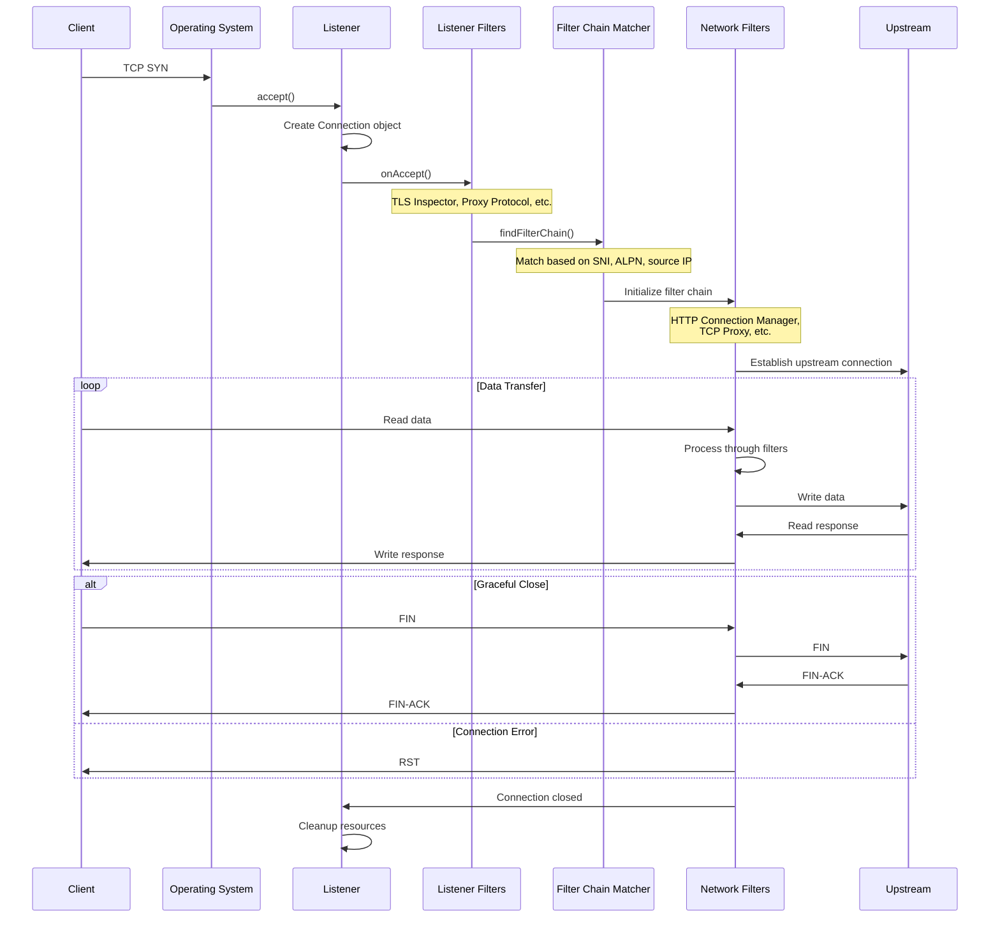
```mermaid
sequenceDiagram
    participant Client
    participant OS as Operating System
    participant Listener
    participant ListenerFilters as Listener Filters
    participant FilterChains as Filter Chain Matcher
    participant NetworkFilters as Network Filters
    participant Upstream

    Client->>OS: TCP SYN
    OS->>Listener: accept()
    Listener->>Listener: Create Connection object

    Listener->>ListenerFilters: onAccept()
    Note over ListenerFilters: TLS Inspector, Proxy Protocol, etc.

    ListenerFilters->>FilterChains: findFilterChain()
    Note over FilterChains: Match based on SNI, ALPN, source IP

    FilterChains->>NetworkFilters: Initialize filter chain
    Note over NetworkFilters: HTTP Connection Manager,<br/>TCP Proxy, etc.

    NetworkFilters->>Upstream: Establish upstream connection

    loop Data Transfer
        Client->>NetworkFilters: Read data
        NetworkFilters->>NetworkFilters: Process through filters
        NetworkFilters->>Upstream: Write data
        Upstream->>NetworkFilters: Read response
        NetworkFilters->>Client: Write response
    end

    alt Graceful Close
        Client->>NetworkFilters: FIN
        NetworkFilters->>Upstream: FIN
        Upstream->>NetworkFilters: FIN-ACK
        NetworkFilters->>Client: FIN-ACK
    else Connection Error
        NetworkFilters->>Client: RST
    end

    NetworkFilters->>Listener: Connection closed
    Listener->>Listener: Cleanup resources
```

## Detailed Connection Acceptance

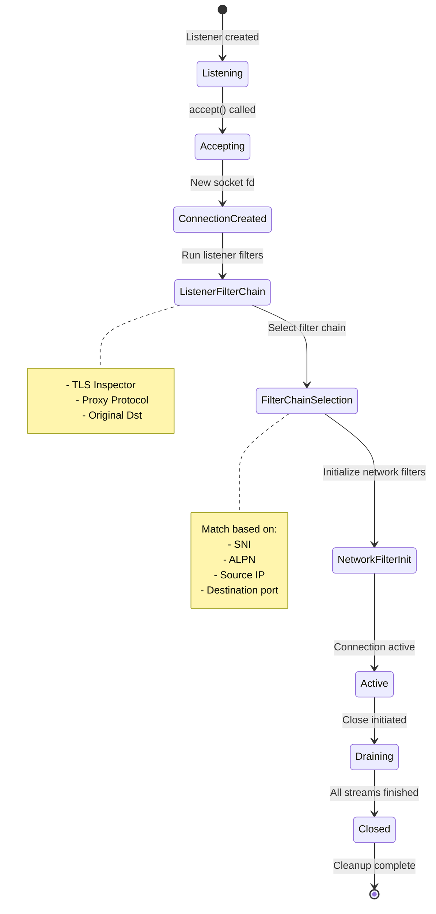
```mermaid
stateDiagram-v2
    [*] --> Listening: Listener created
    Listening --> Accepting: accept() called
    Accepting --> ConnectionCreated: New socket fd
    ConnectionCreated --> ListenerFilterChain: Run listener filters
    ListenerFilterChain --> FilterChainSelection: Select filter chain
    FilterChainSelection --> NetworkFilterInit: Initialize network filters
    NetworkFilterInit --> Active: Connection active
    Active --> Draining: Close initiated
    Draining --> Closed: All streams finished
    Closed --> [*]: Cleanup complete

    note right of ListenerFilterChain
        - TLS Inspector
        - Proxy Protocol
        - Original Dst
    end note

    note right of FilterChainSelection
        Match based on:
        - SNI
        - ALPN
        - Source IP
        - Destination port
    end note
```

## Connection Object Lifecycle

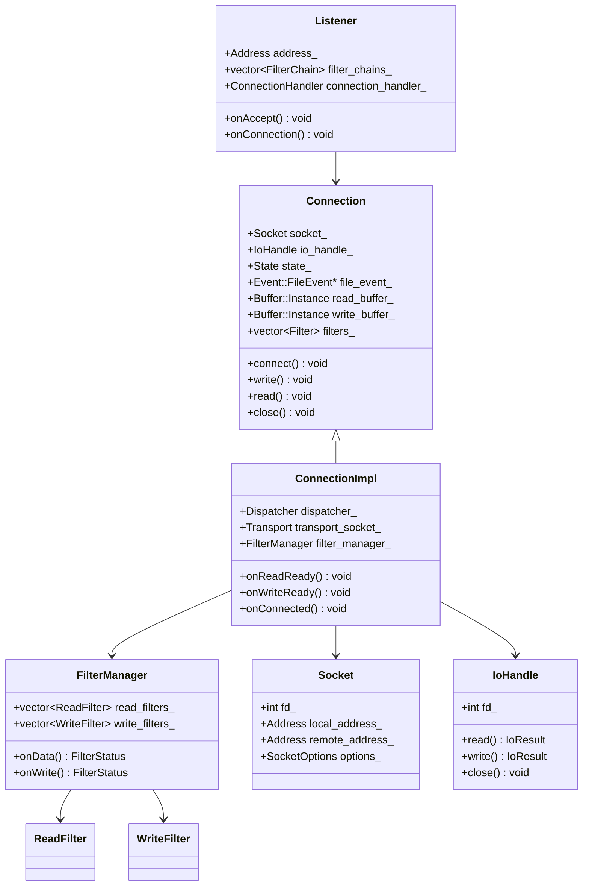
```mermaid
classDiagram
    class Listener {
        +Address address_
        +vector~FilterChain~ filter_chains_
        +ConnectionHandler connection_handler_
        +onAccept() void
        +onConnection() void
    }

    class Connection {
        +Socket socket_
        +IoHandle io_handle_
        +State state_
        +Event::FileEvent* file_event_
        +Buffer::Instance read_buffer_
        +Buffer::Instance write_buffer_
        +vector~Filter~ filters_
        +connect() void
        +write() void
        +read() void
        +close() void
    }

    class ConnectionImpl {
        +Dispatcher dispatcher_
        +Transport transport_socket_
        +FilterManager filter_manager_
        +onReadReady() void
        +onWriteReady() void
        +onConnected() void
    }

    class FilterManager {
        +vector~ReadFilter~ read_filters_
        +vector~WriteFilter~ write_filters_
        +onData() FilterStatus
        +onWrite() FilterStatus
    }

    class Socket {
        +int fd_
        +Address local_address_
        +Address remote_address_
        +SocketOptions options_
    }

    class IoHandle {
        +int fd_
        +read() IoResult
        +write() IoResult
        +close() void
    }

    Listener --> Connection
    Connection <|-- ConnectionImpl
    ConnectionImpl --> FilterManager
    ConnectionImpl --> Socket
    ConnectionImpl --> IoHandle
    FilterManager --> ReadFilter
    FilterManager --> WriteFilter
```

## Connection State Machine

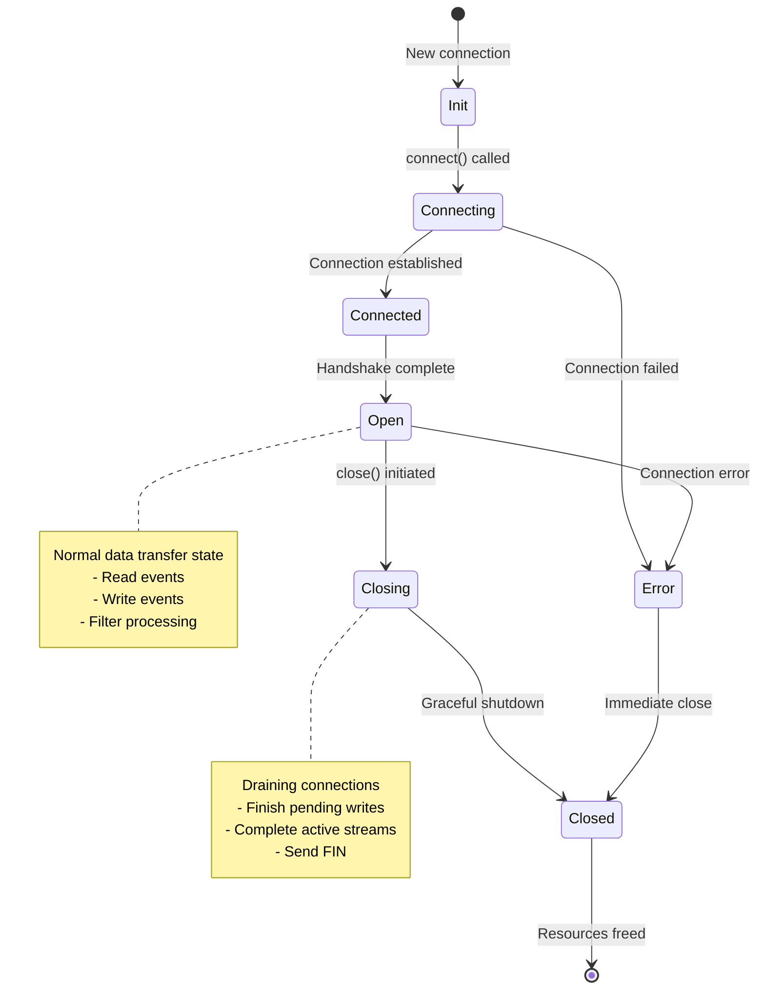
```mermaid
stateDiagram-v2
    [*] --> Init: New connection
    Init --> Connecting: connect() called
    Connecting --> Connected: Connection established
    Connecting --> Error: Connection failed
    Connected --> Open: Handshake complete
    Open --> Closing: close() initiated
    Open --> Error: Connection error
    Closing --> Closed: Graceful shutdown
    Error --> Closed: Immediate close
    Closed --> [*]: Resources freed

    note right of Open
        Normal data transfer state
        - Read events
        - Write events
        - Filter processing
    end note

    note right of Closing
        Draining connections
        - Finish pending writes
        - Complete active streams
        - Send FIN
    end note
```

## Event Loop Integration

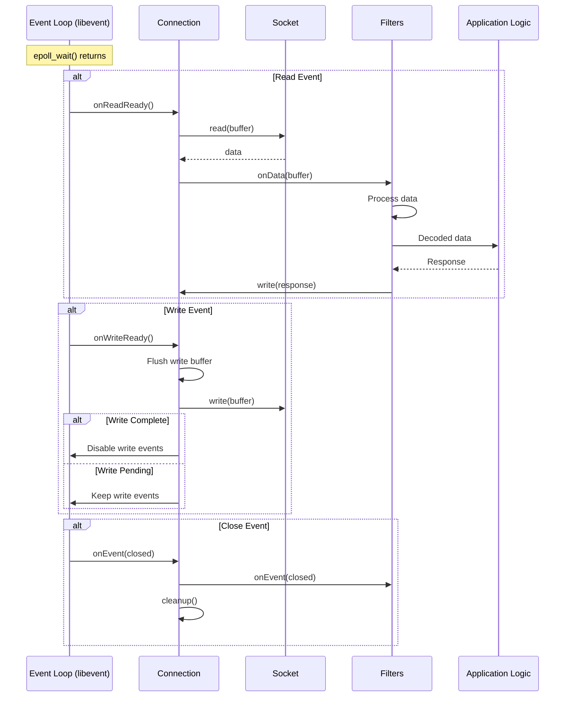
```mermaid
sequenceDiagram
    participant EventLoop as Event Loop (libevent)
    participant Connection
    participant Socket
    participant Filters
    participant App as Application Logic

    Note over EventLoop: epoll_wait() returns

    alt Read Event
        EventLoop->>Connection: onReadReady()
        Connection->>Socket: read(buffer)
        Socket-->>Connection: data
        Connection->>Filters: onData(buffer)
        Filters->>Filters: Process data
        Filters->>App: Decoded data
        App-->>Filters: Response
        Filters->>Connection: write(response)
    end

    alt Write Event
        EventLoop->>Connection: onWriteReady()
        Connection->>Connection: Flush write buffer
        Connection->>Socket: write(buffer)
        alt Write Complete
            Connection->>EventLoop: Disable write events
        else Write Pending
            Connection->>EventLoop: Keep write events
        end
    end

    alt Close Event
        EventLoop->>Connection: onEvent(closed)
        Connection->>Filters: onEvent(closed)
        Connection->>Connection: cleanup()
    end
```

## Listener Filter Processing

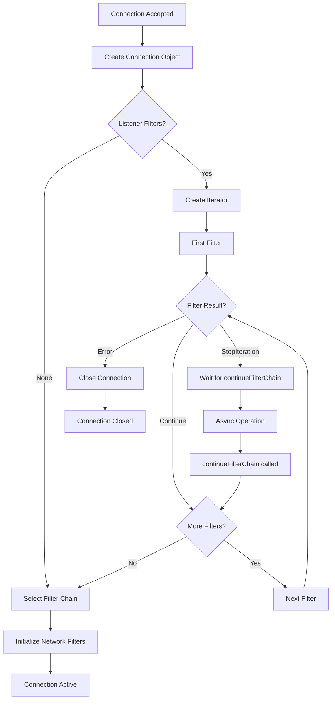
```mermaid
flowchart TD
    A[Connection Accepted] --> B[Create Connection Object]
    B --> C{Listener Filters?}
    C -->|None| H[Select Filter Chain]
    C -->|Yes| D[Create Iterator]

    D --> E[First Filter]
    E --> F{Filter Result?}

    F -->|Continue| G{More Filters?}
    F -->|StopIteration| I[Wait for continueFilterChain]
    F -->|Error| J[Close Connection]

    G -->|Yes| K[Next Filter]
    K --> F
    G -->|No| H

    I --> L[Async Operation]
    L --> M[continueFilterChain called]
    M --> G

    H --> N[Initialize Network Filters]
    N --> O[Connection Active]
    J --> P[Connection Closed]
```

## TLS Handshake Integration

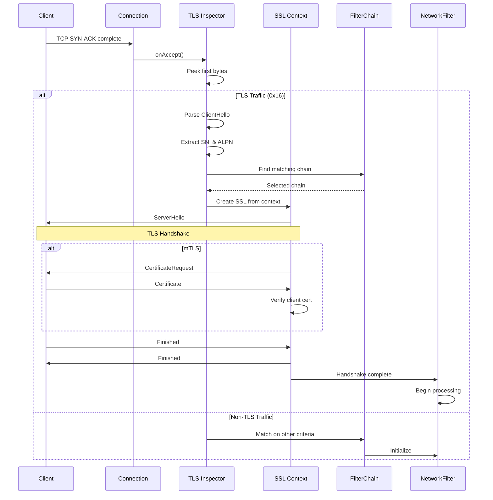
```mermaid
sequenceDiagram
    participant Client
    participant Connection
    participant ListenerFilter as TLS Inspector
    participant SSL as SSL Context
    participant FilterChain
    participant NetworkFilter

    Client->>Connection: TCP SYN-ACK complete
    Connection->>ListenerFilter: onAccept()

    ListenerFilter->>ListenerFilter: Peek first bytes
    alt TLS Traffic (0x16)
        ListenerFilter->>ListenerFilter: Parse ClientHello
        ListenerFilter->>ListenerFilter: Extract SNI & ALPN
        ListenerFilter->>FilterChain: Find matching chain
        FilterChain-->>ListenerFilter: Selected chain

        ListenerFilter->>SSL: Create SSL from context
        SSL->>Client: ServerHello

        Note over Client,SSL: TLS Handshake

        alt mTLS
            SSL->>Client: CertificateRequest
            Client->>SSL: Certificate
            SSL->>SSL: Verify client cert
        end

        Client->>SSL: Finished
        SSL->>Client: Finished

        SSL->>NetworkFilter: Handshake complete
        NetworkFilter->>NetworkFilter: Begin processing
    else Non-TLS Traffic
        ListenerFilter->>FilterChain: Match on other criteria
        FilterChain->>NetworkFilter: Initialize
    end
```

## Buffer Management

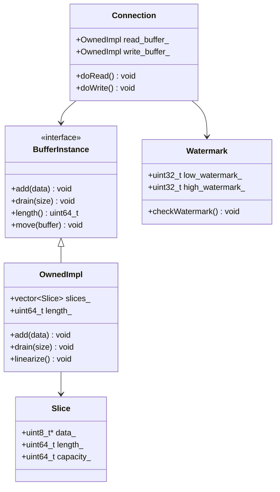
```mermaid
classDiagram
    class Connection {
        +OwnedImpl read_buffer_
        +OwnedImpl write_buffer_
        +doRead() void
        +doWrite() void
    }

    class BufferInstance {
        <<interface>>
        +add(data) void
        +drain(size) void
        +length() uint64_t
        +move(buffer) void
    }

    class OwnedImpl {
        +vector~Slice~ slices_
        +uint64_t length_
        +add(data) void
        +drain(size) void
        +linearize() void
    }

    class Slice {
        +uint8_t* data_
        +uint64_t length_
        +uint64_t capacity_
    }

    class Watermark {
        +uint32_t low_watermark_
        +uint32_t high_watermark_
        +checkWatermark() void
    }

    Connection --> BufferInstance
    BufferInstance <|-- OwnedImpl
    OwnedImpl --> Slice
    Connection --> Watermark
```

## Buffer Watermark Flow

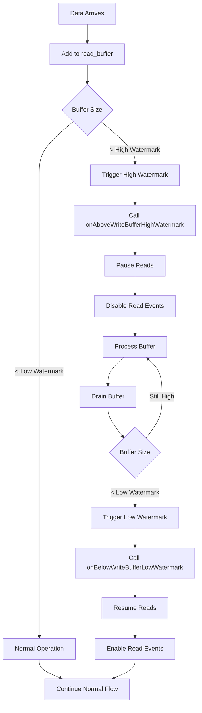
```mermaid
flowchart TD
    A[Data Arrives] --> B[Add to read_buffer]
    B --> C{Buffer Size}

    C -->|< Low Watermark| D[Normal Operation]
    C -->|> High Watermark| E[Trigger High Watermark]

    E --> F[Call onAboveWriteBufferHighWatermark]
    F --> G[Pause Reads]
    G --> H[Disable Read Events]

    H --> I[Process Buffer]
    I --> J[Drain Buffer]
    J --> K{Buffer Size}

    K -->|< Low Watermark| L[Trigger Low Watermark]
    K -->|Still High| I

    L --> M[Call onBelowWriteBufferLowWatermark]
    M --> N[Resume Reads]
    N --> O[Enable Read Events]

    D --> P[Continue Normal Flow]
    O --> P
```

## Connection Close Sequence

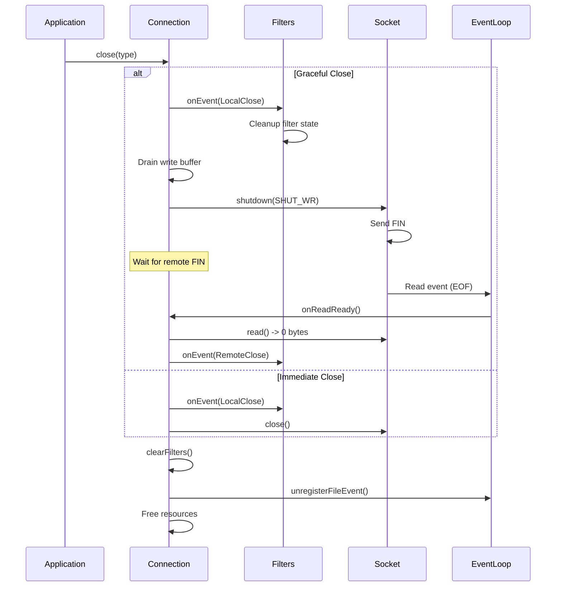
```mermaid
sequenceDiagram
    participant App as Application
    participant Connection
    participant Filters
    participant Socket
    participant EventLoop

    App->>Connection: close(type)

    alt Graceful Close
        Connection->>Filters: onEvent(LocalClose)
        Filters->>Filters: Cleanup filter state
        Connection->>Connection: Drain write buffer
        Connection->>Socket: shutdown(SHUT_WR)
        Socket->>Socket: Send FIN

        Note over Connection: Wait for remote FIN

        Socket->>EventLoop: Read event (EOF)
        EventLoop->>Connection: onReadReady()
        Connection->>Socket: read() -> 0 bytes
        Connection->>Filters: onEvent(RemoteClose)

    else Immediate Close
        Connection->>Filters: onEvent(LocalClose)
        Connection->>Socket: close()
    end

    Connection->>Connection: clearFilters()
    Connection->>EventLoop: unregisterFileEvent()
    Connection->>Connection: Free resources
```

## Connection Statistics

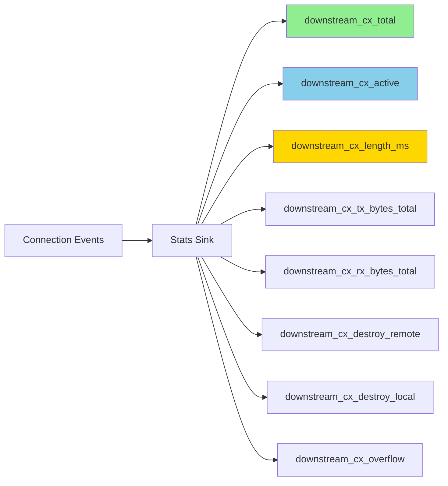
```mermaid
flowchart LR
    A[Connection Events] --> B[Stats Sink]

    B --> C[downstream_cx_total]
    B --> D[downstream_cx_active]
    B --> E[downstream_cx_length_ms]
    B --> F[downstream_cx_tx_bytes_total]
    B --> G[downstream_cx_rx_bytes_total]
    B --> H[downstream_cx_destroy_remote]
    B --> I[downstream_cx_destroy_local]
    B --> J[downstream_cx_overflow]

    style C fill:#90EE90
    style D fill:#87CEEB
    style E fill:#FFD700
```

## Connection Timeout Handling

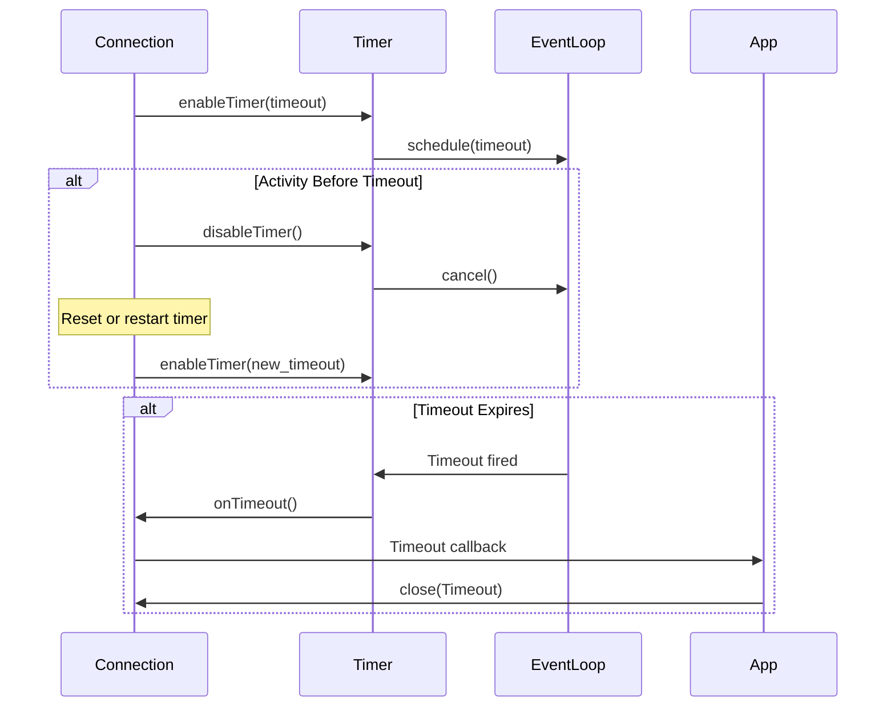
```mermaid
sequenceDiagram
    participant Connection
    participant Timer
    participant EventLoop
    participant App

    Connection->>Timer: enableTimer(timeout)
    Timer->>EventLoop: schedule(timeout)

    alt Activity Before Timeout
        Connection->>Timer: disableTimer()
        Timer->>EventLoop: cancel()
        Note over Connection: Reset or restart timer
        Connection->>Timer: enableTimer(new_timeout)
    end

    alt Timeout Expires
        EventLoop->>Timer: Timeout fired
        Timer->>Connection: onTimeout()
        Connection->>App: Timeout callback
        App->>Connection: close(Timeout)
    end
```

## Connection Draining Flow

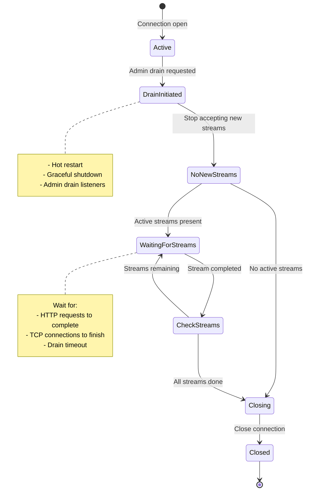
```mermaid
stateDiagram-v2
    [*] --> Active: Connection open
    Active --> DrainInitiated: Admin drain requested
    DrainInitiated --> NoNewStreams: Stop accepting new streams
    NoNewStreams --> WaitingForStreams: Active streams present
    NoNewStreams --> Closing: No active streams
    WaitingForStreams --> CheckStreams: Stream completed
    CheckStreams --> WaitingForStreams: Streams remaining
    CheckStreams --> Closing: All streams done
    Closing --> Closed: Close connection
    Closed --> [*]

    note right of DrainInitiated
        - Hot restart
        - Graceful shutdown
        - Admin drain listeners
    end note

    note right of WaitingForStreams
        Wait for:
        - HTTP requests to complete
        - TCP connections to finish
        - Drain timeout
    end note
```

## Per-Connection Resource Tracking

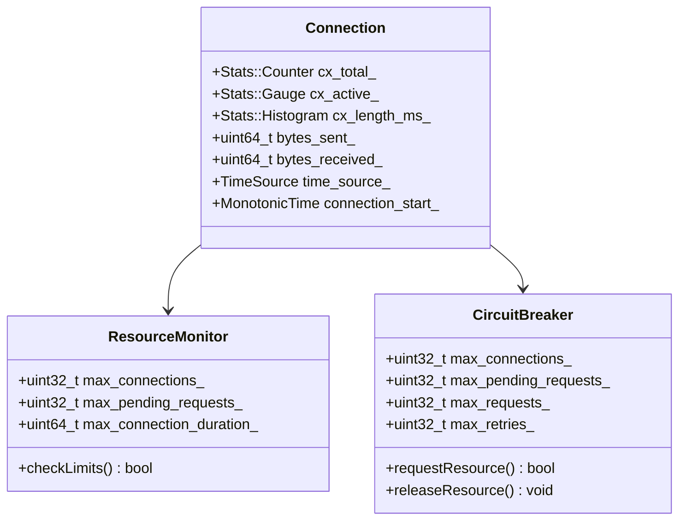
```mermaid
classDiagram
    class Connection {
        +Stats::Counter cx_total_
        +Stats::Gauge cx_active_
        +Stats::Histogram cx_length_ms_
        +uint64_t bytes_sent_
        +uint64_t bytes_received_
        +TimeSource time_source_
        +MonotonicTime connection_start_
    }

    class ResourceMonitor {
        +uint32_t max_connections_
        +uint32_t max_pending_requests_
        +uint64_t max_connection_duration_
        +checkLimits() bool
    }

    class CircuitBreaker {
        +uint32_t max_connections_
        +uint32_t max_pending_requests_
        +uint32_t max_requests_
        +uint32_t max_retries_
        +requestResource() bool
        +releaseResource() void
    }

    Connection --> ResourceMonitor
    Connection --> CircuitBreaker
```

## Socket Options Flow

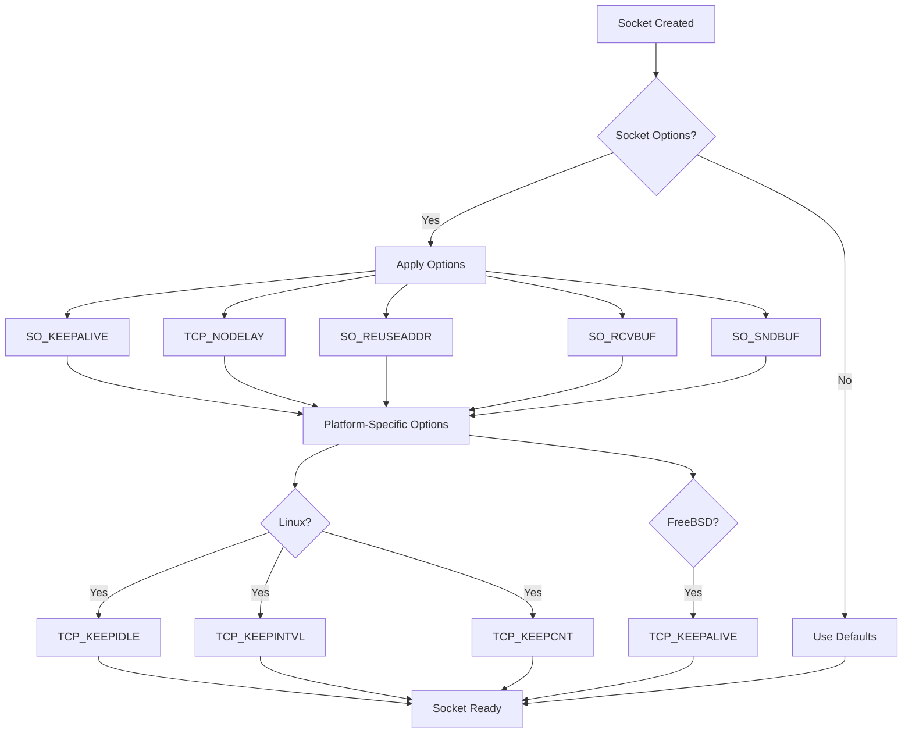
```mermaid
flowchart TD
    A[Socket Created] --> B{Socket Options?}
    B -->|Yes| C[Apply Options]
    B -->|No| D[Use Defaults]

    C --> E[SO_KEEPALIVE]
    C --> F[TCP_NODELAY]
    C --> G[SO_REUSEADDR]
    C --> H[SO_RCVBUF]
    C --> I[SO_SNDBUF]

    E --> J[Platform-Specific Options]
    F --> J
    G --> J
    H --> J
    I --> J

    J --> K{Linux?}
    K -->|Yes| L[TCP_KEEPIDLE]
    K -->|Yes| M[TCP_KEEPINTVL]
    K -->|Yes| N[TCP_KEEPCNT]

    J --> O{FreeBSD?}
    O -->|Yes| P[TCP_KEEPALIVE]

    L --> Q[Socket Ready]
    M --> Q
    N --> Q
    P --> Q
    D --> Q
```

## Connection Pool Integration

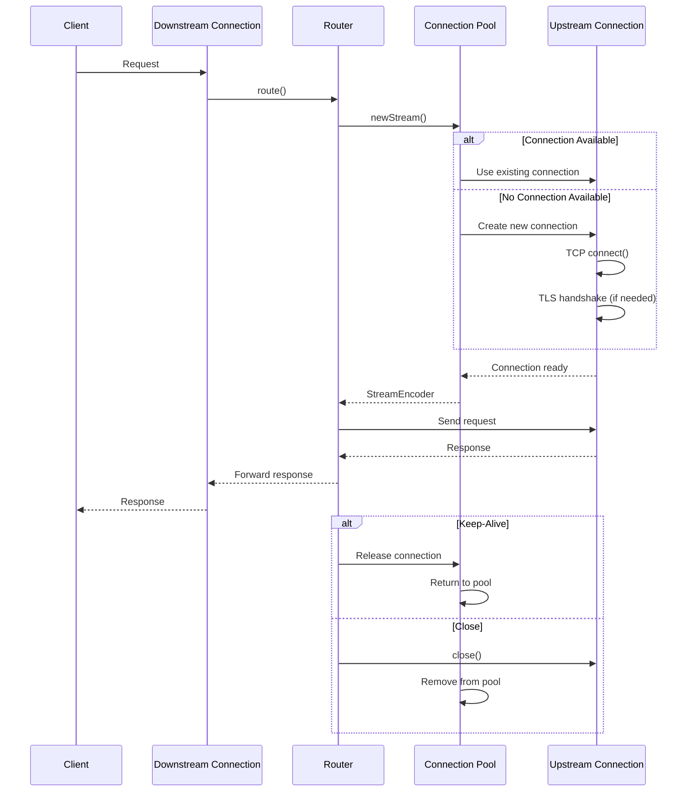
```mermaid
sequenceDiagram
    participant Client
    participant DownstreamConn as Downstream Connection
    participant Router
    participant ConnPool as Connection Pool
    participant UpstreamConn as Upstream Connection

    Client->>DownstreamConn: Request
    DownstreamConn->>Router: route()
    Router->>ConnPool: newStream()

    alt Connection Available
        ConnPool->>UpstreamConn: Use existing connection
    else No Connection Available
        ConnPool->>UpstreamConn: Create new connection
        UpstreamConn->>UpstreamConn: TCP connect()
        UpstreamConn->>UpstreamConn: TLS handshake (if needed)
    end

    UpstreamConn-->>ConnPool: Connection ready
    ConnPool-->>Router: StreamEncoder
    Router->>UpstreamConn: Send request
    UpstreamConn-->>Router: Response
    Router-->>DownstreamConn: Forward response
    DownstreamConn-->>Client: Response

    alt Keep-Alive
        Router->>ConnPool: Release connection
        ConnPool->>ConnPool: Return to pool
    else Close
        Router->>UpstreamConn: close()
        ConnPool->>ConnPool: Remove from pool
    end
```

## Key Takeaways

### Connection Creation
1. **Listener** accepts connection from OS
2. **Listener filters** inspect first bytes (TLS, Proxy Protocol)
3. **Filter chain matcher** selects appropriate filter chain
4. **Network filters** initialized and begin processing

### Data Flow
1. **Read events** trigger buffer fills
2. **Filters** process data in order
3. **Write events** drain output buffers
4. **Watermarks** control flow control

### Connection Teardown
1. **Graceful close** waits for pending data
2. **Filters** notified of close event
3. **Resources** cleaned up
4. **Stats** updated

### Performance Considerations
- **Zero-copy** where possible (buffer slices)
- **Event-driven** I/O (epoll/kqueue)
- **Connection pooling** for upstream
- **Watermarks** prevent memory exhaustion

## Related Flows
- [HTTP Request Processing](02_http_request_flow.md)
- [Filter Chain Execution](05_filter_chain_execution.md)
- [Upstream Connection Management](06_upstream_connection_management.md)
