# HTTP Request/Response Flow

## Overview

This document details the complete HTTP request/response processing flow in Envoy, from receiving the request through all filter stages to forwarding to upstream and returning the response.

## Complete HTTP Request Flow

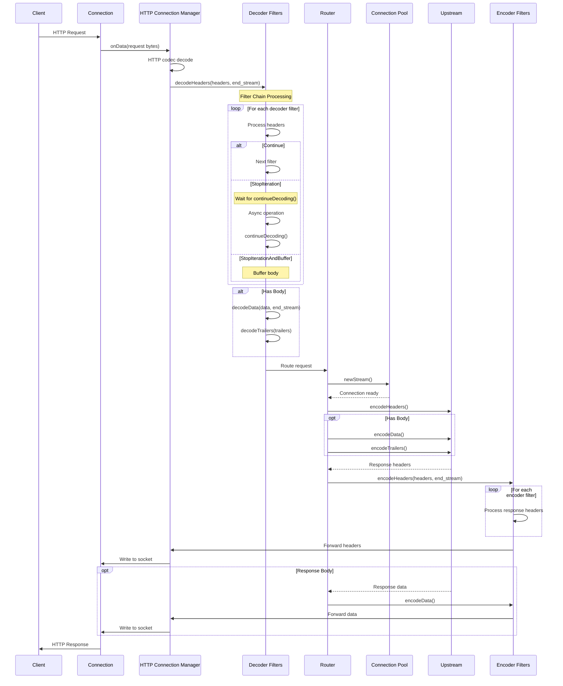
```mermaid
sequenceDiagram
    participant Client
    participant Conn as Connection
    participant HCM as HTTP Connection Manager
    participant Decoder as Decoder Filters
    participant Router
    participant ConnPool as Connection Pool
    participant Upstream
    participant Encoder as Encoder Filters

    Client->>Conn: HTTP Request
    Conn->>HCM: onData(request bytes)
    HCM->>HCM: HTTP codec decode
    HCM->>Decoder: decodeHeaders(headers, end_stream)

    Note over Decoder: Filter Chain Processing

    loop For each decoder filter
        Decoder->>Decoder: Process headers
        alt Continue
            Decoder->>Decoder: Next filter
        else StopIteration
            Note over Decoder: Wait for continueDecoding()
            Decoder->>Decoder: Async operation
            Decoder->>Decoder: continueDecoding()
        else StopIterationAndBuffer
            Note over Decoder: Buffer body
        end
    end

    alt Has Body
        Decoder->>Decoder: decodeData(data, end_stream)
        Decoder->>Decoder: decodeTrailers(trailers)
    end

    Decoder->>Router: Route request
    Router->>ConnPool: newStream()
    ConnPool-->>Router: Connection ready

    Router->>Upstream: encodeHeaders()
    opt Has Body
        Router->>Upstream: encodeData()
        Router->>Upstream: encodeTrailers()
    end

    Upstream-->>Router: Response headers
    Router->>Encoder: encodeHeaders(headers, end_stream)

    loop For each encoder filter
        Encoder->>Encoder: Process response headers
    end

    Encoder->>HCM: Forward headers
    HCM->>Conn: Write to socket

    opt Response Body
        Upstream-->>Router: Response data
        Router->>Encoder: encodeData()
        Encoder->>HCM: Forward data
        HCM->>Conn: Write to socket
    end

    Conn->>Client: HTTP Response
```

## HTTP Connection Manager Architecture

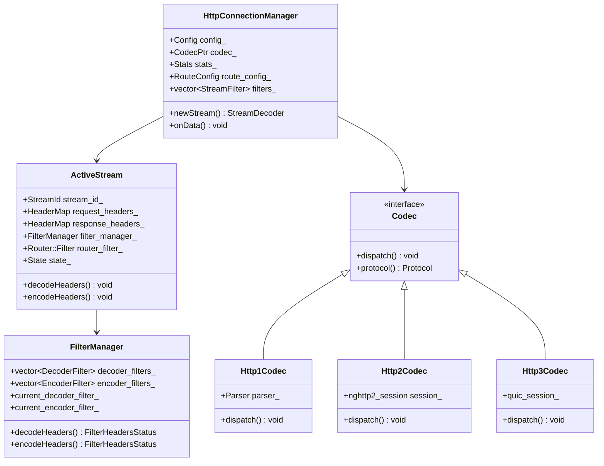
```mermaid
classDiagram
    class HttpConnectionManager {
        +Config config_
        +CodecPtr codec_
        +Stats stats_
        +RouteConfig route_config_
        +vector~StreamFilter~ filters_
        +newStream() StreamDecoder
        +onData() void
    }

    class ActiveStream {
        +StreamId stream_id_
        +HeaderMap request_headers_
        +HeaderMap response_headers_
        +FilterManager filter_manager_
        +Router::Filter router_filter_
        +State state_
        +decodeHeaders() void
        +encodeHeaders() void
    }

    class FilterManager {
        +vector~DecoderFilter~ decoder_filters_
        +vector~EncoderFilter~ encoder_filters_
        +current_decoder_filter_
        +current_encoder_filter_
        +decodeHeaders() FilterHeadersStatus
        +encodeHeaders() FilterHeadersStatus
    }

    class Codec {
        <<interface>>
        +dispatch() void
        +protocol() Protocol
    }

    class Http1Codec {
        +Parser parser_
        +dispatch() void
    }

    class Http2Codec {
        +nghttp2_session session_
        +dispatch() void
    }

    class Http3Codec {
        +quic_session_
        +dispatch() void
    }

    HttpConnectionManager --> ActiveStream
    HttpConnectionManager --> Codec
    ActiveStream --> FilterManager
    Codec <|-- Http1Codec
    Codec <|-- Http2Codec
    Codec <|-- Http3Codec
```

## Request Decode Flow

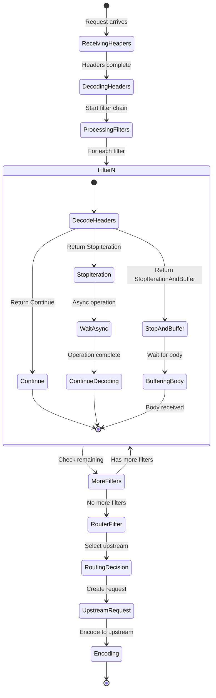
```mermaid
stateDiagram-v2
    [*] --> ReceivingHeaders: Request arrives
    ReceivingHeaders --> DecodingHeaders: Headers complete
    DecodingHeaders --> ProcessingFilters: Start filter chain
    ProcessingFilters --> FilterN: For each filter

    state FilterN {
        [*] --> DecodeHeaders
        DecodeHeaders --> Continue: Return Continue
        DecodeHeaders --> StopIteration: Return StopIteration
        DecodeHeaders --> StopAndBuffer: Return StopIterationAndBuffer

        Continue --> [*]
        StopIteration --> WaitAsync: Async operation
        WaitAsync --> ContinueDecoding: Operation complete
        ContinueDecoding --> [*]
        StopAndBuffer --> BufferingBody: Wait for body
        BufferingBody --> [*]: Body received
    }

    FilterN --> MoreFilters: Check remaining
    MoreFilters --> FilterN: Has more filters
    MoreFilters --> RouterFilter: No more filters

    RouterFilter --> RoutingDecision: Select upstream
    RoutingDecision --> UpstreamRequest: Create request
    UpstreamRequest --> Encoding: Encode to upstream

    Encoding --> [*]
```

## Decoder Filter Processing

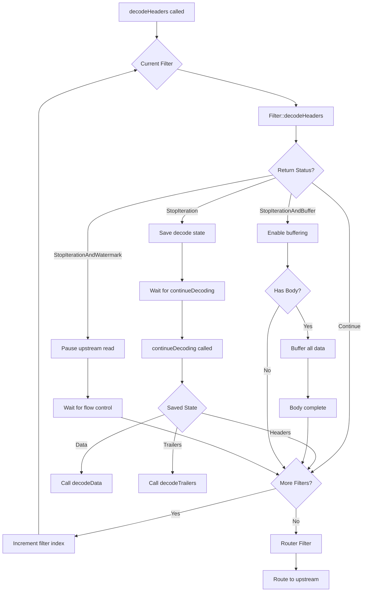
```mermaid
flowchart TD
    A[decodeHeaders called] --> B{Current Filter}
    B --> C[Filter::decodeHeaders]

    C --> D{Return Status?}

    D -->|Continue| E{More Filters?}
    E -->|Yes| F[Increment filter index]
    F --> B
    E -->|No| G[Router Filter]

    D -->|StopIteration| H[Save decode state]
    H --> I[Wait for continueDecoding]
    I --> J[continueDecoding called]
    J --> K{Saved State}
    K -->|Headers| E
    K -->|Data| L[Call decodeData]
    K -->|Trailers| M[Call decodeTrailers]

    D -->|StopIterationAndBuffer| N[Enable buffering]
    N --> O{Has Body?}
    O -->|Yes| P[Buffer all data]
    P --> Q[Body complete]
    Q --> E
    O -->|No| E

    D -->|StopIterationAndWatermark| R[Pause upstream read]
    R --> S[Wait for flow control]
    S --> E

    G --> T[Route to upstream]
```

## HTTP/2 Stream Multiplexing

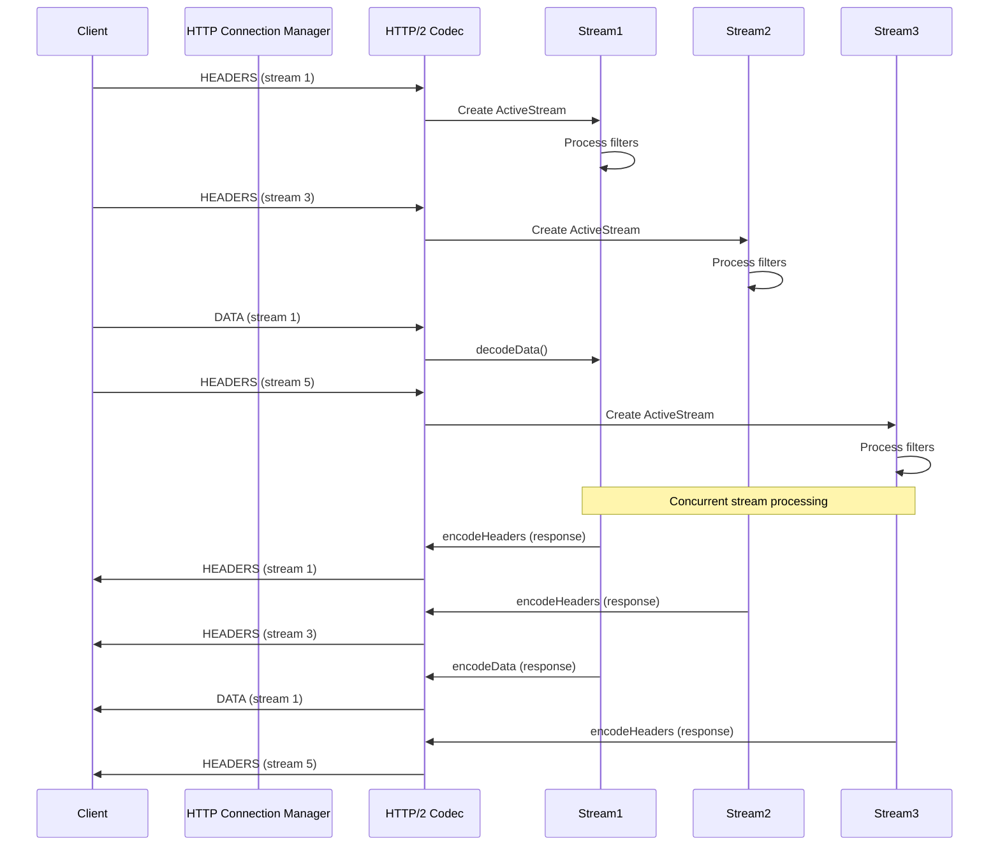
```mermaid
sequenceDiagram
    participant Client
    participant HCM as HTTP Connection Manager
    participant H2Codec as HTTP/2 Codec
    participant Stream1
    participant Stream2
    participant Stream3

    Client->>H2Codec: HEADERS (stream 1)
    H2Codec->>Stream1: Create ActiveStream
    Stream1->>Stream1: Process filters

    Client->>H2Codec: HEADERS (stream 3)
    H2Codec->>Stream2: Create ActiveStream
    Stream2->>Stream2: Process filters

    Client->>H2Codec: DATA (stream 1)
    H2Codec->>Stream1: decodeData()

    Client->>H2Codec: HEADERS (stream 5)
    H2Codec->>Stream3: Create ActiveStream
    Stream3->>Stream3: Process filters

    Note over Stream1,Stream3: Concurrent stream processing

    Stream1->>H2Codec: encodeHeaders (response)
    H2Codec->>Client: HEADERS (stream 1)

    Stream2->>H2Codec: encodeHeaders (response)
    H2Codec->>Client: HEADERS (stream 3)

    Stream1->>H2Codec: encodeData (response)
    H2Codec->>Client: DATA (stream 1)

    Stream3->>H2Codec: encodeHeaders (response)
    H2Codec->>Client: HEADERS (stream 5)
```

## Filter Chain State Machine

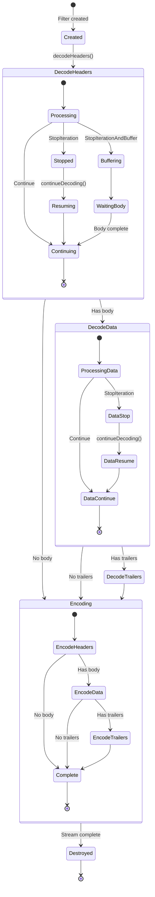
```mermaid
stateDiagram-v2
    [*] --> Created: Filter created
    Created --> DecodeHeaders: decodeHeaders()

    state DecodeHeaders {
        [*] --> Processing
        Processing --> Continuing: Continue
        Processing --> Stopped: StopIteration
        Processing --> Buffering: StopIterationAndBuffer

        Stopped --> Resuming: continueDecoding()
        Resuming --> Continuing

        Buffering --> WaitingBody
        WaitingBody --> Continuing: Body complete

        Continuing --> [*]
    }

    DecodeHeaders --> DecodeData: Has body
    DecodeHeaders --> Encoding: No body

    state DecodeData {
        [*] --> ProcessingData
        ProcessingData --> DataContinue: Continue
        ProcessingData --> DataStop: StopIteration

        DataStop --> DataResume: continueDecoding()
        DataResume --> DataContinue

        DataContinue --> [*]
    }

    DecodeData --> DecodeTrailers: Has trailers
    DecodeData --> Encoding: No trailers
    DecodeTrailers --> Encoding

    state Encoding {
        [*] --> EncodeHeaders
        EncodeHeaders --> EncodeData: Has body
        EncodeHeaders --> Complete: No body
        EncodeData --> EncodeTrailers: Has trailers
        EncodeData --> Complete: No trailers
        EncodeTrailers --> Complete
        Complete --> [*]
    }

    Encoding --> Destroyed: Stream complete
    Destroyed --> [*]
```

## Request Routing Decision

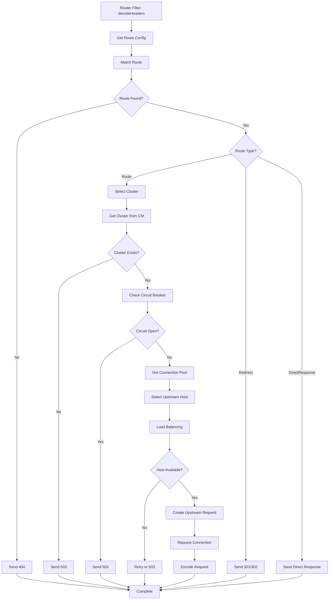
```mermaid
flowchart TD
    A[Router Filter: decodeHeaders] --> B[Get Route Config]
    B --> C[Match Route]

    C --> D{Route Found?}
    D -->|No| E[Send 404]
    D -->|Yes| F{Route Type?}

    F -->|Route| G[Select Cluster]
    F -->|Redirect| H[Send 301/302]
    F -->|DirectResponse| I[Send Direct Response]

    G --> J[Get Cluster from CM]
    J --> K{Cluster Exists?}
    K -->|No| L[Send 503]
    K -->|Yes| M[Check Circuit Breaker]

    M --> N{Circuit Open?}
    N -->|Yes| O[Send 503]
    N -->|No| P[Get Connection Pool]

    P --> Q[Select Upstream Host]
    Q --> R[Load Balancing]
    R --> S{Host Available?}
    S -->|No| T[Retry or 503]
    S -->|Yes| U[Create Upstream Request]

    U --> V[Request Connection]
    V --> W[Encode Request]

    H --> Z[Complete]
    I --> Z
    E --> Z
    L --> Z
    O --> Z
    T --> Z
    W --> Z
```

## Upstream Request Creation

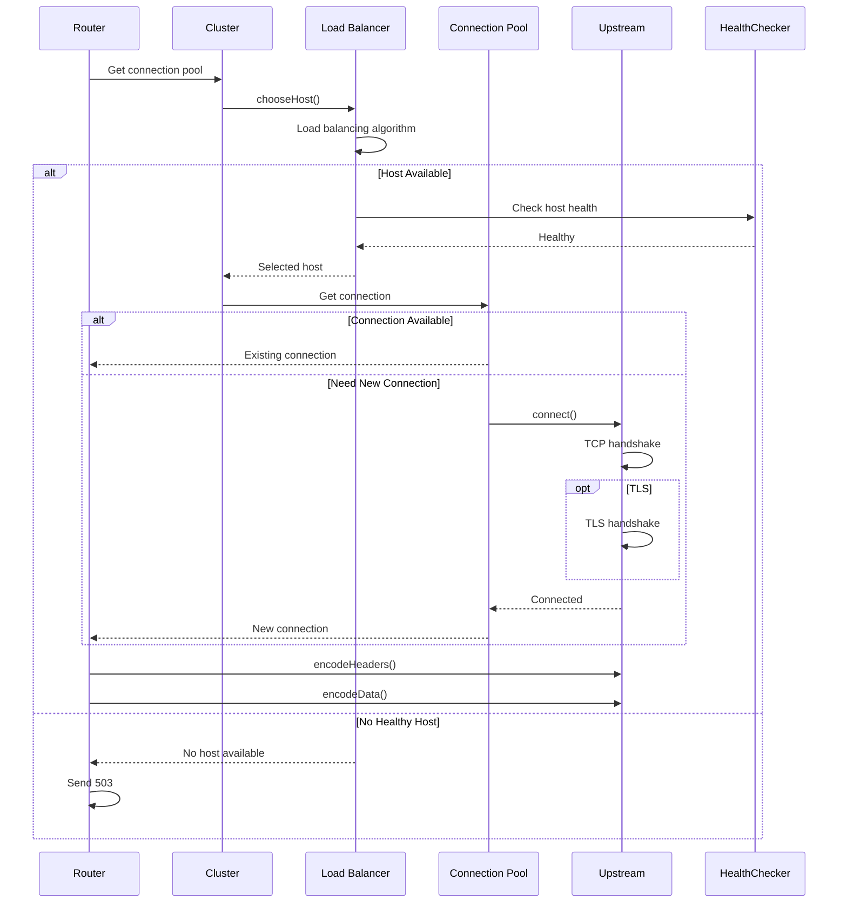
```mermaid
sequenceDiagram
    participant Router
    participant Cluster
    participant LB as Load Balancer
    participant ConnPool as Connection Pool
    participant Upstream
    participant HealthChecker

    Router->>Cluster: Get connection pool
    Cluster->>LB: chooseHost()
    LB->>LB: Load balancing algorithm

    alt Host Available
        LB->>HealthChecker: Check host health
        HealthChecker-->>LB: Healthy
        LB-->>Cluster: Selected host
        Cluster->>ConnPool: Get connection

        alt Connection Available
            ConnPool-->>Router: Existing connection
        else Need New Connection
            ConnPool->>Upstream: connect()
            Upstream->>Upstream: TCP handshake
            opt TLS
                Upstream->>Upstream: TLS handshake
            end
            Upstream-->>ConnPool: Connected
            ConnPool-->>Router: New connection
        end

        Router->>Upstream: encodeHeaders()
        Router->>Upstream: encodeData()

    else No Healthy Host
        LB-->>Router: No host available
        Router->>Router: Send 503
    end
```

## Response Processing Flow

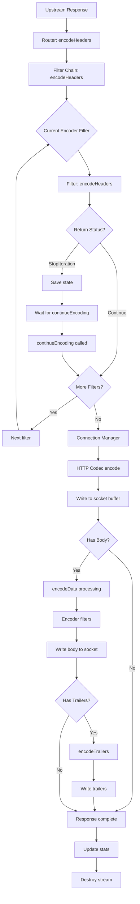
```mermaid
flowchart TD
    A[Upstream Response] --> B[Router: encodeHeaders]
    B --> C[Filter Chain: encodeHeaders]

    C --> D{Current Encoder Filter}
    D --> E[Filter::encodeHeaders]

    E --> F{Return Status?}

    F -->|Continue| G{More Filters?}
    G -->|Yes| H[Next filter]
    H --> D
    G -->|No| I[Connection Manager]

    F -->|StopIteration| J[Save state]
    J --> K[Wait for continueEncoding]
    K --> L[continueEncoding called]
    L --> G

    I --> M[HTTP Codec encode]
    M --> N[Write to socket buffer]

    N --> O{Has Body?}
    O -->|Yes| P[encodeData processing]
    P --> Q[Encoder filters]
    Q --> R[Write body to socket]
    O -->|No| S[Response complete]

    R --> T{Has Trailers?}
    T -->|Yes| U[encodeTrailers]
    U --> V[Write trailers]
    V --> S
    T -->|No| S

    S --> W[Update stats]
    W --> X[Destroy stream]
```

## HTTP/1.1 vs HTTP/2 vs HTTP/3

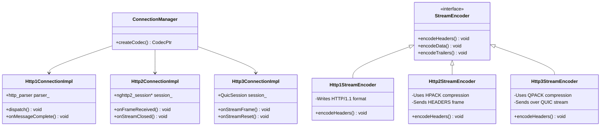
```mermaid
classDiagram
    class ConnectionManager {
        +createCodec() CodecPtr
    }

    class Http1ConnectionImpl {
        +http_parser parser_
        +dispatch() void
        +onMessageComplete() void
    }

    class Http2ConnectionImpl {
        +nghttp2_session* session_
        +onFrameReceived() void
        +onStreamClosed() void
    }

    class Http3ConnectionImpl {
        +QuicSession session_
        +onStreamFrame() void
        +onStreamReset() void
    }

    class StreamEncoder {
        <<interface>>
        +encodeHeaders() void
        +encodeData() void
        +encodeTrailers() void
    }

    class Http1StreamEncoder {
        +encodeHeaders() void
        -Writes HTTP/1.1 format
    }

    class Http2StreamEncoder {
        +encodeHeaders() void
        -Uses HPACK compression
        -Sends HEADERS frame
    }

    class Http3StreamEncoder {
        +encodeHeaders() void
        -Uses QPACK compression
        -Sends over QUIC stream
    }

    ConnectionManager --> Http1ConnectionImpl
    ConnectionManager --> Http2ConnectionImpl
    ConnectionManager --> Http3ConnectionImpl
    StreamEncoder <|-- Http1StreamEncoder
    StreamEncoder <|-- Http2StreamEncoder
    StreamEncoder <|-- Http3StreamEncoder
```

## Header Processing Pipeline

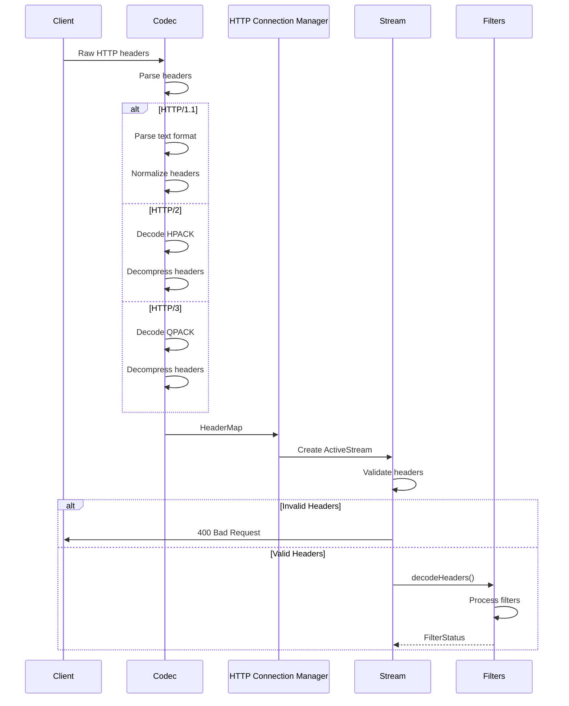
```mermaid
sequenceDiagram
    participant Client
    participant Codec
    participant HCM as HTTP Connection Manager
    participant Stream
    participant Filters

    Client->>Codec: Raw HTTP headers
    Codec->>Codec: Parse headers

    alt HTTP/1.1
        Codec->>Codec: Parse text format
        Codec->>Codec: Normalize headers
    else HTTP/2
        Codec->>Codec: Decode HPACK
        Codec->>Codec: Decompress headers
    else HTTP/3
        Codec->>Codec: Decode QPACK
        Codec->>Codec: Decompress headers
    end

    Codec->>HCM: HeaderMap
    HCM->>Stream: Create ActiveStream
    Stream->>Stream: Validate headers

    alt Invalid Headers
        Stream->>Client: 400 Bad Request
    else Valid Headers
        Stream->>Filters: decodeHeaders()
        Filters->>Filters: Process filters
        Filters-->>Stream: FilterStatus
    end
```

## Body Streaming vs Buffering

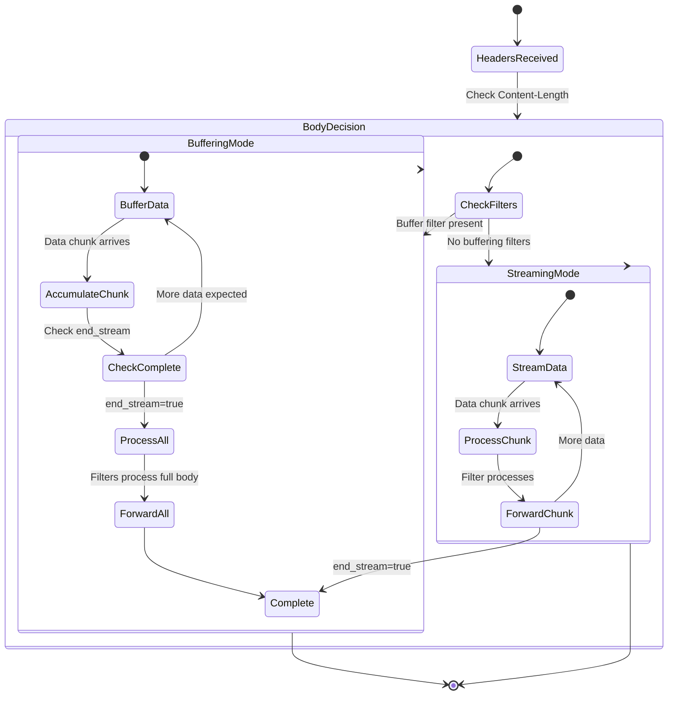
```mermaid
stateDiagram-v2
    [*] --> HeadersReceived
    HeadersReceived --> BodyDecision: Check Content-Length

    state BodyDecision {
        [*] --> CheckFilters
        CheckFilters --> StreamingMode: No buffering filters
        CheckFilters --> BufferingMode: Buffer filter present
    }

    state StreamingMode {
        [*] --> StreamData
        StreamData --> ProcessChunk: Data chunk arrives
        ProcessChunk --> ForwardChunk: Filter processes
        ForwardChunk --> StreamData: More data
        ForwardChunk --> Complete: end_stream=true
    }

    state BufferingMode {
        [*] --> BufferData
        BufferData --> AccumulateChunk: Data chunk arrives
        AccumulateChunk --> CheckComplete: Check end_stream
        CheckComplete --> BufferData: More data expected
        CheckComplete --> ProcessAll: end_stream=true
        ProcessAll --> ForwardAll: Filters process full body
        ForwardAll --> Complete
    }

    BodyDecision --> StreamingMode
    BodyDecision --> BufferingMode
    StreamingMode --> [*]
    BufferingMode --> [*]
```

## Trailer Handling

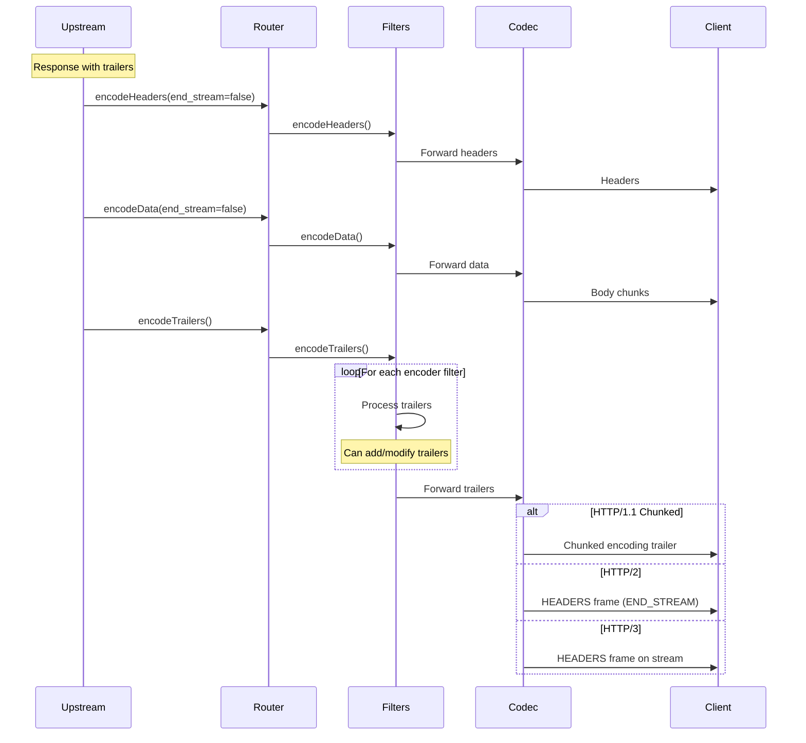
```mermaid
sequenceDiagram
    participant Upstream
    participant Router
    participant Filters
    participant Codec
    participant Client

    Note over Upstream: Response with trailers

    Upstream->>Router: encodeHeaders(end_stream=false)
    Router->>Filters: encodeHeaders()
    Filters->>Codec: Forward headers
    Codec->>Client: Headers

    Upstream->>Router: encodeData(end_stream=false)
    Router->>Filters: encodeData()
    Filters->>Codec: Forward data
    Codec->>Client: Body chunks

    Upstream->>Router: encodeTrailers()
    Router->>Filters: encodeTrailers()

    loop For each encoder filter
        Filters->>Filters: Process trailers
        Note over Filters: Can add/modify trailers
    end

    Filters->>Codec: Forward trailers

    alt HTTP/1.1 Chunked
        Codec->>Client: Chunked encoding trailer
    else HTTP/2
        Codec->>Client: HEADERS frame (END_STREAM)
    else HTTP/3
        Codec->>Client: HEADERS frame on stream
    end
```

## Stream Reset Handling

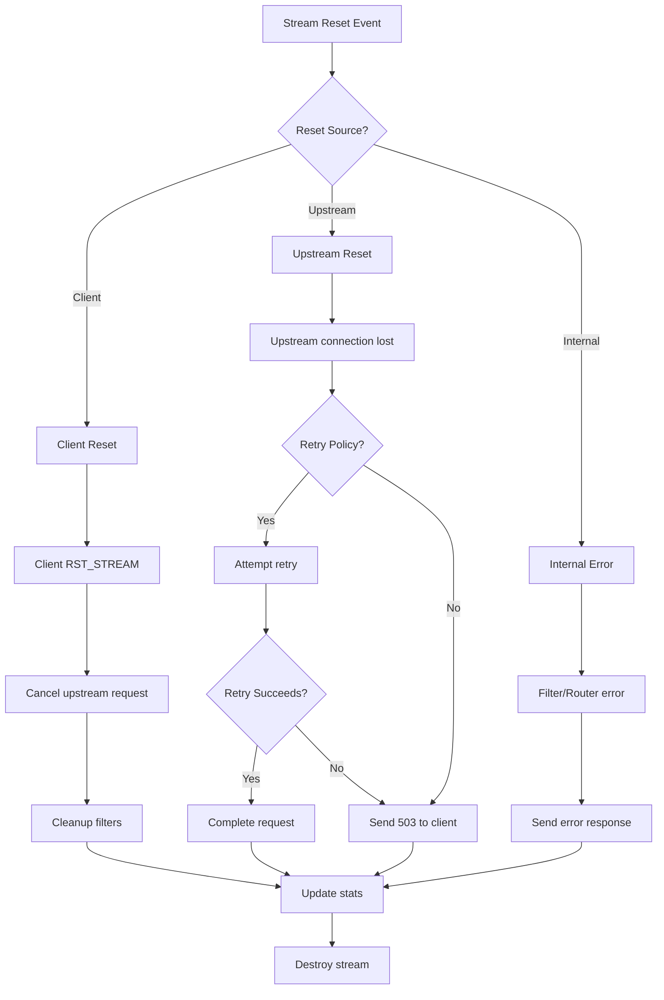
```mermaid
flowchart TD
    A[Stream Reset Event] --> B{Reset Source?}

    B -->|Client| C[Client Reset]
    B -->|Upstream| D[Upstream Reset]
    B -->|Internal| E[Internal Error]

    C --> F[Client RST_STREAM]
    F --> G[Cancel upstream request]
    G --> H[Cleanup filters]

    D --> I[Upstream connection lost]
    I --> J{Retry Policy?}
    J -->|Yes| K[Attempt retry]
    J -->|No| L[Send 503 to client]

    E --> M[Filter/Router error]
    M --> N[Send error response]

    K --> O{Retry Succeeds?}
    O -->|Yes| P[Complete request]
    O -->|No| L

    H --> Q[Update stats]
    L --> Q
    N --> Q
    P --> Q

    Q --> R[Destroy stream]
```

## WebSocket Upgrade Flow

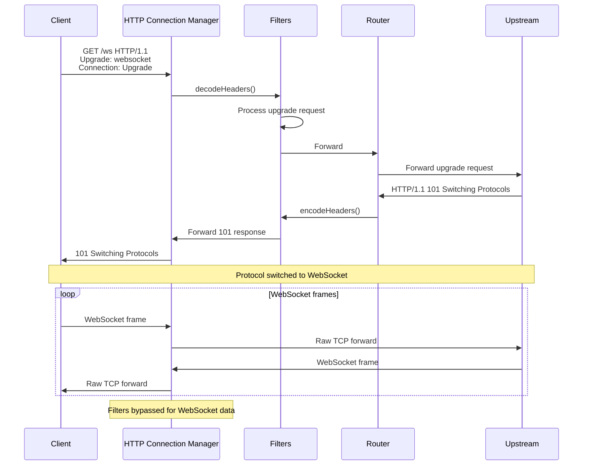
```mermaid
sequenceDiagram
    participant Client
    participant HCM as HTTP Connection Manager
    participant Filters
    participant Router
    participant Upstream

    Client->>HCM: GET /ws HTTP/1.1<br/>Upgrade: websocket<br/>Connection: Upgrade

    HCM->>Filters: decodeHeaders()
    Filters->>Filters: Process upgrade request
    Filters->>Router: Forward

    Router->>Upstream: Forward upgrade request
    Upstream->>Router: HTTP/1.1 101 Switching Protocols

    Router->>Filters: encodeHeaders()
    Filters->>HCM: Forward 101 response
    HCM->>Client: 101 Switching Protocols

    Note over Client,Upstream: Protocol switched to WebSocket

    loop WebSocket frames
        Client->>HCM: WebSocket frame
        HCM->>Upstream: Raw TCP forward
        Upstream->>HCM: WebSocket frame
        HCM->>Client: Raw TCP forward
    end

    Note over HCM: Filters bypassed for WebSocket data
```

## gRPC Request Flow

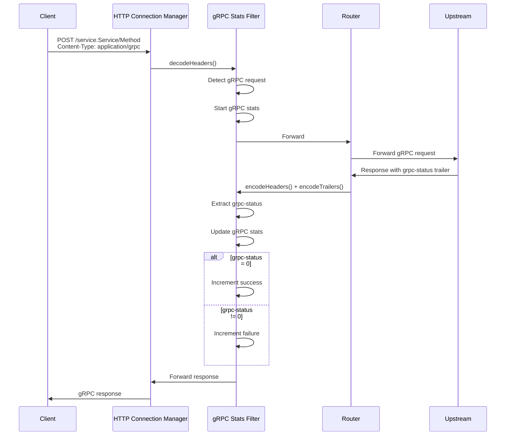
```mermaid
sequenceDiagram
    participant Client
    participant HCM as HTTP Connection Manager
    participant GrpcFilter as gRPC Stats Filter
    participant Router
    participant Upstream

    Client->>HCM: POST /service.Service/Method<br/>Content-Type: application/grpc

    HCM->>GrpcFilter: decodeHeaders()
    GrpcFilter->>GrpcFilter: Detect gRPC request
    GrpcFilter->>GrpcFilter: Start gRPC stats

    GrpcFilter->>Router: Forward
    Router->>Upstream: Forward gRPC request

    Upstream->>Router: Response with grpc-status trailer
    Router->>GrpcFilter: encodeHeaders() + encodeTrailers()

    GrpcFilter->>GrpcFilter: Extract grpc-status
    GrpcFilter->>GrpcFilter: Update gRPC stats
    alt grpc-status = 0
        GrpcFilter->>GrpcFilter: Increment success
    else grpc-status != 0
        GrpcFilter->>GrpcFilter: Increment failure
    end

    GrpcFilter->>HCM: Forward response
    HCM->>Client: gRPC response
```

## Key Performance Optimizations

### Zero-Copy Operations
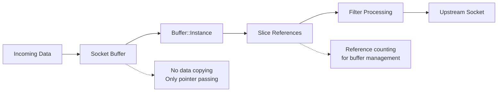
```mermaid
flowchart LR
    A[Incoming Data] --> B[Socket Buffer]
    B --> C[Buffer::Instance]
    C --> D[Slice References]
    D --> E[Filter Processing]
    E --> F[Upstream Socket]

    Note1[No data copying<br/>Only pointer passing]
    Note2[Reference counting<br/>for buffer management]

    B -.-> Note1
    D -.-> Note2
```

### Filter Chain Short-Circuiting
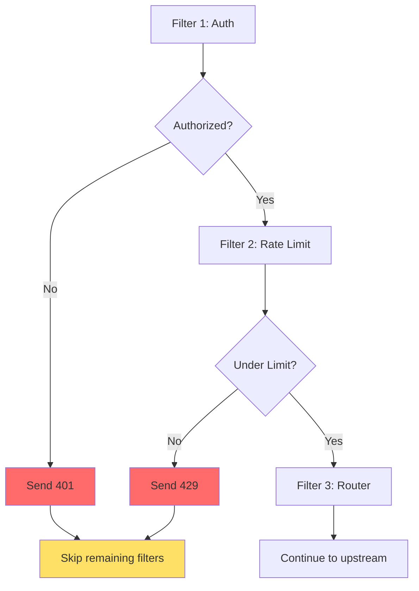
```mermaid
flowchart TD
    A[Filter 1: Auth] --> B{Authorized?}
    B -->|No| C[Send 401]
    B -->|Yes| D[Filter 2: Rate Limit]
    D --> E{Under Limit?}
    E -->|No| F[Send 429]
    E -->|Yes| G[Filter 3: Router]

    C --> H[Skip remaining filters]
    F --> H
    G --> I[Continue to upstream]

    style C fill:#ff6b6b
    style F fill:#ff6b6b
    style H fill:#ffe066
```

## Related Flows
- [Connection Lifecycle](01_connection_lifecycle.md)
- [Filter Chain Execution](05_filter_chain_execution.md)
- [Retry and Timeout Handling](07_retry_circuit_breaking.md)
- [Upstream Connection Management](06_upstream_connection_management.md)
