# Cluster Management and Load Balancing Flow

## Overview

This document details how Envoy manages clusters, performs load balancing across upstream hosts, and handles host health and availability.

## Cluster Manager Architecture

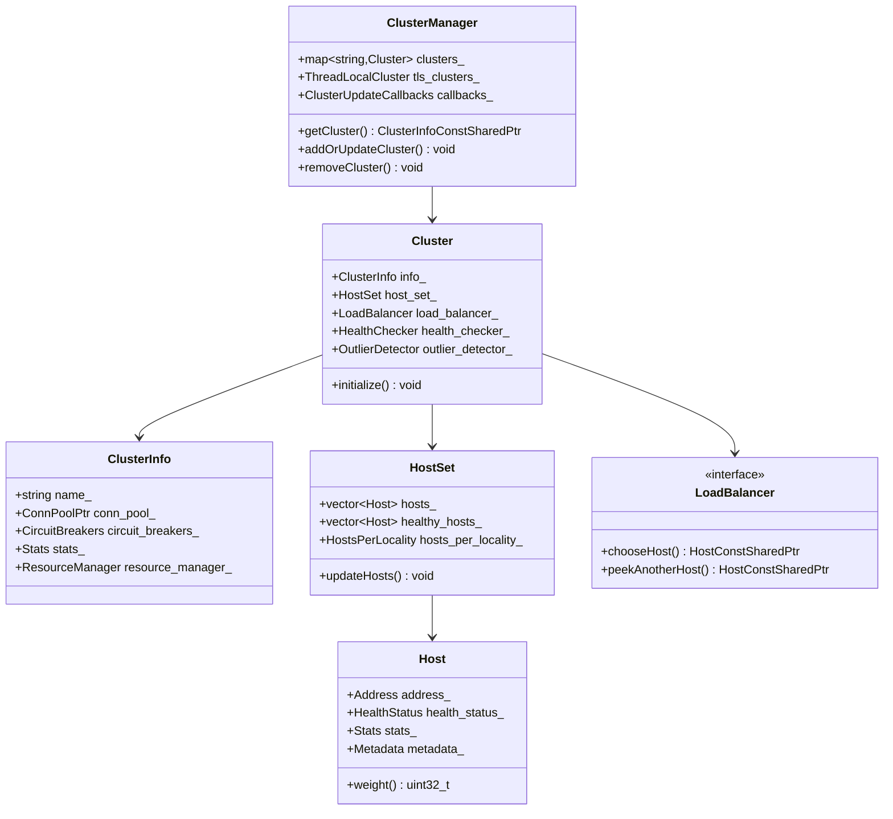

## Cluster Initialization Flow

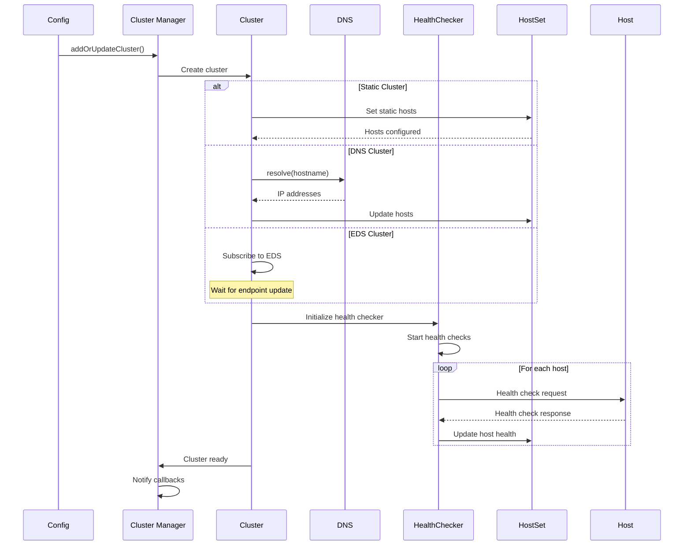

## Load Balancing Decision Flow

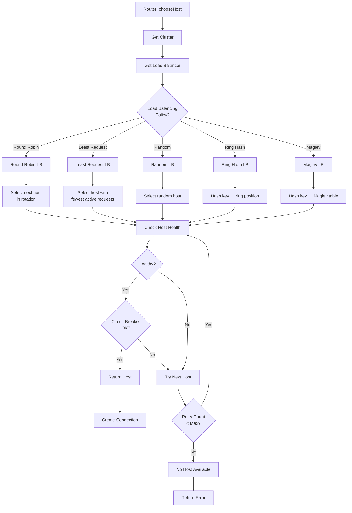

## Round Robin Load Balancer

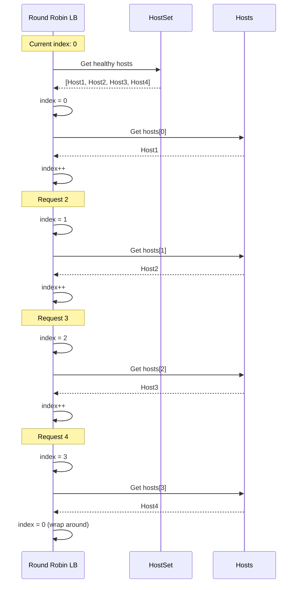

## Least Request Load Balancer

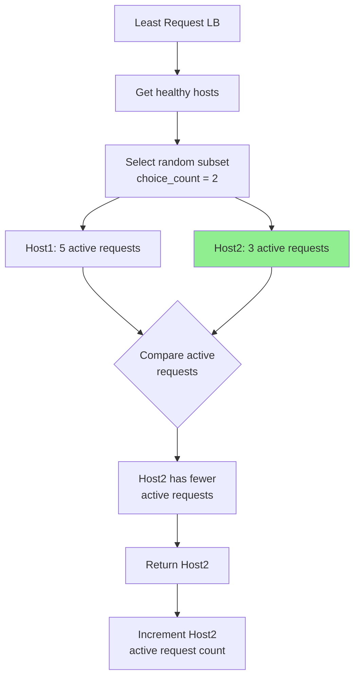

## Ring Hash Load Balancer

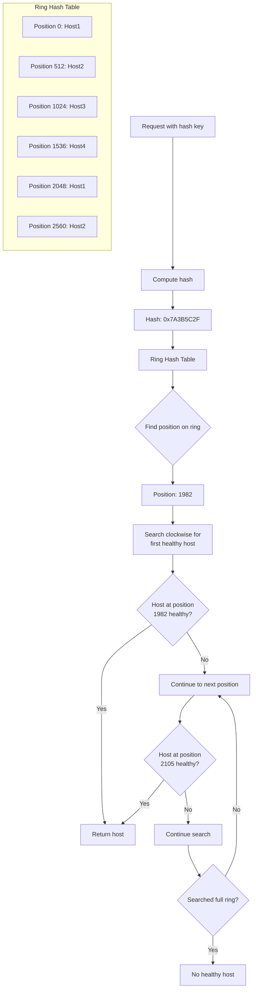

## Maglev Load Balancer

```mermaid
flowchart LR
    A[Request] --> B[Extract Hash Key]
    B --> C[Compute Maglev Hash]
    C --> D[Maglev Table Lookup]

    D --> E[Table Index: 42]
    E --> F[Table[42] = Host3]

    F --> G{Host3 Healthy?}
    G -->|Yes| H[Return Host3]
    G -->|No| I[Rehash to next entry]

    subgraph "Maglev Lookup Table Size: 65537"
        T1["Index 0: Host1"]
        T2["Index 1: Host2"]
        T3["..."]
        T4["Index 42: Host3"]
        T5["Index 43: Host1"]
        T6["..."]
        T7["Index 65536: Host4"]
    end

    Note1["Provides excellent<br/>load distribution<br/>with minimal disruption<br/>on host changes"]

    D -.-> Note1
```

## Weighted Load Balancing

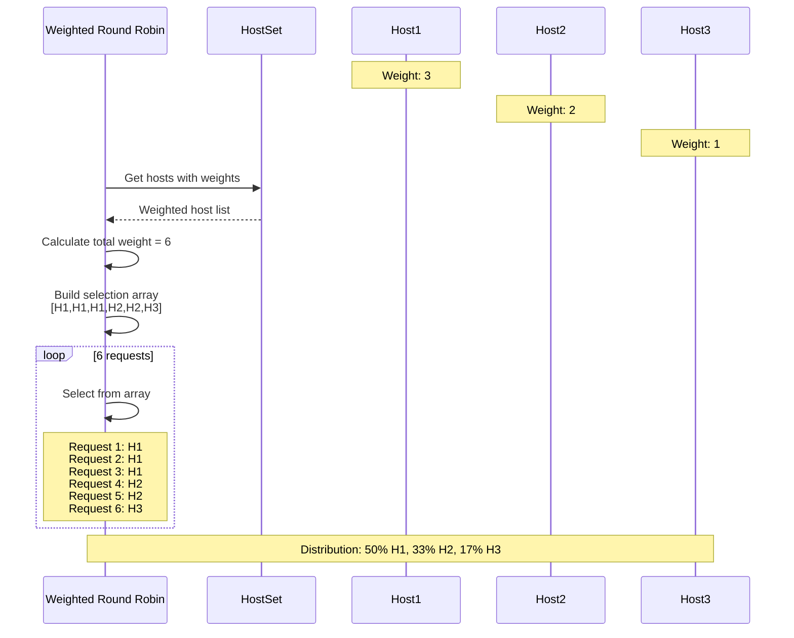

## Priority and Locality Aware Load Balancing

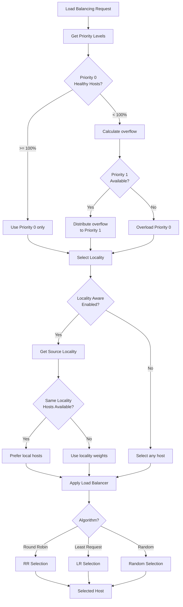

## Host Selection with Retry

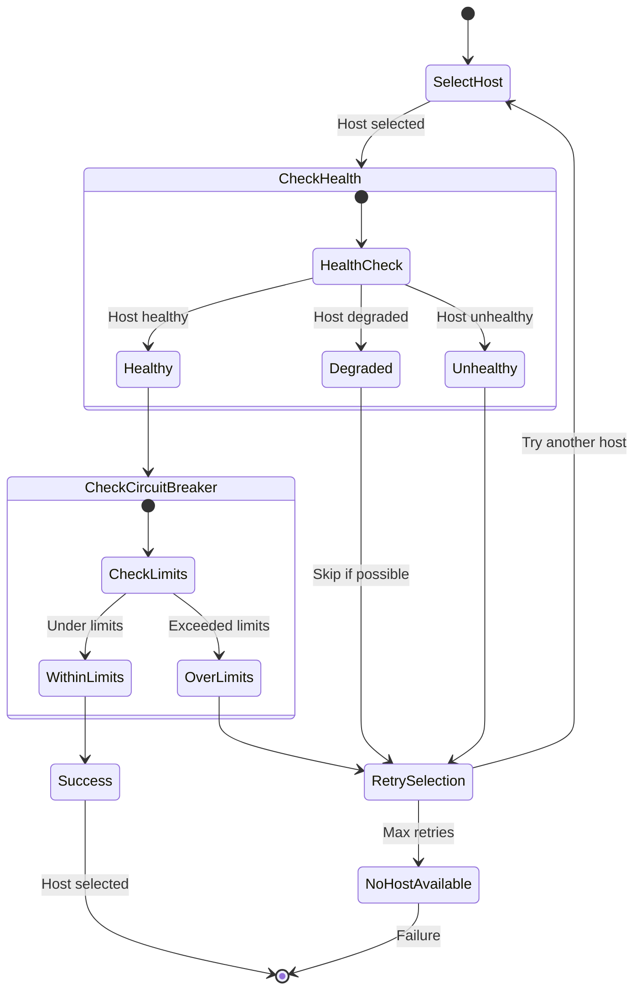

## Host Health Status Transitions

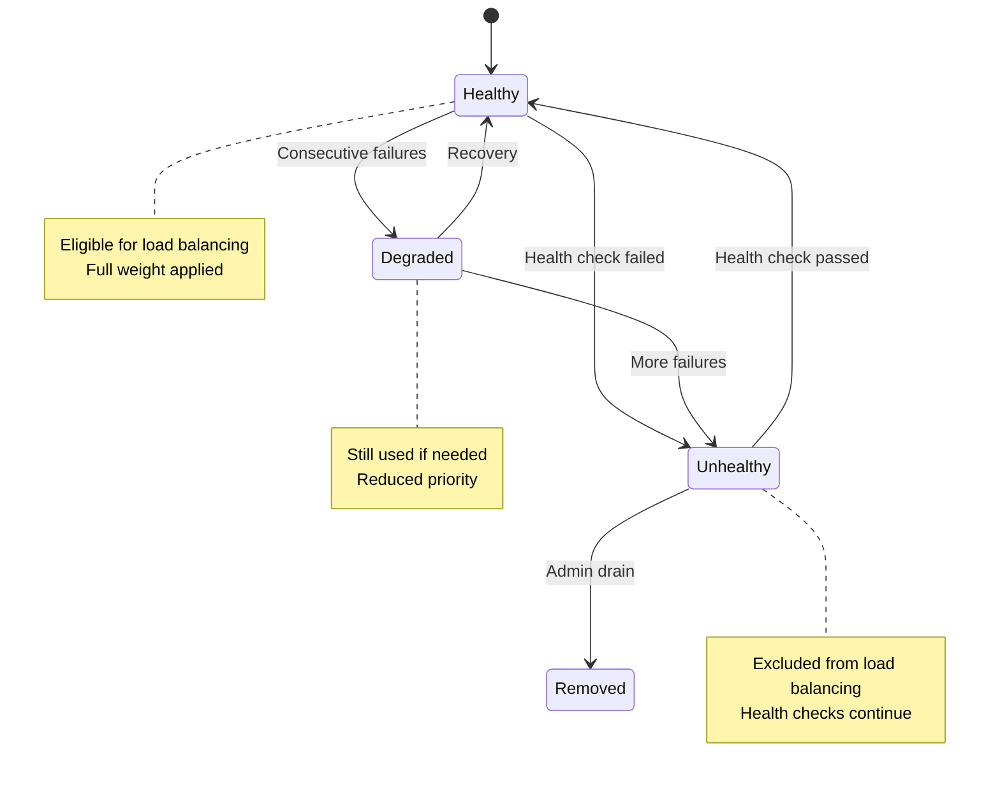

## Subset Load Balancing

```mermaid
flowchart TD
    A[Request with Metadata] --> B[Extract Metadata Keys]
    B --> C[version: v2<br/>stage: canary]

    C --> D[Subset Selector]
    D --> E{Match Subset<br/>Definition?}

    E -->|Yes| F[Get Subset Hosts]
    F --> G[Hosts with matching<br/>metadata]

    G --> H[subset_hosts =<br/>[Host3, Host5, Host7]]

    E -->|No| I{Fallback Policy?}

    I -->|ANY_ENDPOINT| J[Use all hosts]
    I -->|NO_FALLBACK| K[Return no host]
    I -->|DEFAULT_SUBSET| L[Use default subset]

    H --> M[Apply Load Balancer<br/>to Subset]
    J --> M
    L --> M

    M --> N[Select Host]

    style H fill:#90EE90
    style K fill:#ff6b6b
```

## Active Health Checking Flow

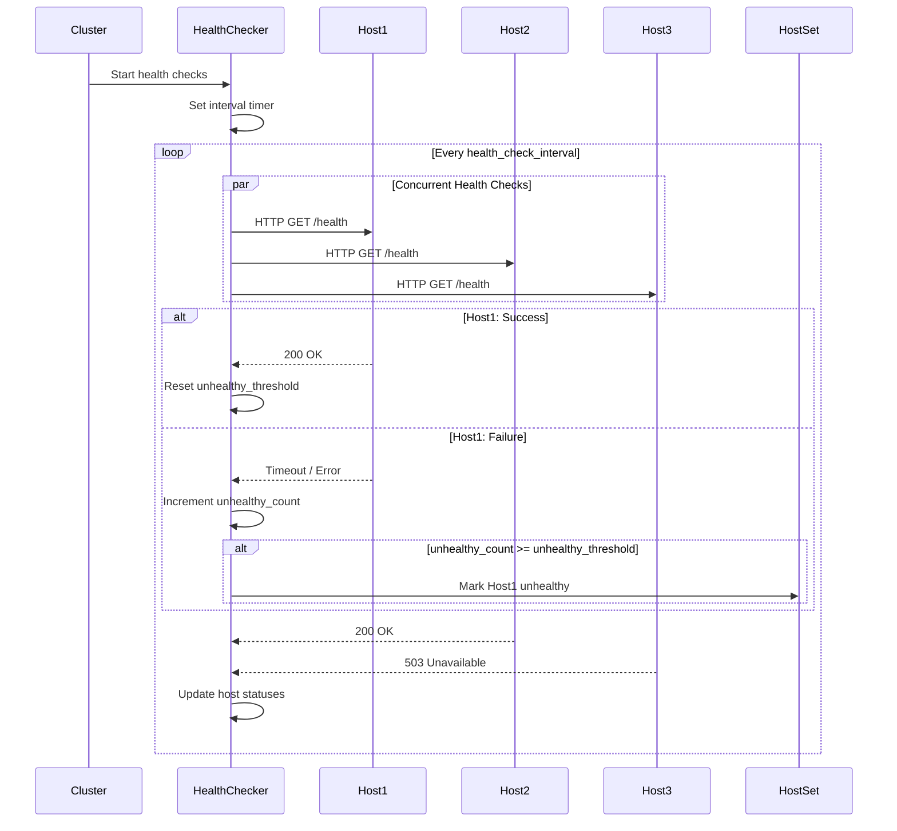

## Outlier Detection Flow

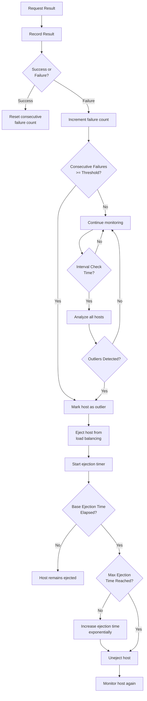

## Panic Threshold Handling

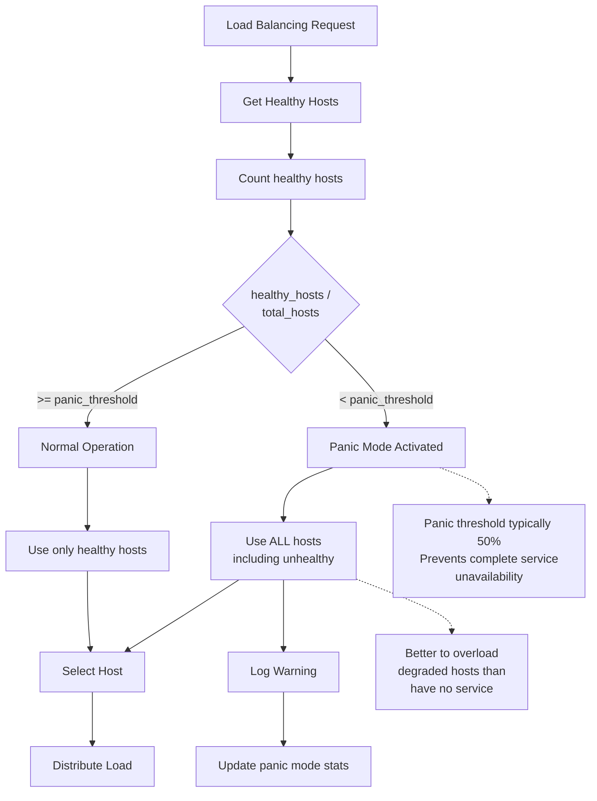

## Zone Aware Routing

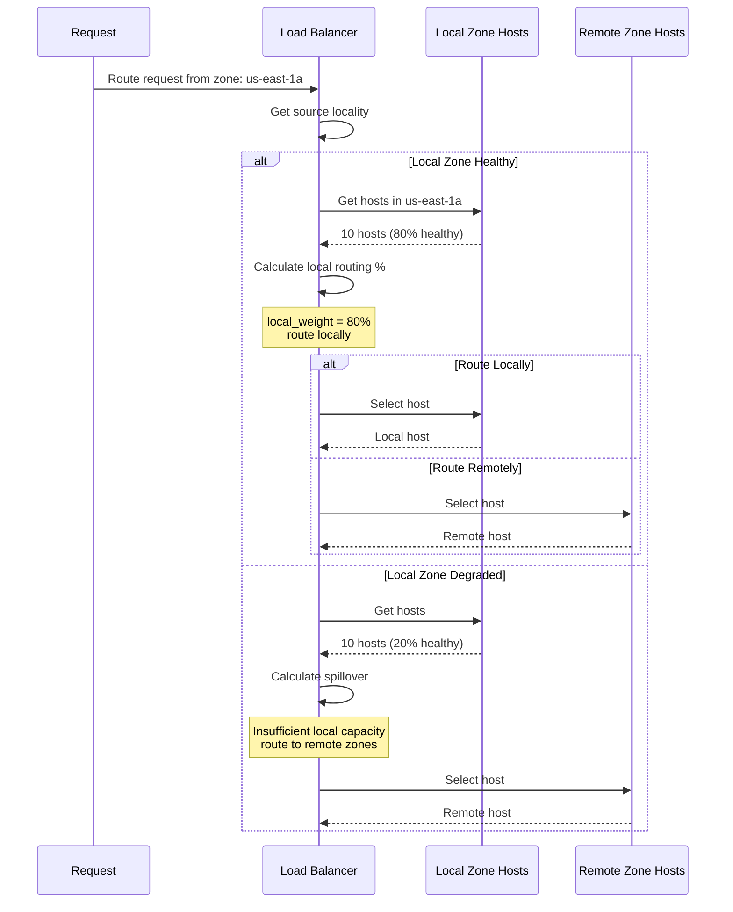

## Connection Pool per Host

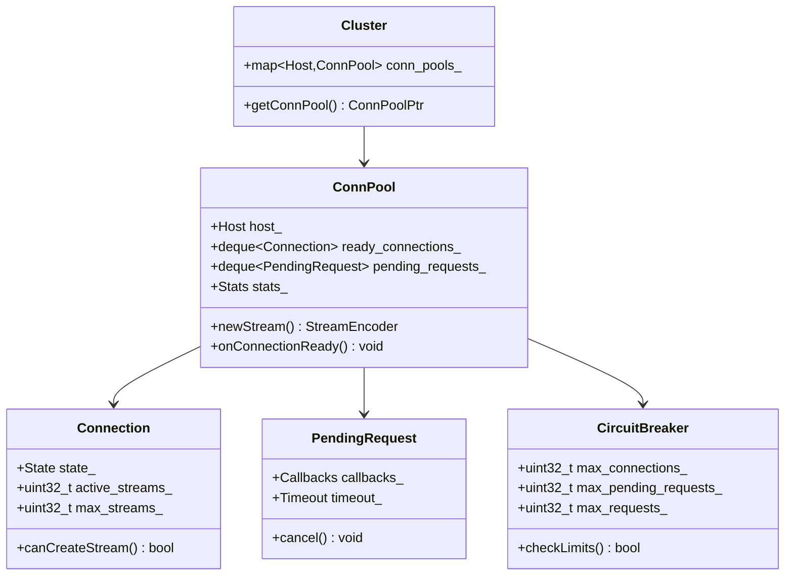

## Cluster Statistics

```yaml
# Cluster membership stats
cluster.backend.membership_total          # Total hosts
cluster.backend.membership_healthy        # Healthy hosts
cluster.backend.membership_degraded       # Degraded hosts

# Load balancing stats
cluster.backend.lb_healthy_panic          # Panic mode activations
cluster.backend.lb_zone_routing_all_directly_remote
cluster.backend.lb_zone_routing_sampled
cluster.backend.lb_zone_routing_cross_zone

# Host selection stats
cluster.backend.lb_local_cluster_not_ok   # Local zone not healthy
cluster.backend.lb_zone_no_capacity_left  # Zone at capacity

# Health check stats
cluster.backend.health_check.attempt      # Health check attempts
cluster.backend.health_check.success      # Successful checks
cluster.backend.health_check.failure      # Failed checks
cluster.backend.health_check.network_failure

# Outlier detection stats
cluster.backend.outlier_detection.ejections_active
cluster.backend.outlier_detection.ejections_total
cluster.backend.outlier_detection.ejections_consecutive_5xx
```

## Load Balancer Selection Algorithm

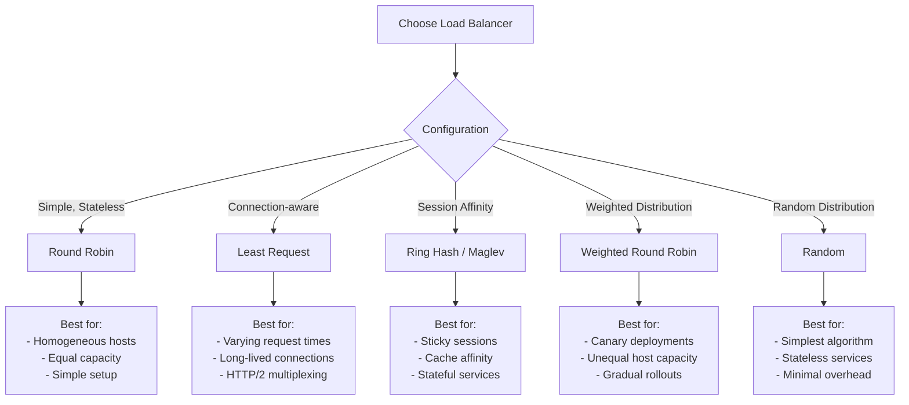

## Key Takeaways

### Cluster Management
1. **Dynamic Updates**: Clusters can be added/updated/removed dynamically
2. **Multiple Discovery Types**: Static, DNS, EDS (xDS)
3. **Health Tracking**: Active and passive health checking
4. **Outlier Detection**: Automatic problem host identification

### Load Balancing
1. **Multiple Algorithms**: Round Robin, Least Request, Ring Hash, Maglev, Random
2. **Locality Awareness**: Zone-aware routing, cross-zone failover
3. **Priority Levels**: Spillover between priority tiers
4. **Subset Selection**: Metadata-based host subset filtering

### Health Management
1. **Active Health Checks**: Periodic probes to hosts
2. **Passive Health Checks**: Outlier detection from real traffic
3. **Panic Threshold**: Use unhealthy hosts when needed
4. **Gradual Recovery**: Exponential backoff for ejected hosts

## Related Flows
- [xDS Configuration Updates](04_xds_configuration_flow.md)
- [Upstream Connection Management](06_upstream_connection_management.md)
- [Health Checking](08_health_checking.md)
- [Retry and Circuit Breaking](07_retry_circuit_breaking.md)
