# xDS Configuration Update Flow

## Overview

This document details the xDS (Discovery Service) protocol flow, showing how Envoy dynamically receives and applies configuration updates for listeners, routes, clusters, and endpoints without restart.

## xDS Protocol Overview

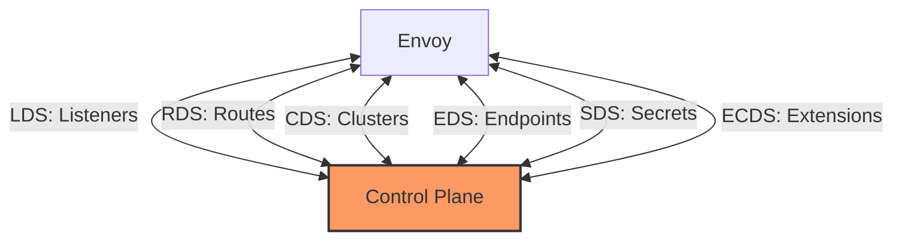
```mermaid
graph TD
    A[Envoy] <-->|LDS: Listeners| B[Control Plane]
    A <-->|RDS: Routes| B
    A <-->|CDS: Clusters| B
    A <-->|EDS: Endpoints| B
    A <-->|SDS: Secrets| B
    A <-->|ECDS: Extensions| B

    style B fill:#f96,stroke:#333,stroke-width:2px
```

## xDS State-of-the-World (SotW) Protocol

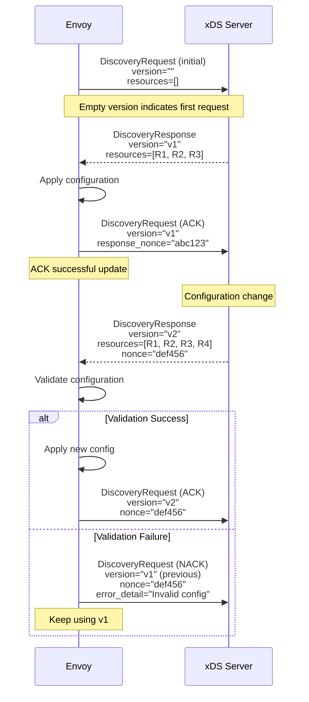
```mermaid
sequenceDiagram
    participant Envoy
    participant xDS as xDS Server

    Envoy->>xDS: DiscoveryRequest (initial)<br/>version=""<br/>resources=[]
    Note over Envoy,xDS: Empty version indicates first request

    xDS-->>Envoy: DiscoveryResponse<br/>version="v1"<br/>resources=[R1, R2, R3]
    Envoy->>Envoy: Apply configuration

    Envoy->>xDS: DiscoveryRequest (ACK)<br/>version="v1"<br/>response_nonce="abc123"
    Note over Envoy: ACK successful update

    Note over xDS: Configuration change

    xDS-->>Envoy: DiscoveryResponse<br/>version="v2"<br/>resources=[R1, R2, R3, R4]<br/>nonce="def456"

    Envoy->>Envoy: Validate configuration
    alt Validation Success
        Envoy->>Envoy: Apply new config
        Envoy->>xDS: DiscoveryRequest (ACK)<br/>version="v2"<br/>nonce="def456"
    else Validation Failure
        Envoy->>xDS: DiscoveryRequest (NACK)<br/>version="v1" (previous)<br/>nonce="def456"<br/>error_detail="Invalid config"
        Note over Envoy: Keep using v1
    end
```

## xDS Incremental Protocol (Delta xDS)

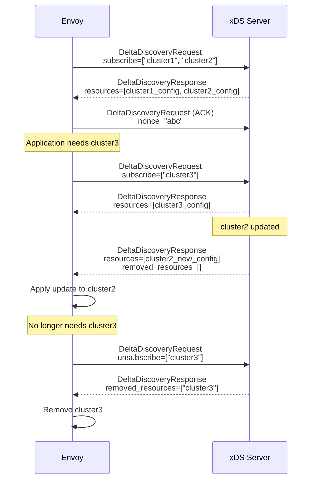
```mermaid
sequenceDiagram
    participant Envoy
    participant xDS as xDS Server

    Envoy->>xDS: DeltaDiscoveryRequest<br/>subscribe=["cluster1", "cluster2"]
    xDS-->>Envoy: DeltaDiscoveryResponse<br/>resources=[cluster1_config, cluster2_config]

    Envoy->>xDS: DeltaDiscoveryRequest (ACK)<br/>nonce="abc"

    Note over Envoy: Application needs cluster3

    Envoy->>xDS: DeltaDiscoveryRequest<br/>subscribe=["cluster3"]
    xDS-->>Envoy: DeltaDiscoveryResponse<br/>resources=[cluster3_config]

    Note over xDS: cluster2 updated

    xDS-->>Envoy: DeltaDiscoveryResponse<br/>resources=[cluster2_new_config]<br/>removed_resources=[]

    Envoy->>Envoy: Apply update to cluster2

    Note over Envoy: No longer needs cluster3

    Envoy->>xDS: DeltaDiscoveryRequest<br/>unsubscribe=["cluster3"]
    xDS-->>Envoy: DeltaDiscoveryResponse<br/>removed_resources=["cluster3"]

    Envoy->>Envoy: Remove cluster3
```

## Configuration Dependency Graph

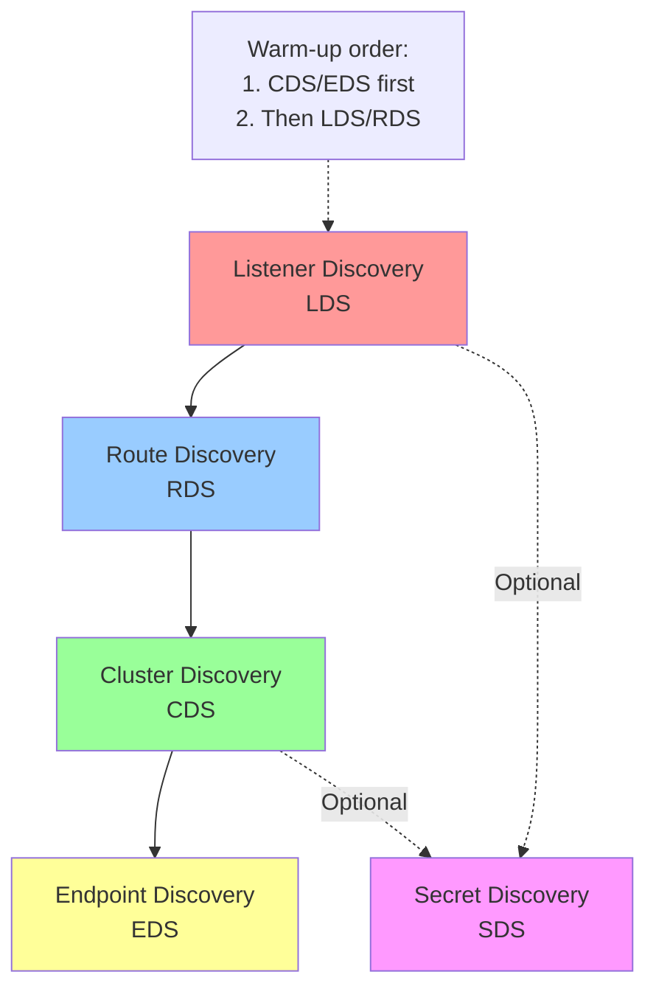
```mermaid
graph TD
    LDS[Listener Discovery<br/>LDS] --> RDS[Route Discovery<br/>RDS]
    RDS --> CDS[Cluster Discovery<br/>CDS]
    CDS --> EDS[Endpoint Discovery<br/>EDS]

    LDS -.->|Optional| SDS[Secret Discovery<br/>SDS]
    CDS -.->|Optional| SDS

    style LDS fill:#ff9999
    style RDS fill:#99ccff
    style CDS fill:#99ff99
    style EDS fill:#ffff99
    style SDS fill:#ff99ff

    Note1["Warm-up order:<br/>1. CDS/EDS first<br/>2. Then LDS/RDS"]
    Note1 -.-> LDS
```

## Complete xDS Bootstrap and Update Flow

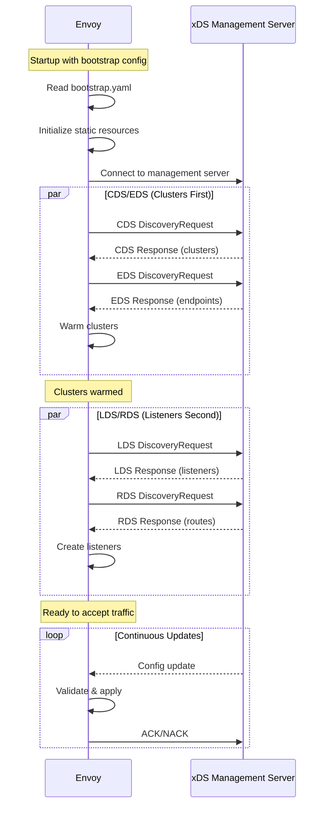
```mermaid
sequenceDiagram
    participant Envoy
    participant xDS as xDS Management Server

    Note over Envoy: Startup with bootstrap config

    Envoy->>Envoy: Read bootstrap.yaml
    Envoy->>Envoy: Initialize static resources
    Envoy->>xDS: Connect to management server

    par CDS/EDS (Clusters First)
        Envoy->>xDS: CDS DiscoveryRequest
        xDS-->>Envoy: CDS Response (clusters)
        Envoy->>xDS: EDS DiscoveryRequest
        xDS-->>Envoy: EDS Response (endpoints)
        Envoy->>Envoy: Warm clusters
    end

    Note over Envoy: Clusters warmed

    par LDS/RDS (Listeners Second)
        Envoy->>xDS: LDS DiscoveryRequest
        xDS-->>Envoy: LDS Response (listeners)
        Envoy->>xDS: RDS DiscoveryRequest
        xDS-->>Envoy: RDS Response (routes)
        Envoy->>Envoy: Create listeners
    end

    Note over Envoy: Ready to accept traffic

    loop Continuous Updates
        xDS-->>Envoy: Config update
        Envoy->>Envoy: Validate & apply
        Envoy->>xDS: ACK/NACK
    end
```

## xDS Subscription State Machine

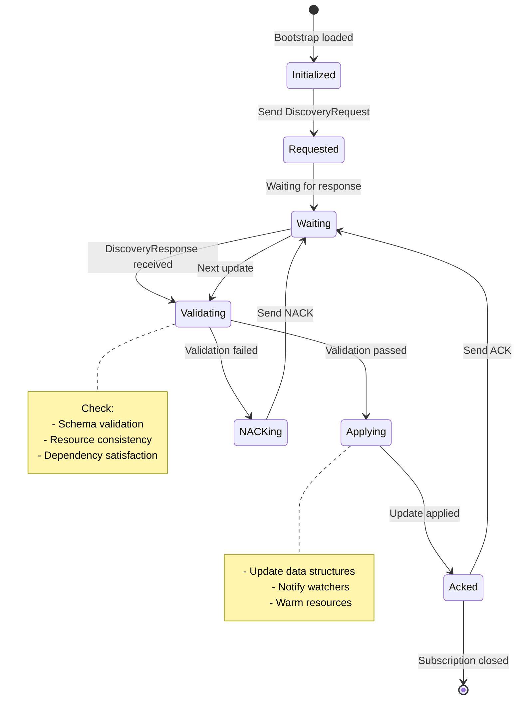
```mermaid
stateDiagram-v2
    [*] --> Initialized: Bootstrap loaded
    Initialized --> Requested: Send DiscoveryRequest
    Requested --> Waiting: Waiting for response
    Waiting --> Validating: DiscoveryResponse received
    Validating --> Applying: Validation passed
    Validating --> NACKing: Validation failed
    Applying --> Acked: Update applied
    NACKing --> Waiting: Send NACK
    Acked --> Waiting: Send ACK
    Waiting --> Validating: Next update
    Acked --> [*]: Subscription closed

    note right of Validating
        Check:
        - Schema validation
        - Resource consistency
        - Dependency satisfaction
    end note

    note right of Applying
        - Update data structures
        - Notify watchers
        - Warm resources
    end note
```

## Listener Discovery Service (LDS) Flow

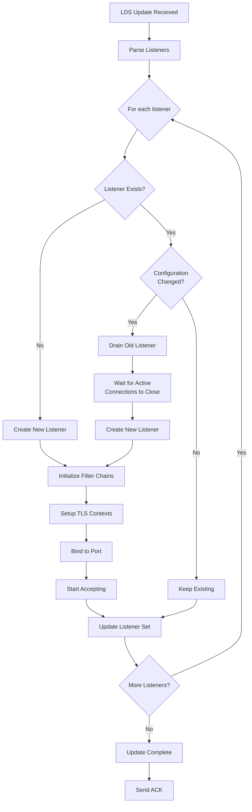
```mermaid
flowchart TD
    A[LDS Update Received] --> B[Parse Listeners]
    B --> C{For each listener}

    C --> D{Listener Exists?}
    D -->|No| E[Create New Listener]
    D -->|Yes| F{Configuration<br/>Changed?}

    E --> G[Initialize Filter Chains]
    G --> H[Setup TLS Contexts]
    H --> I[Bind to Port]
    I --> J[Start Accepting]

    F -->|Yes| K[Drain Old Listener]
    K --> L[Wait for Active<br/>Connections to Close]
    L --> M[Create New Listener]
    M --> G

    F -->|No| N[Keep Existing]

    J --> O[Update Listener Set]
    N --> O
    O --> P{More Listeners?}
    P -->|Yes| C
    P -->|No| Q[Update Complete]

    Q --> R[Send ACK]
```

## Route Discovery Service (RDS) Flow

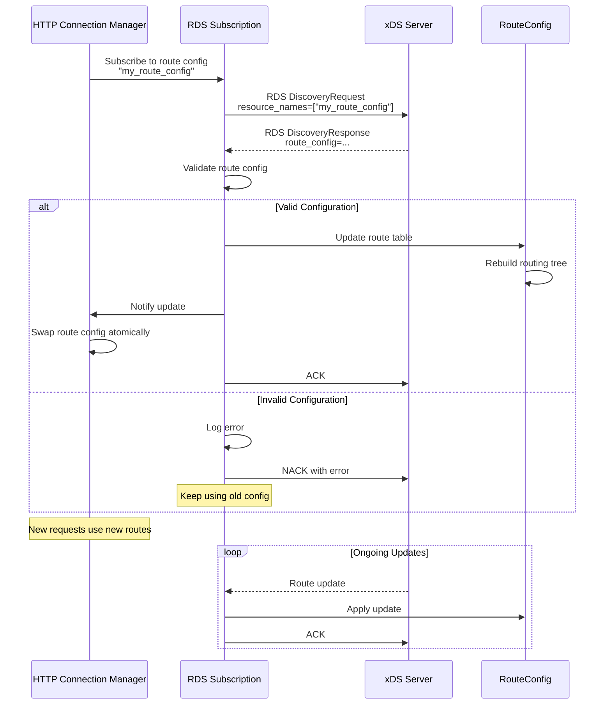
```mermaid
sequenceDiagram
    participant HCM as HTTP Connection Manager
    participant RDS as RDS Subscription
    participant xDS as xDS Server
    participant RouteConfig

    HCM->>RDS: Subscribe to route config<br/>"my_route_config"
    RDS->>xDS: RDS DiscoveryRequest<br/>resource_names=["my_route_config"]

    xDS-->>RDS: RDS DiscoveryResponse<br/>route_config=...

    RDS->>RDS: Validate route config
    alt Valid Configuration
        RDS->>RouteConfig: Update route table
        RouteConfig->>RouteConfig: Rebuild routing tree
        RDS->>HCM: Notify update
        HCM->>HCM: Swap route config atomically
        RDS->>xDS: ACK
    else Invalid Configuration
        RDS->>RDS: Log error
        RDS->>xDS: NACK with error
        Note over RDS: Keep using old config
    end

    Note over HCM: New requests use new routes

    loop Ongoing Updates
        xDS-->>RDS: Route update
        RDS->>RouteConfig: Apply update
        RDS->>xDS: ACK
    end
```

## Cluster Discovery Service (CDS) Flow

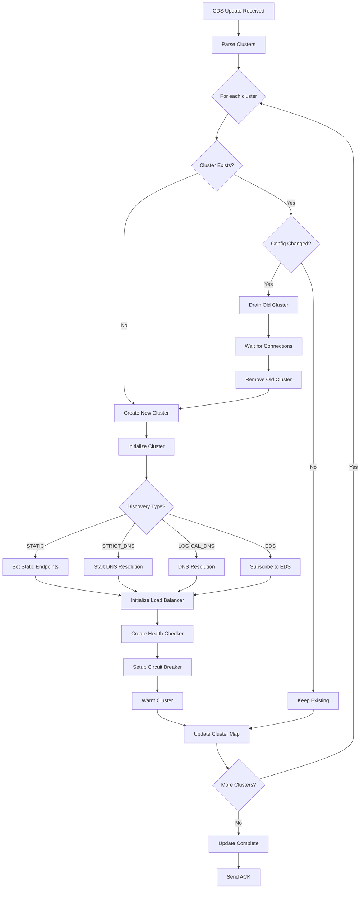
```mermaid
flowchart TD
    A[CDS Update Received] --> B[Parse Clusters]
    B --> C{For each cluster}

    C --> D{Cluster Exists?}
    D -->|No| E[Create New Cluster]
    D -->|Yes| F{Config Changed?}

    E --> G[Initialize Cluster]
    G --> H{Discovery Type?}

    H -->|STATIC| I[Set Static Endpoints]
    H -->|STRICT_DNS| J[Start DNS Resolution]
    H -->|LOGICAL_DNS| K[DNS Resolution]
    H -->|EDS| L[Subscribe to EDS]

    I --> M[Initialize Load Balancer]
    J --> M
    K --> M
    L --> M

    M --> N[Create Health Checker]
    N --> O[Setup Circuit Breaker]
    O --> P[Warm Cluster]

    F -->|Yes| Q[Drain Old Cluster]
    Q --> R[Wait for Connections]
    R --> S[Remove Old Cluster]
    S --> E

    F -->|No| T[Keep Existing]

    P --> U[Update Cluster Map]
    T --> U

    U --> V{More Clusters?}
    V -->|Yes| C
    V -->|No| W[Update Complete]

    W --> X[Send ACK]
```

## Endpoint Discovery Service (EDS) Flow

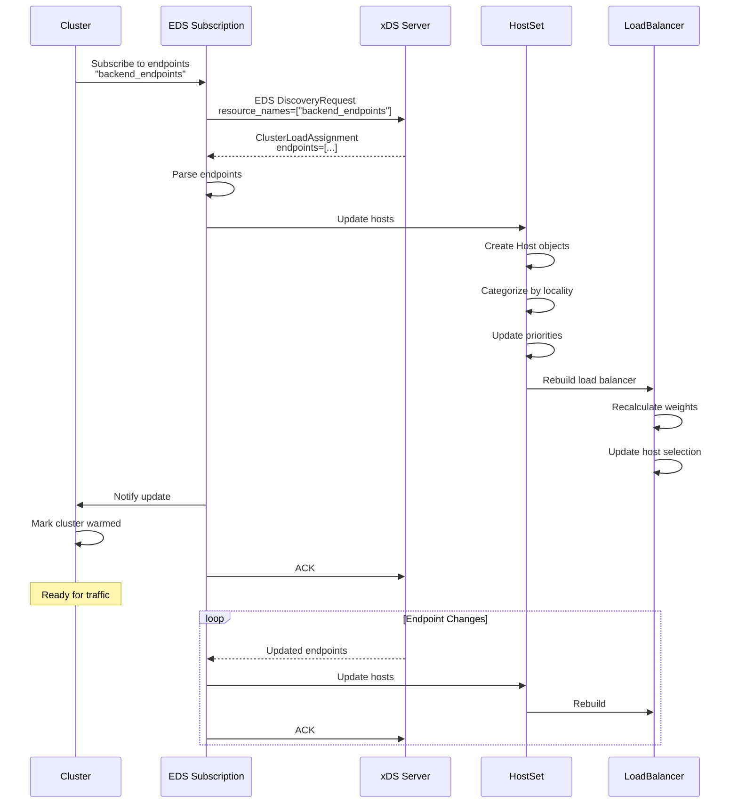
```mermaid
sequenceDiagram
    participant Cluster
    participant EDS as EDS Subscription
    participant xDS as xDS Server
    participant HostSet
    participant LoadBalancer

    Cluster->>EDS: Subscribe to endpoints<br/>"backend_endpoints"
    EDS->>xDS: EDS DiscoveryRequest<br/>resource_names=["backend_endpoints"]

    xDS-->>EDS: ClusterLoadAssignment<br/>endpoints=[...]

    EDS->>EDS: Parse endpoints
    EDS->>HostSet: Update hosts

    HostSet->>HostSet: Create Host objects
    HostSet->>HostSet: Categorize by locality
    HostSet->>HostSet: Update priorities

    HostSet->>LoadBalancer: Rebuild load balancer
    LoadBalancer->>LoadBalancer: Recalculate weights
    LoadBalancer->>LoadBalancer: Update host selection

    EDS->>Cluster: Notify update
    Cluster->>Cluster: Mark cluster warmed

    EDS->>xDS: ACK

    Note over Cluster: Ready for traffic

    loop Endpoint Changes
        xDS-->>EDS: Updated endpoints
        EDS->>HostSet: Update hosts
        HostSet->>LoadBalancer: Rebuild
        EDS->>xDS: ACK
    end
```

## Cluster Warming Process

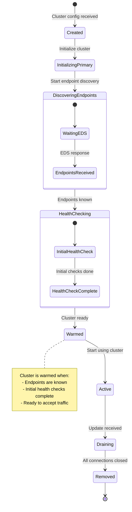
```mermaid
stateDiagram-v2
    [*] --> Created: Cluster config received
    Created --> InitializingPrimary: Initialize cluster
    InitializingPrimary --> DiscoveringEndpoints: Start endpoint discovery

    state DiscoveringEndpoints {
        [*] --> WaitingEDS
        WaitingEDS --> EndpointsReceived: EDS response
    }

    DiscoveringEndpoints --> HealthChecking: Endpoints known

    state HealthChecking {
        [*] --> InitialHealthCheck
        InitialHealthCheck --> HealthCheckComplete: Initial checks done
    }

    HealthChecking --> Warmed: Cluster ready

    Warmed --> Active: Start using cluster
    Active --> Draining: Update received
    Draining --> Removed: All connections closed
    Removed --> [*]

    note right of Warmed
        Cluster is warmed when:
        - Endpoints are known
        - Initial health checks complete
        - Ready to accept traffic
    end note
```

## Configuration Version Management

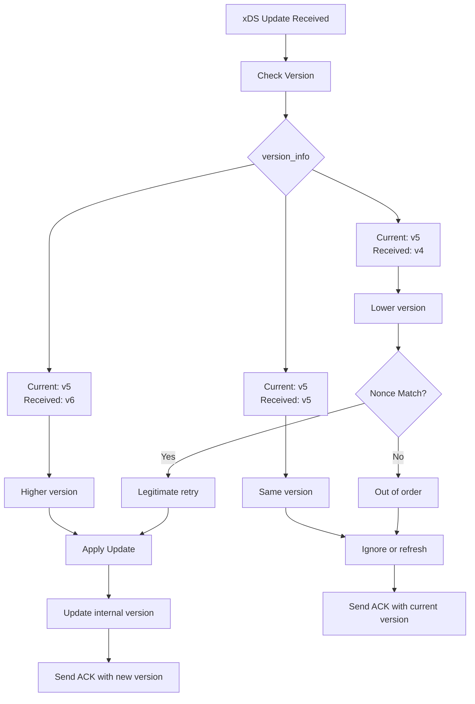
```mermaid
flowchart TD
    A[xDS Update Received] --> B[Check Version]
    B --> C{version_info}

    C --> D["Current: v5<br/>Received: v6"]
    D --> E[Higher version]
    E --> F[Apply Update]

    C --> G["Current: v5<br/>Received: v5"]
    G --> H[Same version]
    H --> I[Ignore or refresh]

    C --> J["Current: v5<br/>Received: v4"]
    J --> K[Lower version]
    K --> L{Nonce Match?}
    L -->|Yes| M[Legitimate retry]
    M --> F
    L -->|No| N[Out of order]
    N --> I

    F --> O[Update internal version]
    O --> P[Send ACK with new version]

    I --> Q[Send ACK with current version]
```

## Aggregated Discovery Service (ADS) Flow

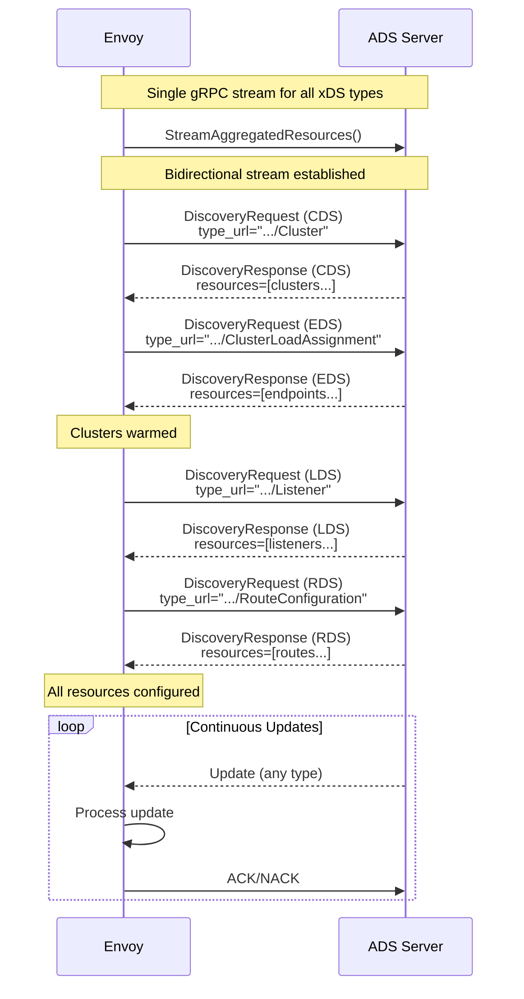
```mermaid
sequenceDiagram
    participant Envoy
    participant ADS as ADS Server

    Note over Envoy,ADS: Single gRPC stream for all xDS types

    Envoy->>ADS: StreamAggregatedResources()
    Note over Envoy,ADS: Bidirectional stream established

    Envoy->>ADS: DiscoveryRequest (CDS)<br/>type_url=".../Cluster"
    ADS-->>Envoy: DiscoveryResponse (CDS)<br/>resources=[clusters...]

    Envoy->>ADS: DiscoveryRequest (EDS)<br/>type_url=".../ClusterLoadAssignment"
    ADS-->>Envoy: DiscoveryResponse (EDS)<br/>resources=[endpoints...]

    Note over Envoy: Clusters warmed

    Envoy->>ADS: DiscoveryRequest (LDS)<br/>type_url=".../Listener"
    ADS-->>Envoy: DiscoveryResponse (LDS)<br/>resources=[listeners...]

    Envoy->>ADS: DiscoveryRequest (RDS)<br/>type_url=".../RouteConfiguration"
    ADS-->>Envoy: DiscoveryResponse (RDS)<br/>resources=[routes...]

    Note over Envoy: All resources configured

    loop Continuous Updates
        ADS-->>Envoy: Update (any type)
        Envoy->>Envoy: Process update
        Envoy->>ADS: ACK/NACK
    end
```

## Resource Warming and Dependency Resolution

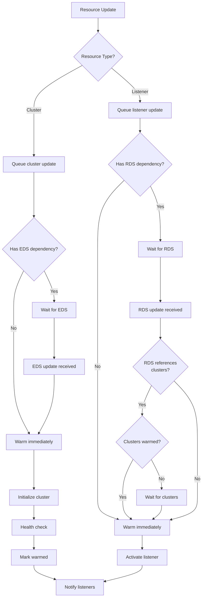
```mermaid
flowchart TD
    A[Resource Update] --> B{Resource Type?}

    B -->|Cluster| C[Queue cluster update]
    C --> D{Has EDS dependency?}
    D -->|Yes| E[Wait for EDS]
    D -->|No| F[Warm immediately]

    E --> G[EDS update received]
    G --> F

    F --> H[Initialize cluster]
    H --> I[Health check]
    I --> J[Mark warmed]

    B -->|Listener| K[Queue listener update]
    K --> L{Has RDS dependency?}
    L -->|Yes| M[Wait for RDS]
    L -->|No| N[Warm immediately]

    M --> O[RDS update received]
    O --> P{RDS references<br/>clusters?}
    P -->|Yes| Q{Clusters warmed?}
    Q -->|Yes| N
    Q -->|No| R[Wait for clusters]
    R --> N
    P -->|No| N

    N --> S[Activate listener]

    J --> T[Notify listeners]
    S --> T
```

## xDS API Versions

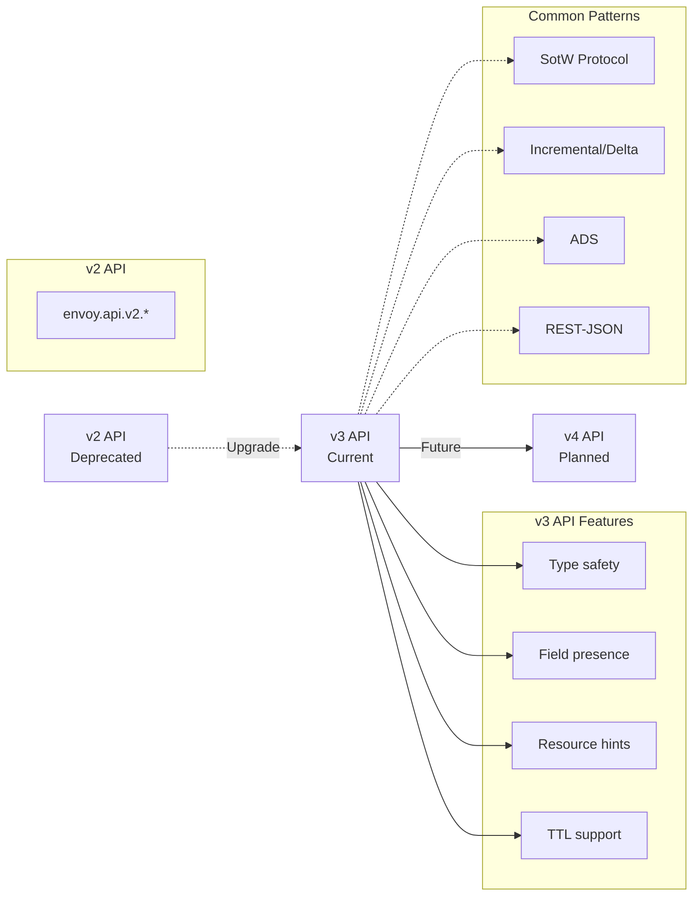
```mermaid
graph LR
    A[v2 API<br/>Deprecated] -.->|Upgrade| B[v3 API<br/>Current]
    B -->|Future| C[v4 API<br/>Planned]

    subgraph "v2 API"
        V2[envoy.api.v2.*]
    end

    subgraph "v3 API Features"
        V3A[Type safety]
        V3B[Field presence]
        V3C[Resource hints]
        V3D[TTL support]
    end

    subgraph "Common Patterns"
        P1[SotW Protocol]
        P2[Incremental/Delta]
        P3[ADS]
        P4[REST-JSON]
    end

    B --> V3A
    B --> V3B
    B --> V3C
    B --> V3D

    B -.-> P1
    B -.-> P2
    B -.-> P3
    B -.-> P4
```

## NACK Handling and Error Recovery

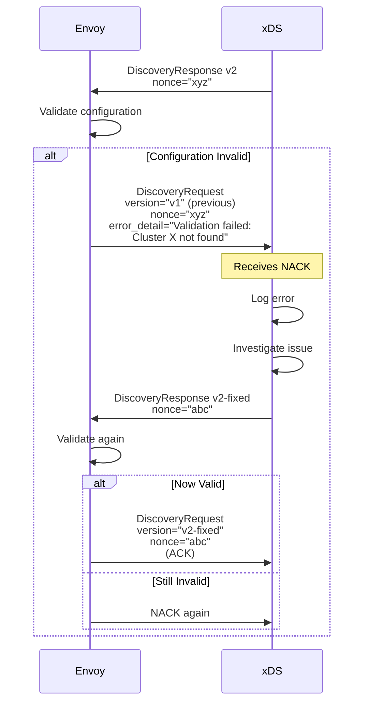
```mermaid
sequenceDiagram
    participant Envoy
    participant xDS

    xDS->>Envoy: DiscoveryResponse v2<br/>nonce="xyz"
    Envoy->>Envoy: Validate configuration

    alt Configuration Invalid
        Envoy->>xDS: DiscoveryRequest<br/>version="v1" (previous)<br/>nonce="xyz"<br/>error_detail="Validation failed:<br/>Cluster X not found"

        Note over xDS: Receives NACK

        xDS->>xDS: Log error
        xDS->>xDS: Investigate issue

        xDS->>Envoy: DiscoveryResponse v2-fixed<br/>nonce="abc"
        Envoy->>Envoy: Validate again

        alt Now Valid
            Envoy->>xDS: DiscoveryRequest<br/>version="v2-fixed"<br/>nonce="abc"<br/>(ACK)
        else Still Invalid
            Envoy->>xDS: NACK again
        end
    end
```

## Rate Limiting and Backpressure

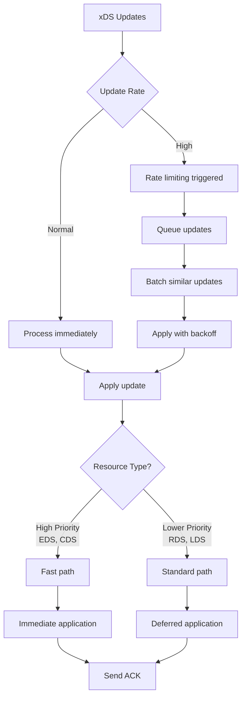
```mermaid
flowchart TD
    A[xDS Updates] --> B{Update Rate}

    B -->|Normal| C[Process immediately]
    B -->|High| D[Rate limiting triggered]

    D --> E[Queue updates]
    E --> F[Batch similar updates]
    F --> G[Apply with backoff]

    C --> H[Apply update]
    G --> H

    H --> I{Resource Type?}

    I -->|High Priority<br/>EDS, CDS| J[Fast path]
    I -->|Lower Priority<br/>RDS, LDS| K[Standard path]

    J --> L[Immediate application]
    K --> M[Deferred application]

    L --> N[Send ACK]
    M --> N
```

## Metadata and Resource Hints

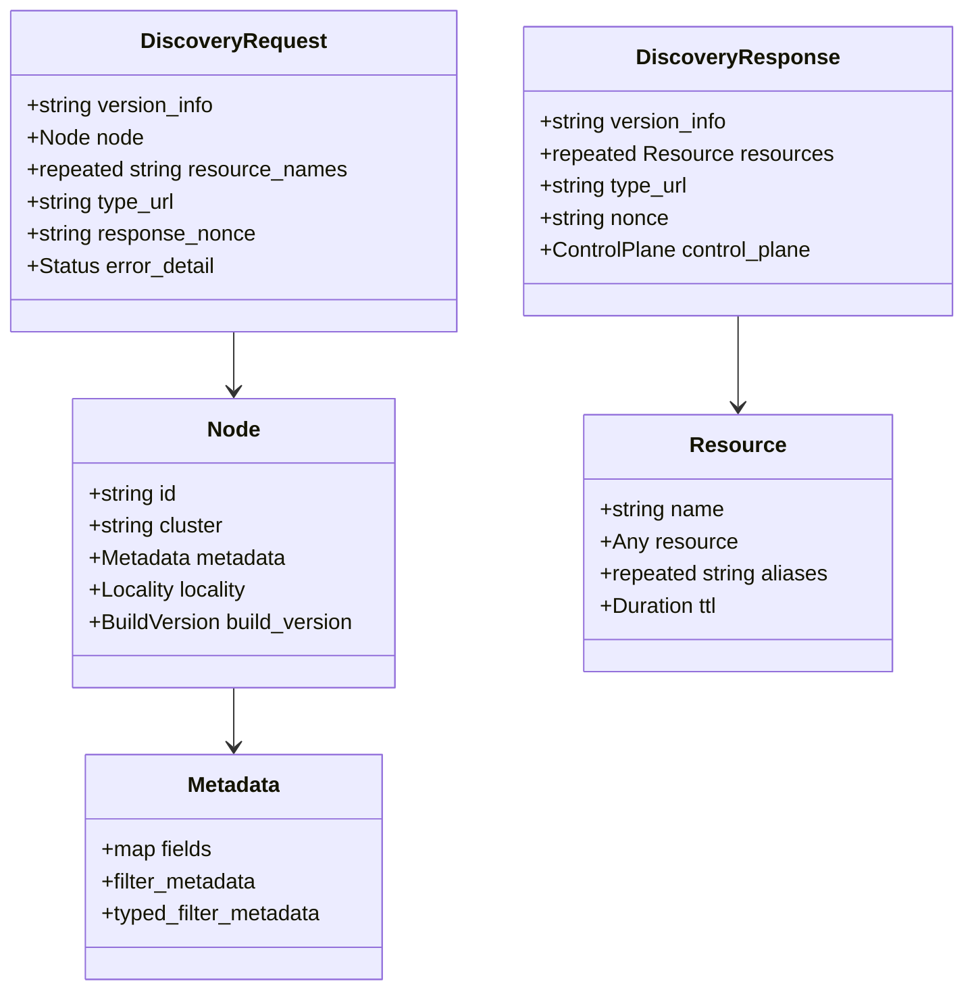
```mermaid
classDiagram
    class DiscoveryRequest {
        +string version_info
        +Node node
        +repeated string resource_names
        +string type_url
        +string response_nonce
        +Status error_detail
    }

    class Node {
        +string id
        +string cluster
        +Metadata metadata
        +Locality locality
        +BuildVersion build_version
    }

    class Metadata {
        +map fields
        +filter_metadata
        +typed_filter_metadata
    }

    class DiscoveryResponse {
        +string version_info
        +repeated Resource resources
        +string type_url
        +string nonce
        +ControlPlane control_plane
    }

    class Resource {
        +string name
        +Any resource
        +repeated string aliases
        +Duration ttl
    }

    DiscoveryRequest --> Node
    Node --> Metadata
    DiscoveryResponse --> Resource
```

## xDS Statistics

```yaml
# Subscription stats
control_plane.connected_state                    # 1 if connected
control_plane.pending_requests                   # Pending xDS requests

# Per-type stats
cluster_manager.cds.update_attempt               # CDS update attempts
cluster_manager.cds.update_success               # Successful updates
cluster_manager.cds.update_failure               # Failed updates
cluster_manager.cds.update_rejected              # Rejected updates
cluster_manager.cds.version                      # Current CDS version

listener_manager.lds.update_attempt
listener_manager.lds.update_success
listener_manager.lds.update_failure
listener_manager.lds.version

# EDS stats per cluster
cluster.backend.update_attempt
cluster.backend.update_success
cluster.backend.update_failure

# ADS stats
grpc.ads_cluster.streams_total                   # Total ADS streams
grpc.ads_cluster.streams_closed                  # Closed streams
```

## Common xDS Issues and Solutions

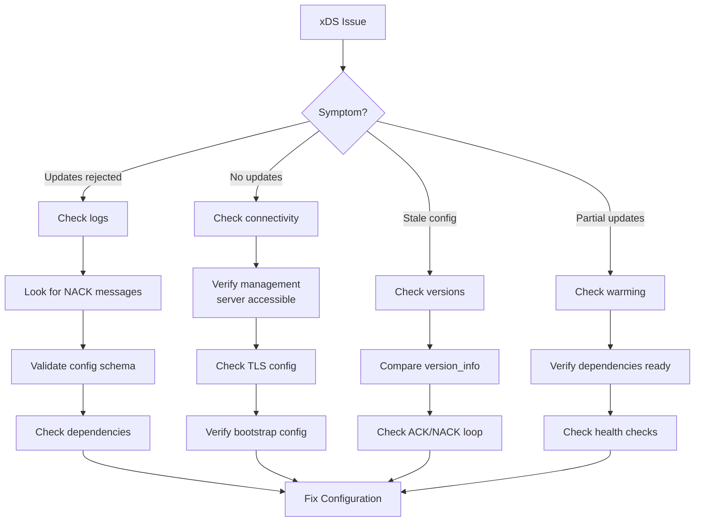
```mermaid
flowchart TD
    A[xDS Issue] --> B{Symptom?}

    B -->|No updates| C[Check connectivity]
    C --> C1[Verify management<br/>server accessible]
    C1 --> C2[Check TLS config]
    C2 --> C3[Verify bootstrap config]

    B -->|Updates rejected| D[Check logs]
    D --> D1[Look for NACK messages]
    D1 --> D2[Validate config schema]
    D2 --> D3[Check dependencies]

    B -->|Stale config| E[Check versions]
    E --> E1[Compare version_info]
    E1 --> E2[Check ACK/NACK loop]

    B -->|Partial updates| F[Check warming]
    F --> F1[Verify dependencies ready]
    F1 --> F2[Check health checks]

    D3 --> G[Fix Configuration]
    C3 --> G
    E2 --> G
    F2 --> G
```

## Key Takeaways

### xDS Protocol
1. **Dynamic Configuration**: Update without restart
2. **Eventually Consistent**: Config propagates asynchronously
3. **Versioned**: Track config versions and nonces
4. **ACK/NACK**: Explicit feedback on updates

### Resource Dependencies
1. **CDS → EDS**: Clusters must exist before endpoints
2. **LDS → RDS**: Listeners reference route configs
3. **Warming**: Resources warm before activation
4. **Atomic Updates**: Per-resource type updates

### Best Practices
1. **Use ADS**: Single stream for all types
2. **Implement Health**: Health checks for validation
3. **Monitor NACK**: Track rejected configurations
4. **Version Carefully**: Avoid version conflicts
5. **Test Updates**: Validate in staging first

## Related Flows
- [Cluster Management](03_cluster_load_balancing.md)
- [Connection Lifecycle](01_connection_lifecycle.md)
- [SDS Secret Updates](../security/02_sds_secret_updates.md)
