# Retry Logic and Circuit Breaking Flow

## Overview

This document details Envoy's retry mechanisms and circuit breaking patterns, showing how Envoy handles failures, prevents cascading failures, and implements resilience patterns.

## Retry Decision Flow

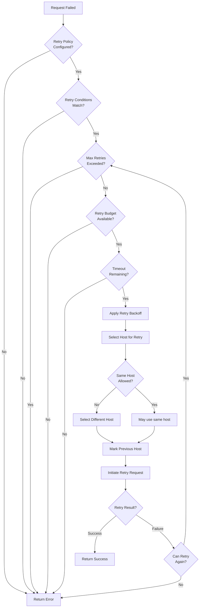

## Complete Retry Sequence

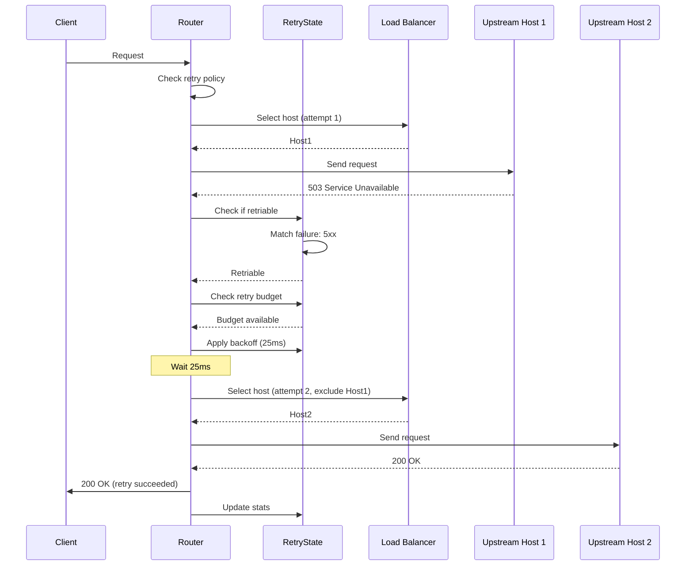

## Retry Policy Configuration

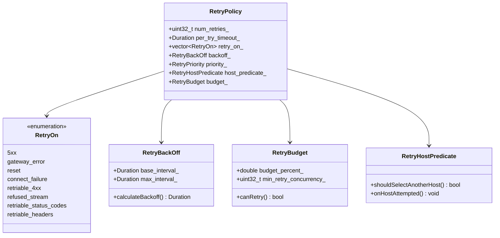

## Retry Conditions

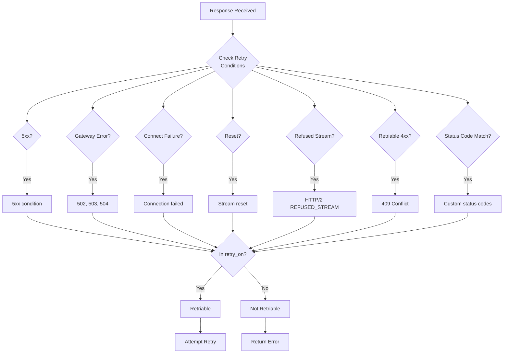

## Retry Backoff Algorithm

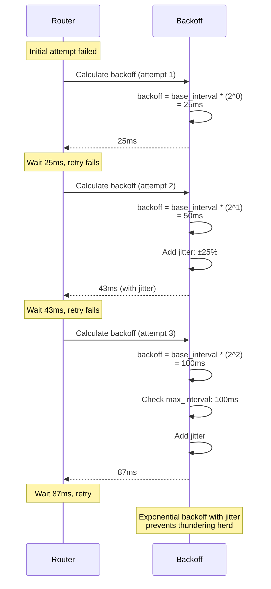

## Retry Budget Mechanism

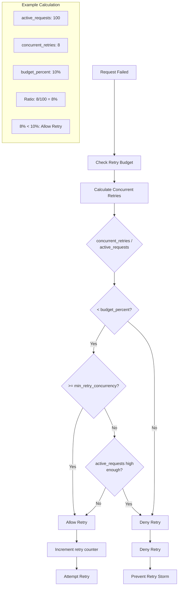

## Host Selection for Retry

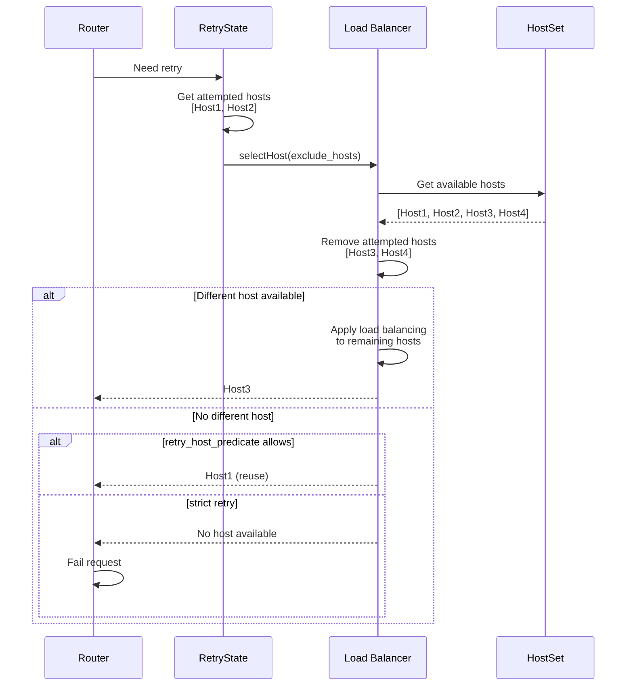

## Circuit Breaker Architecture

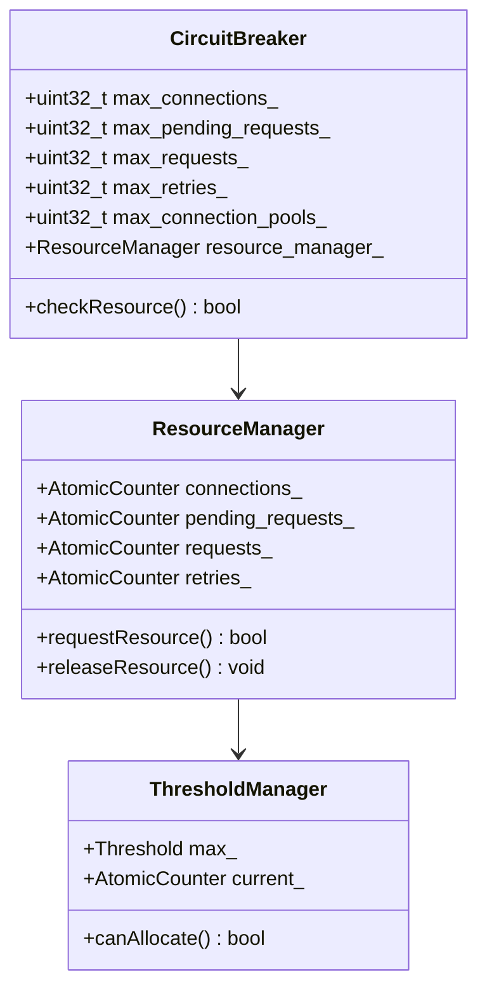

## Circuit Breaker Decision Flow

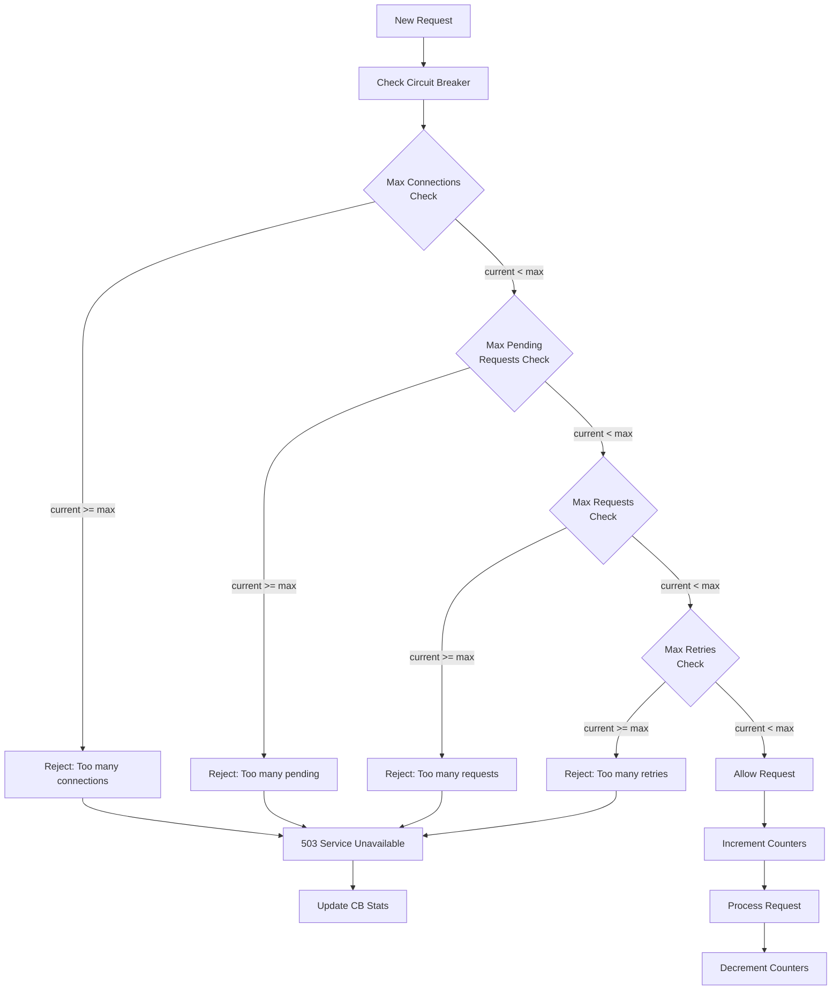

## Circuit Breaker State Tracking

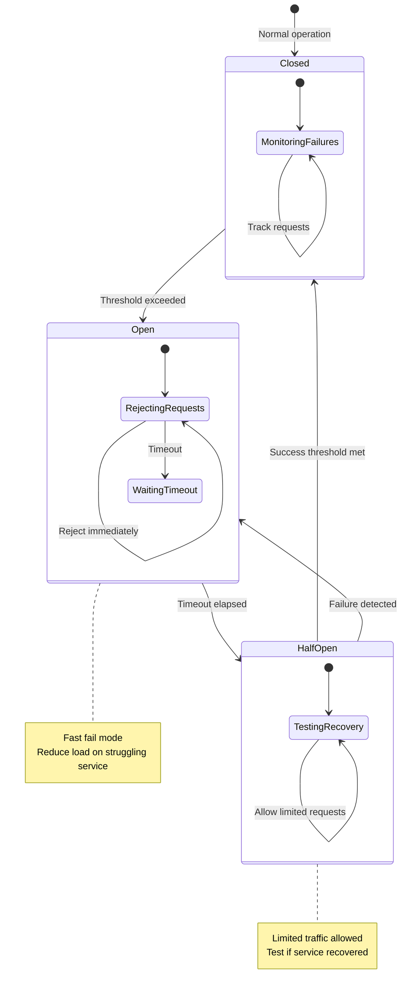

## Per-Try Timeout vs Global Timeout

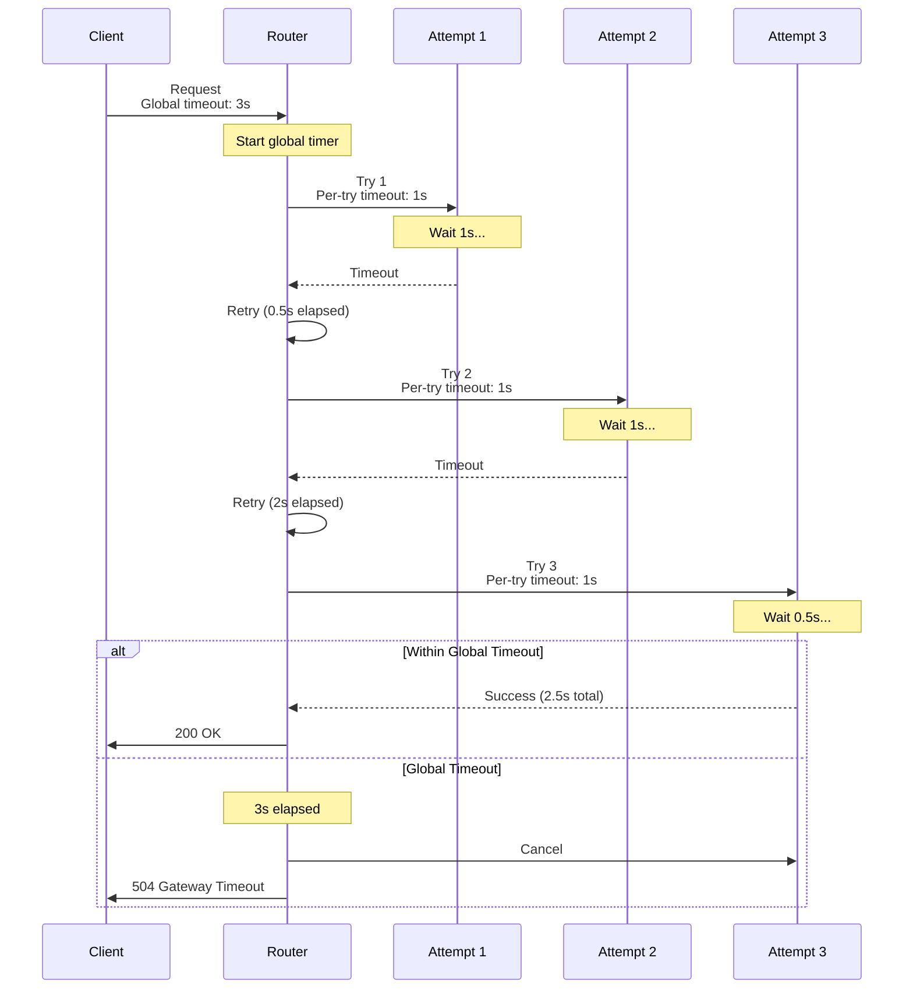

## Hedged Requests (Parallel Retries)

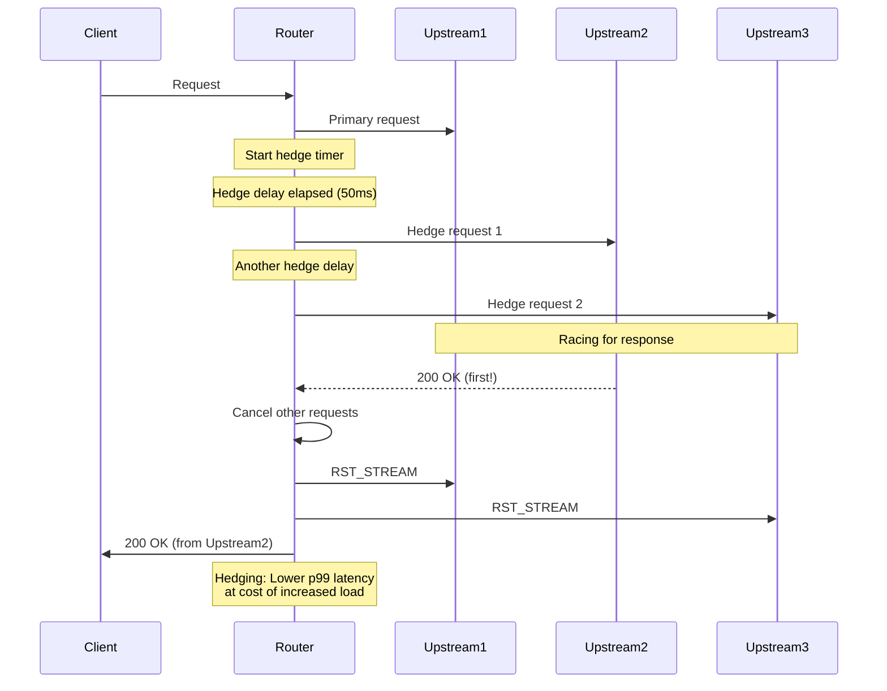

## Retry Plugin Architecture

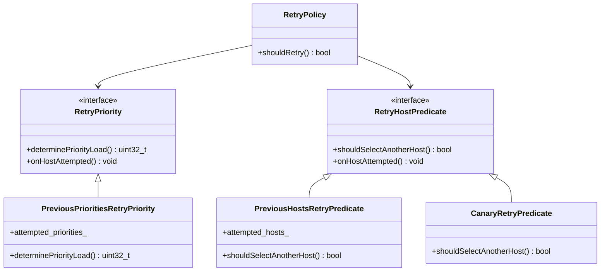

## Retry Configuration Examples

### Basic Retry

```yaml
route_config:
  virtual_hosts:
    - name: backend
      domains: ["*"]
      routes:
        - match: { prefix: "/" }
          route:
            cluster: backend
            retry_policy:
              retry_on: "5xx,reset,connect-failure"
              num_retries: 3
              per_try_timeout: 2s
```

### Advanced Retry with Backoff

```yaml
retry_policy:
  retry_on: "5xx,gateway-error,reset,connect-failure,refused-stream"
  num_retries: 5
  per_try_timeout: 1s
  retry_back_off:
    base_interval: 0.1s
    max_interval: 1s
  retry_host_predicate:
    - name: envoy.retry_host_predicates.previous_hosts
      typed_config:
        "@type": type.googleapis.com/envoy.extensions.retry.host.previous_hosts.v3.PreviousHostsPredicate
  host_selection_retry_max_attempts: 5
```

### Retry Budget

```yaml
retry_policy:
  num_retries: 3
  retry_on: "5xx"
  retry_budget:
    budget_percent: 20.0       # Max 20% of requests can be retries
    min_retry_concurrency: 5   # Always allow at least 5 concurrent retries
```

### Hedged Request

```yaml
route:
  cluster: backend
  hedge_policy:
    initial_requests: 1
    additional_request_chance:
      numerator: 50
      denominator: HUNDRED
    hedge_on_per_try_timeout: true
```

## Circuit Breaker Configuration

```yaml
clusters:
  - name: backend
    type: STRICT_DNS
    lb_policy: ROUND_ROBIN
    circuit_breakers:
      thresholds:
        - priority: DEFAULT
          max_connections: 1000
          max_pending_requests: 1000
          max_requests: 1000
          max_retries: 3
          track_remaining: true
        - priority: HIGH
          max_connections: 2000
          max_pending_requests: 2000
          max_requests: 2000
          max_retries: 5
```

## Statistics

```yaml
# Retry stats
cluster.backend.upstream_rq_retry                  # Total retries
cluster.backend.upstream_rq_retry_success          # Successful retries
cluster.backend.upstream_rq_retry_overflow         # Retries denied by budget

# Circuit breaker stats
cluster.backend.circuit_breakers.default.cx_open           # Connections open
cluster.backend.circuit_breakers.default.cx_pool_full      # Connection pool full
cluster.backend.circuit_breakers.default.rq_pending_open   # Pending requests
cluster.backend.circuit_breakers.default.rq_open           # Active requests
cluster.backend.circuit_breakers.default.rq_retry_open     # Active retries
cluster.backend.circuit_breakers.default.remaining_cx      # Remaining connection slots
cluster.backend.circuit_breakers.default.remaining_rq      # Remaining request slots
```

## Retry vs Circuit Breaker Decision Tree

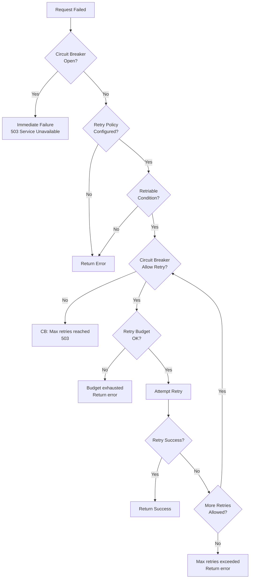

## Best Practices

### Retry Configuration
1. **Set reasonable num_retries**: Typically 2-3
2. **Configure per_try_timeout**: Should be less than global timeout
3. **Use retry budgets**: Prevent retry storms (20% is typical)
4. **Enable backoff**: Exponential backoff with jitter
5. **Match failure types**: Only retry on retriable errors

### Circuit Breaker Settings
1. **Set realistic limits**: Based on service capacity
2. **Monitor metrics**: Track CB openings
3. **Test under load**: Verify CB triggers appropriately
4. **Use priority levels**: Different limits for different traffic
5. **Enable tracking**: Use `track_remaining: true`

### Combined Strategy
1. **Circuit breakers first**: Prevent overwhelming services
2. **Retry after CB check**: Only if CB allows
3. **Budget limits**: Prevent retry amplification
4. **Monitor both**: Track retry and CB stats
5. **Test failure scenarios**: Verify resilience

## Key Takeaways

### Retry Mechanism
- **Automatic retry** on retriable failures
- **Exponential backoff** with jitter
- **Retry budgets** prevent storms
- **Host selection** avoids bad hosts
- **Per-try timeouts** bound attempt duration

### Circuit Breaking
- **Resource limits** protect services
- **Fast fail** when limits reached
- **Multiple thresholds** for different resources
- **Priority-based** limits
- **Metrics tracking** for observability

### Resilience Pattern
1. **Circuit breaker** prevents overload
2. **Retry logic** handles transient failures
3. **Timeouts** bound waiting time
4. **Budgets** prevent amplification
5. **Health checks** detect problems early

## Related Flows
- [Cluster Management](03_cluster_load_balancing.md)
- [HTTP Request Flow](02_http_request_flow.md)
- [Health Checking](08_health_checking.md)
- [Upstream Connection Management](06_upstream_connection_management.md)
