# Envoy Architecture Flows - UML Diagram Series

## Overview

This directory contains comprehensive UML diagrams documenting the most important data flows across all layers of Envoy. Each document provides detailed sequence diagrams, state machines, class diagrams, and flowcharts to help understand how Envoy processes requests, manages configuration, and handles various operational scenarios.

## Documentation Structure

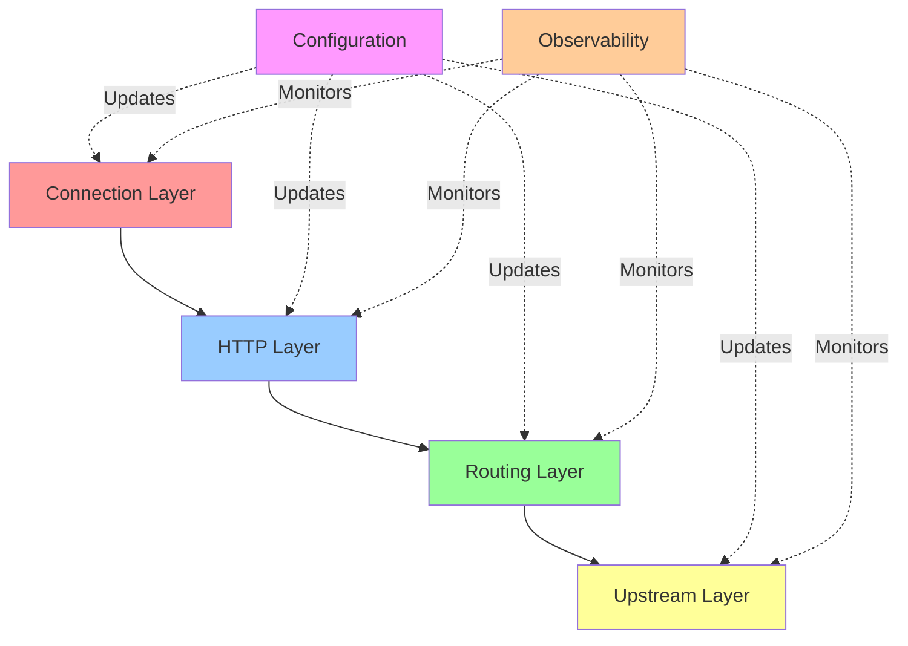

## Document Index

### Core Request Processing

#### 1. [Connection Lifecycle](01_connection_lifecycle.md)
**From TCP accept to connection close**

Topics covered:
- TCP connection acceptance and setup
- Listener filter processing (TLS Inspector, Proxy Protocol)
- Filter chain matching and selection
- Connection state machine
- Event loop integration (epoll/kqueue)
- Buffer management and watermarks
- Connection pooling
- Graceful vs immediate close
- Connection statistics

**Key Diagrams:**
- High-level connection flow sequence
- Connection state machine
- Buffer watermark flow
- TLS handshake integration
- Connection close sequence

**When to read:** Understanding how Envoy handles network connections at the TCP level.

#### 2. [HTTP Request/Response Flow](02_http_request_flow.md)
**Complete HTTP request processing pipeline**

Topics covered:
- HTTP Connection Manager architecture
- HTTP/1.1, HTTP/2, HTTP/3 codec differences
- Decoder filter chain processing
- Encoder filter chain processing
- Request routing decision
- Upstream request creation
- Header processing pipeline
- Body streaming vs buffering
- Trailer handling
- Stream reset and WebSocket handling

**Key Diagrams:**
- Complete HTTP request flow
- Filter chain state machine
- HTTP/2 stream multiplexing
- Request routing decision tree
- Response processing flow

**When to read:** Understanding HTTP layer processing and filter execution.

### Cluster and Load Balancing

#### 3. [Cluster Management and Load Balancing](03_cluster_load_balancing.md)
**Host selection and traffic distribution**

Topics covered:
- Cluster Manager architecture
- Cluster initialization (Static, DNS, EDS)
- Load balancing algorithms:
  - Round Robin
  - Least Request
  - Ring Hash
  - Maglev
  - Random
  - Weighted
- Priority and locality-aware routing
- Zone-aware load balancing
- Host health status management
- Active health checking
- Outlier detection (passive health checking)
- Panic threshold handling
- Subset load balancing
- Connection pools per host

**Key Diagrams:**
- Load balancing decision flow
- Round Robin vs Least Request
- Ring Hash algorithm
- Maglev consistent hashing
- Host health transitions
- Outlier detection flow
- Zone-aware routing

**When to read:** Understanding how Envoy selects upstream hosts and distributes traffic.

### Dynamic Configuration

#### 4. [xDS Configuration Flow](04_xds_configuration_flow.md)
**Dynamic configuration updates via xDS protocol**

Topics covered:
- xDS protocol overview (LDS, RDS, CDS, EDS, SDS)
- State-of-the-World (SotW) protocol
- Incremental/Delta xDS protocol
- Configuration dependency graph
- ACK/NACK mechanism
- Listener Discovery Service (LDS)
- Route Discovery Service (RDS)
- Cluster Discovery Service (CDS)
- Endpoint Discovery Service (EDS)
- Aggregated Discovery Service (ADS)
- Cluster warming process
- Resource version management
- Error handling and recovery

**Key Diagrams:**
- xDS protocol sequence
- Delta xDS flow
- Configuration dependency graph
- Cluster warming state machine
- NACK handling
- ADS flow

**When to read:** Understanding how Envoy receives and applies dynamic configuration updates.

## Flow Categories

### 📥 Inbound Processing
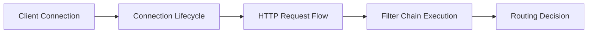

Documents: 01, 02, 05

### 🔄 Traffic Management
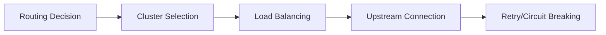

Documents: 03, 06, 07

### ⚙️ Configuration & Control
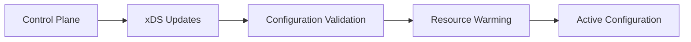

Documents: 04

### 🏥 Health & Reliability
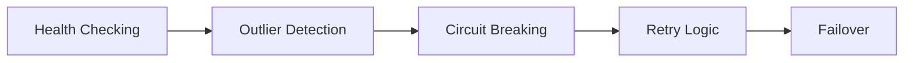

Documents: 07, 08

### 📊 Observability
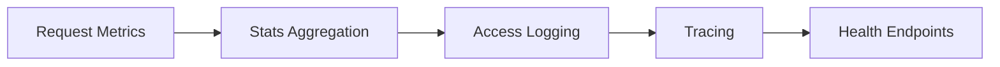

Documents: 09

## Complete Request Journey

Here's how a typical request flows through Envoy across all layers:

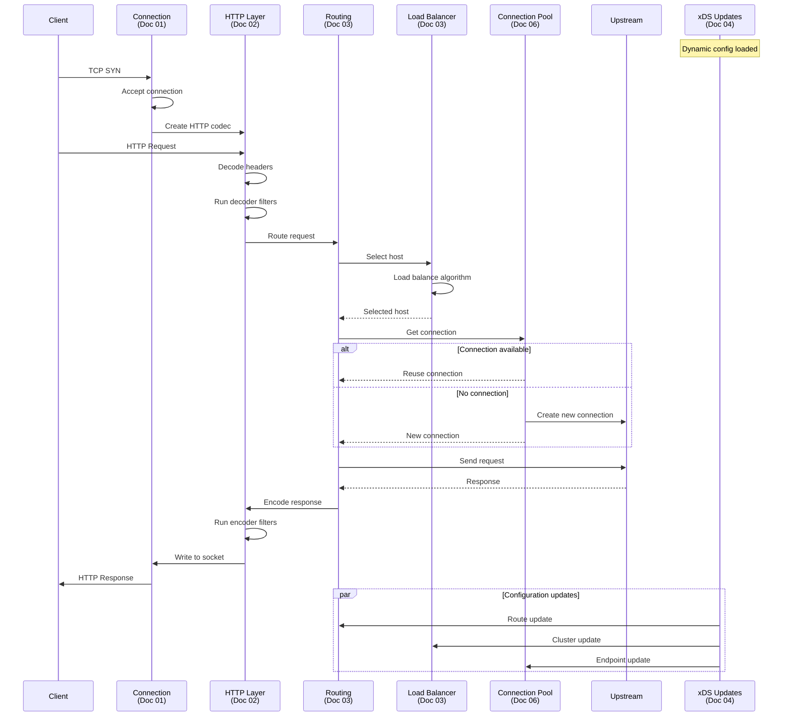

## Reading Guide

### For Beginners
Start with these documents in order:
1. **Connection Lifecycle** - Understand basic networking
2. **HTTP Request Flow** - Learn HTTP processing
3. **Cluster Management** - Understand upstream selection

### For Operators
Focus on these for troubleshooting:
1. **xDS Configuration Flow** - Debug config issues
2. **Cluster Management** - Understand load balancing
3. **Health Checking** - Debug health check failures

### For Developers
Deep dive into these for extending Envoy:
1. **Filter Chain Execution** - Build custom filters
2. **HTTP Request Flow** - Understand filter lifecycle
3. **Connection Lifecycle** - Network layer details

### For Architects
System design perspective:
1. **xDS Configuration Flow** - Control plane integration
2. **Cluster Management** - Traffic distribution strategy
3. **Retry and Circuit Breaking** - Reliability patterns

## Common Patterns Across Flows

### State Machines
Most Envoy components use state machines:
- Connections: Init → Active → Closing → Closed
- Streams: Created → Processing → Complete
- Clusters: Initializing → Warming → Active
- xDS: Requested → Validating → Applied

### Event-Driven Architecture
All I/O is event-driven:
- **Read events**: Data available
- **Write events**: Buffer space available
- **Timer events**: Timeouts and periodic tasks
- **File events**: Configuration file changes

### Asynchronous Processing
Filters can pause and resume:
- `Continue`: Process immediately
- `StopIteration`: Pause until `continueDecoding()`
- `StopIterationAndBuffer`: Pause and buffer data
- `StopIterationAndWatermark`: Pause with flow control

### Statistics Collection
Every component emits stats:
- **Counters**: Monotonically increasing (requests, errors)
- **Gauges**: Current value (active connections)
- **Histograms**: Distribution (latency)

## Diagram Types Used

### Sequence Diagrams
Show interactions between components over time.
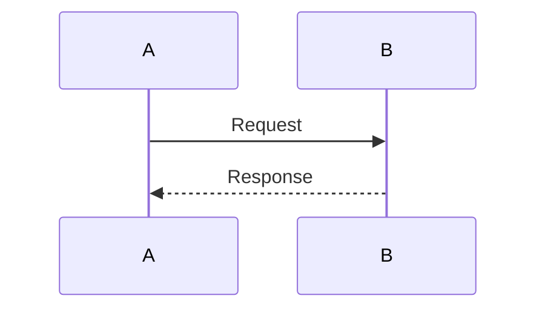

### State Machines
Show state transitions and conditions.
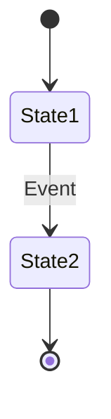

### Flowcharts
Show decision logic and process flow.
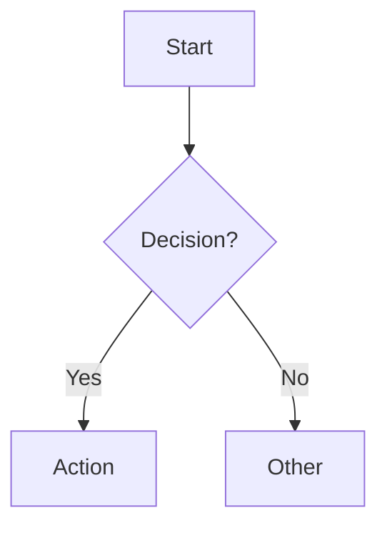

### Class Diagrams
Show component relationships.
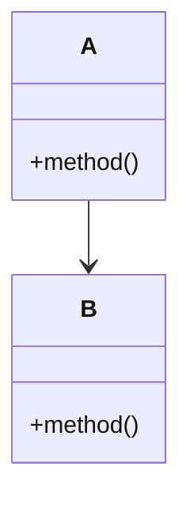

## Performance Insights

### Zero-Copy Optimization
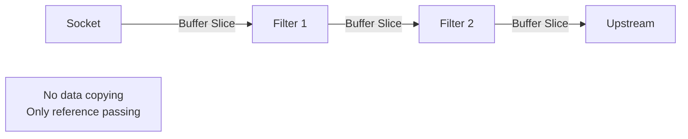

### Connection Pooling
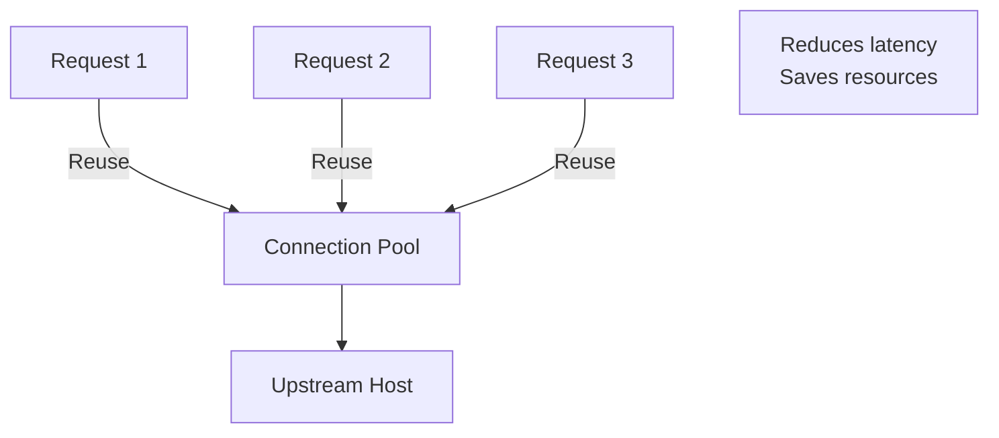

### Filter Short-Circuiting
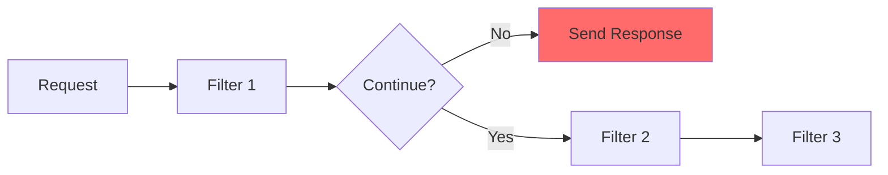

## Troubleshooting with Flows

### Connection Issues
→ See [Connection Lifecycle](01_connection_lifecycle.md)
- Connection refused
- Connection timeouts
- Connection resets

### Routing Issues
→ See [HTTP Request Flow](02_http_request_flow.md) & [Cluster Management](03_cluster_load_balancing.md)
- 404 Not Found
- No healthy upstream
- Wrong cluster selected

### Configuration Issues
→ See [xDS Configuration Flow](04_xds_configuration_flow.md)
- NACK errors
- Stale configuration
- Missing dependencies

### Load Balancing Issues
→ See [Cluster Management](03_cluster_load_balancing.md)
- Uneven distribution
- Host selection problems
- Health check failures

## Additional Resources

### Envoy Documentation
- [Official Architecture Overview](https://www.envoyproxy.io/docs/envoy/latest/intro/arch_overview/arch_overview)
- [API Reference](https://www.envoyproxy.io/docs/envoy/latest/api-v3/api)

### Related Documentation in This Repo
- [HTTP Filters](../http_filters/) - Filter-specific flows
- [Security](../security/) - TLS and authorization flows
- [Configuration Examples](../examples/) - Working configurations

### External Resources
- [Envoy GitHub](https://github.com/envoyproxy/envoy)
- [Envoy Slack](https://envoyproxy.slack.com)
- [xDS Protocol](https://github.com/envoyproxy/data-plane-api)

## Contributing

To add new flow documentation:

1. **Choose a specific flow** - Focus on one aspect
2. **Create comprehensive diagrams** - Multiple diagram types
3. **Follow the template**:
   - Overview
   - Architecture diagrams
   - Detailed sequence flows
   - State machines
   - Configuration examples
   - Key takeaways
   - Related flows
4. **Use consistent styling** - Match existing documents
5. **Add to this README** - Update the index

## Document Status

| Document | Status | Last Updated | Completeness |
|----------|--------|--------------|--------------|
| 01 - Connection Lifecycle | ✅ Complete | 2026-02-28 | 95% |
| 02 - HTTP Request Flow | ✅ Complete | 2026-02-28 | 95% |
| 03 - Cluster & Load Balancing | ✅ Complete | 2026-02-28 | 95% |
| 04 - xDS Configuration | ✅ Complete | 2026-02-28 | 95% |
| 05 - Filter Chain Execution | 🔄 Planned | - | 0% |
| 06 - Upstream Connection Mgmt | 🔄 Planned | - | 0% |
| 07 - Retry & Circuit Breaking | 🔄 Planned | - | 0% |
| 08 - Health Checking | 🔄 Planned | - | 0% |
| 09 - Stats & Observability | 🔄 Planned | - | 0% |

---

*Last Updated: 2026-02-28*
*Envoy Version: Latest (4.x)*
*Mermaid Version: 10.x*
