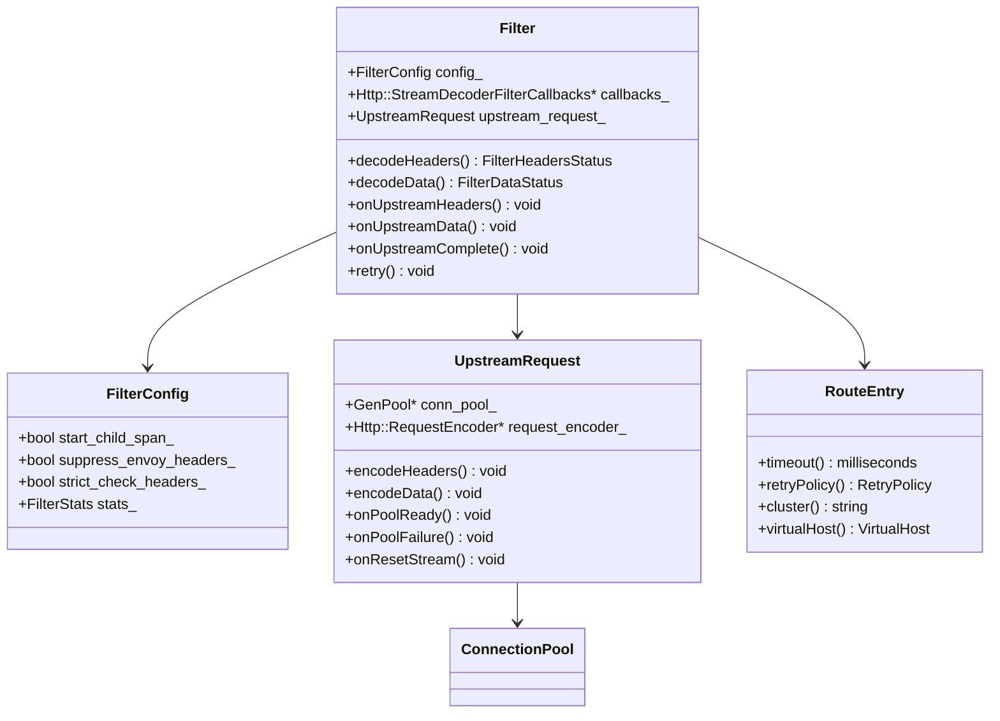
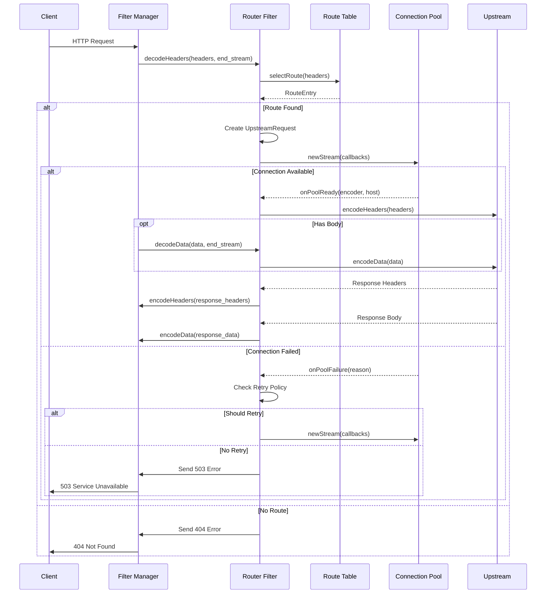
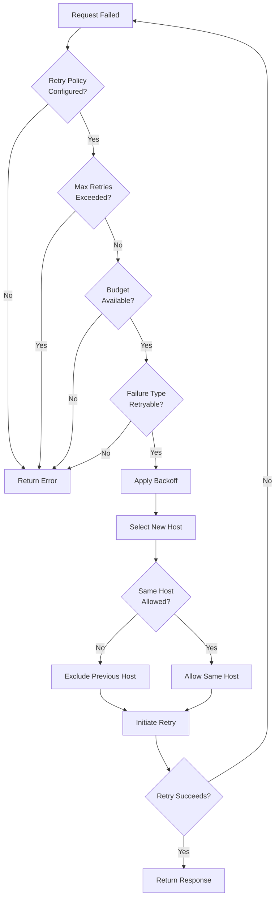
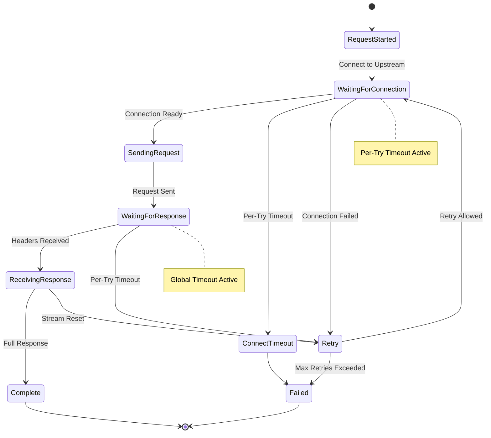
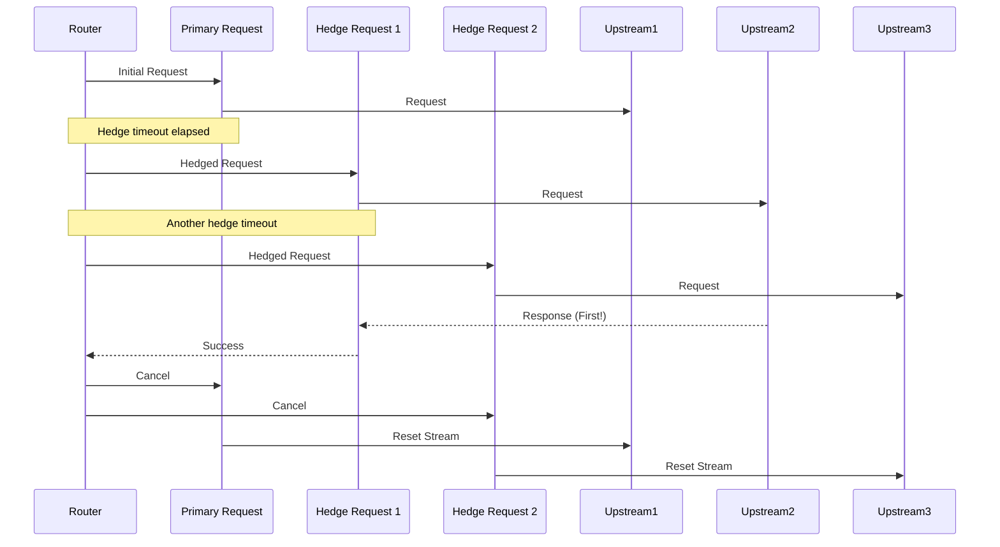
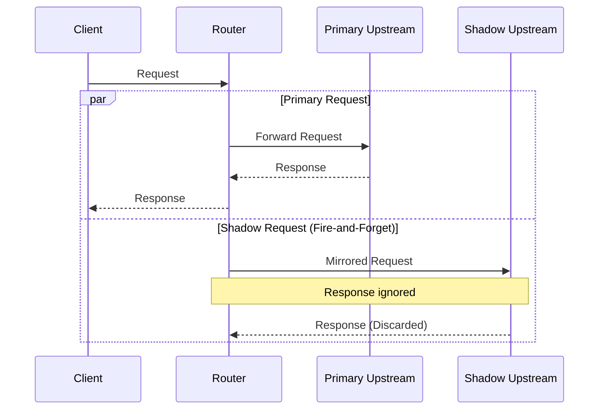
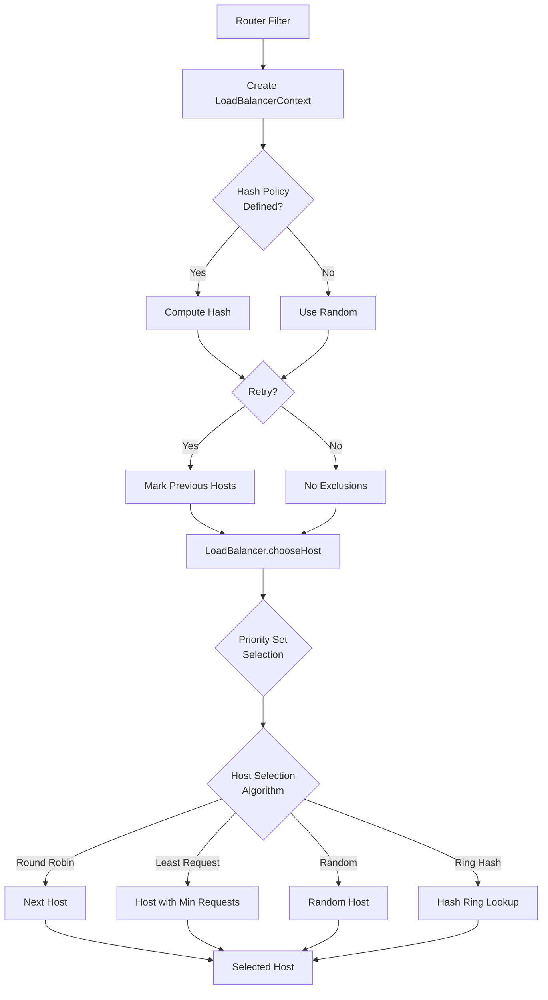

# Router Filter

## Overview

The Router filter is the most critical HTTP filter in Envoy. It is responsible for routing requests to upstream clusters based on route configuration. This filter must be the last filter in the HTTP filter chain and performs the actual proxying of the request to the selected upstream host.

## Key Responsibilities

- Route selection based on request headers and path
- Upstream cluster selection
- Load balancing across upstream hosts
- Retry logic and timeout management
- Request shadowing (traffic mirroring)
- Connection pooling
- Upstream protocol selection (HTTP/1.1, HTTP/2, HTTP/3)

## Architecture



## Request Flow



## Retry Logic Flow



## Timeout Management



## Hedging (Parallel Requests)



## Shadow/Mirroring Flow



## Load Balancing Context



## Configuration Example

```yaml
name: envoy.filters.http.router
typed_config:
  "@type": type.googleapis.com/envoy.extensions.filters.http.router.v3.Router
  dynamic_stats: true
  start_child_span: true
  upstream_log:
    - name: envoy.access_loggers.file
      typed_config:
        "@type": type.googleapis.com/envoy.extensions.access_loggers.file.v3.FileAccessLog
        path: /var/log/envoy/upstream.log
  suppress_envoy_headers: false
  strict_check_headers:
    - x-envoy-retry-on
    - x-envoy-max-retries
```

## Key Features

### 1. Connection Pooling
- Reuses connections to upstream hosts
- Configurable per-cluster
- Supports HTTP/1.1, HTTP/2, and HTTP/3

### 2. Retry Logic
- Configurable retry policies (5xx, gateway-error, reset, etc.)
- Exponential backoff
- Retry budgets to prevent retry storms
- Host selection during retries

### 3. Timeout Management
- Global request timeout
- Per-try timeout (for each retry attempt)
- Idle timeout
- Connect timeout

### 4. Request Hedging
- Send parallel requests to multiple hosts
- Use first successful response
- Cancel remaining requests

### 5. Traffic Shadowing
- Mirror requests to shadow cluster
- Fire-and-forget (responses ignored)
- Percentage-based sampling

### 6. Stats and Observability
- Per-cluster stats
- Per-upstream stats
- Latency histograms
- Retry counters

## Statistics

The router filter emits extensive statistics:

| Stat | Type | Description |
|------|------|-------------|
| upstream_rq_total | Counter | Total requests |
| upstream_rq_2xx | Counter | 2xx responses |
| upstream_rq_5xx | Counter | 5xx responses |
| upstream_rq_time | Histogram | Request latency |
| upstream_rq_retry | Counter | Retry attempts |
| upstream_rq_retry_success | Counter | Successful retries |
| upstream_cx_total | Counter | Total connections |
| upstream_cx_active | Gauge | Active connections |

## Common Use Cases

### 1. Basic Routing
Route requests to different clusters based on path or headers.

### 2. Canary Deployments
Route a percentage of traffic to a new version using weighted clusters.

### 3. Circuit Breaking
Automatically stop sending traffic to unhealthy hosts.

### 4. A/B Testing
Route traffic based on user attributes or cookies.

### 5. Traffic Mirroring
Test new services with production traffic without affecting users.

## Best Practices

1. **Always place router filter last** - It terminates the filter chain
2. **Configure appropriate timeouts** - Prevent cascading failures
3. **Use retry budgets** - Avoid retry storms
4. **Enable connection pooling** - Reduce latency and resource usage
5. **Monitor router stats** - Track success rates and latencies
6. **Use hedging carefully** - Can increase upstream load
7. **Configure circuit breakers** - Protect upstream services

## Related Filters

- **ext_authz**: Authentication/authorization before routing
- **ratelimit**: Rate limiting before routing
- **fault**: Inject faults for testing
- **buffer**: Buffer entire request before routing

## References

- [Envoy Router Filter Documentation](https://www.envoyproxy.io/docs/envoy/latest/configuration/http/http_filters/router_filter)
- [Route Configuration](https://www.envoyproxy.io/docs/envoy/latest/api-v3/config/route/v3/route_components.proto)
