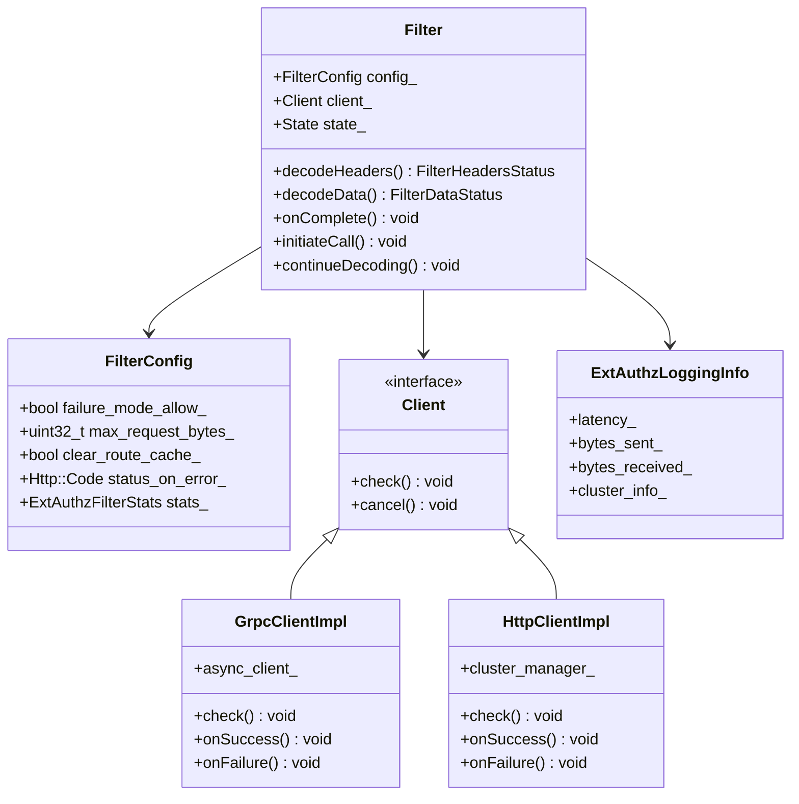
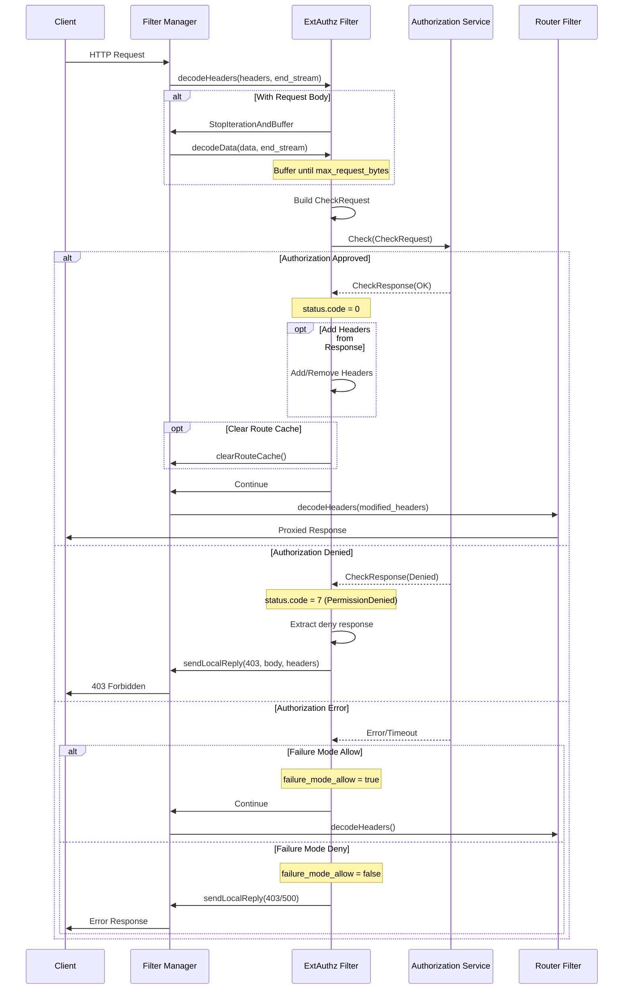
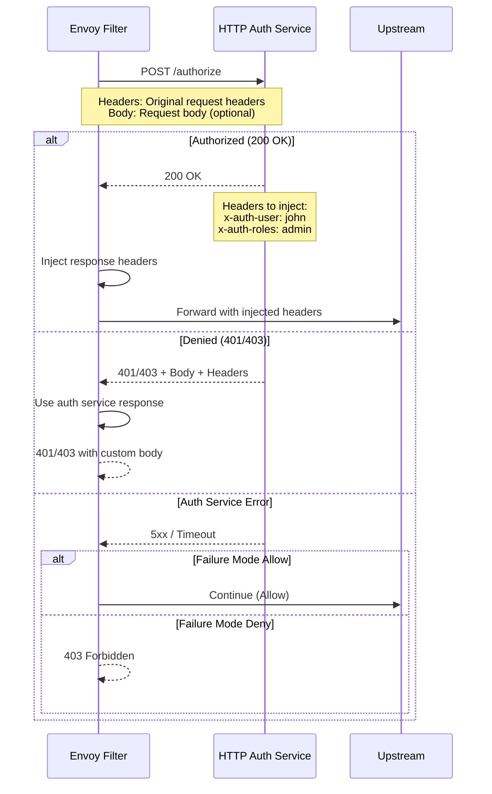
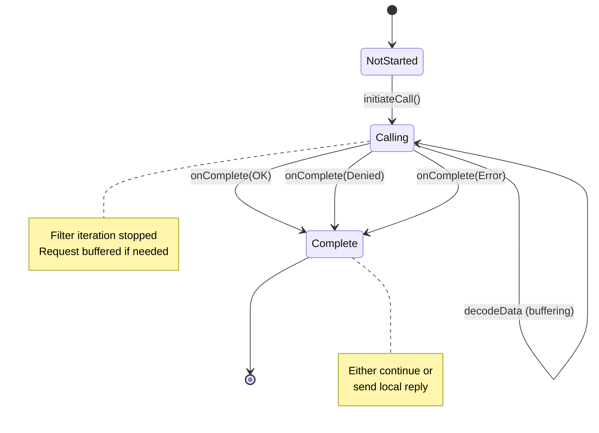
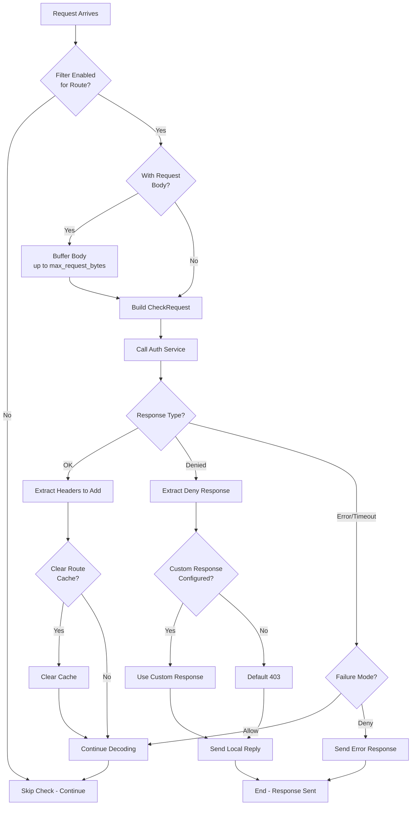
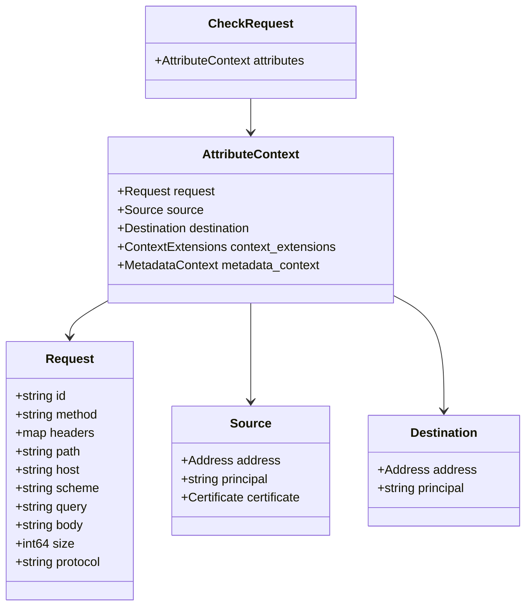
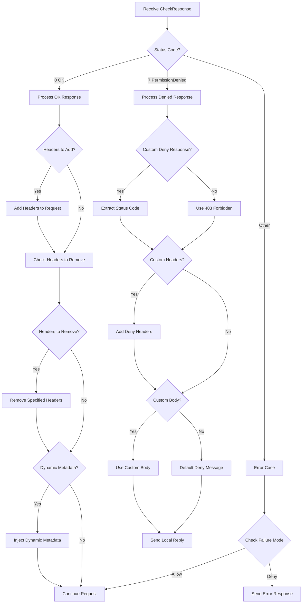
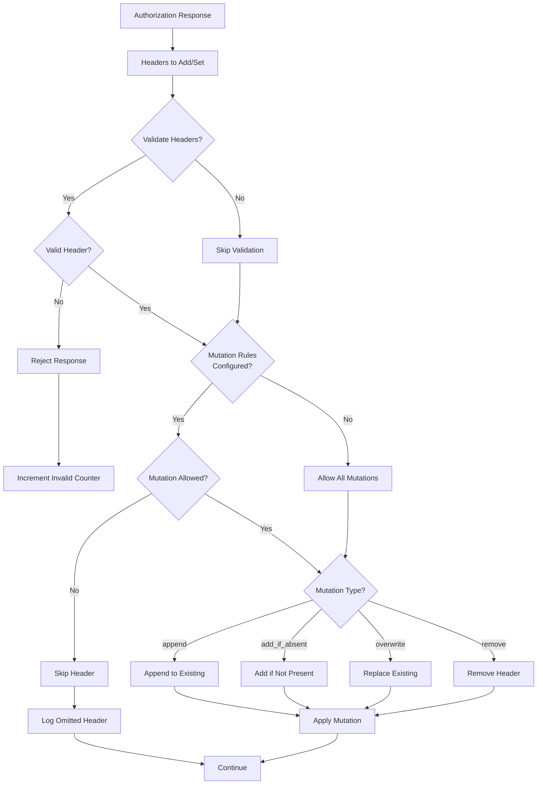
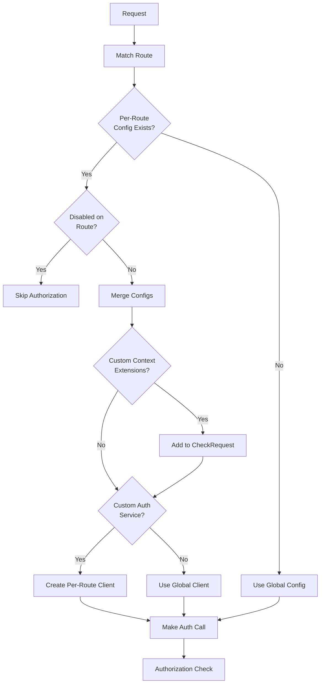

# External Authorization (ext_authz) Filter

## Overview

The External Authorization (ext_authz) filter calls an external authorization service to check whether incoming requests are authorized. This filter enables centralized authentication and authorization decisions by delegating to an external service via gRPC or HTTP.

## Key Responsibilities

- Call external authorization service for each request
- Support both gRPC and HTTP protocols
- Handle synchronous and asynchronous authorization
- Inject headers from authorization response
- Support per-route configuration
- Implement failure modes (allow/deny)
- Request body buffering for authorization

## Architecture



## Request Flow - gRPC Authorization



## Request Flow - HTTP Authorization



## State Machine



## Authorization Decision Flow



## CheckRequest Structure (gRPC)



## CheckResponse Processing



## Header Mutation Rules



## Per-Route Configuration



## Configuration Example - gRPC

```yaml
name: envoy.filters.http.ext_authz
typed_config:
  "@type": type.googleapis.com/envoy.extensions.filters.http.ext_authz.v3.ExtAuthz
  grpc_service:
    envoy_grpc:
      cluster_name: ext_authz_cluster
    timeout: 0.5s
  failure_mode_allow: false
  with_request_body:
    max_request_bytes: 8192
    allow_partial_message: true
  clear_route_cache: true
  status_on_error:
    code: 403
  metadata_context_namespaces:
    - envoy.filters.http.jwt_authn
  filter_enabled:
    runtime_key: ext_authz.enabled
    default_value:
      numerator: 100
      denominator: HUNDRED
```

## Configuration Example - HTTP

```yaml
name: envoy.filters.http.ext_authz
typed_config:
  "@type": type.googleapis.com/envoy.extensions.filters.http.ext_authz.v3.ExtAuthz
  http_service:
    server_uri:
      uri: "http://auth-service:9191"
      cluster: ext_authz_cluster
      timeout: 0.5s
    authorization_request:
      allowed_headers:
        patterns:
          - exact: "authorization"
          - prefix: "x-"
      headers_to_add:
        - key: "x-envoy-auth"
          value: "true"
    authorization_response:
      allowed_upstream_headers:
        patterns:
          - exact: "x-user-id"
          - prefix: "x-auth-"
  failure_mode_allow: false
```

## Key Features

### 1. Protocol Support
- **gRPC**: Full-featured, bi-directional streaming support
- **HTTP**: RESTful authorization endpoint

### 2. Request Body Buffering
- Buffer request body before authorization
- Configurable maximum size
- Allow partial messages

### 3. Failure Modes
- **Failure Mode Allow**: Continue on auth service failure
- **Failure Mode Deny**: Block on auth service failure

### 4. Header Manipulation
- Add headers from auth response
- Remove specified headers
- Mutation rules validation

### 5. Per-Route Configuration
- Override auth service per route
- Custom context extensions
- Disable authorization on specific routes

### 6. Dynamic Metadata
- Inject metadata from auth response
- Available to downstream filters

## Statistics

| Stat | Type | Description |
|------|------|-------------|
| ext_authz.ok | Counter | Successful authorizations |
| ext_authz.denied | Counter | Denied authorizations |
| ext_authz.error | Counter | Authorization service errors |
| ext_authz.disabled | Counter | Checks skipped (disabled) |
| ext_authz.failure_mode_allowed | Counter | Allowed due to failure mode |

## Common Use Cases

### 1. JWT Validation
Validate JWT tokens with external service

### 2. API Key Authentication
Check API keys against central database

### 3. OAuth2 Token Validation
Validate OAuth2 access tokens

### 4. Role-Based Access Control
External RBAC policy engine

### 5. Request Logging/Auditing
Log all requests to external service

### 6. Content-Based Authorization
Authorize based on request body content

## Best Practices

1. **Set appropriate timeouts** - Balance security and latency
2. **Use failure_mode_allow carefully** - Understand security implications
3. **Limit request body size** - Prevent memory exhaustion
4. **Enable caching** - Reduce auth service load (if stateless)
5. **Monitor auth service performance** - Critical path dependency
6. **Use per-route config** - Disable for public endpoints
7. **Implement retry logic** - In auth service for transient failures
8. **Use connection pooling** - Reuse connections to auth service

## Security Considerations

1. **TLS/mTLS**: Always use encrypted transport to auth service
2. **Timeout handling**: Set reasonable timeouts to prevent DoS
3. **Failure mode**: Carefully choose failure_mode_allow vs deny
4. **Header validation**: Validate headers from auth response
5. **Request body**: Be cautious with max_request_bytes

## Related Filters

- **jwt_authn**: JWT validation (alternative to ext_authz)
- **rbac**: Local RBAC enforcement
- **oauth2**: OAuth2 flow handling

## References

- [Envoy ext_authz Documentation](https://www.envoyproxy.io/docs/envoy/latest/configuration/http/http_filters/ext_authz_filter)
- [External Authorization API](https://www.envoyproxy.io/docs/envoy/latest/api-v3/service/auth/v3/external_auth.proto)
