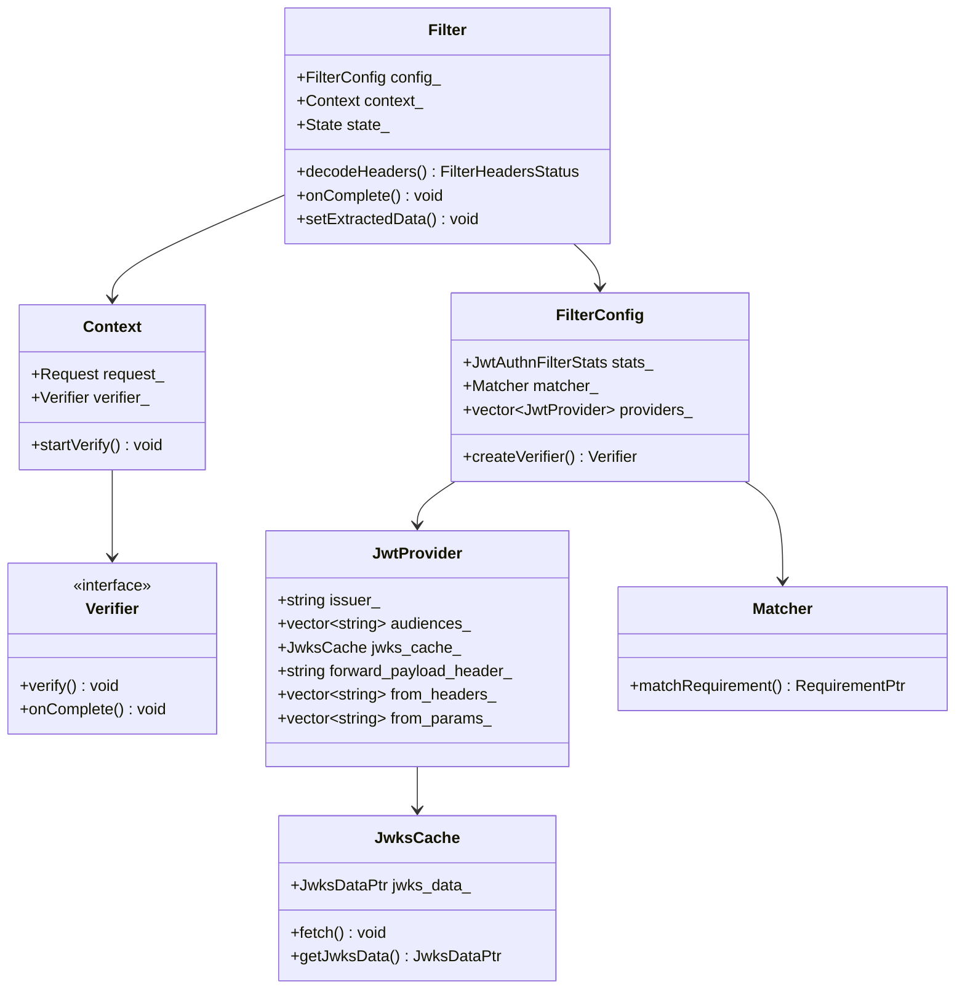
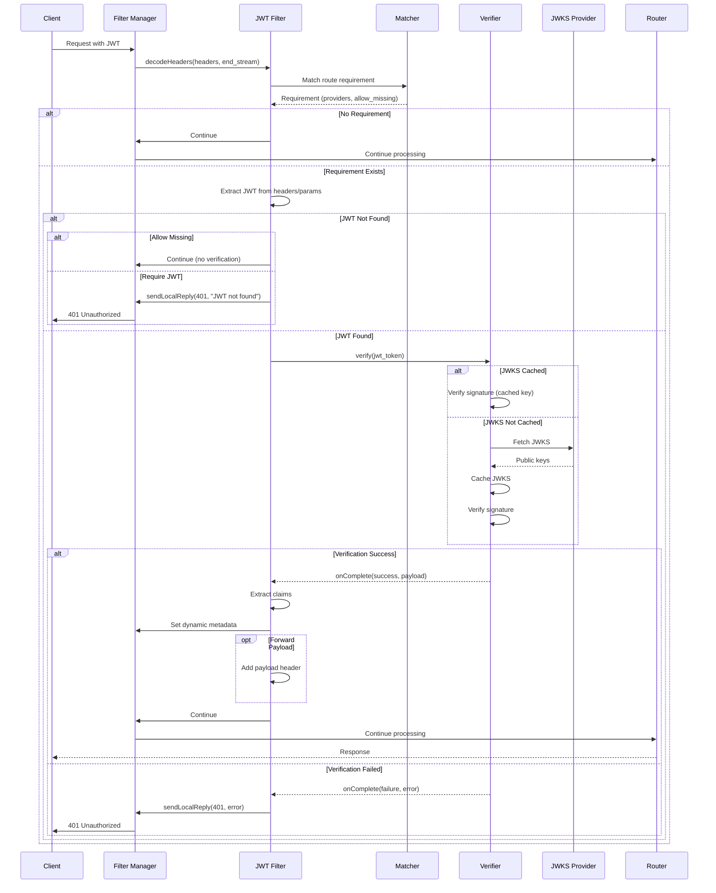
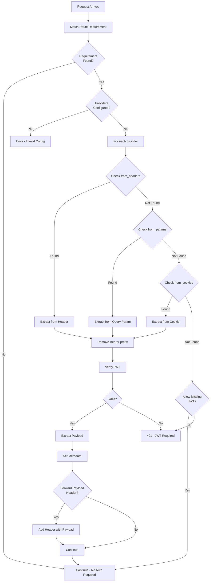
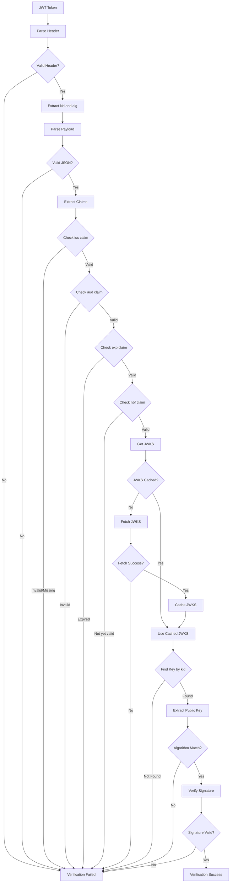
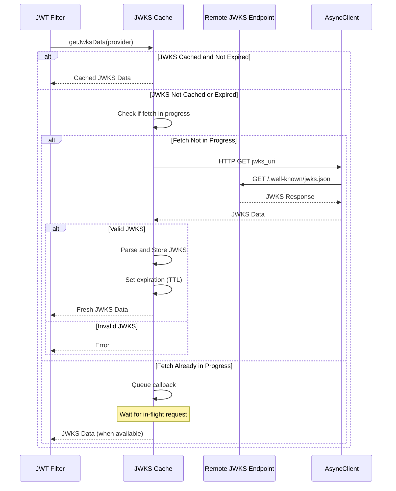
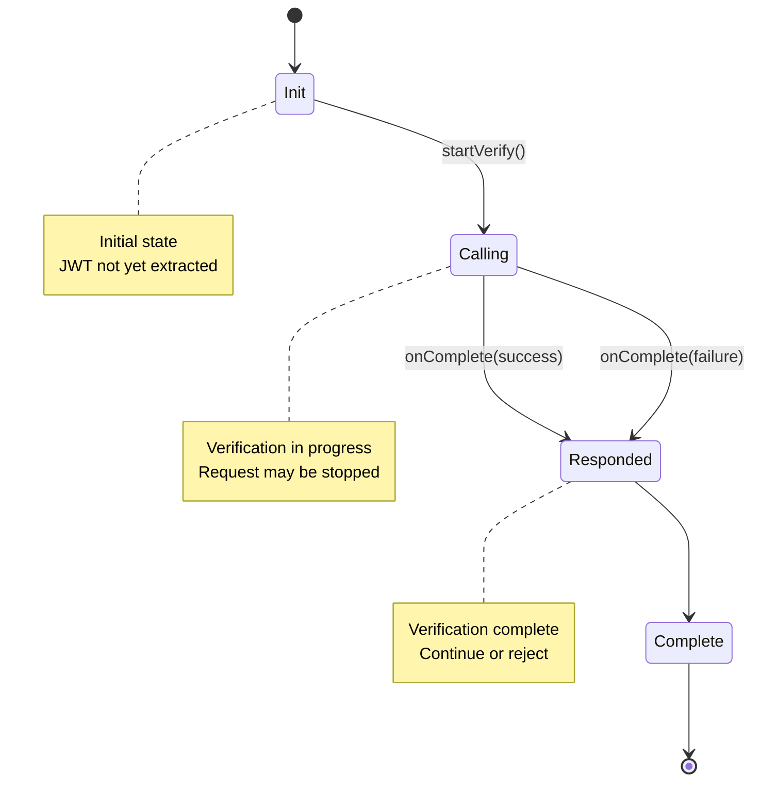
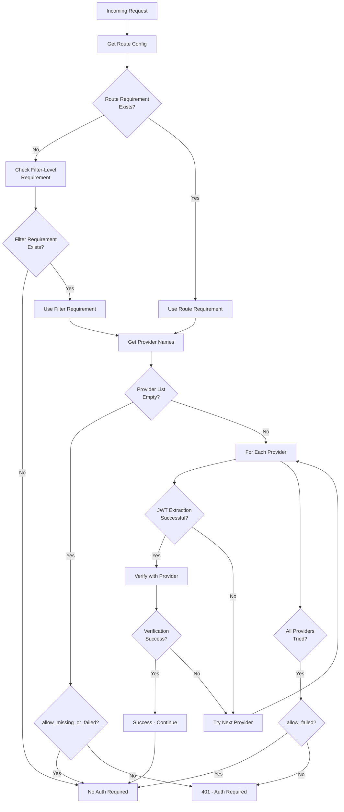
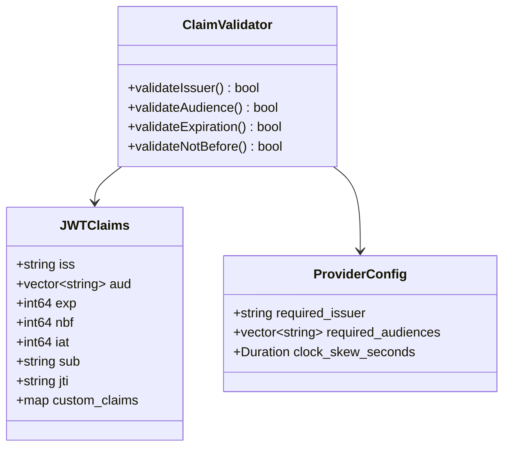
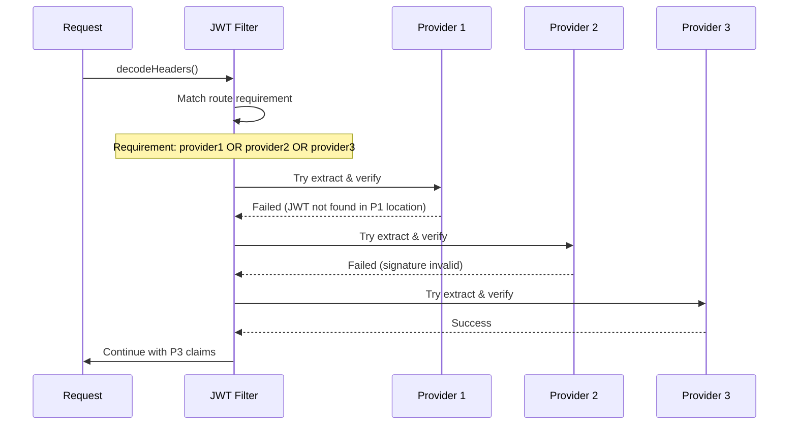
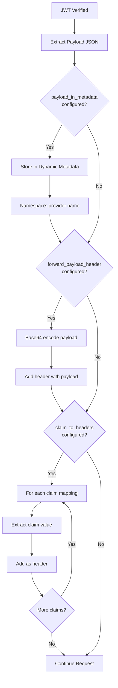

# JWT Authentication Filter

## Overview

The JWT Authentication (jwt_authn) filter validates JSON Web Tokens (JWT) in HTTP requests. It verifies the token signature, validates claims, and extracts payload data. This filter integrates with JSON Web Key Sets (JWKS) for public key management and supports multiple JWT providers.

## Key Responsibilities

- Extract JWTs from headers, query parameters, or cookies
- Verify JWT signatures using JWKS
- Validate JWT claims (issuer, audience, expiration)
- Extract and inject JWT payload as metadata
- Support multiple JWT providers
- Cache JWKS for performance
- Handle JWT refresh flows

## Architecture



## Request Flow



## JWT Extraction Flow



## JWT Verification Process



## JWKS Fetching and Caching



## State Machine



## Provider Matching



## Configuration Example

```yaml
name: envoy.filters.http.jwt_authn
typed_config:
  "@type": type.googleapis.com/envoy.extensions.filters.http.jwt_authn.v3.JwtAuthentication
  providers:
    provider1:
      issuer: "https://auth.example.com"
      audiences:
        - "api.example.com"
      remote_jwks:
        http_uri:
          uri: "https://auth.example.com/.well-known/jwks.json"
          cluster: auth_cluster
          timeout: 5s
        cache_duration:
          seconds: 300
      from_headers:
        - name: "Authorization"
          value_prefix: "Bearer "
      from_params:
        - "access_token"
      forward_payload_header: "x-jwt-payload"
      payload_in_metadata: "jwt_payload"

    provider2:
      issuer: "https://auth2.example.com"
      audiences:
        - "api.example.com"
      local_jwks:
        inline_string: |
          {
            "keys": [
              {
                "kty": "RSA",
                "kid": "key-1",
                "n": "...",
                "e": "AQAB"
              }
            ]
          }
      from_cookies:
        - "jwt_token"

  rules:
    - match:
        prefix: "/api"
      requires:
        provider_name: "provider1"

    - match:
        prefix: "/admin"
      requires:
        requires_all:
          requirements:
            - provider_name: "provider1"
            - provider_name: "provider2"

    - match:
        prefix: "/public"
      requires:
        allow_missing_or_failed: {}
```

## Claim Validation



## Multiple Provider Logic



## Payload Extraction



## Key Features

### 1. Multiple Extraction Methods
- HTTP Headers (with Bearer prefix support)
- Query parameters
- Cookies

### 2. Multiple Providers
- Support multiple JWT issuers
- Per-route provider selection
- Provider combination logic (AND/OR)

### 3. JWKS Management
- Remote JWKS fetching
- Local/Inline JWKS
- JWKS caching with TTL
- Automatic refresh

### 4. Claim Validation
- Issuer (iss) validation
- Audience (aud) validation
- Expiration (exp) validation
- Not Before (nbf) validation
- Custom claim requirements

### 5. Payload Forwarding
- Forward as header
- Store in dynamic metadata
- Extract specific claims to headers

### 6. Flexible Requirements
- Per-route requirements
- Allow missing JWT
- Allow failed verification
- Require all providers
- Require any provider

## Statistics

| Stat | Type | Description |
|------|------|-------------|
| jwt_authn.allowed | Counter | Requests allowed (JWT valid) |
| jwt_authn.denied | Counter | Requests denied (JWT invalid) |
| jwt_authn.jwks_fetch_success | Counter | Successful JWKS fetches |
| jwt_authn.jwks_fetch_failed | Counter | Failed JWKS fetches |

## Common Use Cases

### 1. API Authentication
Validate JWT tokens for API access

### 2. Microservices Authentication
Validate service-to-service JWTs

### 3. Mobile App Authentication
Validate mobile app tokens

### 4. Single Sign-On (SSO)
Validate SSO tokens from identity provider

### 5. Multi-Tenant Applications
Different JWT providers per tenant

### 6. Gradual Migration
Support old and new JWT providers simultaneously

## Best Practices

1. **Use remote JWKS** - Automatic key rotation support
2. **Configure appropriate cache duration** - Balance freshness and performance
3. **Set reasonable timeouts** - For JWKS fetching
4. **Validate all critical claims** - iss, aud, exp at minimum
5. **Use allow_missing carefully** - Understand security implications
6. **Monitor JWKS fetch failures** - Critical for auth availability
7. **Configure clock skew** - Account for time synchronization issues
8. **Use forward_payload_header** - For downstream filters/services
9. **Implement key rotation** - Regular key updates in JWKS
10. **Test token expiration** - Ensure proper handling of expired tokens

## Security Considerations

1. **Always validate exp claim** - Prevent replay attacks
2. **Validate aud claim** - Prevent token reuse across services
3. **Use HTTPS for JWKS** - Prevent MITM attacks
4. **Implement rate limiting** - Prevent brute force attacks
5. **Monitor failed verifications** - Detect attack patterns
6. **Use strong algorithms** - RS256 or ES256, avoid HS256 with shared secrets
7. **Validate kid** - Prevent key confusion attacks

## Related Filters

- **ext_authz**: Alternative auth mechanism
- **rbac**: Authorization after authentication
- **oauth2**: Full OAuth2 flow support

## References

- [Envoy JWT Authentication Documentation](https://www.envoyproxy.io/docs/envoy/latest/configuration/http/http_filters/jwt_authn_filter)
- [JWT Specification (RFC 7519)](https://tools.ietf.org/html/rfc7519)
- [JWKS Specification (RFC 7517)](https://tools.ietf.org/html/rfc7517)
