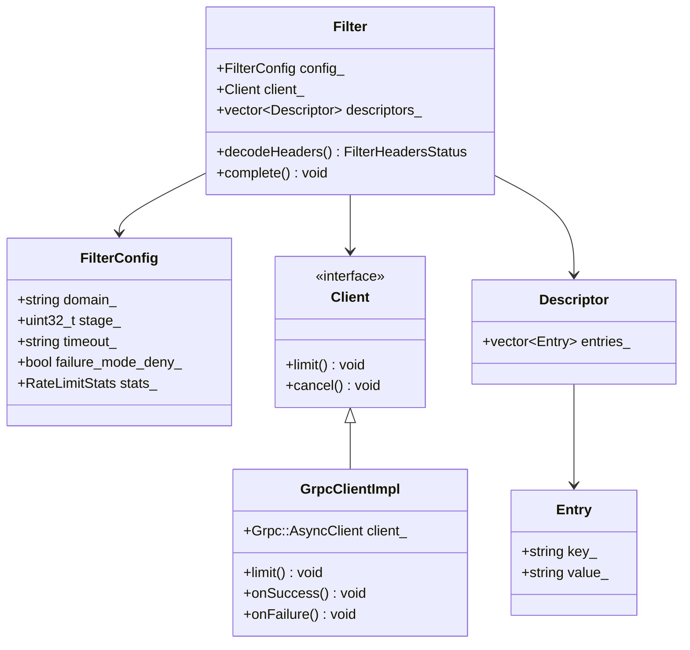
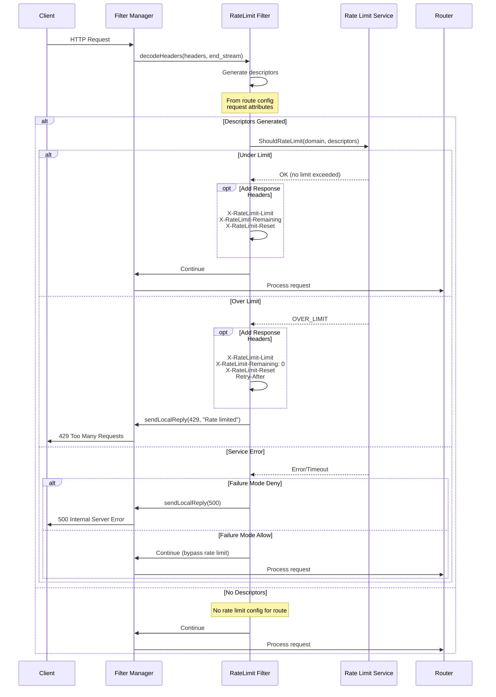
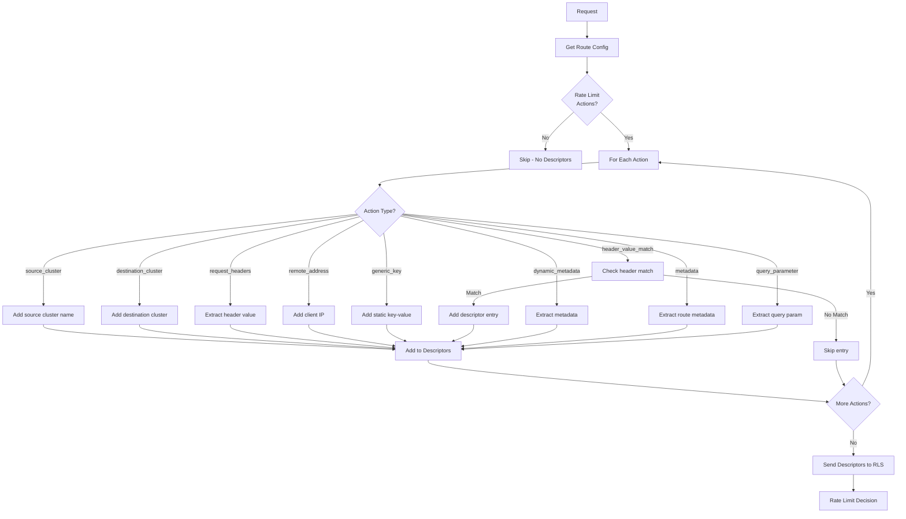
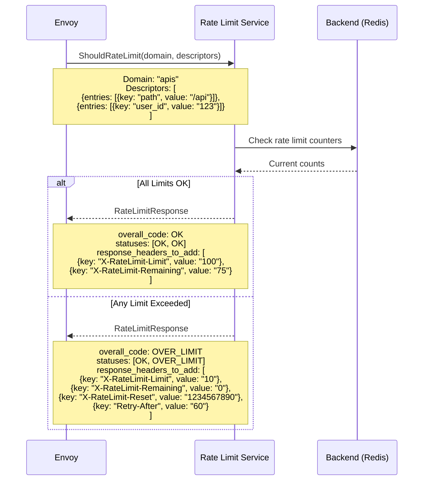
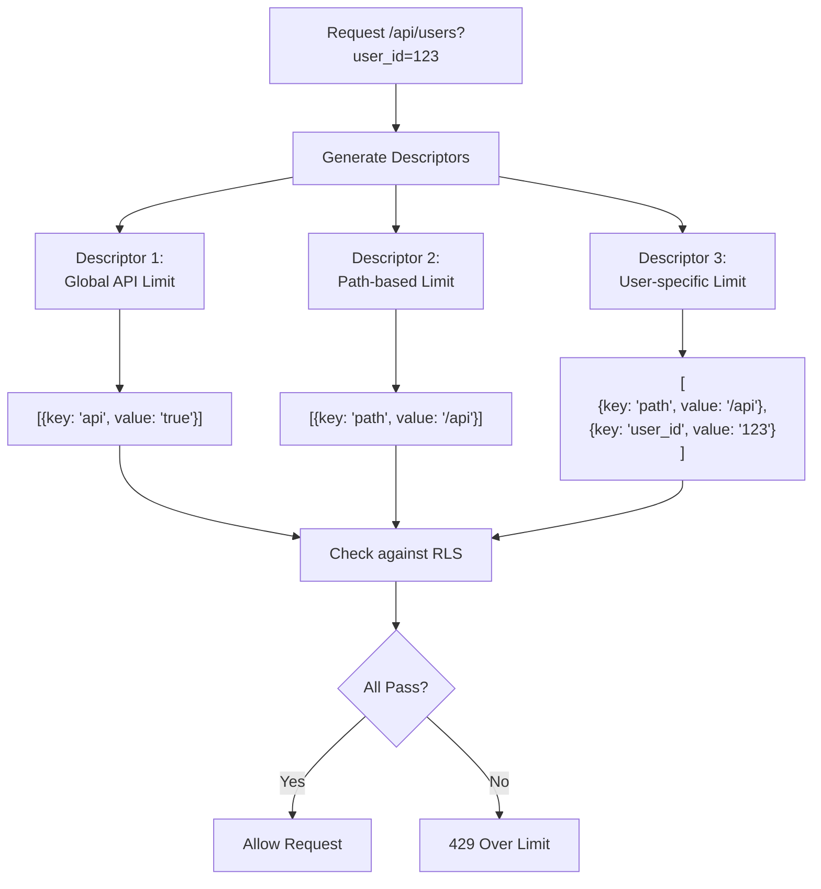
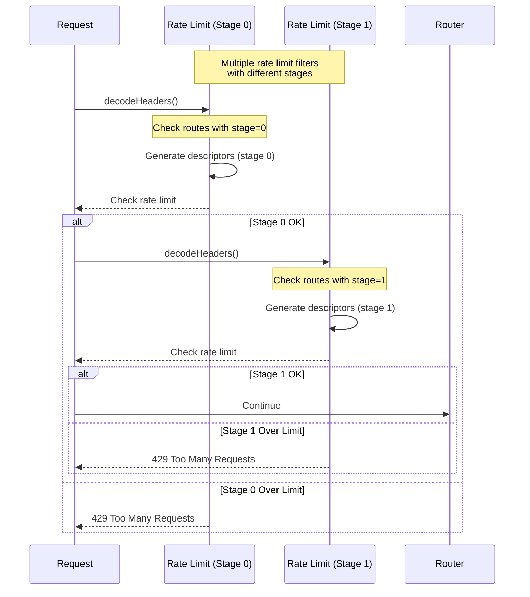
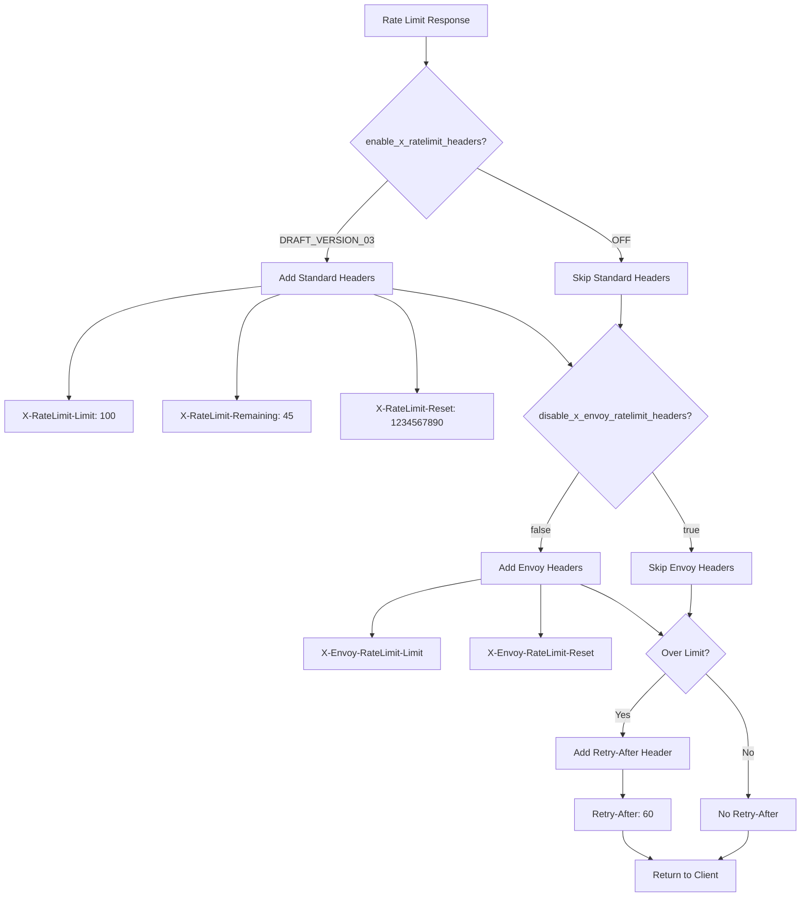
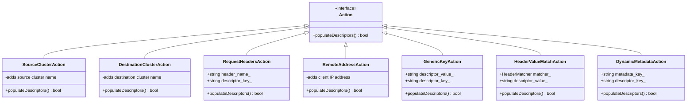
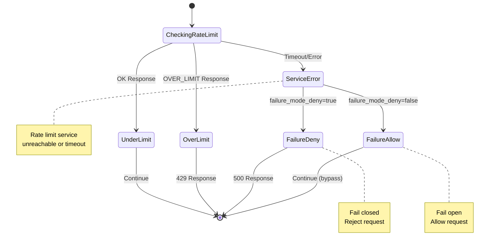

# Rate Limit Filter

## Overview

The Rate Limit filter integrates with an external rate limit service to enforce rate limits on HTTP requests. It supports global rate limiting across multiple Envoy instances by calling a centralized rate limit service that implements the RateLimit v3 API.

## Key Responsibilities

- Call external rate limit service
- Generate rate limit descriptors from request attributes
- Handle rate limit responses (OK, Over Limit)
- Support stage-based rate limiting
- Configure rate limit domain
- Handle failure modes
- Add rate limit response headers

## Architecture



## Request Flow



## Descriptor Generation



## Rate Limit Service Protocol



## Descriptor Hierarchy



## Stage-Based Rate Limiting



## Configuration Example

```yaml
name: envoy.filters.http.ratelimit
typed_config:
  "@type": type.googleapis.com/envoy.extensions.filters.http.ratelimit.v3.RateLimit
  domain: "apis"
  stage: 0
  failure_mode_deny: false
  timeout: 0.25s
  rate_limit_service:
    grpc_service:
      envoy_grpc:
        cluster_name: rate_limit_service
      timeout: 0.25s
    transport_api_version: V3
  enable_x_ratelimit_headers: DRAFT_VERSION_03
  disable_x_envoy_ratelimit_headers: false
```

## Route Configuration Example

```yaml
routes:
  - match:
      prefix: "/api"
    route:
      cluster: api_cluster
      rate_limits:
        - stage: 0
          actions:
            # Global API rate limit
            - generic_key:
                descriptor_value: "api"

            # Per-path rate limit
            - request_headers:
                header_name: ":path"
                descriptor_key: "path"

            # Per-user rate limit
            - request_headers:
                header_name: "x-user-id"
                descriptor_key: "user_id"

  - match:
      prefix: "/admin"
    route:
      cluster: admin_cluster
      rate_limits:
        - stage: 0
          actions:
            # Admin endpoint - stricter limits
            - generic_key:
                descriptor_value: "admin"

            - remote_address: {}
```

## Rate Limit Service Config Example

The rate limit service uses a configuration like:

```yaml
domain: apis
descriptors:
  # Global API limit: 1000 req/hour
  - key: api
    value: "true"
    rate_limit:
      unit: HOUR
      requests_per_unit: 1000

  # Path-specific limit: 100 req/minute
  - key: path
    value: "/api"
    rate_limit:
      unit: MINUTE
      requests_per_unit: 100

  # User-specific limit: 10 req/minute per user
  - key: path
    value: "/api"
    descriptors:
      - key: user_id
        rate_limit:
          unit: MINUTE
          requests_per_unit: 10
```

## Response Header Management



## Action Types



## Failure Handling



## Key Features

### 1. External Rate Limit Service
- Centralized rate limiting across Envoy fleet
- Shared state via Redis or similar backend
- Consistent rate limiting

### 2. Flexible Descriptor Generation
- Multiple action types
- Hierarchical descriptors
- Dynamic descriptor values

### 3. Stage-Based Limiting
- Multiple rate limit filters in chain
- Different limits at different stages
- Fine-grained control

### 4. Response Headers
- Standard X-RateLimit-* headers
- Envoy-specific headers
- Retry-After header

### 5. Failure Modes
- Fail open (allow on error)
- Fail closed (deny on error)
- Configurable per filter

## Statistics

| Stat | Type | Description |
|------|------|-------------|
| ratelimit.ok | Counter | Requests under limit |
| ratelimit.over_limit | Counter | Requests over limit |
| ratelimit.error | Counter | Rate limit service errors |
| ratelimit.failure_mode_allowed | Counter | Allowed due to failure mode |

## Common Use Cases

### 1. API Rate Limiting
Limit API calls per user/client

### 2. DDoS Protection
Protect against volumetric attacks

### 3. Fair Usage
Ensure fair resource distribution

### 4. Cost Control
Limit expensive operations

### 5. Tiered Rate Limits
Different limits for different customer tiers

### 6. Burst Protection
Prevent traffic spikes

## Best Practices

1. **Set appropriate timeouts** - Balance accuracy and latency
2. **Use failure_mode_deny carefully** - Understand availability impact
3. **Implement hierarchical descriptors** - Global + specific limits
4. **Monitor rate limit service** - Critical dependency
5. **Use stages for complex scenarios** - Different limits at different points
6. **Configure appropriate limits** - Based on upstream capacity
7. **Add meaningful response headers** - Help clients understand limits
8. **Log rate limit events** - For analysis and tuning
9. **Test under load** - Ensure rate limit service can handle traffic
10. **Use local rate limit** - For per-instance limits

## Comparison: Global vs Local Rate Limiting

| Aspect | Global (this filter) | Local (local_ratelimit) |
|--------|----------------------|-------------------------|
| State | Shared across instances | Per-instance only |
| Latency | Higher (network call) | Lower (local check) |
| Consistency | Consistent across fleet | Per-instance limits |
| Complexity | Requires external service | Self-contained |
| Use Case | API rate limiting | Connection limiting |

## Related Filters

- **local_ratelimit**: Per-instance rate limiting
- **ext_authz**: Authorization before rate limiting
- **fault**: Combine with fault injection for testing

## References

- [Envoy Rate Limit Filter Documentation](https://www.envoyproxy.io/docs/envoy/latest/configuration/http/http_filters/rate_limit_filter)
- [RateLimit Service API](https://www.envoyproxy.io/docs/envoy/latest/api-v3/service/ratelimit/v3/rls.proto)
- [Lyft Rate Limit Service](https://github.com/envoyproxy/ratelimit)
