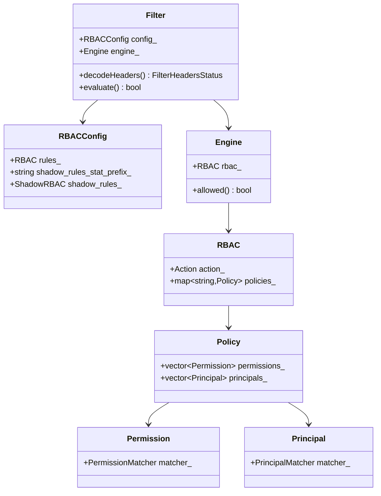
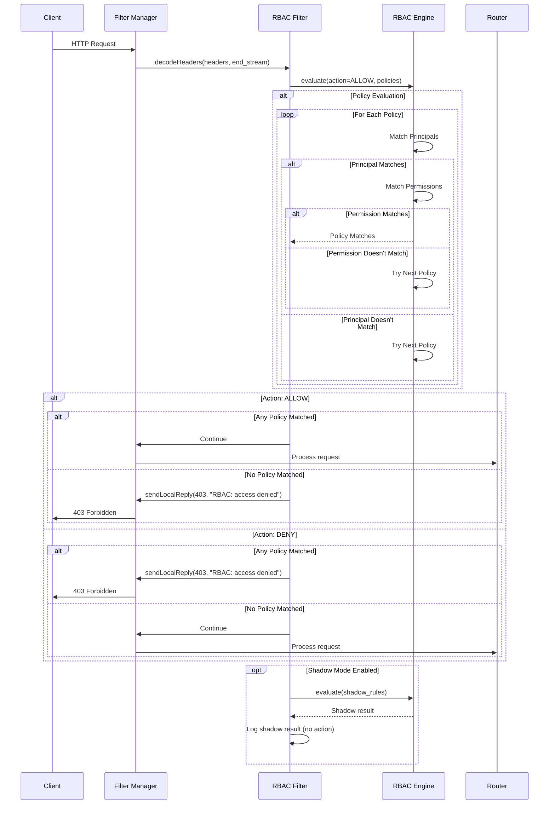
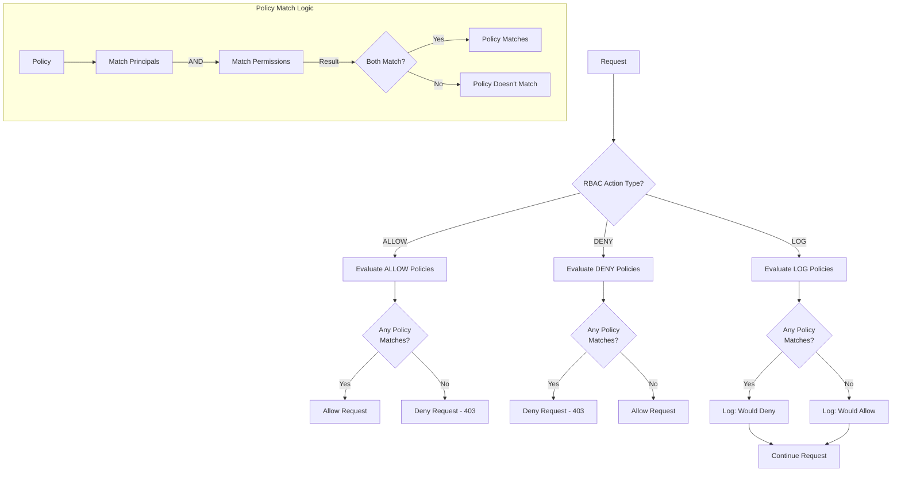
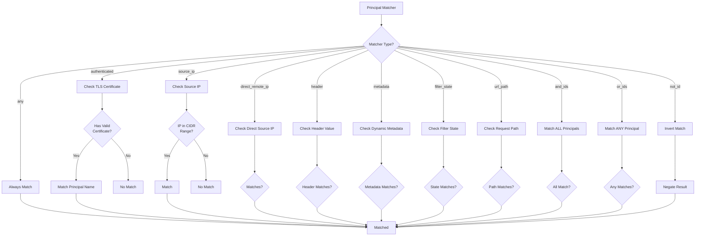
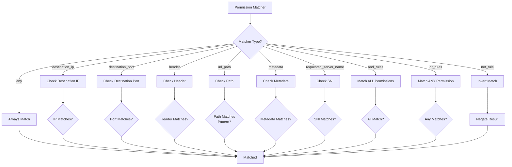
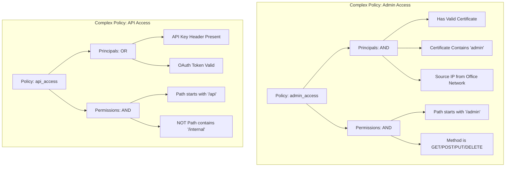
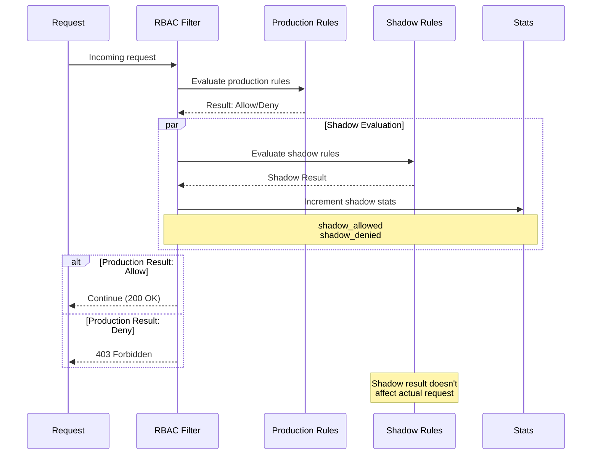
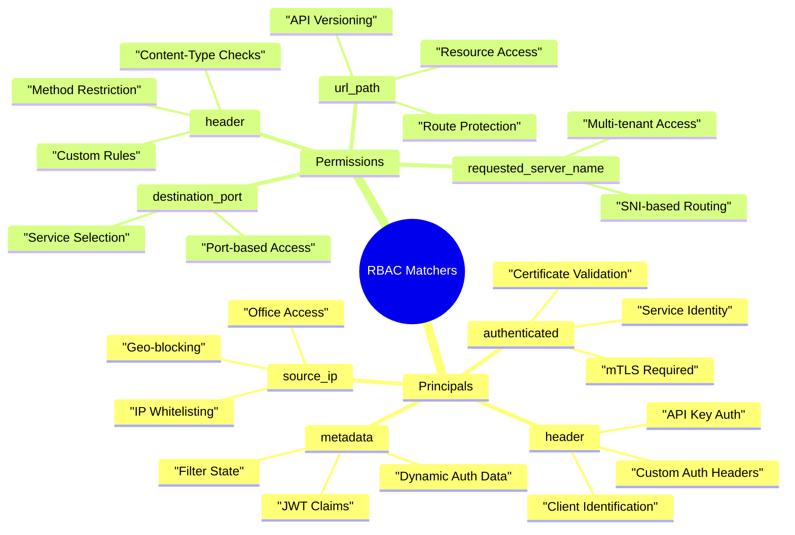
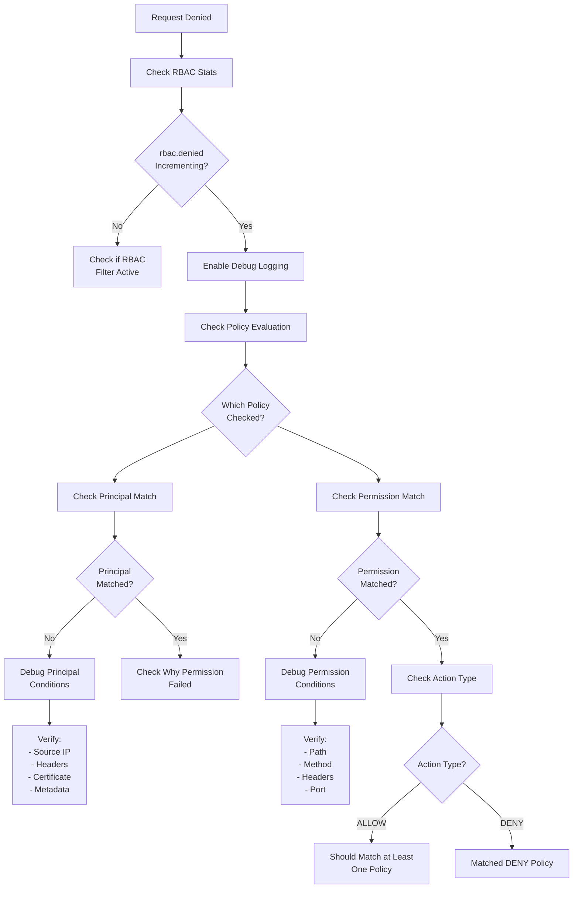

# RBAC (Role-Based Access Control) Filter

## Overview

The RBAC (Role-Based Access Control) filter enforces access control policies based on request attributes such as source IP, headers, path, and TLS certificate properties. It provides a powerful and flexible way to implement authorization policies directly within Envoy without external service calls.

## Key Responsibilities

- Evaluate authorization policies against requests
- Support both allow and deny policies
- Match on multiple request attributes
- Evaluate TLS certificate properties
- Support complex logical combinations (AND/OR/NOT)
- Log authorization decisions
- Shadow mode for testing policies

## Architecture



## Request Flow



## Policy Evaluation Logic



## Principal Matching



## Permission Matching



## Policy Combination



## Shadow Mode



## Configuration Example - Basic

```yaml
name: envoy.filters.http.rbac
typed_config:
  "@type": type.googleapis.com/envoy.extensions.filters.http.rbac.v3.RBAC
  rules:
    action: ALLOW
    policies:
      "admin-access":
        permissions:
          - and_rules:
              rules:
                - header:
                    name: ":path"
                    string_match:
                      prefix: "/admin"
                - header:
                    name: ":method"
                    string_match:
                      exact: "GET"
        principals:
          - authenticated:
              principal_name:
                exact: "admin-user"

      "internal-network":
        permissions:
          - any: true
        principals:
          - source_ip:
              address_prefix: "10.0.0.0"
              prefix_len: 8
```

## Configuration Example - Complex

```yaml
name: envoy.filters.http.rbac
typed_config:
  "@type": type.googleapis.com/envoy.extensions.filters.http.rbac.v3.RBAC
  rules:
    action: ALLOW
    policies:
      "service-admin":
        permissions:
          - and_rules:
              rules:
                # Must access /admin paths
                - url_path:
                    path:
                      prefix: "/admin"
                # Must use POST, PUT, or DELETE
                - or_rules:
                    rules:
                      - header: { name: ":method", string_match: { exact: "POST" } }
                      - header: { name: ":method", string_match: { exact: "PUT" } }
                      - header: { name: ":method", string_match: { exact: "DELETE" } }
        principals:
          - and_ids:
              ids:
                # Must have valid mTLS certificate
                - authenticated:
                    principal_name:
                      suffix: ".admin.example.com"
                # Must be from office network
                - source_ip:
                    address_prefix: "192.168.0.0"
                    prefix_len: 16

      "api-users":
        permissions:
          - and_rules:
              rules:
                # API paths
                - url_path:
                    path:
                      prefix: "/api"
                # But NOT internal APIs
                - not_rule:
                    url_path:
                      path:
                        prefix: "/api/internal"
        principals:
          - or_ids:
              ids:
                # Valid API key
                - header:
                    name: "x-api-key"
                    present_match: true
                # Or valid OAuth token
                - metadata:
                    filter: "envoy.filters.http.jwt_authn"
                    path:
                      - key: "jwt_payload"
                    value:
                      string_match:
                        prefix: "user:"

  # Shadow rules for testing
  shadow_rules:
    action: ALLOW
    policies:
      "new-policy-test":
        permissions:
          - any: true
        principals:
          - header:
              name: "x-new-auth"
              present_match: true
  shadow_rules_stat_prefix: "rbac_shadow"
```

## Use Cases by Matcher Type



## Key Features

### 1. Multiple Matcher Types
- Source IP and CIDR ranges
- TLS certificate properties
- HTTP headers
- URL paths
- Dynamic metadata
- Filter state

### 2. Logical Combinations
- AND: All conditions must match
- OR: Any condition must match
- NOT: Invert condition

### 3. Action Types
- **ALLOW**: Whitelist approach
- **DENY**: Blacklist approach
- **LOG**: Shadow mode for testing

### 4. Policy Structure
- Named policies for clarity
- Principals: Who can access
- Permissions: What can be accessed

### 5. Shadow Mode
- Test policies without affecting traffic
- Compare production vs shadow results
- Safe policy rollout

## Statistics

| Stat | Type | Description |
|------|------|-------------|
| rbac.allowed | Counter | Requests allowed by RBAC |
| rbac.denied | Counter | Requests denied by RBAC |
| rbac.shadow_allowed | Counter | Would be allowed (shadow) |
| rbac.shadow_denied | Counter | Would be denied (shadow) |

## Common Use Cases

### 1. API Authorization
Control access to API endpoints based on authentication

### 2. Admin Panel Protection
Restrict admin routes to specific IPs or certificates

### 3. Internal Service Communication
Allow only mTLS-authenticated services

### 4. Geographic Restrictions
Block or allow based on source IP regions

### 5. Method-Based Access Control
Restrict write operations to specific principals

### 6. Multi-Tenant Access
Isolate tenant access using metadata

## Best Practices

1. **Use ALLOW action** - Whitelist is more secure than blacklist
2. **Combine with authentication** - RBAC works best after authn
3. **Use shadow mode** - Test policies before enforcement
4. **Keep policies simple** - Complex policies are hard to debug
5. **Use descriptive policy names** - Makes debugging easier
6. **Monitor denied requests** - Identify legitimate vs malicious
7. **Document policies** - Maintain policy documentation
8. **Use metadata matching** - Leverage JWT claims and filter state
9. **Test thoroughly** - Cover all principal/permission combinations
10. **Version control configs** - Track policy changes

## Debugging RBAC Policies



## Performance Considerations

1. **Policy Evaluation Order**: Policies evaluated sequentially
2. **Complex Matchers**: AND/OR/NOT can be expensive
3. **Metadata Lookups**: Dynamic metadata access has overhead
4. **Number of Policies**: More policies = more evaluation time
5. **Caching**: Certificate and metadata are not re-evaluated per request

## Security Considerations

1. **Default Deny**: Use ALLOW action for security
2. **Certificate Validation**: Always validate TLS certificates
3. **IP Spoofing**: Use direct_remote_ip for X-Forwarded-For protection
4. **Header Injection**: Validate headers from trusted sources only
5. **Metadata Trust**: Only trust metadata from authenticated filters

## Related Filters

- **ext_authz**: External authorization service
- **jwt_authn**: JWT validation before RBAC
- **lua**: Custom authorization logic

## References

- [Envoy RBAC Filter Documentation](https://www.envoyproxy.io/docs/envoy/latest/configuration/http/http_filters/rbac_filter)
- [RBAC Network Filter](https://www.envoyproxy.io/docs/envoy/latest/configuration/listeners/network_filters/rbac_filter)
