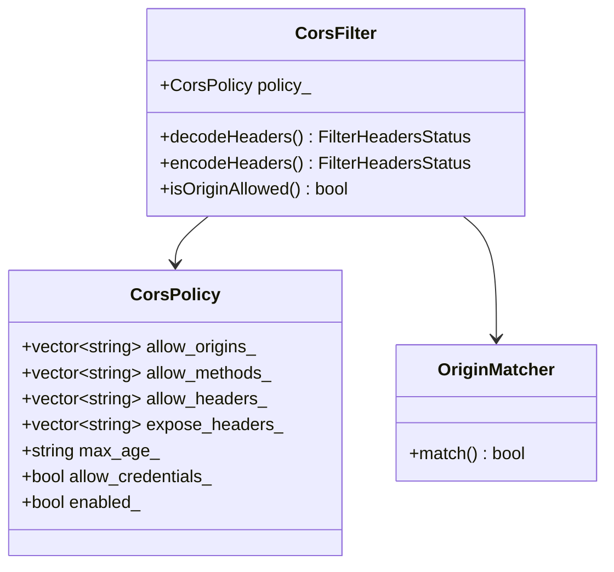
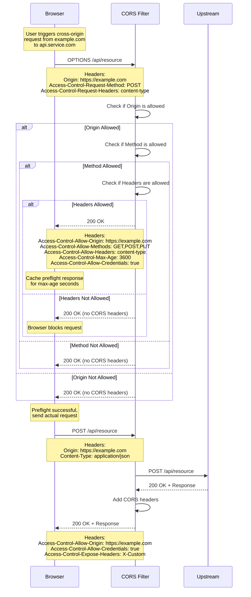
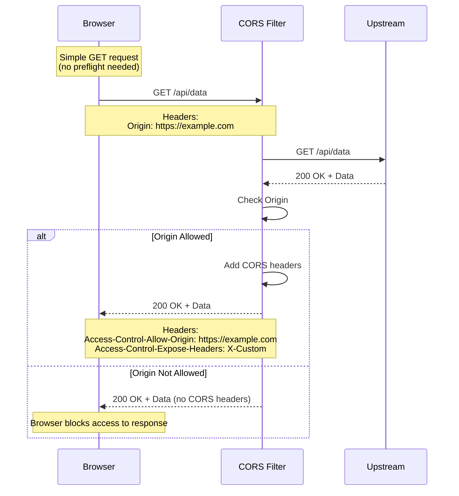
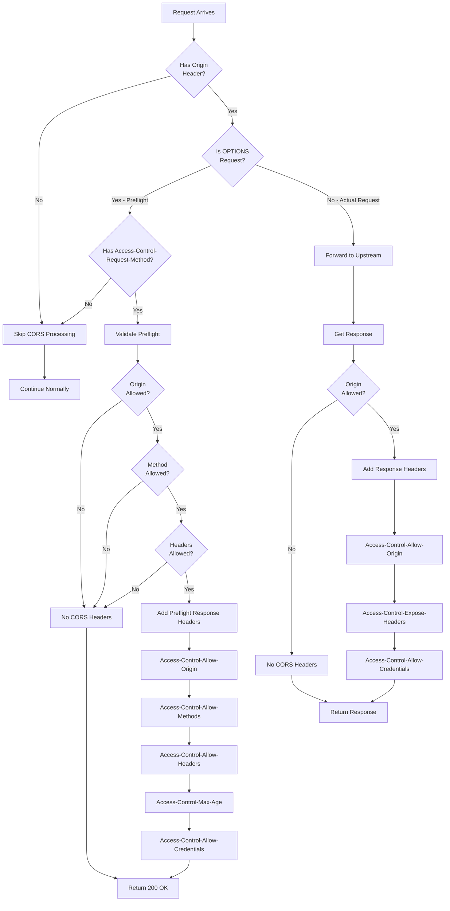
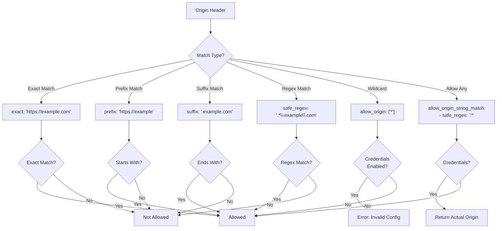
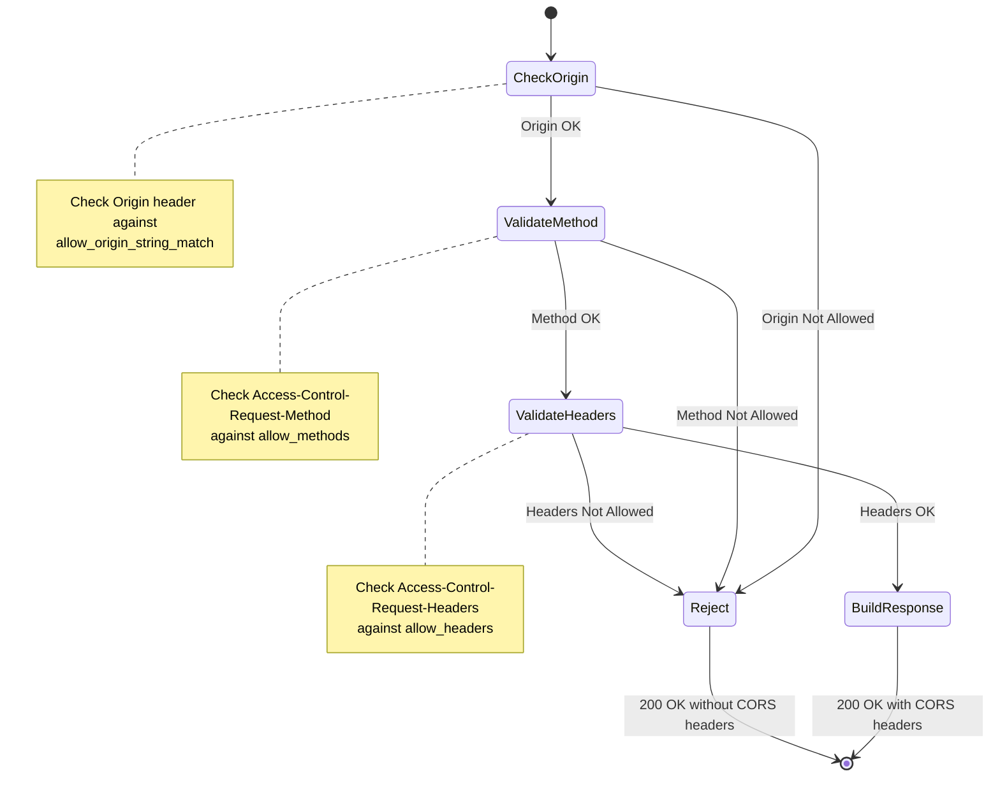
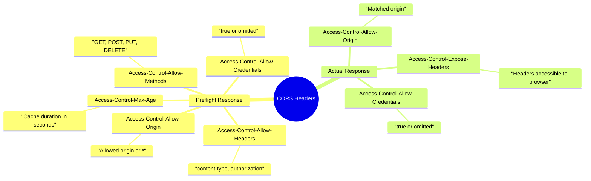
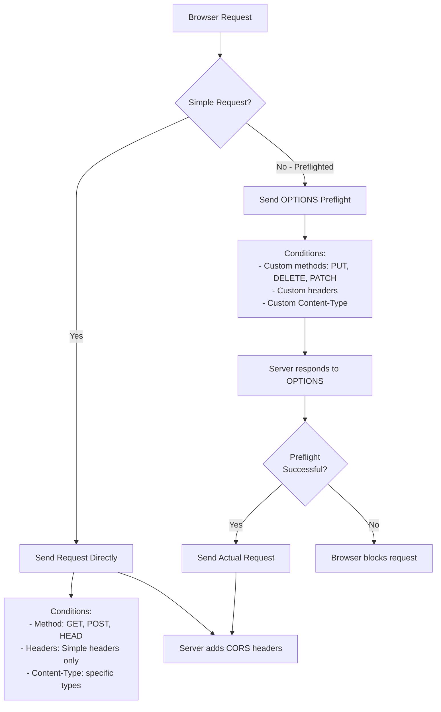
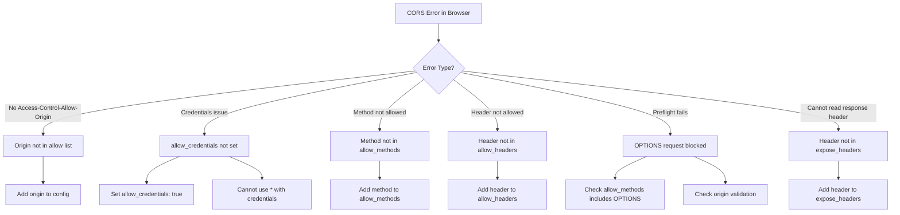

# CORS (Cross-Origin Resource Sharing) Filter

## Overview

The CORS filter handles Cross-Origin Resource Sharing requests and responses. It adds appropriate CORS headers to responses based on configuration and handles preflight OPTIONS requests. This filter enables web applications running in browsers to make requests to Envoy-proxied services from different origins.

## Key Responsibilities

- Handle preflight OPTIONS requests
- Add CORS response headers
- Validate origin headers
- Support credentials and cookies
- Configure allowed methods and headers
- Set max age for preflight caching
- Handle expose headers

## Architecture



## Request Flow - Preflight Request



## Request Flow - Simple Request



## CORS Decision Flow



## Origin Matching



## Configuration Example - Basic

```yaml
name: envoy.filters.http.cors
typed_config:
  "@type": type.googleapis.com/envoy.extensions.filters.http.cors.v3.Cors
```

Note: Basic filter config. Actual CORS policy is typically configured per route/virtual host.

## Route-Level CORS Configuration

```yaml
virtual_hosts:
  - name: api
    domains: ["api.example.com"]
    cors:
      allow_origin_string_match:
        - exact: "https://example.com"
        - exact: "https://app.example.com"
        - safe_regex:
            regex: "https://.*\\.example\\.com"
      allow_methods: "GET, POST, PUT, DELETE, OPTIONS"
      allow_headers: "content-type, x-requested-with, authorization"
      expose_headers: "x-custom-header, x-request-id"
      max_age: "3600"
      allow_credentials: true

    routes:
      - match:
          prefix: "/api"
        route:
          cluster: api_cluster
```

## Configuration Example - Per-Route Override

```yaml
routes:
  - match:
      prefix: "/public"
    route:
      cluster: public_cluster
    typed_per_filter_config:
      envoy.filters.http.cors:
        "@type": type.googleapis.com/envoy.extensions.filters.http.cors.v3.CorsPolicy
        allow_origin_string_match:
          - exact: "*"  # Allow all origins for public API
        allow_methods: "GET, OPTIONS"
        allow_headers: "content-type"
        max_age: "7200"

  - match:
      prefix: "/admin"
    route:
      cluster: admin_cluster
    typed_per_filter_config:
      envoy.filters.http.cors:
        "@type": type.googleapis.com/envoy.extensions.filters.http.cors.v3.CorsPolicy
        allow_origin_string_match:
          - exact: "https://admin.example.com"
        allow_methods: "GET, POST, PUT, DELETE, OPTIONS"
        allow_headers: "content-type, authorization"
        allow_credentials: true
        max_age: "600"
```

## Preflight Request Handling



## Response Headers



## Simple vs Preflighted Requests



## Configuration Example - Advanced

```yaml
virtual_hosts:
  - name: multi_tenant_api
    domains: ["*.api.example.com"]
    cors:
      # Allow multiple specific origins
      allow_origin_string_match:
        - exact: "https://app1.example.com"
        - exact: "https://app2.example.com"
        - prefix: "https://partner-"
        - safe_regex:
            regex: "https://tenant-[0-9]+\\.example\\.com"

      # Allow common HTTP methods
      allow_methods: "GET, POST, PUT, DELETE, PATCH, OPTIONS"

      # Allow custom headers
      allow_headers: >-
        authorization,
        content-type,
        x-requested-with,
        x-api-key,
        x-client-version

      # Expose custom response headers
      expose_headers: >-
        x-request-id,
        x-response-time,
        x-rate-limit-remaining

      # Cache preflight for 1 hour
      max_age: "3600"

      # Allow credentials (cookies, auth)
      allow_credentials: true

      # Enable CORS filter
      filter_enabled:
        default_value:
          numerator: 100
          denominator: HUNDRED
```

## Key Features

### 1. Origin Validation
- Exact match
- Prefix/suffix match
- Regex match
- Wildcard support

### 2. Preflight Handling
- Automatic OPTIONS response
- Method validation
- Header validation
- Max age caching

### 3. Credentials Support
- Cookie support
- Authorization headers
- Proper origin handling

### 4. Flexible Configuration
- Per-route overrides
- Virtual host defaults
- Runtime feature flags

### 5. Header Management
- Allow methods
- Allow headers
- Expose headers

## Common Use Cases

### 1. Web Application API
Allow web apps to call backend APIs

### 2. Multi-Tenant SaaS
Different origins per tenant

### 3. Mobile Web Apps
Progressive web apps calling APIs

### 4. Microservices Dashboard
Admin UI calling multiple services

### 5. Third-Party Integrations
Allow partner applications

### 6. Development Environments
Allow localhost for development

## Best Practices

1. **Avoid wildcards in production** - Specify exact origins
2. **Don't use * with credentials** - Security violation
3. **Set appropriate max_age** - Balance security and performance
4. **Limit allowed methods** - Only what's needed
5. **Validate request headers** - Allow only required headers
6. **Use HTTPS for origins** - Secure communication
7. **Monitor CORS errors** - Track client issues
8. **Test with browsers** - CORS is browser-enforced
9. **Document allowed origins** - For client developers
10. **Use per-route config** - Different rules for different endpoints

## Common Issues and Solutions



## Security Considerations

1. **Validate origins strictly** - Don't use overly broad patterns
2. **Avoid wildcard with credentials** - Spec violation, browsers reject
3. **HTTPS only** - HTTP origins are insecure
4. **Limit exposed headers** - Don't expose sensitive data
5. **Monitor origin patterns** - Detect malicious origins
6. **Rate limit OPTIONS** - Prevent DoS on preflight
7. **Validate origin format** - Prevent header injection

## Testing CORS

```bash
# Test preflight request
curl -X OPTIONS https://api.example.com/resource \ -H "Origin: https://example.com" \ -H "Access-Control-Request-Method: POST" \ -H "Access-Control-Request-Headers: content-type" \ -v

# Test actual request
curl -X POST https://api.example.com/resource \ -H "Origin: https://example.com" \ -H "Content-Type: application/json" \ -d '{"test": "data"}' \ -v
```

## Related Filters

- **jwt_authn**: Authentication before CORS
- **rbac**: Authorization with CORS
- **router**: Final routing after CORS

## References

- [Envoy CORS Filter Documentation](https://www.envoyproxy.io/docs/envoy/latest/configuration/http/http_filters/cors_filter)
- [MDN CORS Documentation](https://developer.mozilla.org/en-US/docs/Web/HTTP/CORS)
- [CORS Specification](https://fetch.spec.whatwg.org/#http-cors-protocol)
