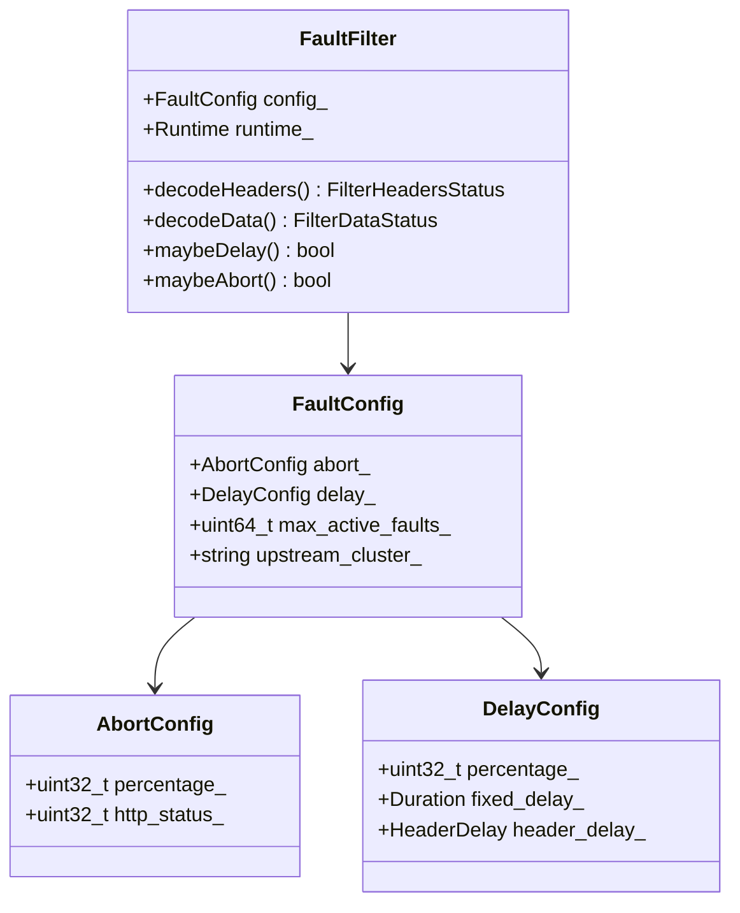
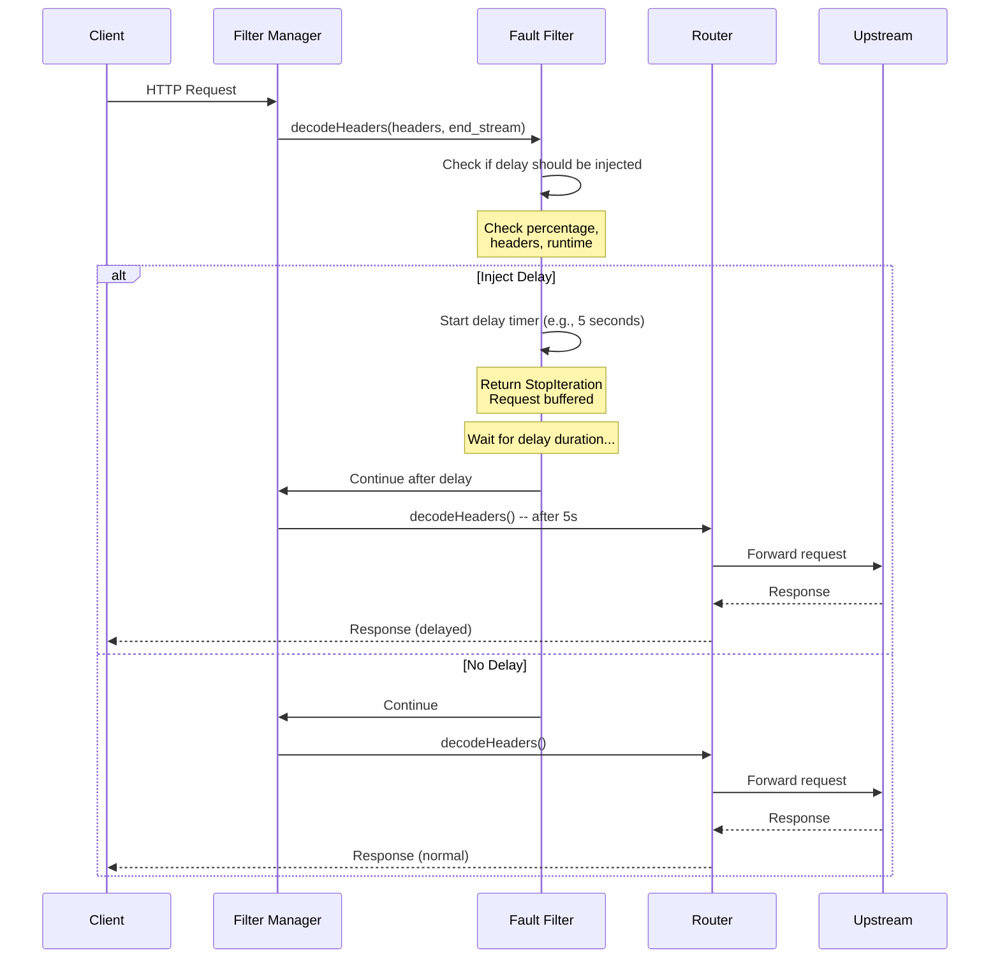
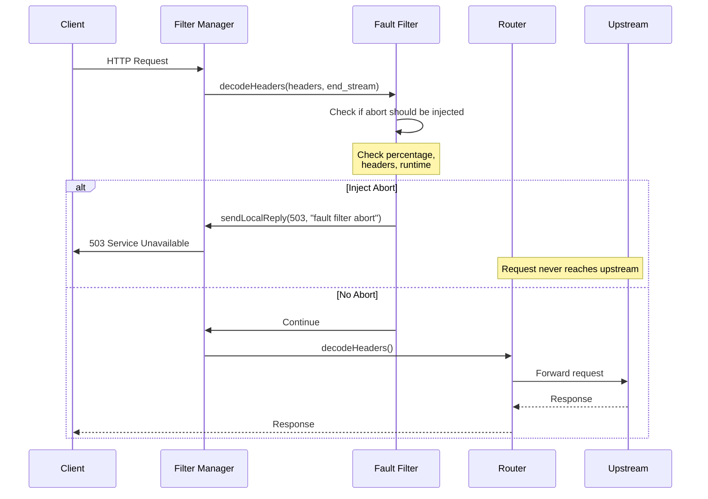
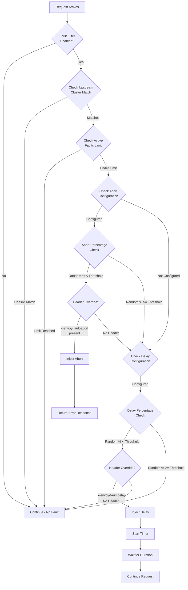
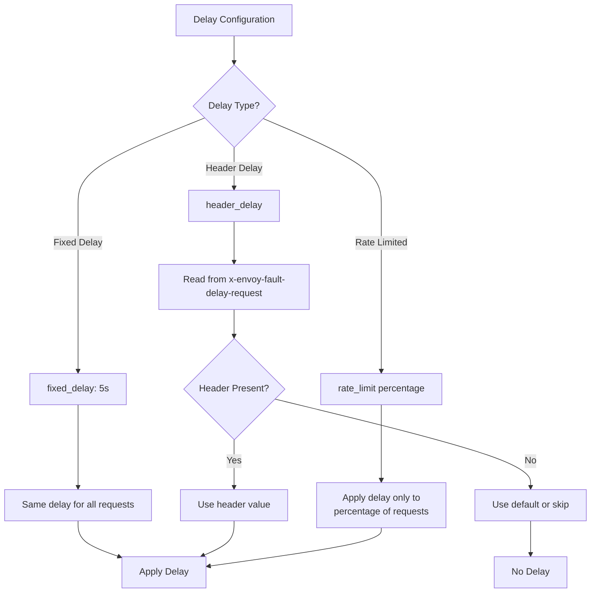
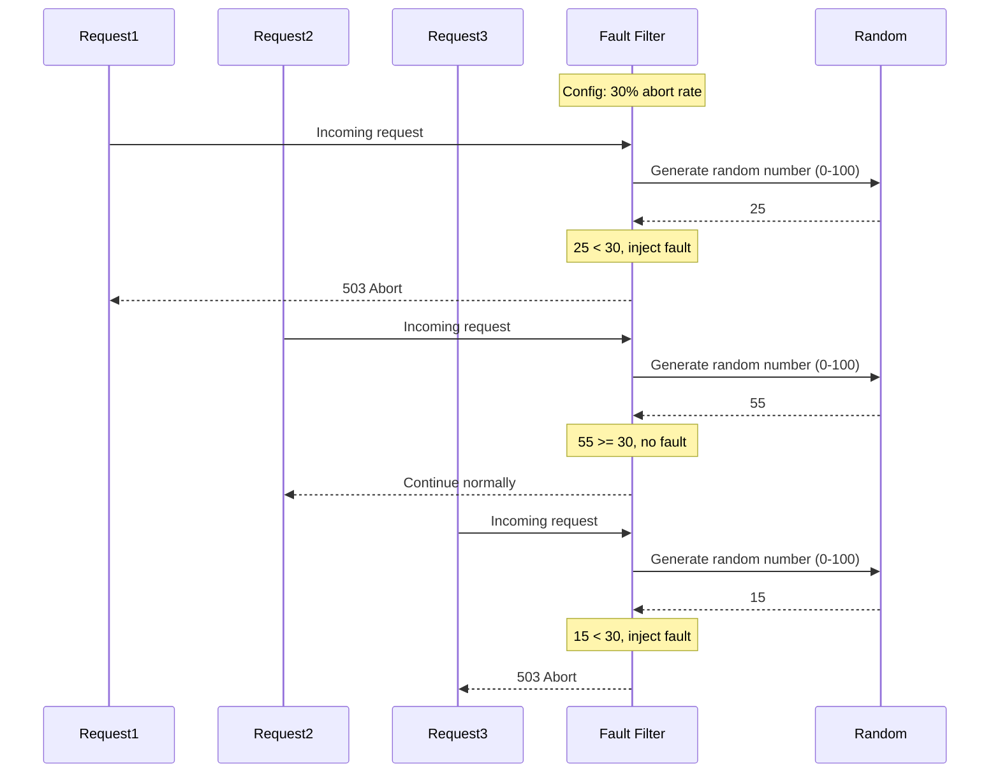
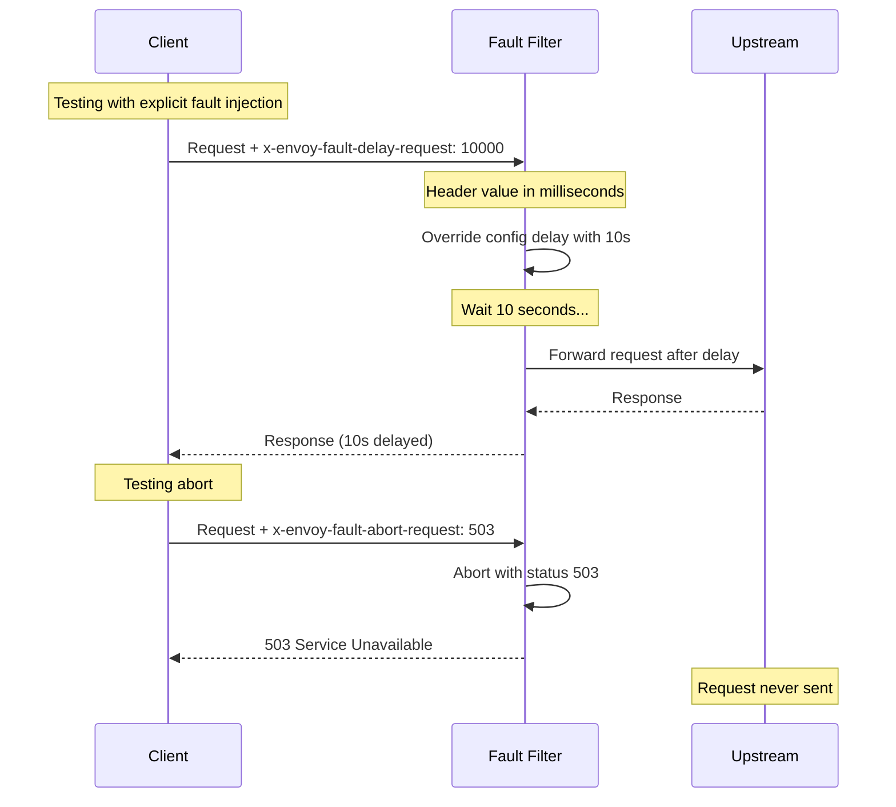
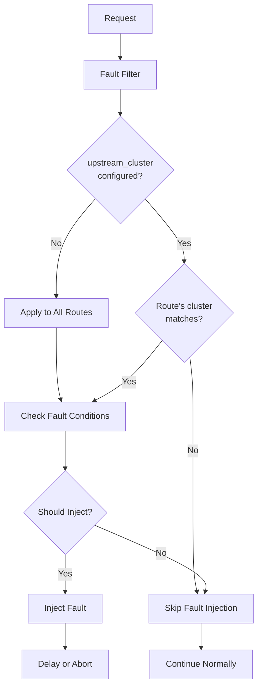
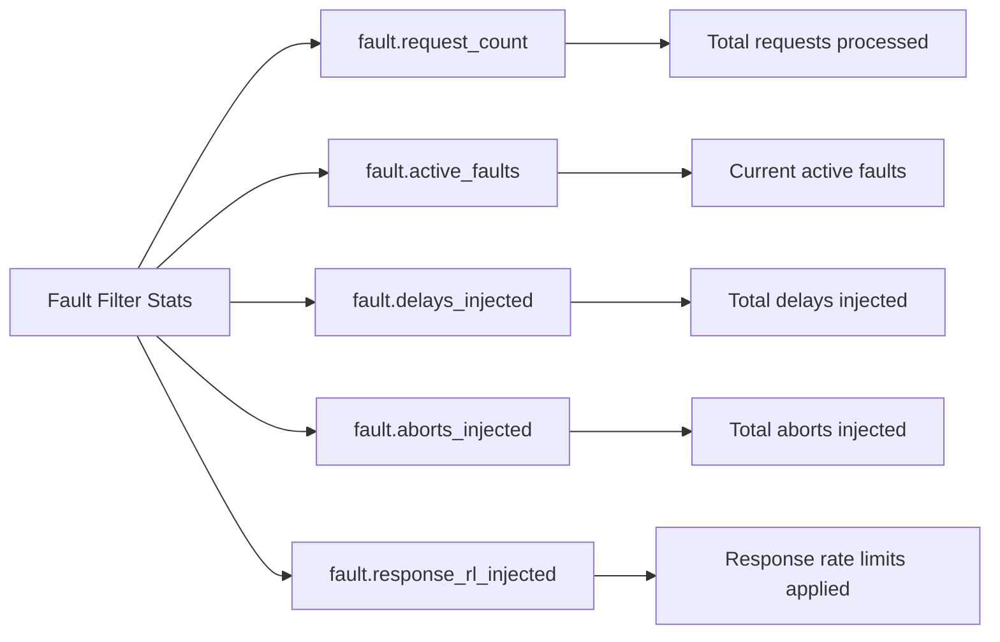
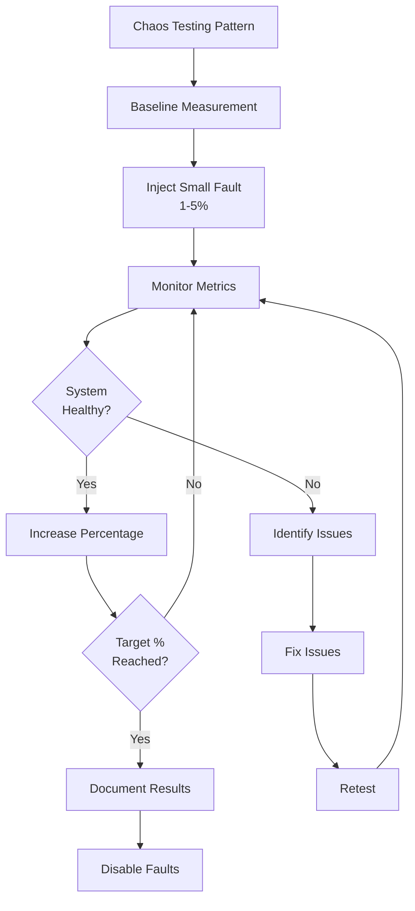

# Fault Injection Filter

## Overview

The Fault Injection filter is used to inject faults (delays and aborts) into HTTP requests for testing the resilience and reliability of microservices. It enables chaos engineering practices by simulating network issues, service failures, and latency problems without modifying application code.

## Key Responsibilities

- Inject delays to simulate network latency
- Abort requests to simulate service failures
- Support percentage-based fault injection
- Enable per-route fault configuration
- Support header-based fault activation
- Rate limit fault injection
- Inject faults based on downstream clusters

## Architecture



## Request Flow - Delay Injection



## Request Flow - Abort Injection



## Fault Decision Flow



## Delay Types



## Percentage-Based Activation



## Configuration Example - Basic

```yaml
name: envoy.filters.http.fault
typed_config:
  "@type": type.googleapis.com/envoy.extensions.filters.http.fault.v3.HTTPFault
  # Abort 10% of requests with 503
  abort:
    http_status: 503
    percentage:
      numerator: 10
      denominator: HUNDRED

  # Add 5 second delay to 20% of requests
  delay:
    fixed_delay: 5s
    percentage:
      numerator: 20
      denominator: HUNDRED
```

## Configuration Example - Advanced

```yaml
name: envoy.filters.http.fault
typed_config:
  "@type": type.googleapis.com/envoy.extensions.filters.http.fault.v3.HTTPFault

  # Delay configuration
  delay:
    # 3 second fixed delay
    fixed_delay: 3s
    # Apply to 25% of requests
    percentage:
      numerator: 25
      denominator: HUNDRED
    # Allow header override
    header_delay: {}

  # Abort configuration
  abort:
    # Return 503 Service Unavailable
    http_status: 503
    # Apply to 5% of requests
    percentage:
      numerator: 5
      denominator: HUNDRED
    # Allow header override
    header_abort: {}

  # Only inject faults for specific upstream cluster
  upstream_cluster: "backend_service"

  # Limit concurrent active faults
  max_active_faults: 100

  # Enable via runtime
  delay_percent_runtime: "fault.delay.fixed_delay_percent"
  abort_percent_runtime: "fault.abort.abort_percent"

  # Response rate limiting
  response_rate_limit:
    fixed_limit:
      limit_kbps: 10
    percentage:
      numerator: 50
      denominator: HUNDRED
```

## Route-Level Configuration

```yaml
routes:
  - match:
      prefix: "/api/v1"
    route:
      cluster: api_v1_cluster
    typed_per_filter_config:
      envoy.filters.http.fault:
        "@type": type.googleapis.com/envoy.extensions.filters.http.fault.v3.HTTPFault
        delay:
          fixed_delay: 2s
          percentage:
            numerator: 50
            denominator: HUNDRED

  - match:
      prefix: "/api/v2"
    route:
      cluster: api_v2_cluster
    typed_per_filter_config:
      envoy.filters.http.fault:
        "@type": type.googleapis.com/envoy.extensions.filters.http.fault.v3.HTTPFault
        abort:
          http_status: 429
          percentage:
            numerator: 10
            denominator: HUNDRED
```

## Header-Based Fault Injection



## Upstream Cluster Filtering



## Statistics



## Configuration Example - Chaos Testing Scenarios

```yaml
# Scenario 1: Simulate Slow Backend (High Latency)
name: envoy.filters.http.fault
typed_config:
  "@type": type.googleapis.com/envoy.extensions.filters.http.fault.v3.HTTPFault
  delay:
    fixed_delay: 10s
    percentage:
      numerator: 100  # All requests
      denominator: HUNDRED

---
# Scenario 2: Simulate Service Failures
name: envoy.filters.http.fault
typed_config:
  "@type": type.googleapis.com/envoy.extensions.filters.http.fault.v3.HTTPFault
  abort:
    http_status: 503
    percentage:
      numerator: 50  # 50% failure rate
      denominator: HUNDRED

---
# Scenario 3: Simulate Timeout Scenarios
name: envoy.filters.http.fault
typed_config:
  "@type": type.googleapis.com/envoy.extensions.filters.http.fault.v3.HTTPFault
  delay:
    fixed_delay: 31s  # Longer than typical timeout
    percentage:
      numerator: 20
      denominator: HUNDRED

---
# Scenario 4: Simulate Rate Limiting
name: envoy.filters.http.fault
typed_config:
  "@type": type.googleapis.com/envoy.extensions.filters.http.fault.v3.HTTPFault
  abort:
    http_status: 429
    percentage:
      numerator: 30
      denominator: HUNDRED

---
# Scenario 5: Simulate Bandwidth Throttling
name: envoy.filters.http.fault
typed_config:
  "@type": type.googleapis.com/envoy.extensions.filters.http.fault.v3.HTTPFault
  response_rate_limit:
    fixed_limit:
      limit_kbps: 50  # Limit to 50 KB/s
    percentage:
      numerator: 100
      denominator: HUNDRED
```

## Runtime Configuration

```yaml
# Enable/disable faults dynamically without config changes
runtime:
  layers:
    - name: admin
      admin_layer: {}
    - name: static
      static_layer:
        # Override delay percentage
        fault.delay.fixed_delay_percent: 30

        # Override abort percentage
        fault.abort.abort_percent: 10

        # Disable faults completely
        fault.http.enabled: false
```

## Key Features

### 1. Multiple Fault Types
- Fixed delays
- HTTP aborts with custom status codes
- Response bandwidth throttling

### 2. Flexible Activation
- Percentage-based injection
- Header-based override
- Runtime dynamic configuration
- Per-route configuration

### 3. Targeting
- Upstream cluster filtering
- Route-specific faults
- Active fault limiting

### 4. Testing Capabilities
- Chaos engineering support
- Resilience testing
- Timeout validation
- Circuit breaker testing

## Common Use Cases

### 1. Chaos Engineering
Test system resilience by injecting random faults

### 2. Timeout Testing
Validate timeout configurations and handling

### 3. Retry Logic Testing
Verify retry policies work correctly

### 4. Circuit Breaker Testing
Trigger circuit breakers to test behavior

### 5. Load Testing
Simulate degraded backend performance

### 6. Failover Testing
Test service failover mechanisms

### 7. Client Resilience
Test client retry and error handling

## Best Practices

1. **Start with low percentages** - 1-5% in production
2. **Use in staging first** - Test fault configs safely
3. **Enable header overrides** - For controlled testing
4. **Monitor impact** - Track error rates and latency
5. **Use runtime config** - Enable/disable without redeploy
6. **Target specific clusters** - Avoid widespread impact
7. **Limit active faults** - Prevent resource exhaustion
8. **Document test scenarios** - Track what you're testing
9. **Combine with observability** - Monitor fault impact
10. **Use timeboxed experiments** - Don't leave faults enabled

## Testing Patterns



## Safety Considerations

1. **Never 100% in production** - Always allow some success
2. **Set max_active_faults** - Prevent memory issues
3. **Use canary deployments** - Test faults on subset
4. **Monitor downstream impact** - Check cascade effects
5. **Have kill switch** - Quick way to disable faults
6. **Alert on fault injection** - Know when faults are active
7. **Document procedures** - Clear enable/disable process
8. **Test fault configs** - In non-production first

## Debugging with Fault Filter

```bash
# Inject delay for specific request
curl -H "x-envoy-fault-delay-request: 5000" https://api.example.com/test

# Inject abort for specific request
curl -H "x-envoy-fault-abort-request: 503" https://api.example.com/test

# Combine both headers
curl -H "x-envoy-fault-delay-request: 3000" \ -H "x-envoy-fault-abort-request: 500" \ https://api.example.com/test

# Check if fault was injected (look for x-envoy-fault-delay-request header in response)
curl -v https://api.example.com/test
```

## Related Filters

- **router**: Works before router to affect routing
- **ratelimit**: Can be combined for comprehensive testing
- **ext_proc**: Can inject faults based on external logic

## References

- [Envoy Fault Injection Filter Documentation](https://www.envoyproxy.io/docs/envoy/latest/configuration/http/http_filters/fault_filter)
- [Chaos Engineering Principles](https://principlesofchaos.org/)
- [Netflix Chaos Monkey](https://netflix.github.io/chaosmonkey/)
