# Buffer Filter

## Overview

The Buffer filter buffers the entire request body before forwarding it to the upstream service. This is useful when the upstream service requires the full request body to be present before processing (e.g., for signature verification, content validation, or when using HTTP/1.0 which doesn't support chunked encoding).

## Key Responsibilities

- Buffer complete request body
- Enforce maximum buffer size
- Handle streaming vs buffered requests
- Integrate with route configuration
- Support runtime configuration
- Provide observability for buffer operations

## Architecture

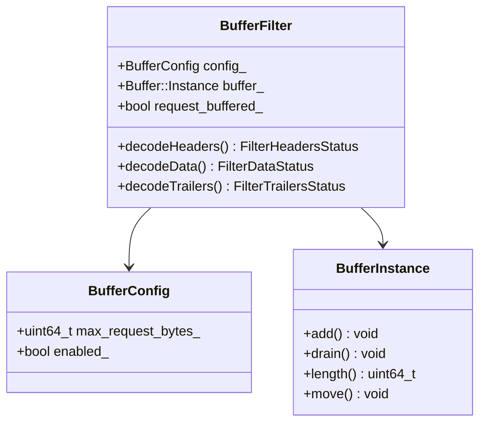

## Request Flow - Buffering

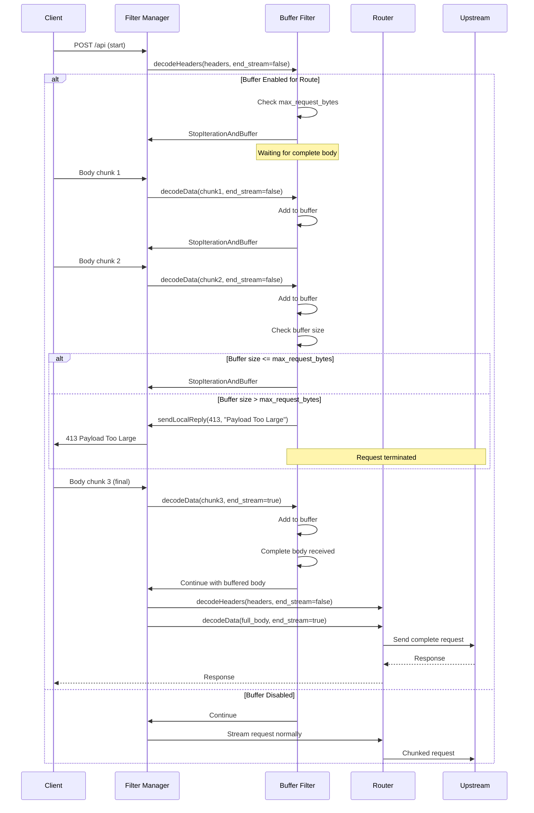

## Buffer Size Check

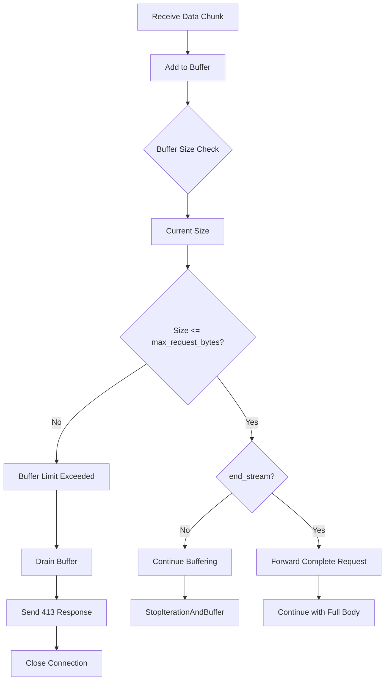

## State Machine

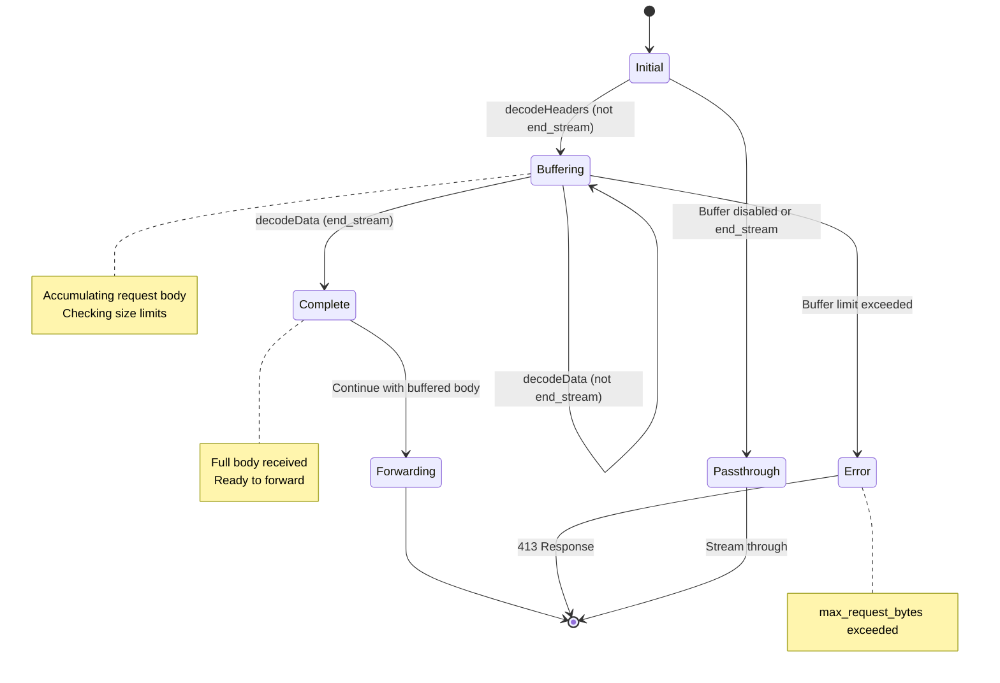

## Configuration Example - Filter Level

```yaml
name: envoy.filters.http.buffer
typed_config:
  "@type": type.googleapis.com/envoy.extensions.filters.http.buffer.v3.Buffer
  max_request_bytes: 1048576  # 1 MB
```

## Configuration Example - Per-Route

```yaml
routes:
  - match:
      prefix: "/api/upload"
    route:
      cluster: upload_service
    typed_per_filter_config:
      envoy.filters.http.buffer:
        "@type": type.googleapis.com/envoy.extensions.filters.http.buffer.v3.BufferPerRoute
        buffer:
          max_request_bytes: 10485760  # 10 MB for uploads

  - match:
      prefix: "/api/webhook"
    route:
      cluster: webhook_service
    typed_per_filter_config:
      envoy.filters.http.buffer:
        "@type": type.googleapis.com/envoy.extensions.filters.http.buffer.v3.BufferPerRoute
        buffer:
          max_request_bytes: 262144  # 256 KB for webhooks

  - match:
      prefix: "/api/streaming"
    route:
      cluster: streaming_service
    typed_per_filter_config:
      envoy.filters.http.buffer:
        "@type": type.googleapis.com/envoy.extensions.filters.http.buffer.v3.BufferPerRoute
        disabled: true  # Disable buffering for streaming endpoint
```

## Buffer Limit Handling

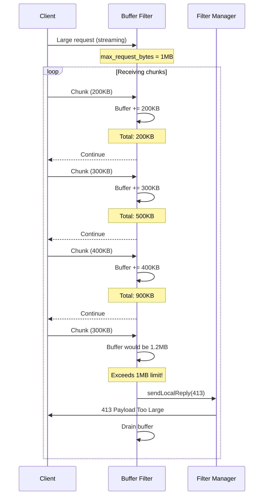

## Use Case Diagram

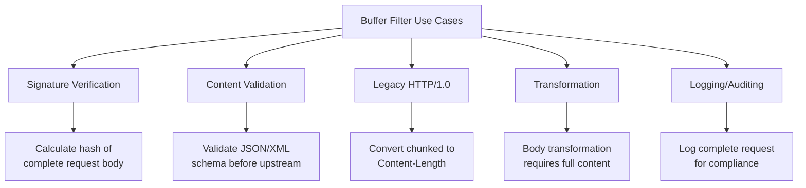

## Memory Management

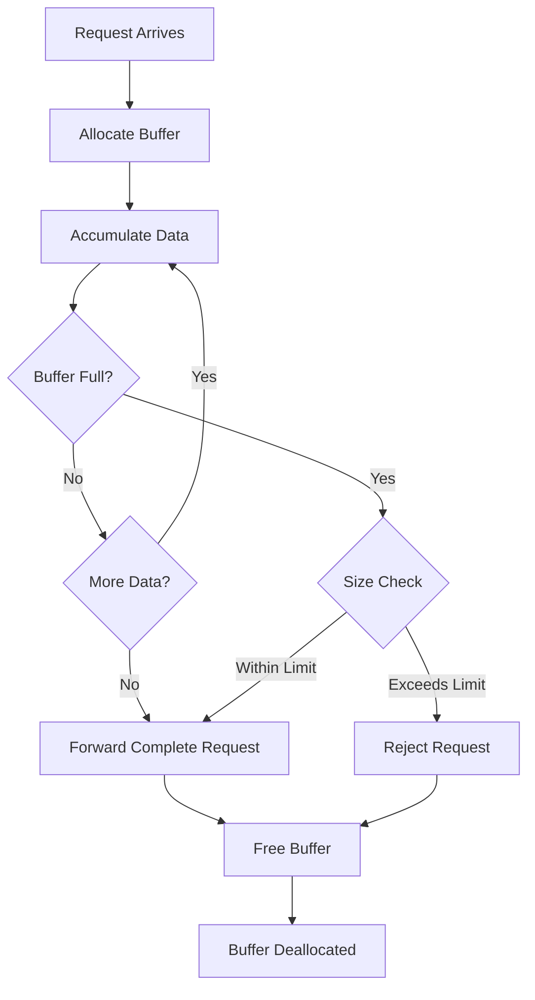

## Configuration with Runtime Override

```yaml
name: envoy.filters.http.buffer
typed_config:
  "@type": type.googleapis.com/envoy.extensions.filters.http.buffer.v3.Buffer
  max_request_bytes: 1048576  # Default 1 MB

# Runtime configuration (can override without restart)
runtime:
  layers:
    - name: admin
      admin_layer: {}
    - name: static
      static_layer:
        # Override max buffer size to 2MB
        envoy.http.buffer.max_request_bytes: 2097152
```

## Integration with Other Filters

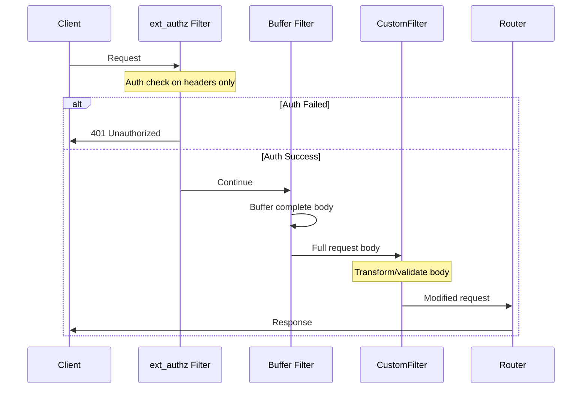

## Performance Considerations

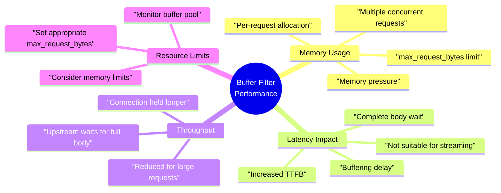

## Statistics

| Stat | Type | Description |
|------|------|-------------|
| buffer.rq_too_large | Counter | Requests exceeding max_request_bytes |
| buffer.rq_buffered | Counter | Requests successfully buffered |

## Common Use Cases

### 1. Request Signature Verification
Buffer entire request to compute HMAC/signature

```yaml
# AWS SigV4, similar patterns
routes:
  - match:
      prefix: "/api"
    route:
      cluster: api_cluster
    typed_per_filter_config:
      envoy.filters.http.buffer:
        "@type": type.googleapis.com/envoy.extensions.filters.http.buffer.v3.BufferPerRoute
        buffer:
          max_request_bytes: 1048576
```

### 2. Request Body Validation
Validate complete JSON/XML before forwarding

### 3. Logging/Auditing
Log complete request body for compliance

### 4. Body Transformation
Transform request body (requires full content)

### 5. Legacy Protocol Support
Convert chunked encoding to Content-Length

### 6. External Processing
Send complete request to ext_proc for processing

## Best Practices

1. **Set appropriate max_request_bytes** - Based on expected payload sizes
2. **Don't buffer large files** - Use streaming for uploads/downloads
3. **Monitor memory usage** - Buffer filter can consume significant memory
4. **Use per-route config** - Only buffer where necessary
5. **Consider upstream requirements** - Buffer only if upstream needs it
6. **Handle 413 gracefully** - Provide clear error messages
7. **Set client_max_body_size** - In conjunction with nginx/similar
8. **Test with production data sizes** - Avoid surprises
9. **Monitor rq_too_large stat** - Adjust limits if needed
10. **Disable for streaming APIs** - WebSocket, SSE, etc.

## When NOT to Use Buffer Filter

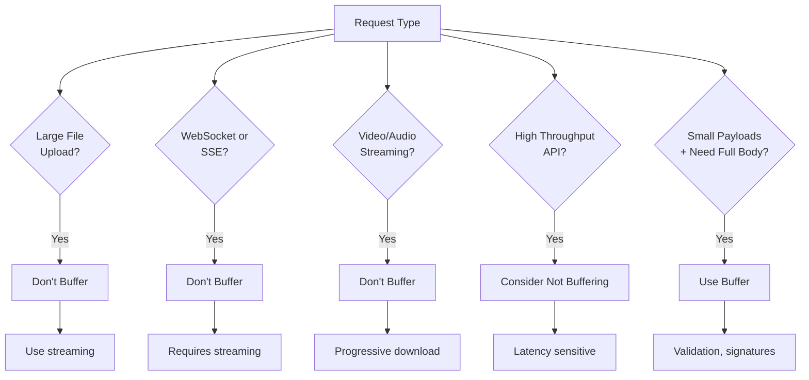

## Troubleshooting

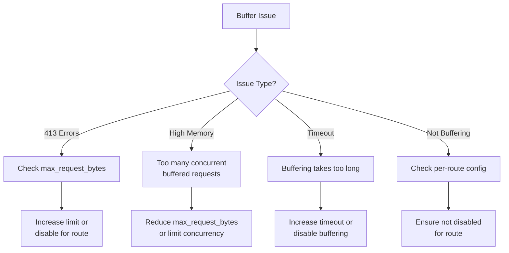

## Comparison: Buffer Filter vs Other Approaches

| Approach | When to Use | Pros | Cons |
|----------|-------------|------|------|
| Buffer Filter | Small payloads, need full body | Simple, built-in | Memory intensive |
| Streaming | Large payloads | Memory efficient | More complex |
| ext_proc | Complex processing | Flexible | Additional service |
| Lua Filter | Custom logic | Highly customizable | Requires scripting |

## Related Filters

- **ext_proc**: External processing of buffered requests
- **ext_authz**: Can buffer via with_request_body
- **lua**: Custom buffering logic
- **grpc_json_transcoder**: Requires full body

## References

- [Envoy Buffer Filter Documentation](https://www.envoyproxy.io/docs/envoy/latest/configuration/http/http_filters/buffer_filter)
- [HTTP Buffering Best Practices](https://www.envoyproxy.io/docs/envoy/latest/faq/performance/how_fast_is_envoy)
