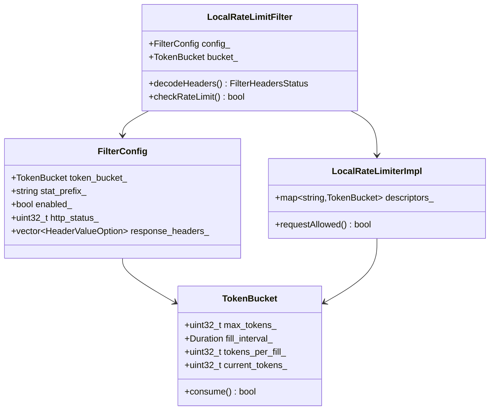
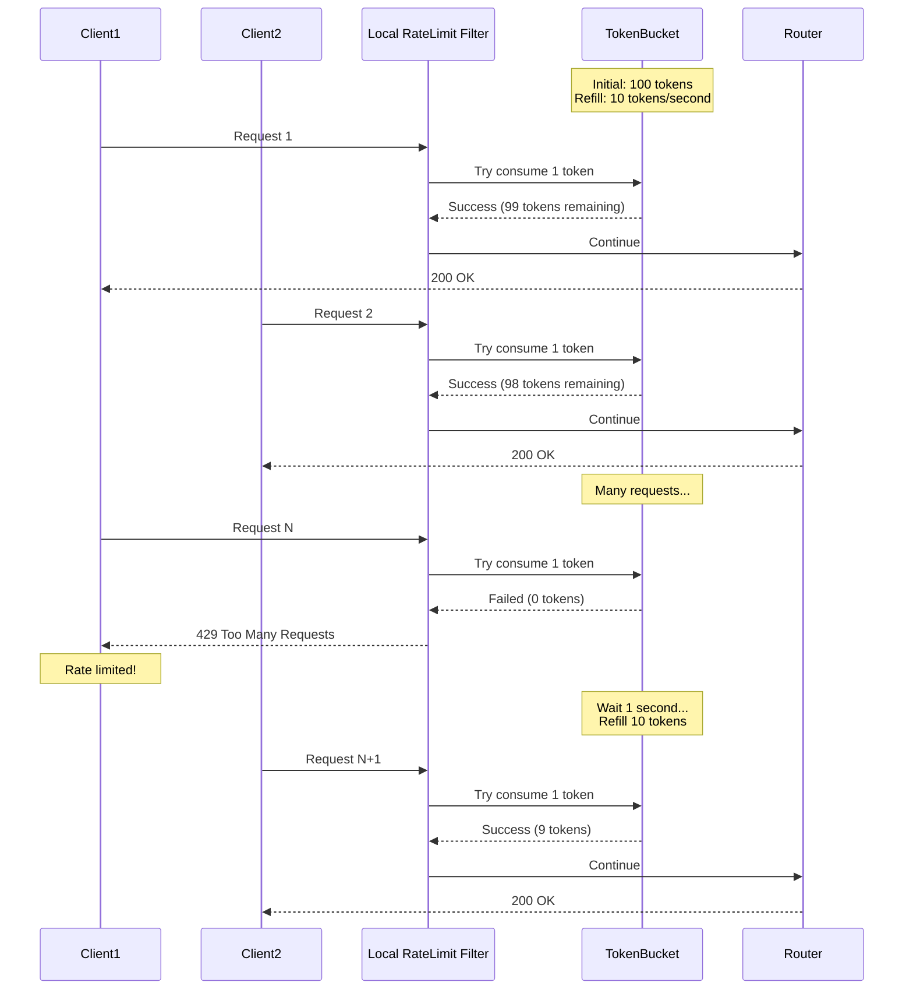
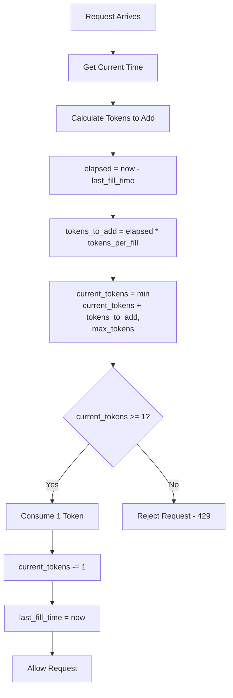
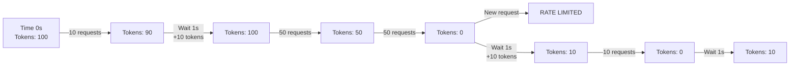
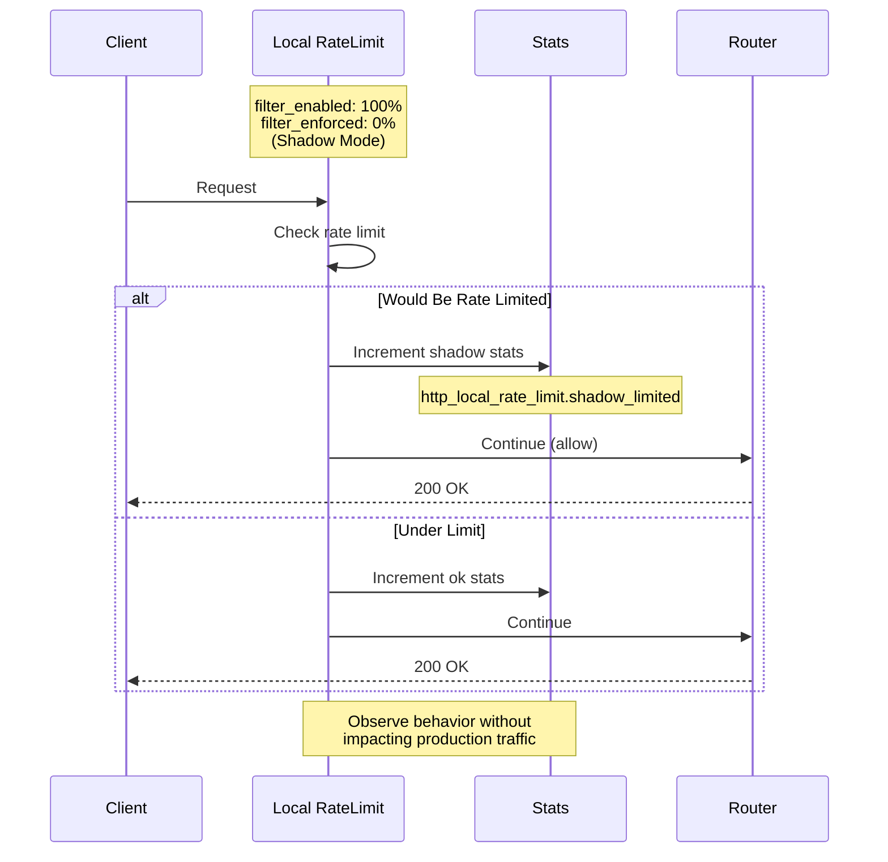
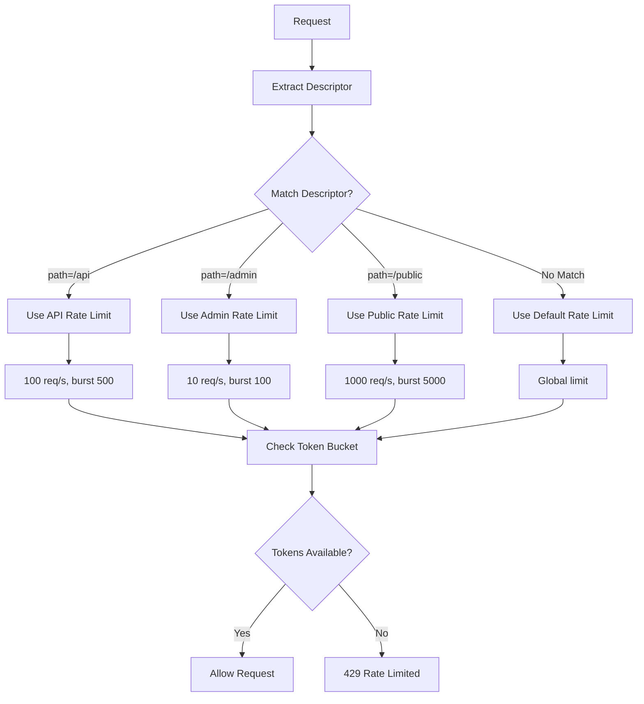
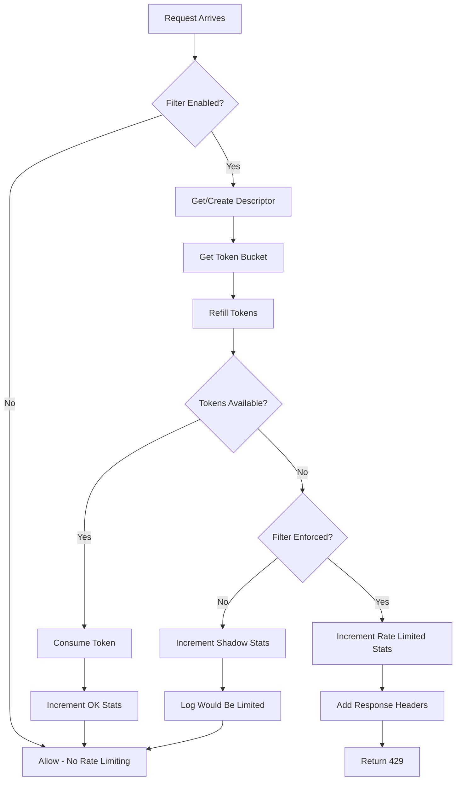
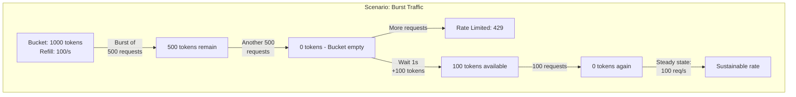
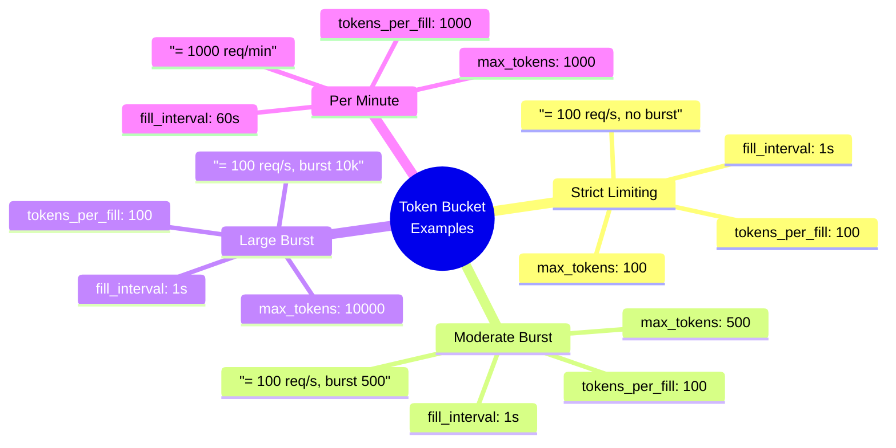
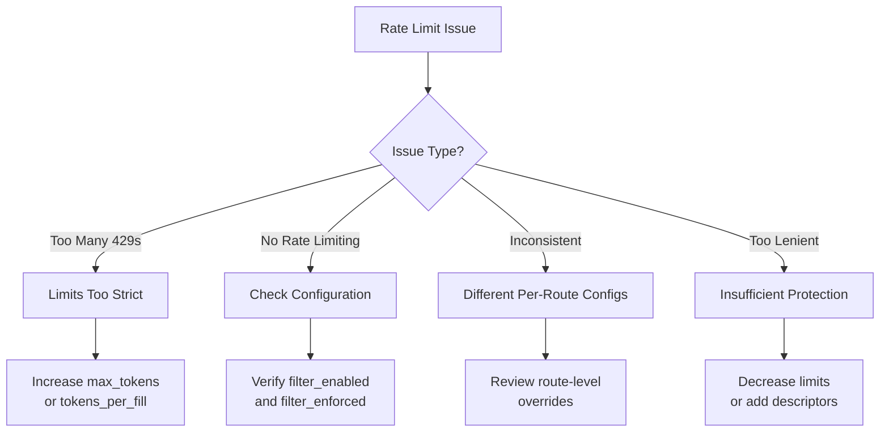

# Local Rate Limit Filter

## Overview

The Local Rate Limit filter implements rate limiting on a per-Envoy-instance basis using a token bucket algorithm. Unlike the global rate limit filter which calls an external service, this filter performs rate limiting locally, making it faster but limited to per-instance quotas. It's ideal for protecting against sudden traffic spikes and implementing connection/request limits.

## Key Responsibilities

- Per-instance rate limiting using token bucket
- Support multiple rate limit descriptors
- Local state management (no external service)
- Fast rate limit decisions (no network calls)
- Configurable response on rate limit
- Integration with virtual hosts and routes
- Statistical tracking

## Architecture



## Request Flow



## Token Bucket Algorithm



## Token Bucket State Over Time



## Configuration Example - Basic

```yaml
name: envoy.filters.http.local_ratelimit
typed_config:
  "@type": type.googleapis.com/envoy.extensions.filters.http.local_ratelimit.v3.LocalRateLimit
  stat_prefix: http_local_rate_limiter
  token_bucket:
    max_tokens: 100
    tokens_per_fill: 10
    fill_interval: 1s
  filter_enabled:
    runtime_key: local_rate_limit.enabled
    default_value:
      numerator: 100
      denominator: HUNDRED
  filter_enforced:
    runtime_key: local_rate_limit.enforced
    default_value:
      numerator: 100
      denominator: HUNDRED
  response_headers_to_add:
    - append_action: OVERWRITE_IF_EXISTS_OR_ADD
      header:
        key: "x-local-rate-limit"
        value: "true"
  status_code: 429
```

## Configuration Example - Advanced

```yaml
name: envoy.filters.http.local_ratelimit
typed_config:
  "@type": type.googleapis.com/envoy.extensions.filters.http.local_ratelimit.v3.LocalRateLimit
  stat_prefix: http_local_rate_limiter

  # Token bucket configuration
  token_bucket:
    max_tokens: 1000        # Bucket capacity
    tokens_per_fill: 100    # Tokens added per interval
    fill_interval: 1s       # Refill every second

  # Effective rate: 100 requests/second with burst up to 1000

  # Enable rate limiting
  filter_enabled:
    runtime_key: local_rate_limit.enabled
    default_value:
      numerator: 100
      denominator: HUNDRED

  # Enforce rate limiting (can be used for shadow mode)
  filter_enforced:
    runtime_key: local_rate_limit.enforced
    default_value:
      numerator: 100
      denominator: HUNDRED

  # Custom status code
  status_code: 429

  # Add response headers
  response_headers_to_add:
    - append_action: OVERWRITE_IF_EXISTS_OR_ADD
      header:
        key: "x-ratelimit-limit"
        value: "100"
    - append_action: OVERWRITE_IF_EXISTS_OR_ADD
      header:
        key: "x-ratelimit-remaining"
        value: "%DYNAMIC_METADATA(envoy.filters.http.local_ratelimit:token_bucket)%"

  # Descriptors for different rate limits
  descriptors:
    - entries:
        - key: "path"
          value: "/api"
      token_bucket:
        max_tokens: 500
        tokens_per_fill: 50
        fill_interval: 1s

    - entries:
        - key: "path"
          value: "/admin"
      token_bucket:
        max_tokens: 100
        tokens_per_fill: 10
        fill_interval: 1s
```

## Per-Route Configuration

```yaml
routes:
  - match:
      prefix: "/api/v1"
    route:
      cluster: api_v1_cluster
    typed_per_filter_config:
      envoy.filters.http.local_ratelimit:
        "@type": type.googleapis.com/envoy.extensions.filters.http.local_ratelimit.v3.LocalRateLimit
        token_bucket:
          max_tokens: 200
          tokens_per_fill: 20
          fill_interval: 1s

  - match:
      prefix: "/api/v2"
    route:
      cluster: api_v2_cluster
    typed_per_filter_config:
      envoy.filters.http.local_ratelimit:
        "@type": type.googleapis.com/envoy.extensions.filters.http.local_ratelimit.v3.LocalRateLimit
        token_bucket:
          max_tokens: 500
          tokens_per_fill: 50
          fill_interval: 1s

  - match:
      prefix: "/public"
    route:
      cluster: public_cluster
    typed_per_filter_config:
      envoy.filters.http.local_ratelimit:
        "@type": type.googleapis.com/envoy.extensions.filters.http.local_ratelimit.v3.LocalRateLimit
        token_bucket:
          max_tokens: 5000
          tokens_per_fill: 500
          fill_interval: 1s
```

## Shadow Mode (Monitoring)



## Descriptor-Based Rate Limiting



## Rate Limit Decision Flow



## Burst Handling



## Statistics

| Stat | Type | Description |
|------|------|-------------|
| http_local_rate_limit.enabled | Counter | Requests with rate limiting enabled |
| http_local_rate_limit.ok | Counter | Requests allowed |
| http_local_rate_limit.rate_limited | Counter | Requests rate limited |
| http_local_rate_limit.shadow_limited | Counter | Would be limited (shadow mode) |

## Common Use Cases

### 1. Connection Limiting
Limit connections per Envoy instance

```yaml
token_bucket:
  max_tokens: 10000      # Max concurrent connections
  tokens_per_fill: 1000  # New connections per second
  fill_interval: 1s
```

### 2. API Request Limiting
Limit requests per endpoint

```yaml
descriptors:
  - entries:
      - key: "path"
        value: "/api/search"
    token_bucket:
      max_tokens: 50
      tokens_per_fill: 10
      fill_interval: 1s
```

### 3. Burst Protection
Allow bursts but limit sustained rate

```yaml
token_bucket:
  max_tokens: 1000    # Allow burst of 1000
  tokens_per_fill: 100  # But sustained at 100/s
  fill_interval: 1s
```

### 4. DDoS Protection
Basic protection against volumetric attacks

### 5. Resource Protection
Protect expensive endpoints

### 6. Fair Usage
Prevent single client from monopolizing resources

## Token Bucket Calculation Examples



## Best Practices

1. **Set max_tokens for bursts** - Allow temporary traffic spikes
2. **Monitor shadow mode first** - Test limits before enforcing
3. **Use per-route limits** - Different limits for different endpoints
4. **Set appropriate fill_interval** - Usually 1s for simplicity
5. **Add informative headers** - Help clients understand limits
6. **Monitor rate_limited stat** - Adjust limits if too strict
7. **Combine with global rate limit** - For fleet-wide limits
8. **Test under load** - Verify limits work as expected
9. **Document rate limits** - Inform API consumers
10. **Use runtime overrides** - Adjust without restart

## Comparison: Local vs Global Rate Limiting

| Aspect | Local (this filter) | Global (ratelimit) |
|--------|---------------------|---------------------|
| State | Per-instance | Shared across fleet |
| Latency | Very low (local) | Higher (network call) |
| Accuracy | Per-instance only | Fleet-wide accurate |
| Complexity | Simple | Requires external service |
| Use Case | Instance protection | User/API key quotas |
| Failure Mode | N/A (local) | Configurable |
| Scaling | Scales with instances | Depends on service |

## Combined Local + Global Rate Limiting

```yaml
http_filters:
  # 1. Local rate limit (per-instance protection)
  - name: envoy.filters.http.local_ratelimit
    typed_config:
      "@type": type.googleapis.com/envoy.extensions.filters.http.local_ratelimit.v3.LocalRateLimit
      token_bucket:
        max_tokens: 10000
        tokens_per_fill: 1000
        fill_interval: 1s

  # 2. Global rate limit (per-user quotas)
  - name: envoy.filters.http.ratelimit
    typed_config:
      "@type": type.googleapis.com/envoy.extensions.filters.http.ratelimit.v3.RateLimit
      domain: "api_quotas"
      rate_limit_service:
        grpc_service:
          envoy_grpc:
            cluster_name: ratelimit_service

  # 3. Router (must be last)
  - name: envoy.filters.http.router
```

## Troubleshooting



## Testing Rate Limits

```bash
# Test rate limit with curl
for i in {1..150}; do
  curl -w "%{http_code}\n" -o /dev/null -s http://api.example.com/test
done

# Expected output:
# 200 (first 100 requests)
# 429 (next 50 requests)

# Test with Apache Bench
ab -n 1000 -c 10 http://api.example.com/test

# Test with wrk
wrk -t12 -c100 -d30s http://api.example.com/test
```

## Related Filters

- **ratelimit**: Global rate limiting with external service
- **ext_authz**: Can integrate rate limiting logic
- **rbac**: Can be combined for access control

## References

- [Envoy Local Rate Limit Filter Documentation](https://www.envoyproxy.io/docs/envoy/latest/configuration/http/http_filters/local_rate_limit_filter)
- [Token Bucket Algorithm](https://en.wikipedia.org/wiki/Token_bucket)
