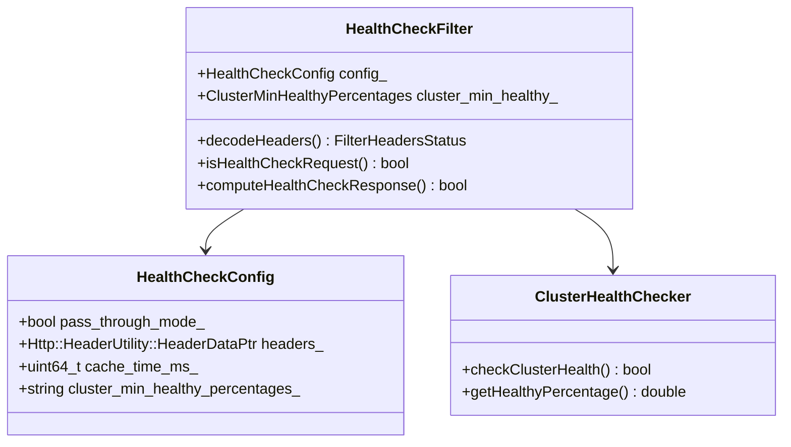
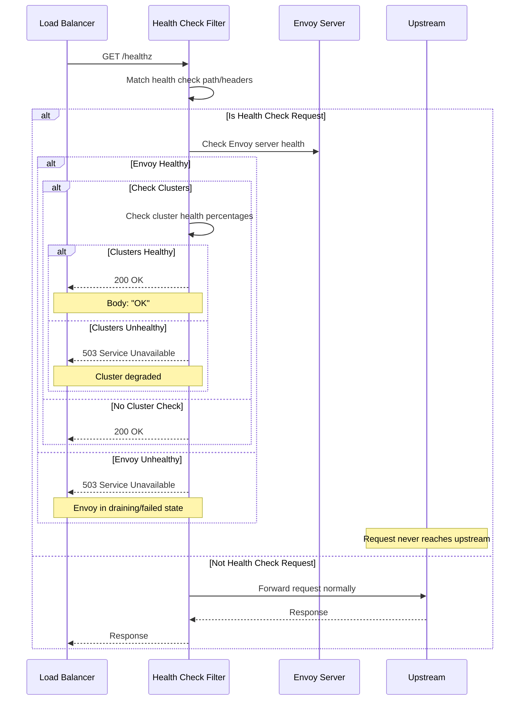
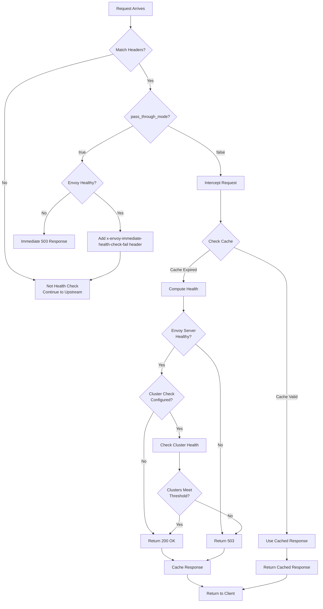
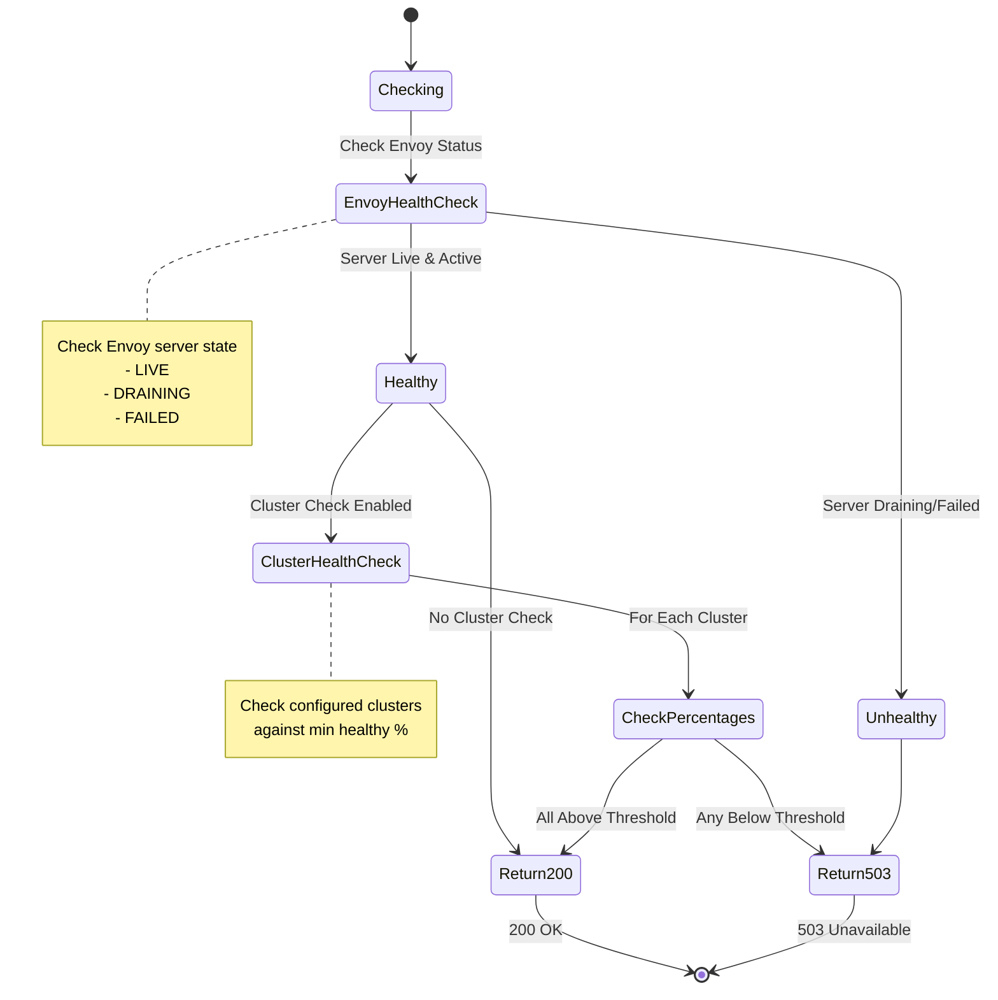
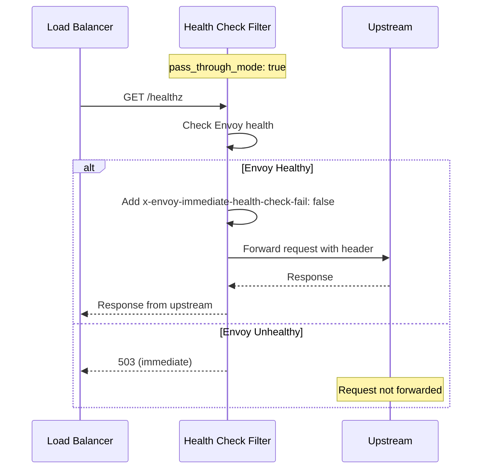
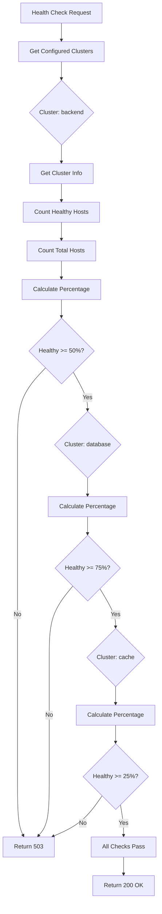
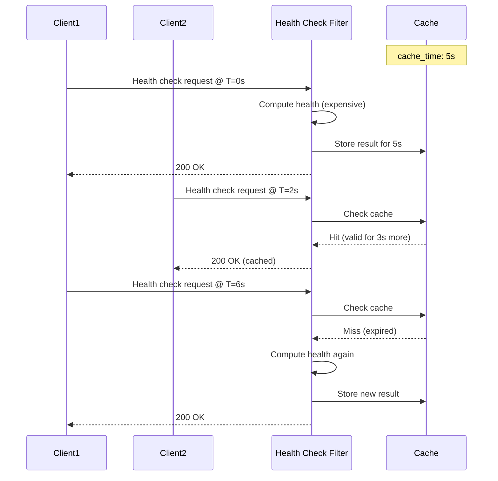
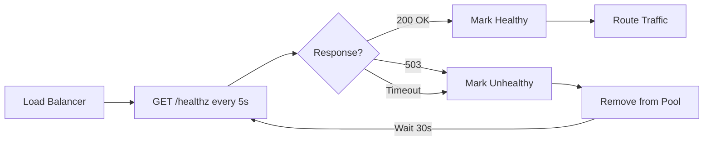
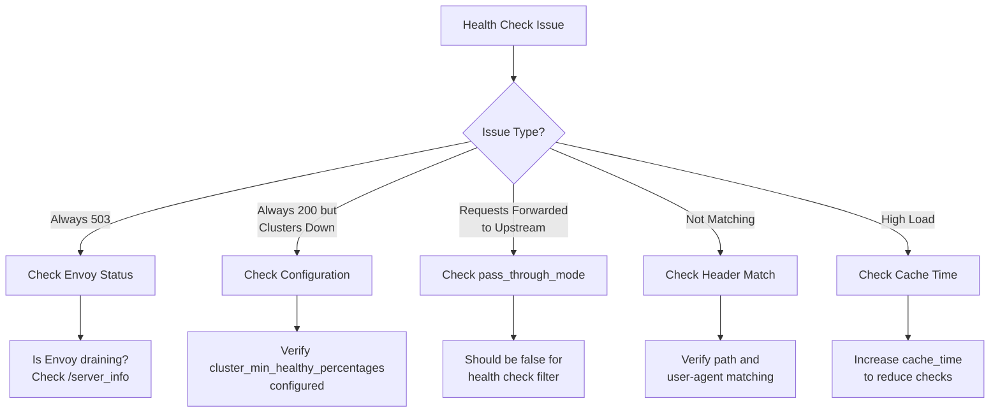

# Health Check Filter

## Overview

The Health Check filter responds to health check requests without forwarding them to upstream services. This is useful for load balancer health probes, Kubernetes liveness/readiness probes, and monitoring systems. The filter can respond based on Envoy's health status, cluster health, or custom logic.

## Key Responsibilities

- Intercept health check requests
- Respond without upstream calls
- Check Envoy server health status
- Validate cluster health
- Support pass-through mode
- Cache health check responses
- Provide custom health check endpoints

## Architecture



## Request Flow - Health Check Intercept



## Request Matching Flow



## Health Status Decision



## Configuration Example - Basic

```yaml
name: envoy.filters.http.health_check
typed_config:
  "@type": type.googleapis.com/envoy.extensions.filters.http.health_check.v3.HealthCheck
  pass_through_mode: false
  headers:
    - name: ":path"
      string_match:
        exact: "/healthz"
  cache_time: 1s
```

## Configuration Example - Advanced

```yaml
name: envoy.filters.http.health_check
typed_config:
  "@type": type.googleapis.com/envoy.extensions.filters.http.health_check.v3.HealthCheck

  # Don't forward health checks to upstream
  pass_through_mode: false

  # Match health check requests
  headers:
    - name: ":path"
      string_match:
        exact: "/healthz"
    - name: "user-agent"
      string_match:
        prefix: "health-checker"

  # Cache health check responses for 5 seconds
  cache_time: 5s

  # Require minimum healthy percentages for clusters
  cluster_min_healthy_percentages:
    backend_cluster: 50.0    # 50% of backend must be healthy
    database_cluster: 75.0   # 75% of database must be healthy
    cache_cluster: 25.0      # 25% of cache must be healthy
```

## Multiple Health Check Endpoints

```yaml
routes:
  # Liveness probe - just check if Envoy is alive
  - match:
      path: "/healthz/live"
    direct_response:
      status: 200
      body:
        inline_string: "LIVE"

  # Readiness probe - check if ready to serve traffic
  - match:
      path: "/healthz/ready"
    route:
      cluster: health_check_cluster
    typed_per_filter_config:
      envoy.filters.http.health_check:
        "@type": type.googleapis.com/envoy.extensions.filters.http.health_check.v3.HealthCheck
        pass_through_mode: false
        headers:
          - name: ":path"
            string_match:
              exact: "/healthz/ready"
        cluster_min_healthy_percentages:
          backend: 50.0

  # Startup probe - check if application started
  - match:
      path: "/healthz/startup"
    direct_response:
      status: 200
      body:
        inline_string: "STARTED"
```

## Pass-Through Mode



## Cluster Health Checking



## Caching Behavior



## Kubernetes Integration

```yaml
apiVersion: v1
kind: Pod
metadata:
  name: envoy-proxy
spec:
  containers:
    - name: envoy
      image: envoyproxy/envoy:latest
      ports:
        - containerPort: 10000
      livenessProbe:
        httpGet:
          path: /healthz/live
          port: 9901  # Admin port
        initialDelaySeconds: 30
        periodSeconds: 10

      readinessProbe:
        httpGet:
          path: /healthz/ready
          port: 10000  # Listener port
        initialDelaySeconds: 5
        periodSeconds: 5

      startupProbe:
        httpGet:
          path: /healthz/startup
          port: 9901
        initialDelaySeconds: 0
        periodSeconds: 5
        failureThreshold: 30
```

## Load Balancer Configuration



## Health Check Response Customization

```yaml
name: envoy.filters.http.health_check
typed_config:
  "@type": type.googleapis.com/envoy.extensions.filters.http.health_check.v3.HealthCheck
  pass_through_mode: false
  headers:
    - name: ":path"
      string_match:
        exact: "/health"

# Note: Response customization typically done via direct_response route
routes:
  - match:
      path: "/health"
    direct_response:
      status: 200
      body:
        inline_string: |
          {
            "status": "healthy",
            "version": "1.0.0",
            "uptime": "3d 5h 23m"
          }
```

## Common Use Cases

### 1. Load Balancer Health Probes
```yaml
headers:
  - name: ":path"
    string_match:
      exact: "/health"
  - name: "user-agent"
    string_match:
      prefix: "ELB-HealthChecker"
```

### 2. Kubernetes Liveness/Readiness
```yaml
# Different endpoints for different probes
- match: { path: "/healthz/live" }   # Liveness
- match: { path: "/healthz/ready" }  # Readiness
```

### 3. Monitoring Systems
```yaml
headers:
  - name: ":path"
    string_match:
      exact: "/status"
cache_time: 10s  # Reduce load from frequent checks
```

### 4. Canary Deployments
```yaml
# Check if new version is healthy before routing traffic
cluster_min_healthy_percentages:
  canary_cluster: 100.0  # All canary instances must be healthy
```

## Statistics

| Stat | Type | Description |
|------|------|-------------|
| health_check.ok | Counter | Health check requests returned 200 |
| health_check.degraded | Counter | Health check requests returned 503 |

## Best Practices

1. **Use separate endpoints** - Different checks for liveness vs readiness
2. **Set appropriate cache_time** - Balance freshness vs load
3. **Don't forward to upstream** - Use pass_through_mode: false
4. **Check critical clusters only** - Avoid checking all clusters
5. **Set reasonable thresholds** - 50-75% typically sufficient
6. **Monitor health check metrics** - Track degraded responses
7. **Test failure scenarios** - Ensure probes work correctly
8. **Use admin endpoint** - For Envoy-specific health
9. **Document health check paths** - For operations teams
10. **Consider geo-distribution** - Different thresholds per region

## Admin Health Check Endpoint

Envoy provides a built-in health check endpoint on the admin interface:

```bash
# Check Envoy server health
curl http://localhost:9901/healthcheck/ok

# Response: 200 OK if healthy, 503 if not

# Check if Envoy is ready (not draining)
curl http://localhost:9901/ready

# Fail health checks (put in drain mode)
curl -X POST http://localhost:9901/healthcheck/fail

# Pass health checks again
curl -X POST http://localhost:9901/healthcheck/ok
```

## Troubleshooting



## Header Matching Examples

```yaml
# Match by path only
headers:
  - name: ":path"
    string_match:
      exact: "/healthz"

# Match by path and user-agent
headers:
  - name: ":path"
    string_match:
      exact: "/health"
  - name: "user-agent"
    string_match:
      prefix: "kube-probe"

# Match by custom header
headers:
  - name: "x-health-check"
    string_match:
      exact: "true"

# Match multiple paths
headers:
  - name: ":path"
    string_match:
      safe_regex:
        regex: "^/(health|healthz|ping)$"
```

## Comparison: Health Check Methods

| Method | Use Case | Complexity | Upstream Load |
|--------|----------|------------|---------------|
| Health Check Filter | Health probes | Low | None |
| Admin Endpoint | Envoy status | Very Low | None |
| Direct Response | Simple checks | Very Low | None |
| Pass-Through | Upstream health | Medium | High |

## Related Features

- **Admin Interface**: Built-in health endpoints
- **Cluster Health**: Upstream health checking
- **Outlier Detection**: Automatic unhealthy host removal

## References

- [Envoy Health Check Filter Documentation](https://www.envoyproxy.io/docs/envoy/latest/configuration/http/http_filters/health_check_filter)
- [Admin Interface](https://www.envoyproxy.io/docs/envoy/latest/operations/admin)
- [Kubernetes Probes](https://kubernetes.io/docs/tasks/configure-pod-container/configure-liveness-readiness-startup-probes/)
