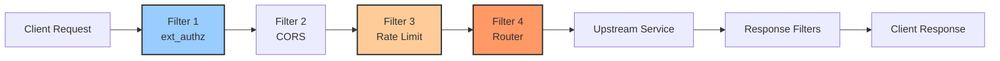
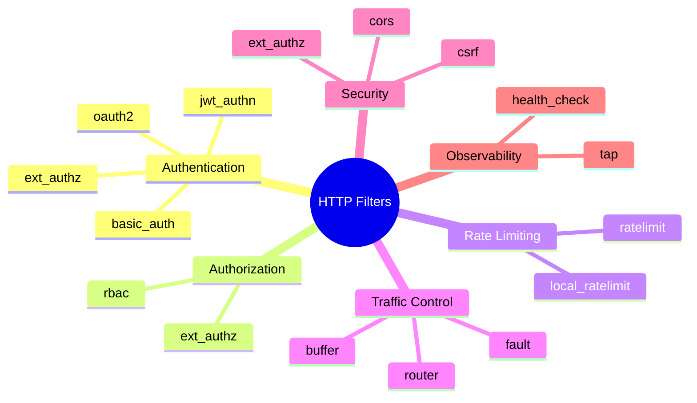
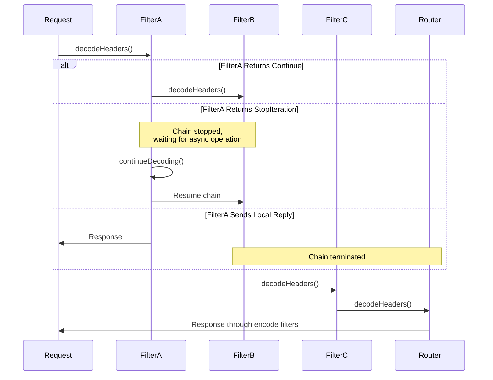

# Envoy HTTP Filters Documentation

This directory contains comprehensive documentation for the most important HTTP filters in Envoy, with detailed explanations, architecture diagrams, sequence flows, and configuration examples.

## Overview

HTTP filters in Envoy form a processing pipeline for HTTP requests and responses. Each filter can inspect, modify, or take action on the traffic passing through Envoy. Filters are executed in order and can stop the filter chain, allowing for powerful traffic management, security, and observability features.

## Filter Processing Pipeline



## Documentation Index

### Core Routing
- **[01_router.md](01_router.md)** - Router Filter
  - The most critical filter that routes requests to upstream clusters
  - Handles load balancing, retries, timeouts, and traffic shadowing
  - Must be the last filter in the HTTP filter chain

### Authentication & Authorization
- **[02_ext_authz.md](02_ext_authz.md)** - External Authorization Filter
  - Calls external service for authorization decisions
  - Supports gRPC and HTTP protocols
  - Request body buffering and header manipulation

- **[03_jwt_authn.md](03_jwt_authn.md)** - JWT Authentication Filter
  - Validates JSON Web Tokens
  - JWKS fetching and caching
  - Claims extraction and forwarding

- **[05_rbac.md](05_rbac.md)** - Role-Based Access Control Filter
  - Local policy-based authorization
  - Powerful principal and permission matchers
  - No external service required

### Rate Limiting
- **[04_ratelimit.md](04_ratelimit.md)** - Global Rate Limit Filter
  - Fleet-wide rate limiting via external service
  - Flexible descriptor generation
  - Supports Redis-backed rate limit service

- **[09_local_ratelimit.md](09_local_ratelimit.md)** - Local Rate Limit Filter
  - Per-instance rate limiting
  - Token bucket algorithm
  - Fast, no external dependencies

### Traffic Management
- **[06_cors.md](06_cors.md)** - CORS Filter
  - Cross-Origin Resource Sharing support
  - Preflight request handling
  - Flexible origin matching

- **[07_fault.md](07_fault.md)** - Fault Injection Filter
  - Chaos engineering and resilience testing
  - Inject delays and aborts
  - Percentage-based and header-driven faults

- **[08_buffer.md](08_buffer.md)** - Buffer Filter
  - Buffer complete request before forwarding
  - Useful for signature verification and validation
  - Configurable buffer size limits

### Observability & Operations
- **[10_health_check.md](10_health_check.md)** - Health Check Filter
  - Respond to health probes without upstream calls
  - Cluster health validation
  - Kubernetes liveness/readiness probe support

## Filter Categories



## Quick Reference Guide

### When to Use Which Filter

| Use Case | Recommended Filter(s) | Priority |
|----------|----------------------|----------|
| Validate JWT tokens | jwt_authn | High |
| External auth service | ext_authz | High |
| Local policy enforcement | rbac | Medium |
| API rate limiting (fleet-wide) | ratelimit | High |
| Instance protection | local_ratelimit | Medium |
| CORS for web apps | cors | High |
| Chaos testing | fault | Low |
| Request body validation | buffer + custom logic | Medium |
| Load balancer probes | health_check | High |

### Filter Order Recommendations

```yaml
http_filters:
  # 1. Health checks (early exit for probes)
  - name: envoy.filters.http.health_check

  # 2. Rate limiting (protect against abuse)
  - name: envoy.filters.http.local_ratelimit

  # 3. CORS (handle preflight early)
  - name: envoy.filters.http.cors

  # 4. Authentication (verify identity)
  - name: envoy.filters.http.jwt_authn

  # 5. Authorization (check permissions)
  - name: envoy.filters.http.ext_authz
  # OR
  - name: envoy.filters.http.rbac

  # 6. Global rate limiting (per-user quotas)
  - name: envoy.filters.http.ratelimit

  # 7. Fault injection (testing)
  - name: envoy.filters.http.fault

  # 8. Request buffering (if needed)
  - name: envoy.filters.http.buffer

  # 9. Router (MUST BE LAST)
  - name: envoy.filters.http.router
```

## Common Filter Patterns

### Pattern 1: Secure API Gateway

```yaml
# Comprehensive security stack
http_filters:
  - name: envoy.filters.http.cors
  - name: envoy.filters.http.jwt_authn
  - name: envoy.filters.http.rbac
  - name: envoy.filters.http.ratelimit
  - name: envoy.filters.http.router
```

### Pattern 2: Simple Proxy

```yaml
# Minimal configuration
http_filters:
  - name: envoy.filters.http.router
```

### Pattern 3: Testing/Staging Environment

```yaml
# With fault injection and relaxed CORS
http_filters:
  - name: envoy.filters.http.cors
  - name: envoy.filters.http.fault
  - name: envoy.filters.http.router
```

### Pattern 4: High-Security Service

```yaml
# Multiple auth layers
http_filters:
  - name: envoy.filters.http.local_ratelimit  # DDoS protection
  - name: envoy.filters.http.jwt_authn         # Token validation
  - name: envoy.filters.http.ext_authz         # External policy
  - name: envoy.filters.http.rbac              # Local enforcement
  - name: envoy.filters.http.router
```

## Filter Lifecycle



## Performance Considerations

### Filter Performance Impact

| Filter | Latency | Memory | CPU | Notes |
|--------|---------|--------|-----|-------|
| router | Low | Low | Low | Essential, well-optimized |
| jwt_authn | Medium | Medium | Medium | JWKS fetch can be slow |
| ext_authz | High | Low | Low | Network call to auth service |
| rbac | Low | Low | Low | Local evaluation |
| ratelimit | Medium | Low | Low | Network call to rate limit service |
| local_ratelimit | Very Low | Low | Low | Local, very fast |
| cors | Very Low | Low | Low | Header manipulation only |
| fault | Low | Low | Low | Minimal overhead |
| buffer | Medium | High | Low | Buffers request body |
| health_check | Very Low | Low | Low | Early exit |

## Best Practices

1. **Order Matters**: Place filters in the correct order
   - Fast filters first (health_check, local_ratelimit)
   - Authentication before authorization
   - Router always last

2. **Use Per-Route Configuration**: Override global settings per route
   ```yaml
   typed_per_filter_config:
     envoy.filters.http.cors:
       "@type": type.googleapis.com/envoy.extensions.filters.http.cors.v3.CorsPolicy
   ```

3. **Monitor Filter Statistics**: Track filter behavior
   ```bash
   curl http://localhost:9901/stats | grep http_filter
   ```

4. **Test in Stages**: Enable filters progressively
   - Start with shadow mode (where available)
   - Monitor metrics before enforcing
   - Roll back quickly if issues arise

5. **Use Runtime Configuration**: Dynamic configuration without restart
   ```yaml
   filter_enabled:
     runtime_key: feature.enabled
     default_value:
       numerator: 100
   ```

6. **Optimize for Your Use Case**:
   - Don't add unnecessary filters
   - Configure appropriate timeouts
   - Set reasonable buffer/rate limits
   - Use caching where applicable

## Debugging Filters

### Enable Debug Logging

```yaml
admin:
  access_log_path: /tmp/admin_access.log
  address:
    socket_address:
      address: 127.0.0.1
      port_value: 9901

# Set log level via admin interface
# curl -X POST http://localhost:9901/logging?filter=debug
# curl -X POST http://localhost:9901/logging?jwt=trace
```

### Check Filter Statistics

```bash
# View all stats
curl http://localhost:9901/stats

# Filter-specific stats
curl http://localhost:9901/stats | grep "http\\..*\\.rbac"
curl http://localhost:9901/stats | grep "jwt_authn"
curl http://localhost:9901/stats | grep "ext_authz"
```

### Access Logs

```yaml
access_log:
  - name: envoy.access_loggers.file
    typed_config:
      "@type": type.googleapis.com/envoy.extensions.access_loggers.file.v3.FileAccessLog
      path: /var/log/envoy/access.log
      format: "[%START_TIME%] %REQ(:METHOD)% %REQ(X-ENVOY-ORIGINAL-PATH?:PATH)% %PROTOCOL% %RESPONSE_CODE% %RESPONSE_FLAGS% %BYTES_RECEIVED% %BYTES_SENT% %DURATION% %RESP(X-ENVOY-UPSTREAM-SERVICE-TIME)% %REQ(X-FORWARDED-FOR)% %REQ(USER-AGENT)% %REQ(X-REQUEST-ID)% %REQ(:AUTHORITY)% %UPSTREAM_HOST%\n"
```

## Additional Resources

### Official Envoy Documentation
- [HTTP Filters Overview](https://www.envoyproxy.io/docs/envoy/latest/configuration/http/http_filters/http_filters)
- [Filter Development Guide](https://www.envoyproxy.io/docs/envoy/latest/extending/extending)

### Related Documentation
- [Envoy API Reference](https://www.envoyproxy.io/docs/envoy/latest/api-v3/api)
- [Configuration Reference](https://www.envoyproxy.io/docs/envoy/latest/configuration/configuration)

### Community
- [Envoy Slack](https://envoyproxy.slack.com)
- [GitHub Repository](https://github.com/envoyproxy/envoy)
- [Mailing List](https://groups.google.com/forum/#!forum/envoy-users)

## Contributing

To add documentation for additional filters:

1. Follow the existing format and structure
2. Include Mermaid diagrams for visualization
3. Provide configuration examples
4. Document common use cases and best practices
5. Add troubleshooting guidance
6. Update this README with links

## Filter Documentation Template

Each filter document should include:

- **Overview**: What the filter does
- **Key Responsibilities**: Main functions
- **Architecture**: Class diagram showing components
- **Request Flow**: Sequence diagrams
- **Configuration Examples**: Basic and advanced
- **State Machines**: Where applicable
- **Statistics**: Available metrics
- **Common Use Cases**: Real-world scenarios
- **Best Practices**: Recommendations
- **Related Filters**: Integration points
- **References**: Links to official docs

---

*Last Updated: 2026-02-28*
*Envoy Version: Latest (4.x)*
