# Part 1: Istio-Envoy Architecture Overview

## Table of Contents
1. [Introduction](#introduction)
2. [Istio Architecture](#istio-architecture)
3. [Envoy as Data Plane](#envoy-as-data-plane)
4. [Control Plane to Data Plane Communication](#control-plane-to-data-plane-communication)
5. [xDS Protocol Overview](#xds-protocol-overview)
6. [Configuration Flow Overview](#configuration-flow-overview)

## Introduction

Istio is a service mesh that provides traffic management, security, and observability for microservices. Envoy proxy serves as the data plane, with Istio's control plane (Istiod) managing configuration distribution to all Envoy proxies in the mesh.

This document series explains how configuration flows from Istio to Envoy, how it's processed, and how it affects runtime behavior.

## Istio Architecture

### High-Level Architecture

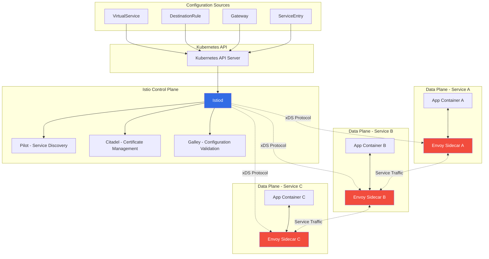

### Components Breakdown

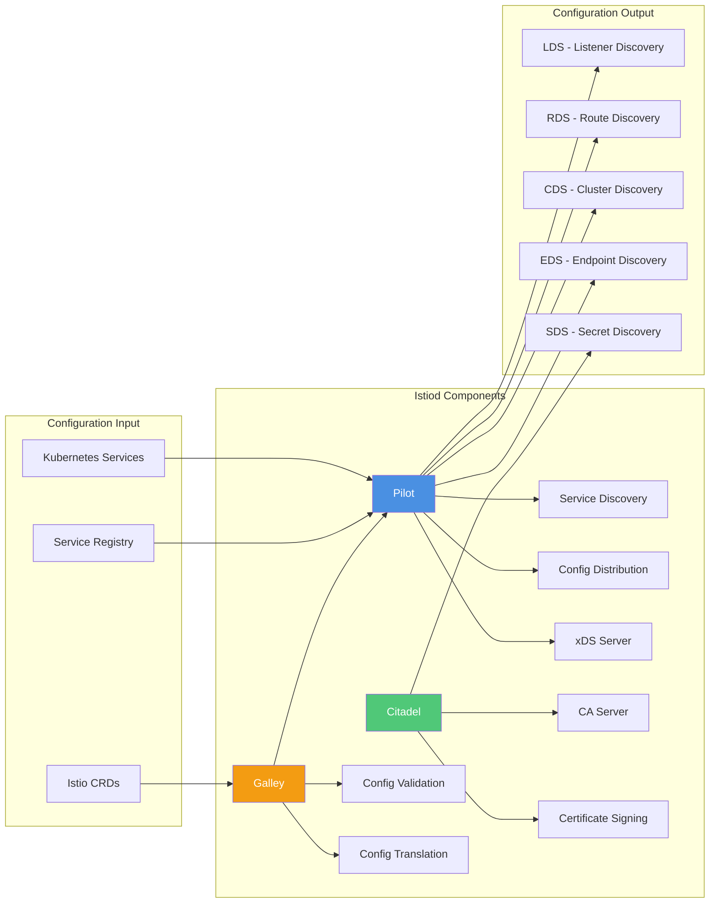

## Envoy as Data Plane

### Envoy Sidecar Deployment

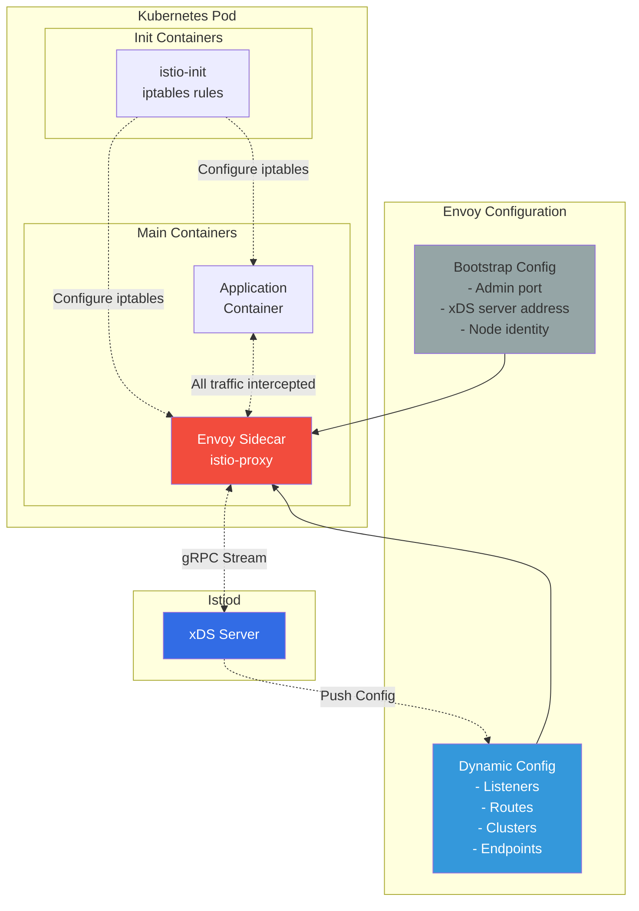

### Envoy Bootstrap Configuration

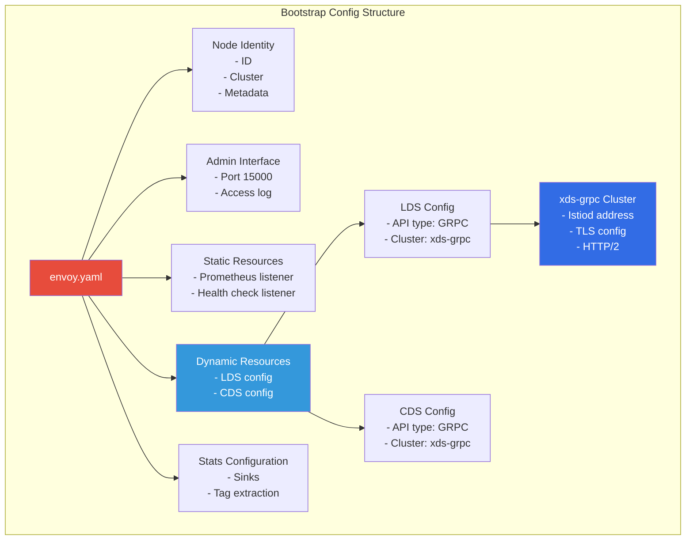

## Control Plane to Data Plane Communication

### Communication Flow

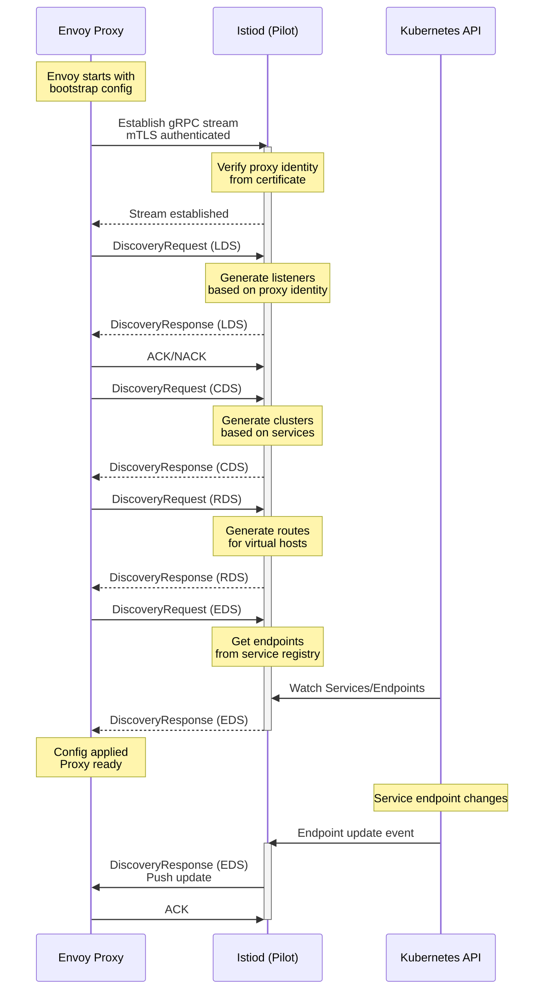

### xDS Protocol Stack

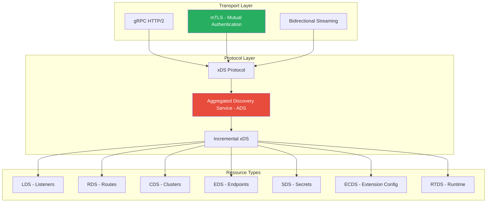

## xDS Protocol Overview

### xDS API Types

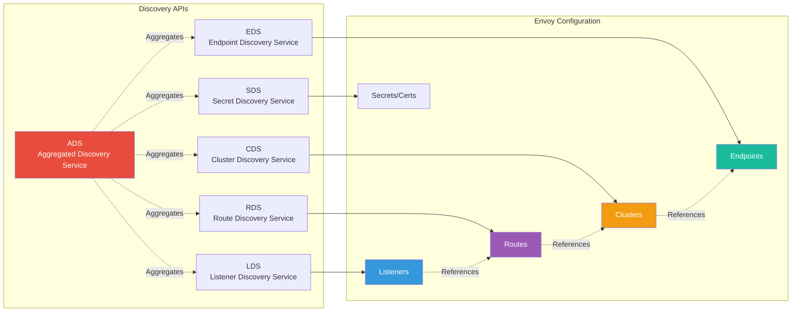

### xDS Resource Dependencies

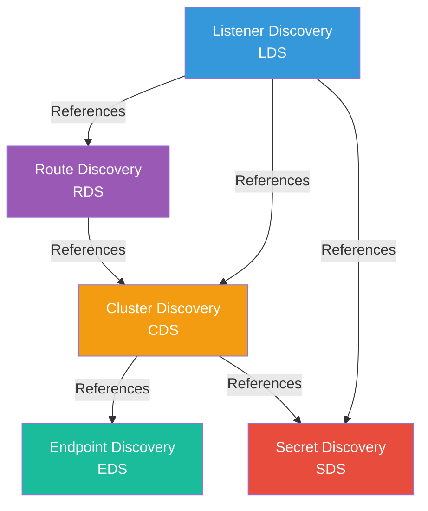

## Configuration Flow Overview

### End-to-End Configuration Flow

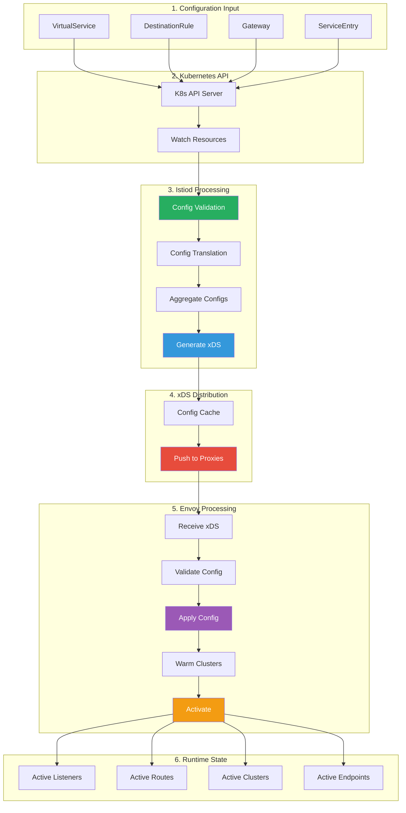

### Configuration Lifecycle States

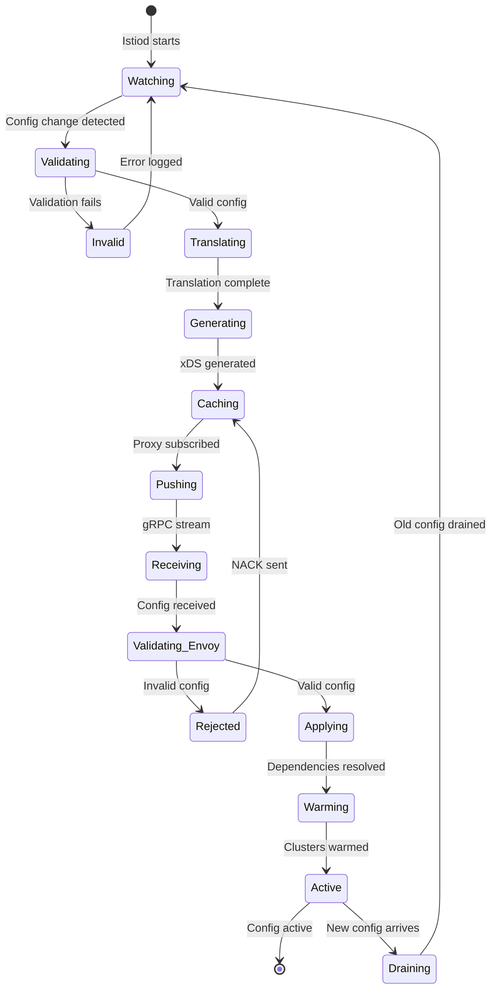

## Key Concepts

### Configuration Update Model

```mermaid
graph TB
    subgraph "Push Model"
        P1[Config Change]
        P2[Istiod Detects]
        P3[Push to All Proxies]
        P4[Immediate Update]

        P1 --> P2
        P2 --> P3
        P3 --> P4
    end

    subgraph "Request-Response Model"
        R1[Envoy Requests]
        R2[Istiod Responds]
        R3[Envoy Polls]

        R1 --> R2
        R2 --> R3
        R3 --> R1
    end

    subgraph "Istio xDS Model"
        I1[Streaming gRPC]
        I2[Bidirectional]
        I3[Request + Push]
        I4[Incremental Updates]

        I1 --> I2
        I2 --> I3
        I3 --> I4
    end

    style I1 fill:#E74C3C,color:#fff
    style I2 fill:#3498DB,color:#fff
    style I3 fill:#27AE60,color:#fff
```

### Version and Nonce Handling

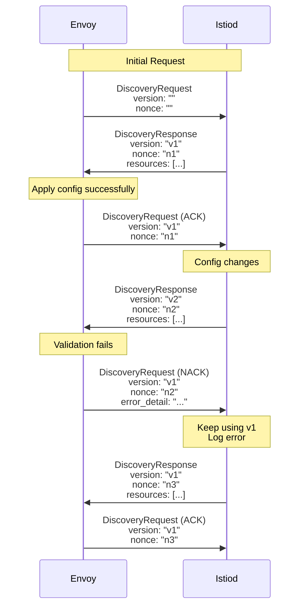

## Summary

This document provides an overview of the Istio-Envoy architecture:

1. **Istio Control Plane**: Istiod manages service mesh configuration
2. **Envoy Data Plane**: Sidecar proxies handle all service traffic
3. **xDS Protocol**: gRPC-based streaming protocol for config distribution
4. **Configuration Flow**: From Kubernetes CRDs to active Envoy configuration
5. **Update Model**: Streaming, bidirectional, incremental updates

### Key Takeaways

- Istio uses Envoy as its data plane proxy
- Configuration flows from Istio CRDs → Kubernetes API → Istiod → Envoy
- xDS protocol provides dynamic, zero-downtime configuration updates
- Multiple xDS APIs (LDS, RDS, CDS, EDS, SDS) with dependencies
- Version control with ACK/NACK mechanism ensures reliability

## Next Steps

Continue to **Part 2: Istio Configuration Resources** to understand the Istio CRDs that define service mesh behavior.

---

**Document Version**: 1.0
**Last Updated**: 2026-02-28
**Related Documentation**:
- [Envoy xDS Protocol](https://www.envoyproxy.io/docs/envoy/latest/api-docs/xds_protocol)
- [Istio Architecture](https://istio.io/latest/docs/ops/deployment/architecture/)
