# Part 2: Istio Configuration Resources

## Table of Contents
1. [Introduction](#introduction)
2. [Istio CRD Overview](#istio-crd-overview)
3. [VirtualService](#virtualservice)
4. [DestinationRule](#destinationrule)
5. [Gateway](#gateway)
6. [ServiceEntry](#serviceentry)
7. [Configuration Translation to Envoy](#configuration-translation-to-envoy)
8. [Complete Example](#complete-example)

## Introduction

Istio uses Kubernetes Custom Resource Definitions (CRDs) to define service mesh behavior. These high-level configurations are translated by Istiod into low-level Envoy xDS configurations.

## Istio CRD Overview

### Istio Configuration Resources

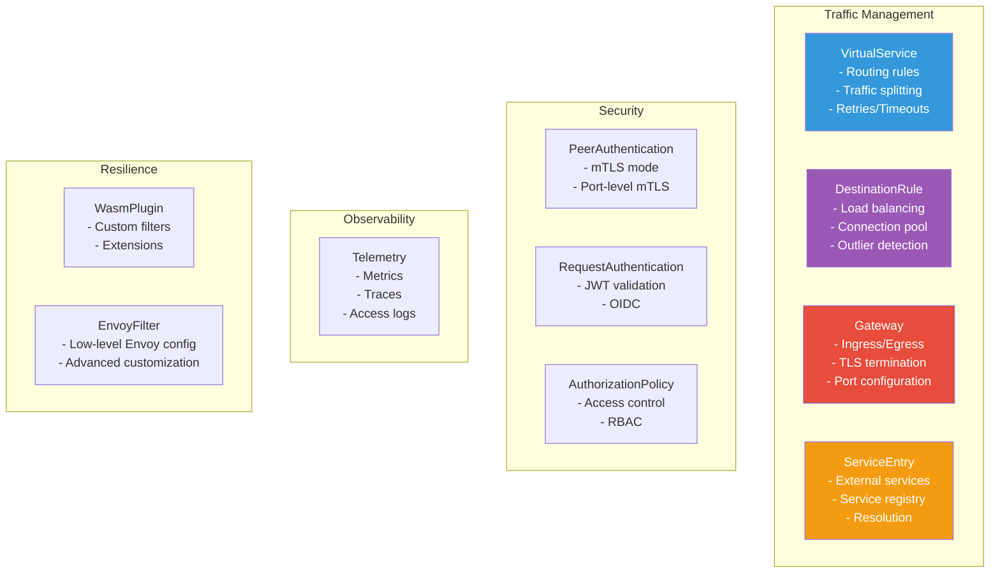

### CRD Relationships

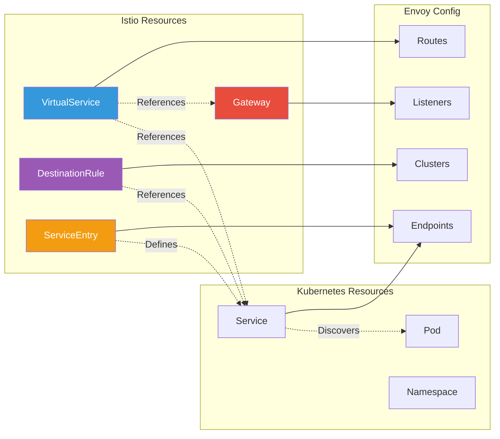

## VirtualService

### VirtualService Structure

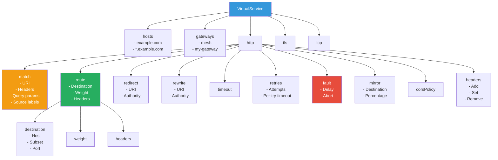

### VirtualService Example and Translation

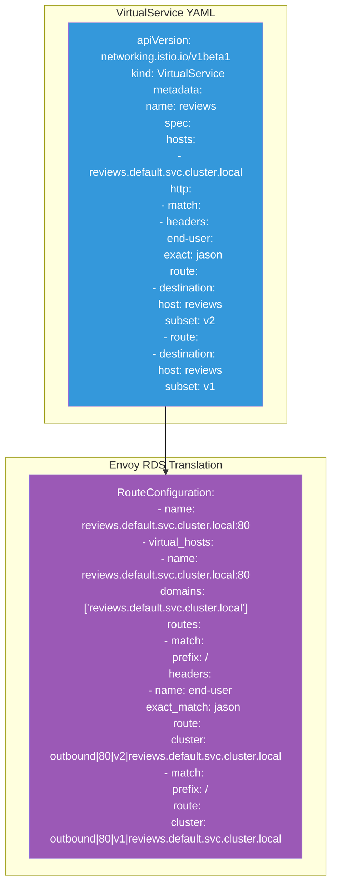

### Traffic Splitting Flow

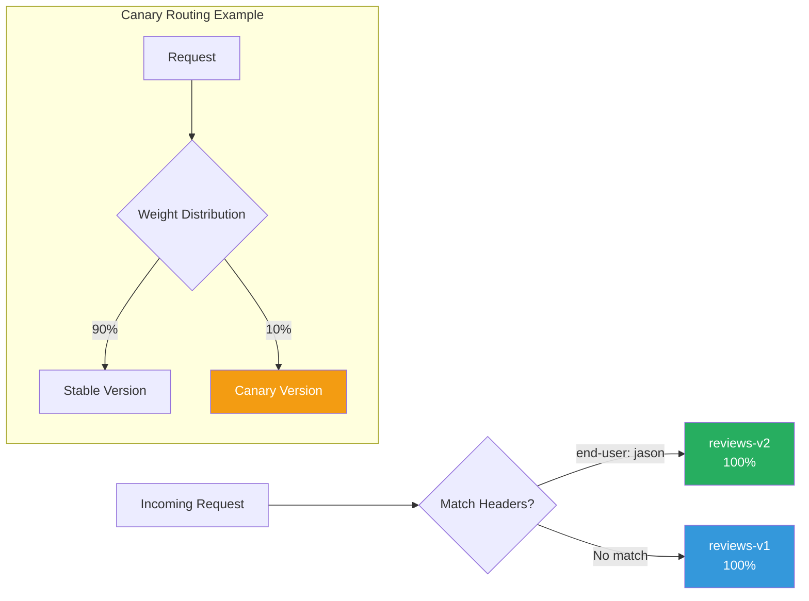

## DestinationRule

### DestinationRule Structure

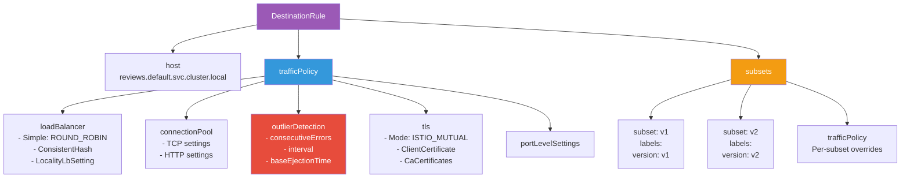

### DestinationRule to Envoy CDS Translation

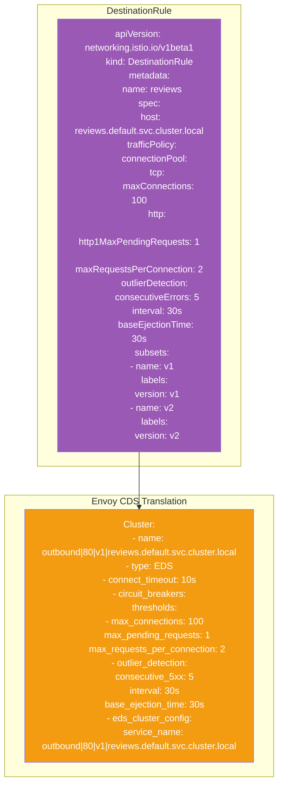

### Load Balancing Algorithms

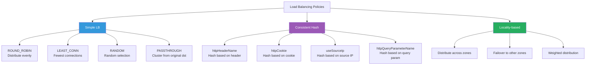

## Gateway

### Gateway Structure

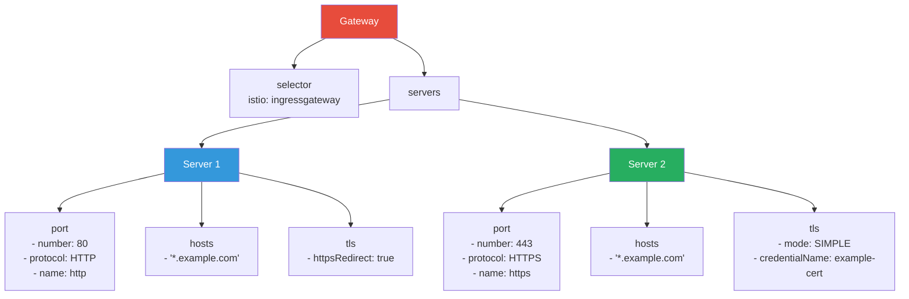

### Gateway to Envoy LDS Translation

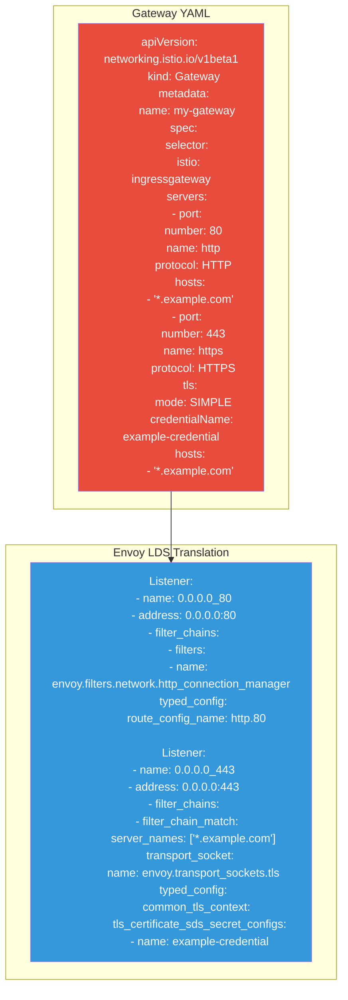

### Gateway Request Flow

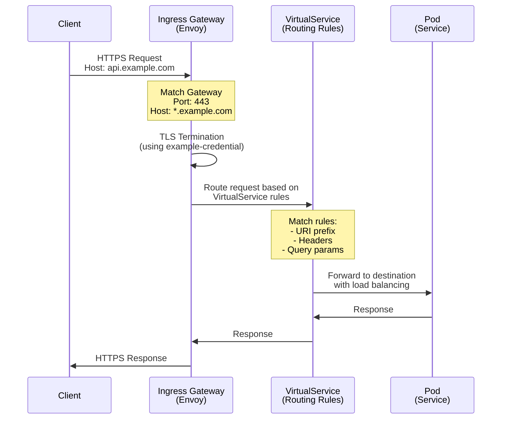

## ServiceEntry

### ServiceEntry Structure

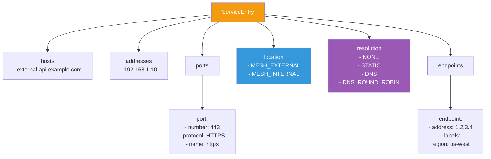

### ServiceEntry Use Cases

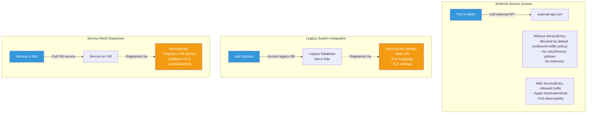

## Configuration Translation to Envoy

### Translation Pipeline

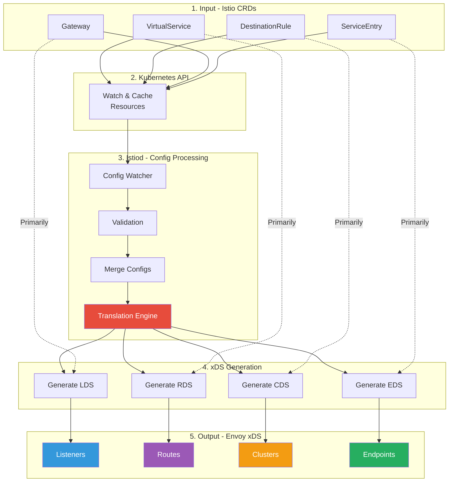

### Configuration Mapping

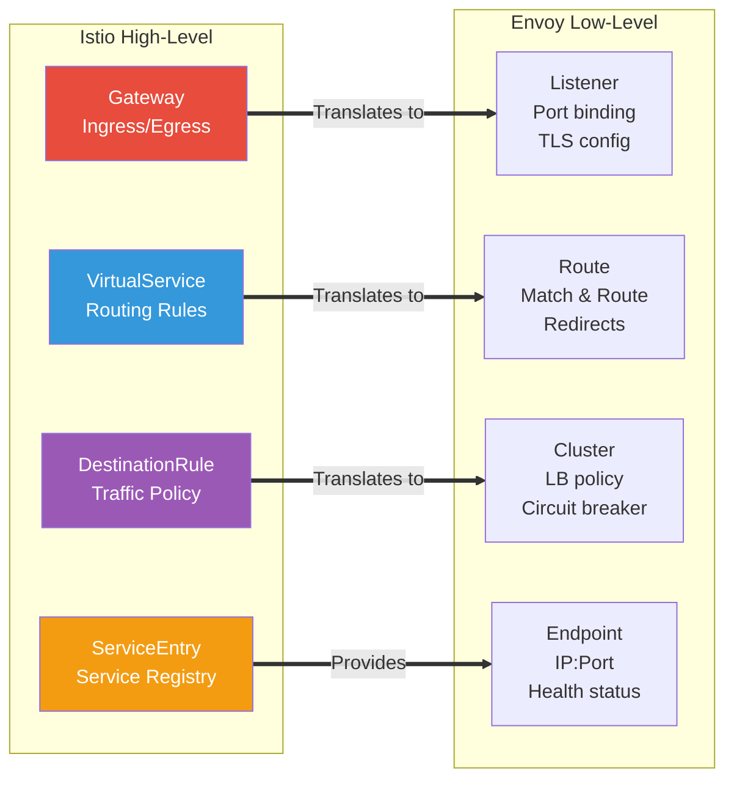

## Complete Example

### Bookinfo Application Configuration

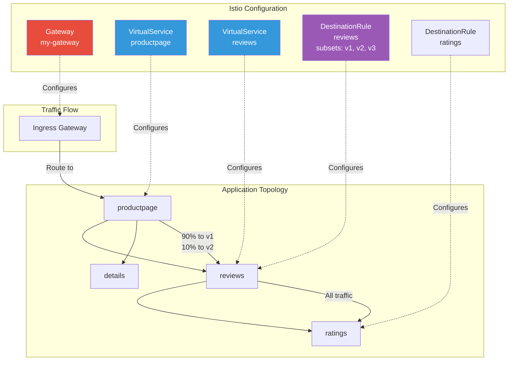

### Bookinfo Configuration Flow

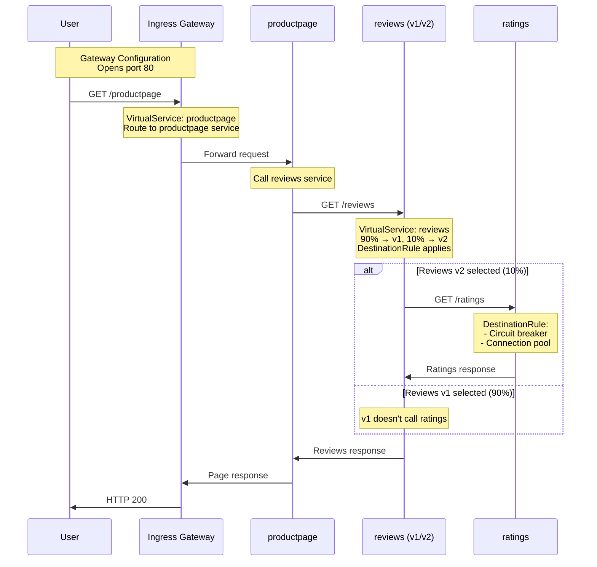

## Summary

This document covered Istio's configuration resources:

1. **VirtualService**: Routing rules, traffic splitting, retries, timeouts
2. **DestinationRule**: Load balancing, connection pools, circuit breakers
3. **Gateway**: Ingress/egress configuration, TLS termination
4. **ServiceEntry**: External service registration, mesh expansion

### Key Translation Mappings

| Istio CRD | Primary Envoy xDS | Purpose |
|-----------|-------------------|---------|
| Gateway | LDS (Listeners) | Port binding, TLS config |
| VirtualService | RDS (Routes) | Traffic routing rules |
| DestinationRule | CDS (Clusters) | Backend policies |
| ServiceEntry | EDS (Endpoints) | Service discovery |

## Next Steps

Continue to **Part 3: xDS Protocol Deep Dive** to understand how these configurations are transmitted from Istiod to Envoy.

---

**Document Version**: 1.0
**Last Updated**: 2026-02-28
**Related Documentation**:
- [Istio Traffic Management](https://istio.io/latest/docs/concepts/traffic-management/)
- [Istio Configuration Reference](https://istio.io/latest/docs/reference/config/)
