# Part 3: xDS Protocol Deep Dive

## Table of Contents
1. [Introduction](#introduction)
2. [xDS Protocol Fundamentals](#xds-protocol-fundamentals)
3. [Discovery Request and Response](#discovery-request-and-response)
4. [Resource Types](#resource-types)
5. [Aggregated Discovery Service (ADS)](#aggregated-discovery-service-ads)
6. [Incremental xDS](#incremental-xds)
7. [Version Control and ACK/NACK](#version-control-and-acknack)
8. [Error Handling](#error-handling)

## Introduction

The xDS (Discovery Service) protocol is the mechanism by which Envoy dynamically discovers its configuration from a management server (Istiod in Istio's case). This document explores the protocol in detail.

## xDS Protocol Fundamentals

### Protocol Stack

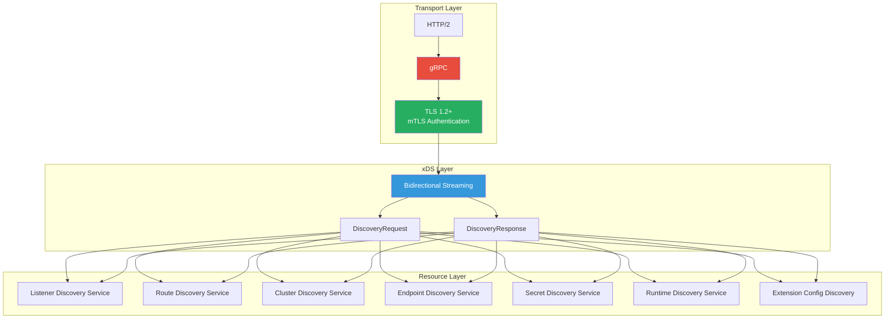

### xDS Service Methods

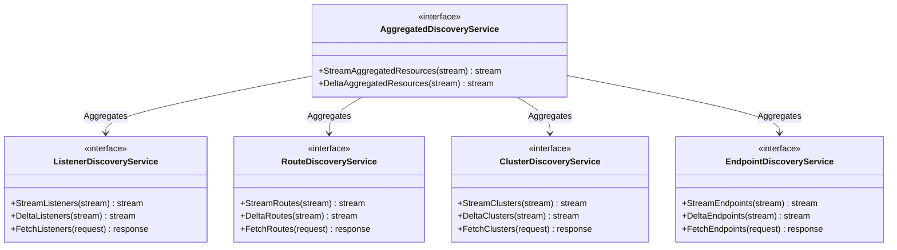

### Stream Types

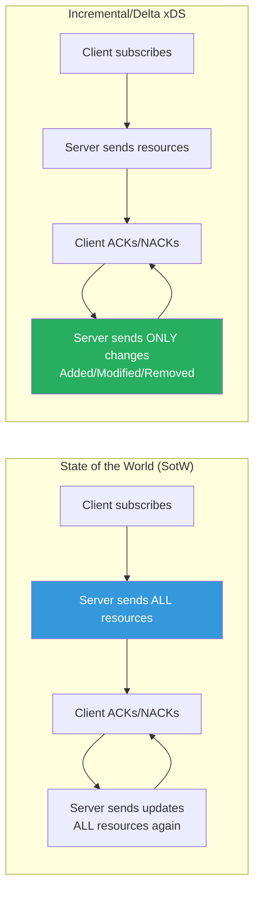

## Discovery Request and Response

### DiscoveryRequest Structure

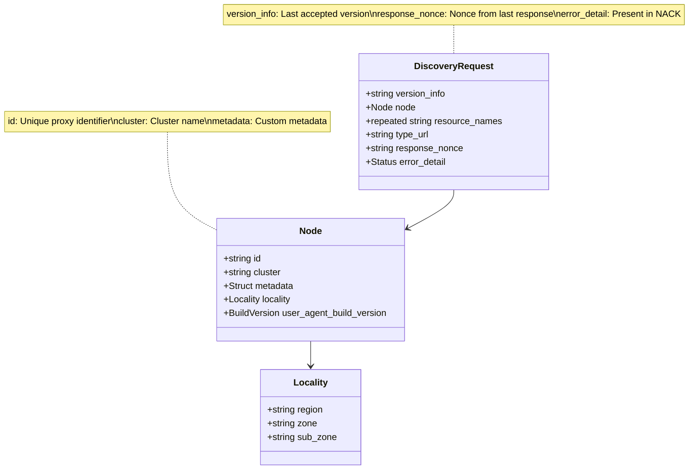

### DiscoveryResponse Structure

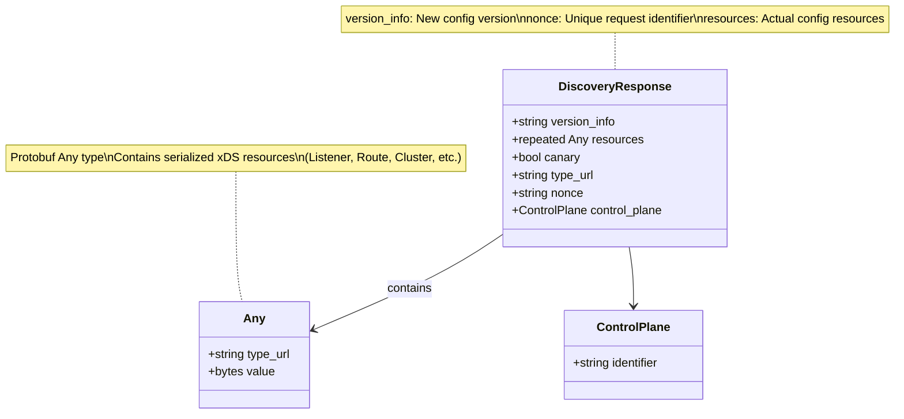

### Request-Response Flow

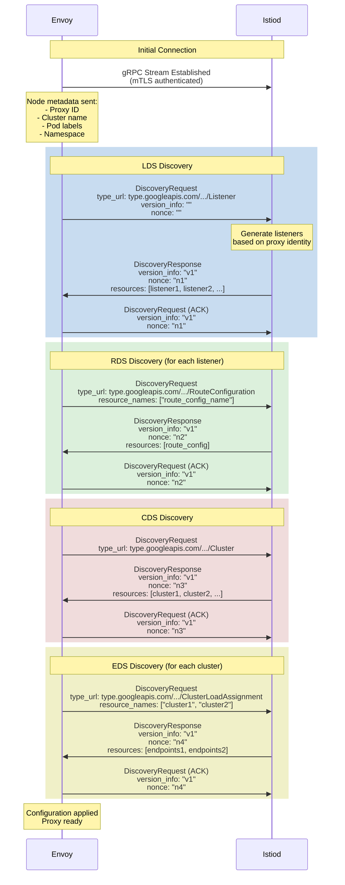

## Resource Types

### xDS Resource Type URLs

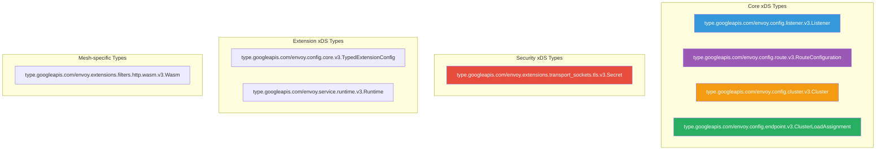

### Resource Dependencies

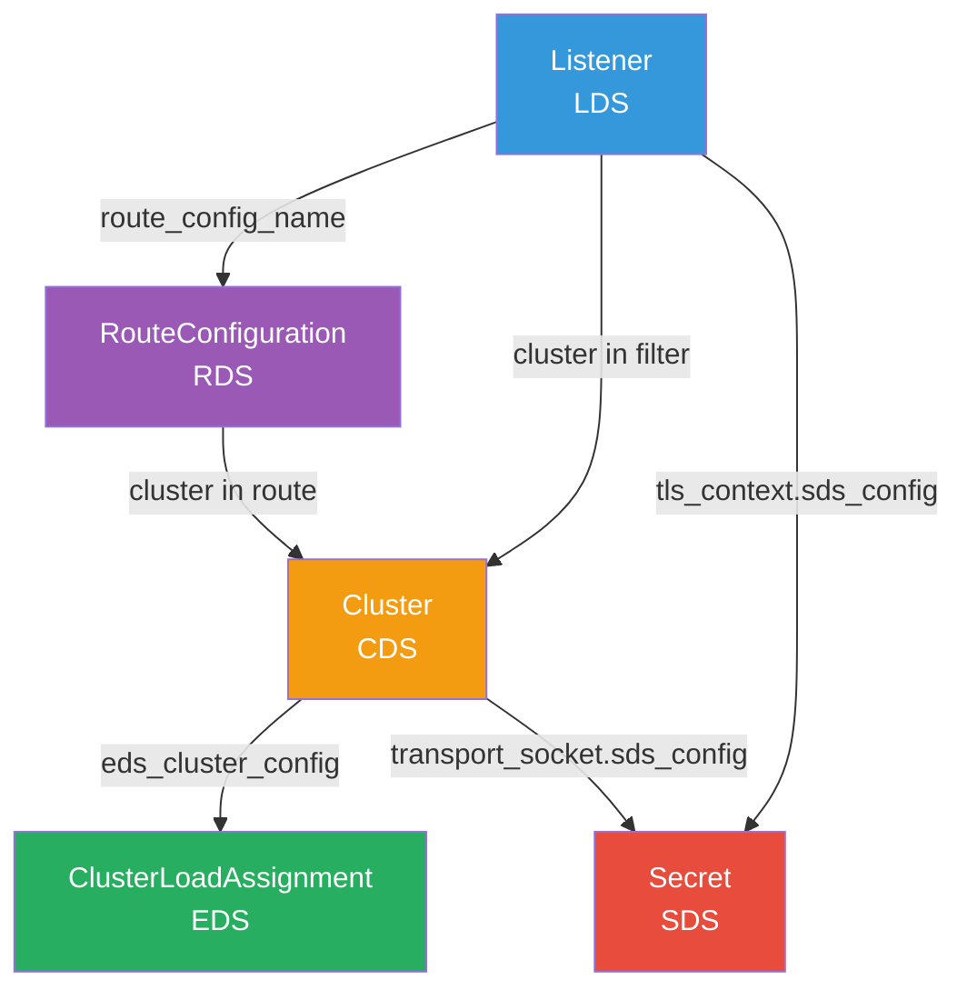

### Listener Resource Example Flow

```mermaid
graph TB
    subgraph "Listener Resource"
        L[Listener: 0.0.0.0:80]
        L --> FC[FilterChain]
        FC --> HCM[HttpConnectionManager]
        HCM --> RDS_REF[RDS Reference:<br/>route_config_name]
    end

    subgraph "Route Resource"
        RC[RouteConfiguration:<br/>route_config_name]
        RC --> VH[VirtualHost]
        VH --> ROUTE[Route]
        ROUTE --> CLUSTER_REF[Cluster Reference:<br/>outbound|80||reviews.default]
    end

    subgraph "Cluster Resource"
        C[Cluster:<br/>outbound|80||reviews.default]
        C --> EDS_REF[EDS Reference:<br/>service_name]
    end

    subgraph "Endpoint Resource"
        CLA[ClusterLoadAssignment:<br/>service_name]
        CLA --> LBE[LocalityLbEndpoints]
        LBE --> EP[Endpoint: 10.244.0.5:8080]
    end

    RDS_REF -.Resolves to.-> RC
    CLUSTER_REF -.Resolves to.-> C
    EDS_REF -.Resolves to.-> CLA

    style L fill:#3498DB,color:#fff
    style RC fill:#9B59B6,color:#fff
    style C fill:#F39C12,color:#fff
    style CLA fill:#27AE60,color:#fff
```

## Aggregated Discovery Service (ADS)

### ADS Architecture

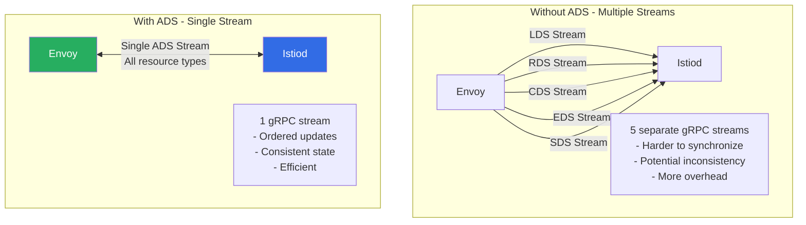

### ADS Sequencing and Ordering

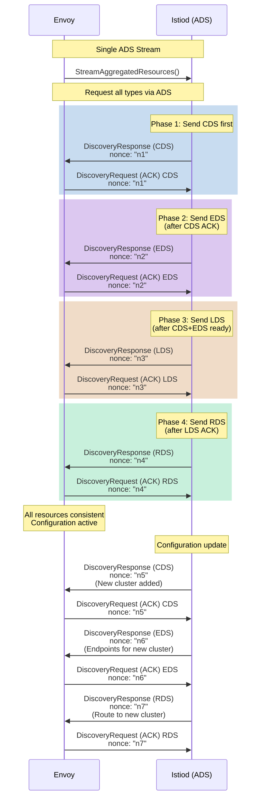

### ADS Ordering Guarantees

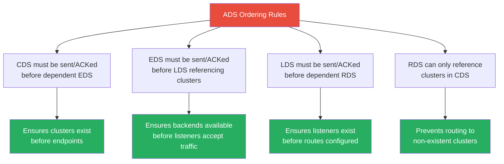

## Incremental xDS

### Incremental vs State of the World

```mermaid
graph TB
    subgraph "State of the World (SotW)"
        SOW_REQ[Request: Subscribe to clusters]
        SOW_RESP1[Response: ALL clusters<br/>cluster1, cluster2, ..., cluster100]
        SOW_UPDATE[Update: ONE cluster changed]
        SOW_RESP2[Response: ALL clusters again<br/>cluster1, cluster2, ..., cluster100]

        SOW_REQ --> SOW_RESP1
        SOW_RESP1 --> SOW_UPDATE
        SOW_UPDATE --> SOW_RESP2

        Note_SOW[Inefficient for large configs:<br/>- High bandwidth<br/>- Long processing time<br/>- Entire state retransmitted]
    end

    subgraph "Incremental/Delta"
        INC_REQ[Request: Subscribe to clusters]
        INC_RESP1[Response: ALL clusters<br/>cluster1, cluster2, ..., cluster100]
        INC_UPDATE[Update: ONE cluster changed]
        INC_RESP2[Response: ONLY changed cluster<br/>cluster42 (modified)]

        INC_REQ --> INC_RESP1
        INC_RESP1 --> INC_UPDATE
        INC_UPDATE --> INC_RESP2

        Note_INC[Efficient:<br/>- Low bandwidth<br/>- Fast processing<br/>- Only deltas sent]
    end

    style INC_RESP2 fill:#27AE60,color:#fff
    style Note_INC fill:#27AE60,color:#fff
```

### Delta Discovery Protocol

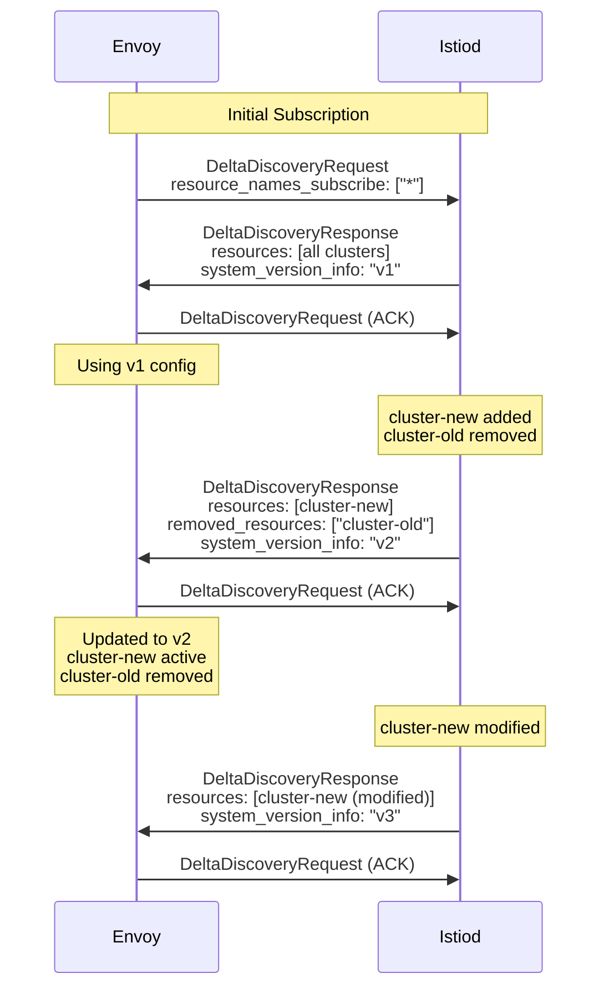

### Resource Subscription Management

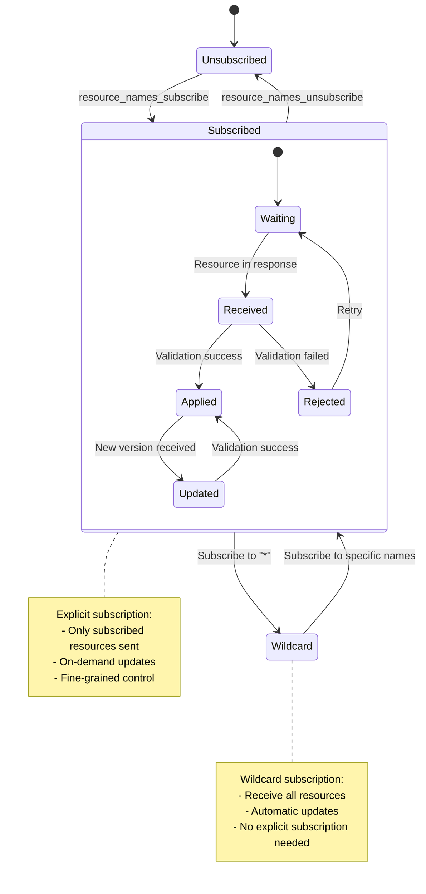

## Version Control and ACK/NACK

### Version and Nonce Mechanism

```mermaid
graph TB
    subgraph "Version vs Nonce"
        V[Version Info]
        N[Nonce]

        V --> V1[Identifies config version<br/>e.g., "v1", "v2"]
        V --> V2[Updated when config changes]
        V --> V3[Envoy tracks accepted version]

        N --> N1[Unique per response<br/>e.g., UUID]
        N --> N2[Used for ACK/NACK matching]
        N --> N3[Not tied to config version]
    end

    subgraph "ACK Example"
        ACK1[Response: version=v2, nonce=abc123]
        ACK2[Request: version_info=v2, response_nonce=abc123]
        ACK3[Meaning: Successfully applied v2]

        ACK1 --> ACK2
        ACK2 --> ACK3
    end

    subgraph "NACK Example"
        NACK1[Response: version=v2, nonce=def456]
        NACK2[Request: version_info=v1, response_nonce=def456, error_detail=...]
        NACK3[Meaning: Rejected v2, still using v1]

        NACK1 --> NACK2
        NACK2 --> NACK3
    end

    style ACK3 fill:#27AE60,color:#fff
    style NACK3 fill:#E74C3C,color:#fff
```

### ACK/NACK Flow

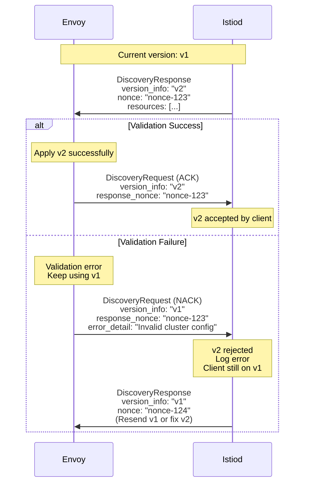

### Error States and Recovery

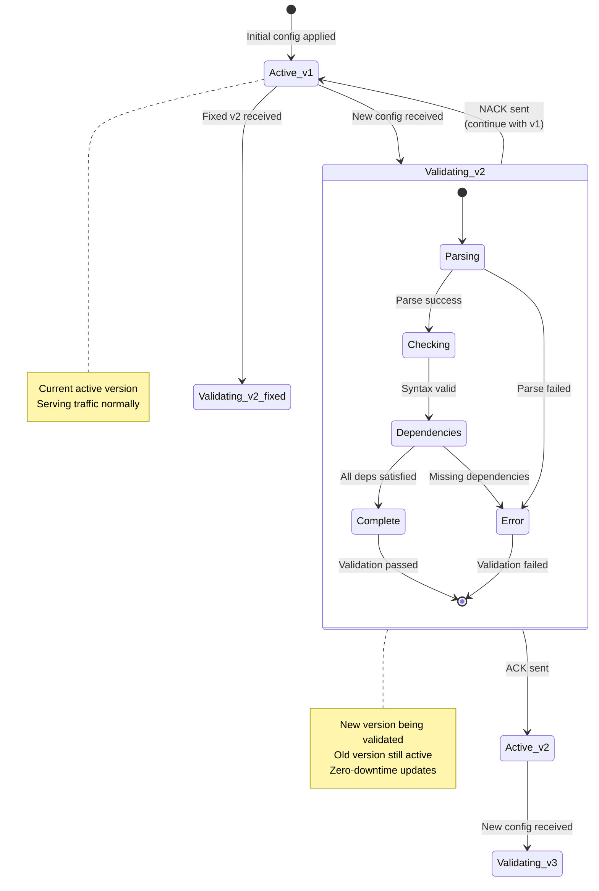

## Error Handling

### Error Categories

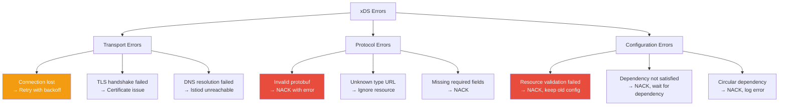

### Error Handling Flow

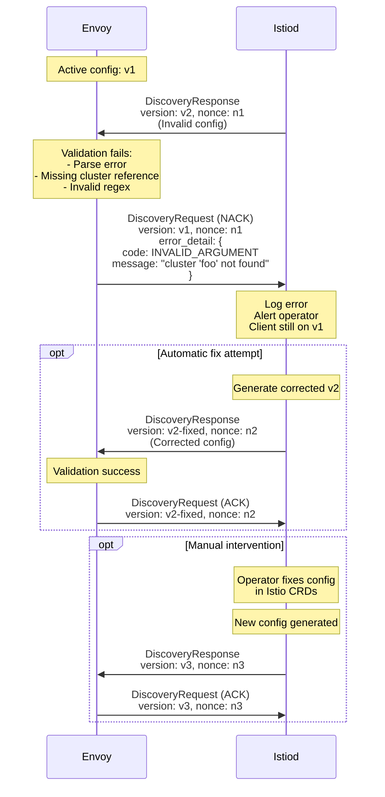

### Retry and Backoff Strategy

```mermaid
graph TB
    START[Connection Lost]

    START --> RETRY1[Retry 1<br/>Wait: 1s]
    RETRY1 --> SUCCESS1{Connected?}
    SUCCESS1 -->|Yes| ACTIVE[Active Stream]
    SUCCESS1 -->|No| RETRY2[Retry 2<br/>Wait: 2s]

    RETRY2 --> SUCCESS2{Connected?}
    SUCCESS2 -->|Yes| ACTIVE
    SUCCESS2 -->|No| RETRY3[Retry 3<br/>Wait: 4s]

    RETRY3 --> SUCCESS3{Connected?}
    SUCCESS3 -->|Yes| ACTIVE
    SUCCESS3 -->|No| RETRY4[Retry 4<br/>Wait: 8s]

    RETRY4 --> SUCCESS4{Connected?}
    SUCCESS4 -->|Yes| ACTIVE
    SUCCESS4 -->|No| RETRY5[Retry N<br/>Wait: max 30s]

    RETRY5 --> SUCCESS5{Connected?}
    SUCCESS5 -->|Yes| ACTIVE
    SUCCESS5 -->|No| RETRY5

    ACTIVE --> MONITOR[Monitor connection]
    MONITOR --> ERROR{Connection lost?}
    ERROR -->|Yes| START
    ERROR -->|No| MONITOR

    style START fill:#E74C3C,color:#fff
    style ACTIVE fill:#27AE60,color:#fff
```

## Summary

This document covered the xDS protocol in depth:

1. **Protocol Fundamentals**: gRPC streaming, bidirectional communication
2. **Request/Response**: DiscoveryRequest and DiscoveryResponse structures
3. **Resource Types**: LDS, RDS, CDS, EDS, SDS and their dependencies
4. **ADS**: Single stream for all resource types with ordering guarantees
5. **Incremental xDS**: Delta updates for efficiency
6. **Version Control**: ACK/NACK mechanism for reliable configuration updates
7. **Error Handling**: Comprehensive error categories and recovery strategies

### Key Takeaways

- xDS uses gRPC bidirectional streaming over HTTP/2
- ADS provides ordered, consistent configuration updates
- Incremental xDS reduces bandwidth for large configurations
- ACK/NACK mechanism ensures reliable config application
- Errors are categorized and handled gracefully with retries

## Next Steps

Continue to **Part 4: Istiod Configuration Processing** to understand how Istiod generates xDS configurations from Istio CRDs.

---

**Document Version**: 1.0
**Last Updated**: 2026-02-28
**Related Documentation**:
- [xDS Protocol Specification](https://www.envoyproxy.io/docs/envoy/latest/api-docs/xds_protocol)
- [Envoy xDS REST and gRPC protocol](https://github.com/envoyproxy/data-plane-api)
