# Part 4: Istiod Configuration Processing

## Table of Contents
1. [Introduction](#introduction)
2. [Istiod Architecture](#istiod-architecture)
3. [Configuration Watch and Cache](#configuration-watch-and-cache)
4. [Configuration Validation](#configuration-validation)
5. [Configuration Translation Pipeline](#configuration-translation-pipeline)
6. [Push Context and Generation](#push-context-and-generation)
7. [xDS Generation for Each Resource Type](#xds-generation-for-each-resource-type)
8. [Optimization and Caching](#optimization-and-caching)

## Introduction

Istiod is the control plane component that processes Istio configurations and generates Envoy xDS configurations. This document explains how Istiod transforms high-level Istio CRDs into low-level Envoy configurations.

## Istiod Architecture

### Istiod Components

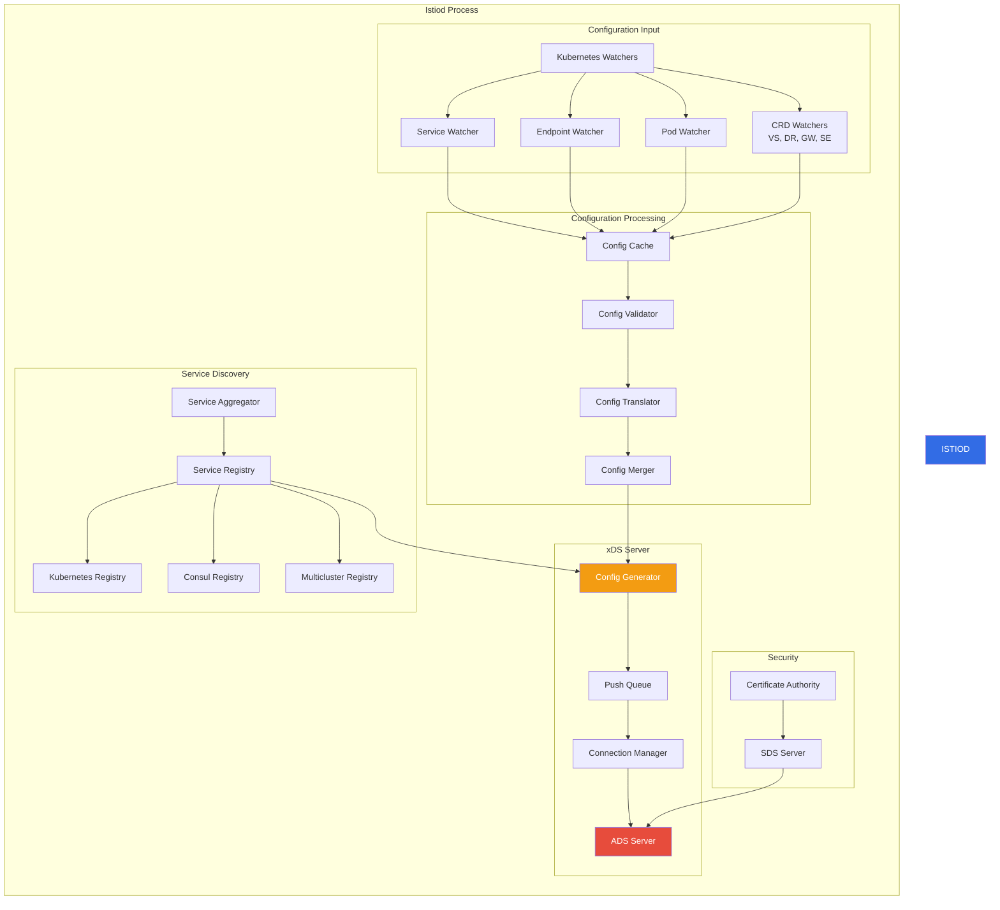

### Core Data Structures

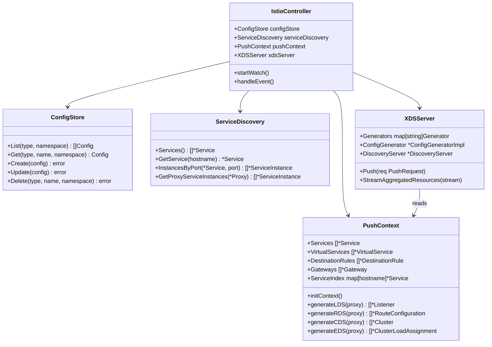

## Configuration Watch and Cache

### Kubernetes Watch Mechanism

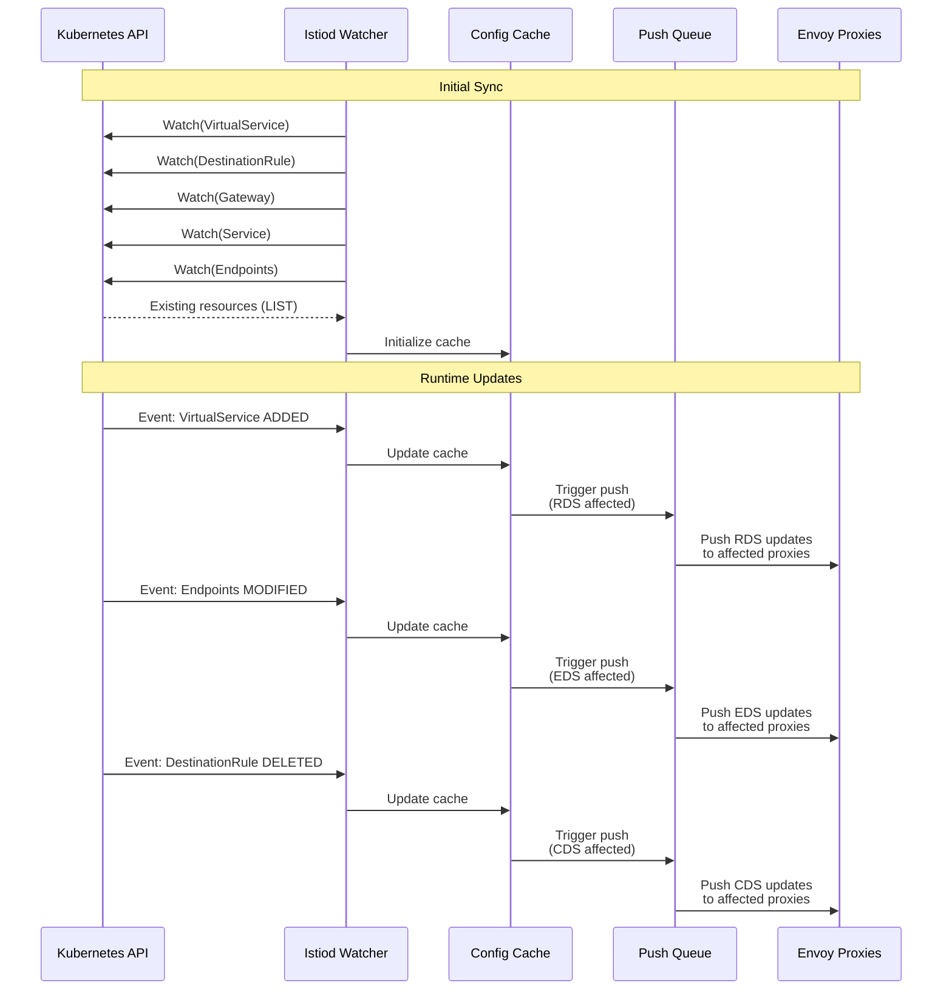

### Config Cache Structure

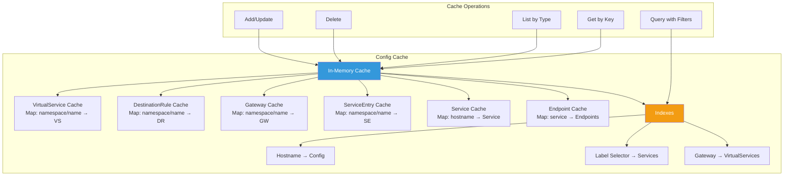

### Event Debouncing and Batching

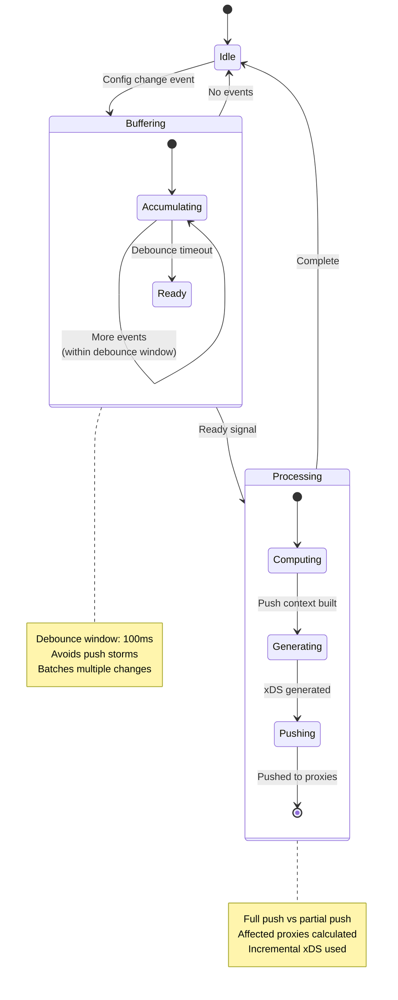

## Configuration Validation

### Validation Pipeline

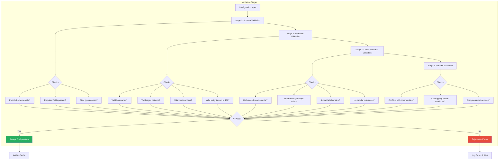

### Validation Example: VirtualService

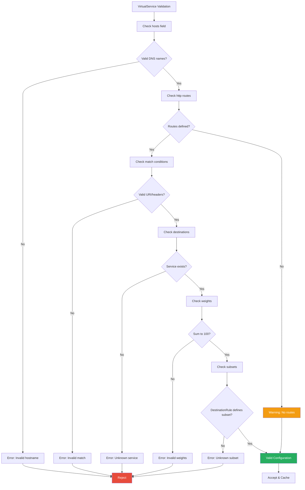

## Configuration Translation Pipeline

### Translation Flow

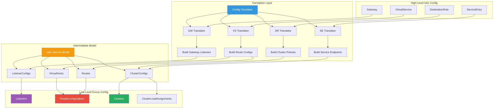

### VirtualService to RDS Translation

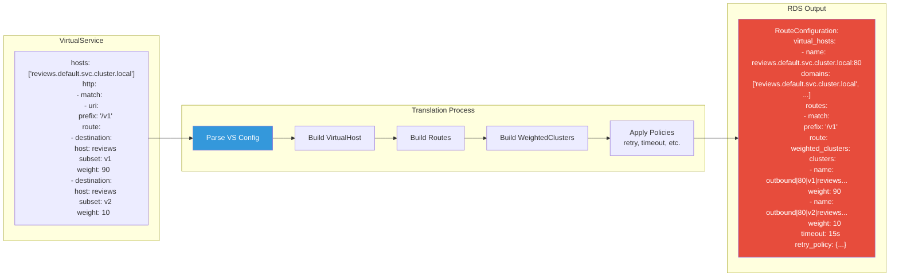

### DestinationRule to CDS Translation

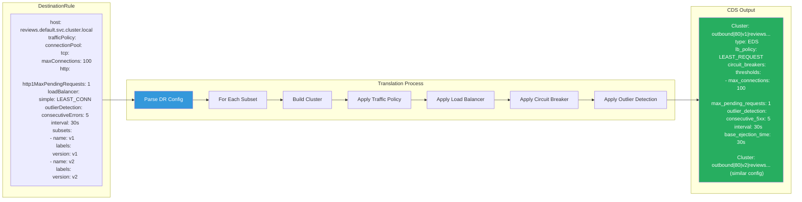

## Push Context and Generation

### Push Context Lifecycle

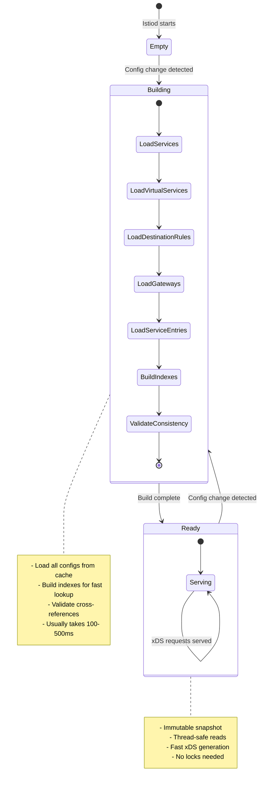

### Push Context Data Structure

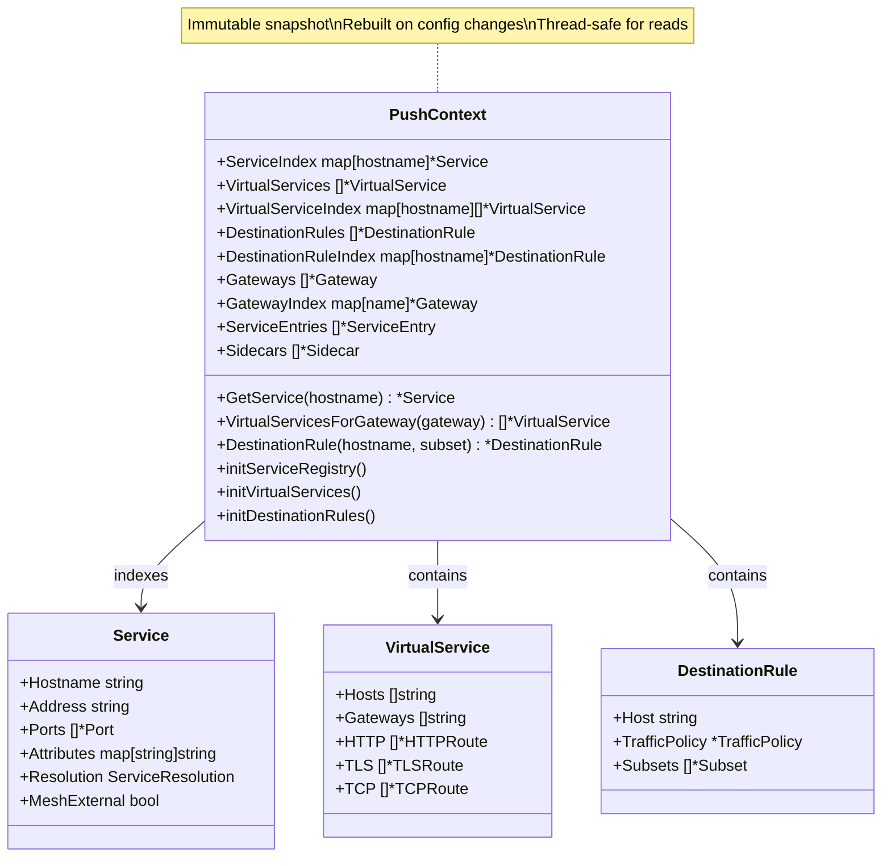

### Push Request and Triggering

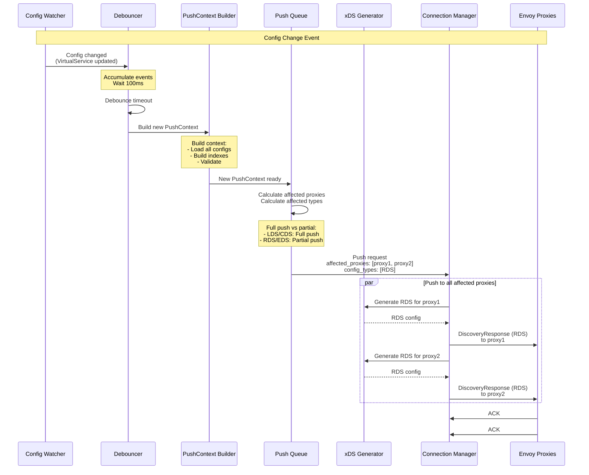

## xDS Generation for Each Resource Type

### LDS Generation

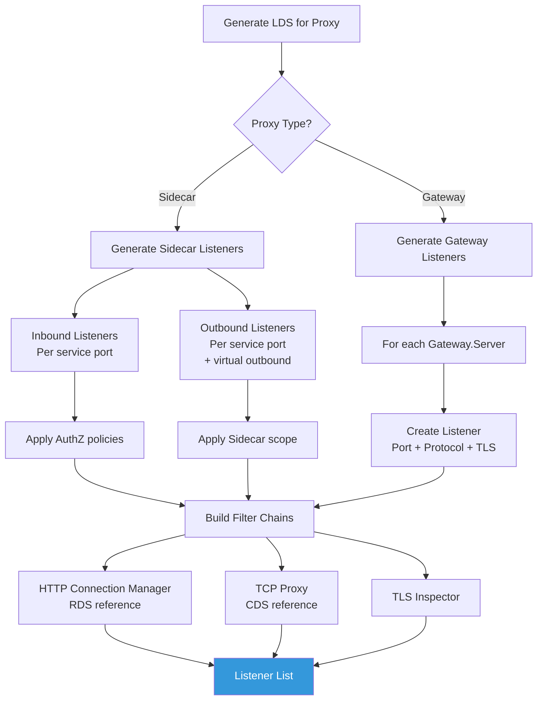

### RDS Generation

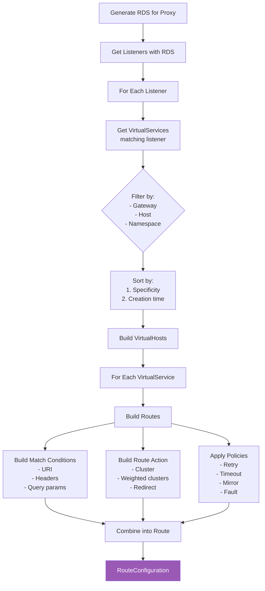

### CDS Generation

```mermaid
graph TB
    START[Generate CDS for Proxy]

    START --> GET_SERVICES[Get Services accessible<br/>to proxy]

    GET_SERVICES --> APPLY_SIDECAR[Apply Sidecar egress rules]

    APPLY_SIDECAR --> FOR_EACH_SVC[For Each Service]

    FOR_EACH_SVC --> GET_DR[Get DestinationRule<br/>for service]

    GET_DR --> HAS_DR{DR exists?}

    HAS_DR -->|Yes| FOR_EACH_SUBSET[For Each Subset]
    HAS_DR -->|No| DEFAULT_CLUSTER[Create Default Cluster]

    FOR_EACH_SUBSET --> BUILD_CLUSTER[Build Cluster]
    DEFAULT_CLUSTER --> BUILD_CLUSTER

    BUILD_CLUSTER --> CLUSTER_NAME[Generate Cluster Name<br/>outbound|port|subset|host]
    BUILD_CLUSTER --> LB_POLICY[Apply LB Policy]
    BUILD_CLUSTER --> CONN_POOL[Apply Connection Pool]
    BUILD_CLUSTER --> CB[Apply Circuit Breaker]
    BUILD_CLUSTER --> OD[Apply Outlier Detection]
    BUILD_CLUSTER --> TLS_CONFIG[Apply TLS Config]
    BUILD_CLUSTER --> EDS_CONFIG[Configure EDS]

    CLUSTER_NAME --> COMBINE
    LB_POLICY --> COMBINE
    CONN_POOL --> COMBINE
    CB --> COMBINE
    OD --> COMBINE
    TLS_CONFIG --> COMBINE
    EDS_CONFIG --> COMBINE[Combine into Cluster]

    COMBINE --> RESULT[Cluster List]

    style RESULT fill:#27AE60,color:#fff
```

### EDS Generation

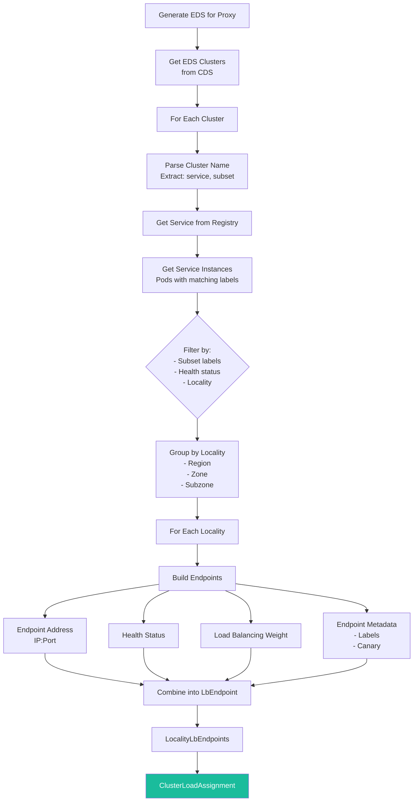

## Optimization and Caching

### Configuration Caching Strategy

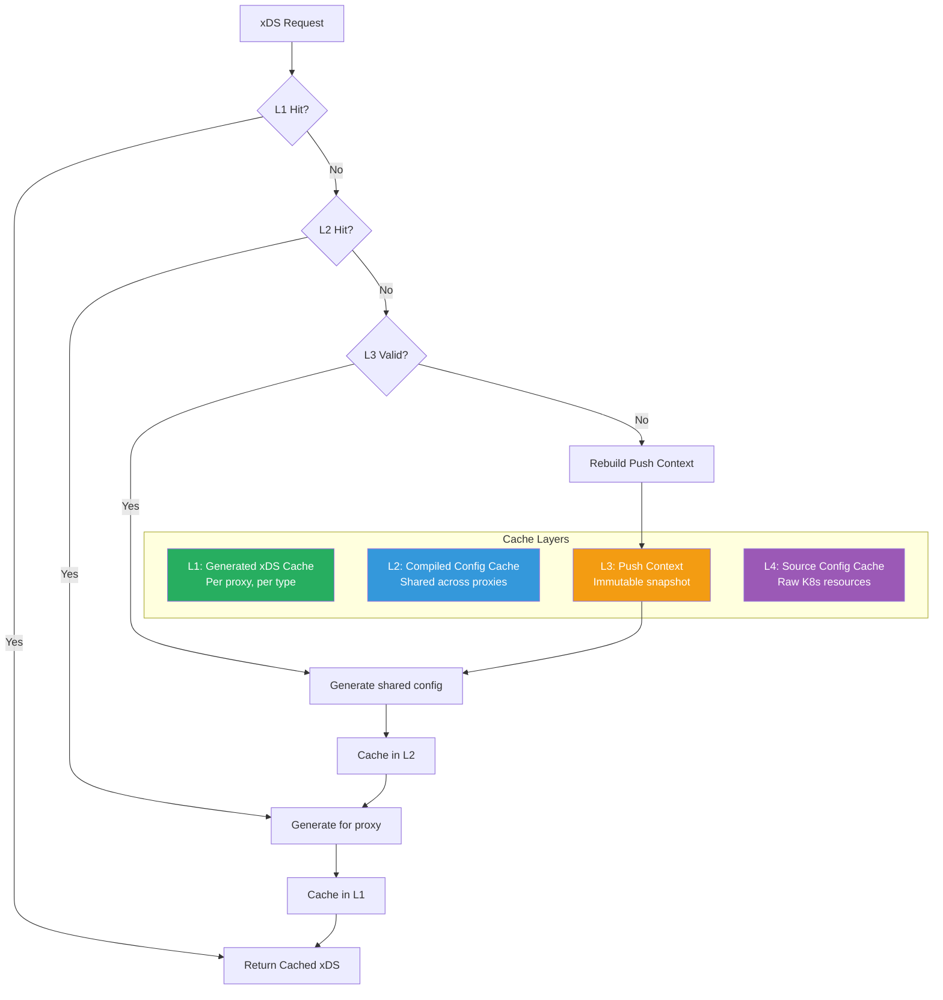

### Partial Push Optimization

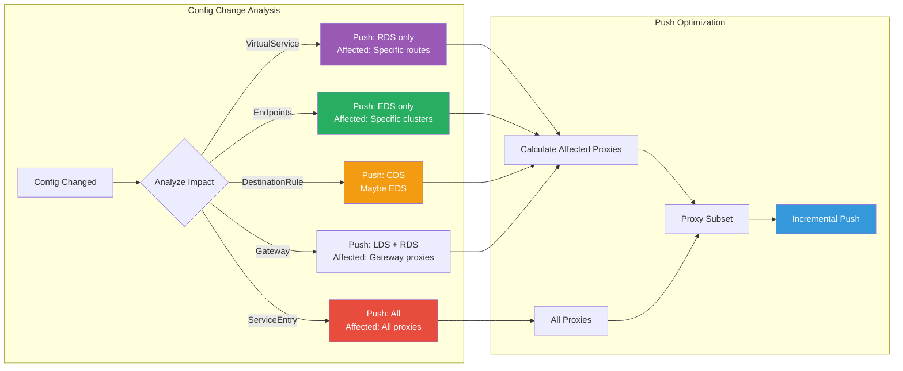

## Summary

This document covered Istiod's configuration processing:

1. **Architecture**: Component breakdown and data structures
2. **Watch & Cache**: Kubernetes watchers and in-memory cache
3. **Validation**: Multi-stage validation pipeline
4. **Translation**: High-level Istio → Low-level Envoy
5. **Push Context**: Immutable configuration snapshot
6. **xDS Generation**: Per-type generation logic
7. **Optimization**: Multi-layer caching and partial pushes

### Key Takeaways

- Istiod watches Kubernetes resources and maintains in-memory cache
- Configuration changes are debounced and batched
- PushContext provides immutable, thread-safe snapshot
- Translation happens in multiple stages with validation
- xDS generation is optimized with caching
- Partial pushes minimize unnecessary updates

## Next Steps

Continue to **Part 5: Envoy Configuration Application** to understand how Envoy processes and applies received xDS configurations.

---

**Document Version**: 1.0
**Last Updated**: 2026-02-28
**Related Code**: `istio/pilot/pkg/` (Istio source)
