# Part 5: Envoy Configuration Application

## Table of Contents
1. [Introduction](#introduction)
2. [Envoy xDS Client Architecture](#envoy-xds-client-architecture)
3. [Configuration Reception](#configuration-reception)
4. [Configuration Validation](#configuration-validation)
5. [Warming and Initialization](#warming-and-initialization)
6. [Configuration Activation](#configuration-activation)
7. [Draining Old Configuration](#draining-old-configuration)
8. [Error Handling and Recovery](#error-handling-and-recovery)

## Introduction

Once Envoy receives xDS configurations from Istiod, it must validate, prepare, and activate them while maintaining zero-downtime operation. This document explains how Envoy processes and applies dynamic configurations.

## Envoy xDS Client Architecture

### xDS Subscription Manager

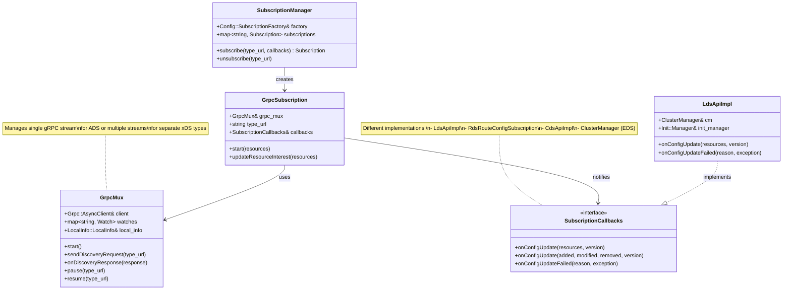

### Configuration Flow in Envoy

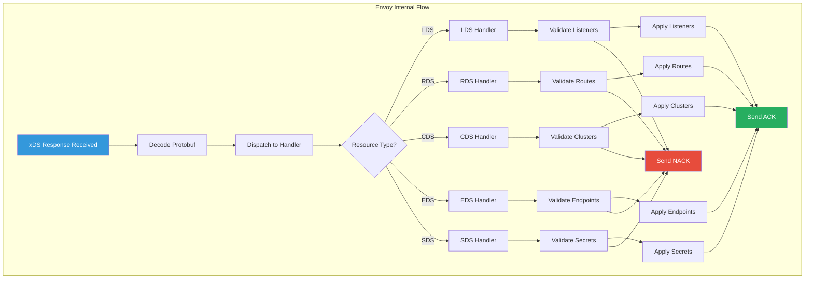

## Configuration Reception

### gRPC Stream Lifecycle

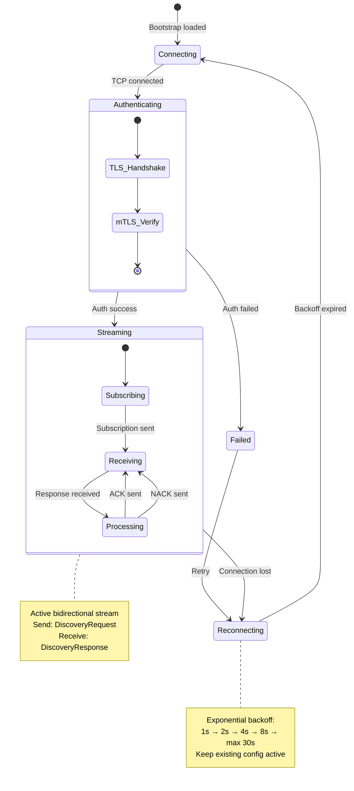

### Message Reception and Parsing

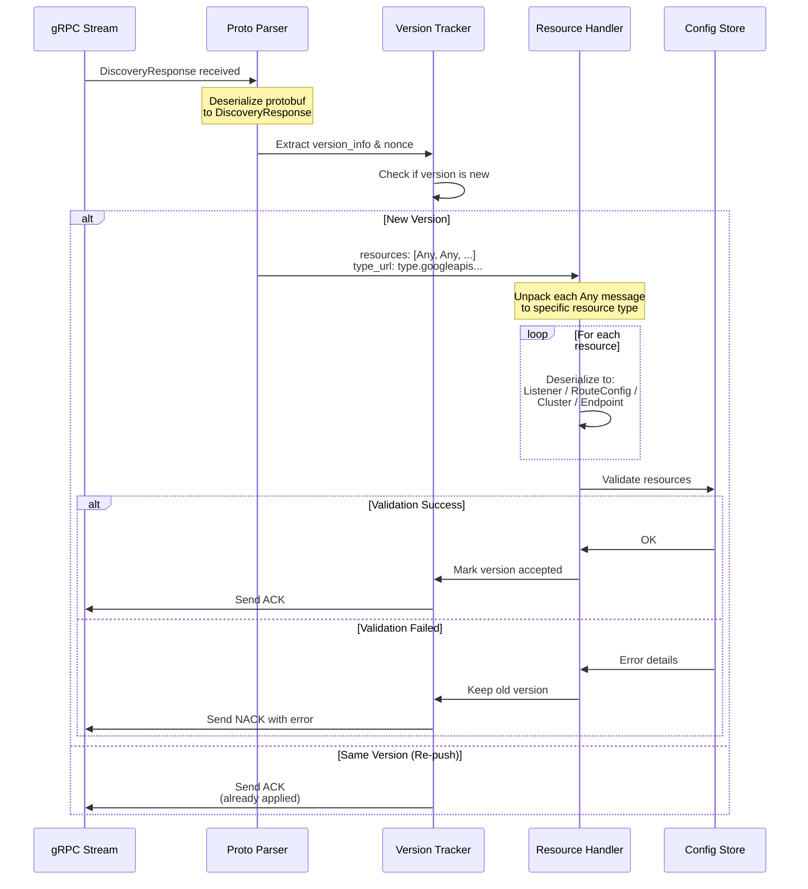

## Configuration Validation

### Multi-Level Validation

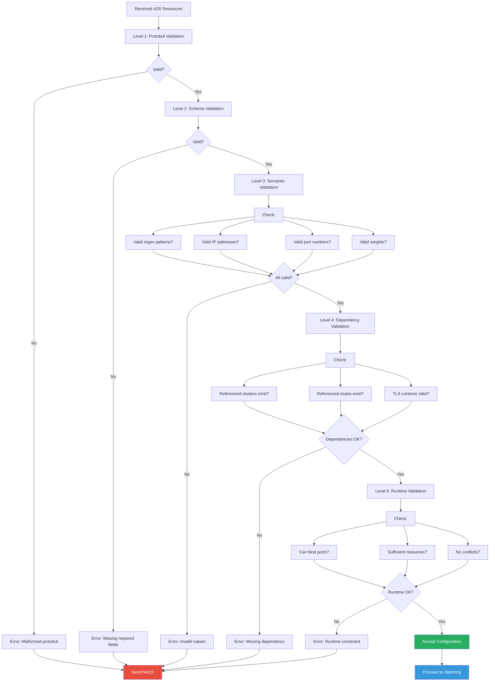

### Listener Validation Example

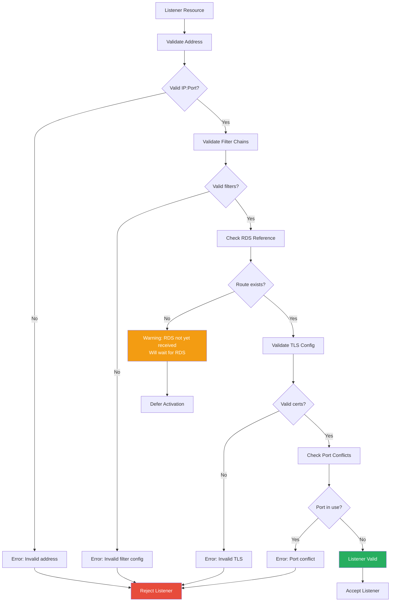

## Warming and Initialization

### Cluster Warming Process

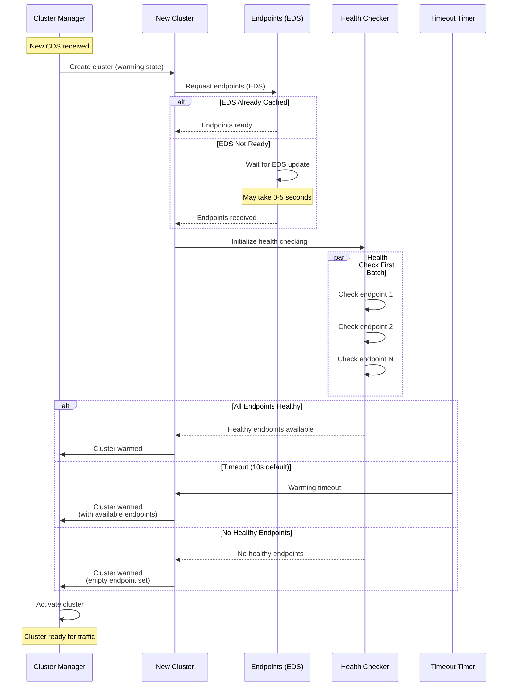

### Warming State Machine

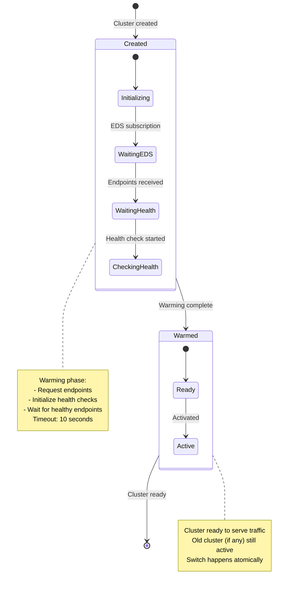

### Initialization Manager

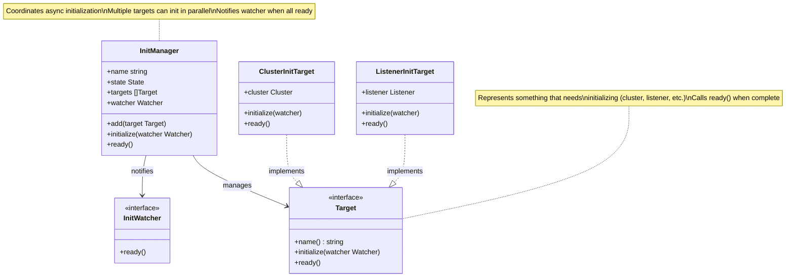

## Configuration Activation

### Atomic Activation

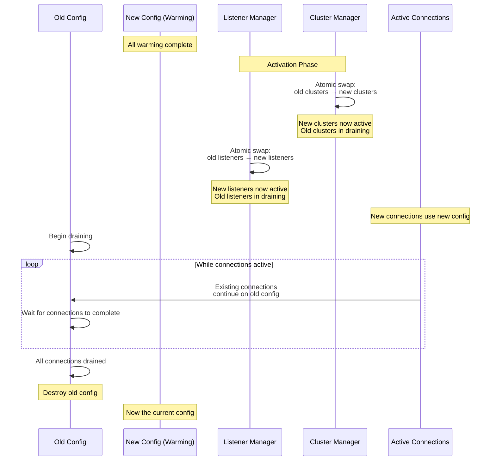

### Zero-Downtime Update Flow

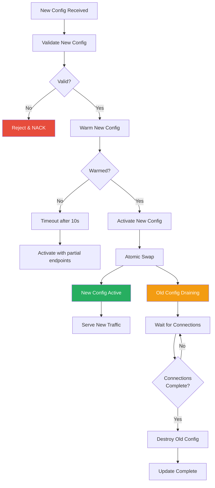

## Draining Old Configuration

### Connection Draining

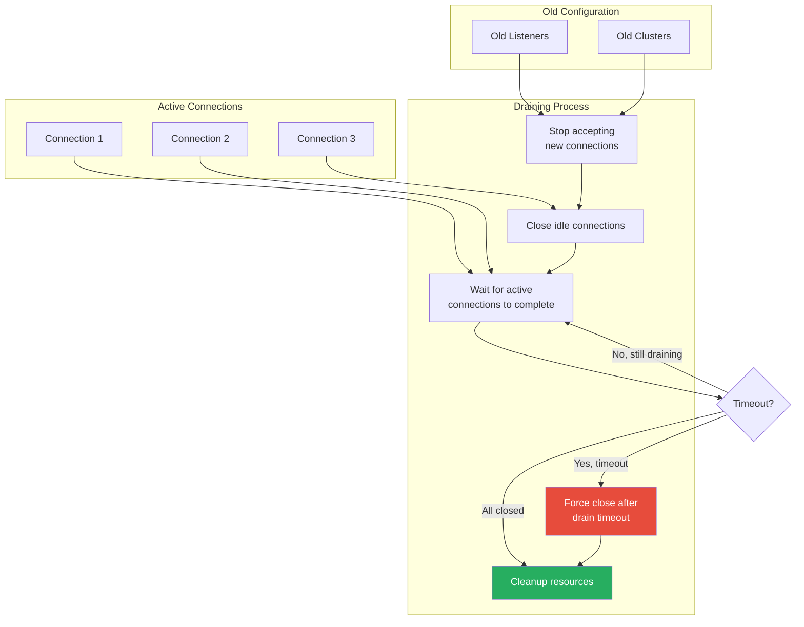

### Drain Timeout Handling

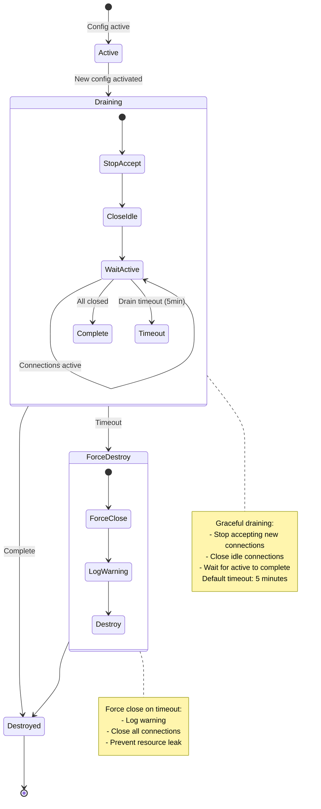

## Error Handling and Recovery

### Error Categories and Responses

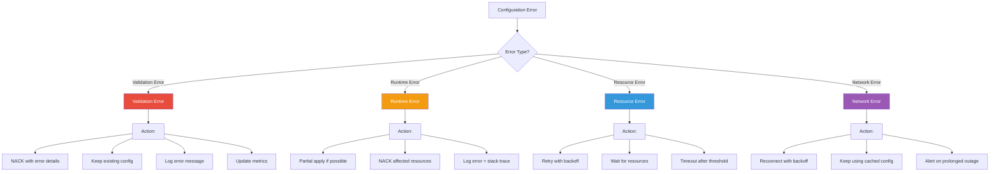

### Recovery Scenarios

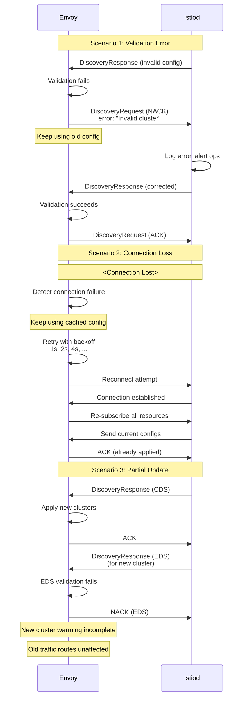

### Metrics and Observability

```mermaid
graph TB
    subgraph "Configuration Metrics"
        M1[config_reload_total<br/>Counter: Total reloads]
        M2[config_reload_success<br/>Counter: Successful reloads]
        M3[config_reload_failure<br/>Counter: Failed reloads]
        M4[config_reload_duration<br/>Histogram: Reload time]
    end

    subgraph "xDS Metrics"
        X1[xds.connected_state<br/>Gauge: Connection status]
        X2[xds.update_attempt<br/>Counter: Update attempts]
        X3[xds.update_success<br/>Counter: Successful updates]
        X4[xds.update_failure<br/>Counter: Failed updates]
        X5[xds.update_rejected<br/>Counter: Rejected configs]
        X6[xds.version<br/>Gauge: Current version]
    end

    subgraph "Warmup Metrics"
        W1[cluster.warming<br/>Gauge: Clusters warming]
        W2[cluster.warming_timeout<br/>Counter: Warming timeouts]
        W3[listener.warming<br/>Gauge: Listeners warming]
    end

    subgraph "Admin Endpoints"
        A1[/config_dump<br/>Current active config]
        A2[/clusters<br/>Cluster status + warming]
        A3[/listeners<br/>Listener status]
        A4[/stats/prometheus<br/>All metrics]
    end

    style M2 fill:#27AE60,color:#fff
    style M3 fill:#E74C3C,color:#fff
    style X1 fill:#3498DB,color:#fff
    style A1 fill:#F39C12,color:#fff
```

## Summary

This document covered how Envoy applies xDS configurations:

1. **xDS Client**: Subscription management and gRPC streaming
2. **Reception**: Message parsing and version tracking
3. **Validation**: Multi-level validation pipeline
4. **Warming**: Cluster and listener initialization
5. **Activation**: Atomic configuration swap
6. **Draining**: Graceful shutdown of old config
7. **Error Handling**: Comprehensive error recovery

### Key Takeaways

- Configuration updates are validated before application
- Warming ensures resources are ready before activation
- Atomic swaps provide zero-downtime updates
- Old configurations drain gracefully
- Errors result in NACK and config rollback
- Extensive metrics enable observability

## Next Steps

Continue to **Part 6: Complete End-to-End Flow Example** to see a full example tracing configuration from Istio CRD to active Envoy config.

---

**Document Version**: 1.0
**Last Updated**: 2026-02-28
**Related Code**:
- `source/common/config/` - Envoy config management
- `source/common/upstream/cluster_manager_impl.cc` - Cluster management
