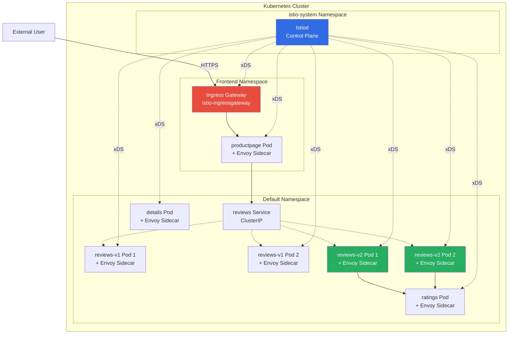
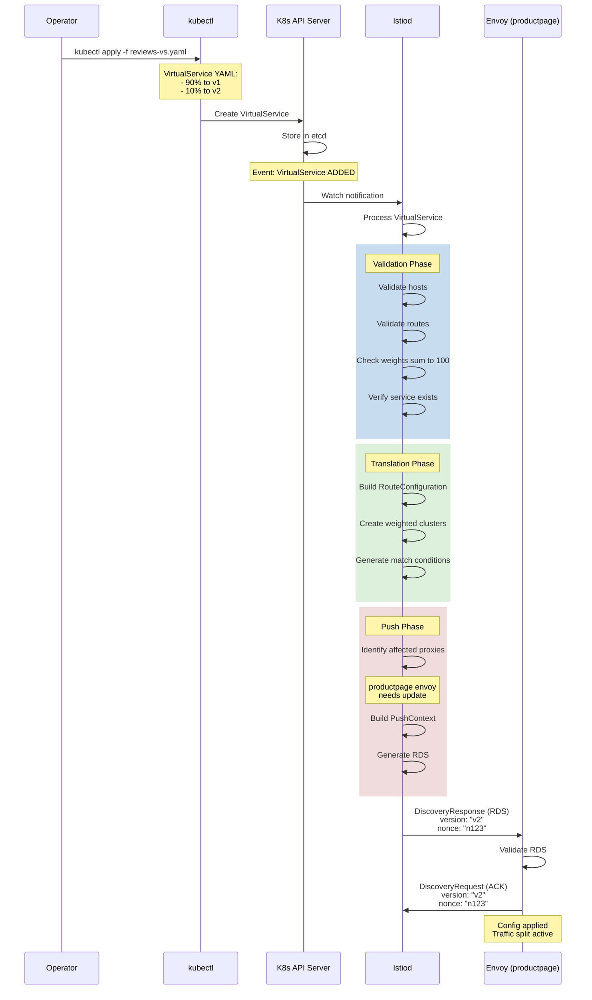
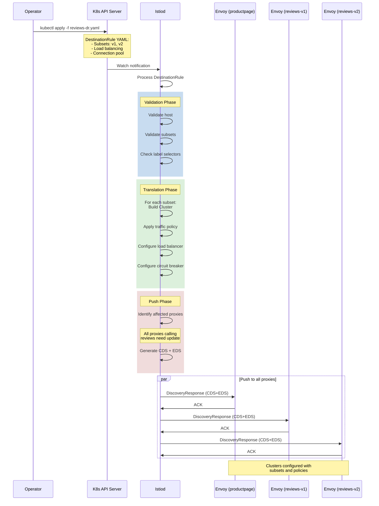
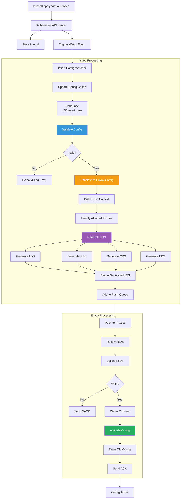
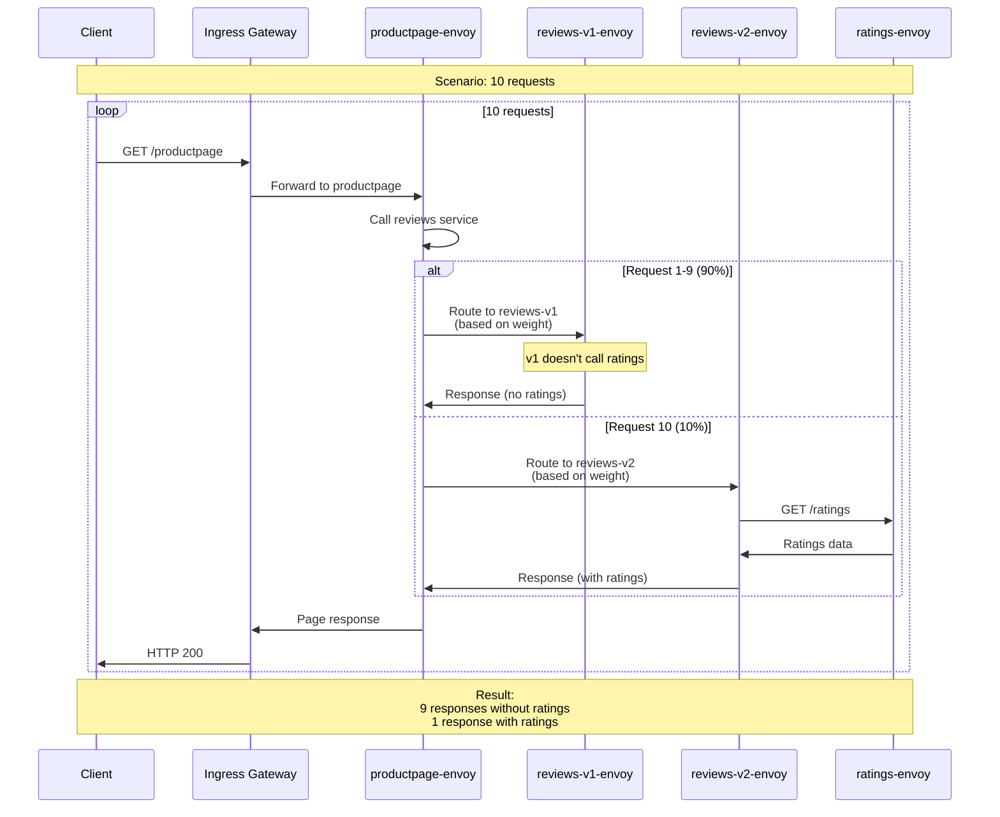
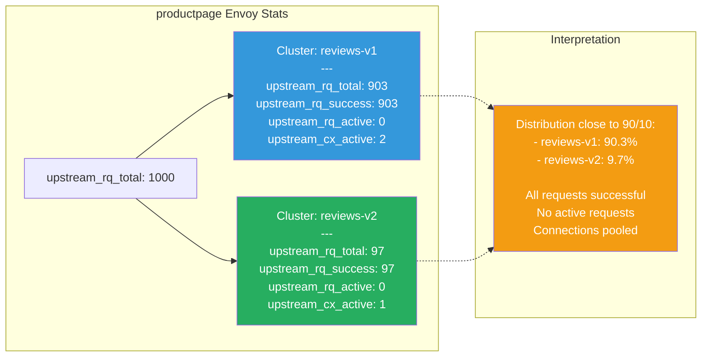
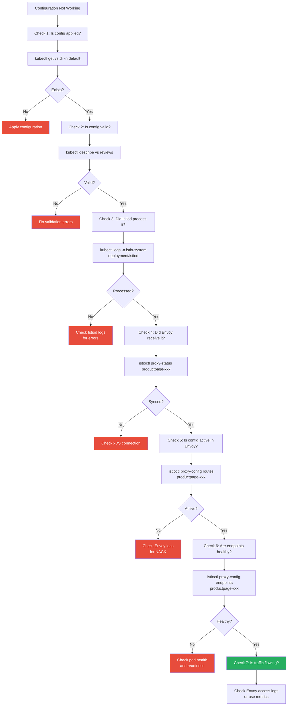
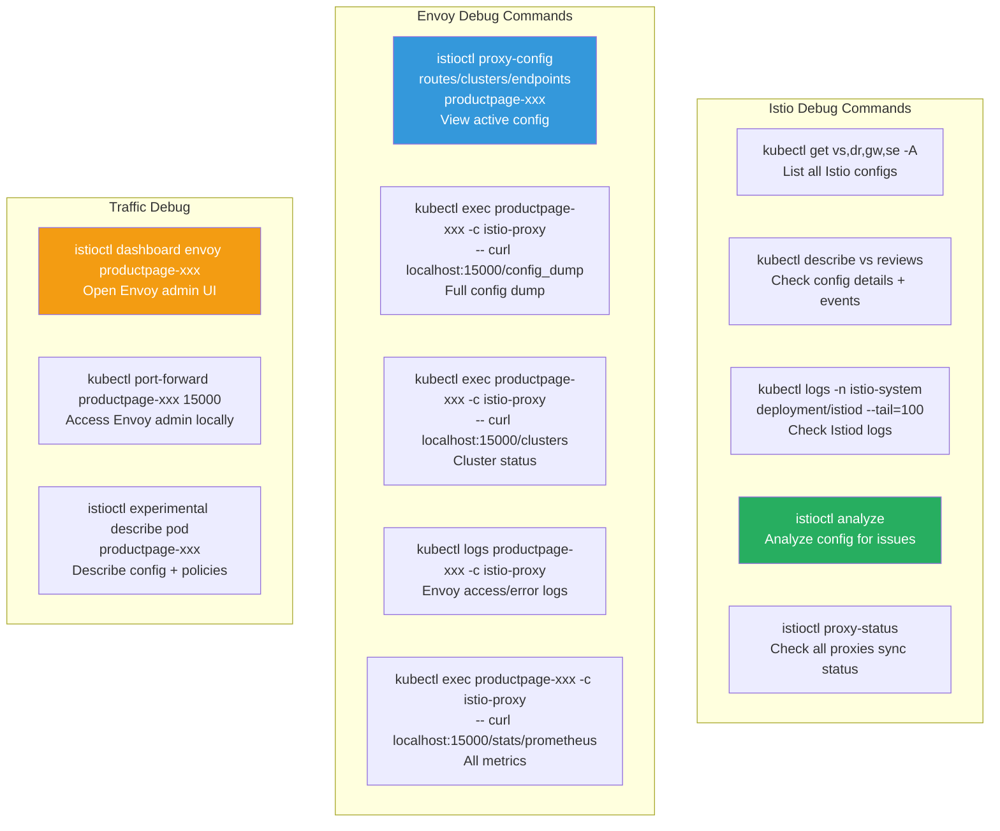
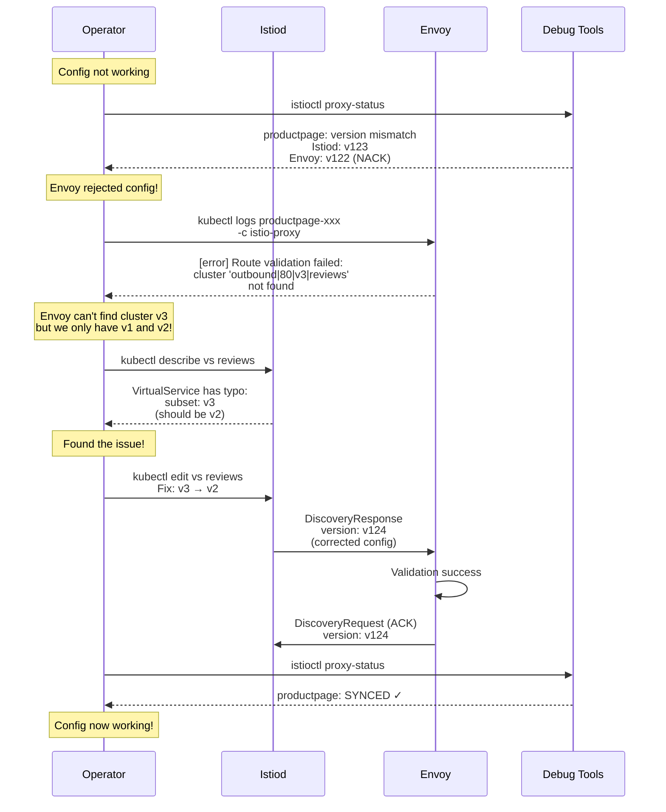

# Part 6: Complete End-to-End Flow Example

## Table of Contents
1. [Introduction](#introduction)
2. [Scenario Setup](#scenario-setup)
3. [Initial Configuration](#initial-configuration)
4. [Configuration Update Flow](#configuration-update-flow)
5. [Traffic Flow with Updated Config](#traffic-flow-with-updated-config)
6. [Troubleshooting Walkthrough](#troubleshooting-walkthrough)

## Introduction

This document provides a complete end-to-end example showing how configuration flows from an Istio CRD creation through to active traffic routing in Envoy. We'll trace every step with detailed diagrams.

## Scenario Setup

### Application Architecture



### Goal

We want to implement canary deployment for the `reviews` service:
- Send 90% of traffic to reviews-v1 (stable)
- Send 10% of traffic to reviews-v2 (canary)
- Only for production traffic (not internal testing)

## Initial Configuration

### Step 1: Create VirtualService



### VirtualService YAML

```yaml
apiVersion: networking.istio.io/v1beta1
kind: VirtualService
metadata:
  name: reviews
  namespace: default
spec:
  hosts:
  - reviews.default.svc.cluster.local
  http:
  - route:
    - destination:
        host: reviews.default.svc.cluster.local
        subset: v1
      weight: 90
    - destination:
        host: reviews.default.svc.cluster.local
        subset: v2
      weight: 10
```

### Step 2: Create DestinationRule



### DestinationRule YAML

```yaml
apiVersion: networking.istio.io/v1beta1
kind: DestinationRule
metadata:
  name: reviews
  namespace: default
spec:
  host: reviews.default.svc.cluster.local
  trafficPolicy:
    connectionPool:
      tcp:
        maxConnections: 100
      http:
        http1MaxPendingRequests: 10
        maxRequestsPerConnection: 2
    loadBalancer:
      simple: LEAST_CONN
    outlierDetection:
      consecutiveErrors: 5
      interval: 30s
      baseEjectionTime: 30s
  subsets:
  - name: v1
    labels:
      version: v1
  - name: v2
    labels:
      version: v2
```

## Configuration Update Flow

### Complete Configuration Processing Flow



### Detailed Istiod Processing

```mermaid
stateDiagram-v2
    [*] --> WatchEvent: VS created/updated

    WatchEvent --> ConfigCache: Store in cache

    state ConfigCache {
        [*] --> CacheUpdate
        CacheUpdate --> IndexUpdate
        IndexUpdate --> [*]
    }

    ConfigCache --> Debouncer: Trigger push

    state Debouncer {
        [*] --> Accumulating
        Accumulating --> Accumulating: More events (within 100ms)
        Accumulating --> Timeout: No events for 100ms
    }

    Debouncer --> Validation: Build push request

    state Validation {
        [*] --> SchemaCheck
        SchemaCheck --> SemanticCheck
        SemanticCheck --> CrossRefCheck
        CrossRefCheck --> RuntimeCheck
    }

    Validation --> Translation: Valid

    state Translation {
        [*] --> ParseVS
        ParseVS --> BuildRoutes
        BuildRoutes --> ApplyPolicies
        ApplyPolicies --> CreateEnvoyConfig
    }

    Translation --> PushContext: Generate

    state PushContext {
        [*] --> LoadServices
        LoadServices --> LoadVS
        LoadVS --> LoadDR
        LoadDR --> BuildIndexes
        BuildIndexes --> GenerateXDS
    }

    PushContext --> PushQueue: Ready to push

    state PushQueue {
        [*] --> CalculateAffected
        CalculateAffected --> PrioritizeProxies
        PrioritizeProxies --> BatchPush
    }

    PushQueue --> [*]: Pushed to proxies
```



## Traffic Flow with Updated Config

### Request Flow with Canary Routing



### Load Balancing Detail

```mermaid
graph TB
    REQ[Request to reviews service]

    REQ --> ROUTE_MATCH[Route Match]

    ROUTE_MATCH --> WEIGHTED[Weighted Cluster Selection]

    WEIGHTED --> RANDOM[Random number: 0-99]

    RANDOM --> CHECK{Value?}

    CHECK -->|0-89<br/>90%| V1_CLUSTER[Select Cluster:<br/>outbound|80|v1|reviews]
    CHECK -->|90-99<br/>10%| V2_CLUSTER[Select Cluster:<br/>outbound|80|v2|reviews]

    V1_CLUSTER --> V1_LB[Load Balancer:<br/>LEAST_CONN]
    V2_CLUSTER --> V2_LB[Load Balancer:<br/>LEAST_CONN]

    V1_LB --> V1_EP[Select Endpoint]
    V2_LB --> V2_EP[Select Endpoint]

    V1_EP --> V1_HEALTH{Healthy?}
    V2_EP --> V2_HEALTH{Healthy?}

    V1_HEALTH -->|Yes| V1_POD[reviews-v1 Pod]
    V1_HEALTH -->|No| V1_LB

    V2_HEALTH -->|Yes| V2_POD[reviews-v2 Pod]
    V2_HEALTH -->|No| V2_LB

    V1_POD --> RESPONSE[Send Request]
    V2_POD --> RESPONSE

    style V1_CLUSTER fill:#3498DB,color:#fff
    style V2_CLUSTER fill:#27AE60,color:#fff
    style V1_POD fill:#3498DB,color:#fff
    style V2_POD fill:#27AE60,color:#fff
```

### Envoy Stats After 1000 Requests



## Troubleshooting Walkthrough

### Common Issues and Detection



### Debug Commands



### Example: NACK Investigation



## Summary

This document provided a complete end-to-end example:

1. **Setup**: Microservices architecture with Istio
2. **Configuration**: VirtualService and DestinationRule creation
3. **Processing**: Step-by-step flow from CRD to Envoy
4. **Traffic**: Request routing with canary deployment
5. **Troubleshooting**: Debug workflow and tools

### Key Flows Demonstrated

- **Configuration Creation**: kubectl → K8s API → Istiod → Envoy
- **Validation**: Multi-stage validation at Istiod and Envoy
- **Translation**: High-level Istio config → Low-level Envoy xDS
- **Distribution**: xDS push to affected proxies
- **Activation**: Zero-downtime config application
- **Traffic Routing**: Weighted cluster selection and load balancing

### Debugging Tools Used

- `kubectl get/describe` - View Istio resources
- `istioctl proxy-status` - Check sync status
- `istioctl proxy-config` - View active Envoy config
- `istioctl analyze` - Validate configurations
- Envoy admin interface - Detailed runtime info
- Logs and metrics - Troubleshooting

---

**Document Version**: 1.0
**Last Updated**: 2026-02-28
**Complete Series**: Parts 1-6 cover the full Istio → Envoy configuration flow
