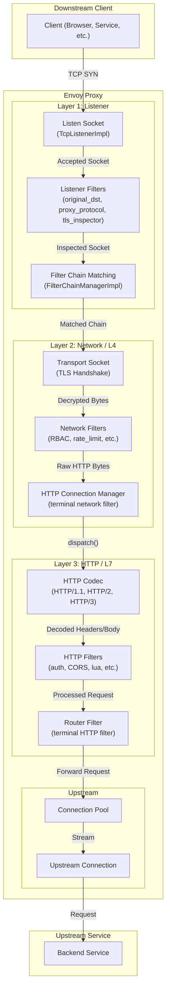
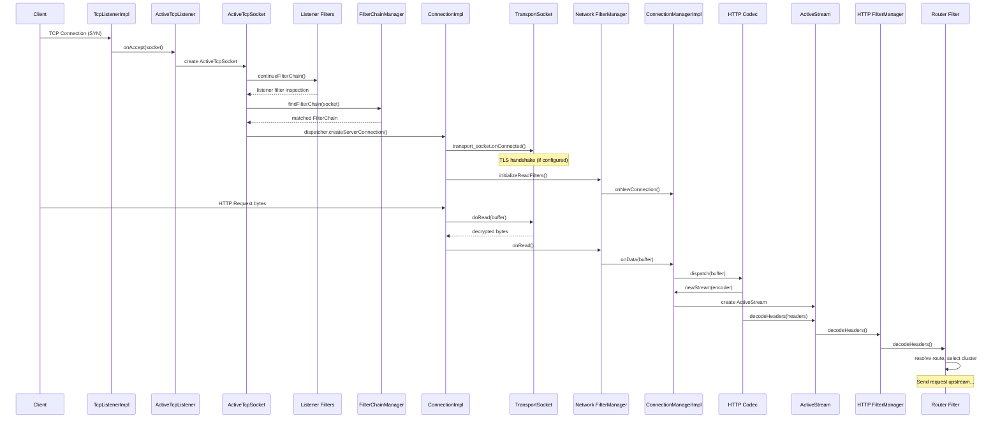

# Part 1: Envoy Request Receive Flow — End-to-End Overview

## Introduction

This document series explains how Envoy receives and processes an HTTP request from a downstream client. The request path touches three major layers — **Listener**, **Network (L4)**, and **HTTP (L7)** — each with its own filter chain. Understanding this architecture is key to debugging, extending, and operating Envoy.

## High-Level Architecture



## The Three Filter Layers

Envoy's filter architecture is layered. Each layer has its own filter chain with distinct responsibilities:

| Layer | Filter Type | When It Runs | Key Responsibility |
|-------|------------|--------------|-------------------|
| **Listener** | `ListenerFilter` | After socket accept, before connection creation | Inspect raw bytes to determine protocol, original destination |
| **Network (L4)** | `ReadFilter` / `WriteFilter` | After connection creation, on every read/write | L4 access control, rate limiting, protocol bridging |
| **HTTP (L7)** | `StreamDecoderFilter` / `StreamEncoderFilter` | After HTTP parsing, per-request | Authentication, routing, header manipulation |

## Key Classes — The Cast of Characters

```mermaid
classDiagram
    class TcpListenerImpl {
        +onSocketEvent()
        -socket_.ioHandle().accept()
    }
    class ActiveTcpListener {
        +onAccept(ConnectionSocketPtr)
        +onAcceptWorker(ActiveTcpSocket)
        +newConnection()
    }
    class ActiveTcpSocket {
        +continueFilterChain()
        +newConnection()
        -accept_filters_
    }
    class ConnectionImpl {
        +onReadReady()
        +write()
        -filter_manager_
        -transport_socket_
    }
    class FilterManagerImpl {
        +onRead()
        +onWrite()
        +addReadFilter()
        -upstream_filters_
        -downstream_filters_
    }
    class ConnectionManagerImpl {
        +onData()
        +newStream()
        -codec_
        -streams_
    }
    class ActiveStream {
        +decodeHeaders()
        +decodeData()
        -filter_manager_
        -response_encoder_
    }
    class HttpFilterManager["FilterManager (HTTP)"] {
        +decodeHeaders()
        +encodeHeaders()
        -decoder_filters_
        -encoder_filters_
    }
    class RouterFilter["Router (Filter)"] {
        +decodeHeaders()
        -upstream_requests_
    }

    TcpListenerImpl --> ActiveTcpListener : "onAccept callback"
    ActiveTcpListener --> ActiveTcpSocket : "creates"
    ActiveTcpSocket --> ConnectionImpl : "newConnection()"
    ConnectionImpl --> FilterManagerImpl : "owns"
    FilterManagerImpl --> ConnectionManagerImpl : "HCM is a ReadFilter"
    ConnectionManagerImpl --> ActiveStream : "creates per request"
    ActiveStream --> HttpFilterManager : "owns"
    HttpFilterManager --> RouterFilter : "terminal decoder filter"
```



## End-to-End Request Flow Summary

The following sequence shows the complete journey of a single HTTP request:



## Document Series Index

| Part | Topic | Key Classes |
|------|-------|-------------|
| [Part 1](01-overview.md) | End-to-End Overview | All |
| [Part 2](02-listener-socket-accept.md) | Listener Layer: Socket Accept | `TcpListenerImpl`, `ActiveTcpListener`, `ActiveTcpSocket` |
| [Part 3](03-listener-filters.md) | Listener Filters | `ListenerFilter`, `ListenerFilterManager`, `ActiveTcpSocket` |
| [Part 4](04-filter-chain-matching.md) | Filter Chain Matching | `FilterChainManagerImpl`, `FilterChainImpl` |
| [Part 5](05-network-filters.md) | Network (L4) Filters | `FilterManagerImpl`, `ReadFilter`, `WriteFilter` |
| [Part 6](06-transport-sockets.md) | Transport Sockets and TLS | `TransportSocket`, `SslSocket` |
| [Part 7](07-http-connection-manager.md) | HTTP Connection Manager | `ConnectionManagerImpl`, `ActiveStream` |
| [Part 8](08-http-codec.md) | HTTP Codec Layer | `ServerConnectionImpl` (HTTP/1, HTTP/2) |
| [Part 9](09-http-filter-manager.md) | HTTP Filter Manager | `FilterManager`, `ActiveStreamDecoderFilter` |
| [Part 10](10-router-filter.md) | Router Filter | `Router::Filter`, `UpstreamRequest` |
| [Part 11](11-connection-pools.md) | Connection Pools | `HttpConnPoolImplBase`, `ActiveClient` |
| [Part 12](12-response-flow.md) | Response Flow | Encoder path, `UpstreamCodecFilter` |

## Source File Map

For reference, the most important source files in the request path:

```
envoy/
├── envoy/                              # Public interfaces
│   ├── network/
│   │   ├── filter.h                    # Network filter interfaces
│   │   ├── listener.h                  # Listener interfaces
│   │   └── transport_socket.h          # Transport socket interface
│   ├── http/
│   │   ├── codec.h                     # HTTP codec interfaces
│   │   ├── filter.h                    # HTTP filter interfaces
│   │   └── filter_factory.h            # HTTP filter factory
│   ├── server/
│   │   └── filter_config.h             # Filter config factories
│   └── router/
│       └── router.h                    # Route interfaces
├── source/
│   ├── common/
│   │   ├── listener_manager/
│   │   │   ├── listener_impl.h/cc      # Listener configuration
│   │   │   ├── active_tcp_listener.h   # Active listener on worker
│   │   │   ├── active_tcp_socket.h     # Socket during listener filters
│   │   │   ├── active_stream_listener_base.h  # Connection creation
│   │   │   └── filter_chain_manager_impl.h    # Filter chain matching
│   │   ├── network/
│   │   │   ├── connection_impl.h/cc    # TCP connection
│   │   │   ├── filter_manager_impl.h   # Network filter manager
│   │   │   └── tcp_listener_impl.h     # Raw TCP listener
│   │   ├── http/
│   │   │   ├── conn_manager_impl.h/cc  # HTTP Connection Manager
│   │   │   ├── filter_manager.h/cc     # HTTP filter manager
│   │   │   ├── http1/codec_impl.h      # HTTP/1 codec
│   │   │   └── http2/codec_impl.h      # HTTP/2 codec
│   │   └── router/
│   │       ├── router.h/cc             # Router filter
│   │       └── upstream_request.h      # Upstream request
│   └── extensions/
│       └── filters/
│           ├── listener/               # Listener filter extensions
│           ├── network/                # Network filter extensions
│           │   └── http_connection_manager/  # HCM config
│           └── http/                   # HTTP filter extensions
│               └── router/             # Router config
```
