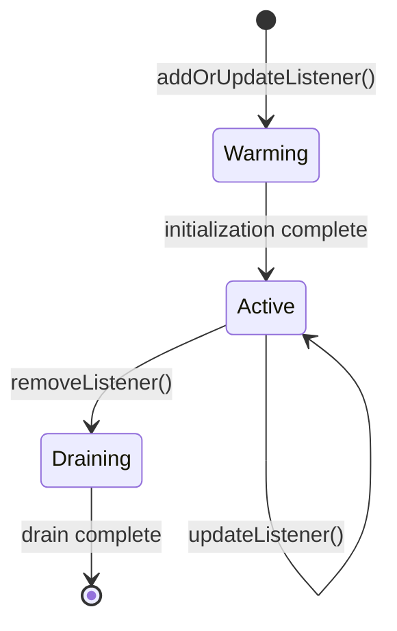
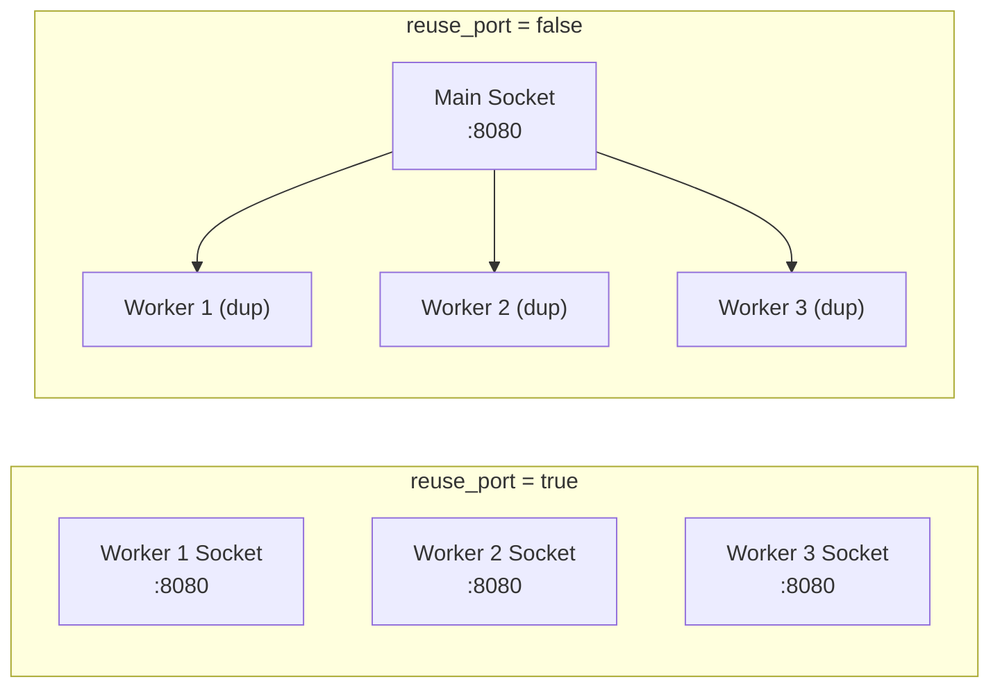
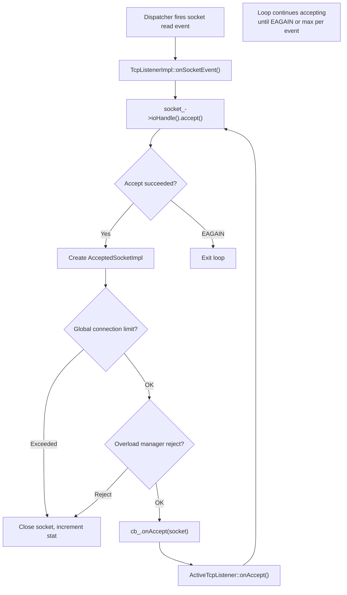
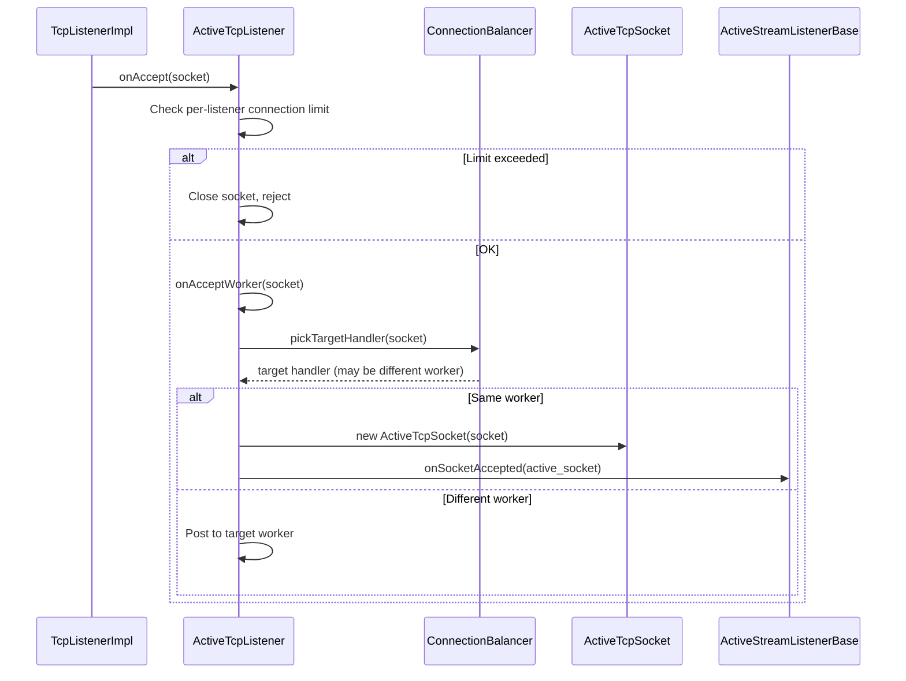
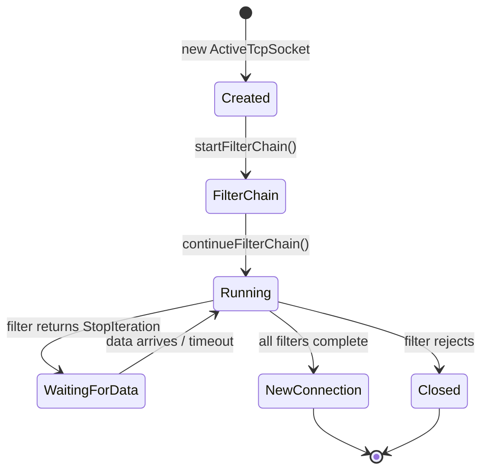
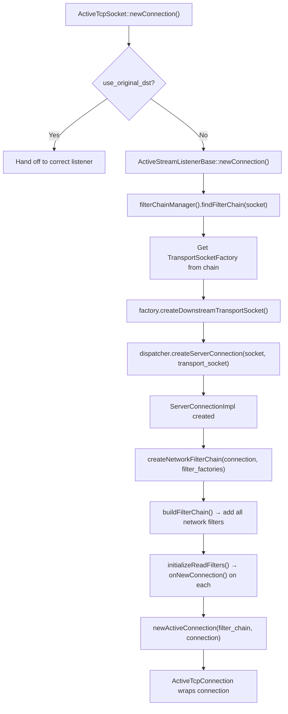
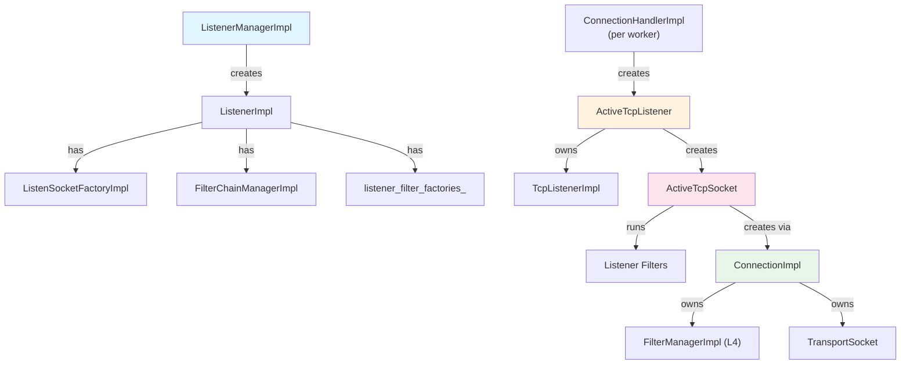

# Part 2: Listener Layer — Socket Accept and Connection Acceptance

## Overview

The listener layer is the very first point of contact between a downstream client and Envoy. When a TCP connection arrives, Envoy must accept the socket, run listener filters, match a filter chain, and create a `Connection` object. This document covers the socket accept path in detail.

## Key Classes

```mermaid
classDiagram
    class ListenerManagerImpl {
        +addOrUpdateListener()
        +addListenerToWorker()
        -active_listeners_
        -warming_listeners_
    }
    class ListenerImpl {
        +createListenerFilterChain()
        +createNetworkFilterChain()
        +filterChainManager()
        -listener_filter_factories_
        -filter_chain_manager_
    }
    class TcpListenerImpl {
        +onSocketEvent()
        -socket_ : SocketSharedPtr
        -cb_ : TcpListenerCallbacks
    }
    class ActiveTcpListener {
        +onAccept(socket)
        +onAcceptWorker(socket)
        +newActiveConnection()
        -connection_balancer_
    }
    class ActiveTcpSocket {
        +continueFilterChain()
        +newConnection()
        -accept_filters_
        -socket_
    }
    class ConnectionHandlerImpl {
        +addListener()
        -listeners_
    }

    ListenerManagerImpl --> ListenerImpl : "creates"
    ListenerManagerImpl --> ConnectionHandlerImpl : "distributes to workers"
    ConnectionHandlerImpl --> ActiveTcpListener : "creates per address"
    ActiveTcpListener --> TcpListenerImpl : "owns (Network::Listener)"
    TcpListenerImpl --> ActiveTcpListener : "onAccept callback"
    ActiveTcpListener --> ActiveTcpSocket : "creates per accepted socket"
```

## Listener Lifecycle

### 1. ListenerManagerImpl — Configuration to Runtime

`ListenerManagerImpl` (`source/common/listener_manager/listener_manager_impl.h`) is the brain of listener management. It:

- Receives listener configs from LDS or static config
- Creates `ListenerImpl` objects (warming → active lifecycle)
- Distributes active listeners to worker threads via `ConnectionHandlerImpl`



### 2. ListenerImpl — The Configuration Object

`ListenerImpl` (`source/common/listener_manager/listener_impl.h:165-401`) is **not** an active listener — it is the configuration holder. It implements two key interfaces:

- **`Network::ListenerConfig`** — provides socket factories, filter chain manager, stats
- **`Network::FilterChainFactory`** — creates listener and network filter chains

Key fields:

| Field | Type | Purpose |
|-------|------|---------|
| `listener_filter_factories_` | `ListenerFilterFactoriesList` | Factories for listener filters |
| `filter_chain_manager_` | `FilterChainManagerImpl` | Matches connections to filter chains |
| `listen_socket_factories_` | `ListenSocketFactoryImpl` | Creates/manages listen sockets |
| `connection_balancer_` | `ConnectionBalancer` | Distributes connections across workers |

### 3. ListenSocketFactoryImpl — Socket Creation

`ListenSocketFactoryImpl` (`source/common/listener_manager/listener_impl.h:60-105`) manages the actual listen sockets:

- With `reuse_port`: each worker gets its own listen socket (kernel-level load balancing)
- Without `reuse_port`: sockets are duplicated from a single listen socket



## Socket Accept Flow

### 4. TcpListenerImpl — The Event Loop Listener

`TcpListenerImpl` (`source/common/network/tcp_listener_impl.cc:57-132`) is registered with the event loop (libevent). When a socket becomes readable:



The accept loop handles multiple connections per event to avoid starvation:

```
File: source/common/network/tcp_listener_impl.cc (lines 57-132)

1. Event fires → onSocketEvent()
2. Loop:
   a. socket_->ioHandle().accept() → new ConnectionSocket
   b. Check global connection limit
   c. Check overload manager (reject fraction)
   d. Call cb_.onAccept(std::make_unique<AcceptedSocketImpl>(...))
   e. Repeat until EAGAIN
```

### 5. ActiveTcpListener — Worker-Level Connection Handler

`ActiveTcpListener` (`source/common/listener_manager/active_tcp_listener.h:27-86`) sits on each worker thread and implements `Network::TcpListenerCallbacks`:



The `ConnectionBalancer` can redirect a socket to a different worker — this is used by the DLB (Dynamic Load Balancer) extension for hardware-accelerated connection distribution.

### 6. ActiveTcpSocket — Socket During Listener Filter Processing

`ActiveTcpSocket` (`source/common/listener_manager/active_tcp_socket.h:28-92`) wraps the accepted socket while listener filters are running. It implements:

- **`Network::ListenerFilterManager`** — filters register themselves here
- **`Network::ListenerFilterCallbacks`** — filters call back into this



## Connection Creation

### 7. From Socket to Connection

After all listener filters complete, `ActiveTcpSocket::newConnection()` is called, which leads to `ActiveStreamListenerBase::newConnection()`:



```
File: source/common/listener_manager/active_stream_listener_base.cc (lines 20-49)

1. findFilterChain(socket, stream_info) → matched FilterChainImpl
2. Create transport socket (e.g., TLS) from the chain
3. dispatcher.createServerConnection(socket, transport_socket)
4. createNetworkFilterChain(connection, network_filter_factories)
5. newActiveConnection() → ActiveTcpConnection tracks the connection
```

## Class Relationship Summary



## Key Source Files

| File | Lines | What It Does |
|------|-------|-------------|
| `source/common/listener_manager/listener_manager_impl.h` | 174-314 | Listener lifecycle management |
| `source/common/listener_manager/listener_impl.h` | 165-401 | Listener config and filter chain factory |
| `source/common/network/tcp_listener_impl.cc` | 57-132 | Raw socket accept loop |
| `source/common/listener_manager/active_tcp_listener.h` | 27-86 | Per-worker active listener |
| `source/common/listener_manager/active_tcp_socket.h` | 28-92 | Socket during listener filter processing |
| `source/common/listener_manager/active_stream_listener_base.cc` | 20-49 | Connection creation after filter chain match |

---

**Next:** [Part 3 — Listener Filters: Creation and Chain Execution](03-listener-filters.md)
