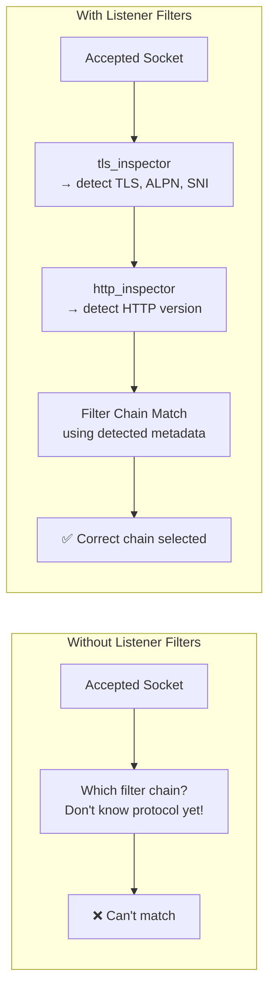
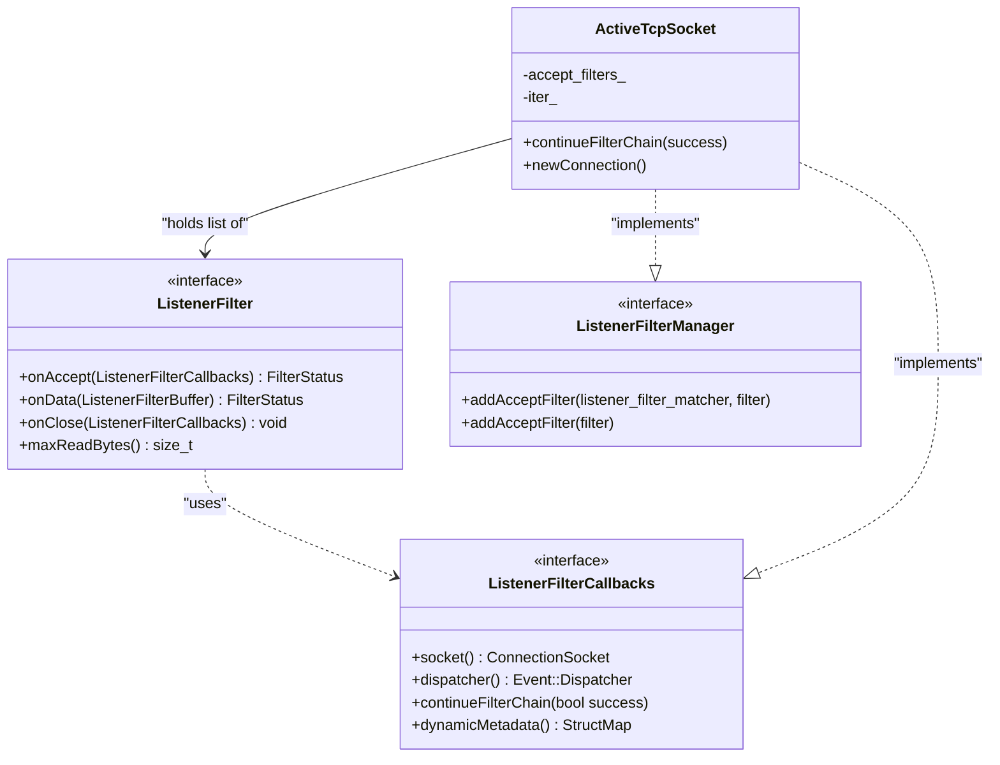
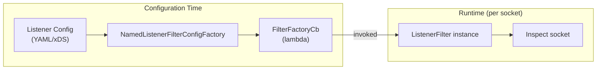
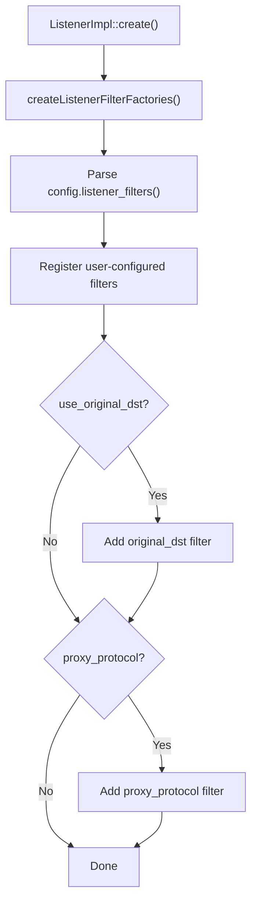
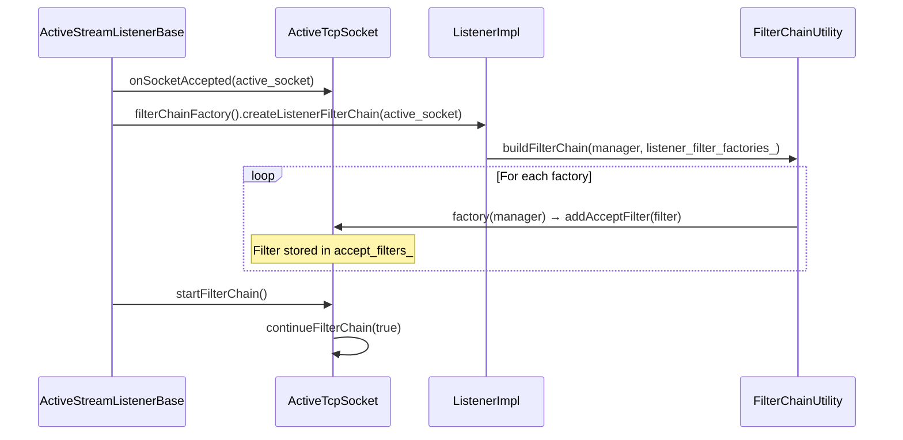
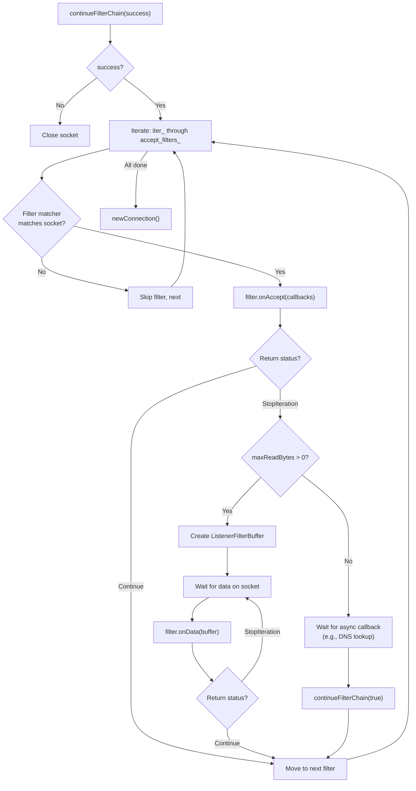
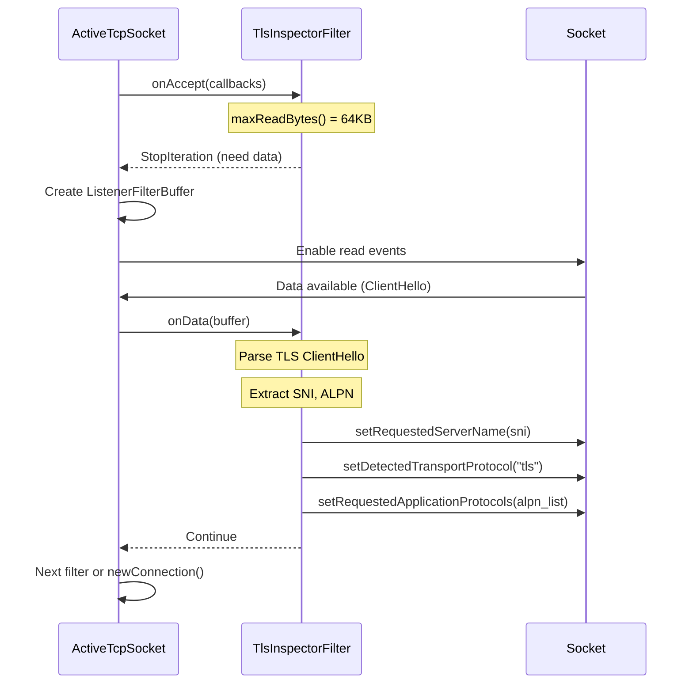
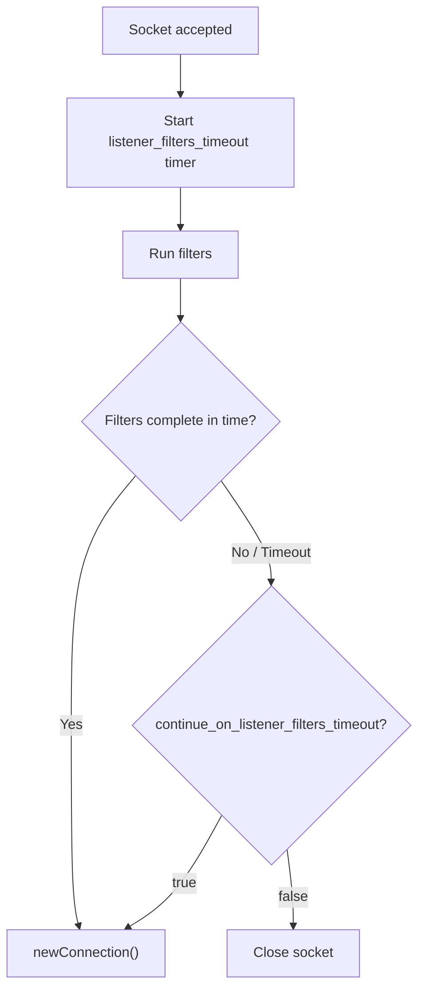
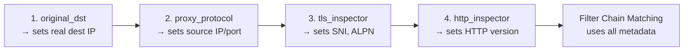

# Part 3: Listener Filters — Creation and Chain Execution

## Overview

Listener filters run immediately after a socket is accepted, **before** a connection object is created. They inspect raw bytes on the socket to determine protocol information (TLS vs plaintext, HTTP version, original destination) that is needed to select the correct filter chain.

## Why Listener Filters Exist



The key insight: filter chain matching needs information (SNI, ALPN, transport protocol) that can only be determined by peeking at the raw bytes on the socket.

## Common Listener Filters

| Filter | Purpose | What It Sets |
|--------|---------|-------------|
| `tls_inspector` | Peeks at ClientHello to detect TLS | SNI, ALPN, transport_protocol="tls" |
| `http_inspector` | Detects HTTP version from first bytes | application_protocol="h2c" or "http/1.1" |
| `original_dst` | Gets original destination from SO_ORIGINAL_DST | Restored destination address |
| `proxy_protocol` | Parses PROXY protocol header | Source/dest addresses from proxy header |

## Listener Filter Interface



**Interface location:** `envoy/network/filter.h` (lines 334-365)

Key methods:
- `onAccept(callbacks)` — called when the socket is accepted, can inspect/modify socket metadata
- `onData(buffer)` — called when data is available on the socket (for filters that need to read bytes)
- `maxReadBytes()` — how many bytes this filter needs to peek at
- `onClose()` — cleanup when the socket is closed during filter processing

## Listener Filter Factory Pattern

### Factory Registration

Each listener filter type has a factory that implements `NamedListenerFilterConfigFactory`:



### Factory Creation in ListenerImpl

```
File: source/common/listener_manager/listener_impl.cc (lines 434-459)

createListenerFilterFactories():
  1. For each listener_filter in config:
     a. Look up factory by name in registry
     b. Call factory.createListenerFilterFactoryFromProto(config, context)
     c. Store returned FilterFactoryCb in listener_filter_factories_
  2. Add built-in filters:
     a. buildOriginalDstListenerFilter() — if use_original_dst is set
     b. buildProxyProtocolListenerFilter() — if proxy_protocol is configured
```

### Built-in Listener Filters

Some listener filters are added implicitly based on listener configuration:



## Filter Chain Execution

### Creating the Chain

When a socket is accepted, `ActiveStreamListenerBase::onSocketAccepted()` creates the listener filter chain:



```
File: source/common/listener_manager/listener_impl.cc (lines 706-714)

ListenerImpl::createListenerFilterChain(manager):
  FilterChainUtility::buildFilterChain(manager, listener_filter_factories_)
  → For each factory: factory(manager) calls addAcceptFilter()
```

### Iterating Filters

`ActiveTcpSocket::continueFilterChain()` drives the iteration:



```
File: source/common/listener_manager/active_tcp_socket.cc (lines 109-173)

continueFilterChain(success):
  1. If !success → close socket, return
  2. For each filter in accept_filters_ (starting from iter_):
     a. If filter matcher doesn't match → skip
     b. Call filter->onAccept(*this)
     c. If StopIteration:
        - If filter needs data (maxReadBytes > 0):
          Create ListenerFilterBuffer, wait for bytes
        - Else: wait for async continueFilterChain() callback
        - Return (will resume later)
     d. If Continue → advance to next filter
  3. All filters done → newConnection()
```

### Example: TLS Inspector Filter Flow



## Timeout Handling

Listener filters have a configurable timeout. If filters don't complete within this time:



The timeout prevents listener filters from holding a socket indefinitely (e.g., waiting for bytes that never arrive from a non-TLS client on a TLS-expected listener).

## Filter Order Matters

Listener filter ordering is critical because each filter may set metadata that subsequent filters or the filter chain matcher depends on:



## Key Source Files

| File | Lines | What It Does |
|------|-------|-------------|
| `envoy/network/filter.h` | 334-365 | `ListenerFilter` interface |
| `source/common/listener_manager/listener_impl.cc` | 434-459 | Creates listener filter factories |
| `source/common/listener_manager/listener_impl.cc` | 706-714 | `createListenerFilterChain()` |
| `source/common/listener_manager/active_tcp_socket.cc` | 109-173 | `continueFilterChain()` iteration |
| `source/common/listener_manager/active_tcp_socket.h` | 28-92 | `ActiveTcpSocket` class |
| `source/server/configuration_impl.cc` | 46-57 | `buildFilterChain()` for listener filters |

---

**Previous:** [Part 2 — Listener Layer: Socket Accept](02-listener-socket-accept.md)  
**Next:** [Part 4 — Filter Chain Matching and Selection](04-filter-chain-matching.md)
