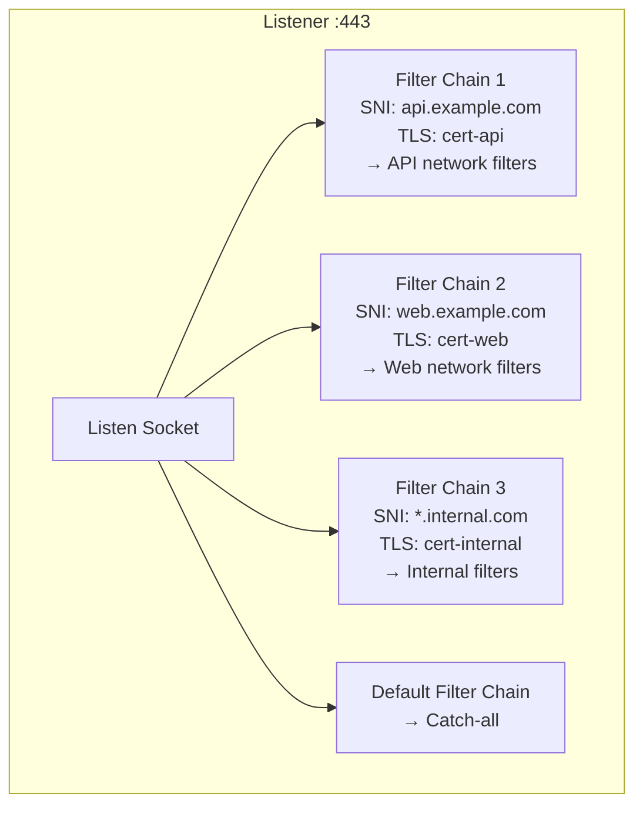
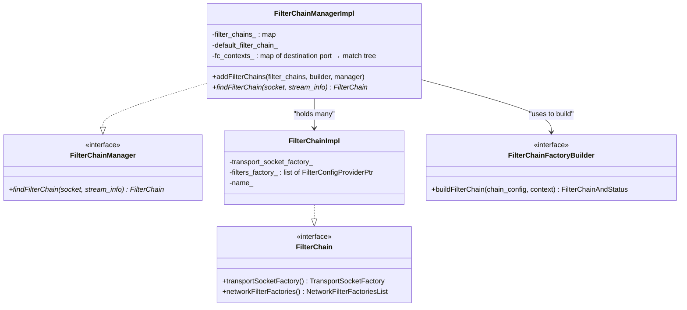
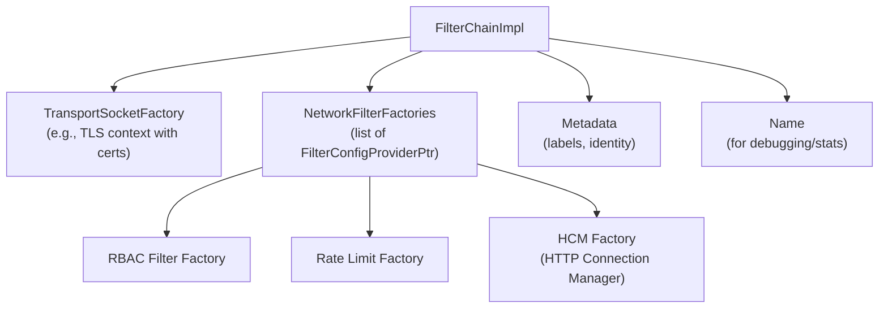
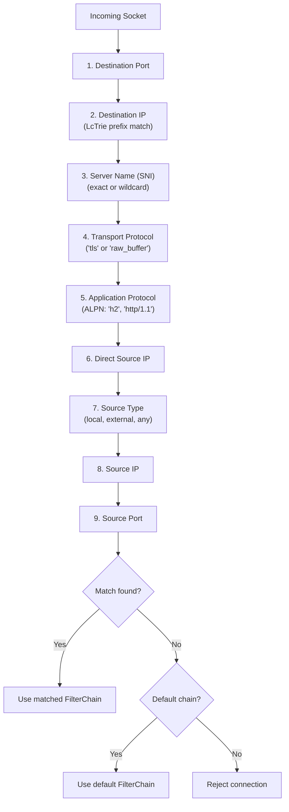
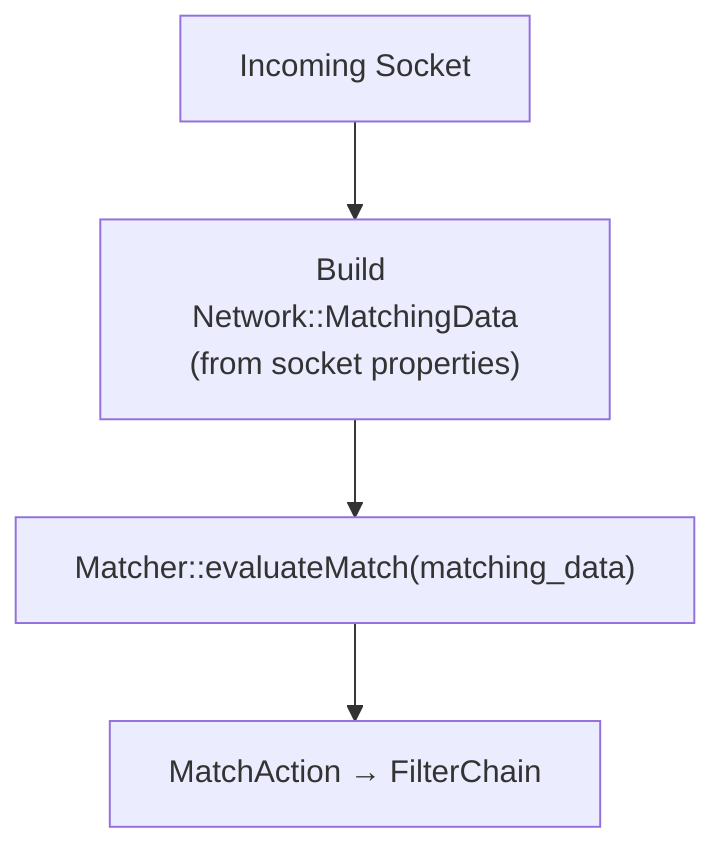
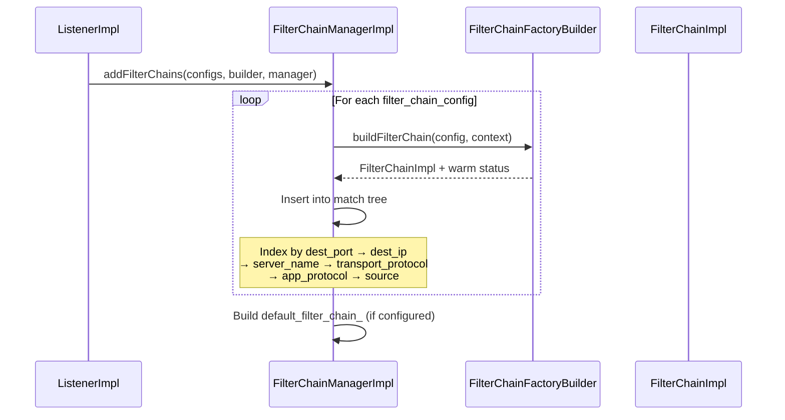
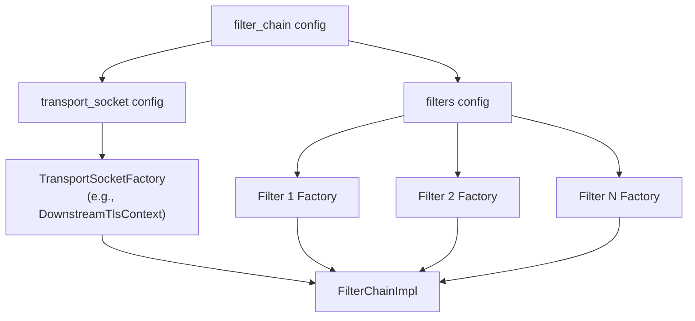
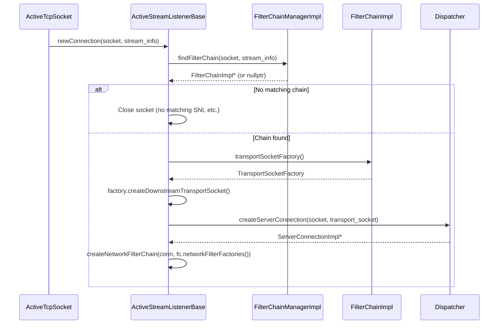
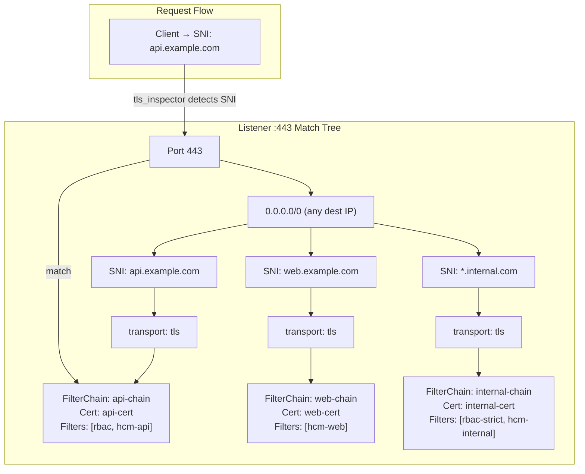

# Part 4: Filter Chain Matching and Selection

## Overview

After listener filters finish inspecting the socket, Envoy must select which **filter chain** to use for the new connection. A single listener can have multiple filter chains, each with different TLS contexts, network filters, and configurations. The `FilterChainManagerImpl` performs a hierarchical match against socket properties to find the best chain.

## Why Multiple Filter Chains?

A single listener on port 443 might serve multiple domains with different TLS certificates and different backend configurations:



## Key Classes



## FilterChainImpl — What a Filter Chain Contains

`FilterChainImpl` (`source/common/listener_manager/filter_chain_manager_impl.h:105-135`) holds everything needed to set up a connection:



Each `FilterConfigProviderPtr<FilterFactoryCb>` can be:
- **Static:** factory created at config time, never changes
- **Dynamic (ECDS):** factory updated via xDS, can be missing during warm-up

## The Matching Algorithm

### Hierarchical Match Tree

`FilterChainManagerImpl` builds a multi-level trie/map structure for efficient matching:



### Match Priority

Each level performs matching in the following priority:

| Level | Socket Property | Match Method |
|-------|----------------|-------------|
| 1 | Destination port | Exact match |
| 2 | Destination IP | Longest prefix match (CIDR) via LcTrie |
| 3 | Server name (SNI) | Exact → suffix wildcard (*.example.com) |
| 4 | Transport protocol | Exact ("tls", "raw_buffer") |
| 5 | Application protocol | Exact ("h2", "http/1.1") |
| 6 | Direct source IP | Longest prefix match |
| 7 | Source type | Local → External → Any |
| 8 | Source IP | Longest prefix match |
| 9 | Source port | Exact match |

### Matcher-Based Matching (Alternative)

Envoy also supports a newer unified matcher framework. When configured:



```
File: source/common/listener_manager/filter_chain_manager_impl.cc (lines 366-393)

findFilterChain(socket, stream_info):
  if matcher configured:
    → Build MatchingData from socket
    → evaluateMatch() using xDS matcher
    → Return matched FilterChain from action
  else:
    → Hierarchical multi-level lookup through fc_contexts_
```

## How Filter Chains Are Built

### At Configuration Time

When a listener is created or updated, `FilterChainManagerImpl::addFilterChains()` processes the config:



### FilterChainFactoryBuilder

The builder creates the `FilterChainImpl` by:

1. Creating `DownstreamTransportSocketFactory` (TLS context) from `transport_socket` config
2. Creating network filter factories from `filters` config
3. Wrapping everything in a `FilterChainImpl`



## Connection Creation with Matched Chain

After `findFilterChain()` returns a chain, `ActiveStreamListenerBase::newConnection()` uses it:



## Example: Multi-Domain TLS Listener



## Key Source Files

| File | Lines | What It Does |
|------|-------|-------------|
| `source/common/listener_manager/filter_chain_manager_impl.h` | 105-135 | `FilterChainImpl` class |
| `source/common/listener_manager/filter_chain_manager_impl.h` | 139-276 | `FilterChainManagerImpl` class |
| `source/common/listener_manager/filter_chain_manager_impl.cc` | 366-393 | `findFilterChain()` entry point |
| `envoy/network/filter.h` | ~380-410 | `FilterChain` and `FilterChainManager` interfaces |
| `source/common/listener_manager/active_stream_listener_base.cc` | 20-49 | Uses matched chain to create connection |

---

**Previous:** [Part 3 — Listener Filters](03-listener-filters.md)  
**Next:** [Part 5 — Network (L4) Filters: Creation and Data Flow](05-network-filters.md)
