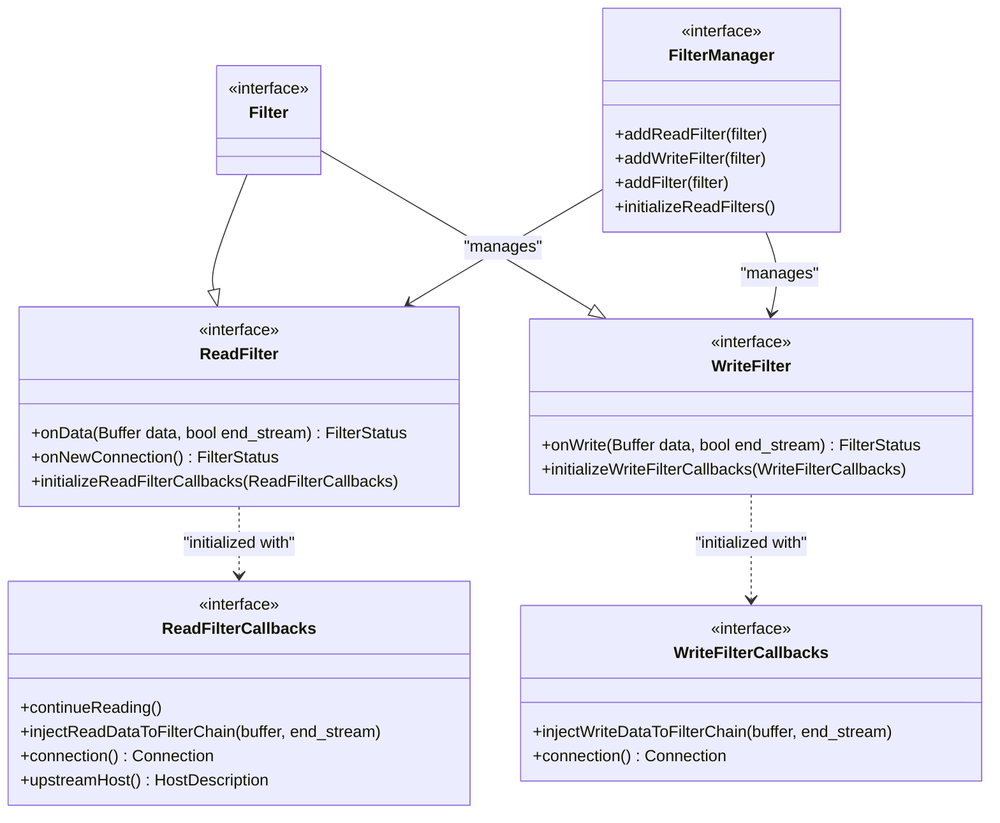
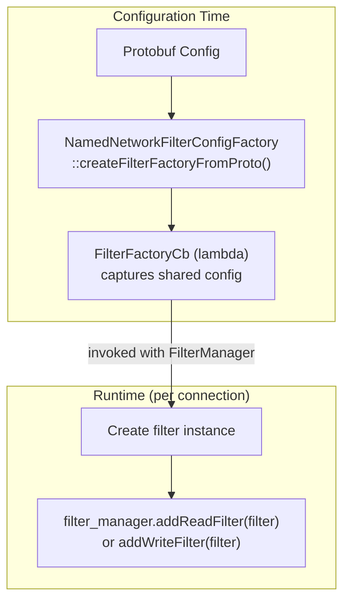
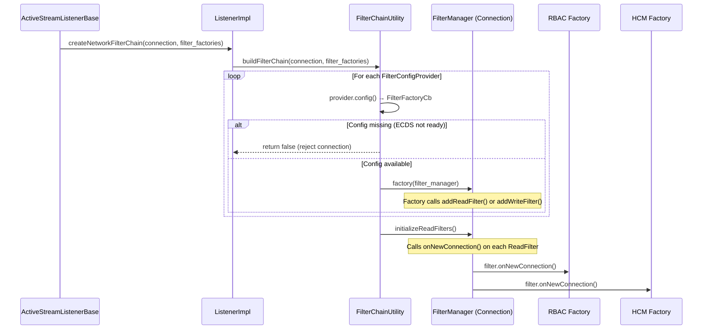
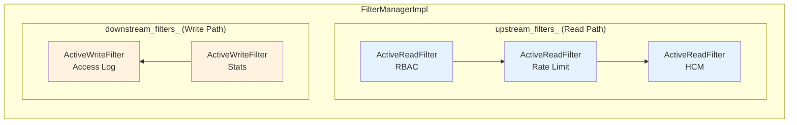
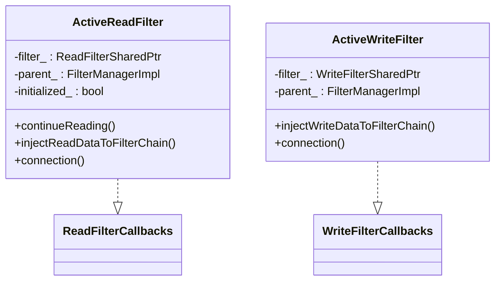
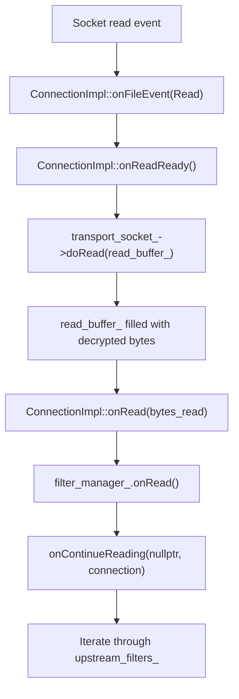
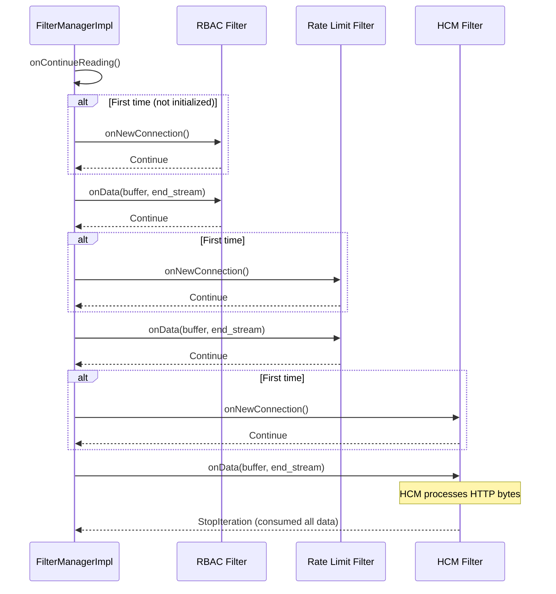
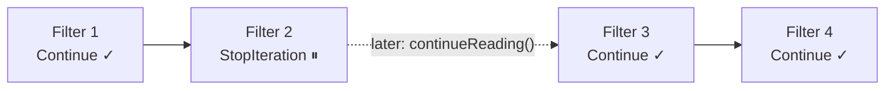
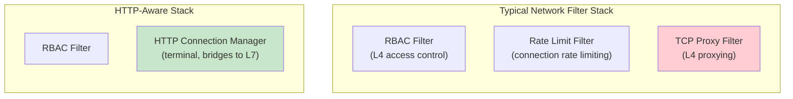

# Part 5: Network (L4) Filters — Creation and Data Flow

## Overview

Network filters operate at Layer 4, processing raw bytes flowing through a TCP connection. They sit between the transport socket (which handles TLS) and the application layer. The most important network filter is the HTTP Connection Manager (HCM), which bridges L4 and L7.

## Network Filter Interfaces



**Interface location:** `envoy/network/filter.h`

- `ReadFilter` (lines 243-286) — processes incoming data (downstream → upstream direction)
- `WriteFilter` (lines 123-149) — processes outgoing data (upstream → downstream direction)
- `Filter` (lines 291-294) — combines both read and write

## Network Filter Factory Pattern

### NamedNetworkFilterConfigFactory

Each network filter extension provides a factory:



```
File: envoy/server/filter_config.h (lines 156-191)

class NamedNetworkFilterConfigFactory : public ProtocolOptionsFactory {
    virtual absl::StatusOr<Network::FilterFactoryCb>
        createFilterFactoryFromProto(config, context) = 0;
};
```

### Example: TCP Proxy Filter Factory

```
File: source/extensions/filters/network/tcp_proxy/config.cc (lines 14-18)

Network::FilterFactoryCb createFilterFactoryFromProtoTyped(...) {
    auto filter_config = std::make_shared<TcpProxy::Config>(proto_config, context);
    return [filter_config, &context](Network::FilterManager& filter_manager) {
        filter_manager.addReadFilter(
            std::make_shared<TcpProxy::Filter>(filter_config, context.clusterManager()));
    };
}
```

Key pattern: the **config** object is shared (created once), but a new **filter** instance is created per connection.

## Building the Network Filter Chain

### buildFilterChain

When a new connection is created, `createNetworkFilterChain()` triggers filter chain construction:



```
File: source/server/configuration_impl.cc (lines 32-44)

bool FilterChainUtility::buildFilterChain(FilterManager& filter_manager,
                                          const NetworkFilterFactoriesList& factories) {
    for (const auto& filter_config_provider : factories) {
        auto config = filter_config_provider->config();
        if (!config.has_value()) return false;   // ECDS not ready
        Network::FilterFactoryCb& factory = config.value();
        factory(filter_manager);                  // adds filters to manager
    }
    return filter_manager.initializeReadFilters(); // calls onNewConnection()
}
```

## FilterManagerImpl — The Engine

`FilterManagerImpl` (`source/common/network/filter_manager_impl.h:107-196`) stores and iterates network filters:

### Internal Structure



- **`upstream_filters_`** — read filters in FIFO order (first added = first called)
- **`downstream_filters_`** — write filters in LIFO order (first added = first called, reverse insertion)

### ActiveReadFilter and ActiveWriteFilter

Each filter is wrapped in an `ActiveReadFilter` or `ActiveWriteFilter` that implements the callback interfaces:



### Adding Filters

```
File: source/common/network/filter_manager_impl.cc (lines 14-30)

addReadFilter(filter):
    1. Create ActiveReadFilter wrapping the filter
    2. filter->initializeReadFilterCallbacks(*active_filter)
    3. LinkedList::moveIntoListBack(active_filter, upstream_filters_)  // FIFO

addWriteFilter(filter):
    1. Create ActiveWriteFilter wrapping the filter
    2. filter->initializeWriteFilterCallbacks(*active_filter)
    3. LinkedList::moveIntoList(active_filter, downstream_filters_)  // LIFO (prepend)

addFilter(filter):  // dual read+write filter
    addReadFilter(filter)
    addWriteFilter(filter)
```

## Data Flow — Read Path

### How Data Reaches Filters



### Filter Iteration (Read)



```
File: source/common/network/filter_manager_impl.cc (lines 62-97)

onContinueReading(filter, connection):
    For each ActiveReadFilter (starting from 'filter' or first):
        1. If not initialized:
           status = filter->onNewConnection()
           If StopIteration → stop, resume later
        2. If initialized and buffer has data:
           status = filter->onData(buffer, end_stream)
           If StopIteration → stop, resume later
        3. If Continue → advance to next filter
```

### Filter Return Values

| Return Value | Meaning |
|-------------|---------|
| `FilterStatus::Continue` | Data passes to the next filter |
| `FilterStatus::StopIteration` | Stop iteration; filter will call `continueReading()` when ready |

### Resuming Iteration

When a filter calls `continueReading()`, iteration resumes from the **next** filter:



## Data Flow — Write Path

### How Data Is Written

```mermaid
flowchart TD
    A["Application calls connection.write(data)"] --> B["ConnectionImpl::write()"]
    B --> C{"through_filter_chain?"}
    C -->|Yes| D["filter_manager_.onWrite()"]
    D --> E["Iterate downstream_filters_"]
    E --> F{All Continue?}
    F -->|Yes| G["Move data to write_buffer_"]
    F -->|No (StopIteration)| H["Buffer data, wait for resume"]
    G --> I["Schedule write event"]
    I --> J["ConnectionImpl::onWriteReady()"]
    J --> K["transport_socket_->doWrite(write_buffer_)"]
    K --> L["Encrypted bytes sent to socket"]
    C -->|No| G
```

```
File: source/common/network/filter_manager_impl.cc (lines 174-206)

onWrite():
    For each ActiveWriteFilter:
        status = filter->onWrite(buffer, end_stream)
        If StopIteration → stop, wait for injectWriteDataToFilterChain()
    If all Continue → return Continue (data ready to send)
```

## Common Network Filters



The **terminal** network filter is either:
- `tcp_proxy` — for L4 TCP proxying
- `http_connection_manager` — for HTTP proxying (most common)

## Key Source Files

| File | Lines | What It Does |
|------|-------|-------------|
| `envoy/network/filter.h` | 123-341 | All network filter interfaces |
| `source/common/network/filter_manager_impl.h` | 107-196 | `FilterManagerImpl` class |
| `source/common/network/filter_manager_impl.cc` | 14-30 | Adding filters |
| `source/common/network/filter_manager_impl.cc` | 62-97 | Read path iteration |
| `source/common/network/filter_manager_impl.cc` | 174-206 | Write path iteration |
| `source/server/configuration_impl.cc` | 32-44 | `buildFilterChain()` |
| `envoy/server/filter_config.h` | 156-191 | `NamedNetworkFilterConfigFactory` |
| `source/common/network/connection_impl.cc` | 367-396 | `onRead()` dispatches to filters |
| `source/common/network/connection_impl.cc` | 504-551 | `write()` dispatches to filters |

---

**Previous:** [Part 4 — Filter Chain Matching](04-filter-chain-matching.md)  
**Next:** [Part 6 — Transport Sockets and TLS](06-transport-sockets.md)
