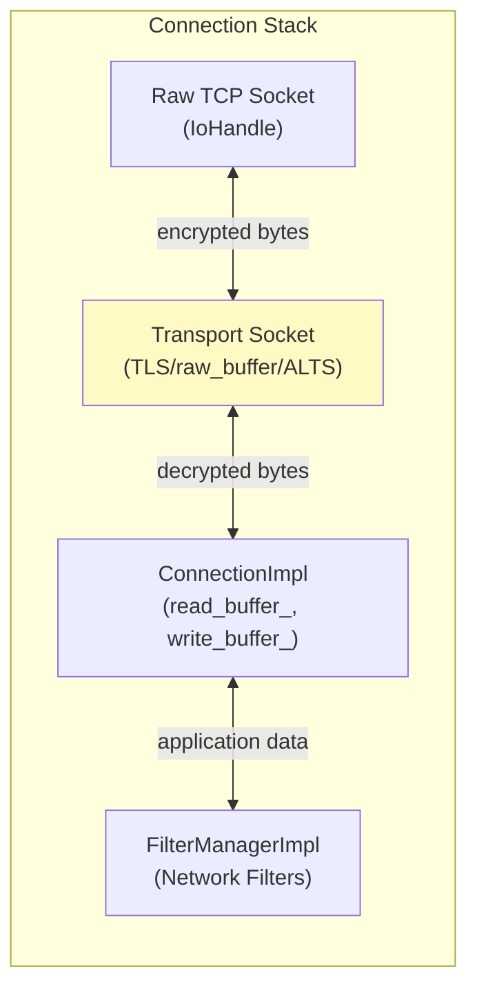
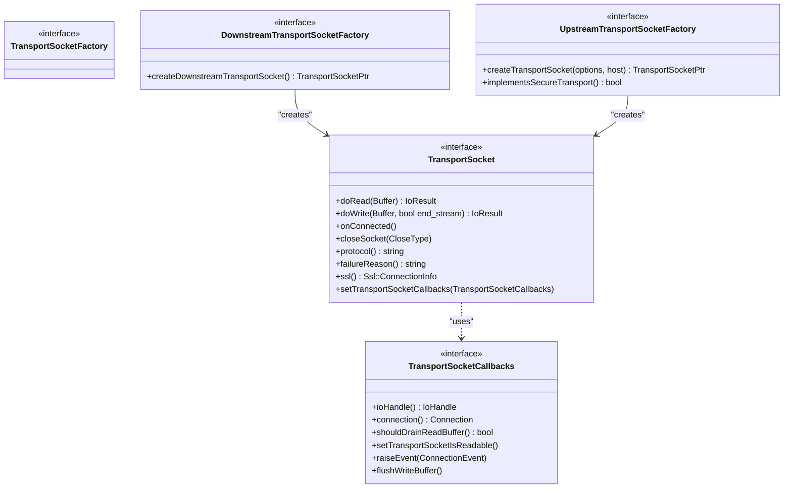
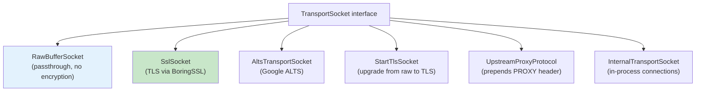
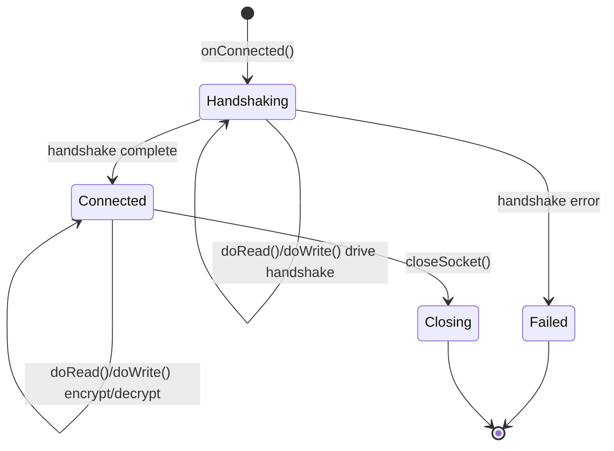
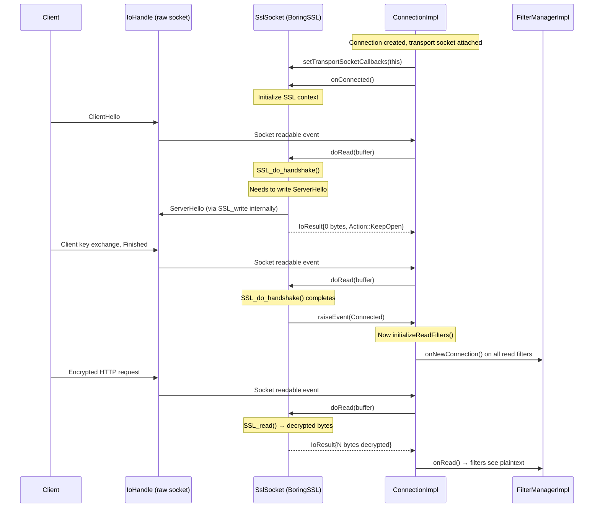
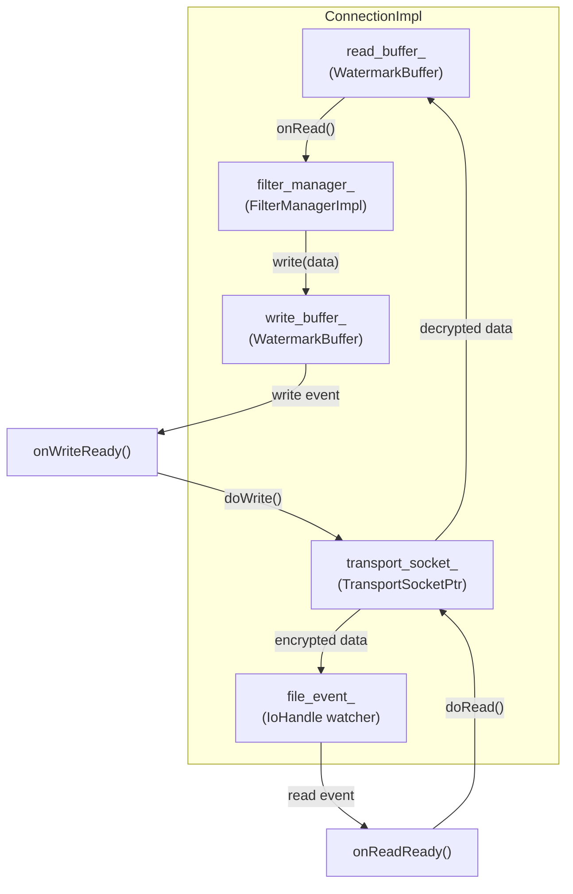
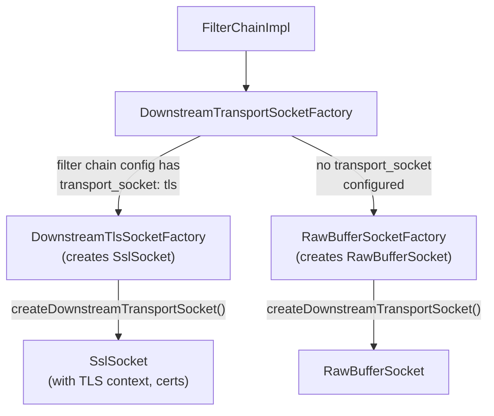
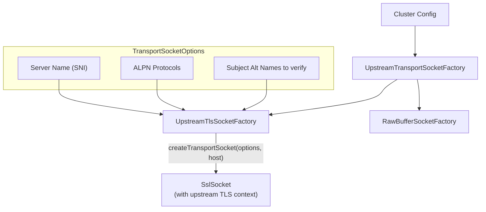
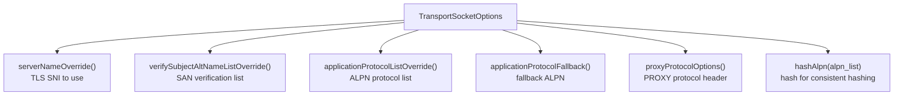

# Part 6: Transport Sockets and TLS Handshake

## Overview

Transport sockets are an abstraction layer between the raw TCP connection and the network filter chain. They handle encryption/decryption (TLS), protocol wrapping (STARTTLS, ALTS), and transparent passthrough (raw buffer). The transport socket is selected based on the matched filter chain and wraps all I/O operations.

## Where Transport Sockets Fit



## Transport Socket Interface



**Interface location:** `envoy/network/transport_socket.h`

- `TransportSocket` (lines 116-203) — the per-connection socket wrapper
- `TransportSocketCallbacks` (lines 40-100) — connection provides these to the transport socket
- `DownstreamTransportSocketFactory` (lines 250-288) — creates sockets for incoming connections
- `UpstreamTransportSocketFactory` (lines 293-339) — creates sockets for outgoing connections

## Transport Socket Types



### Raw Buffer Socket

The simplest transport socket — direct passthrough with no transformation:

```
doRead(buffer)  → buffer.read(io_handle, ...)    // straight read
doWrite(buffer) → buffer.write(io_handle, ...)   // straight write
onConnected()   → raiseEvent(Connected)          // immediate
```

### TLS (SSL) Socket

The most common transport socket — handles the TLS handshake and encryption:



## TLS Handshake Flow (Downstream)



## Transport Socket in Connection Lifecycle

### ConnectionImpl and Transport Socket Integration

`ConnectionImpl` (`source/common/network/connection_impl.h:49-257`) owns the transport socket and implements `TransportSocketCallbacks`:



### Read Path Through Transport Socket

```
File: source/common/network/connection_impl.cc (lines 618-660)

onReadReady():
    1. result = transport_socket_->doRead(*read_buffer_)
    2. if (result.bytes_read > 0 || result.end_stream):
         onRead(result.bytes_read)
           → filter_manager_.onRead()
    3. if (result.action == Action::Close):
         closeSocket(FlushWrite)
```

### Write Path Through Transport Socket

```
File: source/common/network/connection_impl.cc (lines 504-551, then onWriteReady)

write(data, end_stream):
    1. filter_manager_.onWrite()  → write filters process data
    2. Move data to write_buffer_
    3. Schedule write event

onWriteReady():
    1. result = transport_socket_->doWrite(*write_buffer_, end_stream)
    2. Handle partial writes, high watermarks
    3. If write_buffer_ empty and end_stream → close
```

## Transport Socket Factory Selection

### Downstream (Server Side)

The transport socket factory comes from the matched `FilterChainImpl`:



### Upstream (Client Side)

For upstream connections, the transport socket comes from the cluster config:



```
File: source/common/upstream/upstream_impl.cc (lines 477-503)

HostImplBase::createConnection():
    1. Resolve transport socket factory (via transport socket matcher)
    2. socket_factory.createTransportSocket(transport_socket_options, host)
    3. dispatcher.createClientConnection(address, source, transport_socket, ...)
```

## Transport Socket Options

`TransportSocketOptions` (`envoy/network/transport_socket.h:207-274`) carries metadata for transport socket creation:



## Key Source Files

| File | Lines | What It Does |
|------|-------|-------------|
| `envoy/network/transport_socket.h` | 116-203 | `TransportSocket` interface |
| `envoy/network/transport_socket.h` | 40-100 | `TransportSocketCallbacks` |
| `envoy/network/transport_socket.h` | 250-339 | Transport socket factory interfaces |
| `envoy/network/transport_socket.h` | 207-274 | `TransportSocketOptions` |
| `source/common/network/connection_impl.h` | 49-257 | `ConnectionImpl` owns transport socket |
| `source/common/network/connection_impl.cc` | 68-99 | Connection setup with transport socket |
| `source/common/network/connection_impl.cc` | 618-660 | `onReadReady()` reads via transport socket |
| `source/common/network/raw_buffer_socket.h` | — | Raw passthrough transport socket |
| `source/common/tls/client_ssl_socket.h` | — | Upstream TLS transport socket |
| `source/common/tls/server_ssl_socket.h` | — | Downstream TLS transport socket |
| `source/common/upstream/upstream_impl.cc` | 477-503 | Upstream connection creation |

---

**Previous:** [Part 5 — Network (L4) Filters](05-network-filters.md)  
**Next:** [Part 7 — HTTP Connection Manager](07-http-connection-manager.md)
